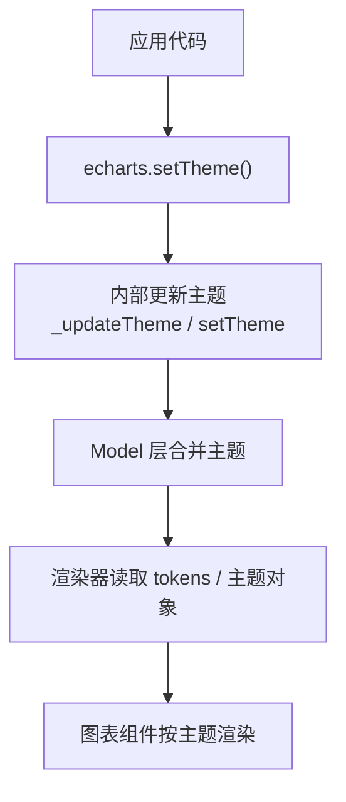
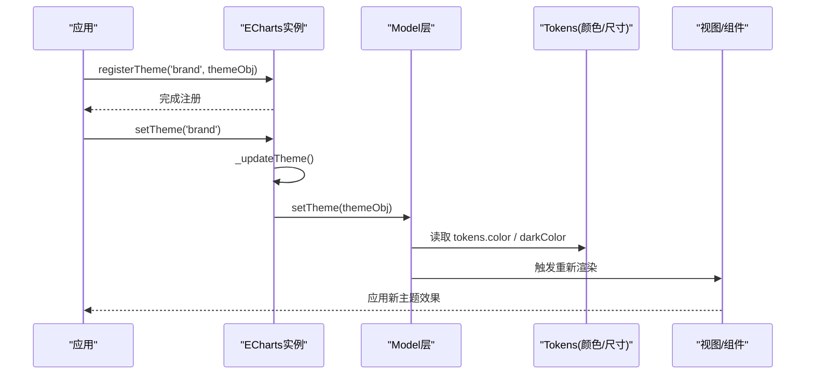
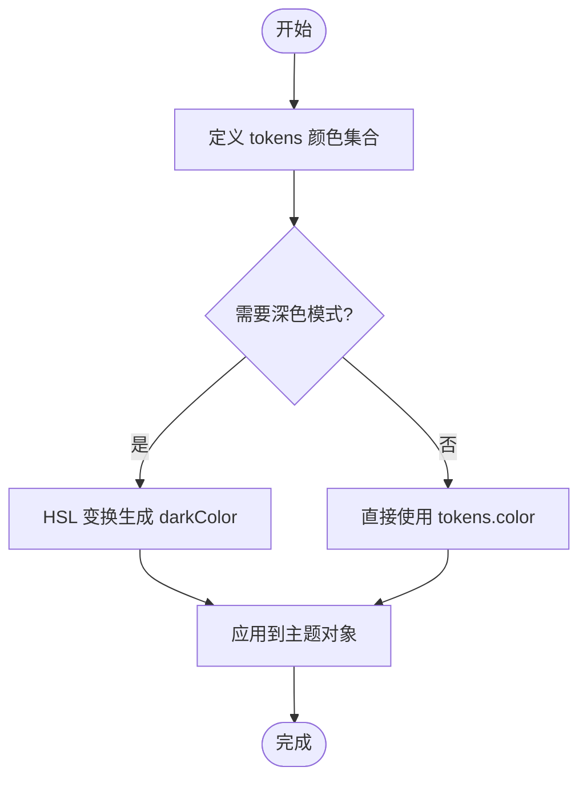
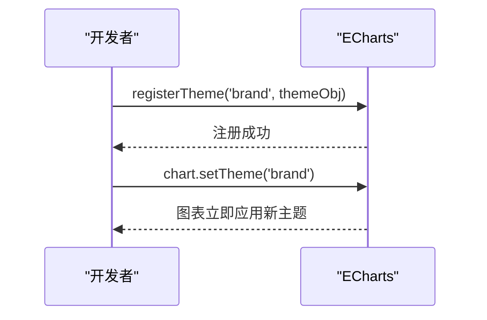
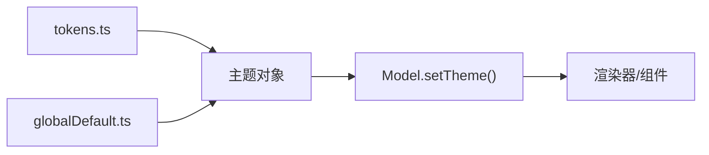

# 自定义主题开发

<cite>
**本文引用的文件**
- [src/theme/dark.ts](file://src/theme/dark.ts)
- [theme/dark.js](file://theme/dark.js)
- [theme/macarons.js](file://theme/macarons.js)
- [theme/blue.js](file://theme/blue.js)
- [src/visual/tokens.ts](file://src/visual/tokens.ts)
- [src/model/globalDefault.ts](file://src/model/globalDefault.ts)
- [src/core/echarts.ts](file://src/core/echarts.ts)
- [test/theme.html](file://test/theme.html)
- [test/theme-list.html](file://test/theme-list.html)
</cite>

## 目录
1. [简介](#简介)
2. [项目结构](#项目结构)
3. [核心组件](#核心组件)
4. [架构总览](#架构总览)
5. [详细组件分析](#详细组件分析)
6. [依赖关系分析](#依赖关系分析)
7. [性能考量](#性能考量)
8. [故障排查指南](#故障排查指南)
9. [结论](#结论)
10. [附录](#附录)

## 简介
本文件面向希望基于 ECharts 构建“自定义主题”的开发者，系统讲解主题对象的结构、颜色系统设计、字体与边框阴影配置、组件样式定制方法，并提供从基础到品牌化的完整开发流程与测试调试技巧。内容基于仓库中的内置主题实现与示例页面进行归纳总结，帮助读者快速掌握主题化能力并落地到实际项目中。

## 项目结构
ECharts 的主题体系由“设计令牌（tokens）+ 默认主题 + 具体主题实现 + 注册与切换机制”构成：
- 设计令牌：集中定义颜色、尺寸等原子变量，支持明暗模式派生。
- 默认主题：提供全局默认样式（如字体族、字号、动画参数等）。
- 主题实现：以对象形式声明 color、backgroundColor、各组件样式等。
- 注册与切换：通过 API 注册主题并在运行时动态切换。

**图示来源**
- [src/core/echarts.ts:824-871](file://src/core/echarts.ts#L824-L871)
- [src/model/globalDefault.ts:34-128](file://src/model/globalDefault.ts#L34-L128)
- [src/visual/tokens.ts:105-233](file://src/visual/tokens.ts#L105-L233)

**章节来源**
- [src/core/echarts.ts:824-871](file://src/core/echarts.ts#L824-L871)
- [src/model/globalDefault.ts:34-128](file://src/model/globalDefault.ts#L34-L128)
- [src/visual/tokens.ts:105-233](file://src/visual/tokens.ts#L105-L233)

## 核心组件
- 设计令牌（tokens）
  - 颜色令牌：包含主题色数组 theme、中性色阶 neutral*、强调色 accent*、语义色 primary/secondary/tertiary/quaternary/disabled/highlight、边框 border/borderTint/borderShade、背景 background/backgroundTint/backgroundTransparent/backgroundShade、阴影 shadow/shadowTint、坐标轴 axisLine/axisLabel/splitLine 等。
  - 明暗模式派生：darkColor 通过对 light 颜色进行 HSL 变换生成，保证一致的视觉层级。
  - 尺寸令牌：统一的间距与尺寸刻度，便于主题一致性。
- 默认主题（globalDefault）
  - 字体族、字号、字重、行高、动画时长与缓动、混合模式、渐进渲染阈值等。
  - 默认 color 取自 tokens.color.theme 的首项或整体数组。
- 主题对象
  - 顶层字段：color、backgroundColor、darkMode、textStyle、title、legend、tooltip、toolbox、dataZoom、visualMap、timeline、calendar、map、geo、各类坐标轴与系列样式等。
  - 组件级覆盖：可针对每个组件设置 itemStyle、label、lineStyle、areaStyle、emphasis 等。
- 主题注册与切换
  - 使用 echarts.registerTheme(name, theme) 注册主题。
  - 使用 chart.setTheme(name|theme) 在运行时切换主题。

**章节来源**
- [src/visual/tokens.ts:23-233](file://src/visual/tokens.ts#L23-L233)
- [src/model/globalDefault.ts:34-128](file://src/model/globalDefault.ts#L34-L128)
- [src/core/echarts.ts:824-871](file://src/core/echarts.ts#L824-L871)

## 架构总览
下图展示了主题从定义到生效的关键路径：

**图示来源**
- [src/core/echarts.ts:824-871](file://src/core/echarts.ts#L824-L871)
- [src/visual/tokens.ts:105-233](file://src/visual/tokens.ts#L105-L233)
- [src/model/globalDefault.ts:34-128](file://src/model/globalDefault.ts#L34-L128)

## 详细组件分析

### 主题对象结构与字段说明
- 全局样式
  - backgroundColor：画布背景色。
  - textStyle：全局文本样式（字体族、字号、字重、行高等），默认来自 globalDefault。
  - color：调色板数组，用于多系列配色。
  - gradientColor：渐变起始/结束色，默认基于主题色计算。
  - darkMode：是否启用深色模式（true/false/auto）。
- 组件样式
  - title/legend/tooltip/toolbox/dataZoom/visualMap/timeline/calendar/map/geo 等均有独立样式块。
  - 坐标轴：timeAxis/logAxis/valueAxis/categoryAxis 共用通用函数封装 axisCommon，统一轴线、分割线、标签等。
  - 系列：line/graph/gauge/candlestick/funnel/radar/treemap/sunburst 等可按需定制。
- 示例参考
  - 深色主题实现：[src/theme/dark.ts](file://src/theme/dark.ts)
  - 历史版深色主题：[theme/dark.js](file://theme/dark.js)
  - 马卡龙主题：[theme/macarons.js](file://theme/macarons.js)
  - 蓝色主题：[theme/blue.js](file://theme/blue.js)

**章节来源**
- [src/theme/dark.ts:25-329](file://src/theme/dark.ts#L25-L329)
- [theme/dark.js:46-223](file://theme/dark.js#L46-L223)
- [theme/macarons.js:68-239](file://theme/macarons.js#L68-L239)
- [theme/blue.js:56-175](file://theme/blue.js#L56-L175)

### 颜色系统设计：主色调、辅助色、强调色
- 主色调（theme）
  - 一组用于多系列的色彩数组，来源于 tokens.color.theme。
  - 可通过主题对象的 color 字段覆盖。
- 辅助色（neutral*）
  - 灰度阶梯，用于文字、边框、背景层次等，确保可读性与对比度。
- 强调色（accent*）
  - 用于交互态、选中态、数据缩放手柄等强调场景。
- 语义色
  - primary/secondary/tertiary/quaternary/disabled 用于不同重要级的文本与状态。
  - highlight 用于高亮区域，shadow/shadowTint 用于阴影。
- 明暗模式派生
  - darkColor 通过 HSL 变换对 light 颜色进行去饱和与亮度调整，保持层级一致。

**图示来源**
- [src/visual/tokens.ts:199-219](file://src/visual/tokens.ts#L199-L219)

**章节来源**
- [src/visual/tokens.ts:23-233](file://src/visual/tokens.ts#L23-L233)

### 字体配置选项：字体族、字号、行高、字重
- 默认字体族与字号
  - fontFamily：根据平台选择默认字体（Windows 使用微软雅黑，其他使用 sans-serif）。
  - fontSize：默认字号。
  - fontStyle/fontWeight：默认字形与字重。
- 行高
  - 可在 textStyle 中通过 lineHeight 控制，或在组件 label/textStyle 中单独设置。
- 覆盖方式
  - 在主题对象的 textStyle 或具体组件的 textStyle 中覆盖默认值。

**章节来源**
- [src/model/globalDefault.ts:86-95](file://src/model/globalDefault.ts#L86-L95)

### 边框与阴影效果的实现方法
- 边框
  - 使用 lineStyle.borderColor、itemStyle.borderColor 等设置边框颜色与宽度。
  - 坐标轴 splitLine/itemStyle 等均可通过主题覆盖。
- 阴影
  - 使用 shadowColor、shadowBlur、shadowOffsetX/Y 等属性为元素添加阴影。
  - 主题中可使用 tokens.shadow/shadowTint 保持一致性。
- 示例参考
  - tooltip/emphasis 中常见阴影与边框组合。
  - 主题对象中对 toolbox、dataZoom、map、geo 等的边框与背景进行统一设定。

**章节来源**
- [theme/macarons.js:89-107](file://theme/macarons.js#L89-L107)
- [theme/blue.js:74-92](file://theme/blue.js#L74-L92)
- [src/theme/dark.ts:118-161](file://src/theme/dark.ts#L118-L161)

### 组件样式定制要点
- 坐标轴
  - timeAxis/logAxis/valueAxis/categoryAxis 可复用 axisCommon 函数统一设置轴线、分割线、标签颜色。
- 图例与提示
  - legend.textStyle、tooltip.backgroundColor/textStyle/axisPointer 等。
- 工具栏与缩放
  - toolbox.iconStyle、dataZoom.handleStyle/moveHandleStyle/emphasis 等。
- 地图与地理
  - map/geo.itemStyle、label、emphasis/select 等。
- 系列
  - line/graph/gauge/candlestick/funnel/radar/treemap/sunburst 等可按需定制。

**章节来源**
- [src/theme/dark.ts:25-329](file://src/theme/dark.ts#L25-L329)
- [theme/macarons.js:68-239](file://theme/macarons.js#L68-L239)
- [theme/blue.js:56-175](file://theme/blue.js#L56-L175)

### 完整主题开发示例：从基础到品牌化
- 基础主题
  - 仅设置 color、backgroundColor、textStyle，快速改变整体外观。
- 品牌化主题
  - 基于 tokens 的颜色体系，定义 brand 主色与强调色，统一所有组件的边框、阴影、文本颜色。
  - 针对不同组件（tooltip、dataZoom、map、geo 等）进行精细化定制。
- 注册与切换
  - 使用 echarts.registerTheme('brand', themeObj) 注册。
  - 使用 chart.setTheme('brand') 切换；也可传入主题对象直接切换。

**图示来源**
- [test/theme.html:150-219](file://test/theme.html#L150-L219)

**章节来源**
- [test/theme.html:150-219](file://test/theme.html#L150-L219)

## 依赖关系分析
- 主题对象依赖 tokens 提供的颜色与尺寸，确保跨组件一致性。
- 默认主题提供全局字体与动画等基础样式，主题对象可局部覆盖。
- 运行时通过 setTheme 将主题注入 Model 层，触发重新渲染。

**图示来源**
- [src/visual/tokens.ts:105-233](file://src/visual/tokens.ts#L105-L233)
- [src/model/globalDefault.ts:34-128](file://src/model/globalDefault.ts#L34-L128)
- [src/core/echarts.ts:824-871](file://src/core/echarts.ts#L824-L871)

**章节来源**
- [src/visual/tokens.ts:105-233](file://src/visual/tokens.ts#L105-L233)
- [src/model/globalDefault.ts:34-128](file://src/model/globalDefault.ts#L34-L128)
- [src/core/echarts.ts:824-871](file://src/core/echarts.ts#L824-L871)

## 性能考量
- 主题切换开销
  - setTheme 会触发模型更新与渲染，建议在批量配置完成后一次性切换。
- 颜色与阴影
  - 大量阴影与复杂渐变可能影响渲染性能，建议合理控制阴影范围与透明度。
- 组件样式复杂度
  - 过多自定义样式会增加计算与绘制成本，尽量复用 tokens 与默认样式。

[本节为通用指导，不直接分析具体文件]

## 故障排查指南
- 主题未生效
  - 确认已调用 echarts.registerTheme(name, theme) 且名称正确。
  - 检查 chart.setTheme(name) 是否在初始化后调用。
- 颜色异常
  - 检查主题对象中 color 与 tokens 的使用是否正确。
  - 确认明暗模式派生逻辑是否符合预期。
- 字体显示问题
  - 检查全局 textStyle.fontFamily 与平台兼容性。
- 示例验证
  - 使用 test/theme.html 与 test/theme-list.html 验证主题注册与切换行为。

**章节来源**
- [test/theme.html:150-219](file://test/theme.html#L150-L219)
- [test/theme-list.html:103-121](file://test/theme-list.html#L103-L121)

## 结论
ECharts 的主题系统以 tokens 为核心，结合默认主题与组件级样式覆盖，提供了灵活而一致的品牌化能力。通过规范的主色、辅助色与强调色体系，配合字体、边框与阴影的统一管理，开发者可以快速构建从基础到复杂的主题，并在运行时无缝切换。借助示例页面与 API，主题开发与调试过程直观高效。

## 附录
- 常用主题文件参考
  - 深色主题（TS 实现）：[src/theme/dark.ts](file://src/theme/dark.ts)
  - 深色主题（JS 实现）：[theme/dark.js](file://theme/dark.js)
  - 马卡龙主题：[theme/macarons.js](file://theme/macarons.js)
  - 蓝色主题：[theme/blue.js](file://theme/blue.js)
- 设计令牌与默认主题
  - 令牌定义：[src/visual/tokens.ts](file://src/visual/tokens.ts)
  - 默认主题：[src/model/globalDefault.ts](file://src/model/globalDefault.ts)
- 主题切换 API
  - 切换入口：[src/core/echarts.ts](file://src/core/echarts.ts)
- 测试与示例
  - 主题测试页：[test/theme.html](file://test/theme.html)
  - 主题列表页：[test/theme-list.html](file://test/theme-list.html)