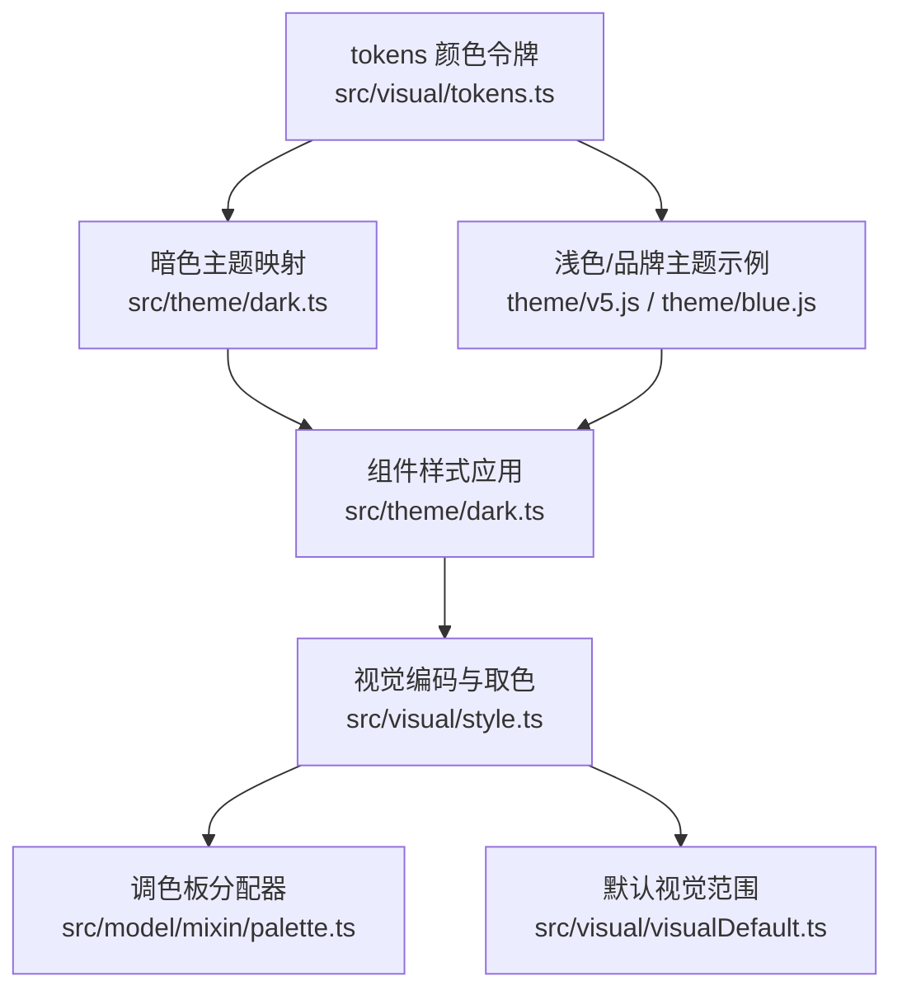
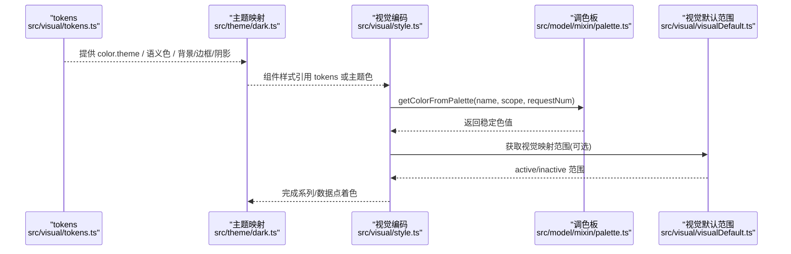
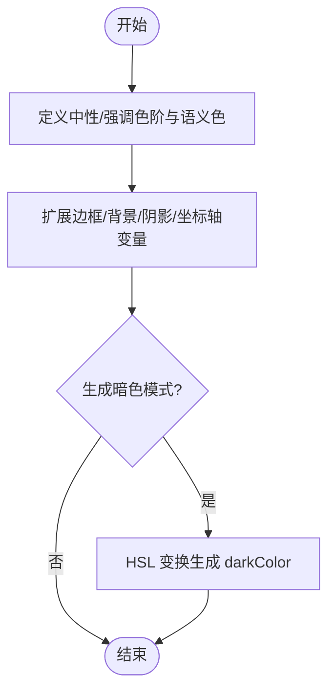
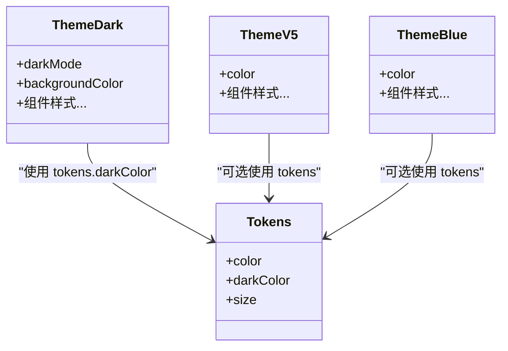
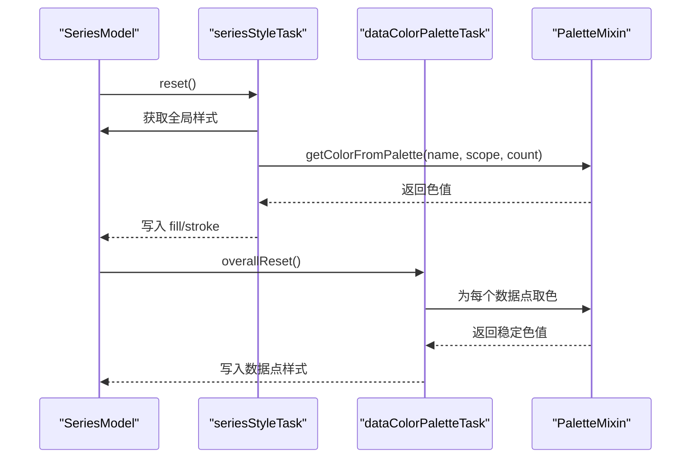
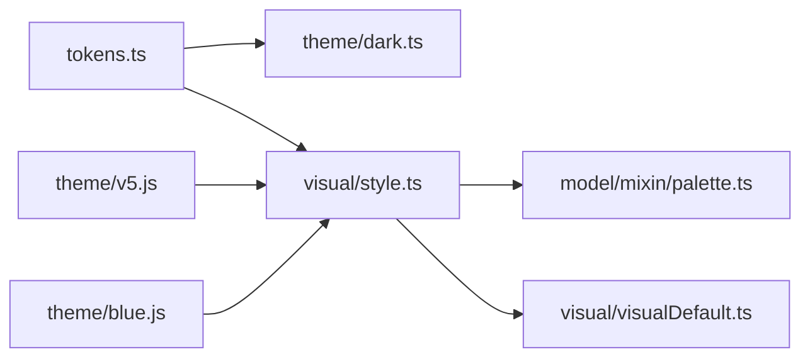

# 颜色系统配置

<cite>
**本文引用的文件**
- [src/visual/tokens.ts](file://src/visual/tokens.ts)
- [src/theme/dark.ts](file://src/theme/dark.ts)
- [theme/dark.js](file://theme/dark.js)
- [theme/v5.js](file://theme/v5.js)
- [theme/blue.js](file://theme/blue.js)
- [src/visual/style.ts](file://src/visual/style.ts)
- [src/model/mixin/palette.ts](file://src/model/mixin/palette.ts)
- [src/visual/visualDefault.ts](file://src/visual/visualDefault.ts)
</cite>

## 目录
1. [简介](#简介)
2. [项目结构](#项目结构)
3. [核心组件](#核心组件)
4. [架构总览](#架构总览)
5. [详细组件分析](#详细组件分析)
6. [依赖关系分析](#依赖关系分析)
7. [性能考虑](#性能考虑)
8. [故障排查指南](#故障排查指南)
9. [结论](#结论)
10. [附录](#附录)

## 简介
本文件系统性阐述 ECharts 主题中的颜色系统配置，覆盖调色板定义、tokens 变量体系（背景/前景/边框/阴影等）、预定义与自定义颜色的使用方式，以及从基础配色到复杂品牌色的实现路径。同时提供对比度检查与无障碍访问建议，帮助构建可访问、一致且易维护的可视化主题。

## 项目结构
ECharts 的颜色系统由“设计令牌 tokens”、“主题映射 theme”和“视觉编码 style/palette”三部分构成：
- tokens：集中管理中性色阶、强调色阶、语义色（主/次/强调/禁用）、边框/背景/阴影/坐标轴等原子变量，并自动生成暗色模式映射。
- theme：将 tokens 或具体色值映射到各组件（标题、图例、坐标轴、提示框、数据缩放等）的具体样式。
- style/palette：在渲染阶段为系列和数据点分配颜色，支持按系列或数据维度取色，支持自动填充与回调函数。

图表来源
- [src/visual/tokens.ts:105-233](file://src/visual/tokens.ts#L105-L233)
- [src/theme/dark.ts:68-329](file://src/theme/dark.ts#L68-L329)
- [theme/v5.js:44-86](file://theme/v5.js#L44-L86)
- [theme/blue.js:45-57](file://theme/blue.js#L45-L57)
- [src/visual/style.ts:67-131](file://src/visual/style.ts#L67-L131)
- [src/model/mixin/palette.ts:46-61](file://src/model/mixin/palette.ts#L46-L61)
- [src/visual/visualDefault.ts:42-86](file://src/visual/visualDefault.ts#L42-L86)

章节来源
- [src/visual/tokens.ts:105-233](file://src/visual/tokens.ts#L105-L233)
- [src/theme/dark.ts:68-329](file://src/theme/dark.ts#L68-L329)
- [theme/v5.js:44-86](file://theme/v5.js#L44-L86)
- [theme/blue.js:45-57](file://theme/blue.js#L45-L57)
- [src/visual/style.ts:67-131](file://src/visual/style.ts#L67-L131)
- [src/model/mixin/palette.ts:46-61](file://src/model/mixin/palette.ts#L46-L61)
- [src/visual/visualDefault.ts:42-86](file://src/visual/visualDefault.ts#L42-L86)

## 核心组件
- 颜色令牌 tokens
  - 中性色阶 neutralXX：用于文本、背景、分割线等通用灰度。
  - 强调色阶 accentXX：用于高亮、选中、交互反馈等。
  - 语义色 primary/secondary/tertiary/quaternary/disabled：用于标题、正文、次要信息、禁用态。
  - 边框 border/borderTint/borderShade：用于描边、浅深边框。
  - 背景 background/backgroundTint/backgroundTransparent/backgroundShade：用于画布、区域半透明叠加。
  - 阴影 shadow/shadowTint：用于投影与遮罩。
  - 坐标轴 axisLine/axisTick/axisLabel/axisSplitLine/axisMinorSplitLine：统一控制坐标轴元素。
  - 主题色 theme[]：多色序列，作为系列默认调色板。
  - 高亮 highlight：用于地图/地理等强调状态。
  - 暗色模式 darkColor：基于 light 模式 tokens 通过 HSL 变换自动生成，保证明暗可读性。

- 主题映射 theme
  - 将 tokens 或具体色值应用到组件：标题、图例、工具栏、提示框、数据缩放、日历、矩阵、地图、地理等。
  - 支持 darkMode 标记与 backgroundColor 设置。
  - 示例主题：dark（基于 tokens）、v5（浅色品牌）、blue（蓝色系）。

- 视觉编码 style 与调色板 palette
  - seriesStyleTask：为系列计算全局样式，若未指定则从调色板取色；支持 fill/stroke 的 auto 与回调。
  - dataColorPaletteTask：对每个数据点按需从调色板取色，保持图例切换一致性。
  - PaletteMixin.getColorFromPalette：按 name/scope/requestNum 稳定取色，支持分层调色板。
  - visualDefault：为视觉映射（如 colorHue/Saturation/Lightness/Alpha）提供活跃/非活跃范围。

章节来源
- [src/visual/tokens.ts:23-233](file://src/visual/tokens.ts#L23-L233)
- [src/theme/dark.ts:68-329](file://src/theme/dark.ts#L68-L329)
- [theme/v5.js:44-86](file://theme/v5.js#L44-L86)
- [theme/blue.js:45-57](file://theme/blue.js#L45-L57)
- [src/visual/style.ts:67-225](file://src/visual/style.ts#L67-L225)
- [src/model/mixin/palette.ts:46-134](file://src/model/mixin/palette.ts#L46-L134)
- [src/visual/visualDefault.ts:42-86](file://src/visual/visualDefault.ts#L42-L86)

## 架构总览
下图展示从 tokens 到最终渲染的颜色流转过程：主题读取 tokens，组件样式应用 tokens，视觉编码阶段根据系列/数据从调色板取色，必要时结合视觉映射生成最终颜色。

图表来源
- [src/visual/tokens.ts:105-233](file://src/visual/tokens.ts#L105-L233)
- [src/theme/dark.ts:68-329](file://src/theme/dark.ts#L68-L329)
- [src/visual/style.ts:67-225](file://src/visual/style.ts#L67-L225)
- [src/model/mixin/palette.ts:46-134](file://src/model/mixin/palette.ts#L46-L134)
- [src/visual/visualDefault.ts:42-86](file://src/visual/visualDefault.ts#L42-L86)

## 详细组件分析

### 颜色令牌 tokens 的组织与暗色模式生成
- 中性色阶与强调色阶：以百分比命名，便于在不同明度下保持一致的层次关系。
- 语义色派生：primary/secondary/tertiary/quaternary/disabled 由中性色阶派生，确保文本层级清晰。
- 边框/背景/阴影：提供 tint/shade/transparent 变体，满足叠加与层级需求。
- 坐标轴：统一轴相关颜色，避免分散配置。
- 暗色模式：通过 HSL 调整饱和度与亮度，自动生成 darkColor，保证暗背景下可读性与对比度。

图表来源
- [src/visual/tokens.ts:111-219](file://src/visual/tokens.ts#L111-L219)

章节来源
- [src/visual/tokens.ts:23-233](file://src/visual/tokens.ts#L23-L233)

### 主题映射：从 tokens 到组件样式
- 深色主题 dark.ts：使用 tokens.darkColor 为各组件赋值，包括坐标轴、图例、标题、工具栏、提示框、数据缩放、日历、矩阵、地图、地理等。
- 浅色/品牌主题 v5.js/blue.js：直接定义 color 调色板与组件样式，适合快速品牌化。

图表来源
- [src/theme/dark.ts:68-329](file://src/theme/dark.ts#L68-L329)
- [theme/v5.js:44-86](file://theme/v5.js#L44-L86)
- [theme/blue.js:45-57](file://theme/blue.js#L45-L57)
- [src/visual/tokens.ts:105-233](file://src/visual/tokens.ts#L105-L233)

章节来源
- [src/theme/dark.ts:68-329](file://src/theme/dark.ts#L68-L329)
- [theme/v5.js:44-86](file://theme/v5.js#L44-L86)
- [theme/blue.js:45-57](file://theme/blue.js#L45-L57)

### 视觉编码与调色板分配
- 系列级样式任务：若 itemStyle/lineStyle 未指定颜色或为 auto，则从调色板取色；支持回调函数逐数据点计算颜色。
- 数据级调色板任务：为每个数据点稳定分配颜色，确保图例切换时颜色一致。
- 调色板分配器：按 name/scope/requestNum 取色，支持分层调色板与循环索引。

图表来源
- [src/visual/style.ts:67-225](file://src/visual/style.ts#L67-L225)
- [src/model/mixin/palette.ts:46-134](file://src/model/mixin/palette.ts#L46-L134)

章节来源
- [src/visual/style.ts:67-225](file://src/visual/style.ts#L67-L225)
- [src/model/mixin/palette.ts:46-134](file://src/model/mixin/palette.ts#L46-L134)

### 视觉默认范围与无障碍
- visualDefault 提供活跃/非活跃的视觉映射范围，如色相、饱和度、明度、透明度等，有助于在交互状态下保持可读性。
- 暗色模式下 highlight 透明度降低，避免过度刺眼。

章节来源
- [src/visual/visualDefault.ts:42-86](file://src/visual/visualDefault.ts#L42-L86)
- [src/visual/tokens.ts:206-217](file://src/visual/tokens.ts#L206-L217)

## 依赖关系分析
- tokens 是颜色系统的单一事实源，主题与组件样式均依赖其导出。
- 主题 dark.ts 依赖 tokens.darkColor，其他主题可独立定义 color 调色板。
- 视觉编码依赖 palette 分配器，确保颜色稳定性与一致性。
- 视觉默认范围影响视觉映射效果，间接影响颜色感知。

图表来源
- [src/visual/tokens.ts:105-233](file://src/visual/tokens.ts#L105-L233)
- [src/theme/dark.ts:68-329](file://src/theme/dark.ts#L68-L329)
- [src/visual/style.ts:67-225](file://src/visual/style.ts#L67-L225)
- [src/model/mixin/palette.ts:46-134](file://src/model/mixin/palette.ts#L46-L134)
- [src/visual/visualDefault.ts:42-86](file://src/visual/visualDefault.ts#L42-L86)
- [theme/v5.js:44-86](file://theme/v5.js#L44-L86)
- [theme/blue.js:45-57](file://theme/blue.js#L45-L57)

章节来源
- [src/visual/tokens.ts:105-233](file://src/visual/tokens.ts#L105-L233)
- [src/theme/dark.ts:68-329](file://src/theme/dark.ts#L68-L329)
- [src/visual/style.ts:67-225](file://src/visual/style.ts#L67-L225)
- [src/model/mixin/palette.ts:46-134](file://src/model/mixin/palette.ts#L46-L134)
- [src/visual/visualDefault.ts:42-86](file://src/visual/visualDefault.ts#L42-L86)
- [theme/v5.js:44-86](file://theme/v5.js#L44-L86)
- [theme/blue.js:45-57](file://theme/blue.js#L45-L57)

## 性能考虑
- 调色板分配器缓存 name→色值映射，避免重复计算，提升大数据量下的性能。
- 仅在可见系列上执行数据点样式编码，减少无效开销。
- 暗色模式通过批量 HSL 变换生成，避免运行时逐个计算。

章节来源
- [src/model/mixin/palette.ts:93-134](file://src/model/mixin/palette.ts#L93-L134)
- [src/visual/style.ts:117-131](file://src/visual/style.ts#L117-L131)
- [src/visual/tokens.ts:199-219](file://src/visual/tokens.ts#L199-L219)

## 故障排查指南
- 颜色未按预期分配
  - 检查是否设置了 itemStyle/lineStyle 的固定颜色或回调，这会覆盖调色板。
  - 确认系列是否启用“按系列取色”，否则可能共享同一作用域导致冲突。
- 图例切换后颜色不一致
  - 确认数据点颜色来自调色板而非硬编码；视觉编码任务会保证一致性。
- 暗色模式可读性差
  - 检查 tokens.darkColor 的生成逻辑，必要时调整 highlight 透明度或背景色。
- 自定义主题不生效
  - 确认主题注册名称与使用名称一致；检查 color 调色板长度是否满足系列数量。

章节来源
- [src/visual/style.ts:86-131](file://src/visual/style.ts#L86-L131)
- [src/model/mixin/palette.ts:93-134](file://src/model/mixin/palette.ts#L93-L134)
- [src/visual/tokens.ts:206-217](file://src/visual/tokens.ts#L206-L217)

## 结论
ECharts 的颜色系统以 tokens 为核心，提供一致的原子变量与暗色模式生成；主题层将这些变量映射到具体组件；视觉编码层负责在渲染时稳定分配颜色。通过合理使用预定义变量与自定义调色板，可实现从基础配色到复杂品牌色的平滑过渡，并结合视觉默认范围与对比度检查，保障无障碍访问体验。

## 附录

### 颜色变量组织结构与使用规范
- 背景色
  - 使用 background 作为画布底色；backgroundTint/backgroundShade 用于区域叠加与层级区分；backgroundTransparent 用于透明叠加。
- 前景色
  - 使用 primary/secondary/tertiary/quaternary 控制标题、正文、次要信息与禁用态；neutralXX 用于更细粒度的灰度控制。
- 边框色
  - 使用 border/borderTint/borderShade 控制描边与深浅边框；坐标轴相关使用 axisLine/axisTick/axisLabel/axisSplitLine/axisMinorSplitLine。
- 阴影色
  - 使用 shadow/shadowTint 控制投影与遮罩；暗色模式下 highlight 透明度降低以提升舒适度。

章节来源
- [src/visual/tokens.ts:171-197](file://src/visual/tokens.ts#L171-L197)
- [src/theme/dark.ts:68-329](file://src/theme/dark.ts#L68-L329)

### 调色板定义方法
- 主题色数组 color[]：作为系列默认调色板，适用于多系列场景。
- 分层调色板：通过 layeredPalette 与 requestNum 选择最接近的分层，保证不同数据规模下的可用性。
- 回调函数：可为 itemStyle/lineStyle.color 提供回调，按数据点动态计算颜色。

章节来源
- [theme/v5.js:44-86](file://theme/v5.js#L44-L86)
- [theme/blue.js:45-57](file://theme/blue.js#L45-L57)
- [src/model/mixin/palette.ts:93-134](file://src/model/mixin/palette.ts#L93-L134)
- [src/visual/style.ts:86-131](file://src/visual/style.ts#L86-L131)

### 完整配置示例（从基础到品牌）
- 基础配色
  - 使用 tokens 的 neutral/accent 与语义色，配合默认调色板，快速搭建可读性良好的图表。
- 品牌色彩
  - 在主题中定义 color 调色板，覆盖 title/legend/tooltip/dataZoom 等组件样式，形成统一品牌风格。
- 暗色模式
  - 启用 darkMode，使用 tokens.darkColor 或自定义暗色变量，确保对比度与可读性。

章节来源
- [src/theme/dark.ts:68-329](file://src/theme/dark.ts#L68-L329)
- [theme/v5.js:44-86](file://theme/v5.js#L44-L86)
- [theme/blue.js:45-57](file://theme/blue.js#L45-L57)

### 对比度检查与无障碍访问
- 文本与背景对比度：优先使用 tokens 的 neutral 与 semantic 色，避免低对比组合。
- 高亮与选中：使用 highlight 与 accent 系列，注意暗色模式下的透明度调整。
- 视觉映射范围：利用 visualDefault 的 active/inactive 范围，确保交互状态下的可读性。

章节来源
- [src/visual/tokens.ts:206-217](file://src/visual/tokens.ts#L206-L217)
- [src/visual/visualDefault.ts:42-86](file://src/visual/visualDefault.ts#L42-L86)