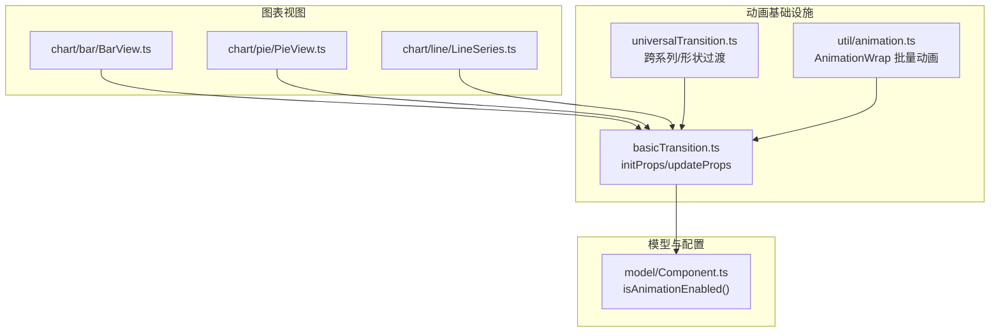
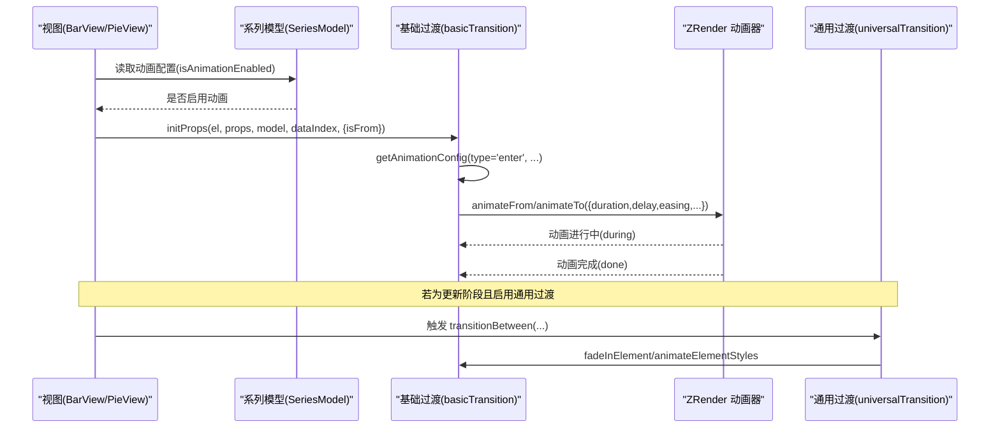
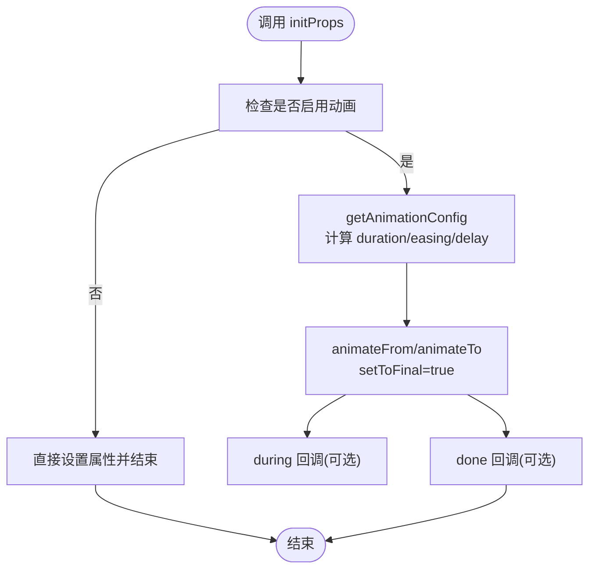
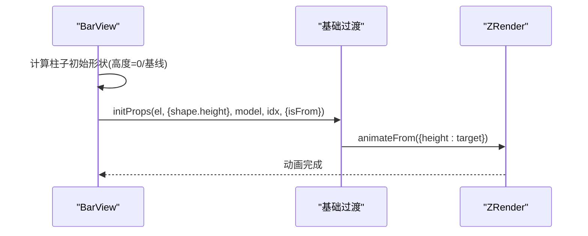
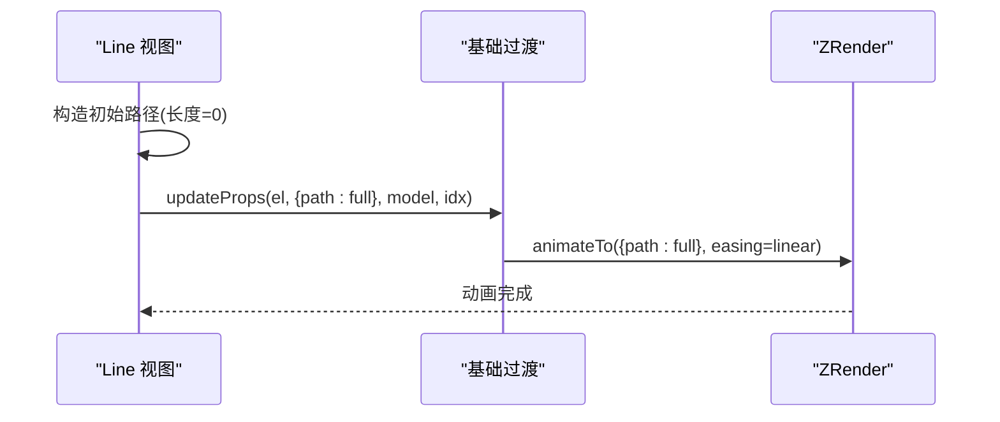
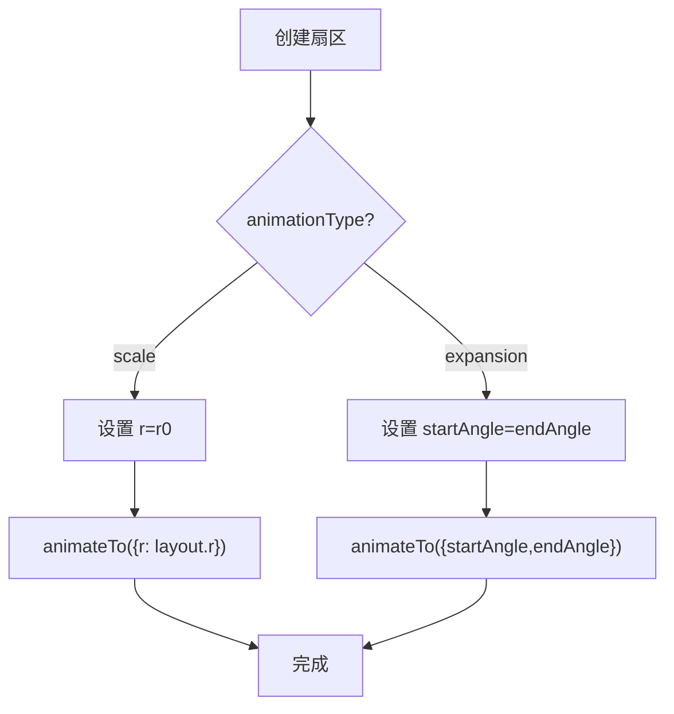
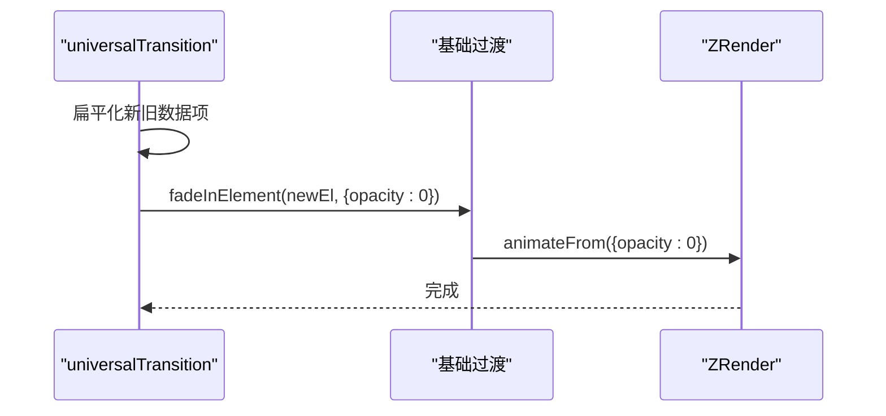
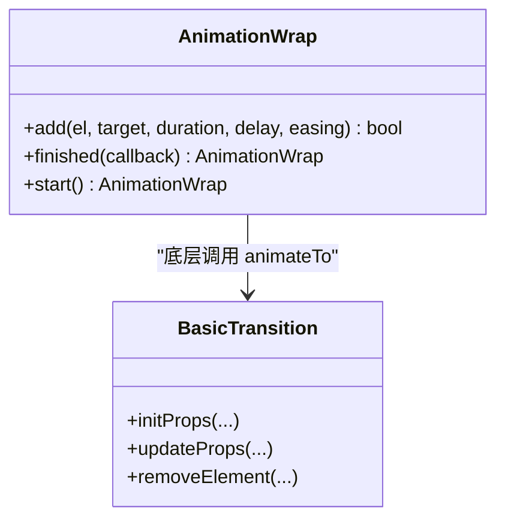
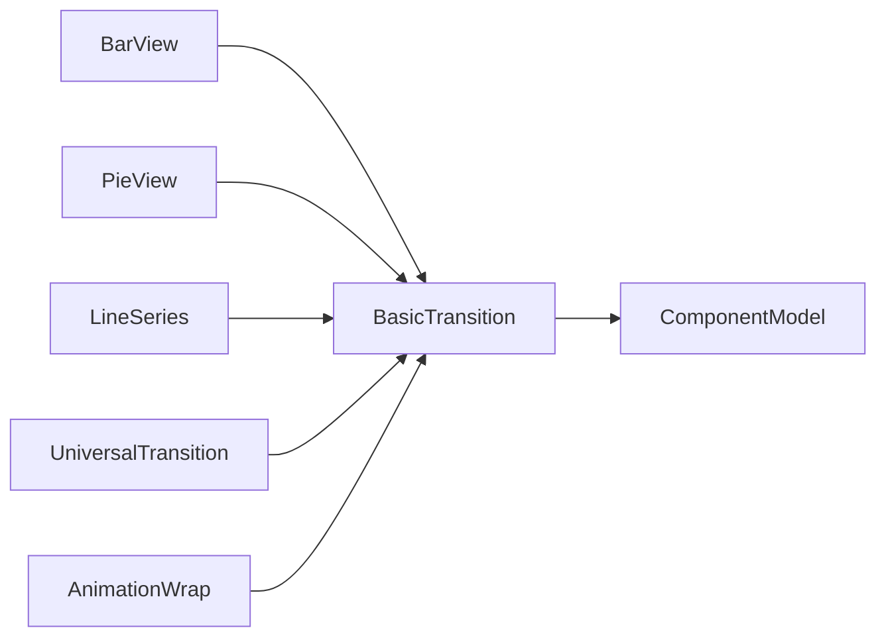

# 入场动画

<cite>
**本文引用的文件**
- [basicTransition.ts](file://src/animation/basicTransition.ts)
- [universalTransition.ts](file://src/animation/universalTransition.ts)
- [animation.ts](file://src/util/animation.ts)
- [BarView.ts](file://src/chart/bar/BarView.ts)
- [PieView.ts](file://src/chart/pie/PieView.ts)
- [LineSeries.ts](file://src/chart/line/LineSeries.ts)
- [PieSeries.ts](file://src/chart/pie/PieSeries.ts)
- [Component.ts](file://src/model/Component.ts)
</cite>

## 目录
1. [简介](#简介)
2. [项目结构](#项目结构)
3. [核心组件](#核心组件)
4. [架构总览](#架构总览)
5. [详细组件分析](#详细组件分析)
6. [依赖关系分析](#依赖关系分析)
7. [性能考量](#性能考量)
8. [故障排查指南](#故障排查指南)
9. [结论](#结论)
10. [附录：配置与示例速查](#附录：配置与示例速查)

## 简介
本章节系统阐述 ECharts 的“入场动画”机制，围绕 initProps 的工作原理、缓动函数与延迟策略、不同图表类型的入场动画实现（柱状图从底部升起、折线图逐点绘制、饼图扇形展开）、动画配置项（animationDuration、animationEasing、animationDelay）以及批量动画控制（交错动画、分组动画、全局开关）进行说明，并提供丰富的实践案例指引。

## 项目结构
ECharts 的动画体系由“基础过渡能力 + 通用过渡扩展 + 各视图具体实现”构成：
- 基础过渡：提供元素属性动画的统一入口（initProps/updateProps/removeElement），封装了动画配置获取、缓动与延迟计算、动画执行与回调。
- 通用过渡：在数据更新时跨系列/跨形状做路径变形与淡入淡出等统一过渡。
- 视图层：各类图表在渲染过程中调用基础过渡接口，完成各自特有的入场动画（如柱状图高度变化、饼图角度变化、折线逐点绘制）。

图示来源
- [basicTransition.ts:58-125](file://src/animation/basicTransition.ts#L58-L125)
- [universalTransition.ts:147-191](file://src/animation/universalTransition.ts#L147-L191)
- [animation.ts:45-117](file://src/util/animation.ts#L45-L117)
- [BarView.ts:122-144](file://src/chart/bar/BarView.ts#L122-L144)
- [PieView.ts:77-126](file://src/chart/pie/PieView.ts#L77-L126)
- [LineSeries.ts:218-226](file://src/chart/line/LineSeries.ts#L218-L226)
- [Component.ts:160-176](file://src/model/Component.ts#L160-L176)

章节来源
- [basicTransition.ts:58-125](file://src/animation/basicTransition.ts#L58-L125)
- [universalTransition.ts:147-191](file://src/animation/universalTransition.ts#L147-L191)
- [animation.ts:45-117](file://src/util/animation.ts#L45-L117)
- [BarView.ts:122-144](file://src/chart/bar/BarView.ts#L122-L144)
- [PieView.ts:77-126](file://src/chart/pie/PieView.ts#L77-L126)
- [LineSeries.ts:218-226](file://src/chart/line/LineSeries.ts#L218-L226)
- [Component.ts:160-176](file://src/model/Component.ts#L160-L176)

## 核心组件
- 基础过渡模块（basicTransition.ts）
  - getAnimationConfig：根据类型（enter/update/leave）、模型配置、数据索引与外部覆盖参数，计算 duration、easing、delay；支持函数式延迟与时长，支持来自 dataZoom/resize 的全局 payload 覆盖。
  - animateOrSetProps：内部统一调度，决定 animateFrom/animateTo，处理 setToFinal、during 回调、停止旧动画等。
  - initProps：用于“进入”场景，传入 isFrom=true 时从初始状态动画到目标状态。
  - updateProps/removeElement：更新与移除时的过渡。
- 通用过渡（universalTransition.ts）
  - 在 series:transition 生命周期中，对旧/新数据进行 diff，按 groupId/childGroupId 建立映射，执行 one-to-one / many-to-many 的变形或淡入淡出。
  - fadeInElement：对新元素以 opacity=0 作为起点，配合 initProps 做渐入。
- 批量动画（util/animation.ts）
  - AnimationWrap：将多个元素的动画聚合，统一 start，并在全部完成时触发 done 回调，适合批量交错动画。

章节来源
- [basicTransition.ts:58-125](file://src/animation/basicTransition.ts#L58-L125)
- [basicTransition.ts:127-199](file://src/animation/basicTransition.ts#L127-L199)
- [basicTransition.ts:241-250](file://src/animation/basicTransition.ts#L241-L250)
- [universalTransition.ts:147-191](file://src/animation/universalTransition.ts#L147-L191)
- [animation.ts:45-117](file://src/util/animation.ts#L45-L117)

## 架构总览
下图展示一次典型的数据渲染到动画执行的流程：视图创建图形元素后，通过基础过渡接口设置初始状态并启动动画；若启用通用过渡，则在更新阶段进行跨系列/形状的过渡。

图示来源
- [basicTransition.ts:58-125](file://src/animation/basicTransition.ts#L58-L125)
- [basicTransition.ts:127-199](file://src/animation/basicTransition.ts#L127-L199)
- [universalTransition.ts:147-191](file://src/animation/universalTransition.ts#L147-L191)

## 详细组件分析

### 基础过渡与 initProps 工作原理
- 动画配置来源与优先级
  - 默认来自系列模型的 animationDuration/animationEasing/animationDelay（进入）或 Update 后缀（更新）。
  - 可通过 extraOpts 覆盖（例如 remove 场景）。
  - 支持来自 dataZoom/resize 的 payload.animation 覆盖（最高优先级）。
  - delay/duration 可为函数，接收 dataIndex 与额外参数，便于交错动画。
- 动画执行
  - enter 使用 animateFrom（从初始状态到目标状态），update 使用 animateTo。
  - setToFinal 保证在动画期间也能正确访问最终属性（用于后续基于 path shape 的后处理）。
  - during 回调可用于每帧插值过程的处理。
- 关键路径
  - getAnimationConfig → animateOrSetProps → el.animateFrom/animateTo

图示来源
- [basicTransition.ts:58-125](file://src/animation/basicTransition.ts#L58-L125)
- [basicTransition.ts:127-199](file://src/animation/basicTransition.ts#L127-L199)
- [basicTransition.ts:241-250](file://src/animation/basicTransition.ts#L241-L250)

章节来源
- [basicTransition.ts:58-125](file://src/animation/basicTransition.ts#L58-L125)
- [basicTransition.ts:127-199](file://src/animation/basicTransition.ts#L127-L199)
- [basicTransition.ts:241-250](file://src/animation/basicTransition.ts#L241-L250)

### 柱状图的入场动画（从底部/基线升起）
- 视图在首次渲染时，会为每个柱子设置合适的初始形状（如高度为 0 或从基线开始），然后通过 updateProps/initProps 驱动高度变化到目标值。
- 动画方向取决于坐标系与基轴方向（水平/径向），视图会判断是否为横向或径向，从而决定“升起”的方向。
- 可结合延迟函数实现交错上升效果。

图示来源
- [BarView.ts:122-144](file://src/chart/bar/BarView.ts#L122-L144)
- [basicTransition.ts:241-250](file://src/animation/basicTransition.ts#L241-L250)

章节来源
- [BarView.ts:122-144](file://src/chart/bar/BarView.ts#L122-L144)

### 折线图的入场动画（逐点绘制）
- 折线默认使用线性缓动（linear）以获得“逐点绘制”的观感。
- 视图在构建路径时，通常先设置一个“空”或“部分可见”的初始状态，再通过动画逐步扩展到完整路径。
- 可通过 animationEasing 自定义曲线，或使用延迟函数实现分段绘制。

图示来源
- [LineSeries.ts:218-226](file://src/chart/line/LineSeries.ts#L218-L226)
- [basicTransition.ts:58-125](file://src/animation/basicTransition.ts#L58-L125)

章节来源
- [LineSeries.ts:218-226](file://src/chart/line/LineSeries.ts#L218-L226)

### 饼图的入场动画（扇形展开/缩放）
- 支持两种入场类型：expansion（从起始角展开到目标角度）与 scale（半径从内径扩展到外径）。
- 首次创建时，会根据 animationType 设置不同的初始形状（startAngle=endAngle 或 r=r0），再驱动到目标形状。
- SSR 模式下使用缩放动画以保证兼容性。

图示来源
- [PieView.ts:77-126](file://src/chart/pie/PieView.ts#L77-L126)
- [PieSeries.ts:327-337](file://src/chart/pie/PieSeries.ts#L327-L337)

章节来源
- [PieView.ts:77-126](file://src/chart/pie/PieView.ts#L77-L126)
- [PieSeries.ts:327-337](file://src/chart/pie/PieSeries.ts#L327-L337)

### 通用过渡与淡入淡出
- 当启用 universalTransition 时，新增元素会以 opacity=0 作为起点，随后渐显；已存在元素则保留其离开动画或进行路径变形。
- 对于大量数据（>10k）会禁用通用过渡以避免性能问题。

图示来源
- [universalTransition.ts:147-191](file://src/animation/universalTransition.ts#L147-L191)
- [universalTransition.ts:118-144](file://src/animation/universalTransition.ts#L118-L144)

章节来源
- [universalTransition.ts:118-144](file://src/animation/universalTransition.ts#L118-L144)
- [universalTransition.ts:147-191](file://src/animation/universalTransition.ts#L147-L191)

### 批量动画控制（交错、分组、全局开关）
- 交错动画：通过 delay 函数返回基于 dataIndex 的延迟，实现依次入场。
- 分组动画：使用 AnimationWrap 将多个元素加入同一批，统一 start，并在全部完成后触发 done。
- 全局开关：通过 isAnimationEnabled 控制是否启用动画；也可通过 dataZoom/resize 的 payload.animation 临时覆盖全局配置。

图示来源
- [animation.ts:45-117](file://src/util/animation.ts#L45-L117)
- [basicTransition.ts:58-125](file://src/animation/basicTransition.ts#L58-L125)

章节来源
- [animation.ts:45-117](file://src/util/animation.ts#L45-L117)
- [basicTransition.ts:58-125](file://src/animation/basicTransition.ts#L58-L125)

## 依赖关系分析
- 视图层依赖基础过渡接口完成入场动画。
- 基础过渡依赖模型提供的动画配置与全局开关。
- 通用过渡依赖基础过渡与数据差异对比，负责跨系列/形状的过渡。
- 批量动画工具封装了多元素动画的统一管理。

图示来源
- [BarView.ts:122-144](file://src/chart/bar/BarView.ts#L122-L144)
- [PieView.ts:77-126](file://src/chart/pie/PieView.ts#L77-L126)
- [LineSeries.ts:218-226](file://src/chart/line/LineSeries.ts#L218-L226)
- [universalTransition.ts:147-191](file://src/animation/universalTransition.ts#L147-L191)
- [animation.ts:45-117](file://src/util/animation.ts#L45-L117)
- [Component.ts:160-176](file://src/model/Component.ts#L160-L176)

章节来源
- [BarView.ts:122-144](file://src/chart/bar/BarView.ts#L122-L144)
- [PieView.ts:77-126](file://src/chart/pie/PieView.ts#L77-L126)
- [LineSeries.ts:218-226](file://src/chart/line/LineSeries.ts#L218-L226)
- [universalTransition.ts:147-191](file://src/animation/universalTransition.ts#L147-L191)
- [animation.ts:45-117](file://src/util/animation.ts#L45-L117)
- [Component.ts:160-176](file://src/model/Component.ts#L160-L176)

## 性能考量
- 大数据量下禁用通用过渡（>10k 数据项），避免路径变形带来的性能开销。
- 合理设置 animationDuration 与 animationEasing，避免过长的动画影响交互响应。
- 使用延迟函数实现交错动画时，注意延迟总量不要过大，以免整体加载时间过长。
- 在需要频繁更新的场景中，优先使用 updateProps 而非重建元素，减少动画重置成本。

[本节为通用指导，不直接分析具体文件]

## 故障排查指南
- 动画未生效
  - 检查 isAnimationEnabled 是否被禁用。
  - 确认 getAnimationConfig 返回的 duration 是否大于 0。
- 动画顺序异常
  - 检查 delay 函数是否正确基于 dataIndex 返回递增延迟。
  - 确认是否在元素已有动画时重复调用 initProps/updateProps，导致旧动画被中断。
- 通用过渡失效
  - 检查数据项是否设置了 groupId/childGroupId，确保能正确匹配。
  - 确认数据量未超过阈值。

章节来源
- [basicTransition.ts:58-125](file://src/animation/basicTransition.ts#L58-L125)
- [universalTransition.ts:118-144](file://src/animation/universalTransition.ts#L118-L144)

## 结论
ECharts 的入场动画以基础过渡为核心，结合视图层的差异化实现与通用过渡的跨系列能力，提供了灵活而强大的动画体系。通过合理的配置与批量控制，可以实现从简单的渐入到复杂的交错、变形等多种视觉效果，同时兼顾性能与可维护性。

[本节为总结，不直接分析具体文件]

## 附录：配置与示例速查
- 动画配置项
  - animationDuration：入场动画时长（可为函数，按数据项定制）。
  - animationEasing：缓动函数（如 cubicInOut、linear）。
  - animationDelay：入场延迟（可为函数，实现交错动画）。
  - animationType（饼图）：'expansion' | 'scale'。
  - animationTypeUpdate（饼图更新）：'transition' | 'expansion'。
  - universalTransition.divideShape：通用过渡的形状分割策略。
- 常见示例参考
  - 柱状图从底部升起：参考 BarView 的初始形状设置与 initProps 调用。
  - 折线图逐点绘制：参考 LineSeries 默认 linear 缓动与路径动画。
  - 饼图扇形展开：参考 PieView 的 expansion/scale 逻辑。
  - 批量交错动画：参考 AnimationWrap 的使用方式。

章节来源
- [PieSeries.ts:327-337](file://src/chart/pie/PieSeries.ts#L327-L337)
- [LineSeries.ts:218-226](file://src/chart/line/LineSeries.ts#L218-L226)
- [BarView.ts:122-144](file://src/chart/bar/BarView.ts#L122-L144)
- [PieView.ts:77-126](file://src/chart/pie/PieView.ts#L77-L126)
- [animation.ts:45-117](file://src/util/animation.ts#L45-L117)