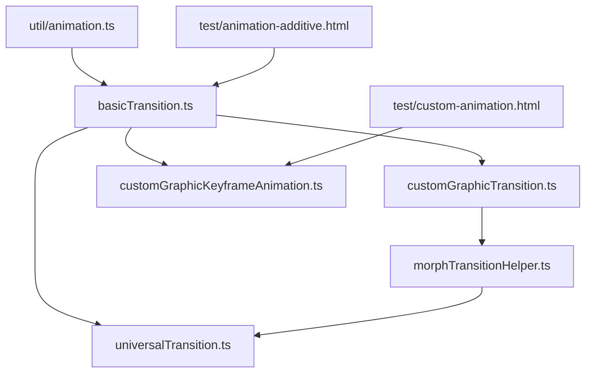
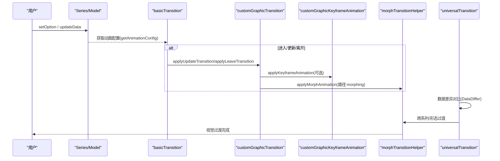
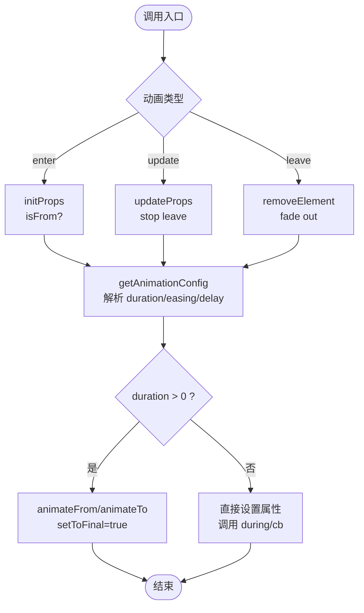
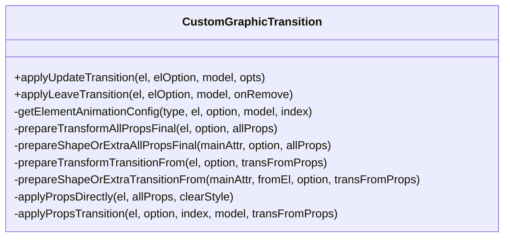
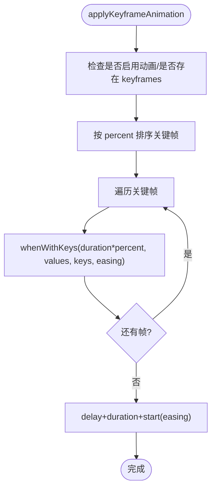
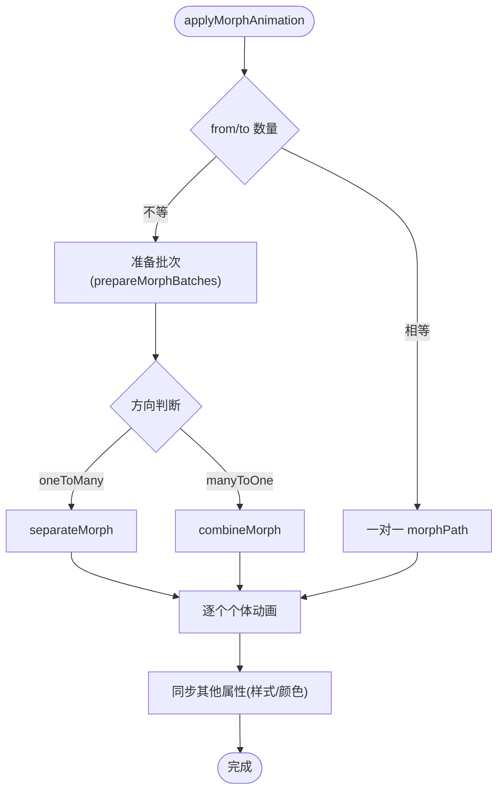
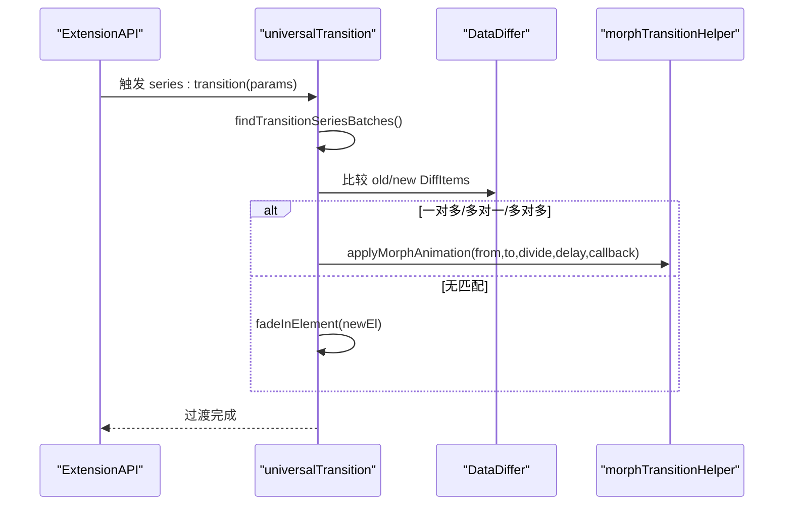
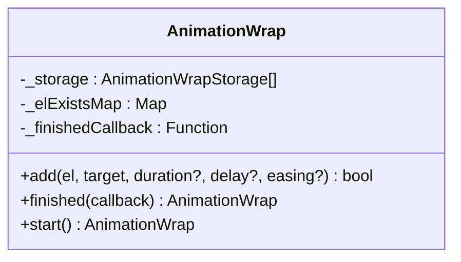
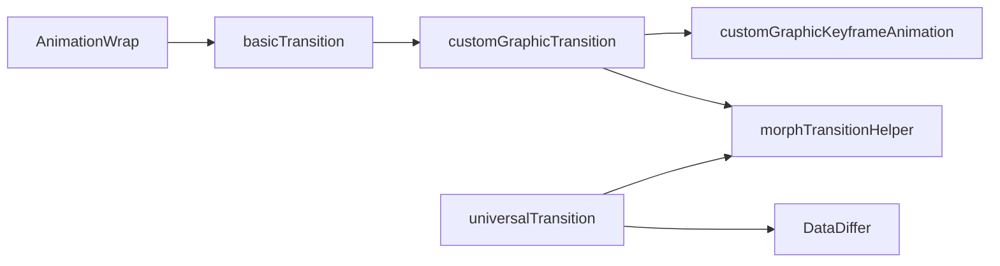

# 动画系统

<cite>
**本文引用的文件**
- [src/animation/basicTransition.ts](file://src/animation/basicTransition.ts)
- [src/animation/customGraphicKeyframeAnimation.ts](file://src/animation/customGraphicKeyframeAnimation.ts)
- [src/animation/customGraphicTransition.ts](file://src/animation/customGraphicTransition.ts)
- [src/animation/morphTransitionHelper.ts](file://src/animation/morphTransitionHelper.ts)
- [src/animation/universalTransition.ts](file://src/animation/universalTransition.ts)
- [src/util/animation.ts](file://src/util/animation.ts)
- [test/animation-additive.html](file://test/animation-additive.html)
- [test/custom-animation.html](file://test/custom-animation.html)
</cite>

## 目录
1. [简介](#简介)
2. [项目结构](#项目结构)
3. [核心组件](#核心组件)
4. [架构总览](#架构总览)
5. [详细组件分析](#详细组件分析)
6. [依赖关系分析](#依赖关系分析)
7. [性能考量](#性能考量)
8. [故障排查指南](#故障排查指南)
9. [结论](#结论)
10. [附录：示例与最佳实践](#附录示例与最佳实践)

## 简介
本章节系统性介绍 ECharts 的动画系统与过渡效果机制，覆盖以下主题：
- 入场动画配置：时长、缓动函数、延迟策略、批量控制
- 数据更新时的过渡动画：元素状态变化、路径插值与形态转换
- 自定义动画开发：关键帧动画、属性动画、事件驱动动画
- 性能优化：硬件加速、动画队列管理、内存回收
- 调试与监控：常用工具与性能观测方法
- 实战案例：渐入渐出、弹性运动、曲线动画等

ECharts 的动画体系基于底层渲染引擎 ZRender 的 Animator 能力，并在上层提供统一的动画配置解析、过渡编排、形状 morphing（路径插值）以及“通用过渡”能力，以支持跨系列、跨形态的平滑过渡。

## 项目结构
动画相关代码主要位于 src/animation 目录，辅以工具模块与测试用例：
- basicTransition.ts：基础动画配置解析与元素属性动画入口（enter/update/leave）
- customGraphicTransition.ts：自定义图形元素的过渡 API（含 during 回调、样式/形状/变换过渡）
- customGraphicKeyframeAnimation.ts：关键帧动画（keyframes）API
- morphTransitionHelper.ts：路径 morphing 辅助（分离/合并/逐段动画）
- universalTransition.ts：通用过渡（Universal Transition），跨系列/跨形态的数据到图形的平滑过渡
- util/animation.ts：批量动画包装器 AnimationWrap，统一完成回调与生命周期管理
- test/*：丰富的动画示例页面，演示各类效果与用法

图表来源
- [src/animation/basicTransition.ts:58-125](file://src/animation/basicTransition.ts#L58-L125)
- [src/animation/customGraphicTransition.ts:105-208](file://src/animation/customGraphicTransition.ts#L105-L208)
- [src/animation/customGraphicKeyframeAnimation.ts:59-162](file://src/animation/customGraphicKeyframeAnimation.ts#L59-L162)
- [src/animation/morphTransitionHelper.ts:110-234](file://src/animation/morphTransitionHelper.ts#L110-L234)
- [src/animation/universalTransition.ts:209-511](file://src/animation/universalTransition.ts#L209-L511)
- [src/util/animation.ts:45-122](file://src/util/animation.ts#L45-L122)

章节来源
- [src/animation/basicTransition.ts:58-125](file://src/animation/basicTransition.ts#L58-L125)
- [src/animation/customGraphicTransition.ts:105-208](file://src/animation/customGraphicTransition.ts#L105-L208)
- [src/animation/customGraphicKeyframeAnimation.ts:59-162](file://src/animation/customGraphicKeyframeAnimation.ts#L59-L162)
- [src/animation/morphTransitionHelper.ts:110-234](file://src/animation/morphTransitionHelper.ts#L110-L234)
- [src/animation/universalTransition.ts:209-511](file://src/animation/universalTransition.ts#L209-L511)
- [src/util/animation.ts:45-122](file://src/util/animation.ts#L45-L122)

## 核心组件
- 基础动画配置与入口
  - getAnimationConfig：根据类型（enter/update/leave）、模型配置、payload 覆盖、函数式 duration/delay 解析最终动画参数（duration/easing/delay）
  - initProps/updateProps/removeElement：对元素执行进入、更新、离开动画；支持 isFrom、during、removeOpt 等选项
  - saveOldStyle/getOldStyle：保存旧样式以便后续过渡复用
- 自定义图形过渡
  - applyUpdateTransition：准备最终属性、计算 from 状态、应用直接属性或启动过渡；支持 enterFrom/leaveTo、during 回调、transition 白名单
  - applyLeaveTransition：离开过渡并移除元素
  - TransitionDuringAPI：在动画过程中安全地读写 transform/shape/style/extra
- 关键帧动画
  - applyKeyframeAnimation：按 percent 排序关键帧，使用 whenWithKeys 构建多段动画；支持 loop、easing、delay
  - stopPreviousKeyframeAnimationAndRestore：停止上一组关键帧并恢复原始属性
- 路径 morphing
  - applyMorphAnimation：one-to-one、one-to-many、many-to-one 的路径插值；支持 divideShape（clone/split）与 individualDelay
  - getPathList：遍历元素收集可 morph 的 Path
- 通用过渡（Universal Transition）
  - transitionBetween：基于 DataDiffer 匹配新旧数据项，决定方向（parent->child/child->parent/none），调用 morph 或淡入淡出
  - installUniversalTransition：注册生命周期钩子，自动发现可过渡的系列并对数据进行批处理
- 批量动画包装
  - AnimationWrap：为多个元素创建统一动画，跟踪完成/中止回调，避免重复添加同一元素

章节来源
- [src/animation/basicTransition.ts:58-125](file://src/animation/basicTransition.ts#L58-L125)
- [src/animation/basicTransition.ts:127-286](file://src/animation/basicTransition.ts#L127-L286)
- [src/animation/customGraphicTransition.ts:105-208](file://src/animation/customGraphicTransition.ts#L105-L208)
- [src/animation/customGraphicTransition.ts:228-252](file://src/animation/customGraphicTransition.ts#L228-L252)
- [src/animation/customGraphicKeyframeAnimation.ts:59-162](file://src/animation/customGraphicKeyframeAnimation.ts#L59-L162)
- [src/animation/morphTransitionHelper.ts:110-234](file://src/animation/morphTransitionHelper.ts#L110-L234)
- [src/animation/universalTransition.ts:209-511](file://src/animation/universalTransition.ts#L209-L511)
- [src/util/animation.ts:45-122](file://src/util/animation.ts#L45-L122)

## 架构总览
ECharts 动画系统分层清晰：
- 配置层：从 Series/Component Model 读取 animationDuration/animationEasing/animationDelay 等，支持 payload 覆盖与函数式配置
- 编排层：basicTransition 负责 enter/update/leave 的统一入口；customGraphicTransition 提供更细粒度的过渡控制；keyframe 提供关键帧编排
- 形态层：morphTransitionHelper 实现路径 morphing（分离/合并/分段）
- 全局层：universalTransition 在数据变更时自动匹配新旧元素并触发跨系列/跨形态过渡
- 工具层：AnimationWrap 提供批量动画封装

图表来源
- [src/animation/basicTransition.ts:58-125](file://src/animation/basicTransition.ts#L58-L125)
- [src/animation/customGraphicTransition.ts:105-208](file://src/animation/customGraphicTransition.ts#L105-L208)
- [src/animation/customGraphicKeyframeAnimation.ts:59-162](file://src/animation/customGraphicKeyframeAnimation.ts#L59-L162)
- [src/animation/morphTransitionHelper.ts:110-234](file://src/animation/morphTransitionHelper.ts#L110-L234)
- [src/animation/universalTransition.ts:209-511](file://src/animation/universalTransition.ts#L209-L511)

## 详细组件分析

### 基础动画配置与元素动画（basicTransition）
- 动画配置优先级：
  - 默认模型配置（animationDuration/animationEasing/animationDelay）
  - 通过 payload（如 dataZoom/resize）覆盖
  - 函数式 duration/delay 支持 dataIndex 与额外参数
- 动画类型：
  - enter：initProps，支持 isFrom 从指定初始状态开始
  - update：updateProps，停止 leave 动画后执行更新
  - leave：removeElement/removeElementWithFadeOut，支持淡出与清理
- 重要细节：
  - setToFinal：确保 post-processing（如强调色）基于最终状态正确计算
  - scope：区分不同作用域的动画（enter/update/leave/keyframe）
  - saveOldStyle/getOldStyle：用于后续通用过渡中样式回退

图表来源
- [src/animation/basicTransition.ts:58-125](file://src/animation/basicTransition.ts#L58-L125)
- [src/animation/basicTransition.ts:127-286](file://src/animation/basicTransition.ts#L127-L286)

章节来源
- [src/animation/basicTransition.ts:58-125](file://src/animation/basicTransition.ts#L58-L125)
- [src/animation/basicTransition.ts:127-286](file://src/animation/basicTransition.ts#L127-L286)

### 自定义图形过渡（customGraphicTransition）
- 支持属性范围：transform（x/y/scaleX/scaleY/originX/originY 等）、style、shape、extra
- 过渡策略：
  - prepareTransformAllPropsFinal/prepareShapeOrExtraAllPropsFinal：准备最终属性
  - prepareTransformTransitionFrom/prepareShapeOrExtraTransitionFrom：准备 from 状态
  - applyPropsDirectly：先设置最终状态，再启动动画
- during 回调：
  - 提供 setTransform/setStyle/setShape/setExtra 安全访问接口
  - 每帧仅调用一次，避免重复计算
- 离开过渡：
  - applyLeaveTransition：若存在 leaveToProps，则执行过渡后移除元素

图表来源
- [src/animation/customGraphicTransition.ts:105-208](file://src/animation/customGraphicTransition.ts#L105-L208)
- [src/animation/customGraphicTransition.ts:259-319](file://src/animation/customGraphicTransition.ts#L259-L319)
- [src/animation/customGraphicTransition.ts:322-427](file://src/animation/customGraphicTransition.ts#L322-L427)
- [src/animation/customGraphicTransition.ts:471-638](file://src/animation/customGraphicTransition.ts#L471-L638)

章节来源
- [src/animation/customGraphicTransition.ts:105-208](file://src/animation/customGraphicTransition.ts#L105-L208)
- [src/animation/customGraphicTransition.ts:259-319](file://src/animation/customGraphicTransition.ts#L259-L319)
- [src/animation/customGraphicTransition.ts:322-427](file://src/animation/customGraphicTransition.ts#L322-L427)
- [src/animation/customGraphicTransition.ts:471-638](file://src/animation/customGraphicTransition.ts#L471-L638)

### 关键帧动画（customGraphicKeyframeAnimation）
- 关键帧格式：每个帧包含 percent（0~1）、easing、目标属性集合
- 行为：
  - 按 percent 排序，使用 whenWithKeys 构建多段动画
  - 支持 loop、delay、duration（默认取自 enter 动画配置）
  - 停止上一组关键帧并恢复原始属性，避免状态污染
- 适用场景：循环波纹、弹跳、抖动等复杂时序动画

图表来源
- [src/animation/customGraphicKeyframeAnimation.ts:59-162](file://src/animation/customGraphicKeyframeAnimation.ts#L59-L162)

章节来源
- [src/animation/customGraphicKeyframeAnimation.ts:59-162](file://src/animation/customGraphicKeyframeAnimation.ts#L59-L162)

### 路径 morphing（morphTransitionHelper）
- 支持 one-to-one、one-to-many、many-to-one 的形态转换
- 分片策略：
  - divideShape=clone：将源路径克隆为多份，分别赋予近似透明度，形成“分裂”效果
  - divideShape=split：使用默认分割算法
- 逐段动画：
  - 支持 individualDelay，结合 animateIndex/total 实现交错延迟
  - 非 morph 的属性（如 style）通过回调 animateOtherProps 同步过渡

图表来源
- [src/animation/morphTransitionHelper.ts:50-92](file://src/animation/morphTransitionHelper.ts#L50-L92)
- [src/animation/morphTransitionHelper.ts:110-234](file://src/animation/morphTransitionHelper.ts#L110-L234)

章节来源
- [src/animation/morphTransitionHelper.ts:50-92](file://src/animation/morphTransitionHelper.ts#L50-L92)
- [src/animation/morphTransitionHelper.ts:110-234](file://src/animation/morphTransitionHelper.ts#L110-L234)

### 通用过渡（universalTransition）
- 数据到图形的跨系列/跨形态过渡：
  - 通过 DataDiffer 比较新旧 DiffItem，依据 groupId/childGroupId 确定方向（parent->child/child->parent/none）
  - 大量数据（>阈值）时禁用通用过渡以避免性能问题
  - 对未参与 morph 的元素进行淡入处理，保证视觉一致性
- 生命周期集成：
  - 注册 series:beforeupdate/series:transition 钩子，自动发现可过渡系列并执行过渡
- 系列键（seriesKey）：
  - 支持字符串或数组，用于匹配新旧系列之间的过渡关系

图表来源
- [src/animation/universalTransition.ts:209-511](file://src/animation/universalTransition.ts#L209-L511)
- [src/animation/universalTransition.ts:544-674](file://src/animation/universalTransition.ts#L544-L674)
- [src/animation/universalTransition.ts:723-785](file://src/animation/universalTransition.ts#L723-L785)

章节来源
- [src/animation/universalTransition.ts:209-511](file://src/animation/universalTransition.ts#L209-L511)
- [src/animation/universalTransition.ts:544-674](file://src/animation/universalTransition.ts#L544-L674)
- [src/animation/universalTransition.ts:723-785](file://src/animation/universalTransition.ts#L723-L785)

### 批量动画包装（util/animation.ts）
- AnimationWrap：
  - add：为多个元素添加目标属性与动画参数，内部去重（基于 el.id）
  - start：并行启动所有动画，统一计数 done/aborted 回调
  - finished：在所有动画完成后执行回调
- 适用场景：批量更新多个图形元素，简化完成逻辑

图表来源
- [src/util/animation.ts:45-122](file://src/util/animation.ts#L45-L122)

章节来源
- [src/util/animation.ts:45-122](file://src/util/animation.ts#L45-L122)

## 依赖关系分析
- 模块耦合：
  - basicTransition 被 customGraphicTransition、universalTransition 引用，作为动画配置解析的核心
  - customGraphicTransition 依赖 basicTransition 的配置解析，同时组合 keyframe 与 morph 能力
  - morphTransitionHelper 依赖 zrender 的 path morph 工具，提供路径级动画
  - universalTransition 依赖 DataDiffer 与 morphTransitionHelper，协调跨系列过渡
  - util/animation.ts 独立于具体图表，提供通用批量动画能力
- 外部依赖：
  - zrender Element/Animator/Displayable/Path：提供底层动画与图形能力
  - zrender tool/morphPath：路径分离/合并/插值
- 潜在循环依赖：
  - 当前结构无明显循环引用；各模块职责清晰，依赖方向单向

图表来源
- [src/animation/basicTransition.ts:58-125](file://src/animation/basicTransition.ts#L58-L125)
- [src/animation/customGraphicTransition.ts:105-208](file://src/animation/customGraphicTransition.ts#L105-L208)
- [src/animation/customGraphicKeyframeAnimation.ts:59-162](file://src/animation/customGraphicKeyframeAnimation.ts#L59-L162)
- [src/animation/morphTransitionHelper.ts:110-234](file://src/animation/morphTransitionHelper.ts#L110-L234)
- [src/animation/universalTransition.ts:209-511](file://src/animation/universalTransition.ts#L209-L511)
- [src/util/animation.ts:45-122](file://src/util/animation.ts#L45-L122)

章节来源
- [src/animation/basicTransition.ts:58-125](file://src/animation/basicTransition.ts#L58-L125)
- [src/animation/customGraphicTransition.ts:105-208](file://src/animation/customGraphicTransition.ts#L105-L208)
- [src/animation/customGraphicKeyframeAnimation.ts:59-162](file://src/animation/customGraphicKeyframeAnimation.ts#L59-L162)
- [src/animation/morphTransitionHelper.ts:110-234](file://src/animation/morphTransitionHelper.ts#L110-L234)
- [src/animation/universalTransition.ts:209-511](file://src/animation/universalTransition.ts#L209-L511)
- [src/util/animation.ts:45-122](file://src/util/animation.ts#L45-L122)

## 性能考量
- 硬件加速：
  - 优先使用 transform（x/y/scaleX/scaleY/originX/originY）与 opacity 等 GPU 友好属性
  - avoid 频繁修改 layout 或几何属性导致重排
- 动画队列管理：
  - 使用 AnimationWrap 统一管理批量动画，减少重复创建与销毁开销
  - 合理设置 duration/delay，避免过多并发动画造成卡顿
- 内存回收：
  - removeElementWithFadeOut 在淡出结束后移除元素，避免悬挂引用
  - universalTransition 对大数据集（>阈值）禁用通用过渡，降低内存与计算压力
- 过渡粒度控制：
  - 使用 transition 白名单精确控制需要过渡的属性，减少不必要的插值计算
  - during 回调中谨慎修改属性，避免每帧高成本操作

[本节为通用指导，不直接分析具体文件]

## 故障排查指南
- 动画未生效：
  - 检查 isAnimationEnabled 与 animationDuration 是否为正数
  - 确认 getAnimationConfig 返回的配置未被 payload 错误覆盖
- 状态错乱：
  - 使用 stopPreviousKeyframeAnimationAndRestore 重置关键帧动画前的状态
  - 在 style 对象替换时注意 animator 的目标切换（applyPropsDirectly 中的 changeTarget）
- 性能问题：
  - 大数据集禁用通用过渡（阈值保护）
  - 减少 during 中的复杂计算，尽量使用简单属性更新
- 调试建议：
  - 使用 console.warn 输出关键帧缺失警告（__DEV__ 环境）
  - 通过浏览器开发者工具的 Performance 面板观察帧率与主线程占用

章节来源
- [src/animation/customGraphicKeyframeAnimation.ts:151-155](file://src/animation/customGraphicKeyframeAnimation.ts#L151-L155)
- [src/animation/customGraphicTransition.ts:259-319](file://src/animation/customGraphicTransition.ts#L259-L319)
- [src/animation/universalTransition.ts:125-130](file://src/animation/universalTransition.ts#L125-L130)

## 结论
ECharts 的动画系统提供了从基础属性动画到复杂路径 morphing 的全栈能力，并通过通用过渡实现了跨系列/跨形态的平滑衔接。其设计兼顾易用性与高性能：
- 统一的配置解析与生命周期管理
- 灵活的自定义过渡与关键帧编排
- 强大的路径 morphing 与数据驱动过渡
- 完善的批量动画与性能保护机制

在实际项目中，建议：
- 明确动画粒度，优先使用 transform/opacity
- 合理使用延迟与批量动画，避免过度并发
- 利用通用过渡提升用户体验，但注意数据规模限制
- 借助调试工具与性能面板持续优化

[本节为总结性内容，不直接分析具体文件]

## 附录：示例与最佳实践
- 渐入渐出：
  - 使用 removeElementWithFadeOut 或 fadeOutDisplayable 实现淡出
  - 新元素进入时使用 initProps with isFrom 从透明到可见
- 弹性运动：
  - 关键帧动画中使用 bounceOut/bounceIn 等缓动函数
  - 通过 percent 与 easing 组合实现复杂节奏
- 曲线动画：
  - 使用 applyUpdateTransition 的 during 回调逐步更新 shape/style
  - 结合 morphTransitionHelper 实现路径形变
- 参考示例：
  - 加法动画与非加法动画对比：[test/animation-additive.html](file://test/animation-additive.html)
  - 自定义关键帧动画（波纹、弹跳）：[test/custom-animation.html](file://test/custom-animation.html)

章节来源
- [test/animation-additive.html:55-150](file://test/animation-additive.html#L55-L150)
- [test/custom-animation.html:81-157](file://test/custom-animation.html#L81-L157)