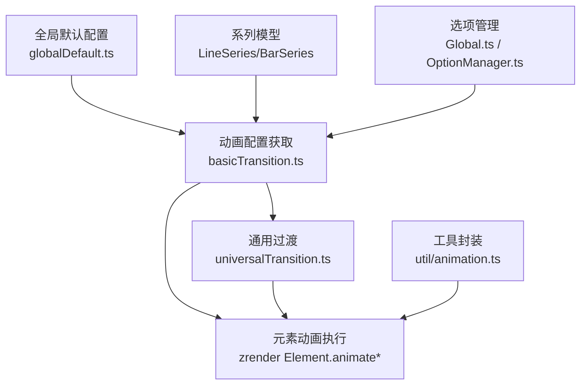
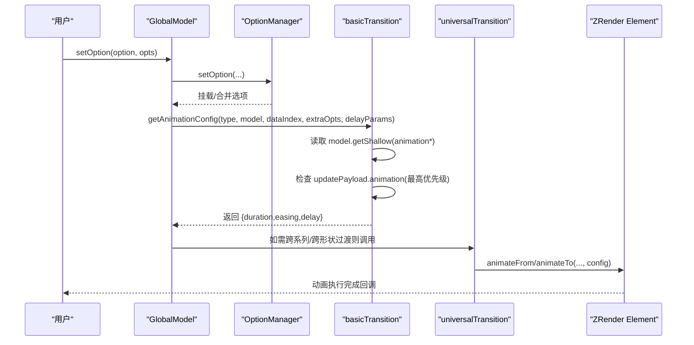
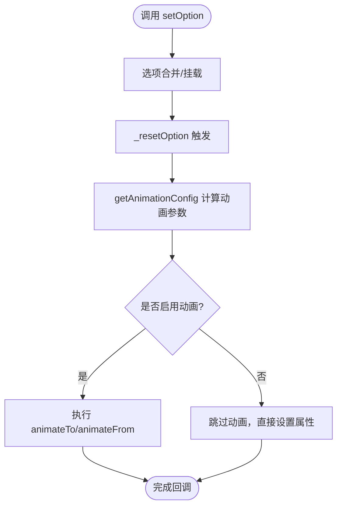
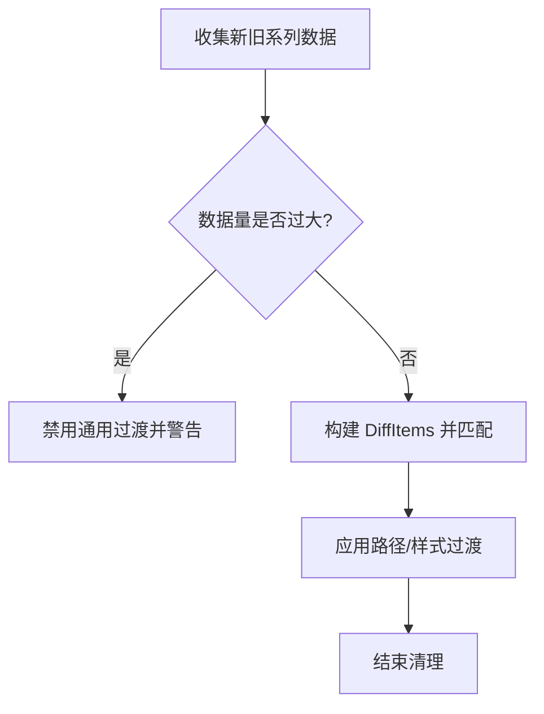
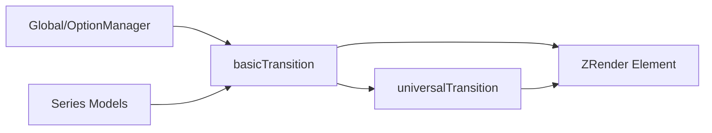

# 动画配置

<cite>
**本文引用的文件**
- [src/animation/basicTransition.ts](file://src/animation/basicTransition.ts)
- [src/util/animation.ts](file://src/util/animation.ts)
- [src/model/globalDefault.ts](file://src/model/globalDefault.ts)
- [src/util/types.ts](file://src/util/types.ts)
- [src/animation/universalTransition.ts](file://src/animation/universalTransition.ts)
- [src/chart/line/LineSeries.ts](file://src/chart/line/LineSeries.ts)
- [src/chart/bar/BarSeries.ts](file://src/chart/bar/BarSeries.ts)
- [src/model/Global.ts](file://src/model/Global.ts)
- [src/model/OptionManager.ts](file://src/model/OptionManager.ts)
- [test/line-animation.html](file://test/line-animation.html)
- [test/animation-additive.html](file://test/animation-additive.html)
- [test/universalTransition.html](file://test/universalTransition.html)
</cite>

## 目录
1. [简介](#简介)
2. [项目结构](#项目结构)
3. [核心组件](#核心组件)
4. [架构总览](#架构总览)
5. [详细组件分析](#详细组件分析)
6. [依赖关系分析](#依赖关系分析)
7. [性能考虑](#性能考虑)
8. [故障排查指南](#故障排查指南)
9. [结论](#结论)
10. [附录：配置参考与最佳实践](#附录配置参考与最佳实践)

## 简介
本章节系统性梳理 ECharts 动画系统的配置选项与管理机制，覆盖全局动画配置、系列级别动画配置、动态动画控制（setOption 更新、响应式调整、运行时切换）、以及大数据量下的性能调优与兼容性建议。文档以源码为依据，提供流程图与时序图帮助理解动画生命周期与优先级规则。

## 项目结构
ECharts 的动画系统由“配置解析—模型读取—过渡计算—渲染执行”构成，关键模块分布如下：
- 全局默认配置：定义动画开关、时长、缓动、阈值等默认值
- 动画过渡核心：统一获取动画配置、驱动元素进入/更新/离开动画
- 通用过渡：跨系列/跨形状的形态过渡与样式过渡
- 工具封装：批量动画编排与完成回调
- 图表系列：部分系列自带与动画相关的特性（如标签动画）
- 选项管理：setOption 合并与重置流程，影响动画参数来源

**图示来源**
- [src/model/globalDefault.ts:107-113](file://src/model/globalDefault.ts#L107-L113)
- [src/animation/basicTransition.ts:58-125](file://src/animation/basicTransition.ts#L58-L125)
- [src/animation/universalTransition.ts:179-190](file://src/animation/universalTransition.ts#L179-L190)
- [src/util/animation.ts:92-117](file://src/util/animation.ts#L92-L117)
- [src/chart/line/LineSeries.ts:159-178](file://src/chart/line/LineSeries.ts#L159-L178)
- [src/model/Global.ts:231-273](file://src/model/Global.ts#L231-L273)
- [src/model/OptionManager.ts:133-163](file://src/model/OptionManager.ts#L133-L163)

**章节来源**
- [src/model/globalDefault.ts:107-113](file://src/model/globalDefault.ts#L107-L113)
- [src/animation/basicTransition.ts:58-125](file://src/animation/basicTransition.ts#L58-L125)
- [src/animation/universalTransition.ts:179-190](file://src/animation/universalTransition.ts#L179-L190)
- [src/util/animation.ts:92-117](file://src/util/animation.ts#L92-L117)
- [src/chart/line/LineSeries.ts:159-178](file://src/chart/line/LineSeries.ts#L159-L178)
- [src/model/Global.ts:231-273](file://src/model/Global.ts#L231-L273)
- [src/model/OptionManager.ts:133-163](file://src/model/OptionManager.ts#L133-L163)

## 核心组件
- 全局动画默认值：包含 animation、animationDuration、animationDurationUpdate、animationEasing、animationEasingUpdate、animationThreshold 等默认配置
- 动画配置获取器：根据动画类型（enter/update/leave）、数据索引、是否更新载荷（payload）计算最终 duration/easing/delay
- 通用过渡：支持跨系列/跨形状的数据项匹配与样式/路径过渡，内置大数据量限制
- 批量动画封装：统一管理多个元素的动画队列与完成回调
- 系列相关动画：如折线图 endLabel 的值动画等

**章节来源**
- [src/model/globalDefault.ts:107-113](file://src/model/globalDefault.ts#L107-L113)
- [src/animation/basicTransition.ts:58-125](file://src/animation/basicTransition.ts#L58-L125)
- [src/animation/universalTransition.ts:125-143](file://src/animation/universalTransition.ts#L125-L143)
- [src/util/animation.ts:45-117](file://src/util/animation.ts#L45-L117)
- [src/chart/line/LineSeries.ts:174-178](file://src/chart/line/LineSeries.ts#L174-L178)

## 架构总览
下图展示一次 setOption 触发后，动画配置如何从全局/系列/载荷中解析并应用到图形元素。

**图示来源**
- [src/model/Global.ts:231-273](file://src/model/Global.ts#L231-L273)
- [src/model/OptionManager.ts:133-163](file://src/model/OptionManager.ts#L133-L163)
- [src/animation/basicTransition.ts:58-125](file://src/animation/basicTransition.ts#L58-L125)
- [src/animation/universalTransition.ts:179-190](file://src/animation/universalTransition.ts#L179-L190)

## 详细组件分析

### 全局动画配置
- animationEnabled：通过 isAnimationEnabled 判定是否启用动画；当关闭时直接跳过动画逻辑
- animationThreshold：超过该数量级时，可禁用动画以提升性能（结合 progressive/large 模式）
- animationDuration / animationDurationUpdate：初始化与更新动画时长，支持数值或回调
- animationEasing / animationEasingUpdate：缓动函数
- animationDelay / animationDelayUpdate：延迟，支持回调按数据索引计算

默认值来源于全局默认配置，实际生效顺序为：update payload > 系列/模型 shallow 配置 > 全局默认。

**章节来源**
- [src/model/globalDefault.ts:107-113](file://src/model/globalDefault.ts#L107-L113)
- [src/animation/basicTransition.ts:75-125](file://src/animation/basicTransition.ts#L75-L125)
- [src/util/types.ts:1116-1155](file://src/util/types.ts#L1116-L1155)

### 系列级别动画配置与专属特性
- 折线图：endLabel 支持 valueAnimation，用于数值变化时的平滑过渡
- 柱状图：在 large 模式下与渐进渲染配合，避免过多动画开销
- 通用：所有系列均可通过 AnimationOptionMixin 注入动画参数

注意：系列级动画优先于全局默认，但仍受 isAnimationEnabled 与 threshold 控制。

**章节来源**
- [src/chart/line/LineSeries.ts:174-178](file://src/chart/line/LineSeries.ts#L174-L178)
- [src/chart/bar/BarSeries.ts:118-137](file://src/chart/bar/BarSeries.ts#L118-L137)
- [src/util/types.ts:1116-1155](file://src/util/types.ts#L1116-L1155)

### 动态动画控制（setOption、响应式、运行时切换）
- setOption 会触发选项合并与重置，进而重新计算动画配置
- 可通过 updatePayload.animation 在运行时临时覆盖动画参数（例如 dataZoom/resize 场景）
- 响应式媒体查询与时间轴选项也会参与选项合并，间接影响动画行为

**图示来源**
- [src/model/Global.ts:231-273](file://src/model/Global.ts#L231-L273)
- [src/animation/basicTransition.ts:75-125](file://src/animation/basicTransition.ts#L75-L125)

**章节来源**
- [src/model/Global.ts:231-273](file://src/model/Global.ts#L231-L273)
- [src/model/OptionManager.ts:133-163](file://src/model/OptionManager.ts#L133-L163)
- [src/animation/basicTransition.ts:70-104](file://src/animation/basicTransition.ts#L70-L104)

### 通用过渡（Universal Transition）
- 支持跨系列/跨形状的数据项匹配与样式/路径过渡
- 对大数据量进行保护：超过阈值时禁用通用过渡以避免卡顿
- 样式过渡会复用旧样式作为起点，确保视觉连贯

**图示来源**
- [src/animation/universalTransition.ts:125-143](file://src/animation/universalTransition.ts#L125-L143)
- [src/animation/universalTransition.ts:179-190](file://src/animation/universalTransition.ts#L179-L190)

**章节来源**
- [src/animation/universalTransition.ts:125-143](file://src/animation/universalTransition.ts#L125-L143)
- [src/animation/universalTransition.ts:179-190](file://src/animation/universalTransition.ts#L179-L190)

### 批量动画与完成回调
- AnimationWrap 将多个元素的动画目标与参数集中管理，统一启动并在全部完成或中止时触发回调
- 适用于需要协调多元素动画的场景

**章节来源**
- [src/util/animation.ts:45-117](file://src/util/animation.ts#L45-L117)

## 依赖关系分析
- basicTransition 依赖 Model 的 getShallow 读取动画配置，并可能读取 ecModel 的 updatePayload 中的动画覆盖
- universalTransition 依赖 basicTransition 提供的 getAnimationConfig 与样式保存/恢复能力
- Global/OptionManager 负责选项合并与重置，影响后续动画参数来源
- 系列模型（Line/Bar）提供与动画相关的特性（如 endLabel.valueAnimation、large 模式下的渐进渲染）

**图示来源**
- [src/model/Global.ts:231-273](file://src/model/Global.ts#L231-L273)
- [src/model/OptionManager.ts:133-163](file://src/model/OptionManager.ts#L133-L163)
- [src/animation/basicTransition.ts:58-125](file://src/animation/basicTransition.ts#L58-L125)
- [src/animation/universalTransition.ts:179-190](file://src/animation/universalTransition.ts#L179-L190)

**章节来源**
- [src/model/Global.ts:231-273](file://src/model/Global.ts#L231-L273)
- [src/model/OptionManager.ts:133-163](file://src/model/OptionManager.ts#L133-L163)
- [src/animation/basicTransition.ts:58-125](file://src/animation/basicTransition.ts#L58-L125)
- [src/animation/universalTransition.ts:179-190](file://src/animation/universalTransition.ts#L179-L190)

## 性能考虑
- 大数据量优化
  - 使用 animationThreshold 控制动画启停，避免大量元素同时动画导致卡顿
  - 在 large 模式下结合 progressive 渲染，减少一次性绘制压力
  - 通用过渡对超大数据集自动禁用，防止性能退化
- 移动端适配
  - 适当缩短 animationDuration/animationDurationUpdate，降低设备负载
  - 谨慎使用复杂缓动与长延时，保证交互流畅
- 浏览器兼容性
  - 动画底层基于 ZRender，兼容主流浏览器；tooltip 等 DOM 层过渡使用 CSS transition，需关注 transform 支持
- 运行时策略
  - 通过 updatePayload.animation 在特定交互（如缩放、媒体查询）中动态调整动画参数
  - 对频繁更新的场景，考虑关闭动画或采用增量更新

**章节来源**
- [src/model/globalDefault.ts:107-113](file://src/model/globalDefault.ts#L107-L113)
- [src/animation/universalTransition.ts:125-143](file://src/animation/universalTransition.ts#L125-L143)
- [src/chart/bar/BarSeries.ts:118-137](file://src/chart/bar/BarSeries.ts#L118-L137)
- [src/component/tooltip/TooltipHTMLContent.ts:106-124](file://src/component/tooltip/TooltipHTMLContent.ts#L106-L124)

## 故障排查指南
- 动画未生效
  - 检查 isAnimationEnabled 是否为真；确认 animation 未被关闭
  - 核对 animationThreshold 是否过高导致被禁用
  - 确认 series 或 global 的 animationDuration 是否为 0
- 动画闪烁或状态错乱
  - 避免在同一元素上重复调用动画接口；必要时先 stopAnimation
  - 通用过渡中确保旧样式已正确保存与恢复
- 性能问题
  - 大数据集下关闭通用过渡或动画
  - 使用 progressive/large 模式分片渲染
  - 合理设置 animationDelay 与 easing，避免密集重绘

**章节来源**
- [src/animation/basicTransition.ts:75-125](file://src/animation/basicTransition.ts#L75-L125)
- [src/animation/universalTransition.ts:125-143](file://src/animation/universalTransition.ts#L125-L143)
- [src/util/animation.ts:92-117](file://src/util/animation.ts#L92-L117)

## 结论
ECharts 动画系统通过清晰的分层设计实现了灵活且高性能的动画能力：全局默认与系列配置提供易用的开关与参数，basicTransition 统一解析并应用动画，universalTransition 提供跨系列/形状的平滑过渡，工具层保障批量动画与回调管理。在实际项目中，应结合数据规模、设备能力与交互需求，合理配置动画阈值与时长，必要时在运行时动态调整以获得最佳体验。

## 附录：配置参考与最佳实践
- 全局配置要点
  - animation：开启/关闭动画（auto 表示按环境自适应）
  - animationDuration / animationDurationUpdate：初始/更新动画时长
  - animationEasing / animationEasingUpdate：缓动函数
  - animationDelay / animationDelayUpdate：延迟，支持回调按索引计算
  - animationThreshold：超过阈值时禁用动画
- 系列配置要点
  - 继承 AnimationOptionMixin，可在系列级覆盖全局动画参数
  - 部分系列具备专属动画特性（如折线图 endLabel.valueAnimation）
- 动态控制建议
  - 使用 setOption 更新动画配置，必要时通过 notMerge 替换而非合并
  - 利用 updatePayload.animation 在交互过程中临时覆盖动画参数
- 常见示例参考
  - 折线图标签动画与延迟回调：[test/line-animation.html](file://test/line-animation.html)
  - 叠加动画（additive）演示：[test/animation-additive.html](file://test/animation-additive.html)
  - 通用过渡与样式动画：[test/universalTransition.html](file://test/universalTransition.html)

**章节来源**
- [src/util/types.ts:1116-1155](file://src/util/types.ts#L1116-L1155)
- [src/chart/line/LineSeries.ts:174-178](file://src/chart/line/LineSeries.ts#L174-L178)
- [test/line-animation.html:378-393](file://test/line-animation.html#L378-L393)
- [test/animation-additive.html:102-114](file://test/animation-additive.html#L102-L114)
- [test/universalTransition.html:871-898](file://test/universalTransition.html#L871-L898)