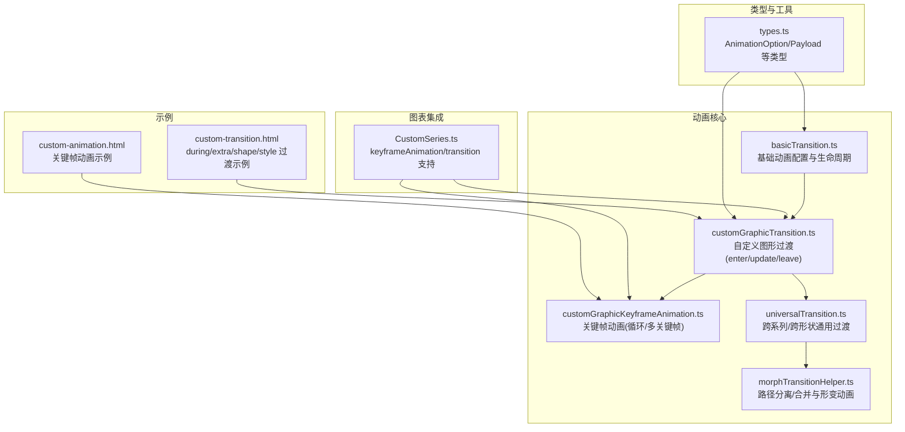
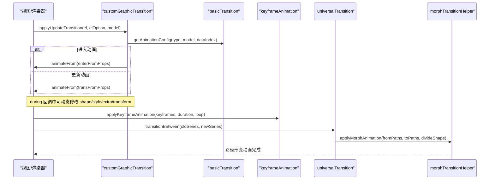
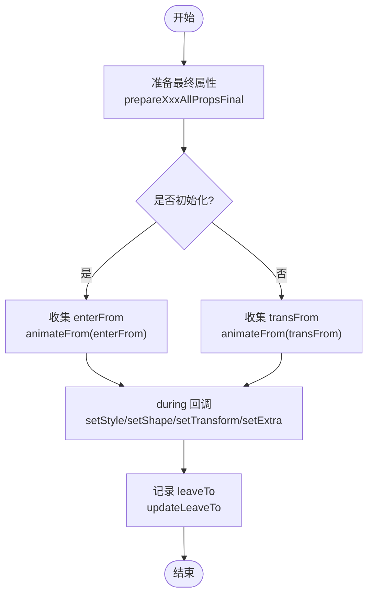
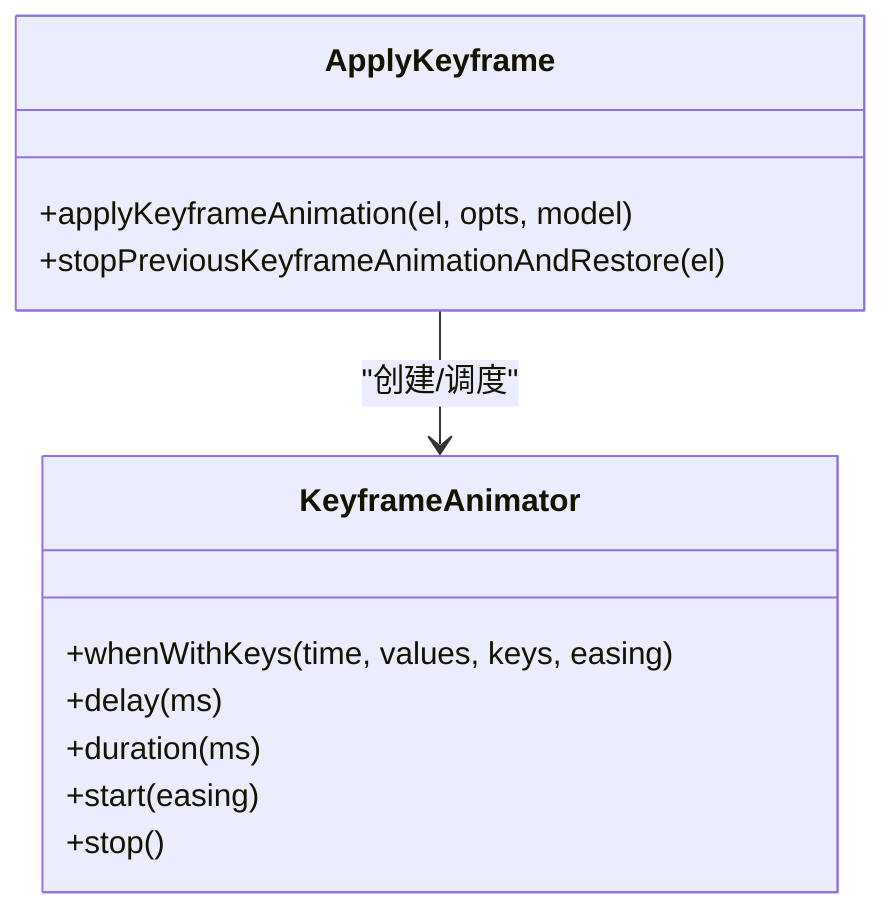
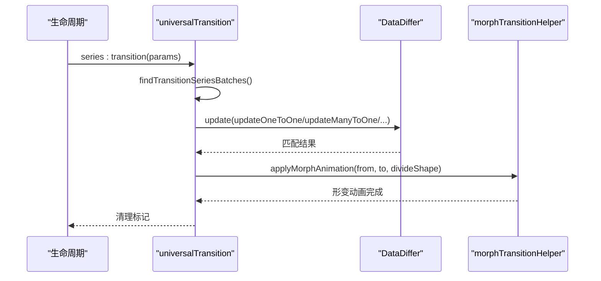
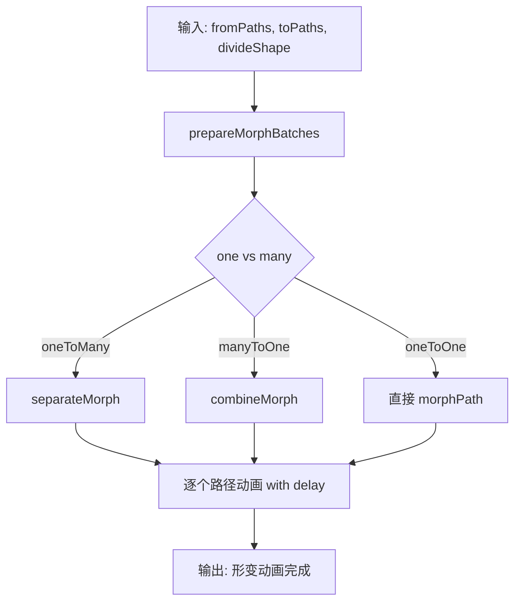
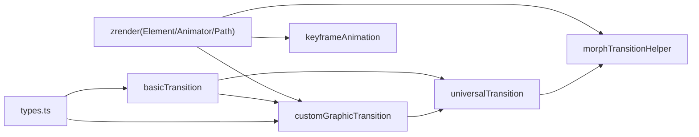

# 自定义动画

<cite>
**本文引用的文件**
- [customGraphicTransition.ts](file://src/animation/customGraphicTransition.ts)
- [basicTransition.ts](file://src/animation/basicTransition.ts)
- [customGraphicKeyframeAnimation.ts](file://src/animation/customGraphicKeyframeAnimation.ts)
- [universalTransition.ts](file://src/animation/universalTransition.ts)
- [morphTransitionHelper.ts](file://src/animation/morphTransitionHelper.ts)
- [CustomSeries.ts](file://src/chart/custom/CustomSeries.ts)
- [types.ts](file://src/util/types.ts)
- [custom-animation.html](file://test/custom-animation.html)
- [custom-transition.html](file://test/custom-transition.html)
</cite>

## 目录
1. [简介](#简介)
2. [项目结构](#项目结构)
3. [核心组件](#核心组件)
4. [架构总览](#架构总览)
5. [详细组件分析](#详细组件分析)
6. [依赖关系分析](#依赖关系分析)
7. [性能考虑](#性能考虑)
8. [故障排查指南](#故障排查指南)
9. [结论](#结论)
10. [附录：API 参考与最佳实践](#附录api-参考与最佳实践)

## 简介
本文件系统性介绍 ECharts 自定义动画的开发方法与扩展机制，重点围绕 customGraphicTransition 的实现原理（关键帧动画定义、属性插值计算、动画序列编排），以及如何创建自定义动画类型（继承基础动画类、重写动画逻辑、注册动画处理器）。同时涵盖高级动画技术（贝塞尔曲线动画、物理模拟动画、基于时间的动画控制）与性能优化策略（批处理、GPU 加速、内存管理），并提供完整的开发指南、API 参考、最佳实践与调试技巧。

## 项目结构
ECharts 的动画子系统位于 src/animation 下，包含基础过渡、自定义图形过渡、关键帧动画、通用过渡以及路径形变辅助等模块；图表侧通过 CustomSeries 暴露 keyframeAnimation 与 transition 配置；测试用例在 test 目录下提供丰富的使用示例。

图示来源
- [basicTransition.ts:58-125](file://src/animation/basicTransition.ts#L58-L125)
- [customGraphicTransition.ts:105-208](file://src/animation/customGraphicTransition.ts#L105-L208)
- [customGraphicKeyframeAnimation.ts:59-162](file://src/animation/customGraphicKeyframeAnimation.ts#L59-L162)
- [universalTransition.ts:209-511](file://src/animation/universalTransition.ts#L209-L511)
- [morphTransitionHelper.ts:110-234](file://src/animation/morphTransitionHelper.ts#L110-L234)
- [CustomSeries.ts:223-255](file://src/chart/custom/CustomSeries.ts#L223-L255)
- [types.ts:193-198](file://src/util/types.ts#L193-L198)

章节来源
- [basicTransition.ts:58-125](file://src/animation/basicTransition.ts#L58-L125)
- [customGraphicTransition.ts:105-208](file://src/animation/customGraphicTransition.ts#L105-L208)
- [customGraphicKeyframeAnimation.ts:59-162](file://src/animation/customGraphicKeyframeAnimation.ts#L59-L162)
- [universalTransition.ts:209-511](file://src/animation/universalTransition.ts#L209-L511)
- [morphTransitionHelper.ts:110-234](file://src/animation/morphTransitionHelper.ts#L110-L234)
- [CustomSeries.ts:223-255](file://src/chart/custom/CustomSeries.ts#L223-L255)
- [types.ts:193-198](file://src/util/types.ts#L193-L198)

## 核心组件
- basicTransition：统一获取动画配置（时长、缓动、延迟），封装 enter/update/leave 的生命周期调用，支持淡出移除与旧样式保存。
- customGraphicTransition：为自定义图形元素提供 enter/update/leave 三阶段过渡，支持 shape/style/extra/transform 的属性级过渡，提供 during API 进行逐帧更新。
- customGraphicKeyframeAnimation：基于关键帧的动画系统，支持循环、多关键帧、按 percent 排序、独立 easing、目标属性隔离与恢复。
- universalTransition：跨系列/跨形状的通用过渡，支持一对多、多对一、多对多映射，结合 morph 实现路径形变。
- morphTransitionHelper：路径分离/合并、批量形变、one-to-many/many-to-one 动画编排。

章节来源
- [basicTransition.ts:58-125](file://src/animation/basicTransition.ts#L58-L125)
- [customGraphicTransition.ts:129-208](file://src/animation/customGraphicTransition.ts#L129-L208)
- [customGraphicKeyframeAnimation.ts:59-162](file://src/animation/customGraphicKeyframeAnimation.ts#L59-L162)
- [universalTransition.ts:209-511](file://src/animation/universalTransition.ts#L209-L511)
- [morphTransitionHelper.ts:110-234](file://src/animation/morphTransitionHelper.ts#L110-L234)

## 架构总览
下图展示了从数据更新到图形元素动画执行的完整流程，包括过渡准备、属性插值、关键帧动画与形变动画的组合。

图示来源
- [customGraphicTransition.ts:129-208](file://src/animation/customGraphicTransition.ts#L129-L208)
- [basicTransition.ts:58-125](file://src/animation/basicTransition.ts#L58-L125)
- [customGraphicKeyframeAnimation.ts:59-162](file://src/animation/customGraphicKeyframeAnimation.ts#L59-L162)
- [universalTransition.ts:209-511](file://src/animation/universalTransition.ts#L209-L511)
- [morphTransitionHelper.ts:110-234](file://src/animation/morphTransitionHelper.ts#L110-L234)

## 详细组件分析

### customGraphicTransition：关键帧动画定义、属性插值与序列编排
- 关键帧与过渡范围
  - 支持 root、style、shape、extra 四个层级，通过 ELEMENT_ANIMATABLE_PROPS 枚举限定可动画属性域。
  - transition 字段支持 'all' 或具体键名数组，精确控制哪些属性参与过渡。
- 属性插值计算
  - prepareTransformAllPropsFinal / prepareTransformTransitionFrom：将 transform 相关属性（position/scale/origin 等）归一化并提取 from/to。
  - prepareStyleTransitionFrom：根据 getAnimationStyleProps 与 transition 白名单提取可动画 style 属性。
  - prepareShapeOrExtraTransitionFrom / prepareShapeOrExtraAllPropsFinal：针对 shape/extra 做深拷贝与选择性过渡。
- 动画序列编排
  - applyUpdateTransition：先应用最终状态，再根据 isInit 决定 enter 或 update 动画；updateLeaveTo 记录 leave 目标；applyLeaveTransition 执行离开动画并移除节点。
  - during 回调：提供 setTransform/setStyle/setShape/setExtra/get* 安全接口，避免用户误改保留字；每帧仅调用一次，防止重复计算。

图示来源
- [customGraphicTransition.ts:129-208](file://src/animation/customGraphicTransition.ts#L129-L208)
- [customGraphicTransition.ts:337-419](file://src/animation/customGraphicTransition.ts#L337-L419)
- [customGraphicTransition.ts:471-631](file://src/animation/customGraphicTransition.ts#L471-L631)

章节来源
- [customGraphicTransition.ts:129-208](file://src/animation/customGraphicTransition.ts#L129-L208)
- [customGraphicTransition.ts:337-419](file://src/animation/customGraphicTransition.ts#L337-L419)
- [customGraphicTransition.ts:471-631](file://src/animation/customGraphicTransition.ts#L471-L631)

### customGraphicKeyframeAnimation：关键帧动画引擎
- 关键帧定义
  - keyframes 数组每项包含 percent（0-1）、easing、以及目标属性（shape/style/extra/root）。
  - 自动按 percent 排序，确保时间轴正确。
- 动画执行
  - 使用 Element.animate(targetName, loop, true) 创建 animator，scope='keyframe'。
  - whenWithKeys 在指定时间点设置目标属性与 easing；支持多目标属性并行。
  - stopPreviousKeyframeAnimationAndRestore：停止上一轮关键帧动画并恢复原始属性，避免状态污染。
- 兼容性与约束
  - 若未设置 percent=1 的结束帧，开发模式下会发出警告。
  - 支持 loop 循环播放与 delay 延迟启动。

图示来源
- [customGraphicKeyframeAnimation.ts:59-162](file://src/animation/customGraphicKeyframeAnimation.ts#L59-L162)

章节来源
- [customGraphicKeyframeAnimation.ts:59-162](file://src/animation/customGraphicKeyframeAnimation.ts#L59-L162)

### universalTransition：跨系列/跨形状通用过渡
- 数据匹配与方向判定
  - 通过 groupId/childGroupId 推断父子关系方向（parent->child、child->parent、none）。
  - 当所有 id 一致时优先使用 id 作为键，提升一对一匹配的鲁棒性。
- 形变与样式动画
  - 使用 morphTransitionHelper.applyMorphAnimation 对路径集合进行 one-to-many/many-to-one/many-to-many 形变。
  - 对非路径元素，使用 getOldStyle 与 animateFrom 实现样式过渡。
- 生命周期集成
  - 通过 registerUpdateLifecycle('series:beforeupdate'/'series:transition') 注入过渡逻辑，并在完成后清理标记。

图示来源
- [universalTransition.ts:209-511](file://src/animation/universalTransition.ts#L209-L511)
- [morphTransitionHelper.ts:110-234](file://src/animation/morphTransitionHelper.ts#L110-L234)

章节来源
- [universalTransition.ts:209-511](file://src/animation/universalTransition.ts#L209-L511)
- [morphTransitionHelper.ts:110-234](file://src/animation/morphTransitionHelper.ts#L110-L234)

### morphTransitionHelper：路径形变与批量动画
- 路径分组与分批
  - prepareMorphBatches 将 one-to-many/many-to-one 映射拆分为多个批次，保证视觉连贯。
- 形变策略
  - combineMorph/separateMorph：根据数量差异选择合并或分离路径，支持 divideShape（clone/split）。
  - individualDelay：为每个子路径提供延迟，形成波浪式效果。
- 样式联动
  - updateMorphingPathProps：在形变过程中同步样式（如透明度），确保视觉一致性。

图示来源
- [morphTransitionHelper.ts:50-92](file://src/animation/morphTransitionHelper.ts#L50-L92)
- [morphTransitionHelper.ts:110-234](file://src/animation/morphTransitionHelper.ts#L110-L234)

章节来源
- [morphTransitionHelper.ts:50-92](file://src/animation/morphTransitionHelper.ts#L50-L92)
- [morphTransitionHelper.ts:110-234](file://src/animation/morphTransitionHelper.ts#L110-L234)

### 自定义动画类型的创建与注册
- 继承基础动画类
  - 基于 zrender Element.animate/animateFrom/animateTo 构建自定义动画器，复用 basicTransition 的配置获取逻辑。
- 重写动画逻辑
  - 在 during 回调中按需修改 shape/style/extra/transform，或使用 keyframeAnimation 描述复杂时序。
- 注册动画处理器
  - 通过 ExtensionAPI.registerUpdateLifecycle 注册生命周期钩子，接入 universalTransition 或自定义过渡管线。
- 在 CustomSeries 中使用
  - 支持 keyframeAnimation 与 transition 配置项，便于在 renderItem 中快速声明式地启用动画。

章节来源
- [basicTransition.ts:58-125](file://src/animation/basicTransition.ts#L58-L125)
- [customGraphicKeyframeAnimation.ts:59-162](file://src/animation/customGraphicKeyframeAnimation.ts#L59-L162)
- [universalTransition.ts:723-785](file://src/animation/universalTransition.ts#L723-L785)
- [CustomSeries.ts:223-255](file://src/chart/custom/CustomSeries.ts#L223-L255)

## 依赖关系分析
- 模块耦合
  - customGraphicTransition 依赖 basicTransition 获取动画配置，依赖 zrender Element/Displayable/Path。
  - universalTransition 依赖 morphTransitionHelper 进行路径形变，依赖 DataDiffer 进行数据对比。
  - keyframeAnimation 依赖 Element.animate 与内部状态恢复机制。
- 外部依赖
  - zrender 提供底层动画器、路径工具与图形元素。
  - ECharts Model 提供动画开关与配置读取。

图示来源
- [basicTransition.ts:58-125](file://src/animation/basicTransition.ts#L58-L125)
- [customGraphicTransition.ts:105-208](file://src/animation/customGraphicTransition.ts#L105-L208)
- [universalTransition.ts:209-511](file://src/animation/universalTransition.ts#L209-L511)
- [morphTransitionHelper.ts:110-234](file://src/animation/morphTransitionHelper.ts#L110-L234)
- [types.ts:193-198](file://src/util/types.ts#L193-L198)

章节来源
- [basicTransition.ts:58-125](file://src/animation/basicTransition.ts#L58-L125)
- [customGraphicTransition.ts:105-208](file://src/animation/customGraphicTransition.ts#L105-L208)
- [universalTransition.ts:209-511](file://src/animation/universalTransition.ts#L209-L511)
- [morphTransitionHelper.ts:110-234](file://src/animation/morphTransitionHelper.ts#L110-L234)
- [types.ts:193-198](file://src/util/types.ts#L193-L198)

## 性能考虑
- 动画批处理
  - 使用 DataDiffer 批量对比数据，减少不必要的动画触发。
  - morphTransitionHelper 将路径形变拆分为批次，降低单帧压力。
- GPU 加速
  - 尽量使用 transform（position/scale/origin）与 style（opacity/color）等可由 GPU 加速的属性。
  - 避免在 during 中进行高开销计算，必要时节流或降采样。
- 内存管理
  - 及时停止无关动画（stopAnimation/stopTracks），避免动画器堆积。
  - universalTransition 对大数据集（>10k）禁用通用过渡，防止内存与计算瓶颈。
  - keyframeAnimation 在切换时恢复原始属性，避免状态泄漏。

[本节为通用指导，不直接分析具体文件]

## 故障排查指南
- during 回调未生效
  - 检查 transition 是否包含对应属性；确认 animatableModel.isAnimationEnabled() 为真。
  - 确认 inital 与 update 动画配置正确，且 duration > 0。
- 关键帧动画异常
  - 确保存在 percent=1 的结束帧；否则开发模式会报警告。
  - 检查 keyframes 是否按 percent 排序；避免重复或冲突的目标属性。
- 形变动画错乱
  - 检查 groupId/childGroupId 是否正确；确认方向判定符合预期。
  - 对于 large data，确认已禁用 universalTransition 或拆分数据。
- 性能卡顿
  - 减少 during 中的复杂计算；使用 autoBatch 与合理的 easing/duration。
  - 避免频繁 create/destroy 图形元素；复用元素并更新属性。

章节来源
- [customGraphicTransition.ts:337-419](file://src/animation/customGraphicTransition.ts#L337-L419)
- [customGraphicKeyframeAnimation.ts:99-162](file://src/animation/customGraphicKeyframeAnimation.ts#L99-L162)
- [universalTransition.ts:118-144](file://src/animation/universalTransition.ts#L118-L144)

## 结论
ECharts 的自定义动画体系以 basicTransition 为基础，通过 customGraphicTransition 提供细粒度的 enter/update/leave 过渡能力，并以 keyframeAnimation 支持复杂时序与循环动画；universalTransition 进一步打通跨系列/跨形状的形变动画。借助这些能力，开发者可以高效实现高性能、可维护的可视化动画效果。

[本节为总结性内容，不直接分析具体文件]

## 附录：API 参考与最佳实践

### API 参考
- 基础动画配置
  - getAnimationConfig：获取 duration/easing/delay，支持 payload 覆盖。
  - initProps/updateProps/removeElement：封装 enter/update/leave 动画调用。
- 自定义图形过渡
  - applyUpdateTransition：应用更新过渡，支持 during 回调与 leaveTo 记录。
  - applyLeaveTransition：执行离开动画并移除元素。
  - TransitionDuringAPI：setTransform/setStyle/setShape/setExtra 及对应 getter。
- 关键帧动画
  - applyKeyframeAnimation：支持 keyframes、loop、delay、easing 与目标属性隔离。
  - stopPreviousKeyframeAnimationAndRestore：停止并恢复状态。
- 通用过渡
  - installUniversalTransition：注册生命周期钩子，启用跨系列过渡。
  - transitionBetween：核心过渡编排，支持 one-to-one/many/many-to-one。
- 路径形变
  - applyMorphAnimation：路径分离/合并与批量形变动画。
  - getPathList：遍历元素收集 Path 列表。

章节来源
- [basicTransition.ts:58-125](file://src/animation/basicTransition.ts#L58-L125)
- [customGraphicTransition.ts:129-208](file://src/animation/customGraphicTransition.ts#L129-L208)
- [customGraphicKeyframeAnimation.ts:59-162](file://src/animation/customGraphicKeyframeAnimation.ts#L59-L162)
- [universalTransition.ts:723-785](file://src/animation/universalTransition.ts#L723-L785)
- [morphTransitionHelper.ts:110-234](file://src/animation/morphTransitionHelper.ts#L110-L234)

### 最佳实践
- 明确 transition 范围：仅在需要变化的属性上声明 transition，减少插值计算量。
- 合理使用 during：在 during 中只进行必要的属性更新，避免重绘风暴。
- 关键帧设计：始终包含 percent=1 的结束帧；合理设置 loop 与 delay。
- 大数据场景：禁用 universalTransition 或拆分数据；优先使用 transform/style 动画。
- 资源回收：及时停止动画、移除元素，避免内存泄漏。

[本节为通用指导，不直接分析具体文件]

### 调试技巧
- 使用开发模式警告：keyframeAnimation 缺少结束帧时会提示。
- 逐步验证：先启用最小动画（如 opacity），再逐步增加复杂度。
- 性能分析：观察浏览器性能面板，定位 during 中的耗时操作。
- 示例对照：参考 test/custom-animation.html 与 test/custom-transition.html 的用法。

章节来源
- [customGraphicKeyframeAnimation.ts:151-162](file://src/animation/customGraphicKeyframeAnimation.ts#L151-L162)
- [custom-animation.html:81-157](file://test/custom-animation.html#L81-L157)
- [custom-transition.html:176-248](file://test/custom-transition.html#L176-L248)