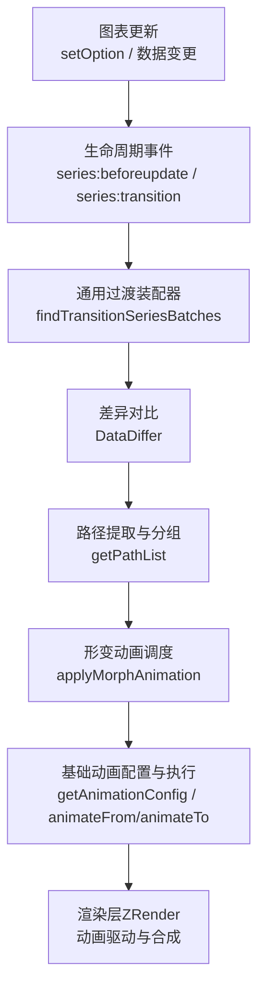
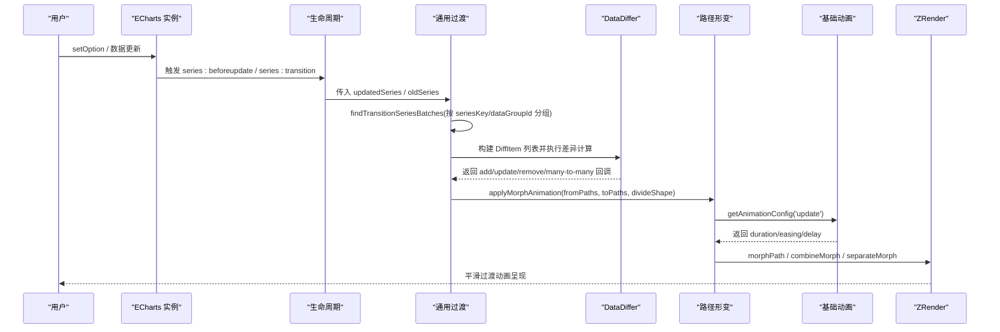
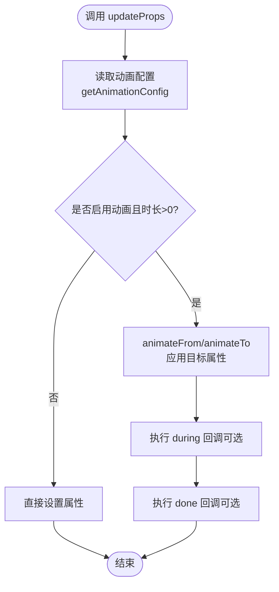
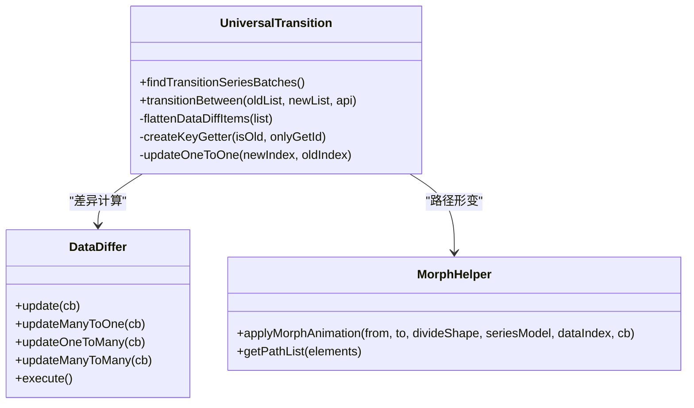
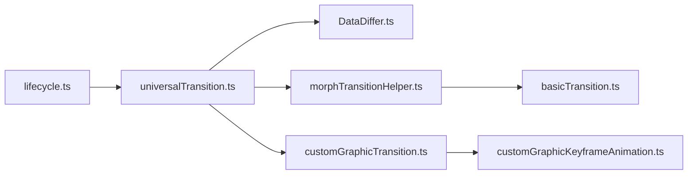

# 过渡动画

<cite>
**本文引用的文件**
- [universalTransition.ts](file://src/animation/universalTransition.ts)
- [basicTransition.ts](file://src/animation/basicTransition.ts)
- [morphTransitionHelper.ts](file://src/animation/morphTransitionHelper.ts)
- [customGraphicKeyframeAnimation.ts](file://src/animation/customGraphicKeyframeAnimation.ts)
- [customGraphicTransition.ts](file://src/animation/customGraphicTransition.ts)
- [DataDiffer.ts](file://src/data/DataDiffer.ts)
- [lifecycle.ts](file://src/core/lifecycle.ts)
- [universalTransition.html](file://test/universalTransition.html)
</cite>

## 目录
1. [简介](#简介)
2. [项目结构](#项目结构)
3. [核心组件](#核心组件)
4. [架构总览](#架构总览)
5. [详细组件分析](#详细组件分析)
6. [依赖关系分析](#依赖关系分析)
7. [性能考量](#性能考量)
8. [故障排查指南](#故障排查指南)
9. [结论](#结论)
10. [附录](#附录)

## 简介
本文件深入解析 ECharts 的数据更新过渡动画系统，重点覆盖：
- updateProps 方法的实现原理：元素属性变化检测、状态插值计算与动画执行流程。
- 通用过渡动画 universalTransition 的工作机制：元素匹配算法、路径插值计算与形态转换处理。
- 复杂数据的过渡动画：图形元素的增删改、样式平滑过渡与数据驱动的视觉映射更新。
- 性能优化策略：动画队列管理、内存回收与硬件加速支持。
- 最佳实践与常见问题解决方案。

## 项目结构
ECharts 的过渡动画由“基础动画”、“通用过渡”、“路径形变”和“自定义图形过渡”等模块协同完成，并通过生命周期钩子串联到图表更新流程中。

**图示来源**
- [lifecycle.ts:44-65](file://src/core/lifecycle.ts#L44-L65)
- [universalTransition.ts:544-674](file://src/animation/universalTransition.ts#L544-L674)
- [DataDiffer.ts:142-253](file://src/data/DataDiffer.ts#L142-L253)
- [morphTransitionHelper.ts:110-234](file://src/animation/morphTransitionHelper.ts#L110-L234)
- [basicTransition.ts:58-125](file://src/animation/basicTransition.ts#L58-L125)

**章节来源**
- [lifecycle.ts:44-65](file://src/core/lifecycle.ts#L44-L65)
- [universalTransition.ts:544-674](file://src/animation/universalTransition.ts#L544-L674)

## 核心组件
- 基础动画与属性更新：提供 getAnimationConfig、updateProps、initProps、removeElementWithFadeOut 等能力，统一动画配置与执行入口。
- 通用过渡：在系列维度进行跨类型、跨形状的过渡，负责数据项匹配、方向判定、批量形变与淡入淡出。
- 路径形变辅助：将图形元素转换为 Path 列表，并基于 zrender 的路径合并/拆分能力实现多对一、一对多、一对一的平滑过渡。
- 自定义图形过渡：为自定义系列或图形组件提供细粒度的 shape/style/extra 过渡控制，支持 during 回调与关键帧动画。
- 数据差异引擎：DataDiffer 提供 oneToOne/multiple 模式下的增删改与多对多映射，支撑复杂数据结构的过渡。

**章节来源**
- [basicTransition.ts:58-125](file://src/animation/basicTransition.ts#L58-L125)
- [universalTransition.ts:209-511](file://src/animation/universalTransition.ts#L209-L511)
- [morphTransitionHelper.ts:110-234](file://src/animation/morphTransitionHelper.ts#L110-L234)
- [customGraphicTransition.ts:129-208](file://src/animation/customGraphicTransition.ts#L129-L208)
- [DataDiffer.ts:142-253](file://src/data/DataDiffer.ts#L142-L253)

## 架构总览
ECharts 的过渡动画在 setOption 或数据更新时触发生命周期事件，通用过渡模块根据系列 key 与 dataGroupId 匹配旧/新数据，使用 DataDiffer 计算差异，再通过 morphTransitionHelper 对 Path 进行形变，最终调用基础动画执行。

**图示来源**
- [lifecycle.ts:44-65](file://src/core/lifecycle.ts#L44-L65)
- [universalTransition.ts:544-674](file://src/animation/universalTransition.ts#L544-L674)
- [DataDiffer.ts:142-253](file://src/data/DataDiffer.ts#L142-L253)
- [morphTransitionHelper.ts:110-234](file://src/animation/morphTransitionHelper.ts#L110-L234)
- [basicTransition.ts:58-125](file://src/animation/basicTransition.ts#L58-L125)

## 详细组件分析

### updateProps 方法：属性变化检测、状态插值与动画执行
- 职责：以统一的动画配置对元素属性进行更新，支持 enter/update/leave 三种场景；若禁用动画则直接设置属性。
- 关键点：
  - 通过 getAnimationConfig 获取动画时长、缓动与延迟，支持从 payload 覆盖。
  - 内部封装 animateOrSetProps，区分 isFrom（进入/恢复）与正常更新，调用 animateFrom/animateTo。
  - 支持 during 回调与 done 回调，便于在动画过程中动态调整或收尾。
  - removeElementWithFadeOut 会先移除文本内容，再执行淡出动画后从父节点移除。

**图示来源**
- [basicTransition.ts:58-125](file://src/animation/basicTransition.ts#L58-L125)
- [basicTransition.ts:127-199](file://src/animation/basicTransition.ts#L127-L199)
- [basicTransition.ts:219-231](file://src/animation/basicTransition.ts#L219-L231)
- [basicTransition.ts:303-324](file://src/animation/basicTransition.ts#L303-L324)

**章节来源**
- [basicTransition.ts:58-125](file://src/animation/basicTransition.ts#L58-L125)
- [basicTransition.ts:127-199](file://src/animation/basicTransition.ts#L127-L199)
- [basicTransition.ts:219-231](file://src/animation/basicTransition.ts#L219-L231)
- [basicTransition.ts:303-324](file://src/animation/basicTransition.ts#L303-L324)

### 通用过渡动画 universalTransition：元素匹配、路径插值与形态转换
- 元素匹配算法：
  - 通过 groupId/childGroupId 或数据 id 建立新旧数据项之间的对应关系，支持父子层级方向判断（parent->child、child->parent、none）。
  - 当所有 id 一致时优先使用 id 作为键，提高一对一匹配的鲁棒性。
- 路径插值与形态转换：
  - 使用 getPathList 收集可形变的 Path 节点，排除 disableMorphing/invisible/ignore 的元素。
  - 根据数量关系选择一对一、一对多、多对一或多对多形变策略，必要时进行路径拆分/合并。
  - 支持 divideShape（clone/split）控制形状分割方式，并在 clone 模式下自动近似透明度以保持视觉一致性。
- 动画执行流程：
  - 通过 DataDiffer 的 update/updateManyToOne/updateOneToMany/updateManyToMany 回调分别处理不同映射关系。
  - 对新增元素执行 fadeIn，对删除元素停止并移除，对复用元素执行 morph 动画。
  - 若存在形变动画，会为未参与形变但仍在视图中的 Path 补充淡入动画，保证视觉连贯。

**图示来源**
- [universalTransition.ts:209-511](file://src/animation/universalTransition.ts#L209-L511)
- [morphTransitionHelper.ts:110-234](file://src/animation/morphTransitionHelper.ts#L110-L234)
- [DataDiffer.ts:142-253](file://src/data/DataDiffer.ts#L142-L253)

**章节来源**
- [universalTransition.ts:209-511](file://src/animation/universalTransition.ts#L209-L511)
- [morphTransitionHelper.ts:110-234](file://src/animation/morphTransitionHelper.ts#L110-L234)
- [DataDiffer.ts:142-253](file://src/data/DataDiffer.ts#L142-L253)

### 复杂数据的过渡动画：增删改、样式平滑与视觉映射更新
- 增删改操作：
  - 新增：fadeInElement 将新元素初始透明度设为 0 并渐显。
  - 删除：stopAnimation + removeEl 立即停止并移除，避免残留变换影响后续动画。
  - 更新：根据匹配结果执行 morph 动画或样式过渡。
- 样式平滑过渡：
  - 通过 getOldStyle/saveOldStyle 保存旧样式，在通用过渡中对 Displayable 的子元素执行 animateFrom 样式过渡。
- 数据驱动的视觉映射更新：
  - 通过 encode 与维度信息定位 itemGroupId/itemChildGroupId，确保跨系列/跨维度的正确匹配。
  - 支持 divideShape 与 delay 函数，使大量数据项具备更自然的交错动画效果。

**章节来源**
- [universalTransition.ts:147-191](file://src/animation/universalTransition.ts#L147-L191)
- [universalTransition.ts:96-116](file://src/animation/universalTransition.ts#L96-L116)
- [morphTransitionHelper.ts:94-108](file://src/animation/morphTransitionHelper.ts#L94-L108)
- [basicTransition.ts:326-338](file://src/animation/basicTransition.ts#L326-L338)

### 自定义图形过渡与关键帧动画
- 自定义图形过渡：
  - applyUpdateTransition 支持 shape/style/extra 的独立过渡配置，可在 during 回调中实时修改属性。
  - 支持 leaveTo 定义退出动画的目标状态，配合 applyLeaveTransition 完成销毁前的过渡。
- 关键帧动画：
  - applyKeyframeAnimation 支持多关键帧、循环与 easing，自动排序并按 percent 插入关键帧。
  - 通过 stopPreviousKeyframeAnimationAndRestore 停止并恢复之前的关键帧动画状态，避免状态污染。

**章节来源**
- [customGraphicTransition.ts:129-208](file://src/animation/customGraphicTransition.ts#L129-L208)
- [customGraphicTransition.ts:228-252](file://src/animation/customGraphicTransition.ts#L228-L252)
- [customGraphicKeyframeAnimation.ts:52-163](file://src/animation/customGraphicKeyframeAnimation.ts#L52-L163)

## 依赖关系分析
- 生命周期与扩展点：
  - lifecycle 暴露 series:beforeupdate 与 series:transition 事件，供通用过渡模块注册监听。
  - installUniversalTransition 在 beforeupdate 中标记需要过渡的系列，在 transition 阶段执行匹配与形变。
- 数据差异与匹配：
  - DataDiffer 提供多种映射模式，支撑复杂数据结构的一一、多对一、一对多、多对多转换。
- 路径形变与基础动画：
  - morphTransitionHelper 依赖 zrender 的路径工具进行合并/拆分，basicTransition 提供统一的动画配置与执行。

**图示来源**
- [lifecycle.ts:44-65](file://src/core/lifecycle.ts#L44-L65)
- [universalTransition.ts:723-785](file://src/animation/universalTransition.ts#L723-L785)
- [DataDiffer.ts:142-253](file://src/data/DataDiffer.ts#L142-L253)
- [morphTransitionHelper.ts:110-234](file://src/animation/morphTransitionHelper.ts#L110-L234)
- [basicTransition.ts:58-125](file://src/animation/basicTransition.ts#L58-L125)
- [customGraphicTransition.ts:129-208](file://src/animation/customGraphicTransition.ts#L129-L208)
- [customGraphicKeyframeAnimation.ts:52-163](file://src/animation/customGraphicKeyframeAnimation.ts#L52-L163)

**章节来源**
- [lifecycle.ts:44-65](file://src/core/lifecycle.ts#L44-L65)
- [universalTransition.ts:723-785](file://src/animation/universalTransition.ts#L723-L785)

## 性能考量
- 大数据阈值限制：
  - universalTransition 对超过阈值的系列数据禁用通用过渡，避免性能瓶颈。
- 动画队列与批处理：
  - 通过 DataDiffer 一次性计算差异并分发回调，减少重复遍历。
  - morphTransitionHelper 将路径分组为批次，分批执行形变，降低单次开销。
- 内存回收：
  - 删除元素时停止并移除，避免悬挂动画与引用泄漏。
  - 仅保存可过渡系列的旧数据快照，减少内存占用。
- 硬件加速：
  - 依赖 ZRender 的动画与合成管线，利用 GPU 加速路径形变与样式过渡。
- 建议：
  - 合理设置 divideShape 与 delay 函数，避免过多同时进行的形变任务。
  - 对超大数据集考虑关闭通用过渡或使用采样/聚合策略。

**章节来源**
- [universalTransition.ts:118-144](file://src/animation/universalTransition.ts#L118-L144)
- [universalTransition.ts:769-784](file://src/animation/universalTransition.ts#L769-L784)
- [morphTransitionHelper.ts:110-234](file://src/animation/morphTransitionHelper.ts#L110-L234)

## 故障排查指南
- 动画不生效：
  - 检查是否启用了动画（isAnimationEnabled），确认 getAnimationConfig 返回的 duration > 0。
  - 确认元素未被标记为 disableMorphing/invisible/ignore，否则不参与形变。
- 匹配错误导致错乱：
  - 检查 encode 与 groupId/childGroupId 是否正确设置，确保新旧数据能正确匹配。
  - 对于多对多情况，确认 DataDiffer 的 multiple 模式与回调逻辑是否符合预期。
- 性能问题：
  - 大数据量下默认禁用通用过渡，如需开启请评估数据规模与设备性能。
  - 减少同时进行的形变数量，合理使用 delay 函数分散动画负载。
- 样式过渡异常：
  - 确保 saveOldStyle/getOldStyle 正确使用，避免新元素创建时丢失旧样式。
  - 在自定义图形过渡中，注意 during 回调对样式的修改时机与范围。

**章节来源**
- [basicTransition.ts:58-125](file://src/animation/basicTransition.ts#L58-L125)
- [morphTransitionHelper.ts:236-265](file://src/animation/morphTransitionHelper.ts#L236-L265)
- [universalTransition.ts:96-116](file://src/animation/universalTransition.ts#L96-L116)
- [DataDiffer.ts:142-253](file://src/data/DataDiffer.ts#L142-L253)

## 结论
ECharts 的过渡动画体系以“基础动画 + 通用过渡 + 路径形变”为核心，结合生命周期与数据差异引擎，实现了跨系列、跨形状的平滑过渡。updateProps 提供了统一的属性更新入口，universalTransition 解决了复杂数据与形态变化的匹配与插值问题。通过合理的配置与性能策略，可以在保证流畅体验的同时应对大规模数据场景。

## 附录
- 示例参考：
  - 通用过渡的多图表类型切换与多级钻取演示见测试用例。
- 最佳实践：
  - 明确设置 seriesKey 与 dataGroupId，确保跨系列过渡的稳定性。
  - 对大量数据项使用 divideShape=split 与 delay 函数，提升视觉层次与性能。
  - 在自定义图形中使用 during 回调精细控制动画过程，避免状态冲突。

**章节来源**
- [universalTransition.html:54-191](file://test/universalTransition.html#L54-L191)