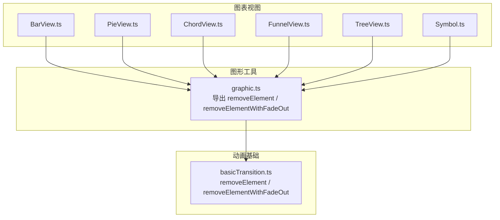
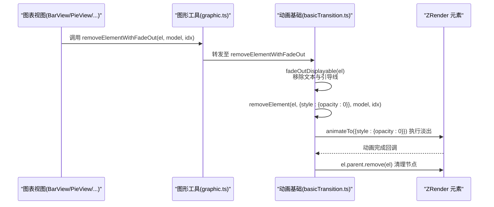
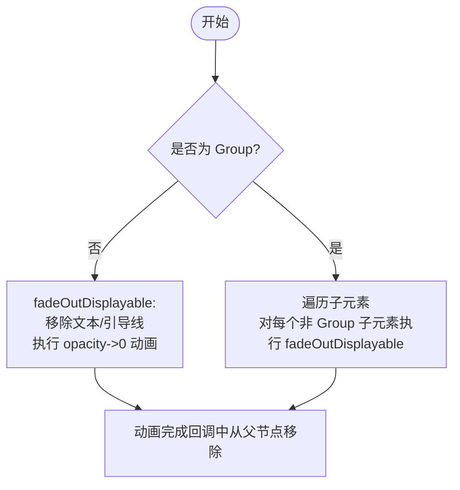
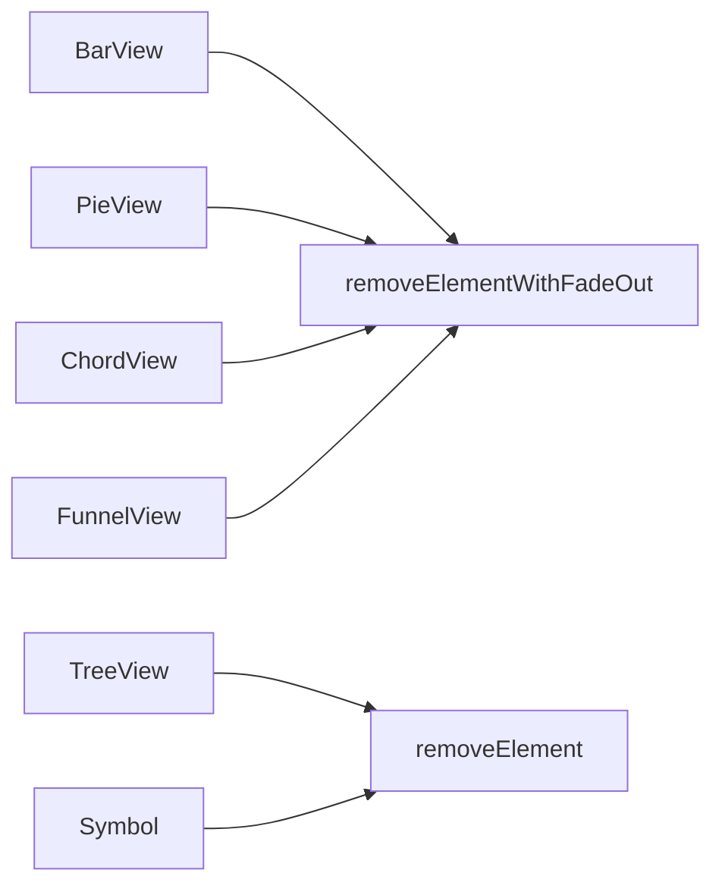
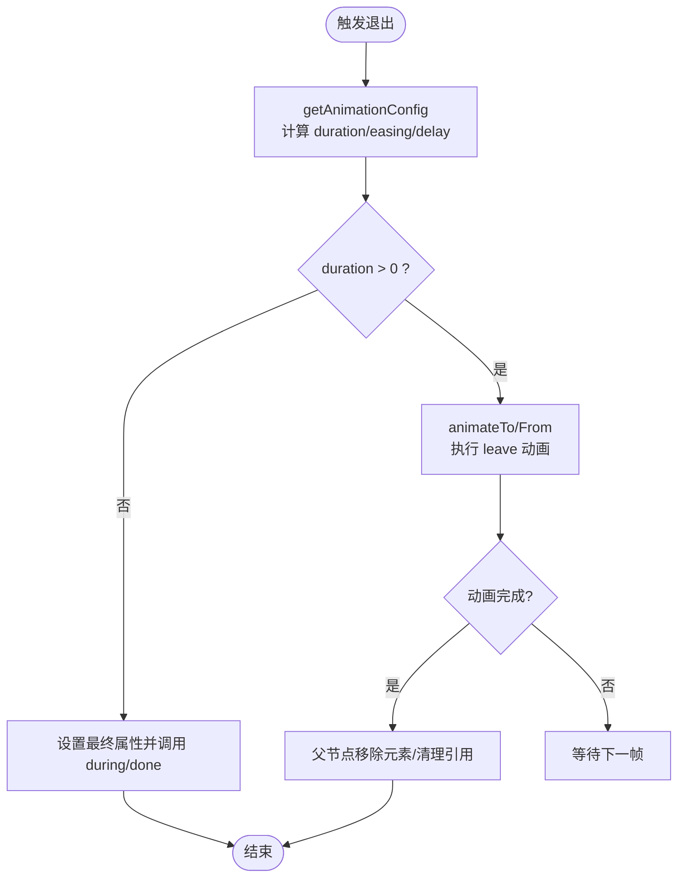
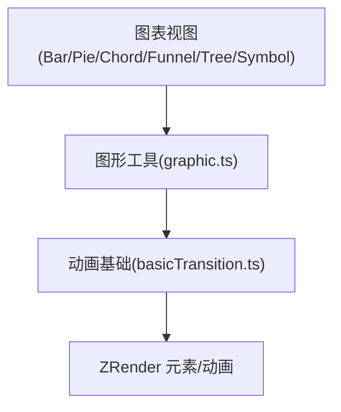

# 退出动画

<cite>
**本文引用的文件**
- [basicTransition.ts](file://src/animation/basicTransition.ts)
- [graphic.ts](file://src/util/graphic.ts)
- [BarView.ts](file://src/chart/bar/BarView.ts)
- [PieView.ts](file://src/chart/pie/PieView.ts)
- [ChordView.ts](file://src/chart/chord/ChordView.ts)
- [FunnelView.ts](file://src/chart/funnel/FunnelView.ts)
- [TreeView.ts](file://src/chart/tree/TreeView.ts)
- [Symbol.ts](file://src/chart/helper/Symbol.ts)
</cite>

## 目录
1. [简介](#简介)
2. [项目结构](#项目结构)
3. [核心组件](#核心组件)
4. [架构总览](#架构总览)
5. [详细组件分析](#详细组件分析)
6. [依赖关系分析](#依赖关系分析)
7. [性能考量](#性能考量)
8. [故障排查指南](#故障排查指南)
9. [结论](#结论)
10. [附录：配置与扩展](#附录：配置与扩展)

## 简介
本文聚焦 ECharts 图表元素的“退出动画”机制，系统阐述 removeElement 与 removeElementWithFadeOut 的差异、淡出动画的视觉实现（透明度渐变、尺寸收缩、位置移动等）、不同图表类型的退出表现（节点移除、边线消失、标签淡出），以及动画生命周期管理（完成回调、资源清理与内存优化）。文末提供退出动画的配置项与自定义扩展方法，并给出实际应用场景的代码路径参考。

## 项目结构
退出动画的核心位于动画基础过渡模块与图形工具层，各图表视图通过调用统一接口触发退出流程：
- 动画基础过渡：定义获取动画配置、进入/更新/离开动画的统一入口，以及 removeElement 与 removeElementWithFadeOut 的实现。
- 图形工具层：对外暴露 removeElement/removeElementWithFadeOut 等能力，供各图表 View 使用。
- 图表视图：在数据差异阶段对“将被移除”的元素调用相应退出接口，完成淡出或立即移除。

**图表来源**
- [basicTransition.ts:272-324](file://src/animation/basicTransition.ts#L272-L324)
- [graphic.ts:77-92](file://src/util/graphic.ts#L77-L92)
- [BarView.ts:436-439](file://src/chart/bar/BarView.ts#L436-L439)
- [PieView.ts:290-295](file://src/chart/pie/PieView.ts#L290-L295)
- [ChordView.ts:81-96](file://src/chart/chord/ChordView.ts#L81-L96)
- [FunnelView.ts:209-209](file://src/chart/funnel/FunnelView.ts#L209-L209)
- [TreeView.ts:594-661](file://src/chart/tree/TreeView.ts#L594-L661)
- [Symbol.ts:377-394](file://src/chart/helper/Symbol.ts#L377-L394)

**章节来源**
- [basicTransition.ts:58-125](file://src/animation/basicTransition.ts#L58-L125)
- [graphic.ts:77-92](file://src/util/graphic.ts#L77-L92)

## 核心组件
- 动画配置获取：根据系列模型与数据索引计算是否启用动画、时长、缓动与延迟；支持从全局 payload 覆盖。
- 通用属性动画：封装 enter/update/leave 三类动画，统一处理动画停止、最终状态设置、during 回调与 done 回调。
- 元素移除：
  - removeElement：执行 leave 动画到目标属性（如样式、形状、位置），完成后由上层决定是否从父节点移除。
  - removeElementWithFadeOut：先移除文本内容与引导线，再对 Displayable 执行透明度渐变为 0 的淡出动画；动画结束后将元素从父节点移除，避免残留。
- 元素移除检测：isElementRemoved 用于判断元素是否已有 leave 动画，防止重复触发。

**章节来源**
- [basicTransition.ts:58-125](file://src/animation/basicTransition.ts#L58-L125)
- [basicTransition.ts:127-199](file://src/animation/basicTransition.ts#L127-L199)
- [basicTransition.ts:252-324](file://src/animation/basicTransition.ts#L252-L324)

## 架构总览
下图展示了从图表视图到动画基础层的调用链，以及淡出动画的关键步骤。

**图表来源**
- [graphic.ts:77-92](file://src/util/graphic.ts#L77-L92)
- [basicTransition.ts:288-324](file://src/animation/basicTransition.ts#L288-L324)

## 详细组件分析

### removeElement vs removeElementWithFadeOut
- removeElement
  - 作用：以 leave 动画过渡到指定属性（例如样式、形状、位置），不强制从父节点移除，适合需要保留 DOM/ZR 节点但仅做视觉退出的场景。
  - 典型用法：在树图/力导图中对边或符号进行形态/位置变化后，再决定何时从父节点移除。
- removeElementWithFadeOut
  - 作用：先隐藏文本与引导线，再对可显示元素执行透明度渐变为 0 的淡出动画；动画完成后自动从父节点移除，避免内存泄漏。
  - 典型用法：柱状图、饼图等常规图表的数据项被删除时，提供一致的“淡出消失”体验。

**图表来源**
- [basicTransition.ts:288-324](file://src/animation/basicTransition.ts#L288-L324)

**章节来源**
- [basicTransition.ts:272-324](file://src/animation/basicTransition.ts#L272-L324)

### 淡出动画的视觉实现
- 透明度渐变：通过 animateTo({ style: { opacity: 0 } }) 实现，时长、缓动与延迟来自 getAnimationConfig。
- 尺寸收缩：若业务侧传入 shape 或 transform 的目标值（例如 width/height 归零或缩放为 0），则配合 leave 动画实现收缩效果。
- 位置移动：可在 removeElement 的目标属性中指定 position 变化，使元素在淡出过程中移动至某处。
- 文本与引导线：fadeOutDisplayable 会先移除文本内容与引导线，确保标签不会在淡出期间遮挡或错位。

**章节来源**
- [basicTransition.ts:127-199](file://src/animation/basicTransition.ts#L127-L199)
- [basicTransition.ts:288-324](file://src/animation/basicTransition.ts#L288-L324)

### 不同图表类型的退出动画
- 柱状图（BarView）
  - 在数据差异的 remove 阶段调用 removeElementWithFadeOut，实现柱子淡出消失。
  - 当圆角端点类型变更导致无法复用旧形状时，先淡出旧元素再创建新元素。
- 饼图（PieView）
  - 扇形片在数据减少时调用 removeElementWithFadeOut，实现扇形淡出。
- 弦图（ChordView）
  - 弦段与相关元素在数据减少时调用 removeElementWithFadeOut，保证一致退出体验。
- 漏斗图（FunnelView）
  - 漏斗片段在数据减少时调用 removeElementWithFadeOut。
- 树图（TreeView）
  - 边与节点符号在数据减少时调用 removeElement（直接移除）或结合淡出策略，视交互需求而定。
- 符号（Symbol）
  - 在部分场景下直接调用 removeElement 移除文本内容或引导线，配合整体退出流程。

**图表来源**
- [BarView.ts:436-439](file://src/chart/bar/BarView.ts#L436-L439)
- [PieView.ts:290-295](file://src/chart/pie/PieView.ts#L290-L295)
- [ChordView.ts:81-96](file://src/chart/chord/ChordView.ts#L81-L96)
- [FunnelView.ts:209-209](file://src/chart/funnel/FunnelView.ts#L209-L209)
- [TreeView.ts:594-661](file://src/chart/tree/TreeView.ts#L594-L661)
- [Symbol.ts:377-394](file://src/chart/helper/Symbol.ts#L377-L394)

**章节来源**
- [BarView.ts:360-439](file://src/chart/bar/BarView.ts#L360-L439)
- [PieView.ts:290-295](file://src/chart/pie/PieView.ts#L290-L295)
- [ChordView.ts:81-96](file://src/chart/chord/ChordView.ts#L81-L96)
- [FunnelView.ts:209-209](file://src/chart/funnel/FunnelView.ts#L209-L209)
- [TreeView.ts:594-661](file://src/chart/tree/TreeView.ts#L594-L661)
- [Symbol.ts:377-394](file://src/chart/helper/Symbol.ts#L377-L394)

### 动画生命周期管理
- 动画配置获取：getAnimationConfig 综合系列模型与全局 payload，返回 duration/easing/delay。
- 动画执行：animateOrSetProps 统一处理 enter/update/leave 三类动画，支持 during 与 done 回调，并在非 leave 时停止 leave 动画以避免冲突。
- 完成回调与清理：removeElementWithFadeOut 在淡出动画完成后从父节点移除元素，释放引用，避免内存泄漏。
- 防重入：isElementRemoved 检测元素是否已有 leave 动画，避免重复触发。

**图表来源**
- [basicTransition.ts:58-125](file://src/animation/basicTransition.ts#L58-L125)
- [basicTransition.ts:127-199](file://src/animation/basicTransition.ts#L127-L199)
- [basicTransition.ts:252-324](file://src/animation/basicTransition.ts#L252-L324)

**章节来源**
- [basicTransition.ts:58-125](file://src/animation/basicTransition.ts#L58-L125)
- [basicTransition.ts:127-199](file://src/animation/basicTransition.ts#L127-L199)
- [basicTransition.ts:252-324](file://src/animation/basicTransition.ts#L252-L324)

## 依赖关系分析
- 图表视图依赖图形工具层提供的 removeElement/removeElementWithFadeOut。
- 图形工具层依赖动画基础层实现具体动画逻辑。
- 动画基础层依赖 ZRender 的 Element/Displayable/Group 与动画系统。

**图表来源**
- [graphic.ts:77-92](file://src/util/graphic.ts#L77-L92)
- [basicTransition.ts:272-324](file://src/animation/basicTransition.ts#L272-L324)

**章节来源**
- [graphic.ts:77-92](file://src/util/graphic.ts#L77-L92)
- [basicTransition.ts:272-324](file://src/animation/basicTransition.ts#L272-L324)

## 性能考量
- 动画开关与时长：通过 animationDuration/animationDurationUpdate 控制是否启用及持续时间，大数据量场景建议缩短时长或关闭动画以提升性能。
- 延迟与批量：animationDelay 可用于错开多个元素的退出时间，避免同时大量动画造成卡顿。
- 文本与引导线：fadeOutDisplayable 提前移除文本与引导线，减少渲染负担。
- 重复触发防护：isElementRemoved 避免同一元素多次触发 leave 动画，降低不必要的开销。
- 资源清理：淡出完成后立即从父节点移除元素，释放引用，避免内存泄漏。

[本节为通用指导，不直接分析具体文件]

## 故障排查指南
- 元素未正确移除
  - 检查是否在 removeElementWithFadeOut 的动画完成回调中执行了父节点移除。
  - 确认元素未被其他引用持有，避免 GC 无法回收。
- 动画未生效
  - 检查 series 的 animationEnabled 与 animationDuration 配置。
  - 确认 getAnimationConfig 返回的 duration 大于 0。
- 标签闪烁或残留
  - 确认 fadeOutDisplayable 已移除文本与引导线。
  - 检查是否有其他动画覆盖了透明度或位置。
- 重复触发
  - 使用 isElementRemoved 判断是否已有 leave 动画，避免重复调用。

**章节来源**
- [basicTransition.ts:252-324](file://src/animation/basicTransition.ts#L252-L324)

## 结论
ECharts 的退出动画通过统一的动画基础层实现，图表视图仅需调用 removeElement 或 removeElementWithFadeOut 即可获得一致的退出体验。前者适用于需要精细控制的形态/位置变化，后者提供开箱即用的淡出消失并自动清理资源。通过合理的配置与生命周期管理，可在保证视觉效果的同时兼顾性能与内存安全。

[本节为总结性内容，不直接分析具体文件]

## 附录：配置与扩展

### 退出动画配置选项
- 系列级动画配置（影响进入/更新/离开）
  - animationEnabled：是否启用动画。
  - animationDuration / animationDurationUpdate：进入/更新时长。
  - animationEasing / animationEasingUpdate：缓动函数。
  - animationDelay / animationDelayUpdate：延迟。
- 全局覆盖（payload）
  - 可通过 updatePayload.animation 临时覆盖 duration/easing/delay。
- 自定义目标属性
  - removeElement 可传入目标属性（如 style.opacity、shape、position），实现透明度、尺寸、位置的组合动画。

**章节来源**
- [basicTransition.ts:58-125](file://src/animation/basicTransition.ts#L58-L125)
- [basicTransition.ts:127-199](file://src/animation/basicTransition.ts#L127-L199)

### 常见使用场景与代码路径
- 柱状图数据项删除：调用 removeElementWithFadeOut 实现淡出消失
  - [BarView.ts:436-439](file://src/chart/bar/BarView.ts#L436-L439)
- 饼图扇形片删除：调用 removeElementWithFadeOut
  - [PieView.ts:290-295](file://src/chart/pie/PieView.ts#L290-L295)
- 弦图元素删除：调用 removeElementWithFadeOut
  - [ChordView.ts:81-96](file://src/chart/chord/ChordView.ts#L81-L96)
- 漏斗图片段删除：调用 removeElementWithFadeOut
  - [FunnelView.ts:209-209](file://src/chart/funnel/FunnelView.ts#L209-L209)
- 树图边/符号删除：调用 removeElement（直接移除）
  - [TreeView.ts:594-661](file://src/chart/tree/TreeView.ts#L594-L661)
- 符号文本/引导线移除：调用 removeElement
  - [Symbol.ts:377-394](file://src/chart/helper/Symbol.ts#L377-L394)

### 自定义扩展方法
- 自定义淡出行为：基于 removeElement 传入目标属性，组合 opacity、scale、position 等实现更丰富的退出效果。
- 批量退出：利用 animationDelay 函数按索引计算延迟，实现交错退出的视觉节奏。
- 监听完成：通过 done 回调执行后续逻辑（如统计更新、缓存清理）。

**章节来源**
- [basicTransition.ts:127-199](file://src/animation/basicTransition.ts#L127-L199)
- [basicTransition.ts:272-324](file://src/animation/basicTransition.ts#L272-L324)