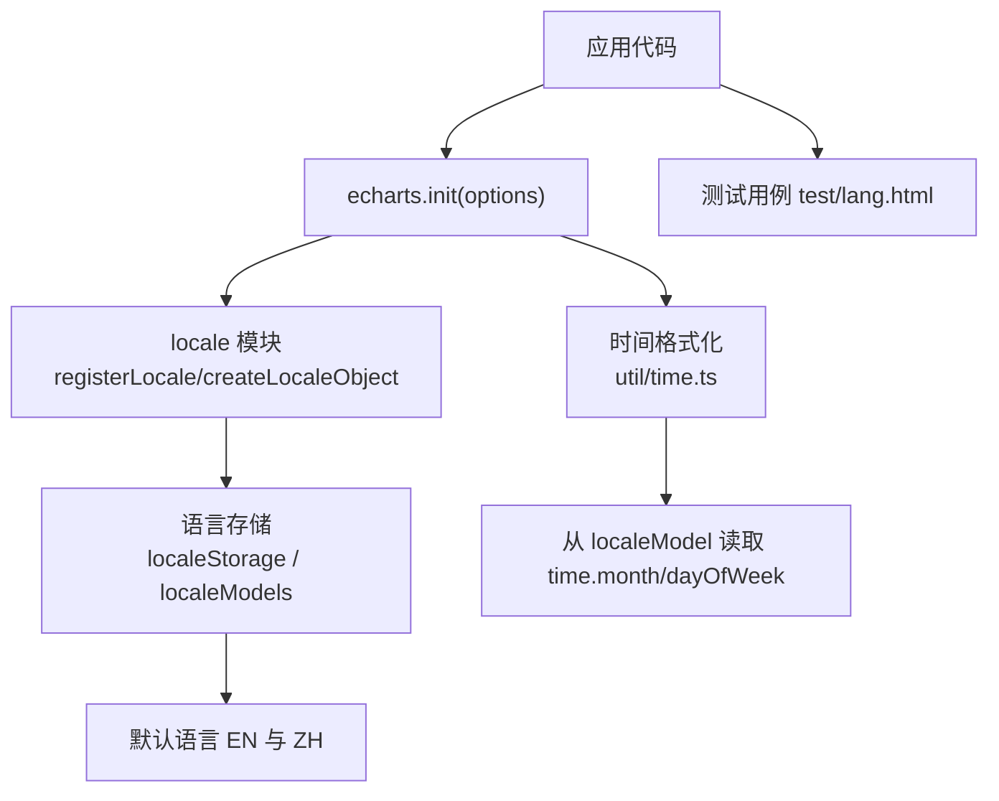
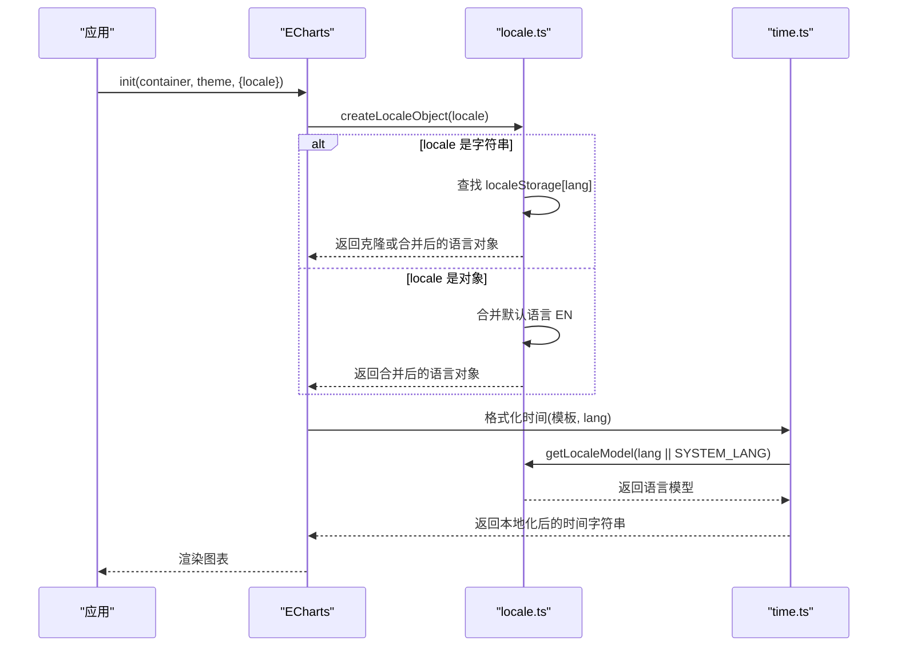
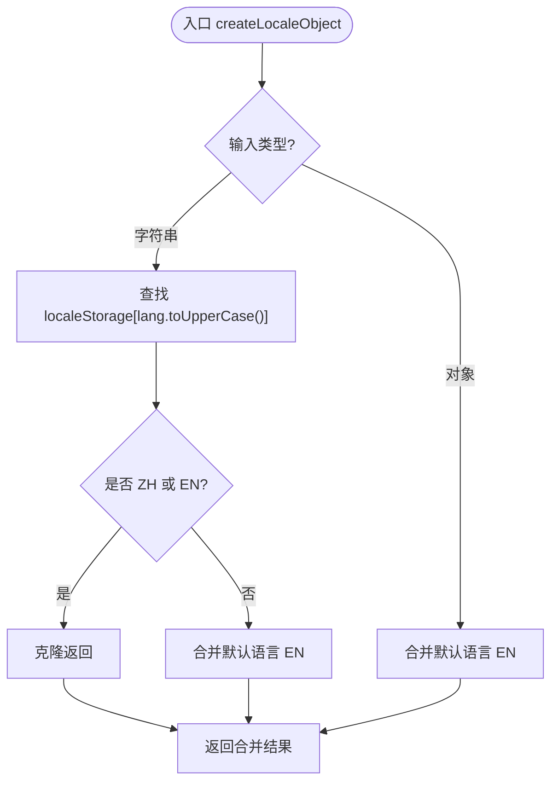
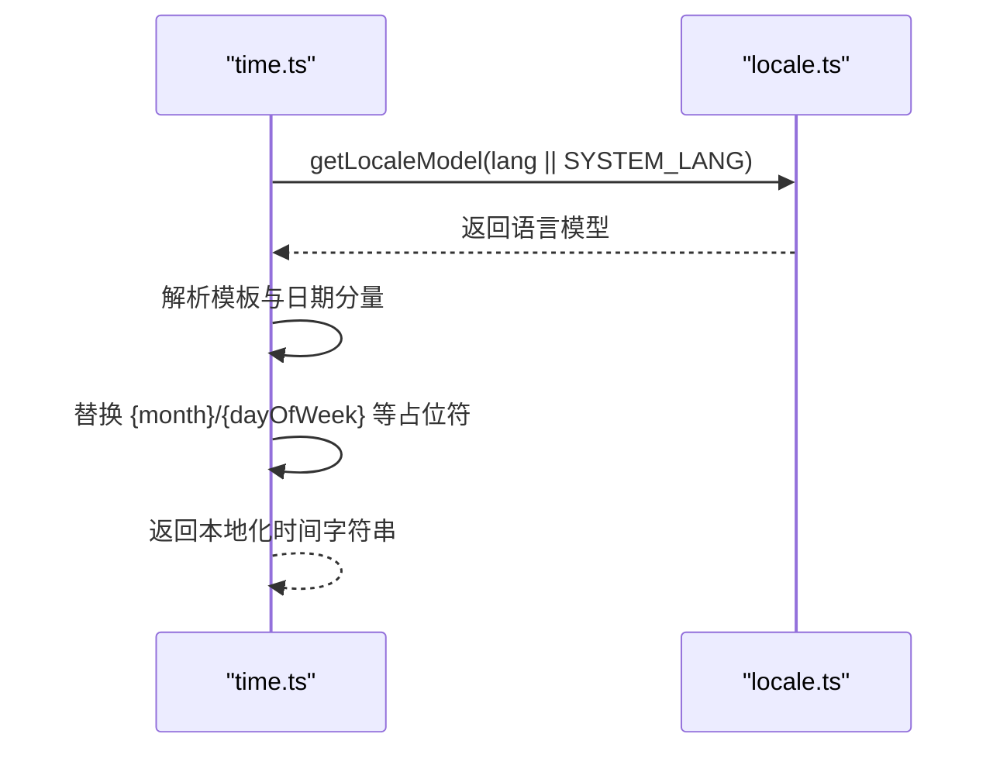
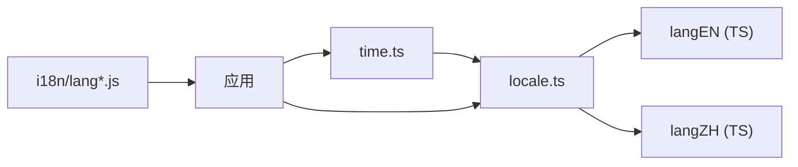

# 国际化

<cite>
**本文引用的文件**
- [src/core/locale.ts](file://src/core/locale.ts)
- [src/i18n/langZH.ts](file://src/i18n/langZH.ts)
- [src/i18n/langEN.ts](file://src/i18n/langEN.ts)
- [i18n/langZH.js](file://i18n/langZH.js)
- [i18n/langEN.js](file://i18n/langEN.js)
- [i18n/langJA.js](file://i18n/langJA.js)
- [i18n/langKO.js](file://i18n/langKO.js)
- [src/util/time.ts](file://src/util/time.ts)
- [test/lang.html](file://test/lang.html)
</cite>

## 目录
1. [简介](#简介)
2. [项目结构](#项目结构)
3. [核心组件](#核心组件)
4. [架构总览](#架构总览)
5. [详细组件分析](#详细组件分析)
6. [依赖关系分析](#依赖关系分析)
7. [性能与最佳实践](#性能与最佳实践)
8. [故障排查指南](#故障排查指南)
9. [结论](#结论)
10. [附录：多语言示例与部署方案](#附录多语言示例与部署方案)

## 简介
本章节介绍 ECharts 的国际化（i18n）能力，包括内置语言包的使用、自定义语言包的创建与加载机制、日期时间本地化与格式化、以及在生产环境中的懒加载、缓存与性能优化策略。文档同时提供完整的多语言应用示例与部署建议，并总结常见问题及解决方案。

## 项目结构
ECharts 的国际化由以下关键部分组成：
- 运行时国际化核心：负责语言注册、系统语言检测、默认语言回退与合并策略。
- 内置语言包：提供中文、英文、日文、韩文等多种语言的翻译键值。
- 日期时间格式化：基于语言模型进行月份、星期等本地化输出。
- 测试用例：演示多种语言切换与动态修改语言包的方式。

图表来源
- [src/core/locale.ts:39-81](file://src/core/locale.ts#L39-L81)
- [src/util/time.ts:286-318](file://src/util/time.ts#L286-L318)
- [test/lang.html:138-234](file://test/lang.html#L138-L234)

章节来源
- [src/core/locale.ts:39-81](file://src/core/locale.ts#L39-L81)
- [src/util/time.ts:286-318](file://src/util/time.ts#L286-L318)
- [test/lang.html:138-234](file://test/lang.html#L138-L234)

## 核心组件
- 语言注册与获取
  - registerLocale：将语言包以“语言标识 -> 语言对象”的形式注册到内存中，并构建对应的 Model。
  - createLocaleObject：根据传入的语言标识或语言对象，生成最终使用的语言数据；对非 ZH/EN 的语言会合并默认语言 EN 作为回退。
  - SYSTEM_LANG：在支持 DOM 的环境下，优先使用 document.documentElement.lang 或 navigator.language，并将包含“ZH”的语言识别为中文，否则使用默认英文。
- 内置语言包
  - src/i18n/langZH.ts 与 src/i18n/langEN.ts：TypeScript 源定义，导出标准语言对象结构。
  - i18n/lang*.js：打包后的语言包，调用 echarts.registerLocale('XX', localeObj) 完成注册。
- 日期时间本地化
  - util/time.ts：在格式化时通过 getLocaleModel(lang || SYSTEM_LANG) 或 getDefaultLocaleModel() 获取语言模型，读取 time.month、monthAbbr、dayOfWeek、dayOfWeekAbbr 等字段进行替换。

章节来源
- [src/core/locale.ts:39-81](file://src/core/locale.ts#L39-L81)
- [src/i18n/langZH.ts:20-140](file://src/i18n/langZH.ts#L20-L140)
- [src/i18n/langEN.ts:24-144](file://src/i18n/langEN.ts#L24-L144)
- [i18n/langZH.js:43-165](file://i18n/langZH.js#L43-L165)
- [i18n/langEN.js:47-169](file://i18n/langEN.js#L47-L169)
- [src/util/time.ts:286-318](file://src/util/time.ts#L286-L318)

## 架构总览
下图展示了 ECharts 初始化时的国际化流程：应用传入 options.locale，核心模块根据语言标识或对象构造最终语言数据，并在渲染过程中用于 UI 文案与日期时间格式化。

图表来源
- [src/core/locale.ts:56-77](file://src/core/locale.ts#L56-L77)
- [src/util/time.ts:286-318](file://src/util/time.ts#L286-L318)

## 详细组件分析

### 语言注册与合并机制
- registerLocale
  - 作用：将语言包注册到全局存储，并创建对应的 Model 实例，便于后续按 key 取值。
  - 行为：语言标识统一转为大写，避免大小写不一致导致的查找失败。
- createLocaleObject
  - 输入：字符串语言标识或语言对象。
  - 逻辑：
    - 若为字符串：从 localeStorage 查找对应语言对象；若为 ZH 或 EN 则直接克隆返回；否则与默认语言 EN 合并，确保缺失键有回退值。
    - 若为对象：直接与该对象与默认语言 EN 合并，保证完整性。
- SYSTEM_LANG
  - 行为：在非 DOM 环境使用默认英文；在浏览器环境中优先读取 document.documentElement.lang 或 navigator.language，并将包含“ZH”的语言视为中文。

图表来源
- [src/core/locale.ts:56-69](file://src/core/locale.ts#L56-L69)

章节来源
- [src/core/locale.ts:39-81](file://src/core/locale.ts#L39-L81)

### 内置语言包结构与使用
- 语言对象结构
  - time：包含 month、monthAbbr、dayOfWeek、dayOfWeekAbbr，用于日期时间本地化。
  - legend.selector：图例选择器文案（全选、反选）。
  - toolbox：工具栏功能文案（数据视图、区域缩放、还原、保存图片等）。
  - series.typeNames：各系列类型的名称映射。
  - aria：无障碍描述文案。
- 使用方式
  - 通过 i18n/lang*.js 文件调用 echarts.registerLocale('XX', localeObj) 完成注册。
  - 或通过 TypeScript 源文件导出语言对象，在应用中手动注册。

章节来源
- [i18n/langZH.js:43-165](file://i18n/langZH.js#L43-L165)
- [i18n/langEN.js:47-169](file://i18n/langEN.js#L47-L169)
- [src/i18n/langZH.ts:20-140](file://src/i18n/langZH.ts#L20-L140)
- [src/i18n/langEN.ts:24-144](file://src/i18n/langEN.ts#L24-L144)

### 日期时间本地化与格式化
- 本地化来源
  - 通过 getLocaleModel(lang || SYSTEM_LANG) 或 getDefaultLocaleModel() 获取语言模型。
  - 读取 time.month、monthAbbr、dayOfWeek、dayOfWeekAbbr 等字段。
- 模板替换
  - 支持 {yyyy}/{yy}/{MMMM}/{MMM}/{MM}/{M}/{dd}/{d}/{HH}/{mm}/{ss}/{SSS}/{a}/{A}/{Q}/{eeee}/{ee}/{e} 等占位符。
  - 根据模板与当前日期计算结果进行替换，得到本地化显示文本。

图表来源
- [src/util/time.ts:286-318](file://src/util/time.ts#L286-L318)
- [src/core/locale.ts:71-77](file://src/core/locale.ts#L71-L77)

章节来源
- [src/util/time.ts:286-318](file://src/util/time.ts#L286-L318)
- [src/core/locale.ts:71-77](file://src/core/locale.ts#L71-L77)

### 多语言切换与动态修改示例
- 自动默认语言：不传 locale 时，依据系统语言或默认英文。
- 传入语言对象：直接传入语言对象作为 locale，实现单实例局部语言。
- 动态修改语言包：先注册一个自定义语言标识（如 ZH-mod），再修改其文案后使用该标识。
- 按需引入其他语言：通过 require 引入 i18n/lang*.js 并设置 locale。

章节来源
- [test/lang.html:138-234](file://test/lang.html#L138-L234)

## 依赖关系分析
- locale.ts 依赖
  - zrender 的环境判断与工具函数。
  - 内置语言包 langEN 与 langZH（TS 源）。
  - 提供 registerLocale、createLocaleObject、getLocaleModel、getDefaultLocaleModel 等 API。
- time.ts 依赖
  - 通过 locale.ts 获取语言模型，读取 time.* 字段进行本地化。
- 语言包文件
  - i18n/lang*.js：通过 echarts.registerLocale 完成注册，供应用按需引入。

图表来源
- [src/core/locale.ts:20-26](file://src/core/locale.ts#L20-L26)
- [src/util/time.ts:32-33](file://src/util/time.ts#L32-L33)
- [i18n/langJA.js:169-170](file://i18n/langJA.js#L169-L170)
- [i18n/langKO.js:169-170](file://i18n/langKO.js#L169-L170)

章节来源
- [src/core/locale.ts:20-26](file://src/core/locale.ts#L20-L26)
- [src/util/time.ts:32-33](file://src/util/time.ts#L32-L33)
- [i18n/langJA.js:169-170](file://i18n/langJA.js#L169-L170)
- [i18n/langKO.js:169-170](file://i18n/langKO.js#L169-L170)

## 性能与最佳实践
- 语言包懒加载
  - 按需引入 i18n/lang*.js，仅在需要时加载特定语言，减少首屏体积。
  - 结合路由或用户偏好，延迟加载非默认语言。
- 缓存策略
  - 语言对象在 createLocaleObject 中会被克隆与合并，建议在应用层缓存已生成的语言对象，避免重复合并。
  - 对于频繁切换的场景，可维护一个语言对象池，复用已创建的实例。
- 默认语言回退
  - 非 ZH/EN 的语言会与默认英文合并，确保缺失键不影响显示。生产环境建议补全常用键，减少回退带来的额外合并开销。
- 时间格式化优化
  - 模板字符串尽量简洁，避免复杂表达式；批量更新时复用模板以减少正则与替换成本。
- 多实例隔离
  - 每个图表实例可通过传入不同的 locale 对象实现独立语言，避免全局状态污染。

[本节为通用指导，不直接分析具体文件]

## 故障排查指南
- 语言未生效
  - 检查是否正确调用 registerLocale，并确保语言标识一致（注意大小写）。
  - 确认 createLocaleObject 的输入是否为字符串或对象，且未被意外覆盖。
- 部分文案缺失
  - 非 ZH/EN 的语言会合并默认英文，若仍缺失，需检查语言包是否完整。
- 时间显示异常
  - 确认传入的 lang 参数有效，或 SYSTEM_LANG 是否正确识别。
  - 检查时间模板是否包含支持的占位符。
- 多语言切换闪烁
  - 避免在高频操作中反复创建语言对象；建议使用缓存或预加载。

章节来源
- [src/core/locale.ts:56-77](file://src/core/locale.ts#L56-L77)
- [src/util/time.ts:286-318](file://src/util/time.ts#L286-L318)
- [test/lang.html:157-178](file://test/lang.html#L157-L178)

## 结论
ECharts 的国际化体系通过集中式的语言注册与合并机制，提供了灵活的多语言支持。内置语言包覆盖了常见场景，开发者可按需引入与扩展。配合懒加载与缓存策略，可在保证用户体验的同时优化性能。时间本地化与模板化格式化为多语言展示提供了强大支撑。

[本节为总结性内容，不直接分析具体文件]

## 附录：多语言示例与部署方案
- 示例参考
  - 自动默认语言、传入语言对象、动态修改语言包、按需引入其他语言等，均可在测试用例中找到完整示例。
- 部署建议
  - 前端构建：仅引入需要的语言包，减小打包体积。
  - 服务端渲染：在服务端根据请求语言选择语言包，避免客户端二次加载。
  - CDN 缓存：将语言包文件加入长期缓存，提升重复访问速度。
  - 版本管理：语言包与主库版本对齐，避免接口变更导致的不兼容。

章节来源
- [test/lang.html:138-234](file://test/lang.html#L138-L234)