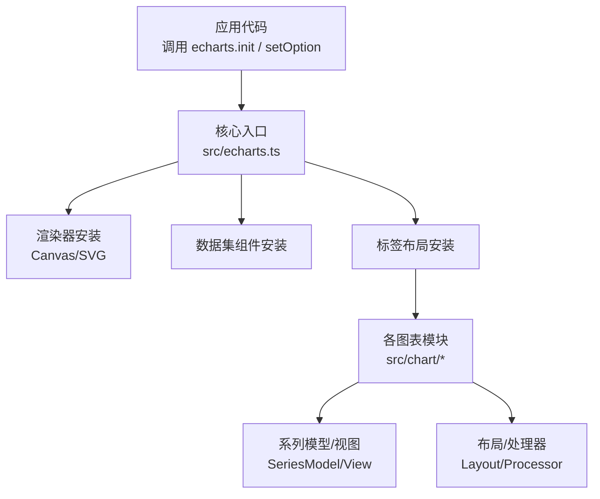
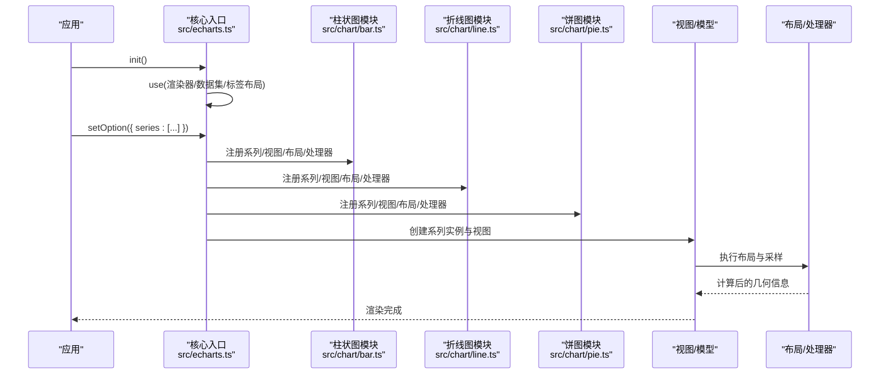
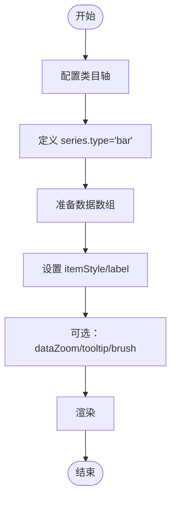
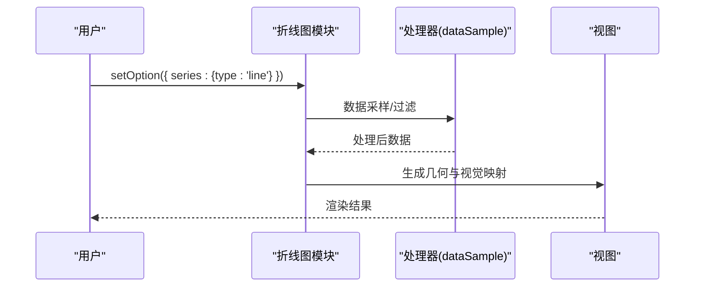
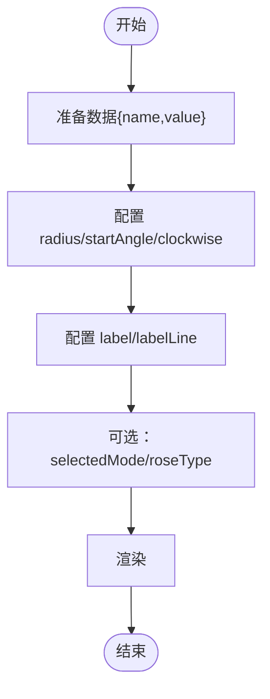
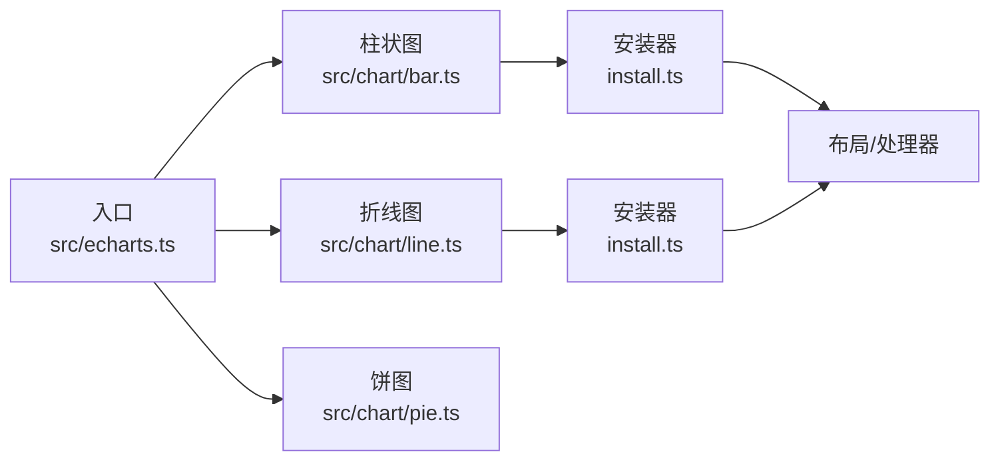

# 图表类型

<cite>
**本文引用的文件**
- [README.md](file://README.md)
- [src/echarts.ts](file://src/echarts.ts)
- [src/chart/bar.ts](file://src/chart/bar.ts)
- [src/chart/line.ts](file://src/chart/line.ts)
- [src/chart/pie.ts](file://src/chart/pie.ts)
- [src/chart/scatter.ts](file://src/chart/scatter.ts)
- [src/chart/graph.ts](file://src/chart/graph.ts)
- [src/chart/heatmap.ts](file://src/chart/heatmap.ts)
- [src/chart/gauge.ts](file://src/chart/gauge.ts)
- [src/chart/sankey.ts](file://src/chart/sankey.ts)
- [src/chart/radar.ts](file://src/chart/radar.ts)
- [src/chart/tree.ts](file://src/chart/tree.ts)
- [src/chart/bar/install.ts](file://src/chart/bar/install.ts)
- [src/chart/line/install.ts](file://src/chart/line/install.ts)
- [test/bar.html](file://test/bar.html)
- [test/line.html](file://test/line.html)
- [test/pie.html](file://test/pie.html)
</cite>

## 目录
1. [简介](#简介)
2. [项目结构](#项目结构)
3. [核心组件](#核心组件)
4. [架构总览](#架构总览)
5. [详细组件分析](#详细组件分析)
6. [依赖关系分析](#依赖关系分析)
7. [性能考虑](#性能考虑)
8. [故障排查指南](#故障排查指南)
9. [结论](#结论)
10. [附录](#附录)

## 简介
本文件面向希望系统掌握 ECharts 图表类型与用法的读者，按类别梳理基础、高级、统计与特殊图表的适用场景、核心配置项、数据格式要求与视觉效果定制方法。同时提供组合使用方式、响应式适配技巧、性能优化建议与大数据量处理策略，帮助你在实际项目中高效构建高质量可视化。

## 项目结构
ECharts 将每种图表以“系列模型 + 视图 + 布局/处理器”的方式组织，并通过扩展机制注册到运行时。入口默认启用 Canvas 渲染器与数据集能力，便于快速上手。

图示来源
- [src/echarts.ts:20-46](file://src/echarts.ts#L20-L46)

章节来源
- [README.md:15-28](file://README.md#L15-L28)
- [src/echarts.ts:20-46](file://src/echarts.ts#L20-L46)

## 核心组件
- 系列（Series）：描述数据与视觉映射的核心单元，如柱状图、折线图、饼图等。
- 视图（View）：负责具体绘制逻辑，与坐标系、布局协作完成渲染。
- 布局（Layout）：计算元素位置与尺寸，支持渐进式布局以提升大数据性能。
- 处理器（Processor）：在数据流中执行采样、过滤、堆叠等预处理。
- 动作（Action）：对外暴露交互能力，如改变坐标轴顺序等。

章节来源
- [src/chart/bar/install.ts:31-77](file://src/chart/bar/install.ts#L31-L77)
- [src/chart/line/install.ts:30-57](file://src/chart/line/install.ts#L30-L57)

## 架构总览
下图展示了从初始化到渲染的关键路径，以及图表模块如何被注册并参与布局与数据处理流程。

图示来源
- [src/echarts.ts:20-46](file://src/echarts.ts#L20-L46)
- [src/chart/bar/install.ts:31-77](file://src/chart/bar/install.ts#L31-L77)
- [src/chart/line/install.ts:30-57](file://src/chart/line/install.ts#L30-L57)

## 详细组件分析

### 基础图表

#### 柱状图（bar）
- 适用场景：分类对比、堆叠展示、进度/排名可视化。
- 核心配置项：xAxis/yAxis、stack、itemStyle、label、dataZoom、tooltip、visualMap。
- 数据格式：类目型 x 轴 + 数值 y 值；支持多维数组或对象数组。
- 视觉效果：圆角、阴影、渐变、富文本标签、强调态样式。
- 示例参考：[test/bar.html](file://test/bar.html)

图示来源
- [src/chart/bar.ts:20-23](file://src/chart/bar.ts#L20-L23)
- [src/chart/bar/install.ts:31-77](file://src/chart/bar/install.ts#L31-L77)
- [test/bar.html:92-242](file://test/bar.html#L92-L242)

章节来源
- [src/chart/bar.ts:20-23](file://src/chart/bar.ts#L20-L23)
- [src/chart/bar/install.ts:31-77](file://src/chart/bar/install.ts#L31-L77)
- [test/bar.html:92-242](file://test/bar.html#L92-L242)

#### 折线图（line）
- 适用场景：趋势变化、多序列对比、时间序列分析。
- 核心配置项：smooth、step、symbol、areaStyle、lineStyle、dataZoom、tooltip。
- 数据格式：类目/时间 x 轴 + 数值 y 值；支持空值断线。
- 视觉效果：面积填充、平滑曲线、阶梯线、符号大小与形状。
- 示例参考：[test/line.html](file://test/line.html)

图示来源
- [src/chart/line.ts:20-23](file://src/chart/line.ts#L20-L23)
- [src/chart/line/install.ts:30-57](file://src/chart/line/install.ts#L30-L57)
- [test/line.html:95-246](file://test/line.html#L95-L246)

章节来源
- [src/chart/line.ts:20-23](file://src/chart/line.ts#L20-L23)
- [src/chart/line/install.ts:30-57](file://src/chart/line/install.ts#L30-L57)
- [test/line.html:95-246](file://test/line.html#L95-L246)

#### 饼图（pie）
- 适用场景：占比分析、部分与整体关系。
- 核心配置项：radius、startAngle、clockwise、label/labelLine、selectedMode、selectedOffset、roseType。
- 数据格式：[{name, value}] 或二维数组。
- 视觉效果：内/外标签、富文本背景、纹理填充、强调态偏移。
- 示例参考：[test/pie.html](file://test/pie.html)

图示来源
- [src/chart/pie.ts:20-23](file://src/chart/pie.ts#L20-L23)
- [test/pie.html:65-270](file://test/pie.html#L65-L270)

章节来源
- [src/chart/pie.ts:20-23](file://src/chart/pie.ts#L20-L23)
- [test/pie.html:65-270](file://test/pie.html#L65-L270)

#### 散点图（scatter）
- 适用场景：相关性分析、分布观察、地理散点。
- 核心配置项：symbolSize、effectScatter（动态效果）、visualMap、tooltip。
- 数据格式：[x,y] 或 {x,y,name,...}。
- 视觉效果：气泡大小映射、颜色映射、涟漪动画。

章节来源
- [src/chart/scatter.ts:20-23](file://src/chart/scatter.ts#L20-L23)

### 高级图表

#### 关系图（graph）
- 适用场景：网络拓扑、知识图谱、流程图。
- 核心配置项：layout（circular/force）、edgeSymbol、roam、emphasis。
- 数据格式：nodes[] 与 edges[]。
- 视觉效果：节点形状/大小、边样式、力引导布局。

章节来源
- [src/chart/graph.ts:20-24](file://src/chart/graph.ts#L20-L24)

#### 地图（map）
- 适用场景：区域数据可视化、地理热力、迁徙流向。
- 核心配置项：geo/map、series.map、visualMap、tooltip。
- 数据格式：GeoJSON 或内置地图数据 + 数值。
- 视觉效果：区域着色、缩放平移、投影切换。

章节来源
- [src/chart/map.ts](file://src/chart/map.ts)

#### 仪表盘（gauge）
- 适用场景：KPI 指标、评分/进度展示。
- 核心配置项：min/max、axisTick/axisLabel、pointer、detail、title。
- 数据格式：单值或区间值。
- 视觉效果：刻度样式、指针样式、分段色带。

章节来源
- [src/chart/gauge.ts:20-23](file://src/chart/gauge.ts#L20-L23)

#### 桑基图（sankey）
- 适用场景：能量/资金/流量流向分析。
- 核心配置项：nodeAlign、linkColor、emphasis、levels。
- 数据格式：nodes[] 与 links[{source,target,value}]。
- 视觉效果：节点对齐、连线渐变色、层级高亮。

章节来源
- [src/chart/sankey.ts:20-23](file://src/chart/sankey.ts#L20-L23)

#### 热力图（heatmap）
- 适用场景：密度/强度分布、时间×维度矩阵。
- 核心配置项：visualMap、itemStyle、tooltip。
- 数据格式：[[x,y,value]] 或网格化数据。
- 视觉效果：颜色映射、边框圆角、标签格式化。

章节来源
- [src/chart/heatmap.ts:20-24](file://src/chart/heatmap.ts#L20-L24)

### 统计图表

#### 箱线图（boxplot）
- 适用场景：统计分布、异常值检测。
- 核心配置项：data（五数概括或原始数据）、visualMap、tooltip。
- 数据格式：[min,Q1,median,Q3,max] 或原始样本。
- 视觉效果：箱体样式、须线、异常点标记。

章节来源
- [src/chart/boxplot.ts](file://src/chart/boxplot.ts)

#### 雷达图（radar）
- 适用场景：多维度能力评估、对比分析。
- 核心配置项：indicator、areaStyle、shape、visualMap。
- 数据格式：{name,value} 列表。
- 视觉效果：填充区域、轴线样式、多系列叠加。

章节来源
- [src/chart/radar.ts:20-23](file://src/chart/radar.ts#L20-L23)

#### 平行坐标图（parallel）
- 适用场景：多维数据探索、模式识别。
- 核心配置项：dimension、visualMap、lineStyle。
- 数据格式：每条记录为多维向量。
- 视觉效果：线条颜色/粗细、维度轴范围。

章节来源
- [src/chart/parallel.ts](file://src/chart/parallel.ts)

### 特殊图表

#### 树形图（tree）
- 适用场景：组织架构、文件系统、层次关系。
- 核心配置项：orient、expandAndCollapse、roam、label。
- 数据格式：嵌套节点结构。
- 视觉效果：正交/折线连接、展开收起、径向布局。

章节来源
- [src/chart/tree.ts:20-23](file://src/chart/tree.ts#L20-L23)

#### 矩形树图（treemap）
- 适用场景：层级占比、磁盘空间分析。
- 核心配置项：leafDepth、visualMap、breadcrumb。
- 数据格式：嵌套节点 {value,...}。
- 视觉效果：分块大小映射、面包屑导航。

章节来源
- [src/chart/treemap.ts](file://src/chart/treemap.ts)

#### 旭日图（sunburst）
- 适用场景：多层级占比、钻取分析。
- 核心配置项：levels、visualMap、label。
- 数据格式：嵌套节点结构。
- 视觉效果：环形层级、点击钻取、颜色映射。

章节来源
- [src/chart/sunburst.ts](file://src/chart/sunburst.ts)

#### 河流图（themeRiver）
- 适用场景：随时间变化的主题热度/流量。
- 核心配置项：timeline、visualMap、label。
- 数据格式：[time, name, value]。
- 视觉效果：带状流动、时间轴联动。

章节来源
- [src/chart/themeRiver.ts](file://src/chart/themeRiver.ts)

## 依赖关系分析
- 图表模块通过统一入口进行注册，避免全局污染，按需加载。
- 布局与处理器在数据流中串联，保证性能与可扩展性。
- 视图与模型解耦，便于替换渲染后端与增强交互。

图示来源
- [src/echarts.ts:20-46](file://src/echarts.ts#L20-L46)
- [src/chart/bar/install.ts:31-77](file://src/chart/bar/install.ts#L31-L77)
- [src/chart/line/install.ts:30-57](file://src/chart/line/install.ts#L30-L57)

章节来源
- [src/echarts.ts:20-46](file://src/echarts.ts#L20-L46)
- [src/chart/bar/install.ts:31-77](file://src/chart/bar/install.ts#L31-L77)
- [src/chart/line/install.ts:30-57](file://src/chart/line/install.ts#L30-L57)

## 性能考虑
- 大数据采样：折线/柱状图等内置数据采样处理器，减少渲染压力。
- 渐进式布局：支持 progressive/progressiveThreshold，分片渲染提升首帧速度。
- 合理选择坐标系与组件：避免不必要的 grid/legend/tooltip 开销。
- 使用 dataset 管理数据：简化编码与复用，降低重复计算。
- 关闭不必要动画：在大量数据或频繁更新时禁用或缩短动画时长。
- 按需引入：仅注册所需图表模块，减小包体积。

章节来源
- [src/chart/bar/install.ts:44-48](file://src/chart/bar/install.ts#L44-L48)
- [src/chart/line/install.ts:52-56](file://src/chart/line/install.ts#L52-L56)

## 故障排查指南
- 图表不显示：确认已引入对应图表模块并完成注册；检查 xAxis/yAxis 是否匹配。
- 数据为空或乱序：确保数据格式符合系列要求；必要时使用 dataTransform 或 dataset 预处理。
- 交互无响应：检查 tooltip/brush/dataZoom 配置是否正确；事件绑定是否在 setOption 之后。
- 性能卡顿：开启采样/渐进渲染；减少复杂图形与过多特效；拆分多个图表实例。
- 响应式问题：监听容器 resize 并调用 chart.resize；使用百分比布局与自适应 grid。

章节来源
- [test/bar.html:244-263](file://test/bar.html#L244-L263)
- [test/line.html:249-249](file://test/line.html#L249-L249)

## 结论
ECharts 通过模块化与可扩展的架构，提供了覆盖广泛场景的图表类型。理解其系列/视图/布局/处理器的协作方式，有助于你灵活组合、定制与优化可视化方案。结合示例与最佳实践，可在不同数据规模与交互需求下获得稳定高效的体验。

## 附录

### 常用组合与响应式技巧
- 组合使用：在同一 option 中混合多种 series；配合 legend/tooltip/visualMap 实现联动。
- 多图表联动：使用 connect 或自定义事件同步交互状态。
- 响应式适配：使用百分比宽高、grid 自适应、media 查询与 resize 回调。

### 示例参考路径
- 柱状图示例：[test/bar.html](file://test/bar.html)
- 折线图示例：[test/line.html](file://test/line.html)
- 饼图示例：[test/pie.html](file://test/pie.html)