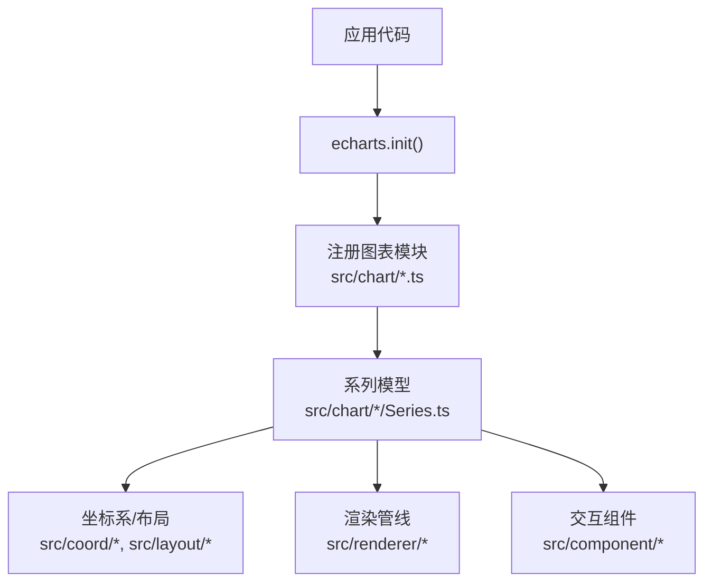
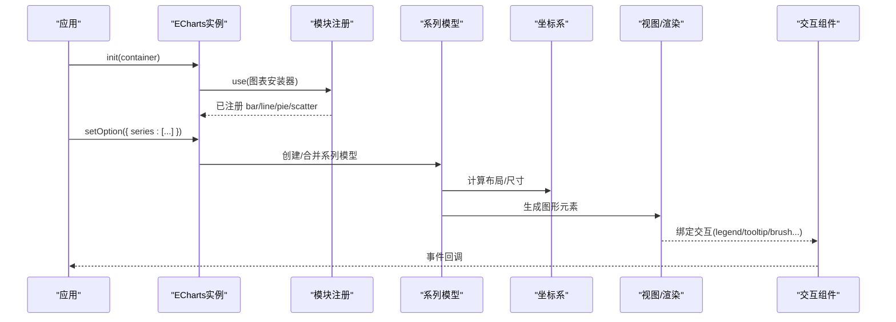
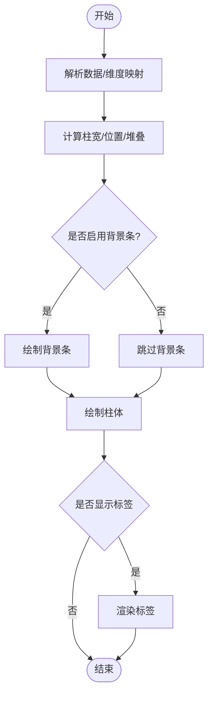
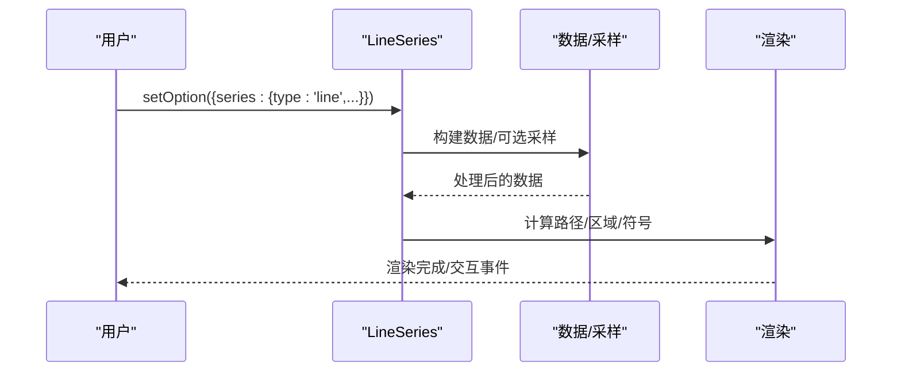
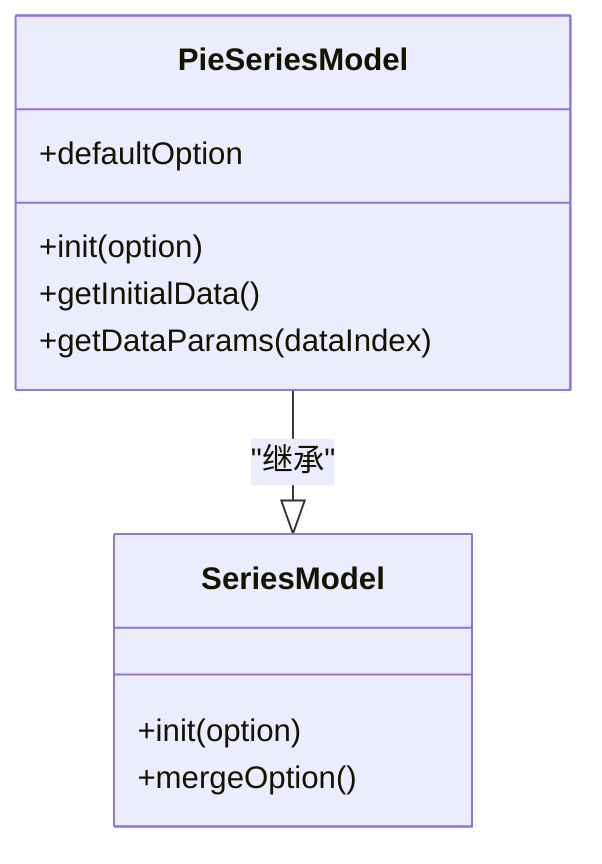
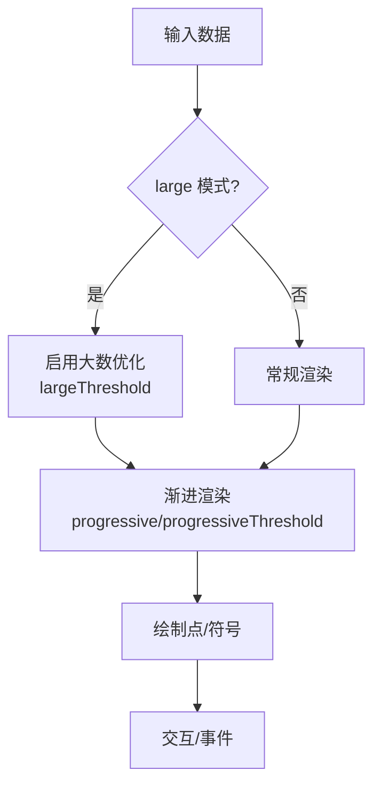
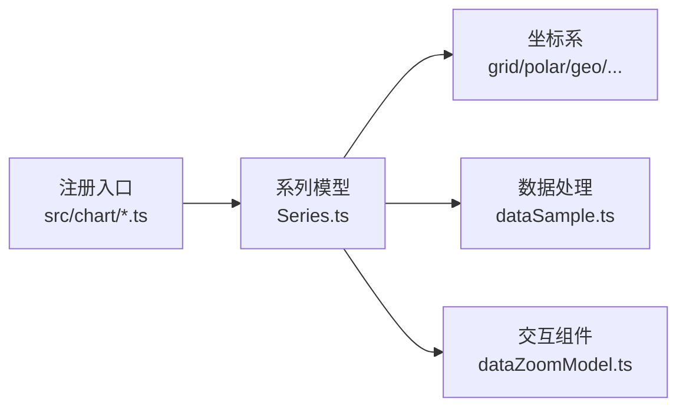

# 基础图表

<cite>
**本文引用的文件**
- [README.md](file://README.md)
- [BarSeries.ts](file://src/chart/bar/BarSeries.ts)
- [line.ts](file://src/chart/line.ts)
- [LineSeries.ts](file://src/chart/line/LineSeries.ts)
- [pie.ts](file://src/chart/pie.ts)
- [PieSeries.ts](file://src/chart/pie/PieSeries.ts)
- [scatter.ts](file://src/chart/scatter.ts)
- [ScatterSeries.ts](file://src/chart/scatter/ScatterSeries.ts)
- [bar.html](file://test/bar.html)
- [line.html](file://test/line.html)
- [pie.html](file://test/pie.html)
- [scatter.html](file://test/scatter.html)
- [dataSample.ts](file://src/processor/dataSample.ts)
- [dataZoomModel.ts](file://src/component/dataZoom/dataZoomModel.ts)
</cite>

## 目录
1. [简介](#简介)
2. [项目结构](#项目结构)
3. [核心组件](#核心组件)
4. [架构总览](#架构总览)
5. [详细组件分析](#详细组件分析)
6. [依赖关系分析](#依赖关系分析)
7. [性能考量](#性能考量)
8. [故障排查指南](#故障排查指南)
9. [结论](#结论)
10. [附录](#附录)

## 简介
本章节面向 ECharts 的基础图表类型，系统讲解柱状图、折线图、饼图、散点图的适用场景、数据格式要求、核心配置项与视觉效果定制方法。文档基于源码实现与测试用例，提供从入门到进阶的配置思路，并给出组合使用与响应式适配技巧，以及大数据量下的性能优化建议。

## 项目结构
ECharts 的图表以“系列（Series）”为核心组织，每种图表对应一个 Series 模型与视图。基础图表在 src/chart 下按类型分目录管理，并通过顶层入口按需注册安装。测试用例位于 test 目录，提供了可直接运行的示例页面。

图示来源
- [line.ts:20-23](file://src/chart/line.ts#L20-L23)
- [bar.ts:20-23](file://src/chart/bar.ts#L20-L23)
- [pie.ts:20-23](file://src/chart/pie.ts#L20-L23)
- [scatter.ts:20-23](file://src/chart/scatter.ts#L20-L23)

章节来源
- [README.md:15-28](file://README.md#L15-L28)

## 核心组件
- 柱状图（bar）：适用于分类对比、堆叠展示、极坐标环形柱等场景；支持背景条、圆角、实时排序等特性。
- 折线图（line）：适用于趋势变化、面积填充、阶梯线、平滑曲线、端点标签等；支持符号显示与事件触发策略。
- 饼图（pie）：适用于占比分析、南丁格尔玫瑰图、标签引导线与避让策略；支持百分比精度、空环样式等。
- 散点图（scatter）：适用于多维分布、气泡大小映射、多坐标系（直角/极坐标/地理/单轴/日历/矩阵）；支持渐进渲染与大数阈值。

章节来源
- [BarSeries.ts:72-98](file://src/chart/bar/BarSeries.ts#L72-L98)
- [LineSeries.ts:74-135](file://src/chart/line/LineSeries.ts#L74-L135)
- [PieSeries.ts:105-142](file://src/chart/pie/PieSeries.ts#L105-L142)
- [ScatterSeries.ts:64-81](file://src/chart/scatter/ScatterSeries.ts#L64-L81)

## 架构总览
下图展示了从初始化到渲染的关键路径，以及各基础图表共享的组件与能力。

图示来源
- [line.ts:20-23](file://src/chart/line.ts#L20-L23)
- [BarSeries.ts:100-113](file://src/chart/bar/BarSeries.ts#L100-L113)
- [LineSeries.ts:137-157](file://src/chart/line/LineSeries.ts#L137-L157)
- [PieSeries.ts:150-185](file://src/chart/pie/PieSeries.ts#L150-L185)
- [ScatterSeries.ts:84-96](file://src/chart/scatter/ScatterSeries.ts#L84-L96)

## 详细组件分析

### 柱状图（bar）
- 适用场景
  - 分类对比、分组/堆叠对比、极坐标环形柱、带背景条的进度展示。
- 数据格式
  - 支持数值、对象或数组形式的数据项；可结合 encode 进行维度映射。
- 核心配置
  - coordinateSystem：cartesian2d | polar
  - clip：是否裁剪溢出
  - roundCap：极坐标切向柱两端圆头
  - showBackground/backgroundStyle：背景条开关与样式
  - realtimeSort：是否开启实时排序（配合 createSeriesData 的参数）
- 视觉定制
  - itemStyle：边框、圆角、阴影等
  - label：位置、富文本、旋转等
  - emphasis/select：高亮与选中态样式
- 示例参考
  - 基本用法与堆叠、工具栏、选择模式等见测试页。

图示来源
- [BarSeries.ts:100-173](file://src/chart/bar/BarSeries.ts#L100-L173)

章节来源
- [BarSeries.ts:72-98](file://src/chart/bar/BarSeries.ts#L72-L98)
- [BarSeries.ts:100-173](file://src/chart/bar/BarSeries.ts#L100-L173)
- [bar.html:92-242](file://test/bar.html#L92-L242)

### 折线图（line）
- 适用场景
  - 趋势观察、面积图、阶梯线、平滑曲线、端点标注、符号标记。
- 数据格式
  - 支持数值、对象或数组；可设置 name/value 等字段。
- 核心配置
  - coordinateSystem：cartesian2d | polar
  - lineStyle/areaStyle：线条与区域样式
  - step：阶梯线模式（false/start/end/middle）
  - smooth/smoothMonotone：平滑与单调性控制
  - connectNulls：断点连接
  - showSymbol/showAllSymbol：符号显示策略
  - endLabel：端点标签
  - triggerEvent：仅触发线事件或同时包含区域事件
- 视觉定制
  - symbol/symbolSize/symbolRotate：符号形状、大小、旋转
  - emphasis/blur：高亮与失焦态
- 示例参考
  - 多系列、堆叠、step、自定义符号、标签与工具栏等见测试页。

图示来源
- [LineSeries.ts:137-234](file://src/chart/line/LineSeries.ts#L137-L234)
- [dataSample.ts:75-121](file://src/processor/dataSample.ts#L75-L121)

章节来源
- [LineSeries.ts:74-234](file://src/chart/line/LineSeries.ts#L74-L234)
- [line.html:95-247](file://test/line.html#L95-L247)

### 饼图（pie）
- 适用场景
  - 占比分析、南丁格尔玫瑰图（radius/area）、环形图、标签引导线与避让。
- 数据格式
  - 支持数值、数组或对象（name/value），百分比由内部计算得出。
- 核心配置
  - roseType：radius | area
  - clockwise/startAngle/endAngle/padAngle：角度与起始方向
  - minAngle/minShowLabelAngle：最小扇区与标签显示阈值
  - selectedOffset：选中偏移
  - avoidLabelOverlap：标签避让
  - percentPrecision：百分比精度
  - stillShowZeroSum：全零时是否显示
  - animationType/animationTypeUpdate：动画类型
  - showEmptyCircle/emptyCircleStyle：空环样式
- 视觉定制
  - label/labelLine：标签位置、引导线长度/平滑/最大表面角
  - itemStyle：边框、圆角、纹理等
- 示例参考
  - 富文本标签、引导线、selectedMode、dataset 用法等见测试页。

图示来源
- [PieSeries.ts:150-338](file://src/chart/pie/PieSeries.ts#L150-L338)

章节来源
- [PieSeries.ts:105-338](file://src/chart/pie/PieSeries.ts#L105-L338)
- [pie.html:65-271](file://test/pie.html#L65-L271)

### 散点图（scatter）
- 适用场景
  - 多维分布、气泡大小映射、多坐标系（直角/极坐标/地理/单轴/日历/矩阵）。
- 数据格式
  - 支持二维数组、一维数组或对象；可扁平数组。
- 核心配置
  - coordinateSystem：支持多种坐标系
  - symbolSize：可函数映射第三维
  - large/largeThreshold：大数模式与阈值
  - progressive/progressiveThreshold：渐进渲染与阈值
  - clip：裁剪溢出
  - emphasis.scale：高亮缩放
- 视觉定制
  - itemStyle：透明度、颜色函数等
  - label：默认/强调态显示
- 示例参考
  - 多系列、symbolSize 函数、颜色函数、工具栏与 tooltip 等见测试页。

图示来源
- [ScatterSeries.ts:84-161](file://src/chart/scatter/ScatterSeries.ts#L84-L161)

章节来源
- [ScatterSeries.ts:64-161](file://src/chart/scatter/ScatterSeries.ts#L64-L161)
- [scatter.html:63-152](file://test/scatter.html#L63-L152)

## 依赖关系分析
- 模块注册
  - 通过顶层入口调用 use(install) 将图表能力注入 ECharts。
- 系列模型依赖
  - 柱状图依赖 grid/polar；折线图依赖 grid/polar；散点图依赖 grid/polar/geo/singleAxis/calendar/matrix；饼图支持 geo/cartesian/calendar/matrix。
- 数据采样与缩放
  - dataSample 处理器对笛卡尔坐标系下的折线/散点等进行降采样，提升大数据渲染性能。
  - dataZoom 组件提供范围筛选、过滤模式、节流等能力，配合 series 实现交互缩放。

图示来源
- [line.ts:20-23](file://src/chart/line.ts#L20-L23)
- [bar.ts:20-23](file://src/chart/bar.ts#L20-L23)
- [pie.ts:20-23](file://src/chart/pie.ts#L20-L23)
- [scatter.ts:20-23](file://src/chart/scatter.ts#L20-L23)
- [dataSample.ts:75-121](file://src/processor/dataSample.ts#L75-L121)
- [dataZoomModel.ts:149-166](file://src/component/dataZoom/dataZoomModel.ts#L149-L166)

章节来源
- [dataSample.ts:75-121](file://src/processor/dataSample.ts#L75-L121)
- [dataZoomModel.ts:39-166](file://src/component/dataZoom/dataZoomModel.ts#L39-L166)

## 性能考量
- 大数据量处理
  - 折线图/散点图：启用 sampling（如 average/sum/max/min/lttb/minmax）与 large 模式，降低渲染压力。
  - 渐进渲染：scatter 支持 progressive 与 progressiveThreshold；bar 在 large 模式下启用 progressive。
  - 数据缩放：dataZoom 的 filterMode 控制过滤策略，避免不必要的重绘。
- 渲染优化
  - 合理设置 clip 与 symbolSize，减少重叠与过度绘制。
  - 使用 dataset 与 encode 简化数据准备，减少重复计算。
- 交互优化
  - dataZoom 的 throttle 控制事件频率，避免频繁更新。
  - 关闭不必要的动画（animation/animationDurationUpdate）以提升响应速度。

章节来源
- [LineSeries.ts:215-234](file://src/chart/line/LineSeries.ts#L215-L234)
- [ScatterSeries.ts:99-115](file://src/chart/scatter/ScatterSeries.ts#L99-L115)
- [BarSeries.ts:118-137](file://src/chart/bar/BarSeries.ts#L118-L137)
- [dataSample.ts:75-121](file://src/processor/dataSample.ts#L75-L121)
- [dataZoomModel.ts:87-166](file://src/component/dataZoom/dataZoomModel.ts#L87-L166)

## 故障排查指南
- 常见问题定位
  - 坐标轴/坐标系不匹配：确保 series.coordinateSystem 与 axis 配置一致。
  - 数据为空或 NaN：检查数据源与编码映射，必要时启用 connectNulls。
  - 标签遮挡：启用 avoidLabelOverlap，调整 labelLine 与 edgeDistance。
  - 大数据卡顿：开启 large/sampling/progressive，并适当调大阈值。
- 调试建议
  - 使用 toolbox 的 dataView 查看原始数据与当前选项。
  - 通过 legend 切换系列快速定位问题。
  - 利用 tooltip 的 trigger 与 formatter 辅助验证数据流。

章节来源
- [LineSeries.ts:147-157](file://src/chart/line/LineSeries.ts#L147-L157)
- [PieSeries.ts:190-207](file://src/chart/pie/PieSeries.ts#L190-L207)
- [ScatterSeries.ts:92-115](file://src/chart/scatter/ScatterSeries.ts#L92-L115)

## 结论
ECharts 的基础图表具备强大的可扩展性与丰富的配置项。通过理解各系列的模型与默认行为，结合数据采样、渐进渲染与数据缩放等机制，可以在保证视觉效果的同时获得良好的性能表现。建议在复杂场景中优先采用 dataset/encode 统一数据流，配合 dataZoom 与 visualMap 增强交互与可视化表达。

## 附录
- 示例页面
  - 柱状图：[bar.html](file://test/bar.html)
  - 折线图：[line.html](file://test/line.html)
  - 饼图：[pie.html](file://test/pie.html)
  - 散点图：[scatter.html](file://test/scatter.html)
- 官方资源
  - 官网与文档链接参见 README。

章节来源
- [README.md:15-28](file://README.md#L15-L28)
- [bar.html:92-242](file://test/bar.html#L92-L242)
- [line.html:95-247](file://test/line.html#L95-L247)
- [pie.html:65-271](file://test/pie.html#L65-L271)
- [scatter.html:63-152](file://test/scatter.html#L63-L152)