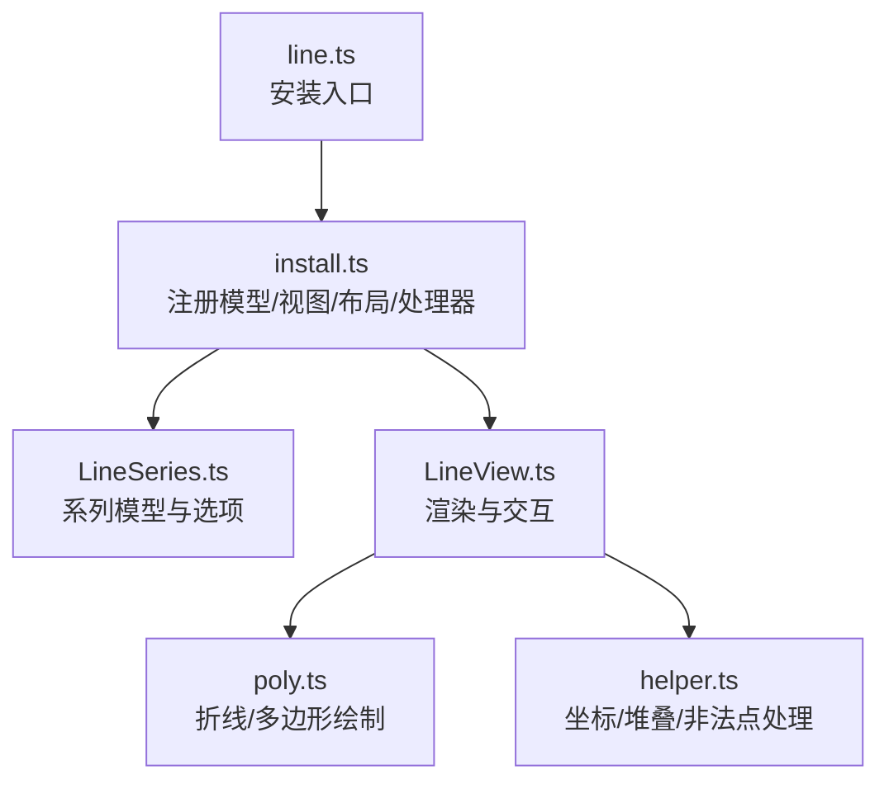
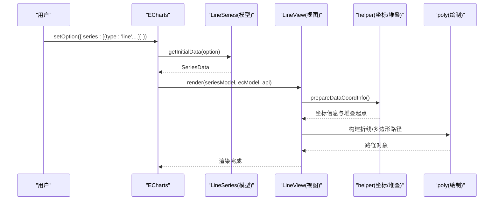
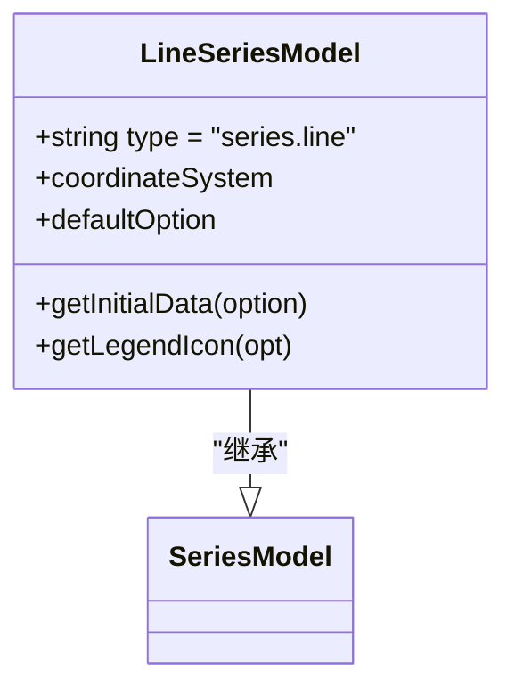
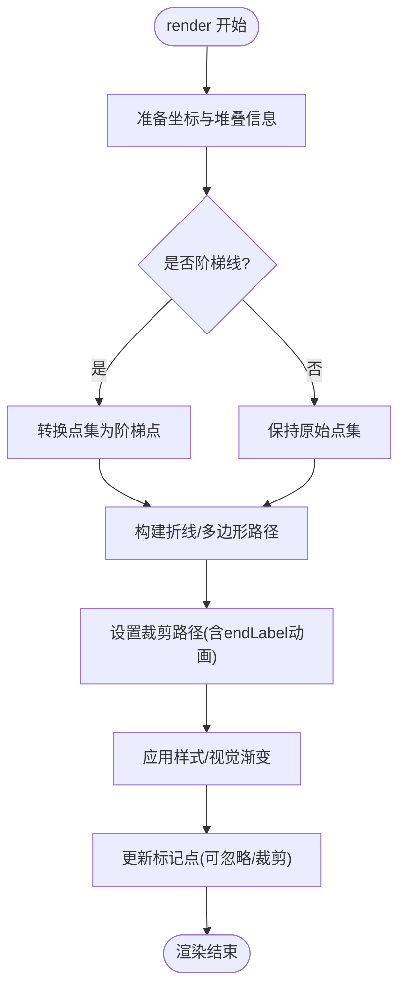
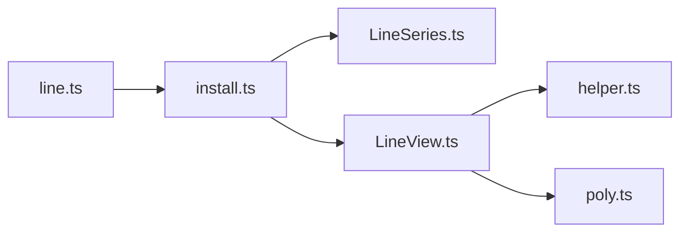

# 折线图

<cite>
**本文引用的文件**
- [src/chart/line.ts](file://src/chart/line.ts)
- [src/chart/line/install.ts](file://src/chart/line/install.ts)
- [src/chart/line/LineSeries.ts](file://src/chart/line/LineSeries.ts)
- [src/chart/line/LineView.ts](file://src/chart/line/LineView.ts)
- [src/chart/line/helper.ts](file://src/chart/line/helper.ts)
- [src/chart/line/poly.ts](file://src/chart/line/poly.ts)
- [test/line.html](file://test/line.html)
- [test/area-smooth.html](file://test/area-smooth.html)
- [test/line-step.html](file://test/line-step.html)
</cite>

## 目录
1. [简介](#简介)
2. [项目结构](#项目结构)
3. [核心组件](#核心组件)
4. [架构总览](#架构总览)
5. [详细组件分析](#详细组件分析)
6. [依赖关系分析](#依赖关系分析)
7. [性能与大数据优化](#性能与大数据优化)
8. [故障排查指南](#故障排查指南)
9. [结论](#结论)
10. [附录：示例与配置速查](#附录示例与配置速查)

## 简介
折线图用于展示数据随时间或有序维度的变化趋势，适用于趋势分析、时间序列、多系列对比等场景。ECharts 的折线系列支持直线、平滑曲线、面积图、阶梯线、断点连接控制、标记点、标签、动画、视觉映射、堆叠、采样与渐进渲染等能力，满足从基础到高级的可视化需求。

## 项目结构
折线图由“模型 + 视图 + 布局/处理器”构成，并通过扩展机制注册到 ECharts 中：
- 入口注册：chart/line.ts 通过 install.ts 注册系列模型、视图、布局与处理器。
- 模型：LineSeries.ts 定义折线系列的选项、默认值与数据初始化。
- 视图：LineView.ts 负责渲染折线、面积、标记点、裁剪路径、动画与交互。
- 辅助：helper.ts 提供坐标信息准备、堆叠计算、非法点判断；poly.ts 实现带 NaN 支持的折线与多边形绘制。
- 示例：test/*.html 提供基本折线、平滑面积、阶梯线等用例。

**图表来源**
- [src/chart/line.ts:20-23](file://src/chart/line.ts#L20-L23)
- [src/chart/line/install.ts:30-56](file://src/chart/line/install.ts#L30-L56)
- [src/chart/line/LineSeries.ts:137-234](file://src/chart/line/LineSeries.ts#L137-L234)
- [src/chart/line/LineView.ts:635-783](file://src/chart/line/LineView.ts#L635-L783)
- [src/chart/line/poly.ts:224-408](file://src/chart/line/poly.ts#L224-L408)
- [src/chart/line/helper.ts:40-145](file://src/chart/line/helper.ts#L40-L145)

**章节来源**
- [src/chart/line.ts:20-23](file://src/chart/line.ts#L20-L23)
- [src/chart/line/install.ts:30-56](file://src/chart/line/install.ts#L30-L56)

## 核心组件
- 系列模型（LineSeries）
  - 定义 type、坐标系统、样式、标签、堆叠、平滑、阶梯、断点连接、符号、采样、动画等选项与默认值。
  - 提供 getInitialData 创建 SeriesData，并声明依赖 grid/polar。
- 视图（LineView）
  - 负责构建折线/面积图形、更新裁剪路径、处理 endLabel、符号绘制、动画过渡、视觉渐变、响应式 clip 等。
- 辅助模块
  - helper.ts：prepareDataCoordInfo 计算维度、堆叠起点；getStackedOnPoint 计算堆叠基线；isPointIllegal 识别非法点。
  - poly.ts：ECPolyline/ECPolygon 支持 NaN 分段、平滑插值、单调性约束、connectNulls 行为。

**章节来源**
- [src/chart/line/LineSeries.ts:137-234](file://src/chart/line/LineSeries.ts#L137-L234)
- [src/chart/line/LineView.ts:635-783](file://src/chart/line/LineView.ts#L635-L783)
- [src/chart/line/helper.ts:40-145](file://src/chart/line/helper.ts#L40-L145)
- [src/chart/line/poly.ts:224-408](file://src/chart/line/poly.ts#L224-L408)

## 架构总览
折线图的渲染流程如下：
- 用户设置 option → ECharts 解析 → LineSeriesModel 初始化数据 → 调用 LineView.render → 计算坐标与堆叠 → 生成折线/面积路径 → 应用样式与动画 → 输出到画布/SVG。

**图表来源**
- [src/chart/line/LineSeries.ts:147-157](file://src/chart/line/LineSeries.ts#L147-L157)
- [src/chart/line/LineView.ts:635-783](file://src/chart/line/LineView.ts#L635-L783)
- [src/chart/line/helper.ts:40-81](file://src/chart/line/helper.ts#L40-L81)
- [src/chart/line/poly.ts:245-274](file://src/chart/line/poly.ts#L245-L274)

## 详细组件分析

### 系列模型（LineSeries）
- 关键选项
  - coordinateSystem：'cartesian2d' | 'polar'
  - lineStyle / areaStyle / itemStyle / label / endLabel
  - step：false | 'start' | 'end' | 'middle'
  - smooth：boolean | number；smoothMonotone：'x' | 'y' | 'none'
  - connectNulls：是否连接断点
  - showSymbol / symbolSize / symbolRotate / showAllSymbol
  - sampling：'average' | 'max' | 'min' | 'sum' | 'lttb' | 'none'
  - animationEasing / progressive / hoverLayerThreshold
- 默认行为
  - 默认显示顶部标签、实线、启用 emphasis scale、symbol 为空心圆、默认不连接断点、关闭渐进渲染、hoverLayerThreshold 为 Infinity。

**图表来源**
- [src/chart/line/LineSeries.ts:137-234](file://src/chart/line/LineSeries.ts#L137-L234)
- [src/chart/line/LineSeries.ts:236-282](file://src/chart/line/LineSeries.ts#L236-L282)

**章节来源**
- [src/chart/line/LineSeries.ts:137-234](file://src/chart/line/LineSeries.ts#L137-L234)
- [src/chart/line/LineSeries.ts:236-282](file://src/chart/line/LineSeries.ts#L236-L282)

### 视图（LineView）
- 渲染职责
  - 根据坐标系统与数据计算 points/stackedOnPoints，必要时转换为阶梯点。
  - 创建/更新裁剪路径以适配网格/极坐标区域，支持 endLabel 动画。
  - 处理 areaStyle 的 origin（auto/start/end/数值），以及视觉映射生成的线性渐变。
  - 管理 symbol 的显示策略（showAllSymbol/auto）、忽略函数与裁剪。
- 动画与过渡
  - 使用 lineAnimationDiff 进行路径差异动画；endLabel 支持 valueAnimation。
- 交互与事件
  - 支持 triggerEvent: 'line' | 'area' | true，控制仅在折线或面积上触发事件。

**图表来源**
- [src/chart/line/LineView.ts:635-783](file://src/chart/line/LineView.ts#L635-L783)
- [src/chart/line/LineView.ts:510-578](file://src/chart/line/LineView.ts#L510-L578)
- [src/chart/line/LineView.ts:268-368](file://src/chart/line/LineView.ts#L268-L368)

**章节来源**
- [src/chart/line/LineView.ts:635-783](file://src/chart/line/LineView.ts#L635-L783)
- [src/chart/line/LineView.ts:510-578](file://src/chart/line/LineView.ts#L510-L578)
- [src/chart/line/LineView.ts:268-368](file://src/chart/line/LineView.ts#L268-L368)

### 辅助模块（helper.ts）
- prepareDataCoordInfo：确定 base/value 轴维度、堆叠状态、valueStart（areaStyle.origin）。
- getStackedOnPoint：计算堆叠基线点的坐标。
- isPointIllegal：识别 NaN/Infinity 等非法点，影响折线分段与平滑。

**章节来源**
- [src/chart/line/helper.ts:40-145](file://src/chart/line/helper.ts#L40-L145)

### 绘制模块（poly.ts）
- ECPolyline/ECPolygon：支持 NaN 分段、平滑插值（含 x/y/none 单调性约束）、connectNulls 跳过非法点、闭合多边形用于面积填充。
- drawSegment：核心绘制逻辑，处理重复点、微小线段、贝塞尔控制点计算与边界约束。

**章节来源**
- [src/chart/line/poly.ts:224-408](file://src/chart/line/poly.ts#L224-L408)

## 依赖关系分析
- 安装与注册
  - line.ts 引入 install.ts，后者注册 LineSeries、LineView、布局 layoutPoints('line')、视觉 reset、处理器 dataSample('line')。
- 运行时依赖
  - LineView 依赖 helper 与 poly；依赖坐标系统裁剪路径；依赖 SymbolDraw 处理标记点。
- 外部依赖
  - zrender 图形库（Path、Group、LinearGradient 等）。

**图表来源**
- [src/chart/line.ts:20-23](file://src/chart/line.ts#L20-L23)
- [src/chart/line/install.ts:30-56](file://src/chart/line/install.ts#L30-L56)

**章节来源**
- [src/chart/line/install.ts:30-56](file://src/chart/line/install.ts#L30-L56)

## 性能与大数据优化
- 采样（sampling）
  - 在数据量大时启用 'average'/'max'/'min'/'sum'/'lttb' 降低点数，提升渲染性能。
- 渐进渲染（progressive）
  - 默认关闭；可按需开启以分帧渲染大量数据。
- hoverLayerThreshold
  - 默认 Infinity，避免过多悬停层导致性能问题；可根据场景调整。
- 裁剪与忽略
  - 合理设置 clip 与 showAllSymbol/auto，减少不必要的标记点绘制。
- 断点连接
  - connectNulls 可减少分段数量，但需注意面积图与阶梯线的行为差异。

[本节为通用指导，无需具体文件引用]

## 故障排查指南
- 平滑曲线异常
  - 检查 smooth 与 smoothMonotone 设置；确认数据单调性与重复点。
- 阶梯线面积错位
  - 确保 stackedOnPoints 与 points 同步过滤 null；参考阶梯线示例。
- 断点连接导致面积异常
  - connectNulls 为 true 时，面积图会按相同规则过滤点；注意 areaStyle.origin。
- 标记点被裁剪
  - 检查 clip 与坐标系统裁剪区域；必要时扩大 clip 或关闭 clip。
- 动画闪烁或位置错误
  - 关注 endLabel.valueAnimation 与裁剪路径更新；确保坐标系统未切换。

**章节来源**
- [src/chart/line/LineView.ts:510-578](file://src/chart/line/LineView.ts#L510-L578)
- [src/chart/line/LineView.ts:635-783](file://src/chart/line/LineView.ts#L635-L783)
- [src/chart/line/poly.ts:245-274](file://src/chart/line/poly.ts#L245-L274)

## 结论
ECharts 折线图提供了丰富的配置项与高性能渲染能力，适合多种趋势与时间序列场景。通过合理配置 xAxis/yAxis、series.line 的样式与行为，结合采样、裁剪、断点连接与动画，可实现从基础到高级的折线可视化效果。

[本节为总结性内容，无需具体文件引用]

## 附录：示例与配置速查

### 适用场景
- 趋势分析：观察指标随时间的上升/下降趋势。
- 时间序列：基于 time 轴的连续时间展示。
- 多系列对比：多条折线叠加比较不同类别的变化。

### 数据格式要求
- 二维数组：[[x, y], ...] 或 [x, y] 成对数据。
- 一维数组：当 xAxis.data 已定义时，series.data 可为数值数组。
- 分类轴：xAxis.type='category'，data 为类目字符串数组。
- 时间轴：xAxis.type='time'，data 可为时间戳或日期字符串。

### 核心配置项（xAxis、yAxis、series.line）
- xAxis
  - type：'category' | 'value' | 'time' | 'log'
  - data：类目或刻度值
  - boundaryGap：类目轴两端留白
- yAxis
  - type：'value' | 'time' | 'log'
  - splitArea/splitLine：网格背景与分割线
- series.line
  - lineStyle：线条颜色、宽度、虚线类型
  - areaStyle：面积填充、origin（auto/start/end/数值）
  - step：'start' | 'end' | 'middle' | false
  - smooth：true/false/数值；smoothMonotone：'x' | 'y' | 'none'
  - connectNulls：是否连接断点
  - showSymbol/symbolSize/symbolRotate：标记点样式
  - label/endLabel：数据标签与末端标签
  - sampling：采样策略
  - triggerEvent：'line' | 'area' | true

### 视觉效果定制
- 线条样式：lineStyle.color/width/type/shadow*
- 面积填充：areaStyle.color/opacity/origin
- 标记点：itemStyle.symbol/symbolSize/symbolRotate/symbolKeepAspect
- 标签：label.position/formatter；endLabel.show/valueAnimation/distance

### 完整示例（参考路径）
- 基本折线图与多系列组合
  - 参考：[test/line.html](file://test/line.html)
- 平滑曲线与面积图
  - 参考：[test/area-smooth.html](file://test/area-smooth.html)
- 阶梯线与断点处理
  - 参考：[test/line-step.html](file://test/line-step.html)

### 数据连接方式与断点处理
- connectNulls=false：遇到 null/NaN/Infinite 断开连线。
- connectNulls=true：跳过非法点继续连接；面积图与阶梯线会同步处理非法点。

### 动画效果
- 初始动画：animationEasing、animationDuration
- 路径差异动画：lineAnimationDiff
- endLabel 动画：endLabel.valueAnimation

### 大数据量优化策略
- 启用 sampling（如 'lttb'）
- 适当提高 hoverLayerThreshold
- 合理使用 clip 与 showAllSymbol/auto
- 按需开启 progressive

### 交互式功能与响应式设计
- 交互
  - tooltip：trigger='axis'，axisPointer 类型
  - legend：切换系列显示
  - dataZoom：内部缩放与滑块缩放
  - brush：选区操作（配合其他组件）
- 响应式
  - window.onresize 调用 chart.resize
  - 媒体查询与自适应布局

**章节来源**
- [test/line.html:95-247](file://test/line.html#L95-L247)
- [test/area-smooth.html:54-84](file://test/area-smooth.html#L54-L84)
- [test/line-step.html:57-106](file://test/line-step.html#L57-L106)
- [test/line-step.html:118-157](file://test/line-step.html#L118-L157)
- [test/line-step.html:171-209](file://test/line-step.html#L171-L209)