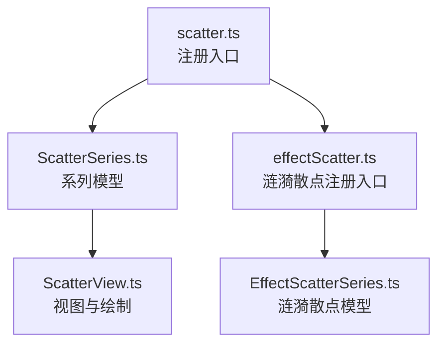
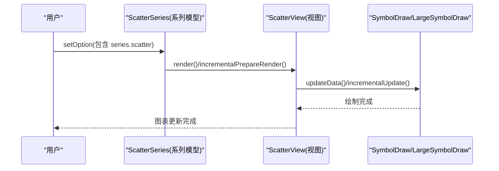
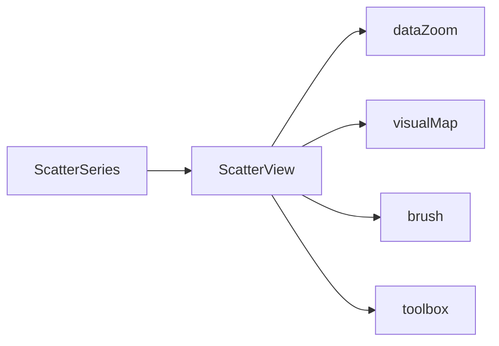

# 散点图

<cite>
**本文引用的文件**
- [src/chart/scatter.ts](file://src/chart/scatter.ts)
- [src/chart/effectScatter.ts](file://src/chart/effectScatter.ts)
- [src/chart/scatter/ScatterSeries.ts](file://src/chart/scatter/ScatterSeries.ts)
- [src/chart/scatter/ScatterView.ts](file://src/chart/scatter/ScatterView.ts)
- [src/chart/effectScatter/EffectScatterSeries.ts](file://src/chart/effectScatter/EffectScatterSeries.ts)
- [test/scatter.html](file://test/scatter.html)
- [test/worldPopulationBubble.html](file://test/worldPopulationBubble.html)
- [test/effectScatter.html](file://test/effectScatter.html)
- [test/scatter-jitter.html](file://test/scatter-jitter.html)
- [test/dataZoom-scatter-hv.html](file://test/dataZoom-scatter-hv.html)
- [test/visualMap-scatter-colorAndSymbol.html](file://test/visualMap-scatter-colorAndSymbol.html)
</cite>

## 目录
1. [简介](#简介)
2. [项目结构](#项目结构)
3. [核心组件](#核心组件)
4. [架构总览](#架构总览)
5. [详细组件分析](#详细组件分析)
6. [依赖关系分析](#依赖关系分析)
7. [性能与大数据优化](#性能与大数据优化)
8. [交互能力](#交互能力)
9. [多维数据与统计分析](#多维数据与统计分析)
10. [故障排查指南](#故障排查指南)
11. [结论](#结论)
12. [附录：示例与配置速查](#附录示例与配置速查)

## 简介
散点图用于展示两个数值变量之间的关系，适用于相关性分析、分布展示、异常值检测等场景。ECharts 的散点图支持多种坐标系（直角坐标、极坐标、地理坐标、单轴等），并可与视觉映射、数据缩放、刷选、工具栏等组件联动，实现丰富的可视化与分析体验。

适用场景
- 相关性分析：观察两变量的线性或非线性关系
- 分布展示：通过点的密度和范围感知数据分布
- 三维信息叠加：用第三维（如气泡大小）表达额外指标
- 地理空间分布：在地图上以散点标注位置与强度
- 抖动展示：分类轴上大量重叠点时，使用抖动避免遮挡

## 项目结构
散点图由“系列模型 + 视图”构成，并通过安装脚本注册到 ECharts 扩展系统。核心文件包括：
- 系列模型：定义数据类型、默认配置、渐进渲染阈值、选择器适配等
- 视图：负责布局计算与符号绘制，支持普通与大数模式切换
- 安装入口：将散点图系列注册到 ECharts

图表来源
- [src/chart/scatter.ts:20-22](file://src/chart/scatter.ts#L20-L22)
- [src/chart/effectScatter.ts:20-22](file://src/chart/effectScatter.ts#L20-L22)
- [src/chart/scatter/ScatterSeries.ts:84-165](file://src/chart/scatter/ScatterSeries.ts#L84-L165)
- [src/chart/scatter/ScatterView.ts:35-135](file://src/chart/scatter/ScatterView.ts#L35-L135)
- [src/chart/effectScatter/EffectScatterSeries.ts:94-158](file://src/chart/effectScatter/EffectScatterSeries.ts#L94-L158)

章节来源
- [src/chart/scatter.ts:20-22](file://src/chart/scatter.ts#L20-L22)
- [src/chart/effectScatter.ts:20-22](file://src/chart/effectScatter.ts#L20-L22)

## 核心组件
- 散点系列模型（ScatterSeries）
  - 类型标识：series.scatter
  - 支持的坐标系：grid、polar、geo、singleAxis、calendar、matrix
  - 默认项样式透明度、强调态放大、裁剪行为、选择高亮色等
  - 渐进渲染与大数据阈值控制
  - 刷选点选择器适配
- 散点视图（ScatterView）
  - 根据数据规模自动切换 SymbolDraw/LargeSymbolDraw
  - 增量渲染与布局更新
  - 基于坐标系的裁剪区域
- 涟漪散点系列模型（EffectScatterSeries）
  - 涟漪效果类型、触发时机、参数（周期、缩放、笔触类型、数量）
  - 同样支持多坐标系与视觉映射

章节来源
- [src/chart/scatter/ScatterSeries.ts:84-165](file://src/chart/scatter/ScatterSeries.ts#L84-L165)
- [src/chart/scatter/ScatterView.ts:35-135](file://src/chart/scatter/ScatterView.ts#L35-L135)
- [src/chart/effectScatter/EffectScatterSeries.ts:94-158](file://src/chart/effectScatter/EffectScatterSeries.ts#L94-L158)

## 架构总览
散点图的渲染流程从“系列模型”到“视图”，再由视图调用符号绘制器完成最终绘制。对于大数据量，视图会切换到 LargeSymbolDraw 以提升性能；同时支持增量渲染与布局更新。

图表来源
- [src/chart/scatter/ScatterSeries.ts:92-115](file://src/chart/scatter/ScatterSeries.ts#L92-L115)
- [src/chart/scatter/ScatterView.ts:45-91](file://src/chart/scatter/ScatterView.ts#L45-L91)

## 详细组件分析

### 系列模型：ScatterSeries
- 数据格式
  - 二维坐标值数组：[x, y]
  - 可携带第三维用于 symbolSize 或颜色映射：[x, y, z]
- 关键配置项
  - coordinateSystem：坐标系（cartesian2d、polar、geo、singleAxis 等）
  - symbolSize：点大小，可为固定值或函数
  - itemStyle：点样式（颜色、透明度等）
  - emphasis：强调态（scale、label 显示等）
  - large/largeThreshold：大数据开关与阈值
  - progressive/progressiveThreshold：渐进渲染策略
  - clip：是否按坐标系裁剪
- 默认行为
  - 默认透明度 0.8
  - 强调态支持 scale
  - 选择态边框色使用主题主色
  - 渐进渲染阈值根据 large 动态调整

章节来源
- [src/chart/scatter/ScatterSeries.ts:84-165](file://src/chart/scatter/ScatterSeries.ts#L84-L165)

### 视图：ScatterView
- 职责
  - 维护 SymbolDraw/LargeSymbolDraw 实例
  - 根据 pipelineContext.large 切换绘制器
  - 增量渲染：incrementalPrepareRender/incrementalRender
  - 布局更新：updateTransform 中调用 pointsLayout 并刷新符号布局
  - 裁剪：createCoordSysClipAreaSimply 生成裁剪区域
- 性能要点
  - 大数据时使用 LargeSymbolDraw
  - 增量更新减少重绘开销
  - 组标记 dirty 确保增量层正确清理

章节来源
- [src/chart/scatter/ScatterView.ts:45-135](file://src/chart/scatter/ScatterView.ts#L45-L135)

### 涟漪散点：EffectScatterSeries
- 涟漪效果
  - effectType：ripple
  - showEffectOn：render/emphasis
  - rippleEffect：period/scale/brushType/number
- 适用场景
  - 强调热点或关键点位
  - 地图上的动态标注

章节来源
- [src/chart/effectScatter/EffectScatterSeries.ts:94-158](file://src/chart/effectScatter/EffectScatterSeries.ts#L94-L158)

### 示例与用法参考
- 基本散点图与气泡图
  - 二维坐标 [x, y] 与第三维 [x, y, z] 驱动 symbolSize
  - 参考：[test/scatter.html:63-152](file://test/scatter.html#L63-L152)
- 地理散点（世界人口）
  - 使用 geo 坐标系，value 为 [经度, 纬度, 人口]
  - 参考：[test/worldPopulationBubble.html:476-546](file://test/worldPopulationBubble.html#L476-L546)
- 涟漪散点（地图标注）
  - 结合 geo 坐标系与涟漪效果
  - 参考：[test/effectScatter.html:447-565](file://test/effectScatter.html#L447-L565)

章节来源
- [test/scatter.html:63-152](file://test/scatter.html#L63-L152)
- [test/worldPopulationBubble.html:476-546](file://test/worldPopulationBubble.html#L476-L546)
- [test/effectScatter.html:447-565](file://test/effectScatter.html#L447-L565)

## 依赖关系分析
- 系列与视图耦合
  - ScatterSeries 提供数据与默认配置
  - ScatterView 负责具体绘制与性能优化
- 外部组件依赖
  - 坐标系：grid/polar/geo/singleAxis/calendar/matrix
  - 视觉映射：visualMap（颜色、symbolSize）
  - 数据缩放：dataZoom（内部/滑块）
  - 刷选：brush（点选择器）
  - 工具栏：toolbox（数据视图、保存图片、缩放）

图表来源
- [src/chart/scatter/ScatterSeries.ts:88-119](file://src/chart/scatter/ScatterSeries.ts#L88-L119)
- [src/chart/scatter/ScatterView.ts:45-91](file://src/chart/scatter/ScatterView.ts#L45-L91)

章节来源
- [src/chart/scatter/ScatterSeries.ts:88-119](file://src/chart/scatter/ScatterSeries.ts#L88-L119)
- [src/chart/scatter/ScatterView.ts:45-91](file://src/chart/scatter/ScatterView.ts#L45-L91)

## 性能与大数据优化
- 大数据模式
  - 启用 large 与合适的 largeThreshold，自动切换至 LargeSymbolDraw
  - 渐进渲染：设置 progressive 与 progressiveThreshold，分片渲染提升首屏
- 透明度与阴影
  - 降低 opacity 可减少视觉拥挤与渲染压力
  - 谨慎使用 shadowBlur/shadowColor，避免过多阴影导致性能下降
- 数据采样与过滤
  - 结合 dataZoom 仅展示当前可视区域的数据
  - 预处理阶段进行采样或聚合，减少数据量
- 渲染器选择
  - 大数据建议使用 Canvas 渲染器，SVG 在高点数下性能较差
- 增量更新
  - 利用 incrementalPrepareRender/incrementalRender 减少重绘

章节来源
- [src/chart/scatter/ScatterSeries.ts:99-115](file://src/chart/scatter/ScatterSeries.ts#L99-L115)
- [src/chart/scatter/ScatterView.ts:98-115](file://src/chart/scatter/ScatterView.ts#L98-L115)
- [test/scatter-jitter.html:731-772](file://test/scatter-jitter.html#L731-L772)

## 交互能力
- 数据缩放（dataZoom）
  - 支持 xAxis/yAxis 方向缩放与内部缩放
  - 示例：[test/dataZoom-scatter-hv.html:64-158](file://test/dataZoom-scatter-hv.html#L64-L158)
- 刷选（brush）
  - 散点支持点选择器，便于圈选子集进行分析
  - 参考系列 brushSelector 实现：[src/chart/scatter/ScatterSeries.ts:117-119](file://src/chart/scatter/ScatterSeries.ts#L117-L119)
- 工具栏（toolbox）
  - 数据视图、保存图片、缩放等快捷操作
  - 示例：[test/scatter.html:70-77](file://test/scatter.html#L70-L77)
- 提示框（tooltip）
  - 支持 item/axis 触发，自定义格式化内容
  - 示例：[test/scatter.html:78-82](file://test/scatter.html#L78-L82)

章节来源
- [test/dataZoom-scatter-hv.html:64-158](file://test/dataZoom-scatter-hv.html#L64-L158)
- [src/chart/scatter/ScatterSeries.ts:117-119](file://src/chart/scatter/ScatterSeries.ts#L117-L119)
- [test/scatter.html:70-82](file://test/scatter.html#L70-L82)

## 多维数据与统计分析
- 第三维可视化
  - 使用 symbolSize 映射第三维（气泡图）
  - 使用 visualMap 映射颜色或 symbol 形状
  - 示例：[test/visualMap-scatter-colorAndSymbol.html:59-136](file://test/visualMap-scatter-colorAndSymbol.html#L59-L136)
- 地理维度
  - 使用 geo 坐标系，value 为 [经度, 纬度, 指标]
  - 示例：[test/worldPopulationBubble.html:476-546](file://test/worldPopulationBubble.html#L476-L546)
- 抖动（jitter）
  - 分类轴或单轴类别模式下，通过 jitter/jitterOverlap 避免重叠
  - 示例：[test/scatter-jitter.html:79-108](file://test/scatter-jitter.html#L79-L108)、[test/scatter-jitter.html:127-156](file://test/scatter-jitter.html#L127-L156)
- 统计辅助
  - 结合 dataZoom 聚焦局部区间，配合 tooltip 查看细节
  - 使用 visualMap 分段筛选，辅助识别异常或热点

章节来源
- [test/visualMap-scatter-colorAndSymbol.html:59-136](file://test/visualMap-scatter-colorAndSymbol.html#L59-L136)
- [test/worldPopulationBubble.html:476-546](file://test/worldPopulationBubble.html#L476-L546)
- [test/scatter-jitter.html:79-108](file://test/scatter-jitter.html#L79-L108)
- [test/scatter-jitter.html:127-156](file://test/scatter-jitter.html#L127-L156)

## 故障排查指南
- 大数据卡顿
  - 检查是否启用 large 与合适的 largeThreshold
  - 确认使用 Canvas 渲染器而非 SVG
  - 参考：[test/scatter-jitter.html:731-772](file://test/scatter-jitter.html#L731-L772)
- 点重叠严重
  - 在分类轴或单轴类别模式下启用 jitter，并调整 jitterOverlap
  - 参考：[test/scatter-jitter.html:79-108](file://test/scatter-jitter.html#L79-L108)
- 颜色/大小未生效
  - 检查 visualMap 的 dimension 与 seriesIndex 是否正确
  - 确认 symbolSize/itemStyle 回调返回有效值
  - 参考：[test/visualMap-scatter-colorAndSymbol.html:59-136](file://test/visualMap-scatter-colorAndSymbol.html#L59-L136)
- 涟漪效果不显示
  - 检查 showEffectOn 与 rippleEffect 配置
  - 参考：[src/chart/effectScatter/EffectScatterSeries.ts:110-158](file://src/chart/effectScatter/EffectScatterSeries.ts#L110-L158)

章节来源
- [test/scatter-jitter.html:731-772](file://test/scatter-jitter.html#L731-L772)
- [test/scatter-jitter.html:79-108](file://test/scatter-jitter.html#L79-L108)
- [test/visualMap-scatter-colorAndSymbol.html:59-136](file://test/visualMap-scatter-colorAndSymbol.html#L59-L136)
- [src/chart/effectScatter/EffectScatterSeries.ts:110-158](file://src/chart/effectScatter/EffectScatterSeries.ts#L110-L158)

## 结论
ECharts 散点图提供了灵活的数据绑定、丰富的视觉效果与强大的交互能力。通过合理配置 series.scatter 与相关组件（visualMap、dataZoom、brush、toolbox），可以高效地完成相关性分析、分布展示与多维数据分析。针对大数据场景，启用 large、渐进渲染与合适的渲染器选择是保障性能的关键。

## 附录：示例与配置速查
- 基本散点图
  - 二维坐标 [x, y]，symbolSize 固定或函数
  - 参考：[test/scatter.html:63-152](file://test/scatter.html#L63-L152)
- 气泡图
  - 第三维 [x, y, z] 驱动 symbolSize
  - 参考：[test/scatter.html:98-145](file://test/scatter.html#L98-L145)
- 热力散点（颜色映射）
  - 使用 visualMap 映射颜色或 symbol
  - 参考：[test/visualMap-scatter-colorAndSymbol.html:59-136](file://test/visualMap-scatter-colorAndSymbol.html#L59-L136)
- 抖动效果
  - 分类轴/单轴类别模式下启用 jitter/jitterOverlap
  - 参考：[test/scatter-jitter.html:79-108](file://test/scatter-jitter.html#L79-L108)
- 大数据渲染优化
  - 启用 large、设置 largeThreshold、使用 Canvas 渲染器
  - 参考：[test/scatter-jitter.html:731-772](file://test/scatter-jitter.html#L731-L772)
- 交互功能
  - dataZoom：内部/滑块缩放
  - brush：点选择器
  - toolbox：数据视图、保存图片、缩放
  - 参考：[test/dataZoom-scatter-hv.html:64-158](file://test/dataZoom-scatter-hv.html#L64-L158)、[test/scatter.html:70-82](file://test/scatter.html#L70-L82)
- 地理散点
  - geo 坐标系，value 为 [经度, 纬度, 指标]
  - 参考：[test/worldPopulationBubble.html:476-546](file://test/worldPopulationBubble.html#L476-L546)
- 涟漪散点
  - effectScatter，配置 rippleEffect
  - 参考：[test/effectScatter.html:447-565](file://test/effectScatter.html#L447-L565)