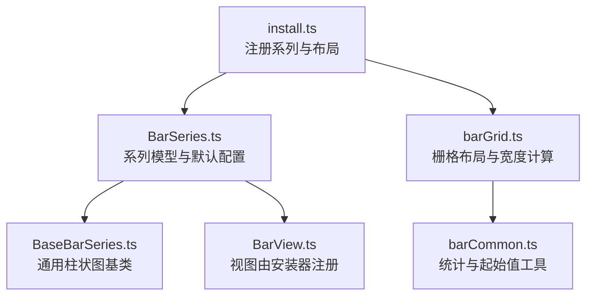
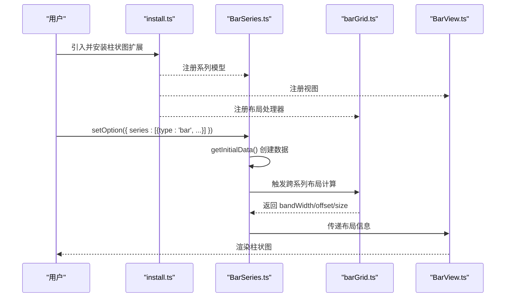
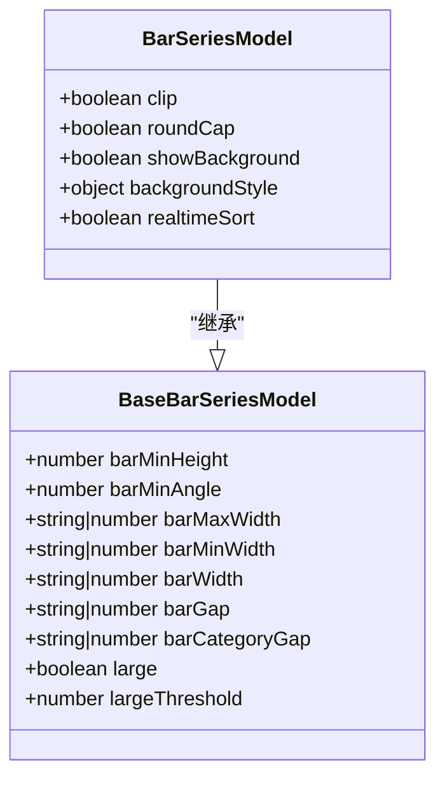
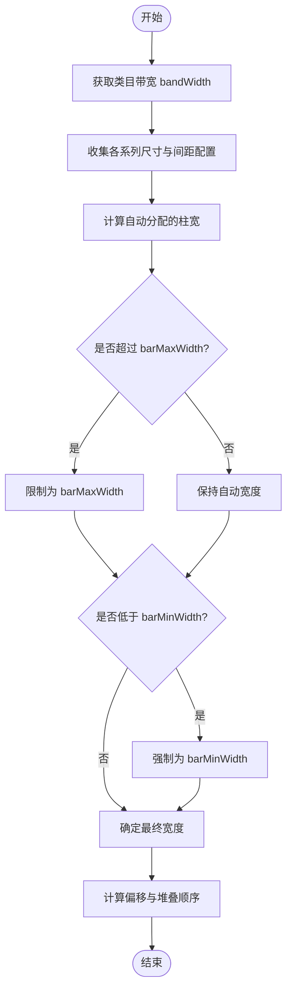
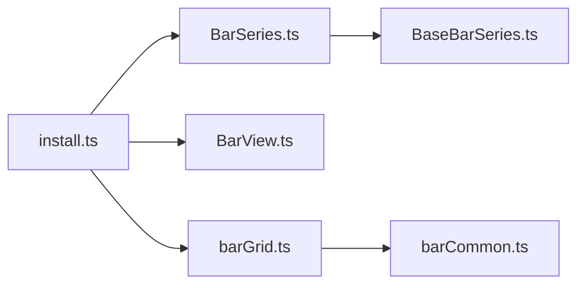

# 柱状图

<cite>
**本文引用的文件**
- [src/chart/bar/BarSeries.ts](file://src/chart/bar/BarSeries.ts)
- [src/chart/bar/BaseBarSeries.ts](file://src/chart/bar/BaseBarSeries.ts)
- [src/chart/bar/install.ts](file://src/chart/bar/install.ts)
- [src/layout/barGrid.ts](file://src/layout/barGrid.ts)
- [src/layout/barCommon.ts](file://src/layout/barCommon.ts)
- [test/bar.html](file://test/bar.html)
- [test/bar-stack.html](file://test/bar-stack.html)
- [test/bar-width.html](file://test/bar-width.html)
- [test/bar-t.html](file://test/bar-t.html)
- [test/bar-large.html](file://test/bar-large.html)
</cite>

## 目录
1. [简介](#简介)
2. [项目结构](#项目结构)
3. [核心组件](#核心组件)
4. [架构总览](#架构总览)
5. [详细组件分析](#详细组件分析)
6. [依赖关系分析](#依赖关系分析)
7. [性能考量](#性能考量)
8. [故障排查指南](#故障排查指南)
9. [结论](#结论)
10. [附录：示例与最佳实践](#附录示例与最佳实践)

## 简介
本文件面向 ECharts 的柱状图（bar）系列，系统说明其适用场景、数据格式要求、核心配置项、视觉效果定制方法，以及与坐标系、响应式、大数据量渲染的配合使用。文档基于源码与测试用例进行归纳，提供从基础到进阶的实践路径，并给出常见问题与优化建议。

## 项目结构
柱状图在 ECharts 中的实现由“模型-视图-布局-处理器”分层构成：
- 模型层：定义系列类型、默认选项、数据初始化与交互能力
- 视图层：负责图形绘制与事件处理
- 布局层：计算柱宽、间距、堆叠位置等
- 处理器：采样、渐进渲染等数据处理流程

图表来源
- [src/chart/bar/install.ts:31-77](file://src/chart/bar/install.ts#L31-L77)
- [src/chart/bar/BarSeries.ts:100-177](file://src/chart/bar/BarSeries.ts#L100-L177)
- [src/chart/bar/BaseBarSeries.ts:87-227](file://src/chart/bar/BaseBarSeries.ts#L87-L227)
- [src/layout/barGrid.ts:154-376](file://src/layout/barGrid.ts#L154-L376)
- [src/layout/barCommon.ts:36-60](file://src/layout/barCommon.ts#L36-L60)

章节来源
- [src/chart/bar/install.ts:31-77](file://src/chart/bar/install.ts#L31-L77)
- [src/chart/bar/BarSeries.ts:100-177](file://src/chart/bar/BarSeries.ts#L100-L177)
- [src/chart/bar/BaseBarSeries.ts:87-227](file://src/chart/bar/BaseBarSeries.ts#L87-L227)
- [src/layout/barGrid.ts:154-376](file://src/layout/barGrid.ts#L154-L376)
- [src/layout/barCommon.ts:36-60](file://src/layout/barCommon.ts#L36-L60)

## 核心组件
- 系列模型 BarSeriesModel：声明系列类型为 bar，支持直角坐标与极坐标，提供 clip、roundCap、showBackground、backgroundStyle、realtimeSort 等特性；维护默认样式与选择态样式。
- 基类 BaseBarSeriesModel：提供通用柱状图能力，如 barMinHeight、barMinAngle、barMaxWidth、barMinWidth、barWidth、barGap、barCategoryGap、large/largeThreshold 等；提供标记点定位与起始值需求判断。
- 布局模块 barGrid：计算 bandWidth、各系列的柱宽与偏移、堆叠分组、类别间距；支持渐进布局与大数据模式。
- 安装器 install：注册系列模型、视图、布局处理器、数据采样处理器以及坐标轴包含形状处理器。

章节来源
- [src/chart/bar/BarSeries.ts:72-177](file://src/chart/bar/BarSeries.ts#L72-L177)
- [src/chart/bar/BaseBarSeries.ts:41-85](file://src/chart/bar/BaseBarSeries.ts#L41-L85)
- [src/layout/barGrid.ts:154-376](file://src/layout/barGrid.ts#L154-L376)
- [src/chart/bar/install.ts:31-77](file://src/chart/bar/install.ts#L31-L77)

## 架构总览
柱状图的渲染流程如下：
1. 安装阶段：注册系列模型、视图、布局与处理器。
2. 数据准备：创建 SeriesData，启用编码默认映射与可选的反向索引（用于实时排序）。
3. 布局阶段：根据坐标轴类型与系列配置计算 bandWidth、柱宽、间距与堆叠位置。
4. 渲染阶段：按普通或大数据模式生成矩形几何，支持背景条、圆角、阴影等视觉属性。
5. 交互阶段：支持点击、选中、tooltip、dataZoom 等。

图表来源
- [src/chart/bar/install.ts:31-77](file://src/chart/bar/install.ts#L31-L77)
- [src/chart/bar/BarSeries.ts:108-138](file://src/chart/bar/BarSeries.ts#L108-L138)
- [src/layout/barGrid.ts:351-376](file://src/layout/barGrid.ts#L351-L376)

## 详细组件分析

### 系列模型与默认配置（BarSeries / BaseBarSeries）
- 系列类型与坐标系：支持 cartesian2d 与 polar；默认使用直角坐标。
- 关键配置项：
  - 尺寸与间距：barWidth、barMinWidth、barMaxWidth、barGap、barCategoryGap
  - 最小高度/角度：barMinHeight、barMinAngle
  - 大数渲染：large、largeThreshold、progressive
  - 背景与裁剪：showBackground、backgroundStyle、clip
  - 极坐标圆头：roundCap
  - 实时排序：realtimeSort（影响数据反向索引）
- 默认样式：选择态边框色、背景透明度等。

图表来源
- [src/chart/bar/BaseBarSeries.ts:41-85](file://src/chart/bar/BaseBarSeries.ts#L41-L85)
- [src/chart/bar/BaseBarSeries.ts:200-221](file://src/chart/bar/BaseBarSeries.ts#L200-L221)
- [src/chart/bar/BarSeries.ts:72-98](file://src/chart/bar/BarSeries.ts#L72-L98)
- [src/chart/bar/BarSeries.ts:144-173](file://src/chart/bar/BarSeries.ts#L144-L173)

章节来源
- [src/chart/bar/BaseBarSeries.ts:41-85](file://src/chart/bar/BaseBarSeries.ts#L41-L85)
- [src/chart/bar/BaseBarSeries.ts:200-221](file://src/chart/bar/BaseBarSeries.ts#L200-L221)
- [src/chart/bar/BarSeries.ts:72-98](file://src/chart/bar/BarSeries.ts#L72-L98)
- [src/chart/bar/BarSeries.ts:144-173](file://src/chart/bar/BarSeries.ts#L144-L173)

### 布局与宽度计算（barGrid）
- 计算依据：坐标轴的 bandWidth（类目带宽），结合 barWidth、barMinWidth、barMaxWidth、barGap、barCategoryGap 计算每组的柱宽与偏移。
- 堆叠逻辑：相同 stackId 的系列在同一组内堆叠；不同 stackId 并列排列。
- 自适应策略：当未显式设置 barWidth 时，自动分配剩余空间；barMinWidth 保证可见性；barMaxWidth 限制最大宽度。
- 渐进布局：为大数据量提供分片渲染计划，减少首屏压力。

图表来源
- [src/layout/barGrid.ts:154-376](file://src/layout/barGrid.ts#L154-L376)
- [src/layout/barGrid.ts:206-349](file://src/layout/barGrid.ts#L206-L349)

章节来源
- [src/layout/barGrid.ts:154-376](file://src/layout/barGrid.ts#L154-L376)
- [src/layout/barGrid.ts:206-349](file://src/layout/barGrid.ts#L206-L349)

### 数据格式与编码
- 基本数据：category 与 value 对应 xAxis 与 yAxis。
- 多系列数据：可通过数组形式或 dataset + encode 指定维度映射。
- 堆叠数据：多个系列设置相同 stack 名称即可堆叠。
- 时间序列：xAxis 可使用 time 类型，配合 dataZoom 展示趋势。

参考示例
- 基本用法与多系列：[test/bar.html](file://test/bar.html)
- 堆叠与 dataset 编码：[test/bar-stack.html](file://test/bar-stack.html)
- 数值轴上的堆叠：[test/bar-stack.html](file://test/bar-stack.html)

章节来源
- [test/bar.html:92-242](file://test/bar.html#L92-L242)
- [test/bar-stack.html:53-429](file://test/bar-stack.html#L53-L429)
- [test/bar-stack.html:452-479](file://test/bar-stack.html#L452-L479)
- [test/bar-stack.html:560-597](file://test/bar-stack.html#L560-L597)
- [test/bar-stack.html:736-787](file://test/bar-stack.html#L736-L787)

### 视觉效果定制
- 颜色与样式：通过 itemStyle 设置填充、边框、圆角、阴影等；emphasis 状态可单独配置。
- 背景条：showBackground 与 backgroundStyle 控制背景条显示与样式。
- 标签：label.show、position 控制数据标签显示与位置。
- 极坐标圆头：roundCap 适用于极坐标切线方向柱状图。

参考示例
- 自定义样式与标签：[test/bar.html](file://test/bar.html)、[test/bar-t.html](file://test/bar-t.html)
- 背景条与圆角：[test/bar-large.html](file://test/bar-large.html)

章节来源
- [test/bar.html:70-90](file://test/bar.html#L70-L90)
- [test/bar.html:92-242](file://test/bar.html#L92-L242)
- [test/bar-t.html:70-89](file://test/bar-t.html#L70-L89)
- [test/bar-large.html:174-223](file://test/bar-large.html#L174-L223)

### 与坐标系的配合
- 直角坐标系：默认 cartesian2d，支持 grid、xAxis、yAxis 组合。
- 极坐标系：coordinateSystem 设为 'polar'，支持 roundCap 与极坐标标签位置扩展。
- 水平柱状图：将 yAxis 设为 category，xAxis 设为 value，即可得到水平条形图。

参考示例
- 直角坐标与网格：[test/bar.html](file://test/bar.html)
- 水平柱状图：[test/bar-large.html](file://test/bar-large.html)

章节来源
- [src/chart/bar/BaseBarSeries.ts:200-221](file://src/chart/bar/BaseBarSeries.ts#L200-L221)
- [src/chart/bar/BarSeries.ts:72-98](file://src/chart/bar/BarSeries.ts#L72-L98)
- [test/bar.html:162-210](file://test/bar.html#L162-L210)
- [test/bar-large.html:174-223](file://test/bar-large.html#L174-L223)

### 响应式适配
- 窗口大小变化：监听 resize 事件调用 chart.resize。
- 数据缩放：dataZoom 支持 inside 与 slider，便于移动端与桌面端交互。
- 类目与数值轴下的宽度自适应：barMinWidth/barMaxWidth 确保在不同缩放下仍可见且合理。

参考示例
- 响应式与缩放：[test/bar.html](file://test/bar.html)、[test/bar-width.html](file://test/bar-width.html)

章节来源
- [test/bar.html:249-263](file://test/bar.html#L249-L263)
- [test/bar-width.html:74-146](file://test/bar-width.html#L74-L146)
- [test/bar-width.html:168-247](file://test/bar-width.html#L168-L247)

### 性能优化技巧
- 大数据模式：开启 large 与合适的 largeThreshold，启用渐进渲染 progressive。
- 采样：内置数据采样处理器降低密集数据的渲染压力。
- 背景条：大数据模式下可绘制背景条提升可读性。
- 避免过度样式：复杂阴影与渐变在大数量下影响性能，按需启用。

参考示例
- 大数据与渐进渲染：[test/bar-large.html](file://test/bar-large.html)

章节来源
- [src/chart/bar/install.ts:44-48](file://src/chart/bar/install.ts#L44-L48)
- [src/chart/bar/BarSeries.ts:118-138](file://src/chart/bar/BarSeries.ts#L118-L138)
- [src/layout/barGrid.ts:380-508](file://src/layout/barGrid.ts#L380-L508)
- [test/bar-large.html:115-152](file://test/bar-large.html#L115-L152)
- [test/bar-large.html:255-307](file://test/bar-large.html#L255-L307)

## 依赖关系分析
- 安装器依赖：注册系列模型、视图、布局与处理器，形成完整的渲染管线。
- 布局依赖：barGrid 依赖坐标轴统计信息与 bandWidth 计算，确保柱宽与间距一致。
- 系列模型依赖：BaseBarSeries 提供通用能力，BarSeries 在此基础上扩展极坐标与大数渲染特性。

图表来源
- [src/chart/bar/install.ts:31-77](file://src/chart/bar/install.ts#L31-L77)
- [src/layout/barGrid.ts:351-376](file://src/layout/barGrid.ts#L351-L376)
- [src/layout/barCommon.ts:36-60](file://src/layout/barCommon.ts#L36-L60)
- [src/chart/bar/BarSeries.ts:100-177](file://src/chart/bar/BarSeries.ts#L100-L177)
- [src/chart/bar/BaseBarSeries.ts:87-227](file://src/chart/bar/BaseBarSeries.ts#L87-L227)

章节来源
- [src/chart/bar/install.ts:31-77](file://src/chart/bar/install.ts#L31-L77)
- [src/layout/barGrid.ts:351-376](file://src/layout/barGrid.ts#L351-L376)
- [src/layout/barCommon.ts:36-60](file://src/layout/barCommon.ts#L36-L60)
- [src/chart/bar/BarSeries.ts:100-177](file://src/chart/bar/BarSeries.ts#L100-L177)
- [src/chart/bar/BaseBarSeries.ts:87-227](file://src/chart/bar/BaseBarSeries.ts#L87-L227)

## 性能考量
- 大数据量：优先启用 large 与 progressive，合理设置 largeThreshold 与 progressiveChunkMode。
- 样式复杂度：减少不必要的阴影与渐变，必要时关闭背景条以提升性能。
- 数据采样：利用内置采样处理器降低密集数据的渲染开销。
- 交互组件：dataZoom 与 tooltip 在大数量下可能带来额外开销，按需配置。

章节来源
- [src/chart/bar/install.ts:44-48](file://src/chart/bar/install.ts#L44-L48)
- [src/chart/bar/BarSeries.ts:118-138](file://src/chart/bar/BarSeries.ts#L118-L138)
- [src/layout/barGrid.ts:380-508](file://src/layout/barGrid.ts#L380-L508)
- [test/bar-large.html:115-152](file://test/bar-large.html#L115-L152)
- [test/bar-large.html:255-307](file://test/bar-large.html#L255-L307)

## 故障排查指南
- 柱过细或不可见：检查 barMinWidth 与 barMaxWidth；在数值轴上移动 dataZoom 时，确保 barMinWidth 足够以保证可见性。
- 堆叠错位：确认各系列的 stack 名称一致；注意正负值与 inverse 轴对堆叠方向的影响。
- 标签位置异常：调整 label.position；在零值或反转轴上，标签需位于正确位置。
- 性能卡顿：开启 large/progressive；减少复杂样式；使用数据采样。

参考示例
- 宽度与可见性：[test/bar-width.html](file://test/bar-width.html)
- 堆叠与反转轴：[test/bar-stack.html](file://test/bar-stack.html)
- 零值标签位置：[test/bar-zero-label.html](file://test/bar-zero-label.html)

章节来源
- [test/bar-width.html:74-146](file://test/bar-width.html#L74-L146)
- [test/bar-width.html:168-247](file://test/bar-width.html#L168-L247)
- [test/bar-stack.html:560-597](file://test/bar-stack.html#L560-L597)
- [test/bar-stack.html:678-717](file://test/bar-stack.html#L678-L717)

## 结论
ECharts 的柱状图具备完善的模型-视图-布局体系，支持分类比较、时间序列、堆叠与水平展示等多种场景。通过合理的配置项（如 barWidth、barGap、stack）与视觉效果定制（itemStyle、label、backgroundStyle），可以满足多样化业务需求。针对大数据量与移动端场景，应充分利用 large、progressive、dataZoom 与响应式适配，以获得流畅的用户体验。

## 附录：示例与最佳实践
- 基本用法：参考 [test/bar.html](file://test/bar.html)
- 堆叠柱状图：参考 [test/bar-stack.html](file://test/bar-stack.html)
- 水平柱状图：参考 [test/bar-large.html](file://test/bar-large.html)
- 宽度与间距：参考 [test/bar-width.html](file://test/bar-width.html)
- 自定义样式：参考 [test/bar.html](file://test/bar.html)、[test/bar-t.html](file://test/bar-t.html)
- 大数据与渐进渲染：参考 [test/bar-large.html](file://test/bar-large.html)

最佳实践建议
- 明确数据维度：使用 dataset + encode 清晰映射 x/y 维度，便于多系列与堆叠。
- 合理设置宽度：在数值轴上使用 barMinWidth 保证可见性；在类目轴上利用 barWidth 百分比与 barMaxWidth 控制密度。
- 堆叠一致性：同一组堆叠的系列必须设置相同的 stack 名称。
- 性能优先：大数据量开启 large/progressive；减少复杂样式；合理使用 dataZoom。
- 响应式：监听 resize 并调用 chart.resize；在移动端优先使用 inside dataZoom。

章节来源
- [test/bar.html:92-242](file://test/bar.html#L92-L242)
- [test/bar-stack.html:560-597](file://test/bar-stack.html#L560-L597)
- [test/bar-width.html:74-146](file://test/bar-width.html#L74-L146)
- [test/bar-large.html:174-223](file://test/bar-large.html#L174-L223)
- [test/bar-large.html:255-307](file://test/bar-large.html#L255-L307)