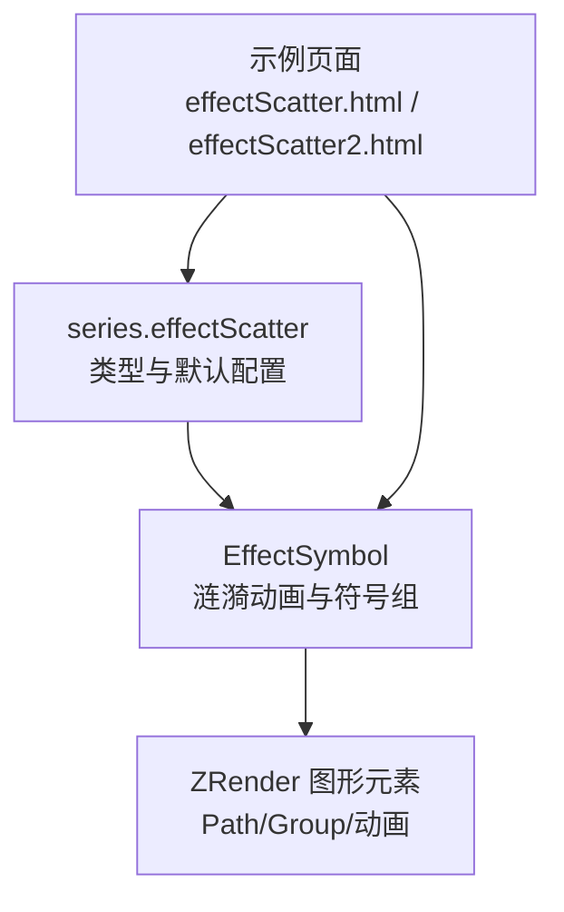
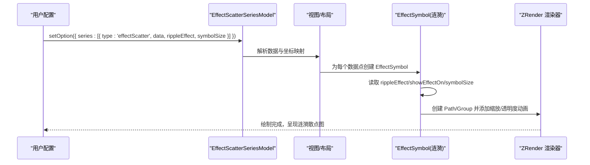
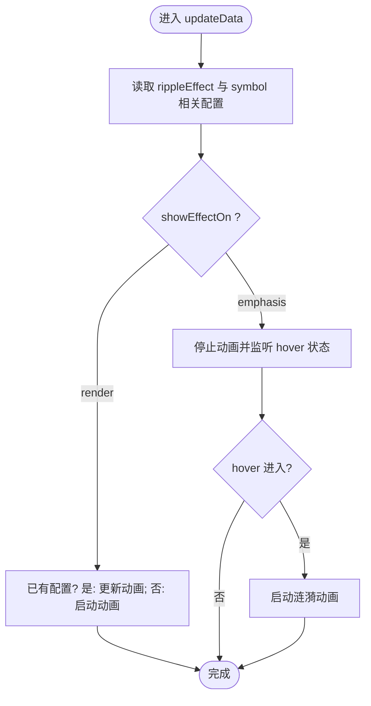
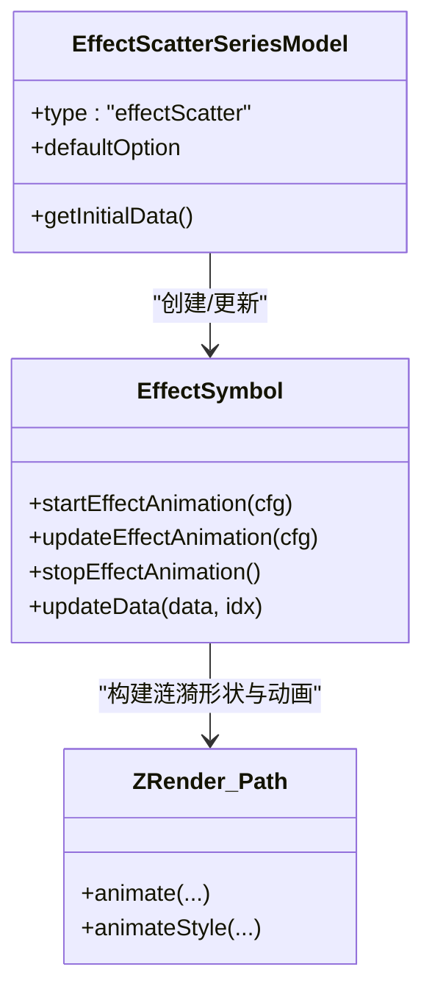

# 涟漪散点图

<cite>
**本文引用的文件**
- [src/chart/effectScatter/EffectScatterSeries.ts](file://src/chart/effectScatter/EffectScatterSeries.ts)
- [src/chart/helper/EffectSymbol.ts](file://src/chart/helper/EffectSymbol.ts)
- [test/effectScatter.html](file://test/effectScatter.html)
- [test/effectScatter2.html](file://test/effectScatter2.html)
</cite>

## 目录
1. [简介](#简介)
2. [项目结构](#项目结构)
3. [核心组件](#核心组件)
4. [架构总览](#架构总览)
5. [详细组件分析](#详细组件分析)
6. [依赖关系分析](#依赖关系分析)
7. [性能与大数据处理](#性能与大数据处理)
8. [故障排查指南](#故障排查指南)
9. [结论](#结论)
10. [附录：配置项速查与示例路径](#附录配置项速查与示例路径)

## 简介
涟漪散点图（effectScatter）在普通散点图的基础上，为数据点叠加“水波扩散”的动画效果，适用于需要强调重要数据点、展示动态变化或增强视觉引导的场景。例如：
- 实时数据看板中突出关键指标点
- 地图上的热点城市、异常点位
- 时序或空间数据中的峰值、极值点
- 交互触发时的高亮提示

本仓库提供了涟漪散点图的类型定义、默认配置、渲染与动画实现，以及多个可运行的测试用例，便于快速上手与扩展。

## 项目结构
与涟漪散点图相关的核心代码位于以下位置：
- 系列模型与默认配置：src/chart/effectScatter/EffectScatterSeries.ts
- 涟漪动画与符号绘制：src/chart/helper/EffectSymbol.ts
- 示例页面：test/effectScatter.html、test/effectScatter2.html

图表来源
- [src/chart/effectScatter/EffectScatterSeries.ts:110-155](file://src/chart/effectScatter/EffectScatterSeries.ts#L110-L155)
- [src/chart/helper/EffectSymbol.ts:57-119](file://src/chart/helper/EffectSymbol.ts#L57-L119)

章节来源
- [src/chart/effectScatter/EffectScatterSeries.ts:110-155](file://src/chart/effectScatter/EffectScatterSeries.ts#L110-L155)
- [src/chart/helper/EffectSymbol.ts:57-119](file://src/chart/helper/EffectSymbol.ts#L57-L119)
- [test/effectScatter.html:508-564](file://test/effectScatter.html#L508-L564)
- [test/effectScatter2.html:43-96](file://test/effectScatter2.html#L43-L96)

## 核心组件
- 系列模型 EffectScatterSeriesModel
  - 声明 series.type = 'effectScatter'
  - 提供默认配置 rippleEffect（周期、缩放、填充/描边、数量等）、showEffectOn（渲染时或强调态显示）、symbolSize 等
  - 支持多种坐标系（cartesian2d、polar、geo、bmap 等）
- 涟漪动画 EffectSymbol
  - 将“符号 + 涟漪组”组合为一个整体
  - 根据配置创建多个 Path 并执行缩放与透明度动画，形成水波扩散效果
  - 支持在 render 或 emphasis 时启动/停止动画，并可随 symbol 旋转、偏移同步

章节来源
- [src/chart/effectScatter/EffectScatterSeries.ts:75-93](file://src/chart/effectScatter/EffectScatterSeries.ts#L75-L93)
- [src/chart/effectScatter/EffectScatterSeries.ts:110-155](file://src/chart/effectScatter/EffectScatterSeries.ts#L110-L155)
- [src/chart/helper/EffectSymbol.ts:29-41](file://src/chart/helper/EffectSymbol.ts#L29-L41)
- [src/chart/helper/EffectSymbol.ts:57-119](file://src/chart/helper/EffectSymbol.ts#L57-L119)
- [src/chart/helper/EffectSymbol.ts:164-234](file://src/chart/helper/EffectSymbol.ts#L164-L234)

## 架构总览
涟漪散点图的数据流与渲染流程如下：

图表来源
- [src/chart/effectScatter/EffectScatterSeries.ts:110-155](file://src/chart/effectScatter/EffectScatterSeries.ts#L110-L155)
- [src/chart/helper/EffectSymbol.ts:164-234](file://src/chart/helper/EffectSymbol.ts#L164-L234)

## 详细组件分析

### 涟漪散点图系列模型（EffectScatterSeriesModel）
- 类型与依赖
  - type: 'effectScatter'
  - 依赖 grid/polar 等坐标系能力，实际也兼容 geo/bmap 等
- 默认配置要点
  - showEffectOn: 'render' | 'emphasis'
  - rippleEffect: { period, scale, brushType, number }
  - symbolSize: 数值或函数，控制符号大小（涟漪跟随符号尺寸）
- 数据格式
  - 支持对象数组与简单值数组；对象中 name/value 常见，value 可为标量或维度数组（如地理坐标+数值）
- 坐标系
  - cartesian2d、polar、geo、bmap、singleAxis 等均可使用

章节来源
- [src/chart/effectScatter/EffectScatterSeries.ts:75-93](file://src/chart/effectScatter/EffectScatterSeries.ts#L75-L93)
- [src/chart/effectScatter/EffectScatterSeries.ts:110-155](file://src/chart/effectScatter/EffectScatterSeries.ts#L110-L155)

### 涟漪动画实现（EffectSymbol）
- 组成
  - 子节点1：基础符号（圆形/菱形/图片等）
  - 子节点2：涟漪组（多个 Path），按配置的 rippleNumber 生成
- 动画参数
  - period：单圈周期（秒），内部转换为毫秒
  - scale：最大缩放倍数
  - brushType：fill/stroke，决定填充或描边
  - number：涟漪个数
  - color/rippleEffectColor：颜色
  - effectOffset：错开起始时间，避免同批点同时起波
- 触发时机
  - showEffectOn='render'：初始化即播放
  - showEffectOn='emphasis'：仅在鼠标悬停/聚焦时播放
- 更新策略
  - 若关键属性（symbolType、period、rippleScale、rippleNumber）变更，则重建动画
  - 否则仅更新样式与层级

图表来源
- [src/chart/helper/EffectSymbol.ts:164-234](file://src/chart/helper/EffectSymbol.ts#L164-L234)

章节来源
- [src/chart/helper/EffectSymbol.ts:29-41](file://src/chart/helper/EffectSymbol.ts#L29-L41)
- [src/chart/helper/EffectSymbol.ts:77-119](file://src/chart/helper/EffectSymbol.ts#L77-L119)
- [src/chart/helper/EffectSymbol.ts:124-140](file://src/chart/helper/EffectSymbol.ts#L124-L140)
- [src/chart/helper/EffectSymbol.ts:164-234](file://src/chart/helper/EffectSymbol.ts#L164-L234)

### 示例与用法路径
- 地图热点 + 涟漪散点（Geo/BMap）
  - 参考：[test/effectScatter.html:508-564](file://test/effectScatter.html#L508-L564)
  - 展示了在 geo/bmap 坐标系下，结合 symbolSize 函数与 rippleEffect 的使用
- 自定义符号旋转与标签
  - 参考：[test/effectScatter2.html:43-96](file://test/effectScatter2.html#L43-L96)
  - 演示了 image 符号、symbolRotate、label 与 encode 的配合

章节来源
- [test/effectScatter.html:508-564](file://test/effectScatter.html#L508-L564)
- [test/effectScatter2.html:43-96](file://test/effectScatter2.html#L43-L96)

## 依赖关系分析
- 系列模型依赖坐标系与数据管线，负责解析数据、计算布局、暴露默认配置
- 涟漪动画依赖 ZRender 的图形与动画能力，通过 Group/Path 组合与 animate/animateStyle 实现
- 示例页面通过 setOption 驱动系列与组件，验证不同坐标系下的表现

图表来源
- [src/chart/effectScatter/EffectScatterSeries.ts:110-155](file://src/chart/effectScatter/EffectScatterSeries.ts#L110-L155)
- [src/chart/helper/EffectSymbol.ts:57-119](file://src/chart/helper/EffectSymbol.ts#L57-L119)

章节来源
- [src/chart/effectScatter/EffectScatterSeries.ts:110-155](file://src/chart/effectScatter/EffectScatterSeries.ts#L110-L155)
- [src/chart/helper/EffectSymbol.ts:57-119](file://src/chart/helper/EffectSymbol.ts#L57-L119)

## 性能与大数据处理
- 动画成本
  - 涟漪由多个 Path 构成，number 越大、scale 越大，渲染与动画开销越高
  - period 越小，单位时间内动画帧越多，CPU/GPU 压力越大
- 建议
  - 大数据量场景降低 rippleEffect.number，适当增大 period，减少 scale
  - 使用 showEffectOn='emphasis' 仅在交互时播放，降低常驻动画开销
  - 合理设置 symbolSize，避免过大导致覆盖过多区域
  - 结合 dataZoom/visualMap 进行筛选与聚合，减少首屏渲染点数
  - 对频繁更新的场景，优先增量更新（setOption 局部 series.data），避免全量重绘
- 与其他组件配合
  - 与 tooltip：注意大量点时的提示性能，必要时关闭或延迟显示
  - 与 dataZoom：放大后可再开启涟漪，缩小后关闭或简化
  - 与 visualMap：用颜色/大小区分重要性，减少不必要的动画

[本节为通用性能建议，不直接分析具体文件]

## 故障排查指南
- 涟漪不显示
  - 检查 showEffectOn 是否为 'render'；若为 'emphasis'，需触发 hover/focus
  - 确认 rippleEffect.number > 0，且 symbolSize 不为 0
  - 确认坐标系正确（cartesian2d/polar/geo/bmap 等）
- 动画卡顿
  - 降低 rippleEffect.number 与 scale，增大 period
  - 减少数据点数量或使用采样/聚合
  - 关闭不必要的 label/tooltip 或延迟显示
- 颜色/样式不生效
  - 检查 itemStyle.color 与 rippleEffect.color 的优先级
  - 确认 brushType 与 fill/stroke 的设置是否匹配预期
- 更新后动画未刷新
  - 若修改了 symbolType/period/rippleScale/rippleNumber 等关键属性，会重建动画；否则仅更新样式
  - 可通过 setOption 局部更新 series.data 触发重新计算

章节来源
- [src/chart/helper/EffectSymbol.ts:124-140](file://src/chart/helper/EffectSymbol.ts#L124-L140)
- [src/chart/helper/EffectSymbol.ts:164-234](file://src/chart/helper/EffectSymbol.ts#L164-L234)

## 结论
涟漪散点图通过“符号 + 涟漪动画”的组合，能够在复杂数据场景中有效突出关键信息。其核心在于：
- 合理的 rippleEffect 配置（period、scale、brushType、number）
- 合适的 symbolSize 与坐标系选择
- 针对大数据与高频更新的性能优化策略
- 与 tooltip、dataZoom、visualMap 等组件的协同使用

借助仓库提供的类型定义、默认配置与示例页面，可以快速构建高质量、高性能的涟漪散点可视化。

## 附录：配置项速查与示例路径

- 系列级配置（series.effectScatter）
  - coordinateSystem：坐标系（cartesian2d/polar/geo/bmap/singleAxis 等）
  - showEffectOn：'render' | 'emphasis'
  - rippleEffect：
    - period：周期（秒）
    - scale：涟漪最大缩放倍数
    - brushType：'fill' | 'stroke'
    - number：涟漪个数
    - color：涟漪颜色（可覆盖 itemStyle.color）
  - symbolSize：数值或函数，控制符号大小（涟漪跟随）
  - itemStyle：符号样式（color、opacity、shadow 等）
  - label：标签配置（名称、位置、格式化器等）
  - emphasis：强调态配置（focus、blurScope、disabled 等）

- 数据格式
  - 对象数组：{ name, value }，value 可为标量或维度数组（如 [x, y, z]）
  - 简单值数组：[x, y] 或 [x, y, z]，需配合 encode 或坐标系自动推断

- 示例路径
  - 基本涟漪效果与地图热点：[test/effectScatter.html:508-564](file://test/effectScatter.html#L508-L564)
  - 自定义符号旋转与标签：[test/effectScatter2.html:43-96](file://test/effectScatter2.html#L43-L96)

章节来源
- [src/chart/effectScatter/EffectScatterSeries.ts:110-155](file://src/chart/effectScatter/EffectScatterSeries.ts#L110-L155)
- [test/effectScatter.html:508-564](file://test/effectScatter.html#L508-L564)
- [test/effectScatter2.html:43-96](file://test/effectScatter2.html#L43-L96)