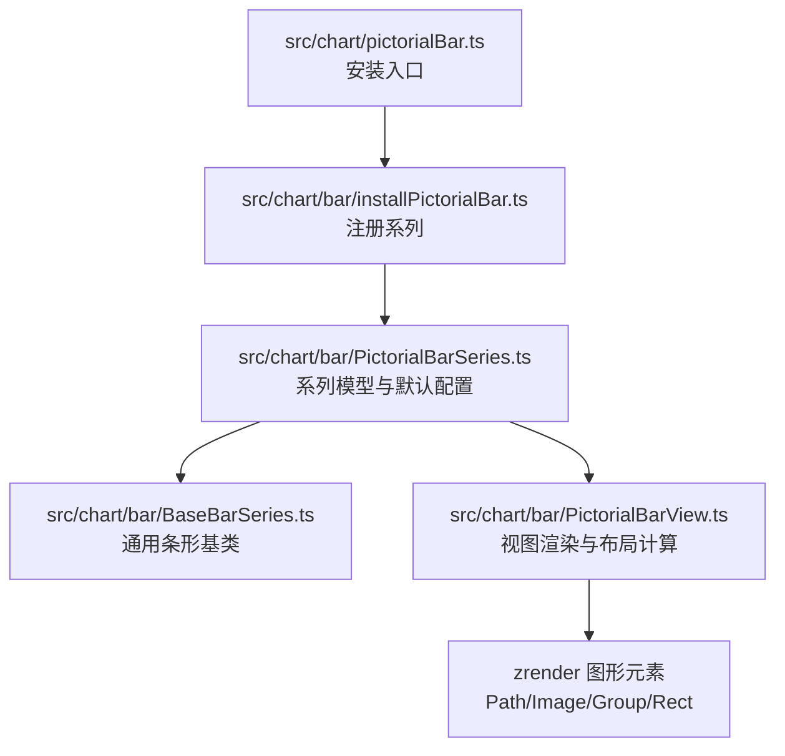
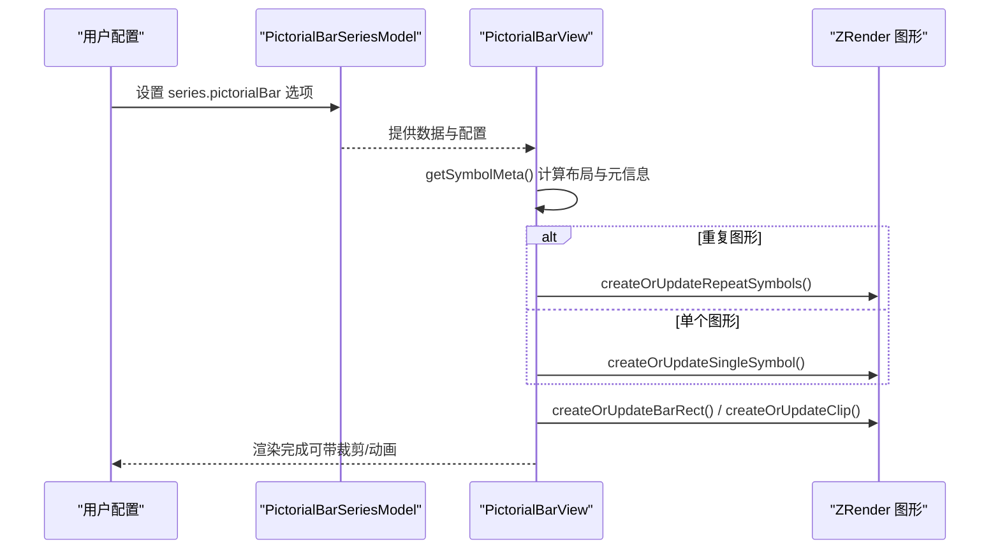
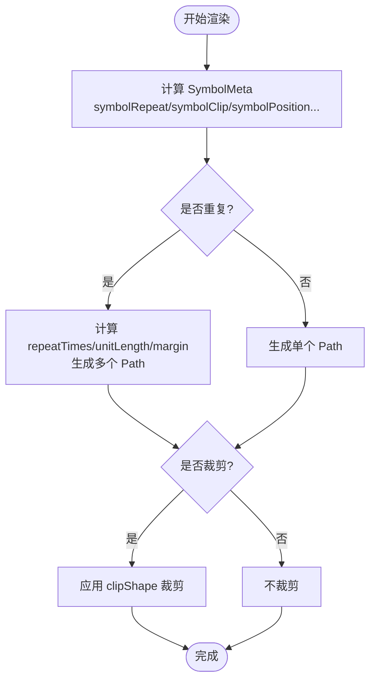
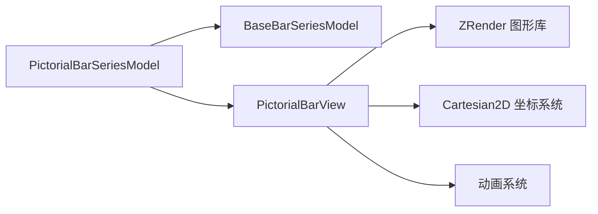

# 象形柱状图

<cite>
**本文引用的文件**
- [PictorialBarSeries.ts](file://src/chart/bar/PictorialBarSeries.ts)
- [PictorialBarView.ts](file://src/chart/bar/PictorialBarView.ts)
- [pictorialBar.ts](file://src/chart/pictorialBar.ts)
- [BaseBarSeries.ts](file://src/chart/bar/BaseBarSeries.ts)
- [pictorial-repeat.html](file://test/pictorial-repeat.html)
- [pictorial-single.html](file://test/pictorial-single.html)
- [pictorial-svg.html](file://test/pictorial-svg.html)
- [pictorial-zero-value.html](file://test/pictorial-zero-value.html)
</cite>

## 目录
1. [简介](#简介)
2. [项目结构](#项目结构)
3. [核心组件](#核心组件)
4. [架构总览](#架构总览)
5. [详细组件分析](#详细组件分析)
6. [依赖关系分析](#依赖关系分析)
7. [性能与优化](#性能与优化)
8. [故障排查指南](#故障排查指南)
9. [结论](#结论)
10. [附录：配置项速查与示例路径](#附录配置项速查与示例路径)

## 简介
象形柱状图（pictorialBar）是一种以“图形符号”替代传统矩形条的柱状图，适用于创意数据展示、品牌化图表、进度/里程碑可视化等场景。它通过重复或单个图形元素表达数值大小，支持旋转、偏移、裁剪、渐变纹理、响应式尺寸等能力，能显著提升视觉表现力与可读性。

适用场景举例
- 创意数据展示：用飞机、轮船、汽车等图标表示速度或数量对比
- 品牌化图表：使用企业Logo或定制矢量图形作为数据载体
- 进度/里程碑：用连续重复的小图标表示完成度，如任务进度、目标达成
- 零值与负值：清晰表达零值位置与正负方向，便于对比

## 项目结构
ECharts 中象形柱状图由“系列模型 + 视图渲染”构成，并通过安装脚本注册到图表系统。

图示来源
- [pictorialBar.ts:20-23](file://src/chart/pictorialBar.ts#L20-L23)
- [PictorialBarSeries.ts:129-187](file://src/chart/bar/PictorialBarSeries.ts#L129-L187)
- [PictorialBarView.ts:130-233](file://src/chart/bar/PictorialBarView.ts#L130-L233)
- [BaseBarSeries.ts:87-95](file://src/chart/bar/BaseBarSeries.ts#L87-L95)

章节来源
- [pictorialBar.ts:20-23](file://src/chart/pictorialBar.ts#L20-L23)
- [PictorialBarSeries.ts:129-187](file://src/chart/bar/PictorialBarSeries.ts#L129-L187)
- [PictorialBarView.ts:130-233](file://src/chart/bar/PictorialBarView.ts#L130-L233)
- [BaseBarSeries.ts:87-95](file://src/chart/bar/BaseBarSeries.ts#L87-L95)

## 核心组件
- 系列模型（PictorialBarSeriesModel）
  - 定义 series.pictorialBar 的配置项与默认值，包括 symbol、symbolSize、symbolPosition、symbolRepeat、symbolRepeatDirection、symbolClip、symbolBoundingData、symbolPatternSize 等
  - 继承自 BaseBarSeriesModel，复用通用条形图能力（如 barGap、barCategoryGap、barWidth 等）
- 视图渲染（PictorialBarView）
  - 负责根据数据与配置计算每个数据项的布局、生成图形元素（单个或多个）、处理裁剪、动画、更新与移除
  - 内部维护 SymbolMeta 元信息，集中管理 symbol 类型、尺寸、缩放、边距、重复次数、裁剪形状等

章节来源
- [PictorialBarSeries.ts:43-127](file://src/chart/bar/PictorialBarSeries.ts#L43-L127)
- [PictorialBarSeries.ts:129-187](file://src/chart/bar/PictorialBarSeries.ts#L129-L187)
- [PictorialBarView.ts:66-128](file://src/chart/bar/PictorialBarView.ts#L66-L128)
- [PictorialBarView.ts:251-302](file://src/chart/bar/PictorialBarView.ts#L251-L302)

## 架构总览
下图展示了从配置到渲染的关键流程：用户配置 → 系列模型解析 → 视图计算布局与元信息 → 创建/更新图形元素 → 可选裁剪与动画。

图示来源
- [PictorialBarView.ts:136-233](file://src/chart/bar/PictorialBarView.ts#L136-L233)
- [PictorialBarView.ts:558-633](file://src/chart/bar/PictorialBarView.ts#L558-L633)
- [PictorialBarView.ts:635-680](file://src/chart/bar/PictorialBarView.ts#L635-L680)
- [PictorialBarView.ts:682-744](file://src/chart/bar/PictorialBarView.ts#L682-L744)

## 详细组件分析

### 系列模型：series.pictorialBar 配置项
- 基础条形图配置（继承）
  - barWidth、barGap、barCategoryGap、barMinHeight、large/largeThreshold 等
- 象形图专属配置
  - symbol：图形类型（内置形状、path、image 等）
  - symbolSize：图形尺寸，可为数字、数组或百分比字符串
  - symbolRotate：旋转角度
  - symbolPosition：'start' | 'end' | 'center'，控制图形在轴向上的起始/结束/居中
  - symbolOffset：相对 symbolSize 的偏移
  - symbolMargin：图形间距，支持百分比；末尾加 “!” 可保留末端间隙
  - symbolRepeat：是否重复；true/false/数字/'fixed'
  - symbolRepeatDirection：'start' | 'end'，决定重复方向
  - symbolClip：是否对图形进行裁剪
  - symbolBoundingData：用于确定图形边界的数据范围，可为数值或区间
  - symbolPatternSize：图案尺寸，影响纹理/渐变铺展

章节来源
- [PictorialBarSeries.ts:43-127](file://src/chart/bar/PictorialBarSeries.ts#L43-L127)
- [BaseBarSeries.ts:41-85](file://src/chart/bar/BaseBarSeries.ts#L41-L85)

### 视图渲染：布局与图形生成
- 元信息计算（getSymbolMeta）
  - 读取 symbolRepeat/symbolClip/symbolPosition/symbolRotate/symbolPatternSize 等
  - 准备 bar 长度、symbol 尺寸、线宽、布局信息（pathPosition、bundlePosition、clipShape）
- 重复图形（createOrUpdateRepeatSymbols）
  - 根据 repeatTimes、unitLength、symbolMargin 计算每个实例的位置与缩放
  - 支持按方向排列（start/end），并处理超出裁剪区域的情况
- 单个图形（createOrUpdateSingleSymbol）
  - 为每个数据项创建主图形，应用位置、缩放、旋转
- 裁剪与背景矩形（createOrUpdateClip/createOrUpdateBarRect）
  - 当开启 symbolClip 时，基于 clipShape 动态裁剪
  - 背景矩形用于标签定位与交互

图示来源
- [PictorialBarView.ts:251-302](file://src/chart/bar/PictorialBarView.ts#L251-L302)
- [PictorialBarView.ts:304-354](file://src/chart/bar/PictorialBarView.ts#L304-L354)
- [PictorialBarView.ts:356-437](file://src/chart/bar/PictorialBarView.ts#L356-L437)
- [PictorialBarView.ts:439-536](file://src/chart/bar/PictorialBarView.ts#L439-L536)
- [PictorialBarView.ts:558-633](file://src/chart/bar/PictorialBarView.ts#L558-L633)
- [PictorialBarView.ts:635-680](file://src/chart/bar/PictorialBarView.ts#L635-L680)
- [PictorialBarView.ts:682-744](file://src/chart/bar/PictorialBarView.ts#L682-L744)

### 数据格式要求
- 基本数据
  - data 可为数值数组或对象数组，支持 '-' 表示空值
  - 每个数据项可覆盖 symbol、symbolSize、symbolRepeat、symbolPosition、itemStyle、label 等
- 坐标系统
  - 通常配合 cartesian2d（直角坐标系），x/y 轴分别承载类别与数值
- 特殊值
  - 零值：支持正确显示与标签定位
  - 负值：支持反向绘制与裁剪

章节来源
- [PictorialBarSeries.ts:115-127](file://src/chart/bar/PictorialBarSeries.ts#L115-L127)
- [pictorial-zero-value.html:108-170](file://test/pictorial-zero-value.html#L108-L170)
- [pictorial-single.html:373-434](file://test/pictorial-single.html#L373-L434)

### 图形元素配置详解
- symbol
  - 支持内置形状、path、image、自定义图形
  - 可通过 itemStyle.color.image 实现纹理填充
- symbolSize
  - 支持像素、百分比、数组；百分比相对于类目宽度或 boundingLength
- symbolPosition
  - 'start' | 'end' | 'center'，控制图形在轴向上对齐方式
- symbolRepeat
  - false：不重复
  - true：自动计算重复次数并按数据裁剪
  - 数字：固定重复次数，不按数据裁剪
  - 'fixed'：自动计算重复次数但不裁剪
- symbolRepeatDirection
  - 'start' | 'end'，控制重复方向
- symbolClip
  - 是否启用裁剪，避免图形溢出可视区域
- symbolBoundingData
  - 指定图形边界的数据范围，可用于精确控制重复与裁剪
- symbolPatternSize
  - 控制图案尺寸，影响纹理/渐变铺展效果

章节来源
- [PictorialBarSeries.ts:43-127](file://src/chart/bar/PictorialBarSeries.ts#L43-L127)
- [PictorialBarView.ts:356-437](file://src/chart/bar/PictorialBarView.ts#L356-L437)
- [PictorialBarView.ts:439-536](file://src/chart/bar/PictorialBarView.ts#L439-L536)

### 完整示例与参考路径
- 基本象形图（单个图形）
  - 参考：[pictorial-single.html](file://test/pictorial-single.html)
- 重复图形（symbolRepeat）
  - 参考：[pictorial-repeat.html](file://test/pictorial-repeat.html)
- 渐变与纹理（symbolPatternSize + itemStyle.color.image）
  - 参考：[pictorial-single.html](file://test/pictorial-single.html)
- SVG 渲染模式
  - 参考：[pictorial-svg.html](file://test/pictorial-svg.html)
- 零值与负值处理
  - 参考：[pictorial-zero-value.html](file://test/pictorial-zero-value.html)

章节来源
- [pictorial-single.html:121-233](file://test/pictorial-single.html#L121-L233)
- [pictorial-repeat.html:105-164](file://test/pictorial-repeat.html#L105-L164)
- [pictorial-svg.html:44-204](file://test/pictorial-svg.html#L44-L204)
- [pictorial-zero-value.html:108-170](file://test/pictorial-zero-value.html#L108-L170)

## 依赖关系分析
- 模块耦合
  - PictorialBarSeriesModel 依赖 BaseBarSeriesModel 提供通用条形能力
  - PictorialBarView 依赖 zrender 图形库创建 Path/Image/Group/Rect，并使用工具函数处理样式与布局
- 外部集成点
  - 坐标系统：cartesian2d（直角坐标系）
  - 渲染器：Canvas/SVG（通过 echarts.init 的 renderer 参数选择）
  - 动画：基于 zrender 的动画系统，支持逐元素延迟与过渡

图示来源
- [PictorialBarSeries.ts:129-187](file://src/chart/bar/PictorialBarSeries.ts#L129-L187)
- [PictorialBarView.ts:130-233](file://src/chart/bar/PictorialBarView.ts#L130-L233)

章节来源
- [PictorialBarSeries.ts:129-187](file://src/chart/bar/PictorialBarSeries.ts#L129-L187)
- [PictorialBarView.ts:130-233](file://src/chart/bar/PictorialBarView.ts#L130-L233)

## 性能与优化
- 大数据量
  - 使用 large/largeThreshold 控制大数据渲染策略
  - 合理设置 symbolRepeat 与 symbolPatternSize，避免过多图形实例
- 动画与交互
  - 关闭不必要的动画以提升性能（animation: false）
  - 使用 silent 禁用交互以减少事件开销
- 资源加载
  - 图片资源建议预加载或使用 base64/dataURI，减少网络请求
  - 纹理/渐变通过 itemStyle.color.image 与 symbolPatternSize 控制铺展，避免过大图案
- 响应式设计
  - 使用百分比 symbolSize 适配不同屏幕尺寸
  - 监听 resize 事件调用 chart.resize 保持布局正确

章节来源
- [BaseBarSeries.ts:83-85](file://src/chart/bar/BaseBarSeries.ts#L83-L85)
- [pictorial-repeat.html:301-354](file://test/pictorial-repeat.html#L301-L354)
- [pictorial-single.html:257-335](file://test/pictorial-single.html#L257-L335)

## 故障排查指南
- 图形未显示或尺寸异常
  - 检查 symbolSize 是否为有效值（数字/数组/百分比）
  - 确认 symbolBoundingData 是否正确设置
- 重复图形错位或溢出
  - 调整 symbolMargin 与 symbolRepeatDirection
  - 开启 symbolClip 防止溢出
- 零值标签位置不正确
  - 确保 label 的 position 与 offset 设置合理
  - 参考零值测试用例验证行为
- 图片资源未加载
  - 检查 image 路径或 base64 数据是否正确
  - 考虑预加载或缓存策略

章节来源
- [pictorial-zero-value.html:108-170](file://test/pictorial-zero-value.html#L108-L170)
- [pictorial-repeat.html:241-289](file://test/pictorial-repeat.html#L241-L289)
- [pictorial-single.html:257-335](file://test/pictorial-single.html#L257-L335)

## 结论
象形柱状图通过灵活的图形配置与强大的布局计算，能够在保持数据可读性的同时提升视觉表现力。合理使用 symbolRepeat、symbolPosition、symbolClip、symbolBoundingData 等配置，可以应对多种创意可视化需求。结合性能优化与响应式设计，可在不同设备与数据规模下获得稳定体验。

## 附录：配置项速查与示例路径
- 核心配置项
  - series.type: 'pictorialBar'
  - series.symbol, series.symbolSize, series.symbolPosition, series.symbolRepeat, series.symbolRepeatDirection, series.symbolClip, series.symbolBoundingData, series.symbolPatternSize
  - 通用条形配置：barWidth, barGap, barCategoryGap, large, largeThreshold
- 示例参考
  - 基本象形图：[pictorial-single.html](file://test/pictorial-single.html)
  - 重复图形：[pictorial-repeat.html](file://test/pictorial-repeat.html)
  - 渐变与纹理：[pictorial-single.html](file://test/pictorial-single.html)
  - SVG 渲染：[pictorial-svg.html](file://test/pictorial-svg.html)
  - 零值与负值：[pictorial-zero-value.html](file://test/pictorial-zero-value.html)

章节来源
- [PictorialBarSeries.ts:115-187](file://src/chart/bar/PictorialBarSeries.ts#L115-L187)
- [BaseBarSeries.ts:41-85](file://src/chart/bar/BaseBarSeries.ts#L41-L85)
- [pictorial-single.html:121-233](file://test/pictorial-single.html#L121-L233)
- [pictorial-repeat.html:105-164](file://test/pictorial-repeat.html#L105-L164)
- [pictorial-svg.html:44-204](file://test/pictorial-svg.html#L44-L204)
- [pictorial-zero-value.html:108-170](file://test/pictorial-zero-value.html#L108-L170)