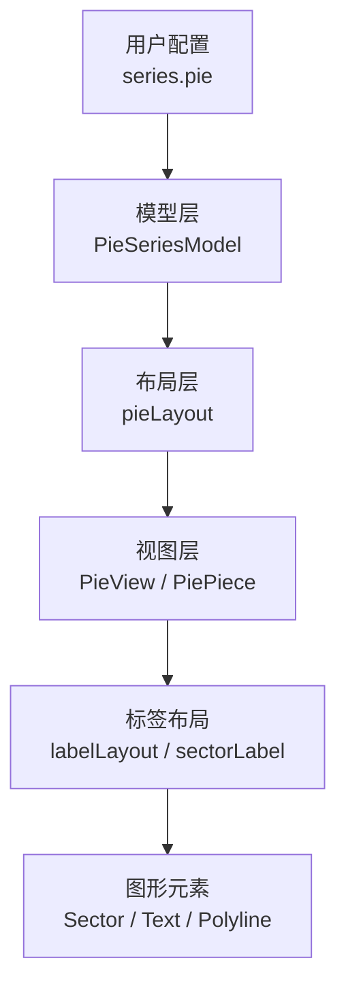
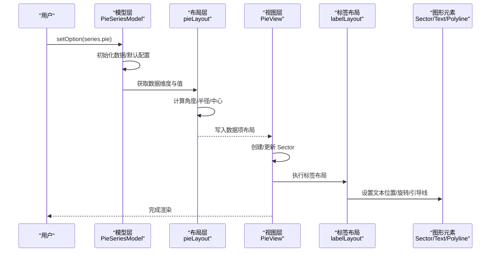
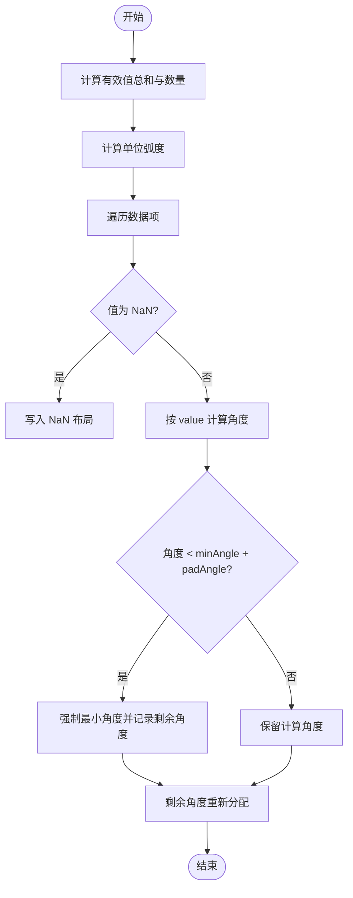
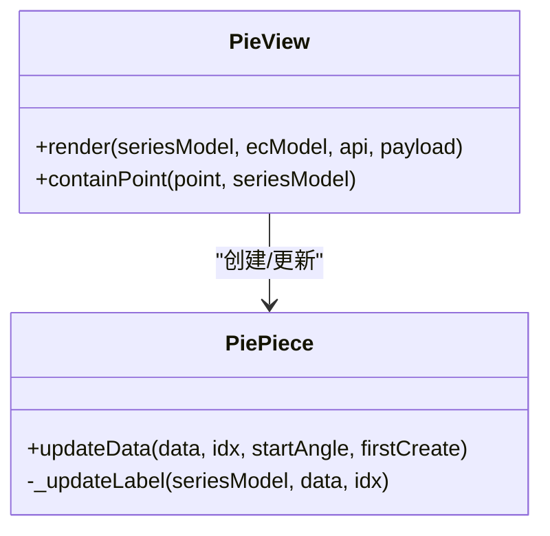
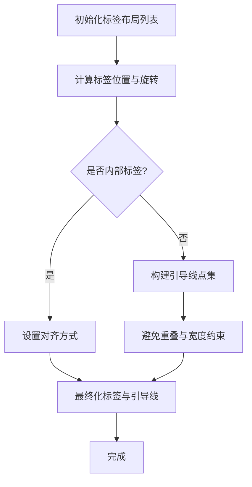
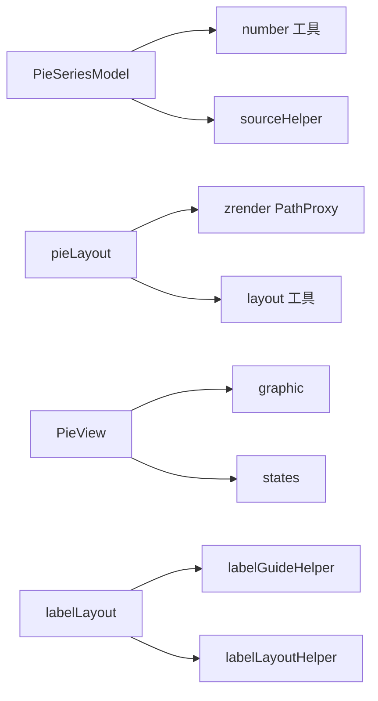

# 饼图

<cite>
**本文引用的文件**
- [src/chart/pie/pieSeries.ts](file://src/chart/pie/pieSeries.ts)
- [src/chart/pie/pieLayout.ts](file://src/chart/pie/pieLayout.ts)
- [src/chart/pie/pieView.ts](file://src/chart/pie/pieView.ts)
- [src/chart/pie/labelLayout.ts](file://src/chart/pie/labelLayout.ts)
- [src/label/sectorLabel.ts](file://src/label/sectorLabel.ts)
- [test/pie.html](file://test/pie.html)
- [test/roseType.html](file://test/roseType.html)
- [test/pie-label.html](file://test/pie-label.html)
- [test/pie-cornerRadius.html](file://test/pie-cornerRadius.html)
</cite>

## 目录
1. [简介](#简介)
2. [项目结构](#项目结构)
3. [核心组件](#核心组件)
4. [架构总览](#架构总览)
5. [详细组件分析](#详细组件分析)
6. [依赖关系分析](#依赖关系分析)
7. [性能考虑](#性能考虑)
8. [故障排查指南](#故障排查指南)
9. [结论](#结论)
10. [附录](#附录)

## 简介
本章节面向使用 ECharts 的开发者与数据可视化工程师，系统讲解饼图的适用场景、数据格式、核心配置项、视觉效果定制方法、标签布局算法、交互效果以及性能优化技巧。文档同时提供基本饼图、环形图、南丁格尔玫瑰图和嵌套饼图的完整示例路径，便于快速上手与深入实践。

- 适用场景
  - 占比分析：展示各部分占整体的比例，如市场份额、预算分配等。
  - 构成展示：强调“整体由哪些部分组成”，适合类别较少且关注相对大小的场景。
  - 对比与趋势：结合多系列或时间维度，观察不同时间段或不同组别的构成变化。
  - 特殊形态：南丁格尔玫瑰图用于强调半径或面积差异；环形图适合在中心放置汇总信息。

- 数据格式要求
  - 每个数据项需包含 name（名称）和 value（数值）。
  - 支持数组形式的数据源，也支持对象数组形式。
  - 百分比计算基于所有有效数值的总和，可通过 percentPrecision 控制精度。

- 核心配置项（series.pie）
  - roseType：'radius' 或 'area'，切换南丁格尔玫瑰图模式。
  - radius：[内半径, 外半径]，支持像素或百分比，用于环形图与扇区大小。
  - center：[x, y]，支持百分比或像素，控制饼图中心位置。
  - startAngle/endAngle：起始角度与结束角度，endAngle 可为 'auto'。
  - clockwise：是否顺时针绘制。
  - padAngle：扇区间隔角度。
  - minAngle/minShowLabelAngle：最小扇形角度与最小显示标签角度。
  - selectedOffset：选中时扇区偏移距离。
  - avoidLabelOverlap：避免标签重叠策略。
  - animationType/animationTypeUpdate：初始与更新动画类型。
  - label/labelLine/itemStyle/emphasis：标签、引导线、样式与高亮状态。

- 视觉效果定制
  - 颜色：通过 itemStyle.color 或全局 color 设置。
  - 半径：radius 控制内外半径，实现环形图或实心饼图。
  - 角度：startAngle/endAngle/clockwise 控制起始方向与范围。
  - 标签位置：position 支持 'outer'/'outside'/'inside'/'inner'/'center'，alignTo 支持 'none'/'labelLine'/'edge'。
  - 圆角：itemStyle.borderRadius 支持数字、字符串或数组，可分别设置内圆角与外圆角。

## 项目结构
ECharts 的饼图实现位于 src/chart/pie 目录下，主要包含模型、视图、布局与标签布局四个层次：
- 模型层（PieSeriesModel）：定义数据、默认配置、参数解析与数据流准备。
- 布局层（pieLayout）：计算扇形几何、角度、半径映射（含玫瑰图）、可视区域与坐标。
- 视图层（PieView/PiePiece）：渲染扇形、标签、引导线，处理状态与动画。
- 标签布局（labelLayout/sectorLabel）：计算标签位置、旋转、避让与引导线形状。

**图表来源**
- [src/chart/pie/pieSeries.ts:150-338](file://src/chart/pie/pieSeries.ts#L150-L338)
- [src/chart/pie/pieLayout.ts:35-225](file://src/chart/pie/pieLayout.ts#L35-L225)
- [src/chart/pie/pieView.ts:230-303](file://src/chart/pie/pieView.ts#L230-L303)
- [src/chart/pie/labelLayout.ts:349-595](file://src/chart/pie/labelLayout.ts#L349-L595)
- [src/label/sectorLabel.ts:46-190](file://src/label/sectorLabel.ts#L46-L190)

**章节来源**
- [src/chart/pie/pieSeries.ts:150-338](file://src/chart/pie/pieSeries.ts#L150-L338)
- [src/chart/pie/pieLayout.ts:35-225](file://src/chart/pie/pieLayout.ts#L35-L225)
- [src/chart/pie/pieView.ts:230-303](file://src/chart/pie/pieView.ts#L230-L303)
- [src/chart/pie/labelLayout.ts:349-595](file://src/chart/pie/labelLayout.ts#L349-L595)
- [src/label/sectorLabel.ts:46-190](file://src/label/sectorLabel.ts#L46-L190)

## 核心组件
- 模型（PieSeriesModel）
  - 负责初始化数据、默认配置合并、数据参数生成（包含 percent）。
  - 维护 legend 视觉提供者，支持图例选择联动。
  - 默认值涵盖 center、radius、clockwise、startAngle、endAngle、padAngle、minAngle、selectedOffset、avoidLabelOverlap、动画等。

- 布局（pieLayout）
  - 计算每个扇形的 startAngle、endAngle、r、r0、cx、cy。
  - 处理 roseType 的半径映射（radius 模式线性映射值到半径）。
  - 处理 minAngle、padAngle 对角度分配的影响，保证最小角度与间隔。
  - 为标签布局提供 viewRect 与 r 等信息。

- 视图（PieView/PiePiece）
  - 创建并更新 Sector 图形元素，应用样式与状态（emphasis/select/blur）。
  - 根据 selectedOffset 计算选中偏移，联动标签与引导线位移。
  - 管理动画：expansion/scale/transition，SSR 模式下使用缩放动画。
  - 调用 labelLayout 进行标签与引导线的最终定位。

- 标签布局（labelLayout/sectorLabel）
  - 计算标签位置与旋转，支持径向与切向旋转。
  - 避免标签重叠：按左右半区调整 X，椭圆曲线对齐，文本宽度约束与换行。
  - 引导线形状与角度限制：minTurnAngle、maxSurfaceAngle。
  - 支持多种标签位置：startArc、endArc、middle、startAngle、endAngle 及其内部位置。

**章节来源**
- [src/chart/pie/pieSeries.ts:150-338](file://src/chart/pie/pieSeries.ts#L150-L338)
- [src/chart/pie/pieLayout.ts:35-225](file://src/chart/pie/pieLayout.ts#L35-L225)
- [src/chart/pie/pieView.ts:42-171](file://src/chart/pie/pieView.ts#L42-L171)
- [src/chart/pie/labelLayout.ts:349-595](file://src/chart/pie/labelLayout.ts#L349-L595)
- [src/label/sectorLabel.ts:46-190](file://src/label/sectorLabel.ts#L46-L190)

## 架构总览
下图展示了从用户配置到图形渲染的整体流程，包括数据预处理、布局计算、视图渲染与标签布局。

**图表来源**
- [src/chart/pie/pieSeries.ts:150-338](file://src/chart/pie/pieSeries.ts#L150-L338)
- [src/chart/pie/pieLayout.ts:35-225](file://src/chart/pie/pieLayout.ts#L35-L225)
- [src/chart/pie/pieView.ts:230-303](file://src/chart/pie/pieView.ts#L230-L303)
- [src/chart/pie/labelLayout.ts:349-595](file://src/chart/pie/labelLayout.ts#L349-L595)

## 详细组件分析

### 数据与配置
- 数据格式
  - 每项包含 name 与 value，value 为数值型，name 为字符串。
  - 支持 dataset 与 series.data 两种形式。
  - 百分比 percent 在 getDataParams 中计算，可用于标签与提示框。

- 核心配置项
  - roseType：'radius' | 'area'，影响半径映射与角度分配。
  - radius：[内半径, 外半径]，用于环形图与扇区大小。
  - center：[x, y]，支持百分比或像素。
  - startAngle/endAngle：起始与结束角度，endAngle 可为 'auto'。
  - clockwise：是否顺时针。
  - padAngle：扇区间隔角度。
  - minAngle/minShowLabelAngle：最小扇形角度与最小显示标签角度。
  - selectedOffset：选中偏移。
  - avoidLabelOverlap：避免标签重叠。
  - animationType/animationTypeUpdate：动画类型。
  - label/labelLine/itemStyle/emphasis：标签、引导线、样式与高亮。

**章节来源**
- [src/chart/pie/pieSeries.ts:100-142](file://src/chart/pie/pieSeries.ts#L100-L142)
- [src/chart/pie/pieSeries.ts:222-338](file://src/chart/pie/pieSeries.ts#L222-L338)
- [src/chart/pie/pieLayout.ts:35-225](file://src/chart/pie/pieLayout.ts#L35-L225)

### 布局算法
- 角度计算
  - 根据 sum 与 validDataCount 计算单位弧度，按 value 分配角度。
  - 处理 minAngle 与 padAngle 的最小角度约束与剩余角度再分配。
  - 支持 clockwise 方向与 normalizeArcAngles 规范化角度范围。

- 半径映射（玫瑰图）
  - roseType='radius' 时，将 value 线性映射到 [r0, r]。
  - roseType='area' 时，角度均分，半径保持统一。

- 可视区域与中心
  - 通过 getCircleLayout 获取 cx、cy、r、r0 与 viewRect。
  - 为标签布局提供必要信息。

**图表来源**
- [src/chart/pie/pieLayout.ts:35-225](file://src/chart/pie/pieLayout.ts#L35-L225)

**章节来源**
- [src/chart/pie/pieLayout.ts:35-225](file://src/chart/pie/pieLayout.ts#L35-L225)

### 视图与渲染
- 扇形创建与更新
  - PiePiece 继承 Sector，设置 z2、文本内容与动画。
  - 首次渲染根据 animationType 选择 expansion/scale/SSR 缩放。
  - 更新时保存旧样式并过渡到新形状。

- 状态与交互
  - emphasis/select/blur 状态样式与形状更新。
  - selectedOffset 计算选中偏移，联动标签与引导线位移。
  - hoverAnimation 与 focus/blurScope 控制悬停行为。

- 空数据与空圆
  - 当数据为空且 showEmptyCircle 为真时，绘制浅灰色空圆。

**图表来源**
- [src/chart/pie/pieView.ts:42-171](file://src/chart/pie/pieView.ts#L42-L171)
- [src/chart/pie/pieView.ts:230-303](file://src/chart/pie/pieView.ts#L230-L303)

**章节来源**
- [src/chart/pie/pieView.ts:42-171](file://src/chart/pie/pieView.ts#L42-L171)
- [src/chart/pie/pieView.ts:230-303](file://src/chart/pie/pieView.ts#L230-L303)

### 标签布局算法
- 位置与旋转
  - 支持多种位置：startArc、endArc、middle、startAngle、endAngle 及其内部位置。
  - 旋转支持 radial/tangential/tangential-noflip，自动翻转提高可读性。
  - 中心标签固定居中，不随角度变化。

- 避让与对齐
  - 避免重叠：按左右半区调整 X，椭圆曲线对齐，文本宽度约束与换行。
  - 引导线角度限制：minTurnAngle、maxSurfaceAngle。
  - 边缘对齐：alignTo='edge' 时贴边对齐，计算 edgeDistance。

**图表来源**
- [src/chart/pie/labelLayout.ts:349-595](file://src/chart/pie/labelLayout.ts#L349-L595)
- [src/label/sectorLabel.ts:46-190](file://src/label/sectorLabel.ts#L46-L190)

**章节来源**
- [src/chart/pie/labelLayout.ts:349-595](file://src/chart/pie/labelLayout.ts#L349-L595)
- [src/label/sectorLabel.ts:46-190](file://src/label/sectorLabel.ts#L46-L190)

### 代码示例与最佳实践
- 基本饼图
  - 参考路径：[test/pie.html](file://test/pie.html)
  - 要点：设置 series.type='pie'，提供 name/value 数据，配置 label、labelLine、itemStyle。

- 环形图
  - 参考路径：[test/pie.html](file://test/pie.html)
  - 要点：radius 设置为 [内半径, 外半径]，如 ['40%', '100%']，中心可放置汇总信息。

- 南丁格尔玫瑰图
  - 参考路径：[test/roseType.html](file://test/roseType.html)
  - 要点：roseType='radius' 或 'area'，配合 visualMap 可实现色彩映射。

- 嵌套饼图
  - 参考路径：[test/pie-label.html](file://test/pie-label.html)
  - 要点：多 series 组合，不同 radius 与 center，形成多层嵌套。

- 圆角与样式
  - 参考路径：[test/pie-cornerRadius.html](file://test/pie-cornerRadius.html)
  - 要点：itemStyle.borderRadius 支持数字、字符串或数组，可分别设置内圆角与外圆角。

**章节来源**
- [test/pie.html:65-271](file://test/pie.html#L65-L271)
- [test/roseType.html:54-79](file://test/roseType.html#L54-L79)
- [test/pie-label.html:80-112](file://test/pie-label.html#L80-L112)
- [test/pie-cornerRadius.html:85-111](file://test/pie-cornerRadius.html#L85-L111)

## 依赖关系分析
- 模块耦合
  - pieSeries 依赖 number 工具与 sourceHelper，生成 encode 与数据维度。
  - pieLayout 依赖 layout 工具与 zrender PathProxy，规范化角度与布局。
  - pieView 依赖 graphic 与 states，管理图形元素与状态。
  - labelLayout 依赖 labelGuideHelper 与 labelLayoutHelper，处理引导线与全局矩形。

- 外部依赖
  - zrender：图形元素与文本定位。
  - model/util：模型工具与默认值合并。
  - visual：视觉映射与样式。

**图表来源**
- [src/chart/pie/pieSeries.ts:20-46](file://src/chart/pie/pieSeries.ts#L20-L46)
- [src/chart/pie/pieLayout.ts:20-27](file://src/chart/pie/pieLayout.ts#L20-L27)
- [src/chart/pie/pieView.ts:22-36](file://src/chart/pie/pieView.ts#L22-L36)
- [src/chart/pie/labelLayout.ts:21-33](file://src/chart/pie/labelLayout.ts#L21-L33)

**章节来源**
- [src/chart/pie/pieSeries.ts:20-46](file://src/chart/pie/pieSeries.ts#L20-L46)
- [src/chart/pie/pieLayout.ts:20-27](file://src/chart/pie/pieLayout.ts#L20-L27)
- [src/chart/pie/pieView.ts:22-36](file://src/chart/pie/pieView.ts#L22-L36)
- [src/chart/pie/labelLayout.ts:21-33](file://src/chart/pie/labelLayout.ts#L21-L33)

## 性能考虑
- 动画与更新
  - 使用 animationTypeUpdate='transition' 减少重绘开销。
  - 大数据量时关闭不必要的动画以提升性能。

- 标签布局
  - avoidLabelOverlap 开启时可能增加计算成本，可根据场景权衡。
  - 合理设置 minShowLabelAngle 隐藏小扇区标签，减少布局复杂度。

- 渲染优化
  - 使用 SSR 模式时采用缩放动画，避免复杂形状动画。
  - 控制 labelLine 长度与平滑度，减少路径计算。

[本节为通用指导，无需具体文件引用]

## 故障排查指南
- 标签不显示
  - 检查 minShowLabelAngle 是否过大导致小扇区标签被隐藏。
  - 确认 label.show 与 labelLine.show 的设置。

- 标签重叠
  - 调整 avoidLabelOverlap 与 alignTo，或使用 edgeDistance 控制贴边对齐。
  - 减小标签文本长度或启用换行。

- 选中偏移异常
  - 检查 selectedOffset 与 hoverAnimation 的组合，必要时关闭动画以验证响应区域。

- 玫瑰图半径异常
  - 确认 roseType 与 radius 的设置，确保 value 范围合理。

**章节来源**
- [src/chart/pie/labelLayout.ts:407-415](file://src/chart/pie/labelLayout.ts#L407-L415)
- [src/chart/pie/pieView.ts:132-171](file://src/chart/pie/pieView.ts#L132-L171)
- [test/pie.html:390-422](file://test/pie.html#L390-L422)

## 结论
饼图适用于占比分析与构成展示，通过灵活的配置项与视觉效果定制，可满足多样化的可视化需求。理解其数据格式、核心配置、布局算法与标签布局机制，有助于在实际项目中高效实现高质量图表。结合示例与最佳实践，可快速掌握基本饼图、环形图、南丁格尔玫瑰图与嵌套饼图的实现方法。

[本节为总结性内容，无需具体文件引用]

## 附录
- 常用配置速查
  - roseType：'radius' | 'area'
  - radius：[内半径, 外半径]
  - center：[x, y]
  - startAngle/endAngle：角度范围
  - clockwise：方向
  - padAngle：间隔角度
  - minAngle/minShowLabelAngle：最小角度与标签显示阈值
  - selectedOffset：选中偏移
  - avoidLabelOverlap：标签避让
  - animationType/animationTypeUpdate：动画类型
  - label/labelLine/itemStyle/emphasis：样式与状态

- 示例路径
  - 基本饼图：[test/pie.html](file://test/pie.html)
  - 环形图：[test/pie.html](file://test/pie.html)
  - 南丁格尔玫瑰图：[test/roseType.html](file://test/roseType.html)
  - 嵌套饼图：[test/pie-label.html](file://test/pie-label.html)
  - 圆角样式：[test/pie-cornerRadius.html](file://test/pie-cornerRadius.html)

[本节为附录信息，无需具体文件引用]