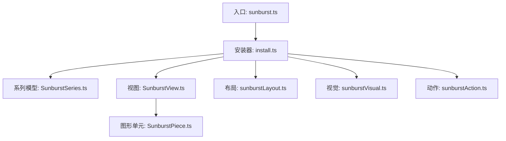
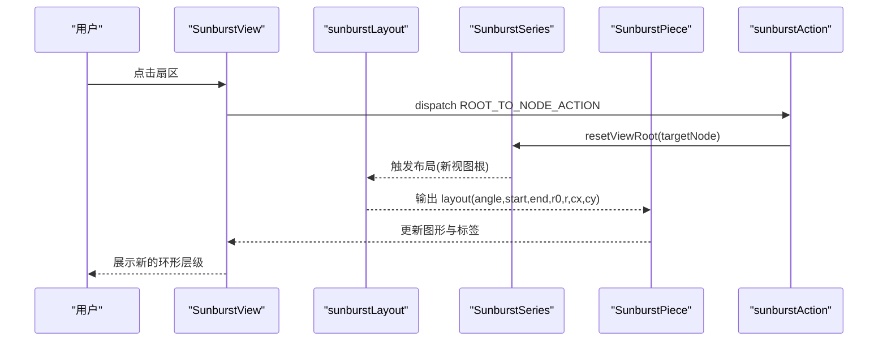
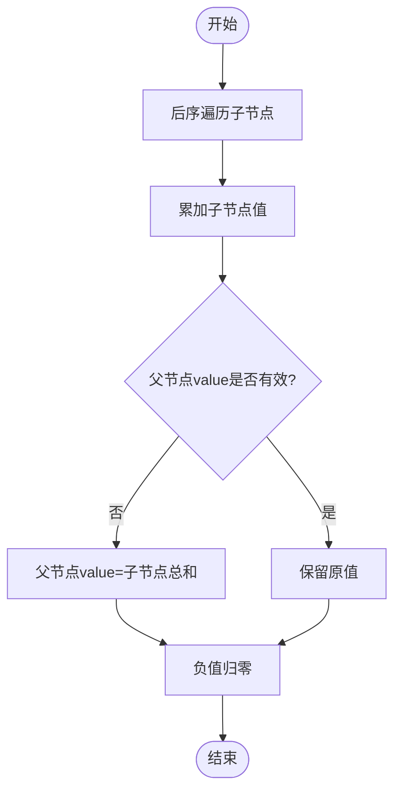
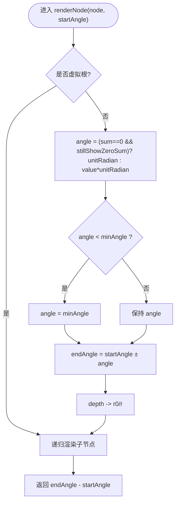
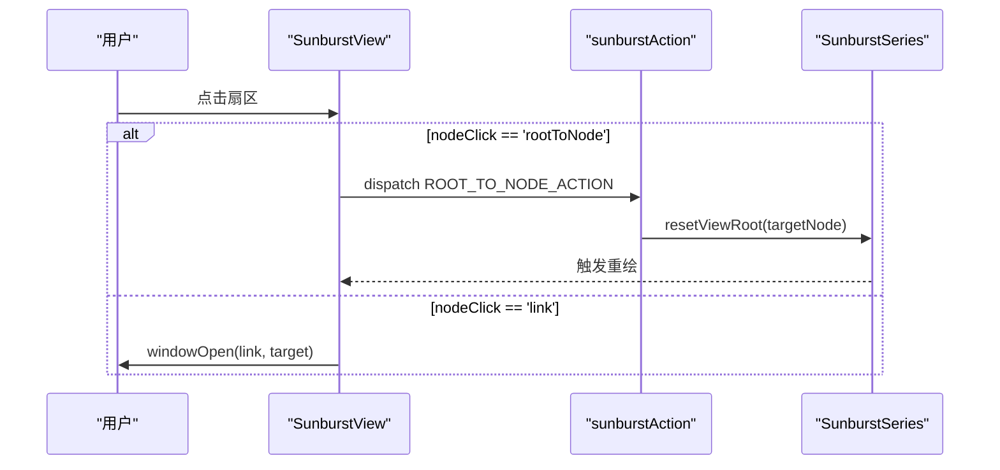
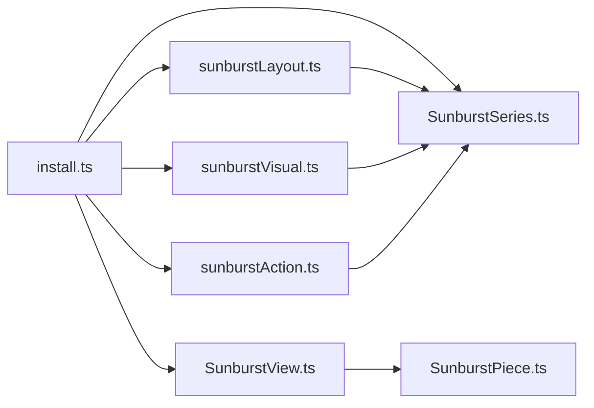

# 旭日图 (Sunburst)

<cite>
**本文引用的文件**
- [src/chart/sunburst.ts](file://src/chart/sunburst.ts)
- [src/chart/sunburst/install.ts](file://src/chart/sunburst/install.ts)
- [src/chart/sunburst/SunburstSeries.ts](file://src/chart/sunburst/SunburstSeries.ts)
- [src/chart/sunburst/sunburstLayout.ts](file://src/chart/sunburst/sunburstLayout.ts)
- [src/chart/sunburst/SunburstView.ts](file://src/chart/sunburst/SunburstView.ts)
- [src/chart/sunburst/SunburstPiece.ts](file://src/chart/sunburst/SunburstPiece.ts)
- [src/chart/sunburst/sunburstAction.ts](file://src/chart/sunburst/sunburstAction.ts)
- [src/chart/sunburst/sunburstVisual.ts](file://src/chart/sunburst/sunburstVisual.ts)
- [test/sunburst.html](file://test/sunburst.html)
- [test/sunburst-simple.html](file://test/sunburst-simple.html)
</cite>

## 目录
1. [简介](#简介)
2. [项目结构](#项目结构)
3. [核心组件](#核心组件)
4. [架构总览](#架构总览)
5. [详细组件分析](#详细组件分析)
6. [依赖关系分析](#依赖关系分析)
7. [性能考量](#性能考量)
8. [故障排查指南](#故障排查指南)
9. [结论](#结论)
10. [附录](#附录)

## 简介
本文件系统性解析 ECharts 旭日图的实现机制与视觉效果，覆盖数据结构、布局算法、交互能力、视觉配置、动画与示例用法，以及性能优化与常见问题解决方案。读者可据此理解从数据到渲染的完整链路，并掌握在业务场景中高效使用旭日图的方法。

## 项目结构
旭日图以“系列模型 + 视图 + 布局阶段 + 视觉阶段 + 动作”的分层方式组织：
- 入口注册：通过 install 将系列模型、视图、布局/视觉处理器和动作统一注册到 ECharts 扩展系统。
- 数据与模型：SunburstSeries 负责数据树构建、层级模型合并、默认选项与数值回填。
- 布局：sunburstLayout 计算扇形角度、半径区间、中心点等几何信息。
- 视图：SunburstView 管理图形节点的生命周期（增删改）与事件绑定。
- 图形元素：SunburstPiece 封装 Sector、Label 及状态样式更新。
- 视觉：sunburstVisual 提供颜色映射策略与层级明暗渐变。
- 动作：sunburstAction 处理钻取、高亮/淡化等交互行为。

**图示来源**
- [src/chart/sunburst.ts:20-23](file://src/chart/sunburst.ts#L20-L23)
- [src/chart/sunburst/install.ts:20-33](file://src/chart/sunburst/install.ts#L20-L33)

**章节来源**
- [src/chart/sunburst.ts:20-23](file://src/chart/sunburst.ts#L20-L23)
- [src/chart/sunburst/install.ts:20-33](file://src/chart/sunburst/install.ts#L20-L33)

## 核心组件
- 系列模型（SunburstSeries）
  - 职责：创建虚拟根节点、递归回填子节点值、维护 levels 层级模型、提供 getDataParams 附加 treePathInfo、重置视图根节点、启用无障碍描述。
  - 关键默认项：center、radius、clockwise、startAngle、minAngle、stillShowZeroSum、nodeClick、renderLabelForZeroData、label/itemStyle/emphasis/blur、animationType、sort。
- 布局（sunburstLayout）
  - 职责：根据 center/radius/clockwise/startAngle/minAngle 计算每个节点的 angle、startAngle、endAngle、cx、cy、r0、r；支持按 sort 排序；处理 stillShowZeroSum 的全局最小角分配。
- 视图（SunburstView）
  - 职责：基于 DataDiffer 对树节点进行增量更新；渲染“回卷”虚拟节点；绑定点击事件实现 rootToNode 钻取或 link 跳转；containPoint 用于命中检测。
- 图形单元（SunburstPiece）
  - 职责：继承 Sector，维护 label 文本与样式；根据布局与 itemStyle 计算圆角、填充、描边、阴影、decal；处理 emphasis/focus 的高亮范围；标签位置、对齐、旋转与翻转逻辑。
- 视觉（sunburstVisual）
  - 职责：为未显式设置 fill 的节点生成颜色；根节点中性色；一级子节点使用调色板；更深层级按比例提亮。
- 动作（sunburstAction）
  - 职责：注册 sunburstRootToNode（钻取/回卷）、sunburstHighlight/sunburstUnhighlight（兼容旧名，转发至 highlight/downplay）。

**章节来源**
- [src/chart/sunburst/SunburstSeries.ts:169-325](file://src/chart/sunburst/SunburstSeries.ts#L169-L325)
- [src/chart/sunburst/sunburstLayout.ts:33-183](file://src/chart/sunburst/sunburstLayout.ts#L33-L183)
- [src/chart/sunburst/SunburstView.ts:49-248](file://src/chart/sunburst/SunburstView.ts#L49-L248)
- [src/chart/sunburst/SunburstPiece.ts:46-161](file://src/chart/sunburst/SunburstPiece.ts#L46-L161)
- [src/chart/sunburst/sunburstVisual.ts:32-71](file://src/chart/sunburst/sunburstVisual.ts#L32-L71)
- [src/chart/sunburst/sunburstAction.ts:47-115](file://src/chart/sunburst/sunburstAction.ts#L47-L115)

## 架构总览
旭日图的数据流遵循 ECharts 的标准管线：数据进入 SeriesModel -> 布局阶段计算几何 -> 视觉阶段注入样式 -> View 渲染图形 -> 用户交互触发 Action -> 重新布局/渲染。

**图示来源**
- [src/chart/sunburst/SunburstView.ts:194-234](file://src/chart/sunburst/SunburstView.ts#L194-L234)
- [src/chart/sunburst/sunburstAction.ts:47-69](file://src/chart/sunburst/sunburstAction.ts#L47-L69)
- [src/chart/sunburst/sunburstLayout.ts:33-183](file://src/chart/sunburst/sunburstLayout.ts#L33-L183)
- [src/chart/sunburst/SunburstPiece.ts:72-161](file://src/chart/sunburst/SunburstPiece.ts#L72-L161)

## 详细组件分析

### 数据结构与数值计算
- 树结构与层级
  - 数据以嵌套 children 形式组织，SeriesModel 会创建一个虚拟根节点包裹顶层 data，并通过 Tree.createTree 构建内部树。
  - getLevelModel 根据节点 depth 选择对应 levels 配置，使不同层级可独立定制样式与半径。
- 数值回填
  - completeTreeValue 后序遍历树，若父节点 value 缺失或无效，则累加子节点 value；value 可为数组时取首项；负值归零。
- 视图根与钻取
  - getViewRoot/resetViewRoot 控制当前展示的“视图根”，配合 action 实现向下钻取或向上回卷。

**图示来源**
- [src/chart/sunburst/SunburstSeries.ts:329-361](file://src/chart/sunburst/SunburstSeries.ts#L329-L361)

**章节来源**
- [src/chart/sunburst/SunburstSeries.ts:179-224](file://src/chart/sunburst/SunburstSeries.ts#L179-L224)
- [src/chart/sunburst/SunburstSeries.ts:329-361](file://src/chart/sunburst/SunburstSeries.ts#L329-L361)

### 扇形布局算法与角度计算
- 基本参数
  - center、radius（内/外半径）、clockwise（方向）、startAngle（起始角）、minAngle（最小扇角）、stillShowZeroSum（全零时仍显示）。
- 角度计算
  - unitRadian = π / (sum || validDataCount) * 2；当 sum 为 0 且 stillShowZeroSum 为真时，每个节点至少获得 unitRadian 的角度。
  - 若 angle < minAngle，强制为 minAngle。
- 半径分层
  - rPerLevel = (r - r0) / levels；节点深度映射到 r0/r 区间；levels 可通过全局 radius 或各层级 level.radius 覆盖。
- 排序
  - sort 支持 'asc'/'desc' 或自定义比较函数；排序作用于每层的兄弟节点。

**图示来源**
- [src/chart/sunburst/sunburstLayout.ts:95-181](file://src/chart/sunburst/sunburstLayout.ts#L95-L181)
- [src/chart/sunburst/sunburstLayout.ts:188-239](file://src/chart/sunburst/sunburstLayout.ts#L188-L239)

**章节来源**
- [src/chart/sunburst/sunburstLayout.ts:33-183](file://src/chart/sunburst/sunburstLayout.ts#L33-L183)

### 交互功能：点击钻取、高亮、缩放
- 点击钻取
  - 视图监听 group 点击，定位目标 piece，依据 nodeClick 配置执行：
    - 'rootToNode'：派发 ROOT_TO_NODE_ACTION，重置视图根到目标节点，实现向下钻取；若目标在视图根之上，则为回卷。
    - 'link'：读取 link/target 打开链接。
  - 回卷虚拟节点：当存在视图根（非原始根）时，渲染一个覆盖整圆的虚拟节点，点击可回到其父节点。
- 高亮/淡化
  - emphasis.focus 支持 'descendant'/'ancestor'/'relative'/'self' 或索引列表；SunburstPiece 通过 toggleHoverEmphasis 应用高亮范围。
  - 动作层提供 sunburstHighlight/sunburstUnhighlight（已弃用提示），内部转发至通用 highlight/downplay。
- 缩放
  - 通过 series.radius 控制内外半径；levels 中可对每一层单独设置 radius/r/r0，实现多层环形缩放效果。

**图示来源**
- [src/chart/sunburst/SunburstView.ts:194-234](file://src/chart/sunburst/SunburstView.ts#L194-L234)
- [src/chart/sunburst/sunburstAction.ts:47-69](file://src/chart/sunburst/sunburstAction.ts#L47-L69)

**章节来源**
- [src/chart/sunburst/SunburstView.ts:157-234](file://src/chart/sunburst/SunburstView.ts#L157-L234)
- [src/chart/sunburst/SunburstPiece.ts:152-161](file://src/chart/sunburst/SunburstPiece.ts#L152-L161)
- [src/chart/sunburst/sunburstAction.ts:72-115](file://src/chart/sunburst/sunburstAction.ts#L72-L115)

### 视觉配置：颜色映射、标签、边距
- 颜色映射
  - 根节点使用中性色；一级子节点从调色板取值；更深层级按比例提亮（lift）。
  - 若节点未设置 fill，则由视觉阶段自动补全。
- 标签
  - 支持 rotate: 'radial'|'tangential'|number；position: 'inside'|'outside'；align/verticalAlign/distance；minAngle 控制小扇区隐藏标签。
  - 标签位置与旋转考虑上下翻转以保证可读性。
- 边框与圆角
  - itemStyle.borderWidth/borderColor/borderType/shadow*；getSectorCornerRadius 支持 inner/outer 圆角。
- 边距与尺寸
  - center 控制圆心；radius 控制内外半径；levels 可覆盖每层半径；minAngle 影响标签与扇区可见性。

**章节来源**
- [src/chart/sunburst/sunburstVisual.ts:32-71](file://src/chart/sunburst/sunburstVisual.ts#L32-L71)
- [src/chart/sunburst/SunburstPiece.ts:163-288](file://src/chart/sunburst/SunburstPiece.ts#L163-L288)
- [src/chart/sunburst/SunburstSeries.ts:226-302](file://src/chart/sunburst/SunburstSeries.ts#L226-L302)

### 动画与过渡
- animationType: 'expansion'|'scale'，控制展开/缩放动画。
- 首次创建时通过 initProps 从 r0 动画到 r；更新时使用 updateProps 平滑过渡形状变化。
- 渐变等不支持插值的样式会在更新时禁用动画以避免异常。

**章节来源**
- [src/chart/sunburst/SunburstPiece.ts:118-140](file://src/chart/sunburst/SunburstPiece.ts#L118-L140)
- [src/chart/sunburst/SunburstSeries.ts:283-286](file://src/chart/sunburst/SunburstSeries.ts#L283-L286)

### 完整示例参考
- 基础多层级环形数据与自定义样式、标签旋转、层级样式、动态数据更新等，可参考测试用例中的配置模式。
- 示例路径：
  - [test/sunburst.html](file://test/sunburst.html)
  - [test/sunburst-simple.html](file://test/sunburst-simple.html)

**章节来源**
- [test/sunburst.html:132-175](file://test/sunburst.html#L132-L175)
- [test/sunburst-simple.html:165-179](file://test/sunburst-simple.html#L165-L179)

## 依赖关系分析
- 模块耦合
  - install.ts 聚合注册所有子模块，降低外部耦合。
  - SunburstView 依赖 SunburstPiece、DataDiffer、Action；SunburstPiece 依赖 label 样式工具与 sectorHelper。
  - sunburstLayout 依赖 GlobalModel/ExtensionAPI 获取尺寸与配置。
  - sunburstVisual 依赖 tokens 与 color lift。
- 外部依赖
  - zrender 图形基元（Sector、Text、Path 等）。
  - ECharts 核心（SeriesModel、ChartView、GlobalModel、ExtensionAPI）。

**图示来源**
- [src/chart/sunburst/install.ts:20-33](file://src/chart/sunburst/install.ts#L20-L33)

**章节来源**
- [src/chart/sunburst/install.ts:20-33](file://src/chart/sunburst/install.ts#L20-L33)

## 性能考量
- 大数据量
  - 合理设置 minAngle 避免过多小扇区渲染；必要时关闭 renderLabelForZeroData。
  - 使用 sort 控制渲染顺序，减少不必要的重排。
- 动画与更新
  - 频繁 setOption 时尽量复用数据对象，利用 DataDiffer 的增量更新。
  - 避免对复杂渐变做高频动画更新。
- 标签与命中
  - 标签 minAngle 控制显示阈值，减少文本布局开销。
  - containPoint 仅做环形区域判断，命中检测成本低。
- 颜色与视觉
  - 优先使用调色板与层级提亮，减少手动颜色计算。

[本节为通用指导，不直接分析具体文件]

## 故障排查指南
- 扇区角度过小导致标签不可见
  - 调整 minAngle 或关闭标签显示；检查 stillShowZeroSum 在全零场景下的表现。
- 钻取无响应
  - 确认 nodeClick 配置为 'rootToNode' 或 'link'；检查是否存在有效的 link 地址。
- 高亮范围不符合预期
  - 检查 emphasis.focus 的值；'relative' 会包含祖先与后代，'descendant'/'ancestor' 分别限定方向。
- 颜色不正确
  - 若未设置 fill，将由视觉阶段自动生成；如需自定义，请在 itemStyle.fill 中指定。
- 动画闪烁或不生效
  - 渐变等不支持插值的样式在更新时会禁用动画；确保首次创建与更新的属性一致。

**章节来源**
- [src/chart/sunburst/sunburstLayout.ts:107-112](file://src/chart/sunburst/sunburstLayout.ts#L107-L112)
- [src/chart/sunburst/SunburstView.ts:194-234](file://src/chart/sunburst/SunburstView.ts#L194-L234)
- [src/chart/sunburst/SunburstPiece.ts:152-161](file://src/chart/sunburst/SunburstPiece.ts#L152-L161)
- [src/chart/sunburst/sunburstVisual.ts:60-70](file://src/chart/sunburst/sunburstVisual.ts#L60-L70)

## 结论
ECharts 旭日图通过清晰的模块化设计实现了从数据到可视化的完整链路：SeriesModel 负责数据与层级语义，Layout 精确计算扇形几何，Visual 提供智能配色，View 管理图形生命周期与交互，Action 驱动钻取与高亮。借助灵活的配置项与示例，可在时间序列、分类统计、资源占比等多种业务场景中高效呈现层级数据。

[本节为总结性内容，不直接分析具体文件]

## 附录
- 常用配置要点速查
  - 中心与半径：center、radius；levels[i].radius/r/r0
  - 角度与方向：startAngle、clockwise、minAngle、stillShowZeroSum
  - 标签：label.rotate/position/align/verticalAlign/distance/minAngle
  - 样式：itemStyle.borderWidth/borderColor/borderType/shadow*/opacity
  - 交互：nodeClick('rootToNode'|'link'|false)、emphasis.focus
  - 动画：animationType('expansion'|'scale')、animationDuration/Update
- 示例参考
  - 多层级环形数据与自定义样式：[test/sunburst.html](file://test/sunburst.html)
  - 简单示例与层级样式：[test/sunburst-simple.html](file://test/sunburst-simple.html)

[本节为补充说明，不直接分析具体文件]