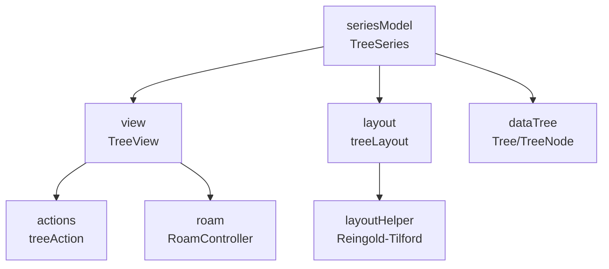
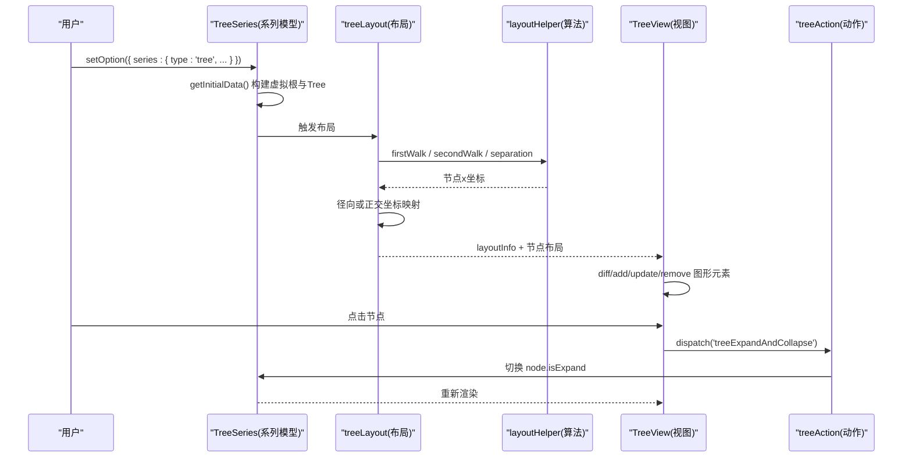
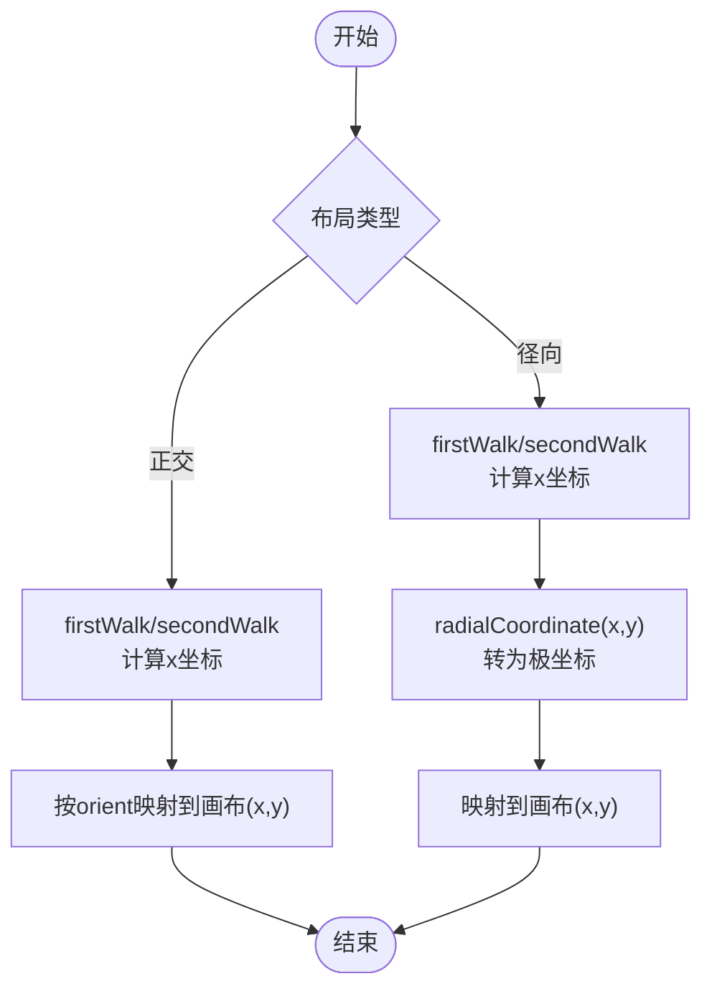
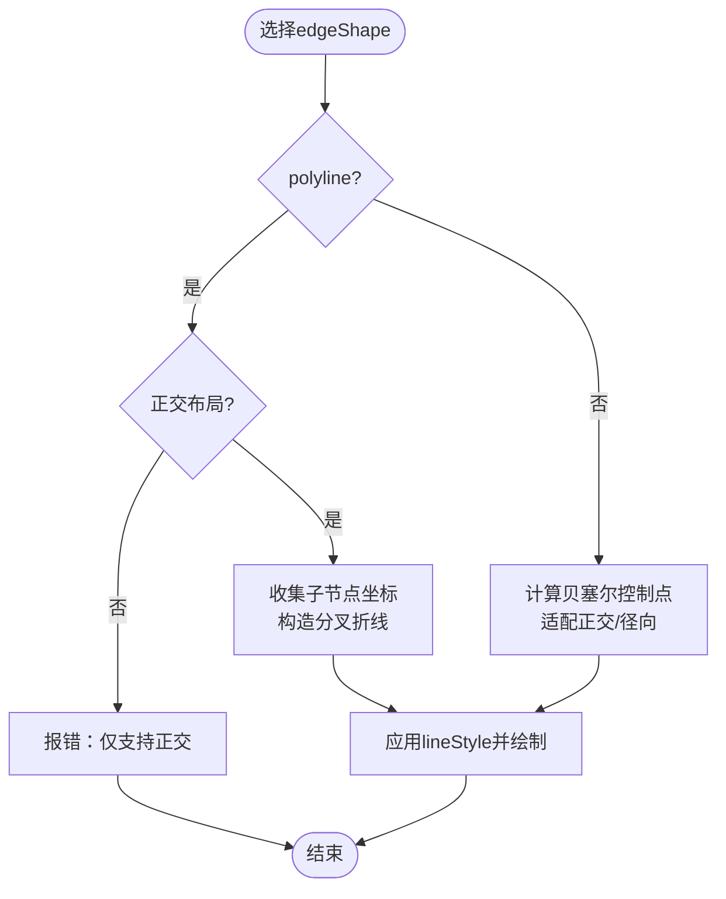
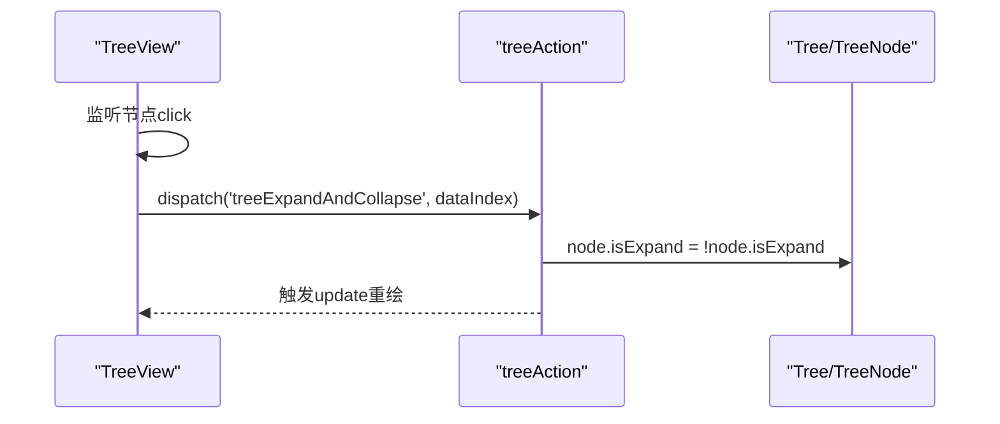
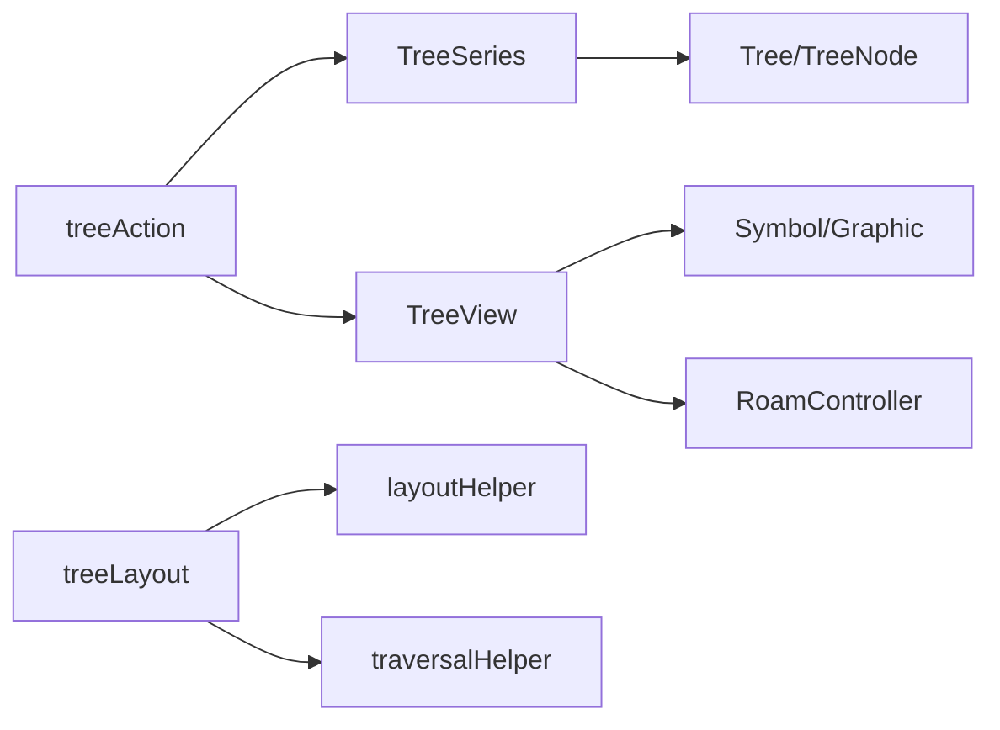

# 树形图（Tree）

<cite>
**本文引用的文件**
- [src/chart/tree.ts](file://src/chart/tree.ts)
- [src/chart/tree/TreeSeries.ts](file://src/chart/tree/TreeSeries.ts)
- [src/chart/tree/TreeView.ts](file://src/chart/tree/TreeView.ts)
- [src/chart/tree/treeLayout.ts](file://src/chart/tree/treeLayout.ts)
- [src/chart/tree/layoutHelper.ts](file://src/chart/tree/layoutHelper.ts)
- [src/chart/tree/traversalHelper.ts](file://src/chart/tree/traversalHelper.ts)
- [src/chart/tree/treeAction.ts](file://src/chart/tree/treeAction.ts)
- [src/data/Tree.ts](file://src/data/Tree.ts)
- [test/tree-basic.html](file://test/tree-basic.html)
- [test/tree-radial.html](file://test/tree-radial.html)
</cite>

## 目录
1. [简介](#简介)
2. [项目结构](#项目结构)
3. [核心组件](#核心组件)
4. [架构总览](#架构总览)
5. [详细组件分析](#详细组件分析)
6. [依赖关系分析](#依赖关系分析)
7. [性能与优化](#性能与优化)
8. [故障排查](#故障排查)
9. [结论](#结论)
10. [附录：使用示例与最佳实践](#附录使用示例与最佳实践)

## 简介
本章节系统性介绍 ECharts 树形图的完整实现与使用方法，涵盖数据结构设计、两种布局模式（正交与径向）、边线样式、节点展开折叠、初始深度控制、漫游交互、事件处理以及大数据量下的渲染优化策略。文档以源码为依据，提供可视化架构图与流程图，帮助读者快速掌握从配置到落地的全流程。

## 项目结构
ECharts 的树形图由“系列模型 + 视图 + 布局 + 数据树 + 动作”等模块协同完成：
- 系列模型：定义配置项、默认值、数据初始化与格式化
- 视图：负责图形元素创建、更新、动画与交互
- 布局：计算节点坐标（正交/径向），并映射到画布
- 数据树：维护节点关系、层级、可视状态（展开/折叠）
- 动作：处理展开/折叠与漫游等用户操作

图表来源
- [src/chart/tree/TreeSeries.ts:133-316](file://src/chart/tree/TreeSeries.ts#L133-L316)
- [src/chart/tree/TreeView.ts:133-317](file://src/chart/tree/TreeView.ts#L133-L317)
- [src/chart/tree/treeLayout.ts:39-135](file://src/chart/tree/treeLayout.ts#L39-L135)
- [src/chart/tree/layoutHelper.ts:57-162](file://src/chart/tree/layoutHelper.ts#L57-L162)
- [src/data/Tree.ts:321-470](file://src/data/Tree.ts#L321-L470)
- [src/chart/tree/treeAction.ts:29-47](file://src/chart/tree/treeAction.ts#L29-L47)

章节来源
- [src/chart/tree.ts:20-23](file://src/chart/tree.ts#L20-L23)
- [src/chart/tree/install.ts:27-33](file://src/chart/tree/install.ts#L27-L33)

## 核心组件
- TreeSeries（系列模型）
  - 负责解析 series.tree 配置，构建虚拟根节点，生成 Tree 数据，设置初始展开深度，提供 tooltip 格式化与回调参数增强（包含祖先路径与折叠状态）。
- TreeView（视图）
  - 负责创建节点符号、边线、处理 diff 更新、动画、hover 状态联动、点击触发展开/折叠、漫游缩放时保持节点尺寸一致。
- treeLayout（布局）
  - 基于 Reingold-Tilford 算法计算正交布局；在径向模式下将直角坐标转换为极坐标，并计算合适的半径与角度。
- layoutHelper（布局辅助）
  - 实现 firstWalk/secondWalk/apportion 等核心步骤，支持分离度函数与坐标转换。
- Tree/TreeNode（数据树）
  - 维护父子关系、层级、展开状态、可视 children/viewChildren、遍历、索引与视觉属性读写。
- treeAction（动作）
  - 注册“展开/折叠”与“漫游”动作，驱动数据与视图更新。

章节来源
- [src/chart/tree/TreeSeries.ts:153-245](file://src/chart/tree/TreeSeries.ts#L153-L245)
- [src/chart/tree/TreeView.ts:148-233](file://src/chart/tree/TreeView.ts#L148-L233)
- [src/chart/tree/treeLayout.ts:45-135](file://src/chart/tree/treeLayout.ts#L45-L135)
- [src/chart/tree/layoutHelper.ts:107-162](file://src/chart/tree/layoutHelper.ts#L107-L162)
- [src/data/Tree.ts:47-319](file://src/data/Tree.ts#L47-L319)
- [src/chart/tree/treeAction.ts:29-47](file://src/chart/tree/treeAction.ts#L29-L47)

## 架构总览
下图展示了树形图从配置到渲染的关键流程：系列模型初始化数据树 → 布局计算坐标 → 视图创建/更新图形元素 → 动作响应交互。

图表来源
- [src/chart/tree/TreeSeries.ts:153-197](file://src/chart/tree/TreeSeries.ts#L153-L197)
- [src/chart/tree/treeLayout.ts:45-135](file://src/chart/tree/treeLayout.ts#L45-L135)
- [src/chart/tree/layoutHelper.ts:107-162](file://src/chart/tree/layoutHelper.ts#L107-L162)
- [src/chart/tree/TreeView.ts:154-233](file://src/chart/tree/TreeView.ts#L154-L233)
- [src/chart/tree/treeAction.ts:29-47](file://src/chart/tree/treeAction.ts#L29-L47)

## 详细组件分析

### 数据结构与父子关系
- 节点数据格式
  - name/value/children/collapsed/link/target 等字段用于描述节点名称、数值、子节点、初始折叠状态及链接目标。
  - 叶子节点可通过 leaves 统一配置样式与标签。
- 父子关系与层级
  - Tree.createTree 递归构建 TreeNode，维护 parentNode/children，并通过 updateDepthAndHeight 计算 depth/height。
  - 通过 viewChildren/children 区分可见与全部子节点，便于折叠场景。
- 初始深度控制
  - initialTreeDepth 控制首次渲染展开层级；expandAndCollapse 控制是否允许交互展开/折叠。
- 折叠状态
  - node.isExpand 决定该节点是否展开；布局与绘制均依据此状态进行。

章节来源
- [src/chart/tree/TreeSeries.ts:67-118](file://src/chart/tree/TreeSeries.ts#L67-L118)
- [src/data/Tree.ts:47-76](file://src/data/Tree.ts#L47-L76)
- [src/data/Tree.ts:140-151](file://src/data/Tree.ts#L140-L151)
- [src/data/Tree.ts:416-470](file://src/data/Tree.ts#L416-L470)
- [src/chart/tree/TreeSeries.ts:176-197](file://src/chart/tree/TreeSeries.ts#L176-L197)

### 布局模式：正交与径向
- 正交布局（orthogonal）
  - 基于 Reingold-Tilford 算法，先计算初步 x 坐标，再修正偏移，最后根据 orient（LR/TB/RL/BT）映射到画布坐标。
  - 适合展示清晰的层级与流向，如组织架构图、文件系统树。
- 径向布局（radial）
  - 将正交计算的 (x, y) 通过 radialCoordinate 转换为极坐标，半径与角度分别对应层级与兄弟间距。
  - 适合环形展示、中心辐射型结构。

图表来源
- [src/chart/tree/treeLayout.ts:45-135](file://src/chart/tree/treeLayout.ts#L45-L135)
- [src/chart/tree/layoutHelper.ts:107-162](file://src/chart/tree/layoutHelper.ts#L107-L162)

章节来源
- [src/chart/tree/treeLayout.ts:45-135](file://src/chart/tree/treeLayout.ts#L45-L135)
- [src/chart/tree/layoutHelper.ts:154-162](file://src/chart/tree/layoutHelper.ts#L154-L162)

### 边线样式：折线与曲线
- edgeShape
  - polyline：仅支持正交布局，父节点到多个子节点的分叉折线，支持 edgeForkPosition 控制分叉位置。
  - curve：支持正交与径向，贝塞尔曲线连接父子节点，curveness 控制弯曲程度。
- 连线绘制逻辑
  - 曲线：根据源/目标布局计算控制点，适配不同方向与径向坐标。
  - 折线：收集所有子节点坐标，构造多段折线路径。

图表来源
- [src/chart/tree/TreeView.ts:480-559](file://src/chart/tree/TreeView.ts#L480-L559)
- [src/chart/tree/TreeView.ts:685-753](file://src/chart/tree/TreeView.ts#L685-L753)

章节来源
- [src/chart/tree/TreeSeries.ts:93-113](file://src/chart/tree/TreeSeries.ts#L93-L113)
- [src/chart/tree/TreeView.ts:480-559](file://src/chart/tree/TreeView.ts#L480-L559)
- [src/chart/tree/TreeView.ts:685-753](file://src/chart/tree/TreeView.ts#L685-L753)

### 节点展开/折叠与初始深度
- 展开/折叠
  - 点击节点触发 treeExpandAndCollapse 动作，切换 node.isExpand，随后重新布局与渲染。
  - 视图为每个节点绑定 click 事件，仅在 expandAndCollapse 开启时生效。
- 初始深度
  - initialTreeDepth 控制首次渲染展开层级；若未设置或为负数，则展开至最大深度。
  - 可在数据中通过 collapsed 字段对特定节点设置初始折叠状态。

图表来源
- [src/chart/tree/TreeView.ts:219-229](file://src/chart/tree/TreeView.ts#L219-L229)
- [src/chart/tree/treeAction.ts:29-47](file://src/chart/tree/treeAction.ts#L29-L47)
- [src/chart/tree/TreeSeries.ts:176-197](file://src/chart/tree/TreeSeries.ts#L176-L197)

章节来源
- [src/chart/tree/TreeView.ts:219-229](file://src/chart/tree/TreeView.ts#L219-L229)
- [src/chart/tree/treeAction.ts:29-47](file://src/chart/tree/treeAction.ts#L29-L47)
- [src/chart/tree/TreeSeries.ts:176-197](file://src/chart/tree/TreeSeries.ts#L176-L197)

### 漫游交互与缩放
- roam 支持平移与缩放；缩放时通过 calcCompensationScaleToPreserveNodeSize 保持节点大小不变。
- 视图内部维护 ViewCoordSys，并在 __updateOnOwnRoam 中应用变换与缩放补偿。

章节来源
- [src/chart/tree/TreeSeries.ts:247-249](file://src/chart/tree/TreeSeries.ts#L247-L249)
- [src/chart/tree/TreeView.ts:235-306](file://src/chart/tree/TreeView.ts#L235-L306)

### 标签与样式
- label
  - 支持 position、align、verticalAlign、rotate 等；径向布局下自动调整文本旋转与位置。
- itemStyle/lineStyle
  - 节点填充色、边框；边线颜色、宽度、曲率等。
- emphasis/focus
  - 支持 ancestor/descendant/relative 聚焦高亮，联动边线 hover 状态。

章节来源
- [src/chart/tree/TreeSeries.ts:251-316](file://src/chart/tree/TreeSeries.ts#L251-L316)
- [src/chart/tree/TreeView.ts:389-444](file://src/chart/tree/TreeView.ts#L389-L444)
- [src/chart/tree/TreeView.ts:446-477](file://src/chart/tree/TreeView.ts#L446-L477)

## 依赖关系分析
- TreeSeries 依赖 Tree 数据树与 Model，提供配置与数据初始化。
- TreeView 依赖 Symbol、graphic、RoamController 与布局结果，负责渲染与交互。
- treeLayout 依赖 layoutHelper 的算法实现与 traversalHelper 的遍历工具。
- treeAction 注册交互动作，驱动数据与视图更新。

图表来源
- [src/chart/tree/TreeSeries.ts:20-45](file://src/chart/tree/TreeSeries.ts#L20-L45)
- [src/chart/tree/TreeView.ts:20-45](file://src/chart/tree/TreeView.ts#L20-L45)
- [src/chart/tree/treeLayout.ts:20-35](file://src/chart/tree/treeLayout.ts#L20-L35)
- [src/chart/tree/treeAction.ts:20-24](file://src/chart/tree/treeAction.ts#L20-L24)

章节来源
- [src/chart/tree/TreeSeries.ts:20-45](file://src/chart/tree/TreeSeries.ts#L20-L45)
- [src/chart/tree/TreeView.ts:20-45](file://src/chart/tree/TreeView.ts#L20-L45)
- [src/chart/tree/treeLayout.ts:20-35](file://src/chart/tree/treeLayout.ts#L20-L35)
- [src/chart/tree/treeAction.ts:20-24](file://src/chart/tree/treeAction.ts#L20-L24)

## 性能与优化
- 大数据量渲染
  - 使用 diff 机制增量更新图形元素，避免全量重建。
  - 合理设置 initialTreeDepth 限制初始渲染规模。
  - 启用 roam 并结合缩放补偿，保证大尺度下的可读性。
- 内存管理
  - 移除节点时同步清理边线与图形元素引用，防止内存泄漏。
  - 折叠隐藏的子节点不创建图形元素，减少内存占用。
- 布局优化
  - 分离度函数可根据业务调整节点间距，降低重叠与拥挤。
  - 径向布局下，利用 rawX/rawY 保留中间坐标，提升曲线计算效率。
- 动画与交互
  - 使用 animationDurationUpdate 控制更新动画时长，平衡流畅性与性能。
  - 避免频繁 setOption 导致重排，批量更新数据后再一次性渲染。

[本节为通用指导，不直接分析具体文件]

## 故障排查
- 折线边在径向布局报错
  - 现象：在径向布局下设置 edgeShape='polyline' 会抛出错误。
  - 原因：折线边仅支持正交布局。
  - 解决：改用 curve 或在正交布局中使用 polyline。
- 根节点折叠后漫游消失
  - 现象：折叠根节点后进行漫游，根节点不可见。
  - 原因：未保存最小/最大边界导致坐标系异常。
  - 解决：视图在计算 min/max 时做了兜底处理，确保至少保留单位范围。
- 节点尺寸随缩放变化
  - 现象：缩放后节点变大/变小。
  - 原因：未应用节点尺寸补偿。
  - 解决：视图在漫游缩放时调用 calcCompensationScaleToPreserveNodeSize 保持节点大小。

章节来源
- [src/chart/tree/TreeView.ts:252-297](file://src/chart/tree/TreeView.ts#L252-L297)
- [src/chart/tree/TreeView.ts:541-545](file://src/chart/tree/TreeView.ts#L541-L545)
- [src/chart/tree/TreeView.ts:299-306](file://src/chart/tree/TreeView.ts#L299-L306)

## 结论
ECharts 树形图通过清晰的分层架构实现了强大的树结构可视化能力：以 Tree 数据模型为核心，配合 Reingold-Tilford 布局算法与灵活的视图渲染，支持正交与径向两种布局、丰富的边线样式、完善的展开/折叠与漫游交互。通过合理的初始深度控制、增量更新与内存清理策略，能够在大数据量场景下保持良好性能。结合标签与样式配置，可快速构建复杂且美观的树形图。

## 附录：使用示例与最佳实践
- 基础示例
  - 参考测试用例中的基础树形图与径向树形图，了解基本配置与交互。
- 自定义节点与标签
  - 通过 itemStyle/label/leaves 配置节点外观与标签位置、对齐方式与旋转。
- 事件处理
  - 使用 tooltip 的 formatter 获取 treeAncestors 与 collapsed 状态，展示路径与折叠信息。
- 性能建议
  - 大数据集建议设置 initialTreeDepth，按需展开；避免过多同时展开深层级。
  - 使用 roam 进行探索，结合缩放补偿保持节点一致性。

章节来源
- [test/tree-basic.html:57-126](file://test/tree-basic.html#L57-L126)
- [test/tree-radial.html:45-72](file://test/tree-radial.html#L45-L72)
- [src/chart/tree/TreeSeries.ts:214-245](file://src/chart/tree/TreeSeries.ts#L214-L245)