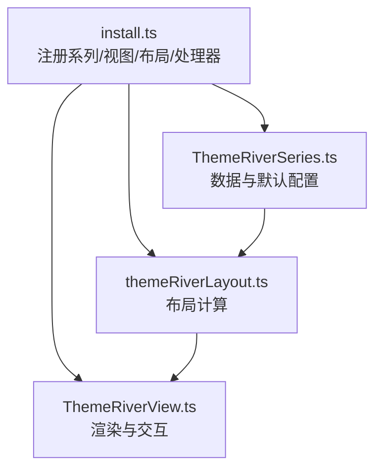
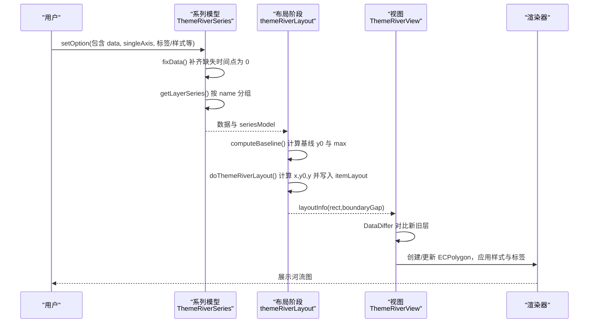
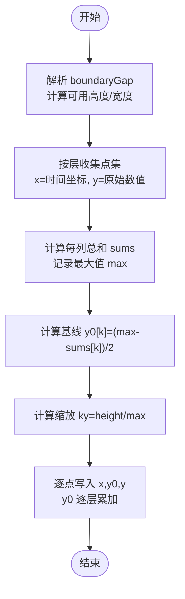
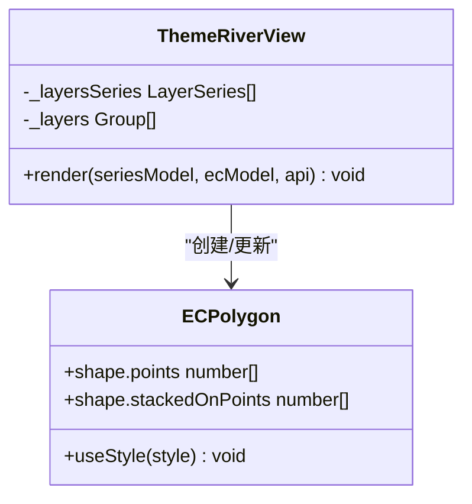
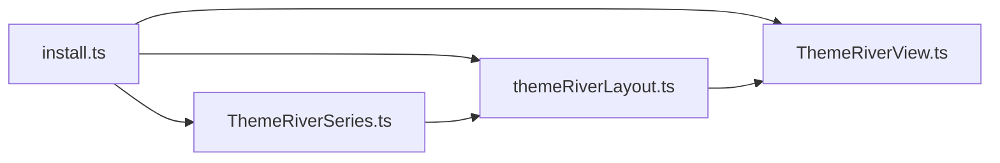

# 河流图 (ThemeRiver)

<cite>
**本文引用的文件**
- [src/chart/themeRiver.ts](file://src/chart/themeRiver.ts)
- [src/chart/themeRiver/install.ts](file://src/chart/themeRiver/install.ts)
- [src/chart/themeRiver/ThemeRiverSeries.ts](file://src/chart/themeRiver/ThemeRiverSeries.ts)
- [src/chart/themeRiver/ThemeRiverView.ts](file://src/chart/themeRiver/ThemeRiverView.ts)
- [src/chart/themeRiver/themeRiverLayout.ts](file://src/chart/themeRiver/themeRiverLayout.ts)
- [test/themeRiver.html](file://test/themeRiver.html)
- [test/themeRiver2.html](file://test/themeRiver2.html)
- [test/themeRiver3.html](file://test/themeRiver3.html)
</cite>

## 目录
1. [简介](#简介)
2. [项目结构](#项目结构)
3. [核心组件](#核心组件)
4. [架构总览](#架构总览)
5. [详细组件分析](#详细组件分析)
6. [依赖关系分析](#依赖关系分析)
7. [性能考虑](#性能考虑)
8. [故障排查指南](#故障排查指南)
9. [结论](#结论)
10. [附录](#附录)

## 简介
本文件系统性介绍 ECharts 中“河流图（ThemeRiver）”的实现原理与使用方法。内容涵盖：数据格式要求（时间序列与主题维度）、布局算法（区域宽度计算与堆叠效果）、视觉配置（颜色、线条样式、标签格式化）、完整示例（含动态更新与交互）、业务应用场景，以及与其他图表的组合方式、性能优化建议与浏览器兼容性考量。

## 项目结构
河流图在源码中以“系列模型 + 视图 + 布局阶段 + 安装器”的模块化形式组织：
- 入口注册：通过 install.ts 将系列模型、视图、布局处理器和数据处理处理器注册到 ECharts 扩展系统。
- 系列模型：定义数据维度、默认选项、数据修复与分层逻辑。
- 视图：基于多边形绘制各层带状区域，并处理标签与动画裁剪。
- 布局：计算每个数据点的坐标、堆叠基线与缩放比例，输出到 SeriesData 的 layout 信息供视图渲染。

图示来源
- [src/chart/themeRiver/install.ts:25-31](file://src/chart/themeRiver/install.ts#L25-L31)
- [src/chart/themeRiver/ThemeRiverSeries.ts:83-328](file://src/chart/themeRiver/ThemeRiverSeries.ts#L83-L328)
- [src/chart/themeRiver/ThemeRiverView.ts:36-176](file://src/chart/themeRiver/ThemeRiverView.ts#L36-L176)
- [src/chart/themeRiver/themeRiverLayout.ts:36-71](file://src/chart/themeRiver/themeRiverLayout.ts#L36-L71)

章节来源
- [src/chart/themeRiver/install.ts:25-31](file://src/chart/themeRiver/install.ts#L25-L31)
- [src/chart/themeRiver/ThemeRiverSeries.ts:83-328](file://src/chart/themeRiver/ThemeRiverSeries.ts#L83-L328)
- [src/chart/themeRiver/ThemeRiverView.ts:36-176](file://src/chart/themeRiver/ThemeRiverView.ts#L36-L176)
- [src/chart/themeRiver/themeRiverLayout.ts:36-71](file://src/chart/themeRiver/themeRiverLayout.ts#L36-L71)

## 核心组件
- 系列模型（ThemeRiverSeriesModel）
  - 负责数据维度声明（时间、数值、名称）、数据修复（补齐缺失时间点为 0）、按主题名称分组形成多层、生成 tooltip 内容与最近点查找。
  - 提供默认选项：坐标系 singleAxis、边界留白 boundaryGap、标签显示与位置、强调态等。
- 视图（ThemeRiverView）
  - 使用多边形（ECPolygon）绘制每层的上下边界，支持平滑曲线；根据布局信息设置标签位置；支持入场动画裁剪。
- 布局（themeRiverLayout）
  - 依据 singleAxis 方向计算可用高度或宽度，计算各层基线 y0 与最大堆叠值，得到缩放系数 ky，并将每个数据点的 x、y0、y 写入 SeriesData 的 itemLayout。
- 安装器（install.ts）
  - 注册系列模型、视图、布局阶段处理器和数据过滤处理器，使河流图参与 ECharts 整体生命周期。

章节来源
- [src/chart/themeRiver/ThemeRiverSeries.ts:96-216](file://src/chart/themeRiver/ThemeRiverSeries.ts#L96-L216)
- [src/chart/themeRiver/ThemeRiverView.ts:44-176](file://src/chart/themeRiver/ThemeRiverView.ts#L44-L176)
- [src/chart/themeRiver/themeRiverLayout.ts:36-173](file://src/chart/themeRiver/themeRiverLayout.ts#L36-L173)
- [src/chart/themeRiver/install.ts:25-31](file://src/chart/themeRiver/install.ts#L25-L31)

## 架构总览
河流图的数据流与渲染流程如下：

图示来源
- [src/chart/themeRiver/ThemeRiverSeries.ts:114-252](file://src/chart/themeRiver/ThemeRiverSeries.ts#L114-L252)
- [src/chart/themeRiver/themeRiverLayout.ts:81-173](file://src/chart/themeRiver/themeRiverLayout.ts#L81-L173)
- [src/chart/themeRiver/ThemeRiverView.ts:44-176](file://src/chart/themeRiver/ThemeRiverView.ts#L44-L176)

## 详细组件分析

### 数据格式与预处理
- 数据项结构：[时间, 数值, 名称]
  - 时间：由 singleAxis 类型决定（如 time），用于横轴定位。
  - 数值：非负浮点数，表示该主题在该时间点的厚度。
  - 名称：主题维度标识，用于分组与图例。
- 数据修复：若某主题在某时间点缺失，将被补入值为 0 的记录，保证所有主题在同一时间点都有占位，便于堆叠对齐。
- 维度声明：
  - 单轴维度：single（映射到 singleAxis）。
  - 数值维度：value（float）。
  - 名称维度：name（ordinal）。
- 最近点查找：tooltip 触发时，对每一层找到离当前时间最近的索引，以构建提示内容。

章节来源
- [src/chart/themeRiver/ThemeRiverSeries.ts:114-216](file://src/chart/themeRiver/ThemeRiverSeries.ts#L114-L216)
- [src/chart/themeRiver/ThemeRiverSeries.ts:257-297](file://src/chart/themeRiver/ThemeRiverSeries.ts#L257-L297)

### 布局算法与堆叠实现
- 边界留白：boundaryGap 在正交方向上占用空间，百分比解析后从可用尺寸中扣除。
- 基线计算：
  - 对各时间点求各层数值之和 sums。
  - 计算 y0[k] = (max - sums[k]) / 2，使堆叠图形在垂直方向居中。
  - 重新计算新的 max，用于后续缩放。
- 缩放因子：ky = height / base.max，将原始数值映射到像素高度。
- 逐点布局：
  - 第一层：y0 = baseLine * ky，y = value * ky。
  - 后续层：y0 累加上前一层的厚度，y 仍为该层 value * ky。
  - 最终写入每个数据项的 itemLayout：{x, y0, y, layerIndex}。

图示来源
- [src/chart/themeRiver/themeRiverLayout.ts:57-71](file://src/chart/themeRiver/themeRiverLayout.ts#L57-L71)
- [src/chart/themeRiver/themeRiverLayout.ts:81-130](file://src/chart/themeRiver/themeRiverLayout.ts#L81-L130)
- [src/chart/themeRiver/themeRiverLayout.ts:138-173](file://src/chart/themeRiver/themeRiverLayout.ts#L138-L173)

章节来源
- [src/chart/themeRiver/themeRiverLayout.ts:57-173](file://src/chart/themeRiver/themeRiverLayout.ts#L57-L173)

### 渲染与交互
- 多边形绘制：使用 ECPolygon 的 points（上边界）与 stackedOnPoints（下边界）绘制带状区域，支持平滑参数。
- 标签：取每层最后一个点的布局位置，将标签置于左边缘附近，垂直居中对齐。
- 动画：首次渲染时添加矩形裁剪路径，实现从左到右的入场动画。
- 交互：支持 emphasis 高亮、hover 聚焦策略；tooltip 按 axis 触发，显示名称与数值。

图示来源
- [src/chart/themeRiver/ThemeRiverView.ts:44-176](file://src/chart/themeRiver/ThemeRiverView.ts#L44-L176)

章节来源
- [src/chart/themeRiver/ThemeRiverView.ts:44-176](file://src/chart/themeRiver/ThemeRiverView.ts#L44-L176)

### 视觉配置选项
- 坐标系：coordinateSystem 固定为 singleAxis。
- 边界留白：boundaryGap 控制正交方向的留白（百分比或数值）。
- 颜色：colorBy 默认为 data，可通过 color 数组指定主题色。
- 标签：label.show、position、fontSize、margin 等；emphasis.label 可控制高亮时的标签显示。
- 强调态：itemStyle.emphasis.shadowBlur/shadowColor 等。
- 单轴：singleAxis.type 可为 time，splitLine、axisTick、axisLabel 等均可配置。

章节来源
- [src/chart/themeRiver/ThemeRiverSeries.ts:299-328](file://src/chart/themeRiver/ThemeRiverSeries.ts#L299-L328)
- [test/themeRiver.html:51-134](file://test/themeRiver.html#L51-L134)
- [test/themeRiver3.html:51-128](file://test/themeRiver3.html#L51-L128)

### 完整示例与用法
- 基础示例：使用 time 类型的 singleAxis，数据为 [时间, 数值, 名称] 三元组，开启 tooltip 与 legend。
- 二维矩阵转三维：将行作为主题、列作为时间点，展开为三元组列表。
- 稀疏数据：即使某些时间点缺失，内部会补齐为 0，确保堆叠连续。

参考示例文件：
- [test/themeRiver.html](file://test/themeRiver.html)
- [test/themeRiver2.html](file://test/themeRiver2.html)
- [test/themeRiver3.html](file://test/themeRiver3.html)

章节来源
- [test/themeRiver.html:51-134](file://test/themeRiver.html#L51-L134)
- [test/themeRiver2.html:102-127](file://test/themeRiver2.html#L102-L127)
- [test/themeRiver3.html:51-128](file://test/themeRiver3.html#L51-L128)

### 业务场景与组合使用
- 趋势分析与对比展示：适合展示多个主题随时间的相对占比变化，突出峰值与低谷。
- 组合图表：可与 dataZoom（时间范围筛选）、timeline（时间轴播放）、visualMap（按数值映射颜色）等组件配合，增强探索性分析。
- 联动：结合 tooltip.axisPointer 与 brush 选择区间，进行局部放大与细节观察。

（本节为概念性说明，不直接引用具体代码文件）

## 依赖关系分析
- 模块耦合：
  - install.ts 依赖系列模型、视图与布局处理器，完成注册。
  - ThemeRiverSeries 依赖 SingleAxis 与数据工具，负责数据准备与维度映射。
  - themeRiverLayout 依赖全局模型与扩展 API，计算布局并写回 SeriesData。
  - ThemeRiverView 依赖图形库与状态管理，负责绘制与交互。
- 外部依赖：
  - zrender 图形元素（ECPolygon、Rect、Group）。
  - ECharts 核心（GlobalModel、ExtensionAPI、SeriesData、SingleAxis）。

图示来源
- [src/chart/themeRiver/install.ts:25-31](file://src/chart/themeRiver/install.ts#L25-L31)
- [src/chart/themeRiver/ThemeRiverSeries.ts:83-216](file://src/chart/themeRiver/ThemeRiverSeries.ts#L83-L216)
- [src/chart/themeRiver/themeRiverLayout.ts:36-71](file://src/chart/themeRiver/themeRiverLayout.ts#L36-L71)
- [src/chart/themeRiver/ThemeRiverView.ts:36-176](file://src/chart/themeRiver/ThemeRiverView.ts#L36-L176)

章节来源
- [src/chart/themeRiver/install.ts:25-31](file://src/chart/themeRiver/install.ts#L25-L31)
- [src/chart/themeRiver/ThemeRiverSeries.ts:83-216](file://src/chart/themeRiver/ThemeRiverSeries.ts#L83-L216)
- [src/chart/themeRiver/themeRiverLayout.ts:36-71](file://src/chart/themeRiver/themeRiverLayout.ts#L36-L71)
- [src/chart/themeRiver/ThemeRiverView.ts:36-176](file://src/chart/themeRiver/ThemeRiverView.ts#L36-L176)

## 性能考虑
- 数据规模：当主题数量或时间点较多时，建议启用 large 模式（如适用）或使用 dataZoom 限制可视范围，减少渲染压力。
- 动画裁剪：首次渲染使用 clipPath 提升体验，但大量数据时应谨慎开启复杂动画。
- 标签密度：过多标签会导致文本测量与碰撞开销增大，可在 label 中按需隐藏或在大数据时关闭。
- 内存与重绘：避免频繁 setOption 全量替换，优先使用 appendData 或增量更新；必要时合并多次更新。
- 浏览器兼容：Canvas 与 SVG 渲染均受浏览器版本影响，建议在目标环境做兼容性测试；移动端注意触摸事件与性能。

（本节为通用指导，不直接引用具体代码文件）

## 故障排查指南
- 数据缺失导致断带：确认是否已正确传入名称维度；若存在缺失时间点，内部会补齐为 0，但仍需确保名称一致。
- 堆叠异常：检查数值是否为非负数；负值可能破坏堆叠基线计算。
- 标签不显示：确认 label.show 与 margin 设置；检查布局后的 textLayout 是否存在。
- 动画异常：若 clipPath 未移除或尺寸计算错误，可能导致动画闪烁；检查视图动画裁剪逻辑。
- 交互无响应：确认 tooltip.trigger 与 axis 类型匹配；检查 singleAxis 的 orient 与 boundaryGap 是否合理。

章节来源
- [src/chart/themeRiver/ThemeRiverSeries.ts:114-216](file://src/chart/themeRiver/ThemeRiverSeries.ts#L114-L216)
- [src/chart/themeRiver/ThemeRiverView.ts:119-176](file://src/chart/themeRiver/ThemeRiverView.ts#L119-L176)
- [src/chart/themeRiver/themeRiverLayout.ts:57-130](file://src/chart/themeRiver/themeRiverLayout.ts#L57-L130)

## 结论
河流图通过“数据修复 + 基线居中 + 堆叠缩放”的布局策略，将多维时间序列转化为直观的带状可视化。其模块化设计使得数据、布局与渲染职责清晰，易于扩展与定制。在实际应用中，结合单轴、数据缩放与视觉映射，可实现丰富的趋势与对比分析场景。

## 附录
- 快速上手要点
  - 配置 singleAxis.type 为 time，并设置 splitLine/axisLabel 等。
  - 数据格式为 [时间, 数值, 名称] 三元组。
  - 使用 tooltip.trigger='axis' 获得时间轴式提示。
  - 通过 label.margin 调整标签与边界的距离。
- 相关示例
  - [test/themeRiver.html](file://test/themeRiver.html)
  - [test/themeRiver2.html](file://test/themeRiver2.html)
  - [test/themeRiver3.html](file://test/themeRiver3.html)