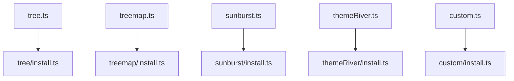
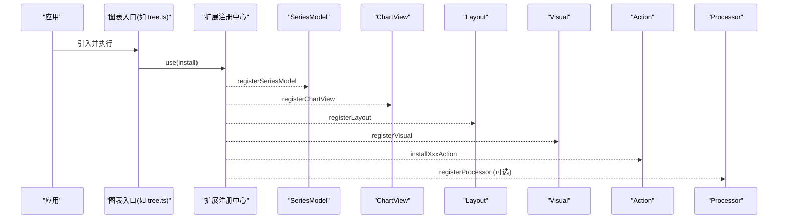
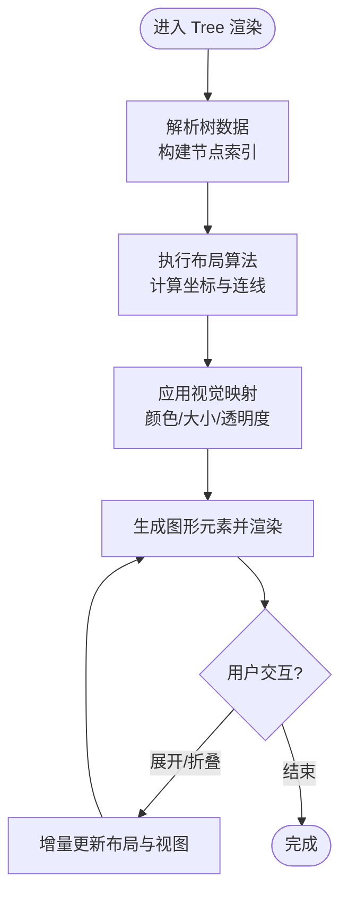
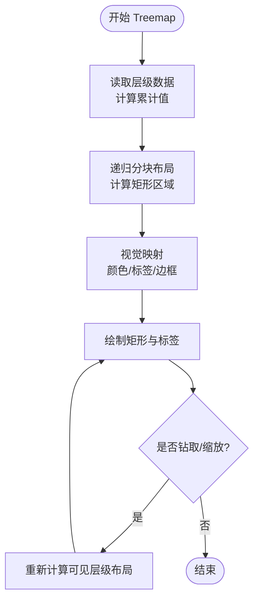
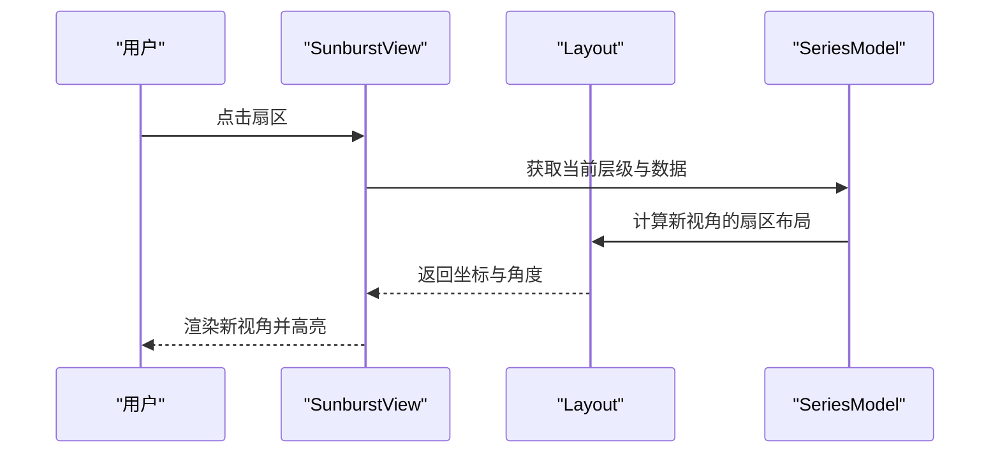
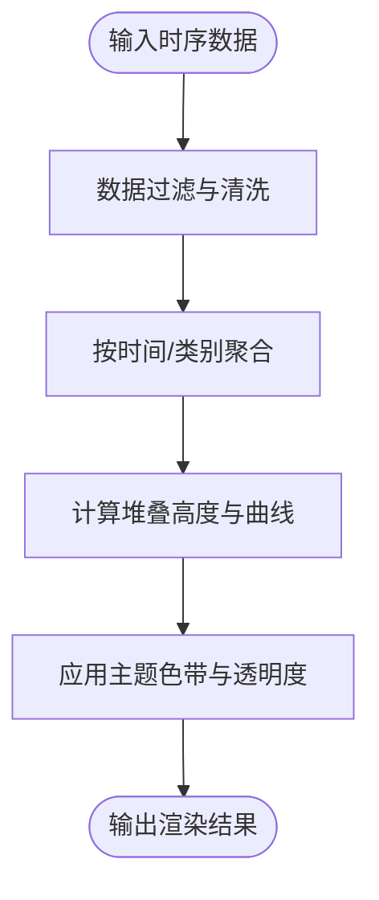
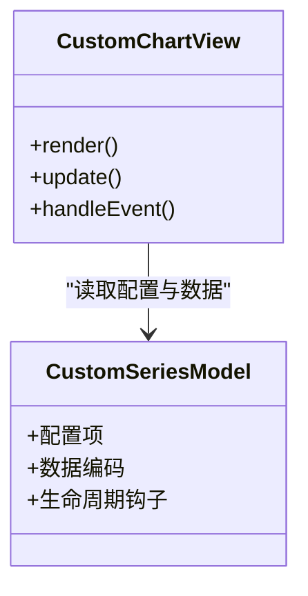
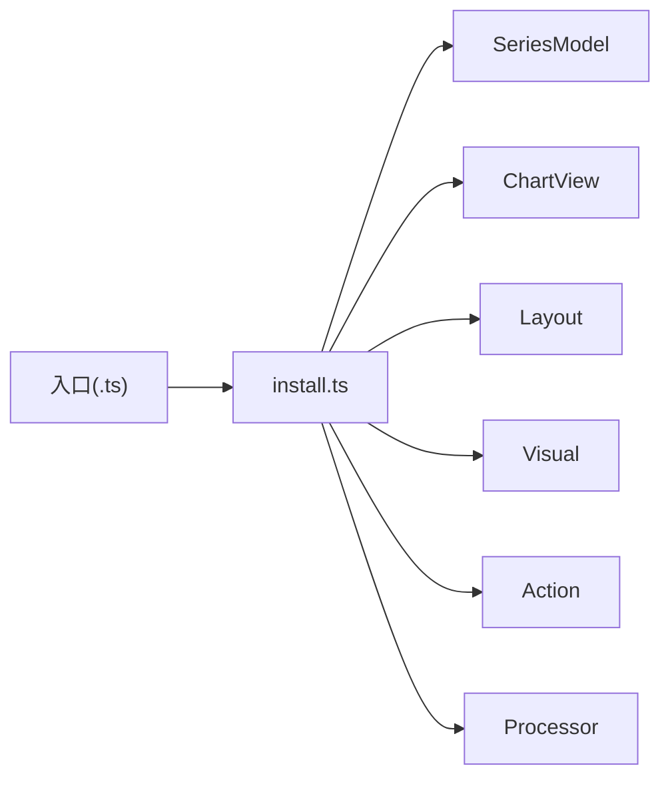

# 特殊图表

<cite>
**本文引用的文件**
- [src/chart/tree.ts](file://src/chart/tree.ts)
- [src/chart/treemap.ts](file://src/chart/treemap.ts)
- [src/chart/sunburst.ts](file://src/chart/sunburst.ts)
- [src/chart/themeRiver.ts](file://src/chart/themeRiver.ts)
- [src/chart/custom.ts](file://src/chart/custom.ts)
- [src/chart/tree/install.ts](file://src/chart/tree/install.ts)
- [src/chart/treemap/install.ts](file://src/chart/treemap/install.ts)
- [src/chart/sunburst/install.ts](file://src/chart/sunburst/install.ts)
- [src/chart/themeRiver/install.ts](file://src/chart/themeRiver/install.ts)
- [src/chart/custom/install.ts](file://src/chart/custom/install.ts)
</cite>

## 目录
1. [简介](#简介)
2. [项目结构](#项目结构)
3. [核心组件](#核心组件)
4. [架构总览](#架构总览)
5. [详细组件分析](#详细组件分析)
6. [依赖关系分析](#依赖关系分析)
7. [性能考量](#性能考量)
8. [故障排查指南](#故障排查指南)
9. [结论](#结论)
10. [附录](#附录)

## 简介
本章节面向需要展示复杂层级数据与流向数据的业务场景，系统介绍 ECharts 的特殊图表类型：树形图、矩形树图、旭日图、河流图以及自定义图表。内容涵盖应用场景、数据结构设计、布局算法要点、视觉效果定制、扩展机制、性能优化策略与内存管理建议，并提供与实际业务结合的完整实现思路与参考路径。

## 项目结构
ECharts 将每种图表以“入口注册 + 安装器”的方式组织：
- 顶层入口文件负责通过扩展机制加载对应图表的 install 模块。
- install 模块统一注册 SeriesModel、ChartView、Layout、Visual、Action、Processor 等能力。
- 各图表的具体实现位于各自子目录中（如 tree、treemap、sunburst、themeRiver、custom）。

图示来源
- [src/chart/tree.ts:20-23](file://src/chart/tree.ts#L20-L23)
- [src/chart/treemap.ts:20-23](file://src/chart/treemap.ts#L20-L23)
- [src/chart/sunburst.ts:20-23](file://src/chart/sunburst.ts#L20-L23)
- [src/chart/themeRiver.ts:20-23](file://src/chart/themeRiver.ts#L20-L23)
- [src/chart/custom.ts:20-24](file://src/chart/custom.ts#L20-L24)

章节来源
- [src/chart/tree.ts:20-23](file://src/chart/tree.ts#L20-L23)
- [src/chart/treemap.ts:20-23](file://src/chart/treemap.ts#L20-L23)
- [src/chart/sunburst.ts:20-23](file://src/chart/sunburst.ts#L20-L23)
- [src/chart/themeRiver.ts:20-23](file://src/chart/themeRiver.ts#L20-L23)
- [src/chart/custom.ts:20-24](file://src/chart/custom.ts#L20-L24)

## 核心组件
- 树形图（Tree）
  - 注册能力：SeriesModel、ChartView、Layout、Visual、Action。
  - 典型用途：组织架构、文件系统、知识图谱等层级结构可视化。
  - 关键能力：层级布局、展开/折叠交互、视觉映射、动画过渡。
- 矩形树图（Treemap）
  - 注册能力：SeriesModel、ChartView、Visual、Layout、Action。
  - 典型用途：磁盘占用、销售占比、预算分配等面积编码的层级数据。
  - 关键能力：分块布局、钻取导航、颜色/尺寸映射、标签自适应。
- 旭日图（Sunburst）
  - 注册能力：SeriesModel、ChartView、Layout、Visual、Action。
  - 典型用途：多层级分类占比、时间序列分层、产品族结构。
  - 关键能力：环形分块布局、径向/角度映射、高亮联动、交互导航。
- 河流图（Theme River）
  - 注册能力：SeriesModel、ChartView、Layout、Processor。
  - 典型用途：主题随时间演变的趋势对比、流量/声量变化。
  - 关键能力：时序堆叠流式渲染、主题色带、平滑曲线。
- 自定义图表（Custom）
  - 注册能力：SeriesModel、ChartView。
  - 典型用途：业务专属图形、非标准几何或复合图形。
  - 关键能力：自由绘制、事件透传、与坐标系/视觉系统协作。

章节来源
- [src/chart/tree/install.ts:27-34](file://src/chart/tree/install.ts#L27-L34)
- [src/chart/treemap/install.ts:28-35](file://src/chart/treemap/install.ts#L28-L35)
- [src/chart/sunburst/install.ts:27-33](file://src/chart/sunburst/install.ts#L27-L33)
- [src/chart/themeRiver/install.ts:25-32](file://src/chart/themeRiver/install.ts#L25-L32)
- [src/chart/custom/install.ts:24-27](file://src/chart/custom/install.ts#L24-L27)

## 架构总览
所有特殊图表遵循统一的扩展装配模式：入口文件通过 use 调用 install，install 再向注册中心登记模型、视图、布局、视觉、动作与处理器。这使得新增或替换某类图表的能力成为可插拔的模块化行为。

图示来源
- [src/chart/tree/install.ts:27-34](file://src/chart/tree/install.ts#L27-L34)
- [src/chart/treemap/install.ts:28-35](file://src/chart/treemap/install.ts#L28-L35)
- [src/chart/sunburst/install.ts:27-33](file://src/chart/sunburst/install.ts#L27-L33)
- [src/chart/themeRiver/install.ts:25-32](file://src/chart/themeRiver/install.ts#L25-L32)
- [src/chart/custom/install.ts:24-27](file://src/chart/custom/install.ts#L24-L27)

## 详细组件分析

### 树形图（Tree）
- 应用场景
  - 组织结构、目录结构、决策树、知识体系等层级关系的直观表达。
- 数据结构设计
  - 基于树形节点集合，支持父子关系、数值属性与样式属性；可通过预处理阶段进行扁平化与索引构建以提升交互效率。
- 布局算法
  - 提供多种布局策略（如层次方向、径向布局），在布局阶段计算节点坐标与连线形状，支持动态更新时的过渡动画。
- 视觉效果定制
  - 节点样式、边样式、标签位置与对齐、高亮与聚焦、展开/收起状态下的视觉反馈。
- 交互与扩展
  - 通过 Action 暴露展开/折叠、定位等操作；配合 Visual 阶段完成颜色、大小等视觉映射。
- 性能与内存
  - 大数据量时建议启用采样/聚合、按需渲染、减少不必要的重绘；合理设置层级深度与可视范围，避免一次性创建过多图形元素。

图示来源
- [src/chart/tree/install.ts:27-34](file://src/chart/tree/install.ts#L27-L34)

章节来源
- [src/chart/tree/install.ts:27-34](file://src/chart/tree/install.ts#L27-L34)

### 矩形树图（Treemap）
- 应用场景
  - 面积编码的层级占比分析，如磁盘使用、类目销售、预算分配等。
- 数据结构设计
  - 树形节点集合，每个节点具备值维度用于面积划分；支持多维统计与分组。
- 布局算法
  - 采用分块布局算法将父节点区域递归分割为子节点矩形，考虑留白、标签可读性与纵横比约束。
- 视觉效果定制
  - 颜色映射、边框与间距、标签显示策略、高亮与选中态。
- 交互与扩展
  - 支持钻取、缩放、搜索定位；通过 Action 驱动层级切换与视图更新。
- 性能与内存
  - 大量叶子节点时建议开启采样、限制最大渲染数量；合并相邻小矩形以减少绘制开销；利用视口裁剪降低不可见区域的计算。

图示来源
- [src/chart/treemap/install.ts:28-35](file://src/chart/treemap/install.ts#L28-L35)

章节来源
- [src/chart/treemap/install.ts:28-35](file://src/chart/treemap/install.ts#L28-L35)

### 旭日图（Sunburst）
- 应用场景
  - 多层级分类占比、时间序列分层、产品族结构等环形层级可视化。
- 数据结构设计
  - 树形节点集合，按层级映射到环半径与角度区间；支持数值权重与样式属性。
- 布局算法
  - 将根节点置于中心，逐层向外扩展为扇形环；根据权重分配角度，保持层级间比例一致。
- 视觉效果定制
  - 颜色渐变、内/外边界、标签旋转与对齐、高亮联动、聚焦放大。
- 交互与扩展
  - 点击钻取、双击返回上级、悬停高亮；通过 Action 控制导航与焦点。
- 性能与内存
  - 深层级与多分支时注意角度精度与绘制次数；对不可见扇区进行裁剪；合理使用动画时长与帧率。

图示来源
- [src/chart/sunburst/install.ts:27-33](file://src/chart/sunburst/install.ts#L27-L33)

章节来源
- [src/chart/sunburst/install.ts:27-33](file://src/chart/sunburst/install.ts#L27-L33)

### 河流图（Theme River）
- 应用场景
  - 主题随时间变化的趋势对比，如媒体声量、话题热度、流量构成等。
- 数据结构设计
  - 时间序列上的多类别堆叠数据，每行包含时间戳、类别与数值；支持缺失值处理与归一化。
- 布局算法
  - 在时间轴上按类别堆叠形成连续带状区域，采用平滑曲线连接关键点，保证视觉连贯性。
- 视觉效果定制
  - 主题色带、透明度、阴影、标签与提示框；支持多系列叠加与对比。
- 数据处理
  - 通过 Processor 对数据进行过滤、排序与聚合，确保时序一致性与可比性。
- 性能与内存
  - 大数据量下建议降采样、分段渲染；减少不必要的重绘与过度平滑；合理设置时间窗口与分辨率。

图示来源
- [src/chart/themeRiver/install.ts:25-32](file://src/chart/themeRiver/install.ts#L25-L32)

章节来源
- [src/chart/themeRiver/install.ts:25-32](file://src/chart/themeRiver/install.ts#L25-L32)

### 自定义图表（Custom）
- 应用场景
  - 业务专属图形、复合图形、非标准几何或跨领域可视化需求。
- 数据结构设计
  - 灵活的数据格式，通常由 SeriesModel 定义维度与编码规则；视图侧根据数据生成图形元素。
- 开发流程与扩展机制
  - 通过 install 注册自定义 SeriesModel 与 ChartView；在视图中实现绘制逻辑，并可复用坐标系、视觉映射与事件系统。
- 视觉效果定制
  - 完全可控的绘制管线，支持样式、动画、交互与工具链集成。
- 性能与内存
  - 避免在每次更新中重建大量对象；批量创建与复用图形元素；按需渲染与视口裁剪；谨慎使用复杂路径与滤镜。

图示来源
- [src/chart/custom/install.ts:24-27](file://src/chart/custom/install.ts#L24-L27)

章节来源
- [src/chart/custom/install.ts:24-27](file://src/chart/custom/install.ts#L24-L27)

## 依赖关系分析
- 耦合与内聚
  - 各图表通过 install 解耦地注册能力，SeriesModel 与 ChartView 职责清晰，布局与视觉阶段独立可替换。
- 直接/间接依赖
  - 入口文件仅依赖 install；install 依赖具体 Model/View/Layout/Visual/Action/Processor。
- 外部集成点
  - 扩展注册中心、坐标系、视觉映射、动画系统等通用能力被各图表复用。
- 循环依赖
  - 通过分层注册与延迟初始化避免循环引用。

图示来源
- [src/chart/tree/install.ts:27-34](file://src/chart/tree/install.ts#L27-L34)
- [src/chart/treemap/install.ts:28-35](file://src/chart/treemap/install.ts#L28-L35)
- [src/chart/sunburst/install.ts:27-33](file://src/chart/sunburst/install.ts#L27-L33)
- [src/chart/themeRiver/install.ts:25-32](file://src/chart/themeRiver/install.ts#L25-L32)
- [src/chart/custom/install.ts:24-27](file://src/chart/custom/install.ts#L24-L27)

章节来源
- [src/chart/tree/install.ts:27-34](file://src/chart/tree/install.ts#L27-L34)
- [src/chart/treemap/install.ts:28-35](file://src/chart/treemap/install.ts#L28-L35)
- [src/chart/sunburst/install.ts:27-33](file://src/chart/sunburst/install.ts#L27-L33)
- [src/chart/themeRiver/install.ts:25-32](file://src/chart/themeRiver/install.ts#L25-L32)
- [src/chart/custom/install.ts:24-27](file://src/chart/custom/install.ts#L24-L27)

## 性能考量
- 数据层面
  - 对海量层级数据采用采样、聚合与懒加载；对不可见区域进行裁剪；合理设置层级深度与可视范围。
- 渲染层面
  - 批量创建与复用图形元素；减少重复计算与无效绘制；使用合适的动画时长与帧率。
- 内存管理
  - 及时释放不再使用的中间对象；避免闭包持有大对象引用；在更新时优先增量变更而非全量重建。
- 交互优化
  - 防抖与节流高频操作；对复杂交互（如拖拽、缩放）进行分步计算与异步调度。

[本节为通用指导，不直接分析具体文件]

## 故障排查指南
- 常见问题定位
  - 未正确注册：确认入口文件已引入并使用 install；检查 install 是否正确调用注册方法。
  - 数据格式错误：核对 SeriesModel 的数据编码与维度定义；必要时在 Processor 阶段增加校验与转换。
  - 布局异常：检查层级关系与数值维度；对负数或缺失值进行预处理。
  - 性能问题：启用采样/聚合；限制渲染数量；关闭不必要的动画与特效。
- 调试建议
  - 逐步打印各阶段输入输出；使用浏览器开发者工具观察内存与绘制耗时；针对特定图表缩小复现范围。

[本节为通用指导，不直接分析具体文件]

## 结论
ECharts 的特殊图表通过统一的扩展装配模式，提供了强大的层级与流向数据可视化能力。树形图、矩形树图、旭日图、河流图与自定义图表覆盖了从组织层级到时间流式的广泛场景。借助清晰的 Model/View/Layout/Visual/Action/Processor 分工，开发者可以高效定制与扩展，同时结合采样、裁剪与增量更新等策略保障大规模数据的性能与稳定性。

[本节为总结性内容，不直接分析具体文件]

## 附录
- 实践案例参考路径
  - 树形图示例：参见测试用例中的 tree 相关页面（如基础、图像、漫游、垂直/水平方向等）。
  - 矩形树图示例：参见 treemap 相关页面（如简单、磁盘、选项、视觉映射等）。
  - 旭日图示例：参见 sunburst 相关页面（如简单、书籍、饮品、标签与视觉映射等）。
  - 河流图示例：参见 themeRiver 相关页面（如基础、多系列、主题配置等）。
  - 自定义图表示例：参见 custom 相关页面（如注册、过渡、形状、大型数据等）。

[本节为指引性内容，不直接分析具体文件]