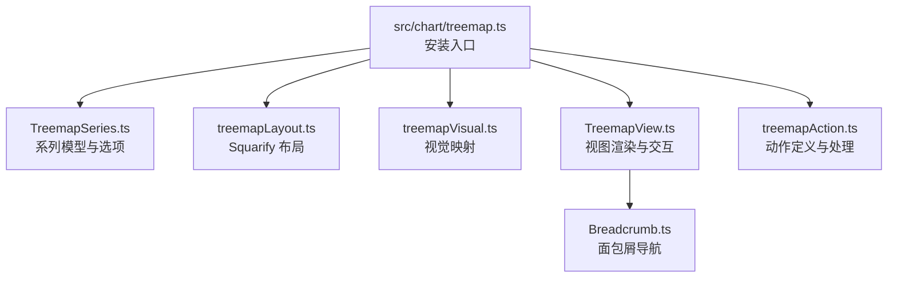
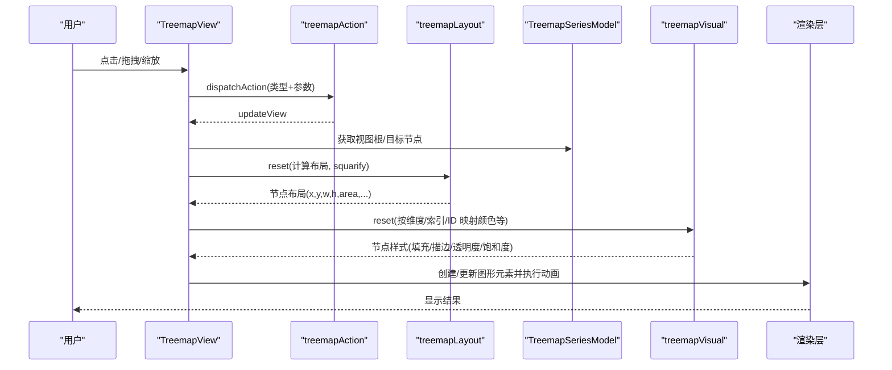
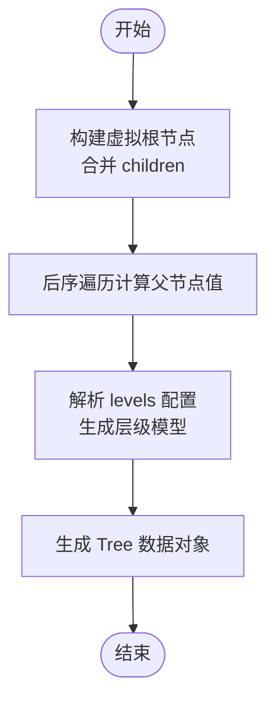
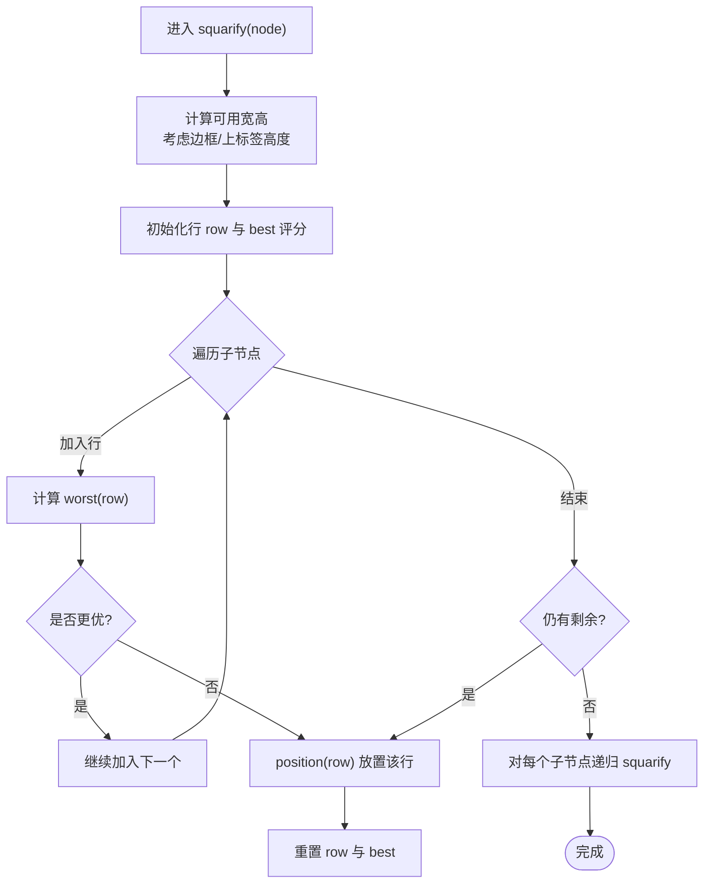
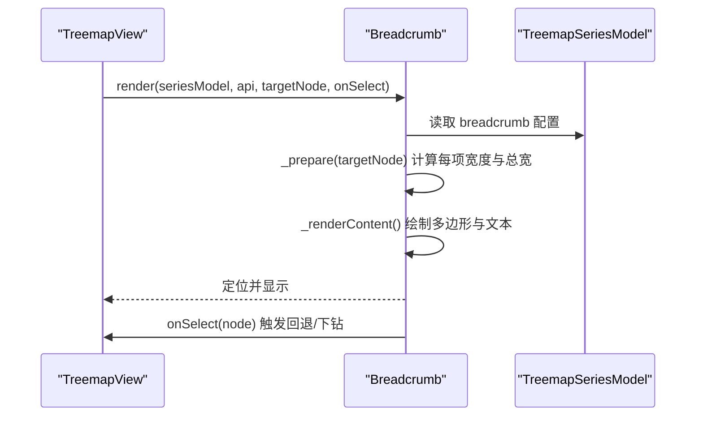
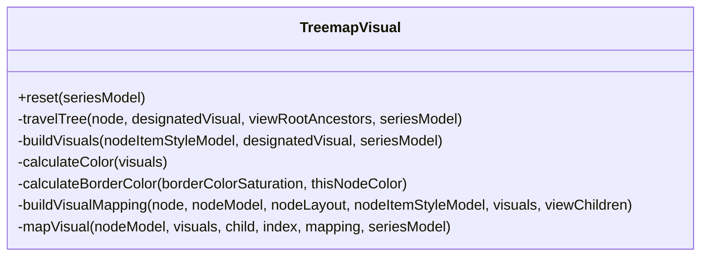
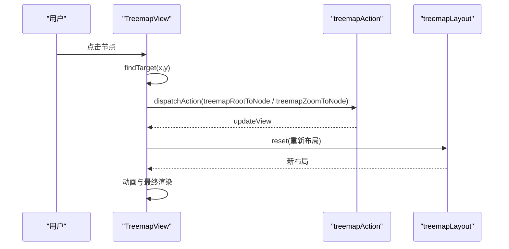
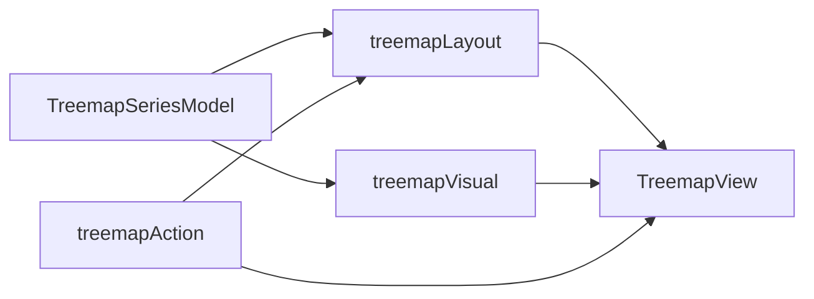

# 矩形树图 (Treemap)

<cite>
**本文引用的文件**
- [treemap.ts](file://src/chart/treemap.ts)
- [TreemapSeries.ts](file://src/chart/treemap/TreemapSeries.ts)
- [treemapLayout.ts](file://src/chart/treemap/treemapLayout.ts)
- [Breadcrumb.ts](file://src/chart/treemap/Breadcrumb.ts)
- [treemapVisual.ts](file://src/chart/treemap/treemapVisual.ts)
- [TreemapView.ts](file://src/chart/treemap/TreemapView.ts)
- [treemapAction.ts](file://src/chart/treemap/treemapAction.ts)
- [treemap-simple.html](file://test/treemap-simple.html)
- [treemap-disk.html](file://test/treemap-disk.html)
- [treemap-visual.html](file://test/treemap-visual.html)
</cite>

## 目录
1. [简介](#简介)
2. [项目结构](#项目结构)
3. [核心组件](#核心组件)
4. [架构总览](#架构总览)
5. [详细组件分析](#详细组件分析)
6. [依赖关系分析](#依赖关系分析)
7. [性能考量](#性能考量)
8. [故障排查指南](#故障排查指南)
9. [结论](#结论)
10. [附录：示例与最佳实践](#附录示例与最佳实践)

## 简介
本文件系统性介绍 ECharts 矩形树图的实现原理与应用场景，覆盖数据结构要求、squarify 分割算法、面包屑导航、视觉映射（颜色/透明度/边框等）、交互与动态更新、业务应用以及性能优化建议。读者可据此快速掌握在 ECharts 中构建多层级矩形树图的方法与最佳实践。

## 项目结构
ECharts 的矩形树图由“系列模型 + 布局 + 视觉映射 + 视图渲染 + 动作系统”构成，相关文件位于 src/chart/treemap 目录下，并通过顶层入口注册到图表体系。

**图示来源**
- [treemap.ts:20-23](file://src/chart/treemap.ts#L20-L23)
- [TreemapSeries.ts:222-370](file://src/chart/treemap/TreemapSeries.ts#L222-L370)
- [treemapLayout.ts:85-193](file://src/chart/treemap/treemapLayout.ts#L85-L193)
- [treemapVisual.ts:44-61](file://src/chart/treemap/treemapVisual.ts#L44-L61)
- [TreemapView.ts:148-220](file://src/chart/treemap/TreemapView.ts#L148-L220)
- [treemapAction.ts:28-86](file://src/chart/treemap/treemapAction.ts#L28-L86)

**章节来源**
- [treemap.ts:20-23](file://src/chart/treemap.ts#L20-L23)

## 核心组件
- 系列模型（TreemapSeriesModel）：定义数据格式、层级配置、默认样式、工具方法（如 tooltip、树路径信息）。
- 布局器（treemapLayout）：基于 squarify 算法计算节点矩形位置、尺寸、可视裁剪与缩放。
- 视觉映射（treemapVisual）：根据数值维度或索引/ID 映射颜色、透明度、饱和度，并计算边框色。
- 视图（TreemapView）：负责图形元素创建、差分更新、动画、漫游（平移/缩放）、点击交互、面包屑渲染。
- 动作（treemapAction）：定义 treemapZoomToNode、treemapRender、treemapMove、treemapRootToNode 等动作，驱动视图重算与重绘。
- 面包屑（Breadcrumb）：展示当前节点路径，支持点击回退/下钻。

**章节来源**
- [TreemapSeries.ts:222-370](file://src/chart/treemap/TreemapSeries.ts#L222-L370)
- [treemapLayout.ts:85-193](file://src/chart/treemap/treemapLayout.ts#L85-L193)
- [treemapVisual.ts:44-61](file://src/chart/treemap/treemapVisual.ts#L44-L61)
- [TreemapView.ts:148-220](file://src/chart/treemap/TreemapView.ts#L148-L220)
- [treemapAction.ts:28-86](file://src/chart/treemap/treemapAction.ts#L28-L86)
- [Breadcrumb.ts:57-108](file://src/chart/treemap/Breadcrumb.ts#L57-L108)

## 架构总览
下图展示了从用户操作到渲染输出的关键流程：事件触发 → 动作分发 → 布局重算 → 视觉映射 → 视图更新与动画 → 渲染。

**图示来源**
- [TreemapView.ts:593-685](file://src/chart/treemap/TreemapView.ts#L593-L685)
- [treemapAction.ts:53-86](file://src/chart/treemap/treemapAction.ts#L53-L86)
- [treemapLayout.ts:85-193](file://src/chart/treemap/treemapLayout.ts#L85-L193)
- [treemapVisual.ts:44-61](file://src/chart/treemap/treemapVisual.ts#L44-L61)

## 详细组件分析

### 数据结构与层级组织
- 数据为树形结构，每个节点包含 name、value、children 等字段；父节点 value 未显式设置时会自动汇总子节点值。
- 支持 levels 数组对每一层进行差异化配置（颜色、标签、可见阈值等）。
- 支持 leafDepth 将指定深度视为叶子，便于控制下钻层级。
- 支持 sort 排序（升序/降序），影响布局顺序与可视化映射范围。

**图示来源**
- [TreemapSeries.ts:375-414](file://src/chart/treemap/TreemapSeries.ts#L375-L414)
- [TreemapSeries.ts:535-567](file://src/chart/treemap/TreemapSeries.ts#L535-L567)
- [TreemapSeries.ts:572-611](file://src/chart/treemap/TreemapSeries.ts#L572-L611)

**章节来源**
- [TreemapSeries.ts:375-414](file://src/chart/treemap/TreemapSeries.ts#L375-L414)
- [TreemapSeries.ts:535-567](file://src/chart/treemap/TreemapSeries.ts#L535-L567)
- [TreemapSeries.ts:572-611](file://src/chart/treemap/TreemapSeries.ts#L572-L611)

### Squarify 分割算法
- 核心函数 squarify 递归地对每个父节点区域进行矩形分割，目标是使子矩形尽可能接近正方形（squareRatio 控制长宽比偏好）。
- 通过 worst 评分函数评估行内矩形的“最坏纵横比”，当加入下一个子节点导致评分变差时，结束当前行并换向继续。
- position 函数按行分配具体 x/y/w/h，考虑 gapWidth 和 borderWidth，确保间距与边框正确。
- initChildren 负责统计 sum、过滤 visibleMin、设置 area、dataExtent（用于后续视觉映射）。
- prunning 根据可视区域裁剪不可见节点，提升渲染性能。

**图示来源**
- [treemapLayout.ts:206-296](file://src/chart/treemap/treemapLayout.ts#L206-L296)
- [treemapLayout.ts:301-364](file://src/chart/treemap/treemapLayout.ts#L301-L364)
- [treemapLayout.ts:473-553](file://src/chart/treemap/treemapLayout.ts#L473-L553)
- [treemapLayout.ts:652-690](file://src/chart/treemap/treemapLayout.ts#L652-L690)

**章节来源**
- [treemapLayout.ts:206-296](file://src/chart/treemap/treemapLayout.ts#L206-L296)
- [treemapLayout.ts:301-364](file://src/chart/treemap/treemapLayout.ts#L301-L364)
- [treemapLayout.ts:473-553](file://src/chart/treemap/treemapLayout.ts#L473-L553)
- [treemapLayout.ts:652-690](file://src/chart/treemap/treemapLayout.ts#L652-L690)

### 面包屑导航
- 面包屑基于当前视图根节点向上回溯生成路径项，支持文本截断与空项宽度控制。
- 每个项为可点击的多边形，点击后触发“回到祖先节点”或“缩放到节点”的动作。
- 支持 itemStyle 与 emphasis 样式，包括背景、文字样式等。

**图示来源**
- [Breadcrumb.ts:65-108](file://src/chart/treemap/Breadcrumb.ts#L65-L108)
- [Breadcrumb.ts:114-199](file://src/chart/treemap/Breadcrumb.ts#L114-L199)
- [TreemapView.ts:630-652](file://src/chart/treemap/TreemapView.ts#L630-L652)

**章节来源**
- [Breadcrumb.ts:65-108](file://src/chart/treemap/Breadcrumb.ts#L65-L108)
- [Breadcrumb.ts:114-199](file://src/chart/treemap/Breadcrumb.ts#L114-L199)
- [TreemapView.ts:630-652](file://src/chart/treemap/TreemapView.ts#L630-L652)

### 视觉映射（颜色、透明度、边框）
- 支持按数值维度（visualDimension）或索引/ID（colorMappingBy）映射颜色、透明度（colorAlpha）、饱和度（colorSaturation）。
- 若设置 borderColorSaturation，则边框色由当前节点颜色经饱和度调整得到。
- 可通过 levels 对不同层级分别配置映射范围与样式。

**图示来源**
- [treemapVisual.ts:44-61](file://src/chart/treemap/treemapVisual.ts#L44-L61)
- [treemapVisual.ts:63-116](file://src/chart/treemap/treemapVisual.ts#L63-L116)
- [treemapVisual.ts:118-163](file://src/chart/treemap/treemapVisual.ts#L118-L163)
- [treemapVisual.ts:172-225](file://src/chart/treemap/treemapVisual.ts#L172-L225)
- [treemapVisual.ts:244-268](file://src/chart/treemap/treemapVisual.ts#L244-L268)

**章节来源**
- [treemapVisual.ts:44-61](file://src/chart/treemap/treemapVisual.ts#L44-L61)
- [treemapVisual.ts:63-116](file://src/chart/treemap/treemapVisual.ts#L63-L116)
- [treemapVisual.ts:118-163](file://src/chart/treemap/treemapVisual.ts#L118-L163)
- [treemapVisual.ts:172-225](file://src/chart/treemap/treemapVisual.ts#L172-L225)
- [treemapVisual.ts:244-268](file://src/chart/treemap/treemapVisual.ts#L244-L268)

### 交互与动态更新
- 支持点击节点：若为叶子节点则“回到祖先节点”，否则根据 nodeClick 配置选择“缩放到节点”或“外链跳转”。
- 支持平移与缩放：通过 RoamController 捕获 pan/zoom 事件，计算新的 rootRect 并派发动作，触发布局重算与渲染。
- 支持 setOption 动态更新：levels、visibleMin、childrenVisibleMin、leafDepth、视觉映射等均可实时更新。

**图示来源**
- [TreemapView.ts:593-685](file://src/chart/treemap/TreemapView.ts#L593-L685)
- [treemapAction.ts:53-86](file://src/chart/treemap/treemapAction.ts#L53-L86)
- [treemapLayout.ts:85-193](file://src/chart/treemap/treemapLayout.ts#L85-L193)

**章节来源**
- [TreemapView.ts:593-685](file://src/chart/treemap/TreemapView.ts#L593-L685)
- [treemapAction.ts:53-86](file://src/chart/treemap/treemapAction.ts#L53-L86)
- [treemapLayout.ts:85-193](file://src/chart/treemap/treemapLayout.ts#L85-L193)

## 依赖关系分析
- TreemapSeriesModel 提供数据与层级配置，并为视觉优先级提供 designatedVisualItemStyle。
- treemapLayout 依赖 SeriesModel 的 options（sort、squareRatio、leafDepth、visibleMin、childrenVisibleMin）进行布局计算。
- treemapVisual 依赖 layout 计算的 dataExtent 与节点值，结合 levels 与 series 配置生成视觉映射。
- TreemapView 依赖布局与视觉结果，负责图形元素生命周期管理与交互。
- treemapAction 作为中间层，统一处理动作并协调 Model/View/Layout。

**图示来源**
- [TreemapSeries.ts:222-370](file://src/chart/treemap/TreemapSeries.ts#L222-L370)
- [treemapLayout.ts:85-193](file://src/chart/treemap/treemapLayout.ts#L85-L193)
- [treemapVisual.ts:44-61](file://src/chart/treemap/treemapVisual.ts#L44-L61)
- [TreemapView.ts:148-220](file://src/chart/treemap/TreemapView.ts#L148-L220)
- [treemapAction.ts:28-86](file://src/chart/treemap/treemapAction.ts#L28-L86)

**章节来源**
- [TreemapSeries.ts:222-370](file://src/chart/treemap/TreemapSeries.ts#L222-L370)
- [treemapLayout.ts:85-193](file://src/chart/treemap/treemapLayout.ts#L85-L193)
- [treemapVisual.ts:44-61](file://src/chart/treemap/treemapVisual.ts#L44-L61)
- [TreemapView.ts:148-220](file://src/chart/treemap/TreemapView.ts#L148-L220)
- [treemapAction.ts:28-86](file://src/chart/treemap/treemapAction.ts#L28-L86)

## 性能考量
- 使用 visibleMin 与 childrenVisibleMin 过滤小面积节点，减少渲染压力。
- 合理设置 squareRatio 与 sort，避免极端长宽比导致的布局抖动。
- 利用 prunning 机制仅渲染可视区域内的节点，降低无效绘制。
- 控制 gapWidth 与 borderWidth，过大会增加布局复杂度与绘制成本。
- 在大数据集场景下，优先使用 colorMappingBy='index' 或 'id' 以稳定映射，避免频繁重算。
- 避免频繁 setOption 导致的全量重排，尽量增量更新。

[本节为通用指导，不直接分析具体文件]

## 故障排查指南
- 节点不显示：检查 visibleMin/childrenVisibleMin 是否过大；确认节点 value 非负且有效。
- 颜色映射异常：确认 visualDimension 与 colorMappingBy 配置一致；检查 dataExtent 是否被 visualMin/visualMax 覆盖。
- 面包屑不生效：确认 breadcrumb.show 为 true；targetNode 存在且可回溯至根。
- 缩放/平移无响应：检查 roam 与 roamTrigger 配置；确认容器组坐标与 clip 区域正确。
- 动画卡顿：适当缩短 animationDurationUpdate；减少复杂 decal 与阴影效果。

**章节来源**
- [treemapLayout.ts:369-403](file://src/chart/treemap/treemapLayout.ts#L369-L403)
- [treemapVisual.ts:172-225](file://src/chart/treemap/treemapVisual.ts#L172-L225)
- [Breadcrumb.ts:65-108](file://src/chart/treemap/Breadcrumb.ts#L65-L108)
- [TreemapView.ts:471-599](file://src/chart/treemap/TreemapView.ts#L471-L599)

## 结论
ECharts 矩形树图通过清晰的模块化设计，将数据、布局、视觉与渲染解耦，配合强大的交互与动作系统，能够高效地呈现多层级数据的面积占比与层次关系。借助 squarify 算法、灵活的面包屑导航与丰富的视觉映射能力，适用于文件系统、组织架构、预算分类等多种业务场景。遵循本文的性能建议与最佳实践，可在大规模数据下保持流畅体验。

[本节为总结性内容，不直接分析具体文件]

## 附录：示例与最佳实践
- 基础示例：参考 test/treemap-simple.html，展示基本配置、层级样式与标签。
- 磁盘占用可视化：参考 test/treemap-disk.html，演示 childrenVisibleMin、colorMappingBy、leafDepth 的动态切换。
- 视觉映射示例：参考 test/treemap-visual.html，展示按数值维度映射颜色与范围控制。

**章节来源**
- [treemap-simple.html:49-156](file://test/treemap-simple.html#L49-L156)
- [treemap-disk.html:105-159](file://test/treemap-disk.html#L105-L159)
- [treemap-visual.html:86-162](file://test/treemap-visual.html#L86-L162)