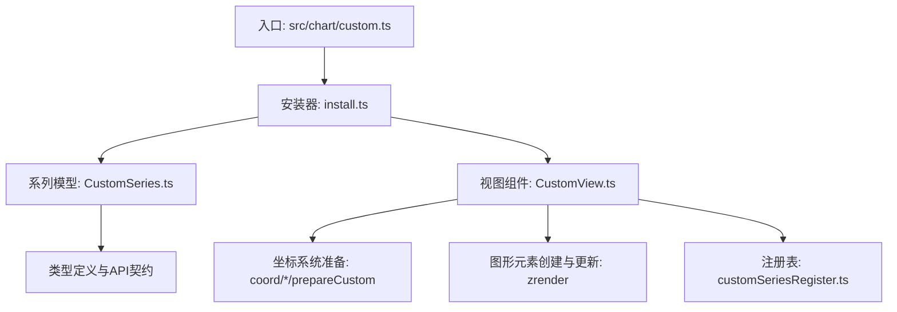
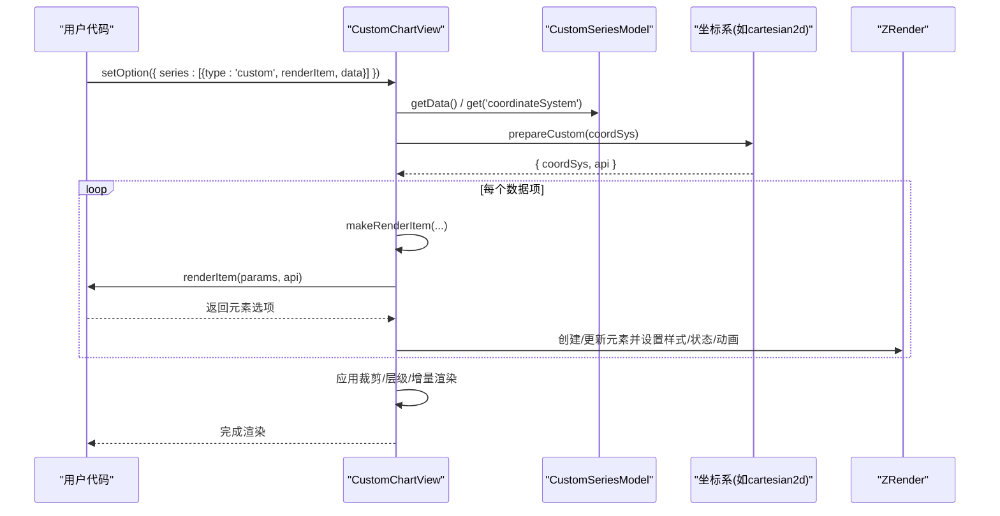
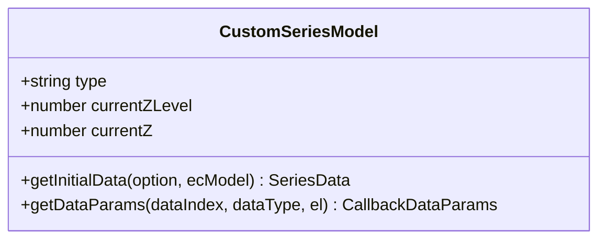
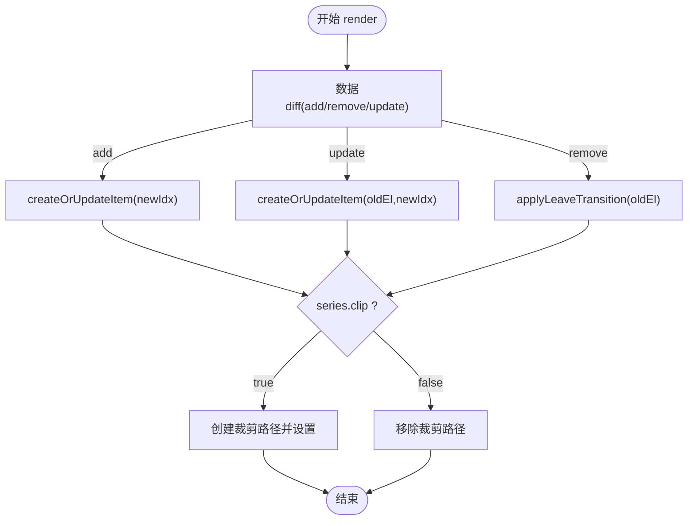
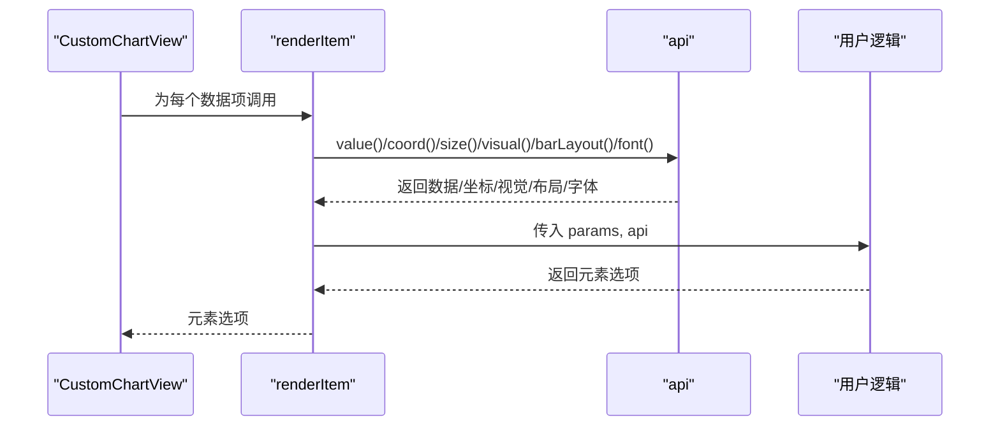
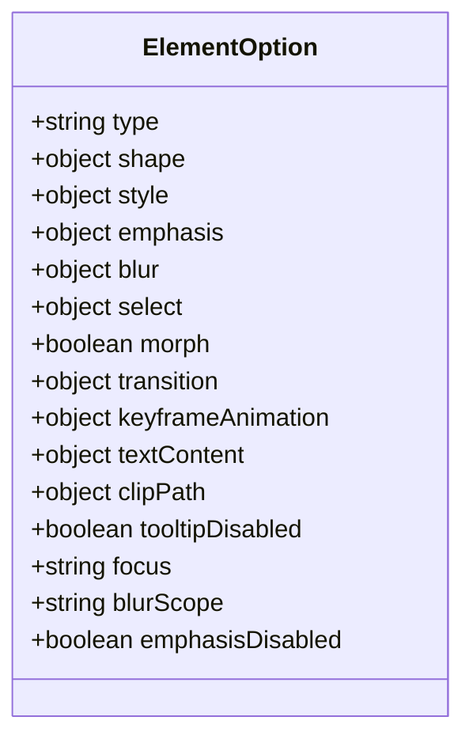
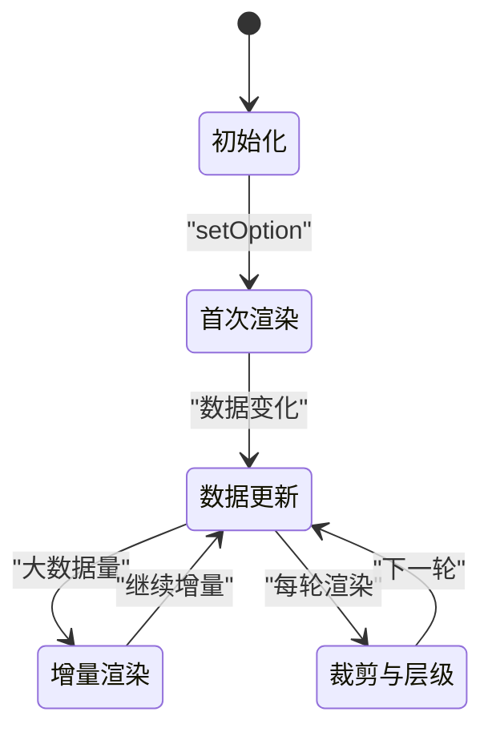
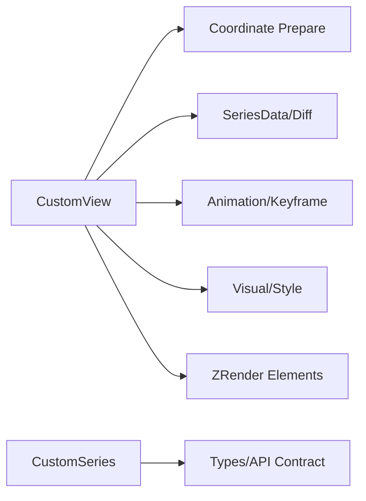

# 自定义图表 (Custom)

<cite>
**本文引用的文件**
- [src/chart/custom.ts](file://src/chart/custom.ts)
- [src/chart/custom/install.ts](file://src/chart/custom/install.ts)
- [src/chart/custom/CustomSeries.ts](file://src/chart/custom/CustomSeries.ts)
- [src/chart/custom/CustomView.ts](file://src/chart/custom/CustomView.ts)
- [src/chart/custom/customSeriesRegister.ts](file://src/chart/custom/customSeriesRegister.ts)
- [test/custom.html](file://test/custom.html)
- [test/custom-register.html](file://test/custom-register.html)
</cite>

## 目录
1. [简介](#简介)
2. [项目结构](#项目结构)
3. [核心组件](#核心组件)
4. [架构总览](#架构总览)
5. [详细组件分析](#详细组件分析)
6. [依赖关系分析](#依赖关系分析)
7. [性能与优化](#性能与优化)
8. [故障排查](#故障排查)
9. [结论](#结论)
10. [附录：示例与最佳实践](#附录示例与最佳实践)

## 简介
本文件系统性介绍 ECharts 自定义图表（custom）的开发框架与扩展机制，覆盖系列模型、视图组件、渲染流程、生命周期、注册方法与 API、渲染函数编写规范、与坐标系/数据绑定/事件处理的集成方式，以及调试技巧、性能优化与最佳实践。目标是帮助开发者从零到一实现高性能、可维护的自定义可视化。

## 项目结构
ECharts 将“自定义图表”作为内置扩展提供，核心位于 src/chart/custom 目录，并通过安装器注册到全局。测试用例位于 test/custom*.html，用于演示基础绘制、动画、交互等场景。

图示来源
- [src/chart/custom.ts:21-24](file://src/chart/custom.ts#L21-L24)
- [src/chart/custom/install.ts:24-27](file://src/chart/custom/install.ts#L24-L27)
- [src/chart/custom/CustomSeries.ts:418-467](file://src/chart/custom/CustomSeries.ts#L418-L467)
- [src/chart/custom/CustomView.ts:207-269](file://src/chart/custom/CustomView.ts#L207-L269)

章节来源
- [src/chart/custom.ts:21-24](file://src/chart/custom.ts#L21-L24)
- [src/chart/custom/install.ts:24-27](file://src/chart/custom/install.ts#L24-L27)

## 核心组件
- 系列模型（CustomSeriesModel）
  - 负责声明系列类型、默认配置、依赖的坐标系、初始数据构建、数据参数获取等。
  - 关键能力：声明 coordinateSystem、clip、z/zlevel；提供 getDataParams 以在事件中携带 info 等扩展信息。
- 视图组件（CustomChartView）
  - 负责渲染管线：数据 diff、逐项调用 renderItem、创建/更新图形元素、处理状态（normal/emphasis/blur/select）、过渡动画、裁剪、增量渲染等。
  - 关键能力：协调各坐标系的 prepareCustom，封装 renderItem 的参数与 API（coord/size/layout/value/visual/barLayout/font 等）。
- 注册表（customSeriesRegister）
  - 支持通过 registerCustomSeries 注册可复用的 renderItem 函数，并在配置中以字符串形式引用。

章节来源
- [src/chart/custom/CustomSeries.ts:418-467](file://src/chart/custom/CustomSeries.ts#L418-L467)
- [src/chart/custom/CustomView.ts:207-269](file://src/chart/custom/CustomView.ts#L207-L269)
- [src/chart/custom/customSeriesRegister.ts:22-30](file://src/chart/custom/customSeriesRegister.ts#L22-L30)

## 架构总览
自定义图表由“系列模型 + 视图组件”构成，遵循 ECharts 的 M-V 分离设计。渲染时，视图根据数据差异驱动 renderItem 生成图形选项，再转换为 ZRender 元素并挂载到组中，同时应用状态、动画、裁剪和层级控制。

图示来源
- [src/chart/custom/CustomView.ts:215-269](file://src/chart/custom/CustomView.ts#L215-L269)
- [src/chart/custom/CustomView.ts:627-753](file://src/chart/custom/CustomView.ts#L627-L753)
- [src/chart/custom/CustomSeries.ts:418-467](file://src/chart/custom/CustomSeries.ts#L418-L467)

## 详细组件分析

### 系列模型 CustomSeriesModel
- 职责
  - 声明 type = 'series.custom'，默认 coordinateSystem='cartesian2d'，默认 clip=false。
  - 依赖 grid/polar/geo/singleAxis/calendar/matrix 等坐标系。
  - 提供 getInitialData 与 getDataParams，后者可在回调事件中附加 info。
- 关键点
  - currentZLevel/currentZ 用于控制渲染层级。
  - optionUpdated 同步 z/zlevel。

图示来源
- [src/chart/custom/CustomSeries.ts:418-467](file://src/chart/custom/CustomSeries.ts#L418-L467)

章节来源
- [src/chart/custom/CustomSeries.ts:418-467](file://src/chart/custom/CustomSeries.ts#L418-L467)

### 视图组件 CustomChartView
- 职责
  - render：基于数据 diff 调用 renderItem，创建/更新元素，应用裁剪与层级。
  - incrementalPrepareRender/incrementalRender：支持大数据量渐进渲染。
  - eachRendered：遍历当前批次渲染的元素。
  - filterForExposedEvent：过滤事件，支持按 name 或祖先 group 名匹配。
- 渲染流程要点
  - 使用 DataDiffer 对比新旧数据，分别处理 add/remove/update。
  - 对每个数据项执行 createOrUpdateItem -> doCreateOrUpdateEl -> updateElNormal/updateElOnState/updateZ。
  - 支持 keyframeAnimation、transition、morph、tooltipDisabled、focus/blurScope/emphasisDisabled。
  - 支持 clipPath 与 series.clip 控制裁剪。
  - 支持 group.children 的 byIndex/byName/false 合并策略。

图示来源
- [src/chart/custom/CustomView.ts:215-269](file://src/chart/custom/CustomView.ts#L215-L269)
- [src/chart/custom/CustomView.ts:963-1109](file://src/chart/custom/CustomView.ts#L963-L1109)
- [src/chart/custom/CustomView.ts:1141-1181](file://src/chart/custom/CustomView.ts#L1141-L1181)

章节来源
- [src/chart/custom/CustomView.ts:207-330](file://src/chart/custom/CustomView.ts#L207-L330)
- [src/chart/custom/CustomView.ts:963-1109](file://src/chart/custom/CustomView.ts#L963-L1109)
- [src/chart/custom/CustomView.ts:1141-1181](file://src/chart/custom/CustomView.ts#L1141-L1181)

### 渲染函数 renderItem 与 API
- 参数与返回值
  - params：包含 context、dataIndex、seriesId/name/index、coordSys、encode、dataInsideLength、itemPayload、actionType 等。
  - api：提供 getWidth/getHeight/getZr/getDevicePixelRatio/value/ordinalRawValue/style(styleEmphasis已弃用)/visual/barLayout/currentSeriesIndices/font 等方法。
  - 返回值：单个根元素选项（type 可为 path/image/text/group/compoundPath 等），或 null/undefined/false 表示移除。
- 坐标系统与尺寸
  - coord(data, opt?)：将数据点转为屏幕坐标。
  - size(dataSize, dataItem?)：计算轴方向尺寸。
  - layout(data, opt?)：获取布局信息（部分坐标系支持）。
- 视觉映射与样式
  - visual(type, dataIndex?)：读取视觉映射结果（color/symbol/symbolSize 等）。
  - style(userProps?, dataIndex?)：兼容旧版，建议直接写样式对象。
- 条形图布局辅助
  - barLayout(opt)：在 cartesian2d 下计算柱状布局偏移与宽度。
- 字体与上下文
  - font(opt)：根据全局与标签模型生成字体字符串。
  - context：当轮渲染周期内的临时存储。

图示来源
- [src/chart/custom/CustomSeries.ts:276-361](file://src/chart/custom/CustomSeries.ts#L276-L361)
- [src/chart/custom/CustomView.ts:627-753](file://src/chart/custom/CustomView.ts#L627-L753)
- [src/chart/custom/CustomView.ts:760-947](file://src/chart/custom/CustomView.ts#L760-L947)

章节来源
- [src/chart/custom/CustomSeries.ts:276-361](file://src/chart/custom/CustomSeries.ts#L276-L361)
- [src/chart/custom/CustomView.ts:627-753](file://src/chart/custom/CustomView.ts#L627-L753)
- [src/chart/custom/CustomView.ts:760-947](file://src/chart/custom/CustomView.ts#L760-L947)

### 元素选项与状态管理
- 支持的元素类型
  - path（含 SVG pathData/d）、image、text、group、compoundPath，以及内置形状（circle/rect/sector/polygon/polyline/line/arc/bezierCurve/ring/ellipse）。
- 状态与样式
  - normal/emphasis/blur/select 四态，支持各自 style/textConfig。
  - emphasisDisabled 禁用强调触发；focus/blurScope 控制聚焦范围。
  - transition/keyframeAnimation/morph 控制过渡与关键帧动画。
- 文本内容
  - textContent 可设为 false 移除文本；支持多态文本配置。
- 裁剪路径
  - clipPath 仅支持 path 类型；可通过 false 显式移除。

图示来源
- [src/chart/custom/CustomSeries.ts:113-274](file://src/chart/custom/CustomSeries.ts#L113-L274)
- [src/chart/custom/CustomView.ts:1044-1093](file://src/chart/custom/CustomView.ts#L1044-L1093)
- [src/chart/custom/CustomView.ts:1141-1181](file://src/chart/custom/CustomView.ts#L1141-L1181)

章节来源
- [src/chart/custom/CustomSeries.ts:113-274](file://src/chart/custom/CustomSeries.ts#L113-L274)
- [src/chart/custom/CustomView.ts:1044-1093](file://src/chart/custom/CustomView.ts#L1044-L1093)
- [src/chart/custom/CustomView.ts:1141-1181](file://src/chart/custom/CustomView.ts#L1141-L1181)

### 生命周期与渲染流程
- 初始化
  - 安装器注册 ChartView 与 SeriesModel。
  - 首次渲染时清空组并建立数据 diff。
- 数据更新
  - add：创建新元素。
  - remove：应用离开动画。
  - update：复用或重建元素，应用过渡/关键帧。
- 增量渲染
  - incrementalPrepareRender 清空状态。
  - incrementalRender 分批创建元素并标记 incremental id。
- 裁剪与层级
  - 根据 series.clip 决定是否设置裁剪路径。
  - 统一设置 z/zlevel，支持元素级 z2。

图示来源
- [src/chart/custom/install.ts:24-27](file://src/chart/custom/install.ts#L24-L27)
- [src/chart/custom/CustomView.ts:215-306](file://src/chart/custom/CustomView.ts#L215-L306)
- [src/chart/custom/CustomView.ts:257-269](file://src/chart/custom/CustomView.ts#L257-L269)

章节来源
- [src/chart/custom/install.ts:24-27](file://src/chart/custom/install.ts#L24-L27)
- [src/chart/custom/CustomView.ts:215-306](file://src/chart/custom/CustomView.ts#L215-L306)

### 注册方法与 API
- 注册自定义 renderItem
  - echarts.registerCustomSeries(type, renderItem)
  - 在 series 中使用 renderItem: 'yourType' 引用。
- 内置安装
  - 通过 use(install) 自动注册 chart view 与 series model。

章节来源
- [src/chart/custom/customSeriesRegister.ts:22-30](file://src/chart/custom/customSeriesRegister.ts#L22-L30)
- [src/chart/custom.ts:21-24](file://src/chart/custom.ts#L21-L24)

## 依赖关系分析
- 模块耦合
  - CustomView 依赖多个坐标系的 prepareCustom（cartesian2d/geo/single/polar/calendar/matrix）。
  - CustomView 依赖数据层 SeriesData、Diff、Label、Visual、Animation 等工具。
  - CustomSeries 暴露类型定义与 API 契约，供视图与用户代码共同遵守。
- 外部依赖
  - ZRender 图形元素与动画。
  - ECharts 全局模型 GlobalModel、ExtensionAPI。

图示来源
- [src/chart/custom/CustomView.ts:176-183](file://src/chart/custom/CustomView.ts#L176-L183)
- [src/chart/custom/CustomView.ts:20-111](file://src/chart/custom/CustomView.ts#L20-L111)
- [src/chart/custom/CustomSeries.ts:24-82](file://src/chart/custom/CustomSeries.ts#L24-L82)

章节来源
- [src/chart/custom/CustomView.ts:176-183](file://src/chart/custom/CustomView.ts#L176-L183)
- [src/chart/custom/CustomView.ts:20-111](file://src/chart/custom/CustomView.ts#L20-L111)
- [src/chart/custom/CustomSeries.ts:24-82](file://src/chart/custom/CustomSeries.ts#L24-L82)

## 性能与优化
- 避免不必要的重建
  - 尽量复用元素，仅在类型/关键属性变化时重建（doesElNeedRecreate）。
  - 合理使用 $mergeChildren 策略（byIndex 性能更优）。
- 控制动画与过渡
  - 明确 transition 列表，避免全量过渡。
  - 大数据量时使用 incrementalRender。
- 减少样式计算
  - 直接使用样式对象而非 api.style 兼容方法。
  - 合理设置 clipPath，避免复杂裁剪带来的重绘。
- 利用视觉映射
  - 使用 api.visual 获取颜色/符号等，减少重复计算。
- 批量操作
  - 使用 group.children 批量更新子元素，减少 DOM/ZR 节点操作次数。

章节来源
- [src/chart/custom/CustomView.ts:1111-1139](file://src/chart/custom/CustomView.ts#L1111-L1139)
- [src/chart/custom/CustomView.ts:1321-1415](file://src/chart/custom/CustomView.ts#L1321-L1415)
- [src/chart/custom/CustomView.ts:271-306](file://src/chart/custom/CustomView.ts#L271-L306)

## 故障排查
- 常见错误
  - 未提供 renderItem：在开发模式下会断言提示。
  - 不支持的坐标系：需确保 coordinateSystem 具备 prepareCustom。
  - compoundPath 缺少 paths：会抛出错误。
  - 图形类型不存在：会报错提示无法找到类。
- 调试建议
  - 使用 __DEV__ 下的断言与警告定位问题。
  - 检查 element.name 与事件过滤是否匹配。
  - 逐步缩小 renderItem 返回的对象，确认最小可复现问题。

章节来源
- [src/chart/custom/CustomView.ts:645-660](file://src/chart/custom/CustomView.ts#L645-L660)
- [src/chart/custom/CustomView.ts:366-405](file://src/chart/custom/CustomView.ts#L366-L405)
- [src/chart/custom/CustomView.ts:312-329](file://src/chart/custom/CustomView.ts#L312-L329)

## 结论
ECharts 自定义图表通过清晰的 M-V 分离、完善的渲染管线与丰富的 API，提供了高度灵活的扩展能力。掌握系列模型、视图组件、渲染函数与坐标系协作，即可高效实现从基础图形到复杂动画与交互的自定义可视化。结合增量渲染、状态管理与性能优化策略，可应对大规模数据与高刷新率场景。

## 附录：示例与最佳实践
- 基础绘制
  - 在直角坐标系中绘制矩形条、折线、误差带等。
  - 参考示例：[test/custom.html](file://test/custom.html)
- 注册复用 renderItem
  - 使用 registerCustomSeries 注册后以字符串形式引用。
  - 参考示例：[test/custom-register.html](file://test/custom-register.html)
- 复杂动画与交互
  - 使用 transition/keyframeAnimation/morph 实现平滑过渡与关键帧动画。
  - 通过 focus/blurScope/emphasisDisabled 控制交互行为。
- 坐标系与数据绑定
  - 使用 api.coord/api.size/api.layout 进行坐标转换与尺寸计算。
  - 使用 encode 指定维度映射，配合 api.value/ordinalRawValue 取值。
- 事件处理
  - 通过 element.name 或祖先 group 名过滤事件，精准响应交互。
- 最佳实践
  - 优先使用直接样式对象，避免废弃 API。
  - 大数据量启用 incrementalRender。
  - 谨慎使用 clipPath，避免过度裁剪。
  - 合理使用 $mergeChildren 策略提升更新性能。

章节来源
- [test/custom.html:130-219](file://test/custom.html#L130-L219)
- [test/custom.html:277-323](file://test/custom.html#L277-L323)
- [test/custom.html:434-519](file://test/custom.html#L434-L519)
- [test/custom.html:559-667](file://test/custom.html#L559-L667)
- [test/custom.html:714-795](file://test/custom.html#L714-L795)
- [test/custom-register.html:53-80](file://test/custom-register.html#L53-L80)