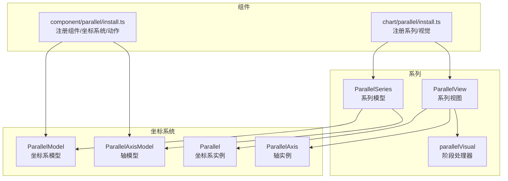
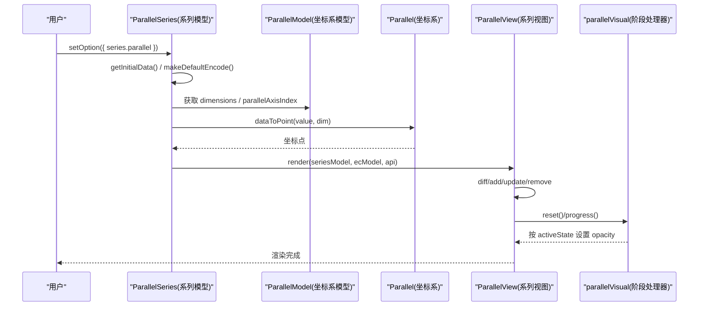
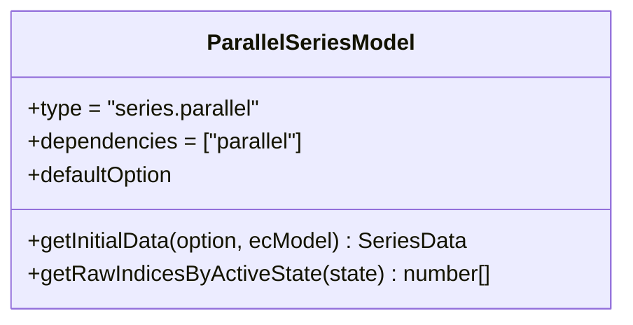
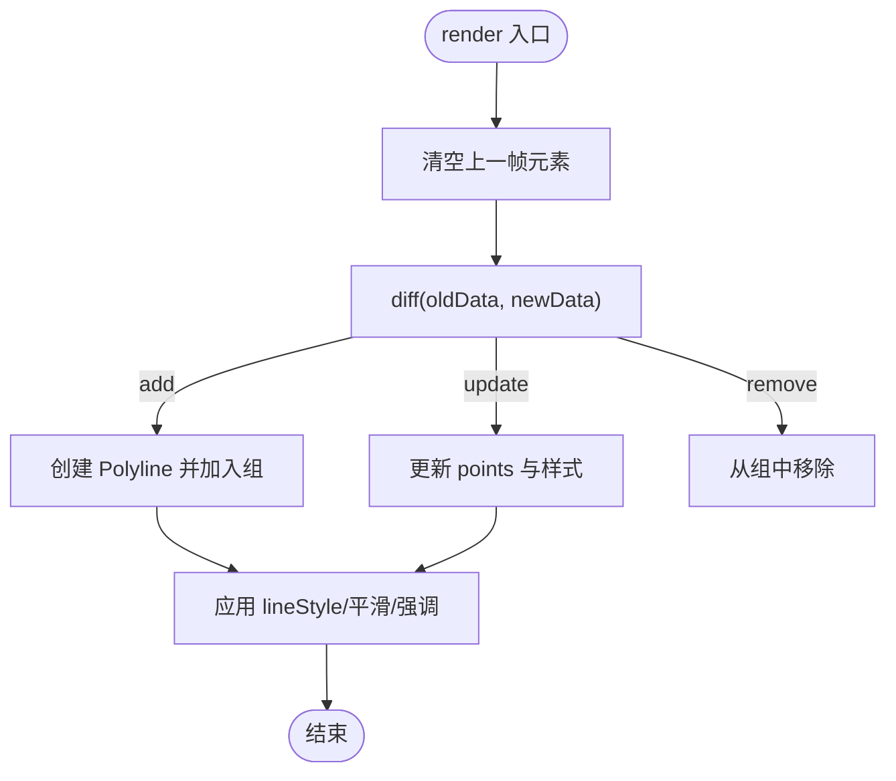
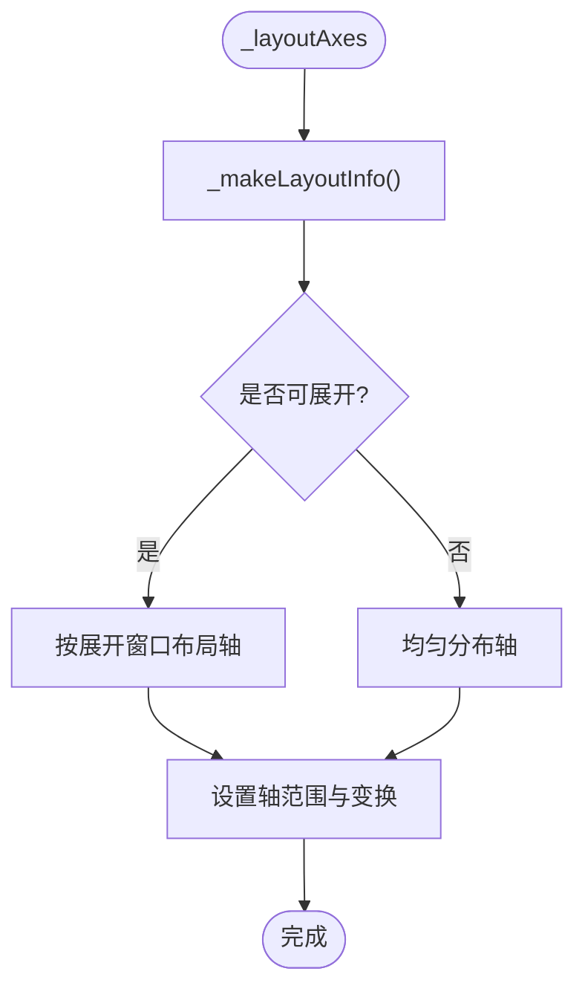
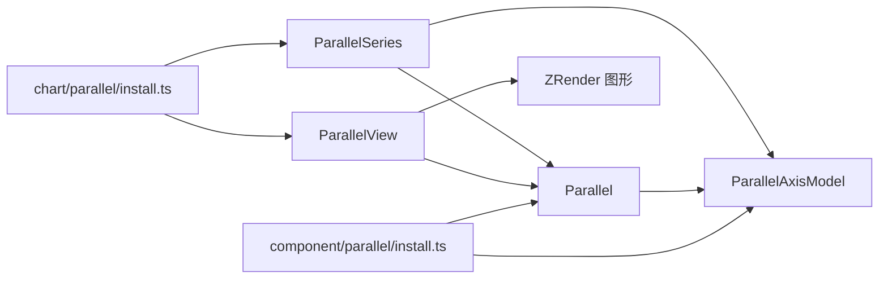

# 平行坐标图 (Parallel)

<cite>
**本文引用的文件**
- [src/chart/parallel.ts](file://src/chart/parallel.ts)
- [src/chart/parallel/install.ts](file://src/chart/parallel/install.ts)
- [src/chart/parallel/ParallelSeries.ts](file://src/chart/parallel/ParallelSeries.ts)
- [src/chart/parallel/ParallelView.ts](file://src/chart/parallel/ParallelView.ts)
- [src/chart/parallel/parallelVisual.ts](file://src/chart/parallel/parallelVisual.ts)
- [src/component/parallel/install.ts](file://src/component/parallel/install.ts)
- [src/component/parallel/ParallelView.ts](file://src/component/parallel/ParallelView.ts)
- [src/coord/parallel/Parallel.ts](file://src/coord/parallel/Parallel.ts)
- [src/coord/parallel/ParallelModel.ts](file://src/coord/parallel/ParallelModel.ts)
- [src/coord/parallel/AxisModel.ts](file://src/coord/parallel/AxisModel.ts)
- [src/coord/parallel/ParallelAxis.ts](file://src/coord/parallel/ParallelAxis.ts)
</cite>

## 目录
1. [简介](#简介)
2. [项目结构](#项目结构)
3. [核心组件](#核心组件)
4. [架构总览](#架构总览)
5. [详细组件分析](#详细组件分析)
6. [依赖关系分析](#依赖关系分析)
7. [性能与大数据优化](#性能与大数据优化)
8. [故障排查指南](#故障排查指南)
9. [结论](#结论)
10. [附录：配置项速查](#附录：配置项速查)

## 简介
平行坐标图用于高维数据的可视化，通过将每个数据点在多个维度（轴）上的取值连接成折线，帮助进行模式识别、聚类分析与异常检测。ECharts 的平行坐标图提供丰富的交互能力，包括轴过滤（刷选）、动态排序与展开折叠等，并支持渐进渲染与视觉映射以优化大数据量场景下的性能。

## 项目结构
平行坐标图由“系列模型 + 视图”、“坐标系统 + 轴模型”、“组件安装与注册”三部分构成：
- 系列层：定义数据、样式、默认行为与编码映射
- 视图层：负责绘制折线、增量更新与动画裁剪
- 坐标系统：管理多轴布局、数值范围、展开窗口与交互
- 组件安装：注册坐标系统、轴、动作与预处理

图表来源
- [src/chart/parallel/install.ts:20-33](file://src/chart/parallel/install.ts#L20-L33)
- [src/component/parallel/install.ts:44-59](file://src/component/parallel/install.ts#L44-L59)
- [src/coord/parallel/ParallelModel.ts:69-116](file://src/coord/parallel/ParallelModel.ts#L69-L116)
- [src/coord/parallel/Parallel.ts:76-110](file://src/coord/parallel/Parallel.ts#L76-L110)

章节来源
- [src/chart/parallel/install.ts:20-33](file://src/chart/parallel/install.ts#L20-L33)
- [src/component/parallel/install.ts:44-59](file://src/component/parallel/install.ts#L44-L59)

## 核心组件
- 系列模型 ParallelSeries：声明类型、依赖、默认选项、数据编码映射、激活状态索引查询等
- 系列视图 ParallelView：创建/更新/移除折线元素、增量渲染、平滑曲线、裁剪动画
- 坐标系统 Parallel：维护维度顺序、轴布局、数值范围、展开窗口、交互滑动、数据到像素转换
- 轴模型 ParallelAxisModel：维护激活区间、计算单项活跃状态、区域选择样式
- 组件安装器：注册坐标系统、轴、动作、预处理与系列/视图

章节来源
- [src/chart/parallel/ParallelSeries.ts:89-156](file://src/chart/parallel/ParallelSeries.ts#L89-L156)
- [src/chart/parallel/ParallelView.ts:41-149](file://src/chart/parallel/ParallelView.ts#L41-L149)
- [src/coord/parallel/Parallel.ts:76-183](file://src/coord/parallel/Parallel.ts#L76-L183)
- [src/coord/parallel/AxisModel.ts:60-148](file://src/coord/parallel/AxisModel.ts#L60-L148)

## 架构总览
下图展示从用户配置到渲染的关键调用链：系列模型初始化数据 -> 坐标系统计算布局与范围 -> 视图逐条生成折线 -> 阶段处理器根据轴刷选设置透明度。

图表来源
- [src/chart/parallel/ParallelSeries.ts:102-106](file://src/chart/parallel/ParallelSeries.ts#L102-L106)
- [src/chart/parallel/ParallelSeries.ts:160-182](file://src/chart/parallel/ParallelSeries.ts#L160-L182)
- [src/chart/parallel/ParallelView.ts:60-124](file://src/chart/parallel/ParallelView.ts#L60-L124)
- [src/chart/parallel/parallelVisual.ts:27-56](file://src/chart/parallel/parallelVisual.ts#L27-L56)
- [src/coord/parallel/Parallel.ts:320-328](file://src/coord/parallel/Parallel.ts#L320-L328)

## 详细组件分析

### 系列模型 ParallelSeries
- 职责：定义系列类型、依赖坐标系统、默认样式与行为、数据编码映射、激活状态索引查询
- 关键点：
  - 默认启用 progressive 渐进渲染，提升大数据体验
  - 通过 makeDefaultEncode 将 parallelAxis 的维度映射到数据维度
  - 提供 getRawIndicesByActiveState 以便外部根据轴刷选结果筛选原始数据索引

图表来源
- [src/chart/parallel/ParallelSeries.ts:89-156](file://src/chart/parallel/ParallelSeries.ts#L89-L156)
- [src/chart/parallel/ParallelSeries.ts:160-182](file://src/chart/parallel/ParallelSeries.ts#L160-L182)

章节来源
- [src/chart/parallel/ParallelSeries.ts:89-156](file://src/chart/parallel/ParallelSeries.ts#L89-L156)
- [src/chart/parallel/ParallelSeries.ts:160-182](file://src/chart/parallel/ParallelSeries.ts#L160-L182)

### 系列视图 ParallelView
- 职责：创建/更新/移除折线图形，处理增量渲染与裁剪动画，应用样式与悬停强调
- 关键点：
  - 使用 diff/add/update/remove 高效更新图形集合
  - 首次渲染时添加矩形裁剪路径，实现入场动画
  - 支持 smooth 平滑曲线与 incrementalRender 分片渲染

图表来源
- [src/chart/parallel/ParallelView.ts:60-124](file://src/chart/parallel/ParallelView.ts#L60-L124)
- [src/chart/parallel/ParallelView.ts:174-226](file://src/chart/parallel/ParallelView.ts#L174-L226)

章节来源
- [src/chart/parallel/ParallelView.ts:60-149](file://src/chart/parallel/ParallelView.ts#L60-L149)
- [src/chart/parallel/ParallelView.ts:174-226](file://src/chart/parallel/ParallelView.ts#L174-L226)

### 坐标系统 Parallel
- 职责：管理维度顺序、轴布局、数值范围、展开窗口、交互滑动、数据到像素转换
- 关键点：
  - _makeLayoutInfo 计算展开窗口、折叠宽度、内部可见索引
  - eachActiveState 遍历数据并根据各轴 activeIntervals 判定 normal/active/inactive
  - getSlidedAxisExpandWindow 支持点击/移动触发展开窗口的滑动或跳转

图表来源
- [src/coord/parallel/Parallel.ts:185-311](file://src/coord/parallel/Parallel.ts#L185-L311)
- [src/coord/parallel/Parallel.ts:415-475](file://src/coord/parallel/Parallel.ts#L415-L475)

章节来源
- [src/coord/parallel/Parallel.ts:185-311](file://src/coord/parallel/Parallel.ts#L185-L311)
- [src/coord/parallel/Parallel.ts:415-475](file://src/coord/parallel/Parallel.ts#L415-L475)

### 轴模型 ParallelAxisModel
- 职责：维护激活区间、计算单项活跃状态、区域选择样式
- 关键点：
  - setActiveIntervals 设置/归一化区间
  - getActiveState 判断值是否在任一区间内
  - areaSelectStyle 控制刷选区域的视觉样式

章节来源
- [src/coord/parallel/AxisModel.ts:60-148](file://src/coord/parallel/AxisModel.ts#L60-L148)

### 组件安装与注册
- component/parallel/install.ts：注册坐标系统、轴模型/视图、动作与预处理
- chart/parallel/install.ts：注册系列模型、视图与视觉阶段处理器

章节来源
- [src/component/parallel/install.ts:44-59](file://src/component/parallel/install.ts#L44-L59)
- [src/chart/parallel/install.ts:20-33](file://src/chart/parallel/install.ts#L20-L33)

## 依赖关系分析
- 系列依赖坐标系统与轴模型，视图依赖坐标系统实例与图形库
- 坐标系统依赖轴模型与全局模型，提供数据到像素转换与布局计算
- 组件安装器统一注册所有子模块，保证运行时可用

图表来源
- [src/chart/parallel/ParallelSeries.ts:94-99](file://src/chart/parallel/ParallelSeries.ts#L94-L99)
- [src/component/parallel/install.ts:44-59](file://src/component/parallel/install.ts#L44-L59)
- [src/chart/parallel/install.ts:20-33](file://src/chart/parallel/install.ts#L20-L33)

章节来源
- [src/chart/parallel/ParallelSeries.ts:94-99](file://src/chart/parallel/ParallelSeries.ts#L94-L99)
- [src/component/parallel/install.ts:44-59](file://src/component/parallel/install.ts#L44-L59)
- [src/chart/parallel/install.ts:20-33](file://src/chart/parallel/install.ts#L20-L33)

## 性能与大数据优化
- 渐进渲染：系列默认启用 progressive，配合 incrementalRender 分片渲染，降低首帧压力
- 增量更新：基于 diff/add/update/remove 仅变更必要图形，减少重绘
- 平滑与裁剪：smooth 参数控制曲线平滑；首次渲染使用矩形裁剪路径做入场动画
- 视觉阶段处理器：按 activeState 批量设置透明度，避免在视图中重复计算
- 内存管理：视图 dispose/remove 时清理图形组与引用，防止泄漏
- 建议：
  - 大数据集优先开启 progressive，并合理设置分片大小
  - 关闭不必要的标签与复杂样式以提升渲染速度
  - 使用 axis 刷选减少可视数据量，结合视觉映射突出关键信息

章节来源
- [src/chart/parallel/ParallelSeries.ts:127-156](file://src/chart/parallel/ParallelSeries.ts#L127-L156)
- [src/chart/parallel/ParallelView.ts:126-149](file://src/chart/parallel/ParallelView.ts#L126-L149)
- [src/chart/parallel/parallelVisual.ts:27-56](file://src/chart/parallel/parallelVisual.ts#L27-L56)

## 故障排查指南
- 现象：线条不显示或空白
  - 检查数据是否为空或包含 NaN，视图会跳过无效值
  - 确认 parallelAxis 的 dim 与数据维度映射正确
- 现象：刷选后无高亮或全灰
  - 检查各轴的 activeIntervals 是否正确设置
  - 确认 hasAxisBrushed 与 eachActiveState 逻辑是否生效
- 现象：展开/折叠交互不灵敏
  - 检查 axisExpandable、axisExpandWidth、axisExpandCount 等配置
  - 确认 axisExpandTriggerOn 为 click 或 mousemove，且鼠标事件未被其他组件拦截

章节来源
- [src/chart/parallel/ParallelView.ts:250-254](file://src/chart/parallel/ParallelView.ts#L250-L254)
- [src/coord/parallel/Parallel.ts:335-394](file://src/coord/parallel/Parallel.ts#L335-L394)
- [src/coord/parallel/Parallel.ts:415-475](file://src/coord/parallel/Parallel.ts#L415-L475)

## 结论
ECharts 的平行坐标图通过清晰的系列/视图分层、强大的坐标系统与轴模型，提供了高维数据的直观可视化与丰富的交互能力。借助渐进渲染、增量更新与视觉阶段处理器，可在大数据场景下保持良好性能。推荐结合轴刷选、颜色映射与平滑曲线，构建高效的模式识别与异常检测界面。

## 附录：配置项速查
- 系列级（series.parallel）
  - coordinateSystem、parallelIndex、parallelId：指定坐标系统与实例
  - inactiveOpacity、activeOpacity：非激活/激活透明度
  - lineStyle：线条样式（宽度、类型、透明度）
  - label：标签显示控制
  - tooltip：提示框配置
  - parallelAxisDefault：轴默认配置
  - data：多维数据数组或对象数组
  - smooth：平滑曲线开关或系数
  - realtime：实时刷新（轴刷选时）
  - progressive：渐进渲染阈值
- 坐标系统级（parallel）
  - layout：水平/垂直布局
  - axisExpandable：是否允许轴展开
  - axisExpandCenter、axisExpandCount、axisExpandWidth：展开中心、数量、宽度
  - axisExpandTriggerOn：触发方式（click/mousemove）
  - axisExpandRate、axisExpandDebounce：展开速率与防抖
  - axisExpandSlideTriggerArea：滑动触发区域比例
  - axisExpandWindow：展开窗口范围
  - parallelAxisDefault：轴默认配置
- 轴级（parallelAxis）
  - dim：维度编号或列表
  - parallelIndex：所属坐标系统实例
  - areaSelectStyle：刷选区域样式（填充、边框、透明度）
  - realtime：刷选时实时更新视图

章节来源
- [src/chart/parallel/ParallelSeries.ts:62-86](file://src/chart/parallel/ParallelSeries.ts#L62-L86)
- [src/chart/parallel/ParallelSeries.ts:127-156](file://src/chart/parallel/ParallelSeries.ts#L127-L156)
- [src/coord/parallel/ParallelModel.ts:39-67](file://src/coord/parallel/ParallelModel.ts#L39-L67)
- [src/coord/parallel/AxisModel.ts:43-58](file://src/coord/parallel/AxisModel.ts#L43-L58)