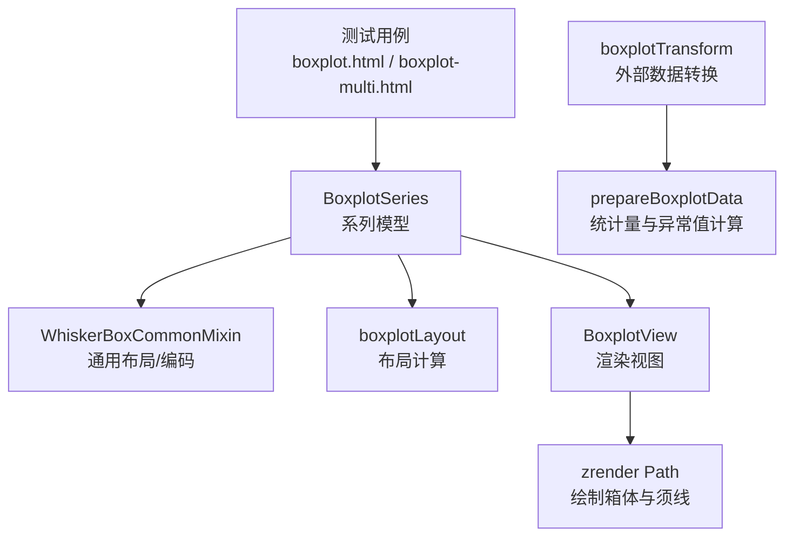
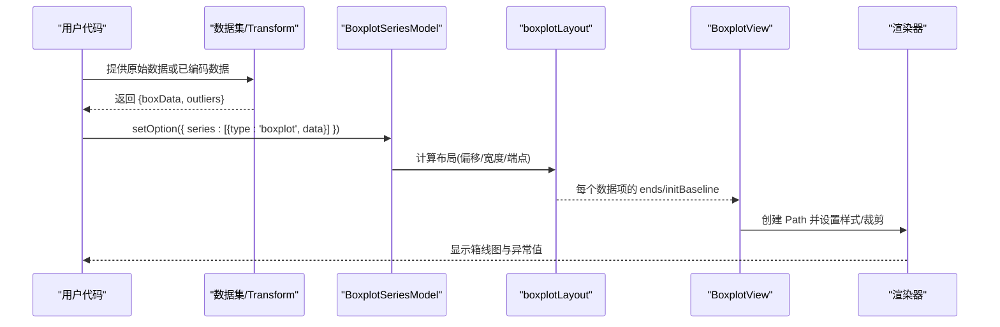
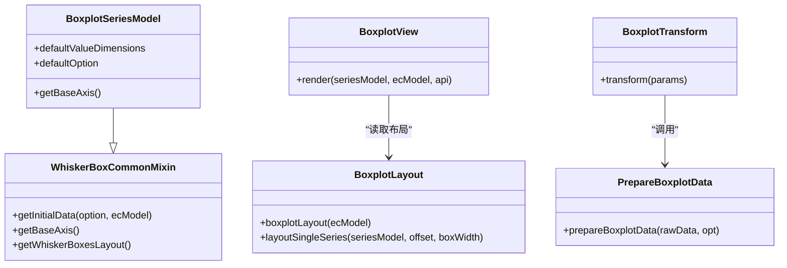

# 箱线图 (Boxplot)

<cite>
**本文引用的文件**
- [src/chart/boxplot/BoxplotSeries.ts](file://src/chart/boxplot/BoxplotSeries.ts)
- [src/chart/boxplot/BoxplotView.ts](file://src/chart/boxplot/BoxplotView.ts)
- [src/chart/boxplot/boxplotLayout.ts](file://src/chart/boxplot/boxplotLayout.ts)
- [src/chart/boxplot/boxplotTransform.ts](file://src/chart/boxplot/boxplotTransform.ts)
- [src/chart/boxplot/prepareBoxplotData.ts](file://src/chart/boxplot/prepareBoxplotData.ts)
- [src/chart/helper/whiskerBoxCommon.ts](file://src/chart/helper/whiskerBoxCommon.ts)
- [test/boxplot.html](file://test/boxplot.html)
- [test/boxplot-category.html](file://test/boxplot-category.html)
- [test/boxplot-multi.html](file://test/boxplot-multi.html)
</cite>

## 目录
1. [简介](#简介)
2. [项目结构](#项目结构)
3. [核心组件](#核心组件)
4. [架构总览](#架构总览)
5. [详细组件分析](#详细组件分析)
6. [依赖关系分析](#依赖关系分析)
7. [性能与大数据优化](#性能与大数据优化)
8. [故障排查指南](#故障排查指南)
9. [结论](#结论)
10. [附录：配置项速查](#附录：配置项速查)

## 简介
箱线图用于展示一组数据的分布特征，包括最小值、第一四分位数（Q1）、中位数（Q2）、第三四分位数（Q3）和最大值，并基于四分位距（IQR）识别异常值。它适用于数据分布概览、多组数据对比以及异常值检测等统计分析场景。ECharts 的箱线图支持分类轴、数值轴、时间轴等多种坐标系统，提供丰富的样式与交互能力，并内置数据转换工具以从原始数据自动计算统计量与异常值。

## 项目结构
本仓库中箱线图实现位于 chart/boxplot 目录下，包含系列模型、视图、布局、数据准备与转换等模块；同时通过通用混入 WhiskerBoxCommonMixin 复用箱线/须线类图表的公共逻辑。测试用例位于 test 目录，覆盖基础用法、分类轴、多系列对比、时间轴等场景。

图示来源
- [src/chart/boxplot/BoxplotSeries.ts:79-145](file://src/chart/boxplot/BoxplotSeries.ts#L79-L145)
- [src/chart/helper/whiskerBoxCommon.ts:53-188](file://src/chart/helper/whiskerBoxCommon.ts#L53-L188)
- [src/chart/boxplot/boxplotLayout.ts:49-114](file://src/chart/boxplot/boxplotLayout.ts#L49-L114)
- [src/chart/boxplot/BoxplotView.ts:39-134](file://src/chart/boxplot/BoxplotView.ts#L39-L134)
- [src/chart/boxplot/boxplotTransform.ts:31-59](file://src/chart/boxplot/boxplotTransform.ts#L31-L59)
- [src/chart/boxplot/prepareBoxplotData.ts:47-99](file://src/chart/boxplot/prepareBoxplotData.ts#L47-L99)

章节来源
- [src/chart/boxplot/BoxplotSeries.ts:79-145](file://src/chart/boxplot/BoxplotSeries.ts#L79-L145)
- [src/chart/boxplot/boxplotLayout.ts:49-114](file://src/chart/boxplot/boxplotLayout.ts#L49-L114)
- [src/chart/boxplot/BoxplotView.ts:39-134](file://src/chart/boxplot/BoxplotView.ts#L39-L134)
- [src/chart/boxplot/boxplotTransform.ts:31-59](file://src/chart/boxplot/boxplotTransform.ts#L31-L59)
- [src/chart/boxplot/prepareBoxplotData.ts:47-99](file://src/chart/boxplot/prepareBoxplotData.ts#L47-L99)

## 核心组件
- 系列模型 BoxplotSeriesModel：定义箱线图的数据维度（min, Q1, median, Q3, max），默认选项（如 boxWidth、itemStyle、emphasis 等），以及与笛卡尔坐标系的依赖关系。
- 通用混入 WhiskerBoxCommonMixin：负责根据坐标轴类型推导布局（水平/垂直）、生成初始数据与维度映射、获取基轴等。
- 布局器 boxplotLayout：计算每个系列的偏移与宽度，并为每个数据点生成箱体与须线的几何端点集合。
- 视图 BoxplotView：将布局结果转换为图形元素（Path），处理裁剪、更新动画、状态样式与悬停强调。
- 数据转换 boxplotTransform + prepareBoxplotData：将原始数组行数据转换为箱线图所需的五元组及异常值列表，支持 IQR 阈值控制与名称格式化。

章节来源
- [src/chart/boxplot/BoxplotSeries.ts:79-145](file://src/chart/boxplot/BoxplotSeries.ts#L79-L145)
- [src/chart/helper/whiskerBoxCommon.ts:53-188](file://src/chart/helper/whiskerBoxCommon.ts#L53-L188)
- [src/chart/boxplot/boxplotLayout.ts:49-114](file://src/chart/boxplot/boxplotLayout.ts#L49-L114)
- [src/chart/boxplot/BoxplotView.ts:39-134](file://src/chart/boxplot/BoxplotView.ts#L39-L134)
- [src/chart/boxplot/boxplotTransform.ts:31-59](file://src/chart/boxplot/boxplotTransform.ts#L31-L59)
- [src/chart/boxplot/prepareBoxplotData.ts:47-99](file://src/chart/boxplot/prepareBoxplotData.ts#L47-L99)

## 架构总览
下图展示了从数据到渲染的关键流程：原始数据经 transform 计算得到箱线图数据与异常值；系列模型定义维度与默认配置；布局阶段计算每个箱体的位置与尺寸；视图阶段创建 Path 并应用样式与裁剪；最终由渲染器输出。

图示来源
- [src/chart/boxplot/boxplotTransform.ts:31-59](file://src/chart/boxplot/boxplotTransform.ts#L31-L59)
- [src/chart/boxplot/prepareBoxplotData.ts:47-99](file://src/chart/boxplot/prepareBoxplotData.ts#L47-L99)
- [src/chart/boxplot/boxplotLayout.ts:49-114](file://src/chart/boxplot/boxplotLayout.ts#L49-L114)
- [src/chart/boxplot/BoxplotView.ts:39-134](file://src/chart/boxplot/BoxplotView.ts#L39-L134)

## 详细组件分析

### 数据格式要求
- 直接数据（无需 transform）：每条数据为长度为 5 的数组，顺序为 [最小值, Q1, 中位数, Q3, 最大值]。若使用分类轴，可在末尾附加类别名并通过 encode 指定映射。
- 原始数据（需要 transform）：二维数组，每个子数组为一组原始观测值。transform 会计算 Q1/Q2/Q3/IQR 并输出两类数据：
  - boxData：每行 [ItemName, Low, Q1, Q2, Q3, High]
  - outliers：异常值列表，便于用散点图叠加展示

章节来源
- [src/chart/boxplot/BoxplotSeries.ts:96-102](file://src/chart/boxplot/BoxplotSeries.ts#L96-L102)
- [src/chart/boxplot/prepareBoxplotData.ts:47-99](file://src/chart/boxplot/prepareBoxplotData.ts#L47-L99)
- [src/chart/boxplot/boxplotTransform.ts:31-59](file://src/chart/boxplot/boxplotTransform.ts#L31-L59)
- [test/boxplot-category.html:91-111](file://test/boxplot-category.html#L91-L111)

### 布局与方向
- 布局方向 layout：'horizontal'（箱体竖直排列，沿横轴分组）或 'vertical'（箱体水平排列，沿纵轴分组）。当存在分类轴时会自动推导为对应方向。
- 多系列并排：在同一分类刻度下，多个箱线图系列会按计算出的偏移与宽度并排显示，避免重叠。

章节来源
- [src/chart/helper/whiskerBoxCommon.ts:75-111](file://src/chart/helper/whiskerBoxCommon.ts#L75-L111)
- [src/chart/boxplot/boxplotLayout.ts:76-114](file://src/chart/boxplot/boxplotLayout.ts#L76-L114)
- [test/boxplot-multi.html:154-175](file://test/boxplot-multi.html#L154-L175)

### 渲染与样式
- 箱体形状：由自定义 Path 绘制矩形框与须线，支持初始化动画（从基线展开）。
- 裁剪策略：根据坐标系区域判断是否完全/部分/不裁剪，避免超出绘图区或与轴标签重叠。
- 样式配置：
  - itemStyle：填充色、边框色、边框宽度等
  - emphasis：悬停高亮（边框加粗、阴影等）
  - boxWidth：可传单值或[min,max]区间，支持百分比，限制箱体宽度范围
  - clip：是否启用裁剪（默认开启）

章节来源
- [src/chart/boxplot/BoxplotView.ts:45-134](file://src/chart/boxplot/BoxplotView.ts#L45-L134)
- [src/chart/boxplot/BoxplotView.ts:177-238](file://src/chart/boxplot/BoxplotView.ts#L177-L238)
- [src/chart/boxplot/BoxplotSeries.ts:108-136](file://src/chart/boxplot/BoxplotSeries.ts#L108-L136)
- [src/chart/helper/whiskerBoxCommon.ts:196-214](file://src/chart/helper/whiskerBoxCommon.ts#L196-L214)

### 异常值检测与展示
- 异常值判定：基于 IQR = Q3 - Q1，默认阈值为 1.5 * IQR。低于 Q1 - 1.5*IQR 或高于 Q3 + 1.5*IQR 的值视为异常值。
- 展示方式：可通过 scatter 系列叠加 outliers 数据进行可视化。
- 配置开关：boundIQR 可设为数字或 'none'/'0'，后者表示不使用下限/上限截断，直接使用极值作为须线端点。

章节来源
- [src/chart/boxplot/prepareBoxplotData.ts:47-99](file://src/chart/boxplot/prepareBoxplotData.ts#L47-L99)
- [test/boxplot.html:132-213](file://test/boxplot.html#L132-L213)

### 交互功能
- 提示框 tooltip：支持 item/axis 触发，配合 axisPointer 显示辅助线。
- 缩放 dataZoom：支持 inside 与 slider，可对分类轴或时间轴进行缩放浏览。
- 标记 markPoint/markLine：可标注极值、均值、特定维度（如 Q1/Q3）等。

章节来源
- [test/boxplot.html:119-213](file://test/boxplot.html#L119-L213)
- [test/boxplot-multi.html:137-153](file://test/boxplot-multi.html#L137-L153)
- [test/boxplot-multi.html:293-323](file://test/boxplot-multi.html#L293-L323)

### 业务场景示例
- 质量检测数据分析：对多条产线或批次的测量指标绘制箱线图，快速识别分布差异与异常批次。
- 金融数据统计：对股票收益率、波动率等进行分组箱线图分析，结合时间轴观察趋势变化。
- 性能指标监控：对接口响应时间、CPU/内存使用率等多维度指标进行箱线图监控，定位长尾与异常峰值。

说明：以上为概念性场景说明，具体实现可参考测试用例中的分类轴、时间轴与多系列组合方式。

## 依赖关系分析
- BoxplotSeriesModel 依赖 WhiskerBoxCommonMixin 提供布局推导与数据初始化；依赖 xAxis/yAxis/grid 坐标系统。
- boxplotLayout 依赖坐标轴统计信息与带宽计算，确保多系列并排时的间距合理。
- BoxplotView 依赖 zrender Path 与裁剪路径工具，完成图形绘制与更新。
- boxplotTransform 依赖 prepareBoxplotData 完成统计量计算，输出 boxData 与 outliers 供后续系列使用。

图示来源
- [src/chart/boxplot/BoxplotSeries.ts:79-145](file://src/chart/boxplot/BoxplotSeries.ts#L79-L145)
- [src/chart/helper/whiskerBoxCommon.ts:53-188](file://src/chart/helper/whiskerBoxCommon.ts#L53-L188)
- [src/chart/boxplot/boxplotLayout.ts:49-114](file://src/chart/boxplot/boxplotLayout.ts#L49-L114)
- [src/chart/boxplot/BoxplotView.ts:39-134](file://src/chart/boxplot/BoxplotView.ts#L39-L134)
- [src/chart/boxplot/boxplotTransform.ts:31-59](file://src/chart/boxplot/boxplotTransform.ts#L31-L59)
- [src/chart/boxplot/prepareBoxplotData.ts:47-99](file://src/chart/boxplot/prepareBoxplotData.ts#L47-L99)

## 性能与大数据优化
- 使用 dataset + transform：将原始数据一次性转换为箱线图所需统计量与异常值，减少前端重复计算开销。
- 合理使用 dataZoom：在大数据量场景下，通过 inside 或 slider 缩放查看局部数据，降低渲染压力。
- 控制 boxWidth：在多系列密集场景下，适当缩小箱体宽度或调整间距，避免视觉拥挤与重绘开销。
- 关闭不必要的裁剪：clip 默认开启，若确认数据均在可视区域内且无轴标签遮挡，可评估关闭以提升性能。
- 动画与过渡：初次渲染有展开动画，大量数据时可考虑关闭或缩短动画时长以减少卡顿。

[本节为通用性能建议，不直接引用具体文件]

## 故障排查指南
- 数据维度不足：若未提供足够的统计维度（至少 5 个），布局阶段会跳过该数据项。检查数据是否为 [min,Q1,median,Q3,max] 或使用 transform 正确生成。
- 分类轴与 encode：当使用分类轴时，若未显式 encode，框架会尝试注入索引列；如需自定义类别名，请确保 encode 映射正确。
- 异常值未显示：确认 outliers 数据是否正确传入 scatter 系列，或检查 boundIQR 配置是否设置为 'none' 导致不使用异常值判定。
- 多系列重叠：调整 boxWidth 或增加系列数量时注意可用带宽，必要时增大网格或减小 boxWidth。

章节来源
- [src/chart/boxplot/boxplotLayout.ts:119-155](file://src/chart/boxplot/boxplotLayout.ts#L119-L155)
- [src/chart/helper/whiskerBoxCommon.ts:75-111](file://src/chart/helper/whiskerBoxCommon.ts#L75-L111)
- [src/chart/boxplot/prepareBoxplotData.ts:47-99](file://src/chart/boxplot/prepareBoxplotData.ts#L47-L99)
- [test/boxplot-category.html:91-111](file://test/boxplot-category.html#L91-L111)

## 结论
ECharts 的箱线图提供了完整的数据准备、布局计算与渲染能力，支持多种坐标系统与丰富的样式/交互配置。通过 transform 可将原始数据高效转换为统计量与异常值，便于在质量管控、金融分析与性能监控等场景中直观呈现数据分布与异常。结合 dataZoom、tooltip、markPoint/markLine 等组件，可实现强大的交互式数据分析体验。

## 附录：配置项速查
- 系列级
  - type: 'boxplot'
  - coordinateSystem: 'cartesian2d'
  - layout: 'horizontal' | 'vertical'
  - clip: boolean（默认 true）
  - boxWidth: number | [number, number] | string（支持百分比）
  - itemStyle: { color, borderColor, borderWidth, ... }
  - emphasis: { scale, itemStyle, focus, blurScope, disabled }
  - animationDuration: number
- 数据
  - 直接数据：[min, Q1, median, Q3, max]
  - 分类轴：可在末尾附加类别名，并使用 encode 映射 x/y
- Transform（dataset.transform.type='echarts:boxplot'）
  - config.boundIQR: number | 'none'（默认 1.5）
  - config.itemNameFormatter: string | function（用于生成 ItemName）
- 常用组件搭配
  - tooltip：trigger 可为 'item' 或 'axis'
  - dataZoom：inside/slider，支持分类轴与时间轴
  - markPoint/markLine：标注极值、均值、特定维度（如 Q1/Q3）

章节来源
- [src/chart/boxplot/BoxplotSeries.ts:108-136](file://src/chart/boxplot/BoxplotSeries.ts#L108-L136)
- [src/chart/boxplot/prepareBoxplotData.ts:23-27](file://src/chart/boxplot/prepareBoxplotData.ts#L23-L27)
- [test/boxplot.html:119-213](file://test/boxplot.html#L119-L213)
- [test/boxplot-multi.html:137-153](file://test/boxplot-multi.html#L137-L153)