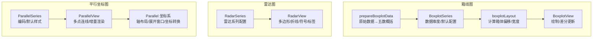
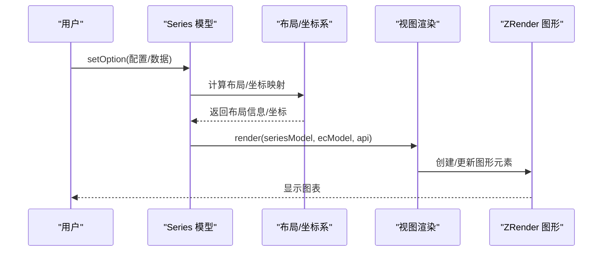
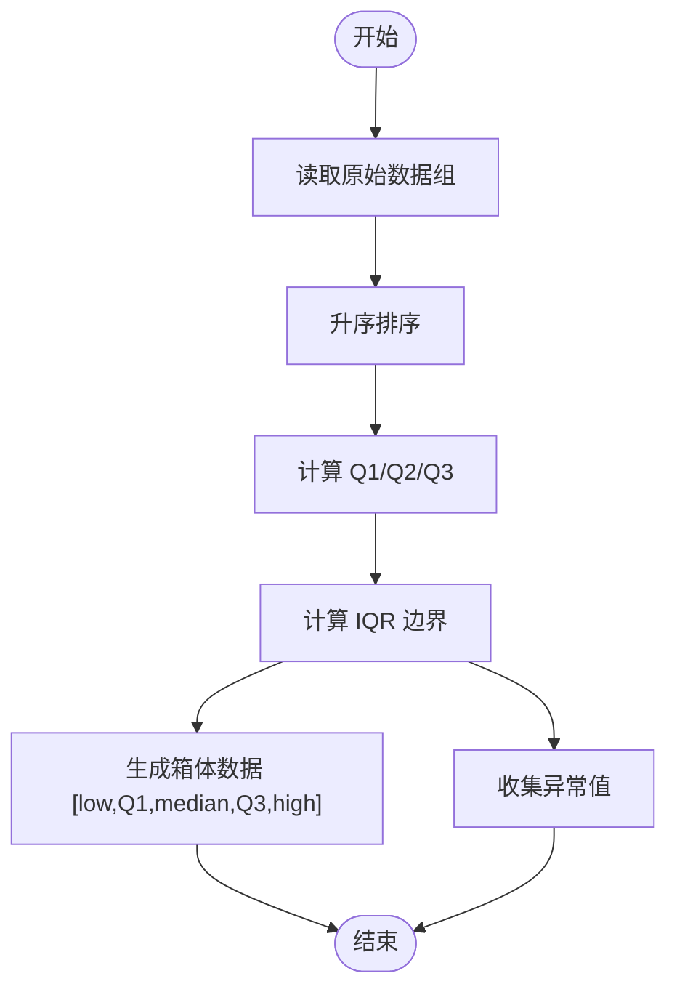
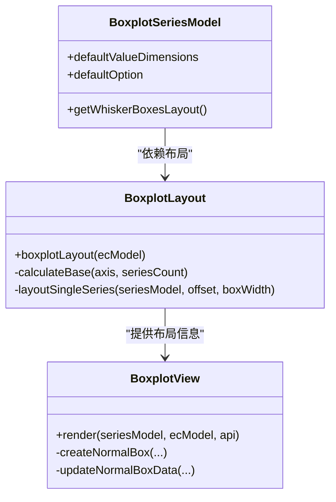
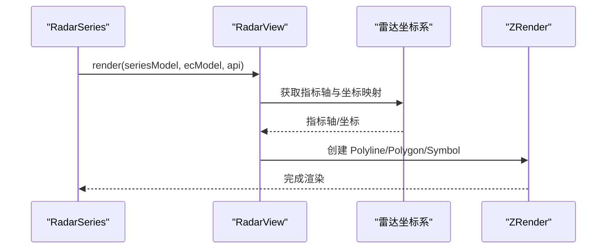
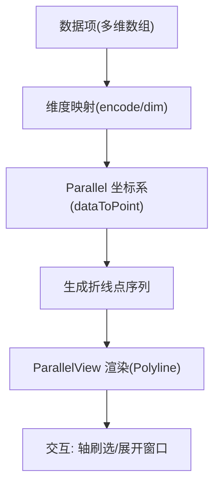
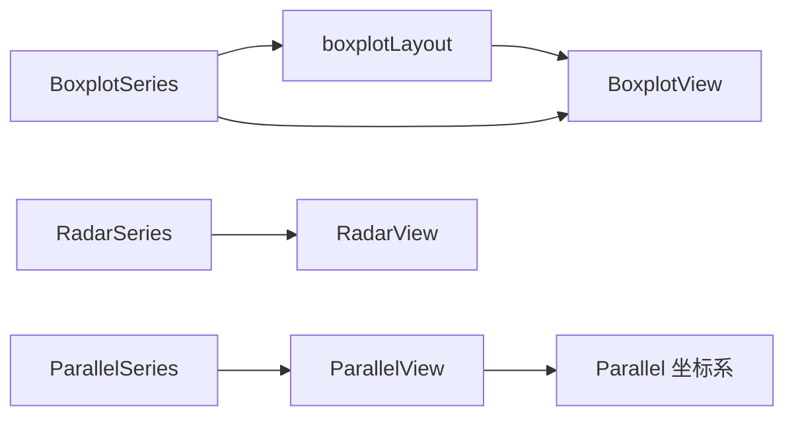

# 统计图表

<cite>
**本文引用的文件**
- [src/chart/boxplot/BoxplotSeries.ts](file://src/chart/boxplot/BoxplotSeries.ts)
- [src/chart/boxplot/BoxplotView.ts](file://src/chart/boxplot/BoxplotView.ts)
- [src/chart/boxplot/boxplotLayout.ts](file://src/chart/boxplot/boxplotLayout.ts)
- [extension-src/dataTool/prepareBoxplotData.ts](file://extension-src/dataTool/prepareBoxplotData.ts)
- [src/chart/radar/RadarSeries.ts](file://src/chart/radar/RadarSeries.ts)
- [src/chart/radar/RadarView.ts](file://src/chart/radar/RadarView.ts)
- [src/chart/parallel/ParallelSeries.ts](file://src/chart/parallel/ParallelSeries.ts)
- [src/chart/parallel/ParallelView.ts](file://src/chart/parallel/ParallelView.ts)
- [src/coord/parallel/Parallel.ts](file://src/coord/parallel/Parallel.ts)
</cite>

## 目录
1. [简介](#简介)
2. [项目结构](#项目结构)
3. [核心组件](#核心组件)
4. [架构总览](#架构总览)
5. [详细组件分析](#详细组件分析)
6. [依赖关系分析](#依赖关系分析)
7. [性能考虑](#性能考虑)
8. [故障排查指南](#故障排查指南)
9. [结论](#结论)
10. [附录](#附录)

## 简介
本章节面向 ECharts 的专业统计图表，重点覆盖箱线图、雷达图与平行坐标图。文档从数据分析用途、数据格式规范、统计计算方法、可视化配置、交互能力、大数据量处理与性能优化等维度进行系统化说明，并结合源码实现给出可追溯的参考路径，帮助读者在业务场景中高效使用这些图表。

## 项目结构
围绕三种统计图表，ECharts 采用“系列模型 + 视图渲染 + 布局/坐标系”的分层组织：
- 箱线图：Series 定义数据维度与默认样式；Layout 计算箱体位置与尺寸；View 负责绘制与差分更新；dataTool 提供原始数据到箱线五数概括的转换。
- 雷达图：Series 基于雷达坐标系生成多边形与折线；View 管理符号、标签与状态样式。
- 平行坐标图：Series 定义编码映射与默认样式；View 将多维数据点连线；Parallel 坐标系负责轴布局、展开/折叠窗口与数据点转换。

图示来源
- [src/chart/boxplot/BoxplotSeries.ts:79-136](file://src/chart/boxplot/BoxplotSeries.ts#L79-L136)
- [src/chart/boxplot/boxplotLayout.ts:47-114](file://src/chart/boxplot/boxplotLayout.ts#L47-L114)
- [src/chart/boxplot/BoxplotView.ts:45-124](file://src/chart/boxplot/BoxplotView.ts#L45-L124)
- [extension-src/dataTool/prepareBoxplotData.ts:61-114](file://extension-src/dataTool/prepareBoxplotData.ts#L61-L114)
- [src/chart/radar/RadarSeries.ts:75-172](file://src/chart/radar/RadarSeries.ts#L75-L172)
- [src/chart/radar/RadarView.ts:45-178](file://src/chart/radar/RadarView.ts#L45-L178)
- [src/chart/parallel/ParallelSeries.ts:89-156](file://src/chart/parallel/ParallelSeries.ts#L89-L156)
- [src/chart/parallel/ParallelView.ts:60-148](file://src/chart/parallel/ParallelView.ts#L60-L148)
- [src/coord/parallel/Parallel.ts:145-179](file://src/coord/parallel/Parallel.ts#L145-L179)

章节来源
- [src/chart/boxplot/BoxplotSeries.ts:79-136](file://src/chart/boxplot/BoxplotSeries.ts#L79-L136)
- [src/chart/radar/RadarSeries.ts:75-172](file://src/chart/radar/RadarSeries.ts#L75-L172)
- [src/chart/parallel/ParallelSeries.ts:89-156](file://src/chart/parallel/ParallelSeries.ts#L89-L156)

## 核心组件
- 箱线图
  - 数据维度：最小值、Q1、中位数、Q3、最大值（顺序固定）。
  - 默认样式：中性色边框、强调态阴影放大、动画时长。
  - 布局：支持水平/垂直布局，按分组计算箱体宽度与偏移。
  - 数据准备：可选用 dataTool 将原始数组转换为五数概括与异常值集合。
- 雷达图
  - 坐标系：radar，指标轴由雷达组件提供。
  - 数据：每个数据项为各指标维度的数值序列。
  - 视觉：折线、填充区域、符号与标签，支持逐项选择与高亮。
- 平行坐标图
  - 坐标系：parallel，支持多轴布局、轴展开/折叠、滑动窗口。
  - 数据：每条线代表一个样本在各维度上的取值。
  - 渲染：支持平滑曲线、渐进式渲染与裁剪动画。

章节来源
- [src/chart/boxplot/BoxplotSeries.ts:96-136](file://src/chart/boxplot/BoxplotSeries.ts#L96-L136)
- [extension-src/dataTool/prepareBoxplotData.ts:61-114](file://extension-src/dataTool/prepareBoxplotData.ts#L61-L114)
- [src/chart/radar/RadarSeries.ts:98-172](file://src/chart/radar/RadarSeries.ts#L98-L172)
- [src/chart/parallel/ParallelSeries.ts:102-156](file://src/chart/parallel/ParallelSeries.ts#L102-L156)

## 架构总览
下图展示三类统计图表在 ECharts 中的调用链路与职责分工：Series 负责数据与配置，Layout/CoordinateSystem 负责空间与度量，View 负责图形元素构建与更新。

图示来源
- [src/chart/boxplot/BoxplotView.ts:45-124](file://src/chart/boxplot/BoxplotView.ts#L45-L124)
- [src/chart/radar/RadarView.ts:45-178](file://src/chart/radar/RadarView.ts#L45-L178)
- [src/chart/parallel/ParallelView.ts:60-148](file://src/chart/parallel/ParallelView.ts#L60-L148)
- [src/coord/parallel/Parallel.ts:145-179](file://src/coord/parallel/Parallel.ts#L145-L179)

## 详细组件分析

### 箱线图（Boxplot）
- 数据分析用途
  - 展示一组数据的分布特征：集中趋势（中位数）、离散程度（四分位距 IQR）、极值与异常值。
  - 适用于质量监控、实验结果对比、金融波动等多组数据分布比较。
- 数据格式规范
  - 数据项可为数组或对象，数组顺序为 [min, Q1, median, Q3, max]。
  - 若使用 dataTool，输入为每组原始数值数组，输出包含 boxData、outliers、axisData。
- 统计计算方法
  - 排序后计算分位数（Q1/Q2/Q3），根据 IQR 倍数确定须线范围，超出部分作为异常值。
  - 可通过 boundIQR 控制是否启用边界过滤。
- 可视化效果配置
  - 支持 boxWidth 控制箱体宽度区间；emphasis 支持放大与阴影；clip 控制裁剪。
  - 支持水平/垂直布局，自动计算分组偏移与间距。
- 交互功能
  - 支持 tooltip 展示五数概括；支持 emphasis 聚焦与模糊作用域；支持数据缩放与筛选联动。
- 大数据量处理建议
  - 使用 clip 减少溢出绘制；结合 dataZoom 对类别轴进行筛选；必要时预计算五数概括以减少前端开销。

图示来源
- [extension-src/dataTool/prepareBoxplotData.ts:21-34](file://extension-src/dataTool/prepareBoxplotData.ts#L21-L34)
- [extension-src/dataTool/prepareBoxplotData.ts:61-114](file://extension-src/dataTool/prepareBoxplotData.ts#L61-L114)

图示来源
- [src/chart/boxplot/BoxplotSeries.ts:79-136](file://src/chart/boxplot/BoxplotSeries.ts#L79-L136)
- [src/chart/boxplot/boxplotLayout.ts:47-114](file://src/chart/boxplot/boxplotLayout.ts#L47-L114)
- [src/chart/boxplot/BoxplotView.ts:45-124](file://src/chart/boxplot/BoxplotView.ts#L45-L124)

章节来源
- [src/chart/boxplot/BoxplotSeries.ts:96-136](file://src/chart/boxplot/BoxplotSeries.ts#L96-L136)
- [src/chart/boxplot/boxplotLayout.ts:76-114](file://src/chart/boxplot/boxplotLayout.ts#L76-L114)
- [src/chart/boxplot/BoxplotView.ts:45-124](file://src/chart/boxplot/BoxplotView.ts#L45-L124)
- [extension-src/dataTool/prepareBoxplotData.ts:61-114](file://extension-src/dataTool/prepareBoxplotData.ts#L61-L114)

### 雷达图（Radar）
- 数据分析用途
  - 多维度指标的综合评估与对比，如能力画像、产品特性对比、绩效评估。
- 数据格式规范
  - 数据项为数值数组，长度等于指标数量；名称可由雷达组件的指标轴提供。
- 统计计算方法
  - 无复杂统计计算，主要依赖雷达坐标系的指标轴刻度与映射。
- 可视化效果配置
  - 支持折线、填充区域、符号大小与旋转；支持 legend 逐项选择；tooltip 按指标排序展示。
- 交互功能
  - 支持 tooltip 定位到最近有效指标点；支持 emphasis/select/blur 状态样式；支持 legend 选择。
- 大数据量处理建议
  - 减少符号数量与标签密度；关闭不必要的 areaStyle；配合 dataZoom 或 dataset 分页加载。

图示来源
- [src/chart/radar/RadarSeries.ts:98-172](file://src/chart/radar/RadarSeries.ts#L98-L172)
- [src/chart/radar/RadarView.ts:45-178](file://src/chart/radar/RadarView.ts#L45-L178)

章节来源
- [src/chart/radar/RadarSeries.ts:98-172](file://src/chart/radar/RadarSeries.ts#L98-L172)
- [src/chart/radar/RadarView.ts:45-178](file://src/chart/radar/RadarView.ts#L45-L178)

### 平行坐标图（Parallel）
- 数据分析用途
  - 高维数据的模式识别与聚类观察，如特征工程、异常检测、多维对比。
- 数据格式规范
  - 数据项为数值数组，长度等于维度数；通过 encode 或 parallelAxis.dim 指定维度映射。
- 统计计算方法
  - 无内置统计计算，依赖各轴的尺度与范围；支持轴刷选以筛选活跃/非活跃数据。
- 可视化效果配置
  - 支持 lineStyle、smooth、inactiveOpacity/activeOpacity；支持渐进式渲染与裁剪动画。
- 交互功能
  - 支持 axisAreaSelected 事件获取选中索引；支持轴展开/折叠与滑动窗口；支持 brush 联动。
- 大数据量处理建议
  - 启用 progressive 分批渲染；降低 smooth 复杂度；使用 dataZoom 限制可视范围；避免过多维度同时展开。

图示来源
- [src/chart/parallel/ParallelSeries.ts:102-156](file://src/chart/parallel/ParallelSeries.ts#L102-L156)
- [src/chart/parallel/ParallelView.ts:174-198](file://src/chart/parallel/ParallelView.ts#L174-L198)
- [src/coord/parallel/Parallel.ts:323-328](file://src/coord/parallel/Parallel.ts#L323-L328)

章节来源
- [src/chart/parallel/ParallelSeries.ts:102-156](file://src/chart/parallel/ParallelSeries.ts#L102-L156)
- [src/chart/parallel/ParallelView.ts:60-148](file://src/chart/parallel/ParallelView.ts#L60-L148)
- [src/coord/parallel/Parallel.ts:145-179](file://src/coord/parallel/Parallel.ts#L145-L179)

## 依赖关系分析
- 箱线图
  - Series 依赖 WhiskerBoxCommonMixin 与 Cartesian2D；Layout 依赖轴统计与带宽计算；View 依赖差分更新与裁剪路径。
- 雷达图
  - Series 依赖 Radar 坐标系与 LegendVisualProvider；View 依赖 symbol 工具与 label 样式。
- 平行坐标图
  - Series 依赖 Parallel 坐标系与 AxisModel；View 依赖渐进渲染与裁剪矩形；坐标系负责轴布局与展开窗口。

图示来源
- [src/chart/boxplot/BoxplotSeries.ts:79-136](file://src/chart/boxplot/BoxplotSeries.ts#L79-L136)
- [src/chart/boxplot/boxplotLayout.ts:47-114](file://src/chart/boxplot/boxplotLayout.ts#L47-L114)
- [src/chart/radar/RadarSeries.ts:75-172](file://src/chart/radar/RadarSeries.ts#L75-L172)
- [src/chart/parallel/ParallelSeries.ts:89-156](file://src/chart/parallel/ParallelSeries.ts#L89-L156)
- [src/coord/parallel/Parallel.ts:145-179](file://src/coord/parallel/Parallel.ts#L145-L179)

章节来源
- [src/chart/boxplot/BoxplotSeries.ts:79-136](file://src/chart/boxplot/BoxplotSeries.ts#L79-L136)
- [src/chart/radar/RadarSeries.ts:75-172](file://src/chart/radar/RadarSeries.ts#L75-L172)
- [src/chart/parallel/ParallelSeries.ts:89-156](file://src/chart/parallel/ParallelSeries.ts#L89-L156)
- [src/coord/parallel/Parallel.ts:145-179](file://src/coord/parallel/Parallel.ts#L145-L179)

## 性能考虑
- 通用策略
  - 使用 dataZoom 限制可视范围，减少渲染压力。
  - 关闭不必要的标签与装饰（如 areaStyle、symbol）。
  - 合理设置 clip，避免无效绘制。
- 箱线图
  - 批量预处理：在前端或后端预先计算五数概括与异常值。
  - 分组渲染：同轴多系列时利用布局计算的偏移与宽度，避免重叠导致的重绘。
- 雷达图
  - 指标数量较多时，减少符号与标签；使用 legend 选择关键指标。
  - 关闭 emphasis 的过度动画以提升交互流畅度。
- 平行坐标图
  - 启用 progressive 分批渲染；调整 batch 大小平衡响应与吞吐。
  - 控制 smooth 参数，复杂曲线会增加计算成本。
  - 合理使用轴展开窗口，避免全量轴同时展开导致布局计算开销。

[本节为通用指导，不直接分析具体文件]

## 故障排查指南
- 箱线图
  - 数据维度不足：确保每个数据项至少包含五个维度（min/Q1/median/Q3/max），否则布局阶段会跳过绘制。
  - 异常值未显示：检查 boundIQR 配置，若设置为 'none' 或 0，则不会过滤极端值。
  - 箱体被裁剪：确认 clip 配置与坐标系区域，必要时调整 boxWidth 或布局方向。
- 雷达图
  - 指标轴为空：检查 radar 组件的 indicator 配置是否正确。
  - tooltip 定位异常：确保数据中存在有效数值，否则无法计算最近指标点。
- 平行坐标图
  - 维度映射错误：核对 encode 或 parallelAxis.dim 与数据维度顺序一致。
  - 轴刷选无效果：确认已启用 brush 且轴处于激活状态；检查 hasAxisBrushed 逻辑。
  - 渲染卡顿：降低 smooth、启用 progressive、减少维度数量或开启裁剪。

章节来源
- [src/chart/boxplot/boxplotLayout.ts:119-155](file://src/chart/boxplot/boxplotLayout.ts#L119-L155)
- [extension-src/dataTool/prepareBoxplotData.ts:61-114](file://extension-src/dataTool/prepareBoxplotData.ts#L61-L114)
- [src/chart/radar/RadarView.ts:180-270](file://src/chart/radar/RadarView.ts#L180-L270)
- [src/chart/parallel/ParallelView.ts:209-226](file://src/chart/parallel/ParallelView.ts#L209-L226)
- [src/coord/parallel/Parallel.ts:335-394](file://src/coord/parallel/Parallel.ts#L335-L394)

## 结论
箱线图、雷达图与平行坐标图分别服务于分布统计、多维指标对比与高维模式识别三大场景。ECharts 通过清晰的系列模型、布局与坐标系分层，提供了强大的可视化与交互能力。在实际项目中，应结合数据规模与业务需求，选择合适的配置与优化策略，以获得最佳的性能与体验。

[本节为总结性内容，不直接分析具体文件]

## 附录
- 典型业务场景
  - 数据分析报告：箱线图用于质量指标分布；雷达图用于能力画像；平行坐标图用于特征重要性对比。
  - 多维数据对比：雷达图展示产品特性评分；平行坐标图展示不同批次产品的多维指标轨迹。
- 常用配置要点
  - 箱线图：boxWidth、boundIQR、clip、emphasis.scale。
  - 雷达图：indicator、areaStyle、symbolSize、legend.select。
  - 平行坐标图：parallelAxis.dim、encode、smooth、progressive、axisExpandWindow。

[本节为补充说明，不直接分析具体文件]