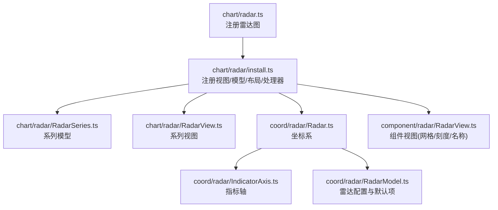
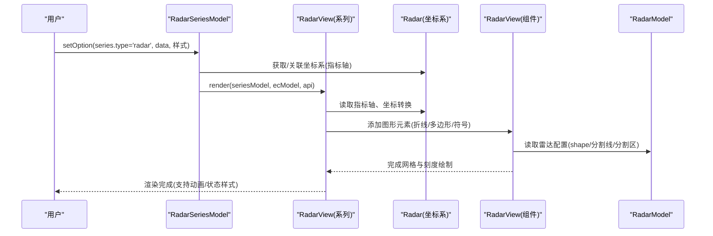
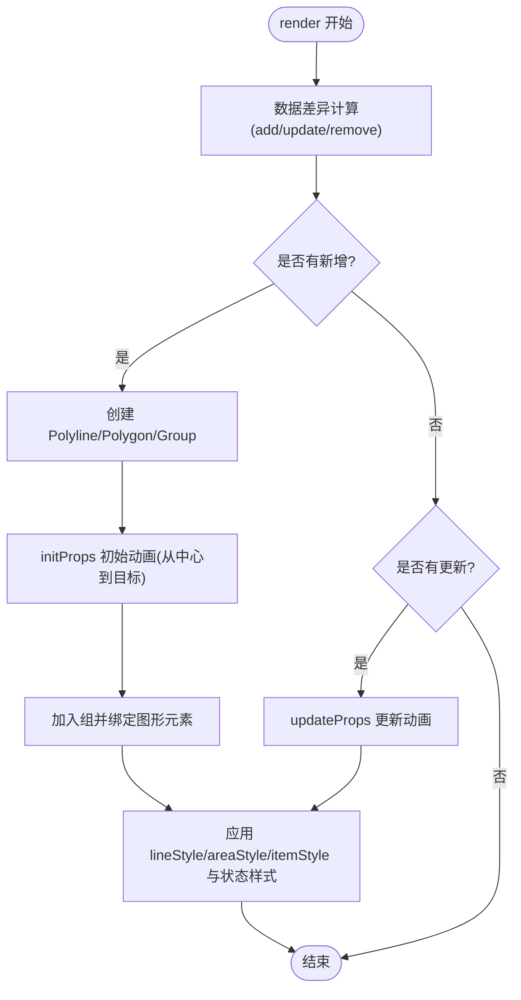
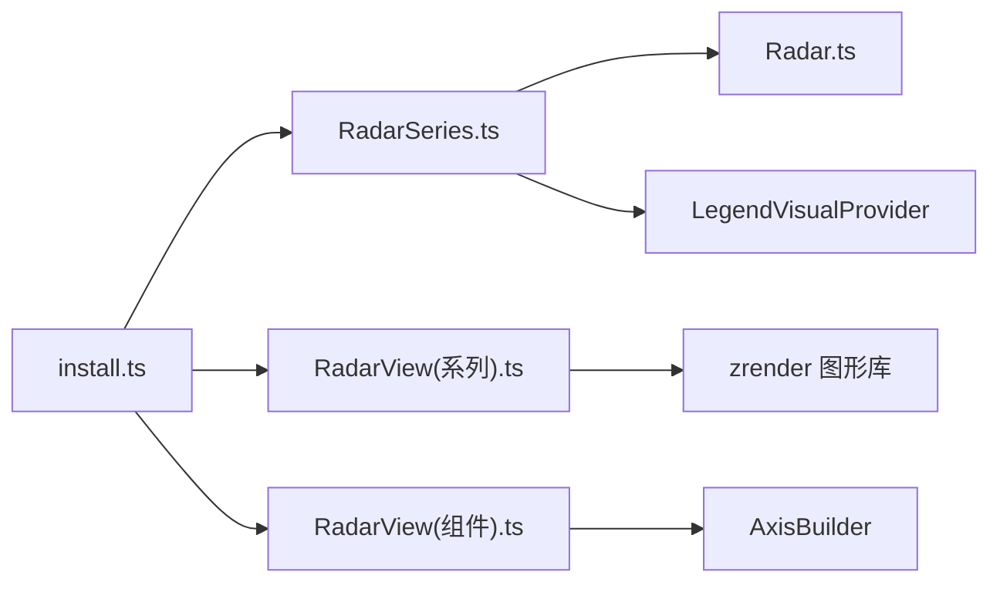

# 雷达图 (Radar)

<cite>
**本文引用的文件**
- [src/chart/radar.ts](file://src/chart/radar.ts)
- [src/chart/radar/install.ts](file://src/chart/radar/install.ts)
- [src/chart/radar/RadarSeries.ts](file://src/chart/radar/RadarSeries.ts)
- [src/chart/radar/RadarView.ts](file://src/chart/radar/RadarView.ts)
- [src/coord/radar/Radar.ts](file://src/coord/radar/Radar.ts)
- [src/coord/radar/IndicatorAxis.ts](file://src/coord/radar/IndicatorAxis.ts)
- [src/coord/radar/RadarModel.ts](file://src/coord/radar/RadarModel.ts)
- [src/component/radar/RadarView.ts](file://src/component/radar/RadarView.ts)
- [test/radar.html](file://test/radar.html)
</cite>

## 目录
1. [简介](#简介)
2. [项目结构](#项目结构)
3. [核心组件](#核心组件)
4. [架构总览](#架构总览)
5. [详细组件分析](#详细组件分析)
6. [依赖关系分析](#依赖关系分析)
7. [性能考量](#性能考量)
8. [故障排查指南](#故障排查指南)
9. [结论](#结论)
10. [附录](#附录)

## 简介
雷达图适用于多维度数据的可视化与对比，常见于能力评估、产品特性对比、多维度评分等场景。ECharts 的雷达图通过“指示器（indicator）”定义维度轴，数据点以多维数组形式表示各维度的取值；渲染层将折线、多边形区域与符号点组合展示，支持面积填充、标签显示、状态样式（高亮/模糊/选中）以及丰富的交互能力（如 tooltip、点击事件）。

## 项目结构
雷达图由“系列模型 + 视图 + 坐标系 + 组件视图”构成：
- 系列模型与视图：负责数据组织、视觉编码与图形更新
- 坐标系：提供指标轴、坐标转换、布局计算
- 组件视图：绘制网格（分割线与区域）、刻度与名称
- 安装入口：注册图表类型、布局处理器、数据过滤器与预处理

图示来源
- [src/chart/radar.ts:20-23](file://src/chart/radar.ts#L20-L23)
- [src/chart/radar/install.ts:28-36](file://src/chart/radar/install.ts#L28-L36)
- [src/chart/radar/RadarSeries.ts:75-103](file://src/chart/radar/RadarSeries.ts#L75-L103)
- [src/chart/radar/RadarView.ts:45-178](file://src/chart/radar/RadarView.ts#L45-L178)
- [src/coord/radar/Radar.ts:41-82](file://src/coord/radar/Radar.ts#L41-L82)
- [src/coord/radar/IndicatorAxis.ts:26-38](file://src/coord/radar/IndicatorAxis.ts#L26-L38)
- [src/coord/radar/RadarModel.ts:112-191](file://src/coord/radar/RadarModel.ts#L112-L191)
- [src/component/radar/RadarView.ts:34-64](file://src/component/radar/RadarView.ts#L34-L64)

章节来源
- [src/chart/radar.ts:20-23](file://src/chart/radar.ts#L20-L23)
- [src/chart/radar/install.ts:28-36](file://src/chart/radar/install.ts#L28-L36)

## 核心组件
- 系列模型 RadarSeriesModel
  - 负责数据初始化、tooltip 格式化、默认样式与系列选项
  - 支持按数据项启用图例选择、颜色映射与符号设置
- 系列视图 RadarView
  - 负责折线、多边形区域、符号点的创建与动画更新
  - 应用 itemStyle/lineStyle/areaStyle 及 emphasis/select/blur 状态样式
- 坐标系 Radar
  - 管理中心点、半径、起始角度、方向（顺时针/逆时针）
  - 维护指标轴集合，提供 dataToPoint/pointToData 等坐标转换
- 指标轴 IndicatorAxis
  - 继承通用轴，承载每个维度的刻度、名称与角度
- 雷达组件视图 component/radar/RadarView
  - 构建指标轴（名称、刻度），绘制分割线与分割区域（圆形或正多边形）
- 雷达模型 RadarModel
  - 解析 indicator 列表，生成内部指标轴模型
  - 提供雷达图默认配置（中心、半径、形状、轴线、标签、分割线/区等）

章节来源
- [src/chart/radar/RadarSeries.ts:75-175](file://src/chart/radar/RadarSeries.ts#L75-L175)
- [src/chart/radar/RadarView.ts:45-273](file://src/chart/radar/RadarView.ts#L45-L273)
- [src/coord/radar/Radar.ts:41-212](file://src/coord/radar/Radar.ts#L41-L212)
- [src/coord/radar/IndicatorAxis.ts:26-38](file://src/coord/radar/IndicatorAxis.ts#L26-L38)
- [src/component/radar/RadarView.ts:34-203](file://src/component/radar/RadarView.ts#L34-L203)
- [src/coord/radar/RadarModel.ts:112-245](file://src/coord/radar/RadarModel.ts#L112-L245)

## 架构总览
雷达图从配置到渲染的关键流程如下：

图示来源
- [src/chart/radar/RadarSeries.ts:98-131](file://src/chart/radar/RadarSeries.ts#L98-L131)
- [src/chart/radar/RadarView.ts:112-178](file://src/chart/radar/RadarView.ts#L112-L178)
- [src/coord/radar/Radar.ts:130-173](file://src/coord/radar/Radar.ts#L130-L173)
- [src/component/radar/RadarView.ts:66-203](file://src/component/radar/RadarView.ts#L66-L203)
- [src/coord/radar/RadarModel.ts:197-245](file://src/coord/radar/RadarModel.ts#L197-L245)

## 详细组件分析

### 数据结构与数据流
- 指示器（indicator）
  - 每个指示器代表一个维度轴，包含名称、最小/最大值、颜色等
  - 在 RadarModel 中解析为内部指标轴模型，并注入到坐标系
- 数据点
  - series.data 中的每一项为一个样本，value 为多维数组，长度与 indicator 数量一致
  - 系列模型使用 createSeriesDataSimply 生成坐标维度，维度名形如 indicator_0、indicator_1...
- 坐标转换
  - 坐标系根据指标轴角度与半径范围，将数据值转换为画布坐标
  - 支持从像素点到最近指标轴与数值的反算

章节来源
- [src/coord/radar/RadarModel.ts:135-191](file://src/coord/radar/RadarModel.ts#L135-L191)
- [src/chart/radar/RadarSeries.ts:98-103](file://src/chart/radar/RadarSeries.ts#L98-L103)
- [src/coord/radar/Radar.ts:88-128](file://src/coord/radar/Radar.ts#L88-L128)

### 核心配置项
- 雷达图整体配置（雷达组件）
  - center、radius、startAngle、clockwise、shape（polygon/circle）
  - axisLine、axisTick、axisLabel、splitLine、splitArea、axisName、axisNameGap、triggerEvent、scale、splitNumber、boundaryGap
- 指示器配置
  - name/text、min、max、color、axisType（当前实现使用 value 轴）
- 系列配置
  - coordinateSystem、data、symbol、symbolSize、symbolRotate
  - lineStyle、areaStyle、itemStyle、label、emphasis/select/blur 状态样式
  - legendHoverLink、colorBy、radarIndex

章节来源
- [src/coord/radar/RadarModel.ts:67-104](file://src/coord/radar/RadarModel.ts#L67-L104)
- [src/coord/radar/RadarModel.ts:197-245](file://src/coord/radar/RadarModel.ts#L197-L245)
- [src/chart/radar/RadarSeries.ts:63-71](file://src/chart/radar/RadarSeries.ts#L63-L71)
- [src/chart/radar/RadarSeries.ts:152-172](file://src/chart/radar/RadarSeries.ts#L152-L172)

### 渲染与动画
- 新增/更新/删除数据时，系列视图通过 diff 机制增量更新图形
- 初始位置从中心点展开，目标位置为实际坐标，使用 initProps/updateProps 驱动动画
- 符号点按维度索引定位，支持 symbol 类型、尺寸、旋转
- 状态样式（emphasis/select/blur）分别作用于折线、多边形区域与符号点

图示来源
- [src/chart/radar/RadarView.ts:112-178](file://src/chart/radar/RadarView.ts#L112-L178)
- [src/chart/radar/RadarView.ts:180-273](file://src/chart/radar/RadarView.ts#L180-L273)

章节来源
- [src/chart/radar/RadarView.ts:112-273](file://src/chart/radar/RadarView.ts#L112-L273)

### 交互功能
- Tooltip
  - 系列模型提供 formatTooltip，按指标轴顺序输出名称与数值，支持排序与标记色
  - getTooltipPosition 基于非空数值返回最近的数据点坐标
- 事件
  - 支持 click 等事件（可通过 triggerEvent 开启）
  - 示例测试页演示了点击后调用 showTip 动作
- 图例联动
  - 支持 legendHoverLink，鼠标悬停联动高亮对应系列

章节来源
- [src/chart/radar/RadarSeries.ts:105-150](file://src/chart/radar/RadarSeries.ts#L105-L150)
- [test/radar.html:43-154](file://test/radar.html#L43-L154)

### 视觉映射与主题
- 颜色与样式
  - colorBy 控制颜色来源（如 data）
  - itemStyle/lineStyle/areaStyle 支持透明度、描边、填充、装饰纹理（decal）
- 主题令牌
  - 轴线颜色等默认值来自主题 tokens，便于统一风格

章节来源
- [src/chart/radar/RadarSeries.ts:152-172](file://src/chart/radar/RadarSeries.ts#L152-L172)
- [src/coord/radar/RadarModel.ts:229-236](file://src/coord/radar/RadarModel.ts#L229-L236)

### 响应式与布局
- 坐标系 resize
  - 根据容器宽高计算中心与半径，支持百分比与数值混合
  - 支持 startAngle 与 clockwise 控制起始角度与方向
- 分割线与区域
  - 组件视图根据 shape 绘制圆形或正多边形网格，支持交替着色

章节来源
- [src/coord/radar/Radar.ts:130-158](file://src/coord/radar/Radar.ts#L130-L158)
- [src/component/radar/RadarView.ts:66-203](file://src/component/radar/RadarView.ts#L66-L203)

## 依赖关系分析
- 安装与注册
  - chart/radar.ts 引入 install 并注册
  - install.ts 注册组件视图、系列模型、布局处理器、数据过滤器与向后兼容预处理
- 组件耦合
  - 系列模型依赖坐标系 Radar，并通过 LegendVisualProvider 支持图例选择
  - 系列视图依赖工具函数与图形库，处理状态样式与动画
  - 组件视图依赖 AxisBuilder 构建指标轴与网格

图示来源
- [src/chart/radar/install.ts:28-36](file://src/chart/radar/install.ts#L28-L36)
- [src/chart/radar/RadarSeries.ts:20-44](file://src/chart/radar/RadarSeries.ts#L20-L44)
- [src/chart/radar/RadarView.ts:20-33](file://src/chart/radar/RadarView.ts#L20-L33)
- [src/component/radar/RadarView.ts:20-27](file://src/component/radar/RadarView.ts#L20-L27)

章节来源
- [src/chart/radar/install.ts:28-36](file://src/chart/radar/install.ts#L28-L36)

## 性能考量
- 增量更新
  - 使用 diff 机制仅对变更数据进行增删改，减少重绘开销
- 动画策略
  - 初始与更新均使用属性级动画，避免整图重绘
- 大数据量
  - 合理设置 splitNumber、symbolSize，避免过多图形节点
  - 关闭不必要的 label 与分割区以提升渲染速度
- 交互优化
  - 合理使用 legendHoverLink 与 tooltip，避免频繁重绘

[本节为通用指导，不直接分析具体文件]

## 故障排查指南
- 指标未显示
  - 检查 radar.indicator 是否定义且 length > 0
  - 确认 axisName.show 与 axisLabel.show 配置
- 数据点错位
  - 核对 series.data.value 长度与 indicator 数量一致
  - 检查坐标转换逻辑与 radius/center 配置
- 动画异常
  - 确保数据更新触发 render，避免手动修改图形元素
- 事件无效
  - 若需事件，需在雷达组件中开启 triggerEvent

章节来源
- [src/coord/radar/RadarModel.ts:135-191](file://src/coord/radar/RadarModel.ts#L135-L191)
- [src/coord/radar/Radar.ts:130-173](file://src/coord/radar/Radar.ts#L130-L173)
- [test/radar.html:54-70](file://test/radar.html#L54-L70)

## 结论
ECharts 雷达图通过清晰的模型-视图-坐标系分层，提供了强大的多维度数据可视化能力。借助 indicator 定义维度、series.data 表达多维数据，配合丰富的样式与交互，可灵活应用于能力评估、产品对比、绩效分析等场景。遵循最佳实践（合理配置、增量更新、适度动画）可获得稳定高效的渲染体验。

## 附录
- 使用示例参考
  - 基础雷达图与交互示例见测试页面，展示了 indicator、series、tooltip、legend、事件与动作的使用方式

章节来源
- [test/radar.html:43-154](file://test/radar.html#L43-L154)