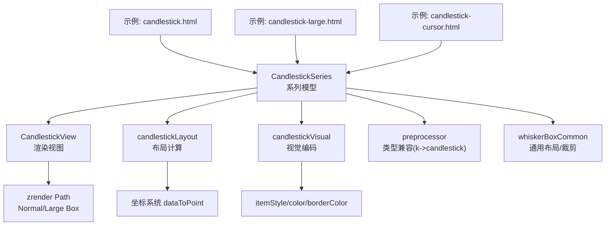
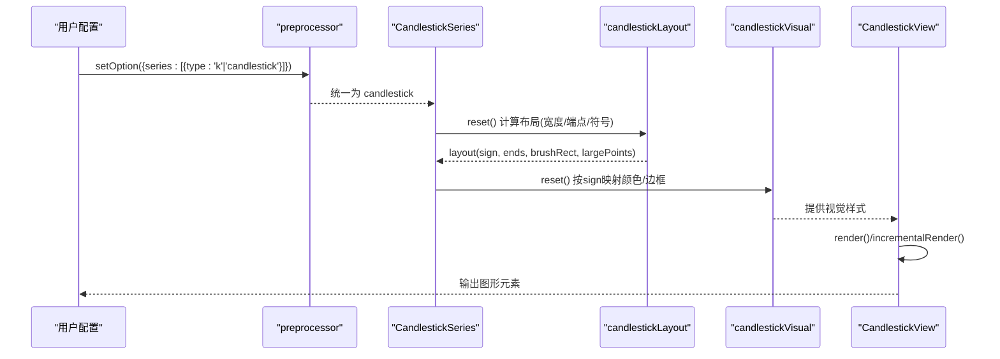
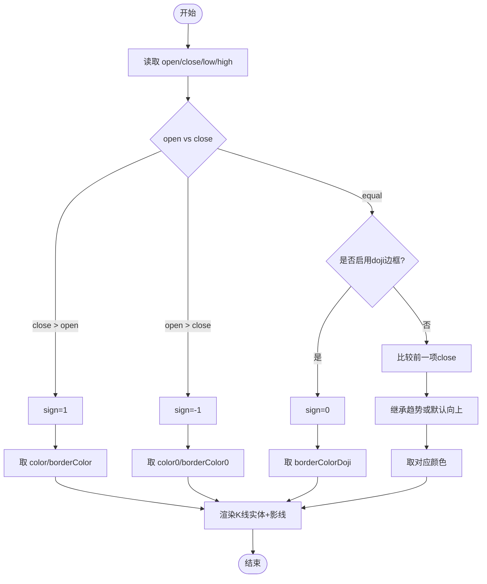
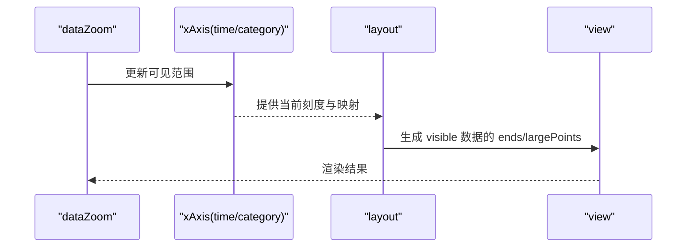
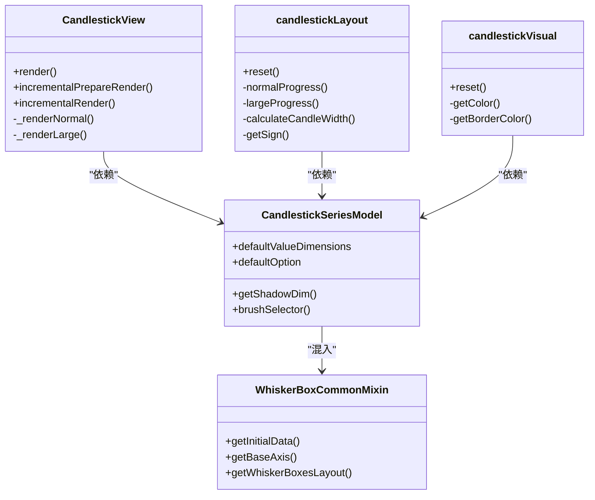
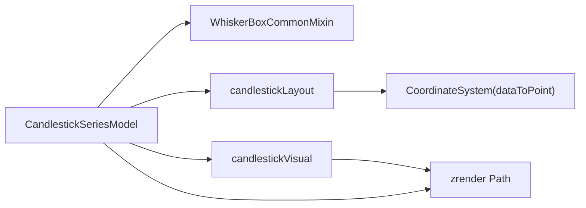

# K线图（Candlestick）

<cite>
**本文引用的文件**
- [src/chart/candlestick/CandlestickSeries.ts](file://src/chart/candlestick/CandlestickSeries.ts)
- [src/chart/candlestick/CandlestickView.ts](file://src/chart/candlestick/CandlestickView.ts)
- [src/chart/candlestick/candlestickLayout.ts](file://src/chart/candlestick/candlestickLayout.ts)
- [src/chart/candlestick/candlestickVisual.ts](file://src/chart/candlestick/candlestickVisual.ts)
- [src/chart/candlestick/preprocessor.ts](file://src/chart/candlestick/preprocessor.ts)
- [src/chart/helper/whiskerBoxCommon.ts](file://src/chart/helper/whiskerBoxCommon.ts)
- [test/candlestick.html](file://test/candlestick.html)
- [test/candlestick-large.html](file://test/candlestick-large.html)
- [test/candlestick-cursor.html](file://test/candlestick-cursor.html)
</cite>

## 目录
1. [简介](#简介)
2. [项目结构](#项目结构)
3. [核心组件](#核心组件)
4. [架构总览](#架构总览)
5. [详细组件分析](#详细组件分析)
6. [依赖关系分析](#依赖关系分析)
7. [性能考量](#性能考量)
8. [故障排查指南](#故障排查指南)
9. [结论](#结论)
10. [附录](#附录)

## 简介
本文件面向金融数据可视化场景，系统性说明 ECharts 中 K线图（candlestick）的数据格式、绘制逻辑、涨跌颜色区分、成交量柱状图叠加、时间轴与缩放、技术指标叠加、交互能力（十字光标、标注、多周期切换），以及大数据量与实时数据的性能优化策略。内容基于源码实现与示例工程进行归纳总结，便于在股票、期货等场景中快速落地。

## 项目结构
K线图由“系列模型 + 视图 + 布局 + 视觉编码 + 预处理”构成，配合坐标系统、数据缩放、提示框、标记等通用组件完成完整功能。

图表来源
- [src/chart/candlestick/CandlestickSeries.ts:88-168](file://src/chart/candlestick/CandlestickSeries.ts#L88-L168)
- [src/chart/candlestick/CandlestickView.ts:44-87](file://src/chart/candlestick/CandlestickView.ts#L44-L87)
- [src/chart/candlestick/candlestickLayout.ts:58-221](file://src/chart/candlestick/candlestickLayout.ts#L58-L221)
- [src/chart/candlestick/candlestickVisual.ts:47-81](file://src/chart/candlestick/candlestickVisual.ts#L47-L81)
- [src/chart/candlestick/preprocessor.ts:24-35](file://src/chart/candlestick/preprocessor.ts#L24-L35)
- [src/chart/helper/whiskerBoxCommon.ts:75-188](file://src/chart/helper/whiskerBoxCommon.ts#L75-L188)

章节来源
- [src/chart/candlestick/CandlestickSeries.ts:88-168](file://src/chart/candlestick/CandlestickSeries.ts#L88-L168)
- [src/chart/candlestick/CandlestickView.ts:44-87](file://src/chart/candlestick/CandlestickView.ts#L44-L87)
- [src/chart/candlestick/candlestickLayout.ts:58-221](file://src/chart/candlestick/candlestickLayout.ts#L58-L221)
- [src/chart/candlestick/candlestickVisual.ts:47-81](file://src/chart/candlestick/candlestickVisual.ts#L47-L81)
- [src/chart/candlestick/preprocessor.ts:24-35](file://src/chart/candlestick/preprocessor.ts#L24-L35)
- [src/chart/helper/whiskerBoxCommon.ts:75-188](file://src/chart/helper/whiskerBoxCommon.ts#L75-L188)

## 核心组件
- CandlestickSeries：定义系列类型、默认维度（开盘、收盘、最低、最高）、默认样式、大数据模式开关、渐进式渲染阈值等。
- CandlestickView：负责渲染（普通/大数据/增量渲染）、元素创建与更新、裁剪策略、状态样式应用。
- candlestickLayout：计算K线宽度、每个数据项的几何信息（端点、符号、刷子矩形）、大数据路径点集。
- candlestickVisual：根据涨跌符号选择填充色与边框色，并写入数据项视觉缓存。
- whiskerBoxCommon：提供横纵布局推导、基轴获取、裁剪判定等通用能力。
- preprocessor：将 type:'k' 转换为 'candlestick'，保持向后兼容。

章节来源
- [src/chart/candlestick/CandlestickSeries.ts:88-168](file://src/chart/candlestick/CandlestickSeries.ts#L88-L168)
- [src/chart/candlestick/CandlestickView.ts:44-87](file://src/chart/candlestick/CandlestickView.ts#L44-L87)
- [src/chart/candlestick/candlestickLayout.ts:58-221](file://src/chart/candlestick/candlestickLayout.ts#L58-L221)
- [src/chart/candlestick/candlestickVisual.ts:47-81](file://src/chart/candlestick/candlestickVisual.ts#L47-L81)
- [src/chart/helper/whiskerBoxCommon.ts:75-188](file://src/chart/helper/whiskerBoxCommon.ts#L75-L188)
- [src/chart/candlestick/preprocessor.ts:24-35](file://src/chart/candlestick/preprocessor.ts#L24-L35)

## 架构总览
K线图渲染管线遵循 ECharts 的标准阶段：预处理 → 数据准备 → 布局计算 → 视觉编码 → 视图渲染（含增量/大数据模式）。

图表来源
- [src/chart/candlestick/preprocessor.ts:24-35](file://src/chart/candlestick/preprocessor.ts#L24-L35)
- [src/chart/candlestick/candlestickLayout.ts:64-221](file://src/chart/candlestick/candlestickLayout.ts#L64-L221)
- [src/chart/candlestick/candlestickVisual.ts:56-81](file://src/chart/candlestick/candlestickVisual.ts#L56-L81)
- [src/chart/candlestick/CandlestickView.ts:55-87](file://src/chart/candlestick/CandlestickView.ts#L55-L87)

## 详细组件分析

### 数据格式要求（OHLC 与可选成交量）
- 基本维度顺序：[开盘价, 收盘价, 最低价, 最高价]。该顺序来自系列的默认维度定义。
- 支持通过 encode 指定 x/y 维度的映射；当未显式设置时，会根据坐标轴类型自动推导（如 category/time/value）。
- 成交量通常以独立的 bar 系列叠加在同一时间轴上，使用相同的 x 维度（日期或分类）。

章节来源
- [src/chart/candlestick/CandlestickSeries.ts:99-104](file://src/chart/candlestick/CandlestickSeries.ts#L99-L104)
- [src/chart/helper/whiskerBoxCommon.ts:113-172](file://src/chart/helper/whiskerBoxCommon.ts#L113-L172)
- [test/candlestick-large.html:96-295](file://test/candlestick-large.html#L96-L295)

### 绘制逻辑与涨跌颜色
- 符号 sign 的计算：
  - 上涨：close > open，sign=1
  - 下跌：open > close，sign=-1
  - 平盘：open == close，若配置了 doji 专用边框色则视为 doji 分支，否则沿用相邻数据趋势或默认向上
- 颜色映射：
  - 上涨：color / borderColor
  - 下跌：color0 / borderColor0
  - Doji：borderColorDoji（可单独控制）
- 视图渲染：
  - 普通模式：为每个数据项创建 NormalBoxPath，包含实体与影线
  - 大数据模式：合并为 LargeBoxPath，按 sign 分组绘制以提升性能
  - 增量渲染：分片绘制，避免一次性阻塞

图表来源
- [src/chart/candlestick/candlestickLayout.ts:230-254](file://src/chart/candlestick/candlestickLayout.ts#L230-L254)
- [src/chart/candlestick/candlestickVisual.ts:32-45](file://src/chart/candlestick/candlestickVisual.ts#L32-L45)
- [src/chart/candlestick/CandlestickView.ts:299-324](file://src/chart/candlestick/CandlestickView.ts#L299-L324)

章节来源
- [src/chart/candlestick/candlestickLayout.ts:230-254](file://src/chart/candlestick/candlestickLayout.ts#L230-L254)
- [src/chart/candlestick/candlestickVisual.ts:32-45](file://src/chart/candlestick/candlestickVisual.ts#L32-L45)
- [src/chart/candlestick/CandlestickView.ts:299-324](file://src/chart/candlestick/CandlestickView.ts#L299-L324)

### 成交量柱状图显示
- 成交量通常作为另一个 series（bar）叠加在同一时间轴上，共享 x 维度（日期或分类）。
- 可通过 grid 分割上下区域或使用双 y 轴分别展示价格与成交量。
- 示例展示了如何从原始数据中提取成交量并与 K 线同轴展示。

章节来源
- [test/candlestick-large.html:96-295](file://test/candlestick-large.html#L96-L295)

### 时间轴处理与数据缩放
- 时间轴：xAxis 可使用 time 或 category 类型；当为 time 时，布局会采用垂直方向（值轴为时间）以保证合理排列。
- 数据缩放：dataZoom 支持 inside 与 slider，可与 K 线联动；示例演示了内置缩放与滑块缩放。
- 裁剪策略：部分超出坐标系区域时会启用裁剪以避免与坐标轴标签重叠。

图表来源
- [src/chart/helper/whiskerBoxCommon.ts:113-172](file://src/chart/helper/whiskerBoxCommon.ts#L113-L172)
- [src/chart/candlestick/candlestickLayout.ts:94-179](file://src/chart/candlestick/candlestickLayout.ts#L94-L179)
- [test/candlestick.html:119-132](file://test/candlestick.html#L119-L132)

章节来源
- [src/chart/helper/whiskerBoxCommon.ts:113-172](file://src/chart/helper/whiskerBoxCommon.ts#L113-L172)
- [src/chart/candlestick/candlestickLayout.ts:94-179](file://src/chart/candlestick/candlestickLayout.ts#L94-L179)
- [test/candlestick.html:119-132](file://test/candlestick.html#L119-L132)

### 技术指标叠加
- 可在同一坐标系中添加 line 系列（如 MA5/MA10/MA20/MA30）与 K 线叠加。
- 示例展示了如何从 OHLC 数据计算移动平均线并与 K 线共同展示。

章节来源
- [test/candlestick-cursor.html:179-233](file://test/candlestick-cursor.html#L179-L233)

### 交互功能（十字光标、标注、多周期切换）
- 十字光标：tooltip.axisPointer.type='cross' 可实现十字准线。
- 数据标注：markPoint/markLine 支持数据点与像素坐标标注，支持统计类型（max/min/average）。
- 多周期切换：结合 timeline 或 dataZoom 实现不同时间粒度的切换与回放。

章节来源
- [test/candlestick.html:153-224](file://test/candlestick.html#L153-L224)
- [test/candlestick-cursor.html:132-137](file://test/candlestick-cursor.html#L132-L137)
- [test/candlestick-large.html:202-221](file://test/candlestick-large.html#L202-L221)

### 类与模块关系（代码级）

图表来源
- [src/chart/candlestick/CandlestickSeries.ts:88-168](file://src/chart/candlestick/CandlestickSeries.ts#L88-L168)
- [src/chart/candlestick/CandlestickView.ts:44-87](file://src/chart/candlestick/CandlestickView.ts#L44-L87)
- [src/chart/candlestick/candlestickLayout.ts:58-221](file://src/chart/candlestick/candlestickLayout.ts#L58-L221)
- [src/chart/candlestick/candlestickVisual.ts:47-81](file://src/chart/candlestick/candlestickVisual.ts#L47-L81)
- [src/chart/helper/whiskerBoxCommon.ts:75-188](file://src/chart/helper/whiskerBoxCommon.ts#L75-L188)

## 依赖关系分析
- 系列模型依赖坐标系统与通用混合器，用于确定基轴、布局方向与数据维度映射。
- 布局模块依赖坐标转换与数值工具，计算每个数据项的几何信息与大数据路径。
- 视图模块依赖 zrender 图形库，创建 Path 元素并进行状态样式与裁剪管理。
- 视觉模块依据 sign 选择颜色与边框，写入数据项视觉缓存供视图消费。

图表来源
- [src/chart/candlestick/CandlestickSeries.ts:88-168](file://src/chart/candlestick/CandlestickSeries.ts#L88-L168)
- [src/chart/candlestick/candlestickLayout.ts:94-179](file://src/chart/candlestick/candlestickLayout.ts#L94-L179)
- [src/chart/candlestick/CandlestickView.ts:235-279](file://src/chart/candlestick/CandlestickView.ts#L235-L279)

章节来源
- [src/chart/candlestick/CandlestickSeries.ts:88-168](file://src/chart/candlestick/CandlestickSeries.ts#L88-L168)
- [src/chart/candlestick/candlestickLayout.ts:94-179](file://src/chart/candlestick/candlestickLayout.ts#L94-L179)
- [src/chart/candlestick/CandlestickView.ts:235-279](file://src/chart/candlestick/CandlestickView.ts#L235-L279)

## 性能考量
- 大数据模式：
  - 当数据量超过阈值时，切换到 large 模式，使用 LargeBoxPath 合并绘制，减少元素数量与重绘开销。
  - 支持 progressive 与 incremental 渲染，分片绘制提升首屏与滚动体验。
- 宽度自适应：
  - 根据基轴 bandWidth 与 barMaxWidth/barMinWidth 计算最优 K 线宽度，避免重叠或过窄。
- 裁剪优化：
  - 仅对部分超出区域启用 clipPath，降低整体性能损耗。
- 建议：
  - 大数据场景开启 large 与 progressive，合理设置 largeThreshold 与 progressiveChunkMode。
  - 使用 dataZoom 限制可视范围，减少渲染压力。
  - 避免过多 markPoint/markLine 与复杂 tooltip 格式化。

章节来源
- [src/chart/candlestick/CandlestickSeries.ts:136-149](file://src/chart/candlestick/CandlestickSeries.ts#L136-L149)
- [src/chart/candlestick/CandlestickView.ts:190-222](file://src/chart/candlestick/CandlestickView.ts#L190-L222)
- [src/chart/candlestick/candlestickLayout.ts:256-278](file://src/chart/candlestick/candlestickLayout.ts#L256-L278)
- [src/chart/helper/whiskerBoxCommon.ts:192-214](file://src/chart/helper/whiskerBoxCommon.ts#L192-L214)

## 故障排查指南
- 颜色不生效：
  - 检查 itemStyle.color/color0 与 borderColor/borderColor0 是否正确设置；doji 需配置 borderColorDoji。
- K 线被遮挡或与标签重叠：
  - 确认 clip 配置与坐标系边界；必要时调整 grid 与 splitLine。
- 大数据卡顿：
  - 开启 large 与 progressive，调大 largeThreshold；使用 dataZoom 限制可视范围。
- 时间轴错位：
  - 确保 xAxis 类型为 time 或 category，且数据顺序正确；必要时使用 encode 明确映射。

章节来源
- [src/chart/candlestick/candlestickVisual.ts:32-45](file://src/chart/candlestick/candlestickVisual.ts#L32-L45)
- [src/chart/candlestick/CandlestickView.ts:103-134](file://src/chart/candlestick/CandlestickView.ts#L103-L134)
- [src/chart/candlestick/CandlestickSeries.ts:136-149](file://src/chart/candlestick/CandlestickSeries.ts#L136-L149)

## 结论
ECharts 的 K线图实现了完整的金融数据可视化能力：标准 OHLC 数据格式、智能涨跌颜色、大数据高性能渲染、时间轴与缩放、指标叠加与丰富交互。通过合理的配置与性能策略，可满足股票、期货等高频、海量数据的分析与展示需求。

## 附录
- 常用配置参考：
  - 数据格式：[开盘, 收盘, 最低, 最高]
  - 颜色：color/color0/borderColor/borderColor0/borderColorDoji
  - 尺寸：barWidth/barMaxWidth/barMinWidth
  - 性能：large/largeThreshold/progressive/progressiveThreshold
  - 交互：tooltip.axisPointer、markPoint/markLine、dataZoom
- 示例入口：
  - 基础用法与标注：[test/candlestick.html](file://test/candlestick.html)
  - 大数据与数据集：[test/candlestick-large.html](file://test/candlestick-large.html)
  - 光标与交互：[test/candlestick-cursor.html](file://test/candlestick-cursor.html)