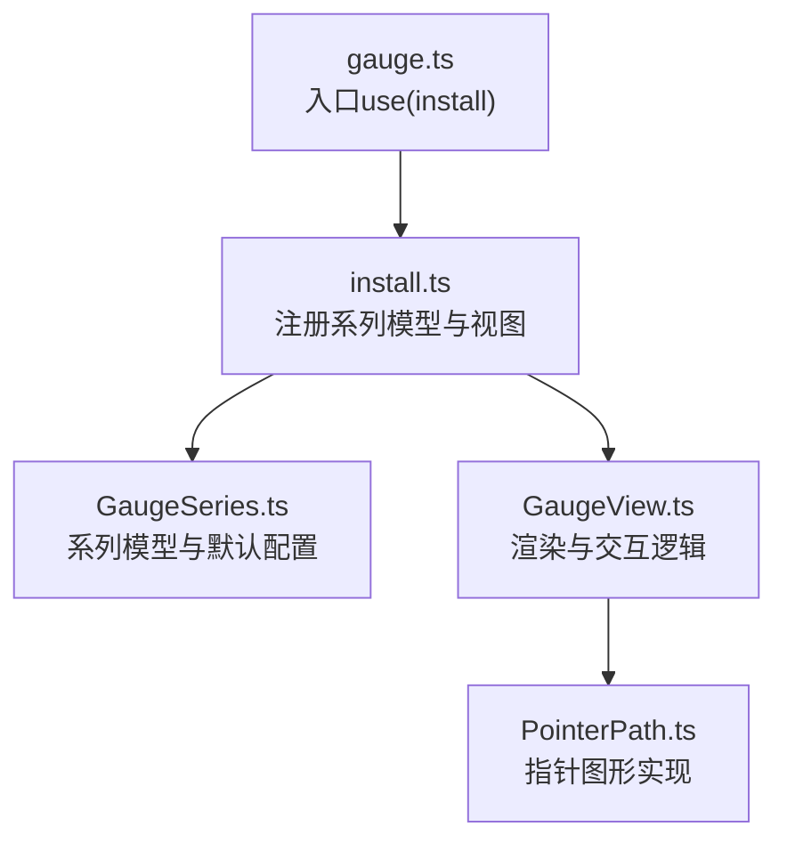
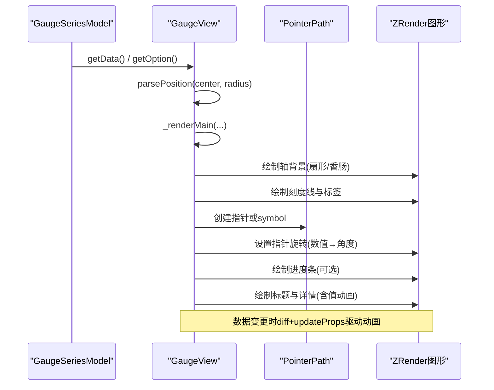
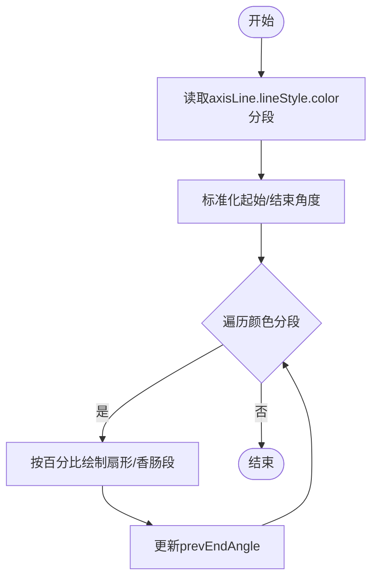
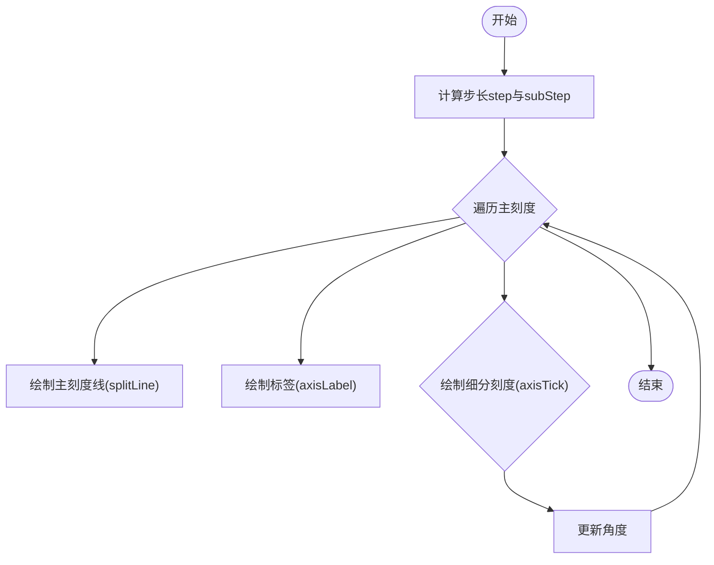
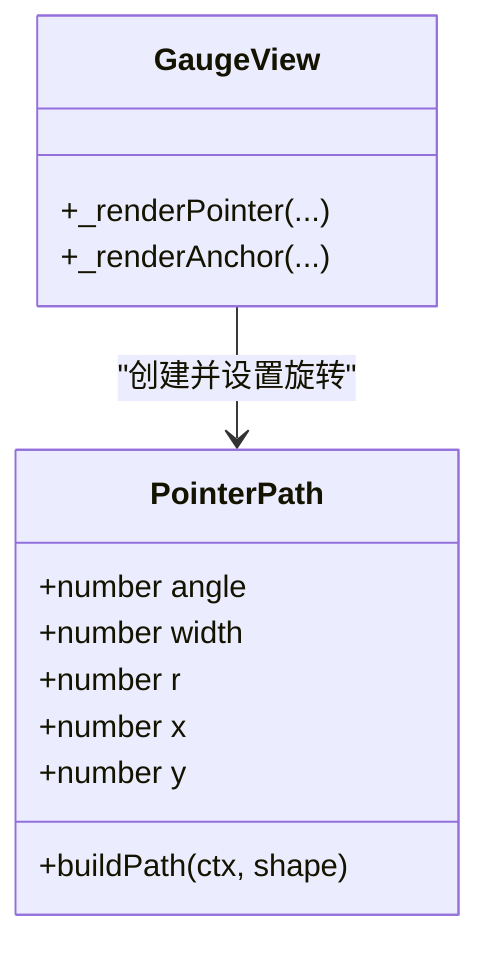
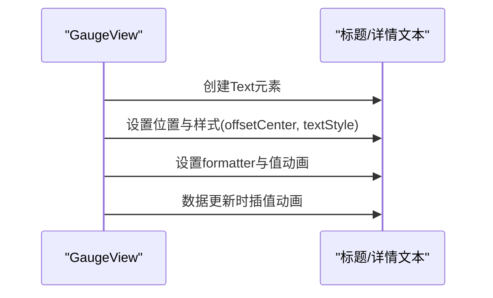
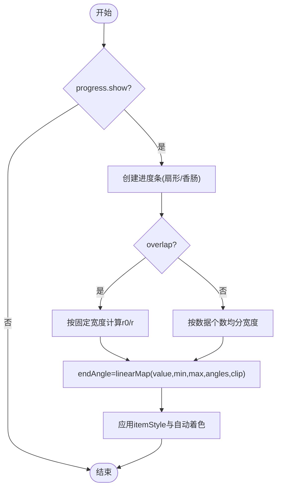
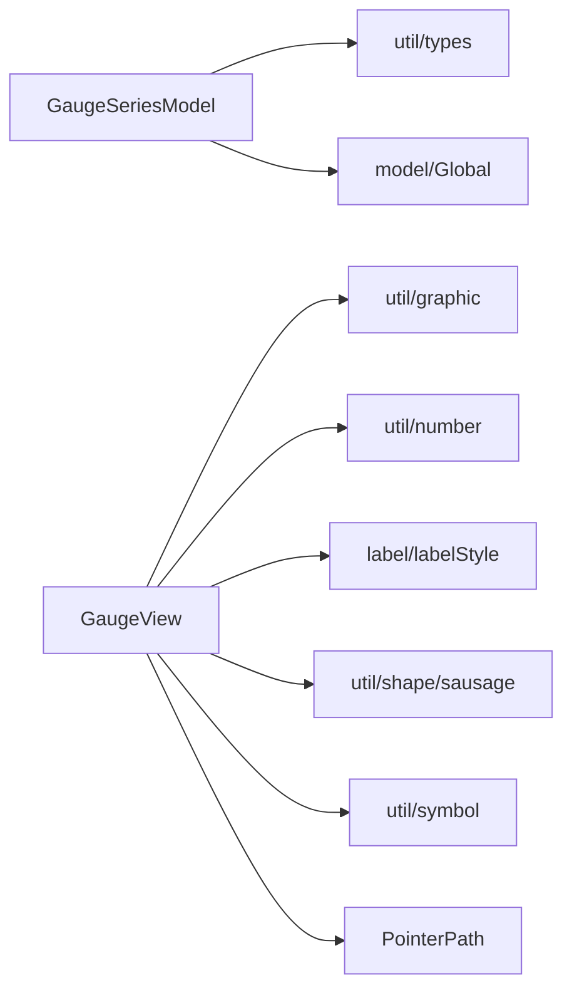

# 仪表盘 (Gauge)

<cite>
**本文引用的文件**
- [src/chart/gauge.ts](file://src/chart/gauge.ts)
- [src/chart/gauge/install.ts](file://src/chart/gauge/install.ts)
- [src/chart/gauge/GaugeSeries.ts](file://src/chart/gauge/GaugeSeries.ts)
- [src/chart/gauge/GaugeView.ts](file://src/chart/gauge/GaugeView.ts)
- [src/chart/gauge/PointerPath.ts](file://src/chart/gauge/PointerPath.ts)
- [test/gauge.html](file://test/gauge.html)
- [test/gauge-simple.html](file://test/gauge-simple.html)
- [test/gauge-progress.html](file://test/gauge-progress.html)
- [test/gauge-pointer.html](file://test/gauge-pointer.html)
</cite>

## 目录
1. [简介](#简介)
2. [项目结构](#项目结构)
3. [核心组件](#核心组件)
4. [架构总览](#架构总览)
5. [详细组件分析](#详细组件分析)
6. [依赖关系分析](#依赖关系分析)
7. [性能与动画](#性能与动画)
8. [故障排查](#故障排查)
9. [结论](#结论)
10. [附录：配置清单与示例路径](#附录配置清单与示例路径)

## 简介
本文件面向 ECharts 的仪表盘（Gauge）图表，系统性说明其核心组件（表盘、指针、刻度、标题、详情等）的配置方法，数据绑定、范围设置、颜色分段、指针动画、进度指示、阈值告警等能力，并提供监控面板、KPI 展示等实际应用场景的实践建议与代码示例路径。同时涵盖响应式设计与移动端适配方案，以及自定义表盘形状、添加装饰元素等高级定制技巧。

## 项目结构
仪表盘由“系列模型 + 视图渲染”两部分组成，并通过安装器注册到 ECharts 扩展系统：
- 入口注册：通过 install 将 GaugeSeriesModel 与 GaugeView 注册为系列模型与图表视图
- 系列模型：定义仪表盘的默认配置项、数据类型、数据维度与样式策略
- 视图渲染：负责绘制表盘背景、刻度线、刻度标签、指针、锚点、标题与详情文本，并处理数据更新与动画

**图示来源**
- [src/chart/gauge.ts:20-23](file://src/chart/gauge.ts#L20-L23)
- [src/chart/gauge/install.ts:20-27](file://src/chart/gauge/install.ts#L20-L27)
- [src/chart/gauge/GaugeSeries.ts:191-327](file://src/chart/gauge/GaugeSeries.ts#L191-L327)
- [src/chart/gauge/GaugeView.ts:76-98](file://src/chart/gauge/GaugeView.ts#L76-L98)
- [src/chart/gauge/PointerPath.ts:34-74](file://src/chart/gauge/PointerPath.ts#L34-L74)

**章节来源**
- [src/chart/gauge.ts:20-23](file://src/chart/gauge.ts#L20-L23)
- [src/chart/gauge/install.ts:20-27](file://src/chart/gauge/install.ts#L20-L27)

## 核心组件
- 表盘（axisLine）：支持圆角端点、多段颜色分段、宽度控制
- 刻度（splitLine/axisTick）：主刻度线与细分刻度线，支持长度、距离、样式
- 刻度标签（axisLabel）：支持格式化、旋转方式（切向/径向/角度）、颜色继承
- 指针（pointer）：内置指针或自定义图标（path/image），支持长度、宽度、偏移、保持宽高比
- 锚点（anchor）：中心装饰点，可显示于指针上方或下方，支持图标与尺寸
- 标题（title）与详情（detail）：支持位置偏移、富文本、值动画、格式化
- 进度条（progress）：可选显示，支持重叠模式、圆角、裁剪、自动着色

上述组件均提供丰富的样式与行为选项，详见后续“详细组件分析”。

**章节来源**
- [src/chart/gauge/GaugeSeries.ts:146-189](file://src/chart/gauge/GaugeSeries.ts#L146-L189)
- [src/chart/gauge/GaugeSeries.ts:202-327](file://src/chart/gauge/GaugeSeries.ts#L202-L327)
- [src/chart/gauge/GaugeView.ts:102-198](file://src/chart/gauge/GaugeView.ts#L102-L198)

## 架构总览
仪表盘的数据流与渲染流程如下：
- 数据进入系列模型，生成 SeriesData
- 视图在 render 中解析位置与半径，计算角度范围
- 根据 axisLine 的颜色分段绘制背景扇形
- 绘制刻度线与刻度标签
- 绘制指针与进度条，应用数值到角度的线性映射
- 绘制标题与详情文本，支持值动画
- 数据更新时，使用 diff 机制增量更新指针与进度条，触发动画

**图示来源**
- [src/chart/gauge/GaugeView.ts:46-98](file://src/chart/gauge/GaugeView.ts#L46-L98)
- [src/chart/gauge/GaugeView.ts:102-198](file://src/chart/gauge/GaugeView.ts#L102-L198)
- [src/chart/gauge/GaugeView.ts:367-578](file://src/chart/gauge/GaugeView.ts#L367-L578)
- [src/chart/gauge/GaugeView.ts:606-721](file://src/chart/gauge/GaugeView.ts#L606-L721)
- [src/chart/gauge/PointerPath.ts:48-74](file://src/chart/gauge/PointerPath.ts#L48-L74)

## 详细组件分析

### 表盘（axisLine）与颜色分段
- 支持 roundCap 圆角端点；lineStyle.width 控制粗细
- color 分段以 [百分比, 颜色] 数组形式定义，用于背景扇形着色
- 颜色选择函数根据当前值映射到对应分段颜色，用于刻度、标签、指针、进度条的自动着色

**图示来源**
- [src/chart/gauge/GaugeView.ts:102-165](file://src/chart/gauge/GaugeView.ts#L102-L165)
- [src/chart/gauge/GaugeView.ts:166-181](file://src/chart/gauge/GaugeView.ts#L166-L181)

**章节来源**
- [src/chart/gauge/GaugeSeries.ts:146-152](file://src/chart/gauge/GaugeSeries.ts#L146-L152)
- [src/chart/gauge/GaugeSeries.ts:220-228](file://src/chart/gauge/GaugeSeries.ts#L220-L228)
- [src/chart/gauge/GaugeView.ts:102-181](file://src/chart/gauge/GaugeView.ts#L102-L181)

### 刻度（splitLine/axisTick）与标签（axisLabel）
- splitNumber 控制主刻度数量，axisTick.splitNumber 控制细分刻度
- length/distance 控制刻度线与标签相对半径的位置
- axisLabel.rotate 支持 'tangential'、'radial' 或角度值
- 标签文本可通过 formatter 自定义，颜色可继承分段色

**图示来源**
- [src/chart/gauge/GaugeView.ts:200-365](file://src/chart/gauge/GaugeView.ts#L200-L365)

**章节来源**
- [src/chart/gauge/GaugeSeries.ts:156-180](file://src/chart/gauge/GaugeSeries.ts#L156-L180)
- [src/chart/gauge/GaugeSeries.ts:239-275](file://src/chart/gauge/GaugeSeries.ts#L239-L275)
- [src/chart/gauge/GaugeView.ts:200-365](file://src/chart/gauge/GaugeView.ts#L200-L365)

### 指针（pointer）与锚点（anchor）
- pointer.icon 支持内置符号或 path/image；length/width 控制尺寸；offsetCenter 控制相对中心偏移；keepAspect 保持宽高比
- anchor 为中心装饰点，可置于指针上方或下方，支持图标与尺寸
- 指针旋转角度由数值线性映射到角度范围，支持 NaN 值处理

**图示来源**
- [src/chart/gauge/PointerPath.ts:22-74](file://src/chart/gauge/PointerPath.ts#L22-L74)
- [src/chart/gauge/GaugeView.ts:367-578](file://src/chart/gauge/GaugeView.ts#L367-L578)
- [src/chart/gauge/GaugeView.ts:580-604](file://src/chart/gauge/GaugeView.ts#L580-L604)

**章节来源**
- [src/chart/gauge/GaugeSeries.ts:48-73](file://src/chart/gauge/GaugeSeries.ts#L48-L73)
- [src/chart/gauge/GaugeSeries.ts:276-297](file://src/chart/gauge/GaugeSeries.ts#L276-L297)
- [src/chart/gauge/GaugeView.ts:367-604](file://src/chart/gauge/GaugeView.ts#L367-L604)

### 标题（title）与详情（detail）
- offsetCenter 控制相对中心的偏移；formatter 支持字符串模板或回调
- valueAnimation 开启后，详情文本随数值变化进行插值动画
- 支持富文本样式（fontSize、fontWeight、backgroundColor、borderRadius 等）

**图示来源**
- [src/chart/gauge/GaugeView.ts:606-721](file://src/chart/gauge/GaugeView.ts#L606-L721)

**章节来源**
- [src/chart/gauge/GaugeSeries.ts:84-108](file://src/chart/gauge/GaugeSeries.ts#L84-L108)
- [src/chart/gauge/GaugeSeries.ts:299-325](file://src/chart/gauge/GaugeSeries.ts#L299-L325)
- [src/chart/gauge/GaugeView.ts:606-721](file://src/chart/gauge/GaugeView.ts#L606-L721)

### 进度条（progress）
- show 控制是否显示；overlap 控制多数据时是否重叠；roundCap 控制端点圆角；clip 控制是否裁剪超出角度
- 支持 itemStyle.color='auto' 自动着色；z2 层级控制
- 多数据场景下，宽度可按数据个数均分或重叠显示

**图示来源**
- [src/chart/gauge/GaugeView.ts:436-578](file://src/chart/gauge/GaugeView.ts#L436-L578)

**章节来源**
- [src/chart/gauge/GaugeSeries.ts:75-82](file://src/chart/gauge/GaugeSeries.ts#L75-L82)
- [src/chart/gauge/GaugeSeries.ts:230-237](file://src/chart/gauge/GaugeSeries.ts#L230-L237)
- [src/chart/gauge/GaugeView.ts:436-578](file://src/chart/gauge/GaugeView.ts#L436-L578)

## 依赖关系分析
- 系列模型依赖类型定义与全局模型，提供默认配置与数据初始化
- 视图依赖图形工具、数字工具、标签样式工具、形状库（Sausage/Sector）与 Symbol 创建
- 指针图形基于 ZRender Path 自定义实现
- 示例页面展示了多种组合用法与动态更新

**图示来源**
- [src/chart/gauge/GaugeSeries.ts:20-39](file://src/chart/gauge/GaugeSeries.ts#L20-L39)
- [src/chart/gauge/GaugeView.ts:20-36](file://src/chart/gauge/GaugeView.ts#L20-L36)
- [src/chart/gauge/PointerPath.ts:20-28](file://src/chart/gauge/PointerPath.ts#L20-L28)

**章节来源**
- [src/chart/gauge/GaugeSeries.ts:20-39](file://src/chart/gauge/GaugeSeries.ts#L20-L39)
- [src/chart/gauge/GaugeView.ts:20-36](file://src/chart/gauge/GaugeView.ts#L20-L36)

## 性能与动画
- 数据更新采用 diff 机制，仅对新增/更新的数据项创建或更新图形元素，减少重绘开销
- 指针与进度条通过 updateProps/initProps 驱动动画，支持数值到角度的平滑过渡
- 详情文本支持值动画，提升视觉反馈
- 多数据场景下，progress.overlap=false 会按数据个数均分宽度，避免过度重叠导致渲染压力

优化建议：
- 合理设置 splitNumber 与 axisTick.splitNumber，避免过多刻度造成性能下降
- 大量数据时考虑关闭不必要的动画或降低动画时长
- 使用 clip 控制进度条裁剪，避免超出范围的多余绘制

[本节为通用指导，不直接分析具体文件]

## 故障排查
常见问题与定位思路：
- 指针不旋转或角度异常：检查 min/max 与 startAngle/endAngle 配置，确认数值是否在范围内；NaN 值会被映射到起始角度
- 进度条显示异常：确认 progress.clip 与 overlap 设置；多数据时宽度分配是否正确
- 标签错位或重叠：调整 axisLabel.distance 与 rotate；必要时使用富文本布局
- 颜色分段不生效：确保 axisLine.lineStyle.color 分段顺序正确且覆盖全范围

参考示例与源码路径：
- 指针与锚点配置：[test/gauge-pointer.html](file://test/gauge-pointer.html)
- 进度条与裁剪：[test/gauge-progress.html](file://test/gauge-progress.html)
- 简单仪表盘与数据集：[test/gauge-simple.html](file://test/gauge-simple.html)
- 综合仪表盘示例：[test/gauge.html](file://test/gauge.html)
- 视图渲染逻辑：[src/chart/gauge/GaugeView.ts:367-578](file://src/chart/gauge/GaugeView.ts#L367-L578)

**章节来源**
- [test/gauge-pointer.html:59-639](file://test/gauge-pointer.html#L59-L639)
- [test/gauge-progress.html:57-409](file://test/gauge-progress.html#L57-L409)
- [test/gauge-simple.html:58-257](file://test/gauge-simple.html#L58-L257)
- [test/gauge.html:39-506](file://test/gauge.html#L39-L506)
- [src/chart/gauge/GaugeView.ts:367-578](file://src/chart/gauge/GaugeView.ts#L367-L578)

## 结论
ECharts 仪表盘提供了完整的可视化能力，涵盖表盘、刻度、指针、标题、详情与进度条等核心组件，支持丰富的样式与行为配置。通过数据绑定、范围设置与颜色分段，可实现从简单 KPI 到复杂监控面板的多类场景。结合响应式布局与动画机制，可在桌面与移动端提供良好的用户体验。高级定制方面，借助自定义指针图标、锚点装饰与富文本，可灵活满足品牌化与业务需求。

[本节为总结性内容，不直接分析具体文件]

## 附录：配置清单与示例路径

### 关键配置项速查
- 范围与方向：min、max、startAngle、endAngle、clockwise、splitNumber
- 表盘：axisLine.show、axisLine.roundCap、axisLine.lineStyle.width、axisLine.lineStyle.color（分段）
- 刻度：splitLine.show、splitLine.length、splitLine.distance、splitLine.lineStyle；axisTick.show、axisTick.splitNumber、axisTick.length、axisTick.distance、axisTick.lineStyle
- 标签：axisLabel.show、axisLabel.formatter、axisLabel.rotate、axisLabel.distance、axisLabel.color
- 指针：pointer.show、pointer.icon、pointer.length、pointer.width、pointer.offsetCenter、pointer.keepAspect、pointer.itemStyle
- 锚点：anchor.show、anchor.size、anchor.icon、anchor.offsetCenter、anchor.keepAspect、anchor.itemStyle、anchor.showAbove
- 标题/详情：title.show、title.formatter、title.offsetCenter、title.valueAnimation；detail.show、detail.formatter、detail.offsetCenter、detail.valueAnimation、detail.width/height/padding/borderRadius
- 进度条：progress.show、progress.overlap、progress.width、progress.roundCap、progress.clip、progress.itemStyle

### 实际应用场景与示例路径
- 监控面板（速度表、转速表、油表、水表组合）：[test/gauge.html](file://test/gauge.html)
- 简单仪表盘与数据集绑定：[test/gauge-simple.html](file://test/gauge-simple.html)
- 进度条与裁剪、多数据叠加：[test/gauge-progress.html](file://test/gauge-progress.html)
- 指针与锚点自定义、时钟效果：[test/gauge-pointer.html](file://test/gauge-pointer.html)

### 响应式设计与移动端适配
- 使用 center 与 radius 百分比定位与缩放，适应不同屏幕尺寸
- 通过 label 与 detail 的富文本与对齐方式优化小屏可读性
- 适当减少刻度密度与动画强度以提升移动端性能

[本节为配置与示例汇总，不直接分析具体文件]