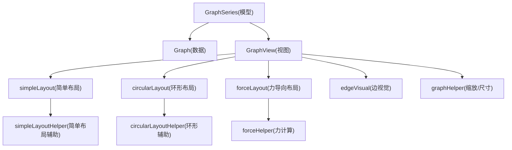
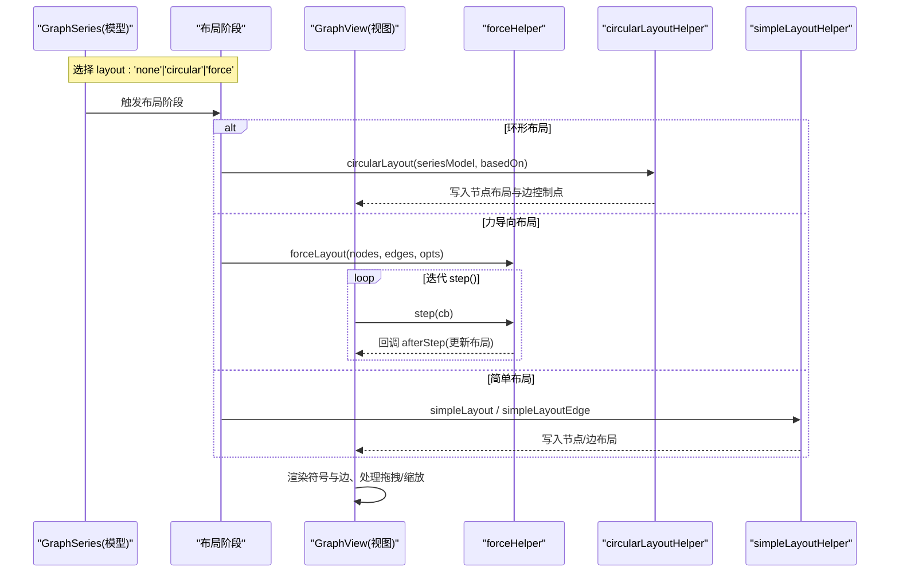
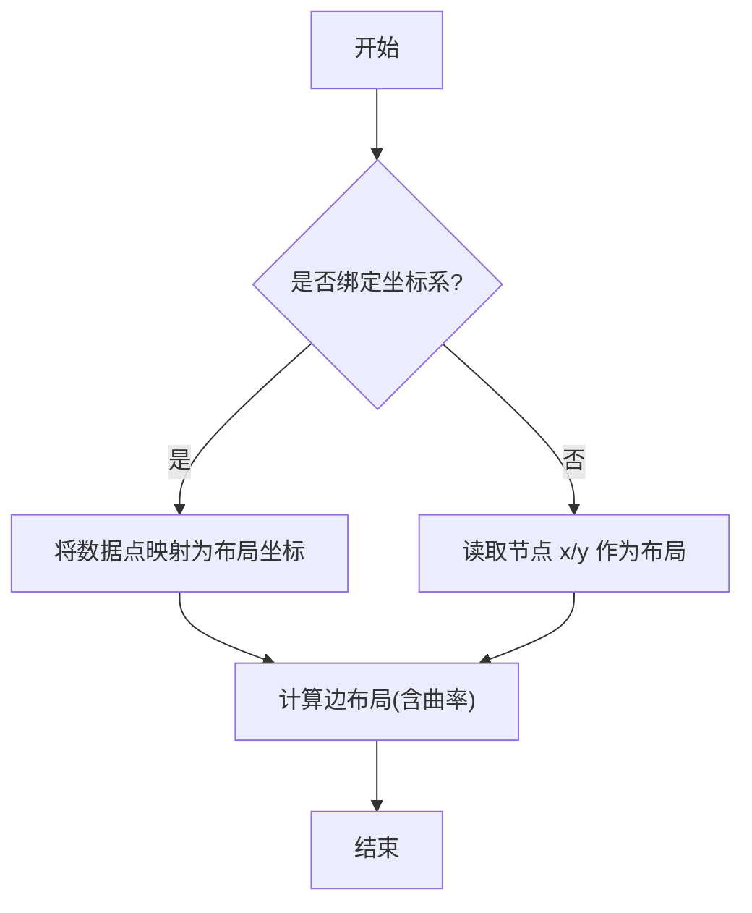
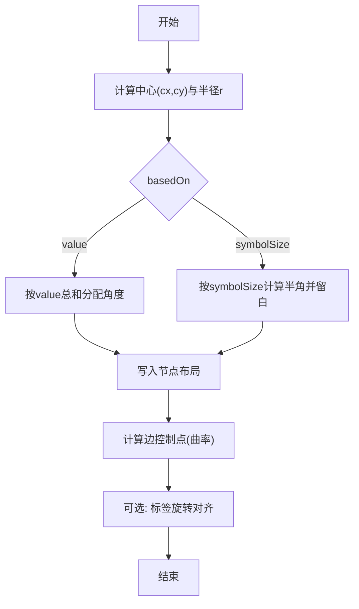
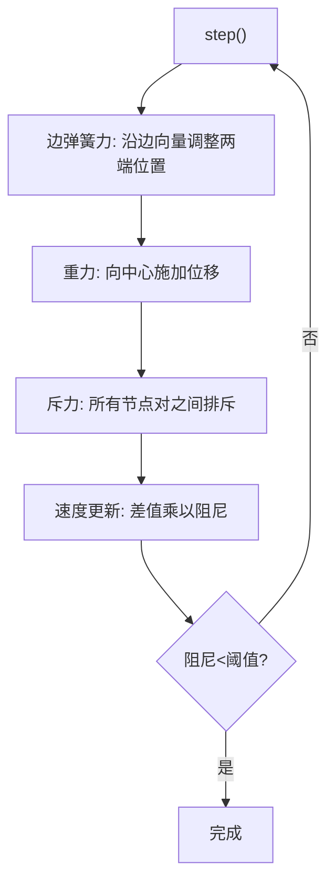
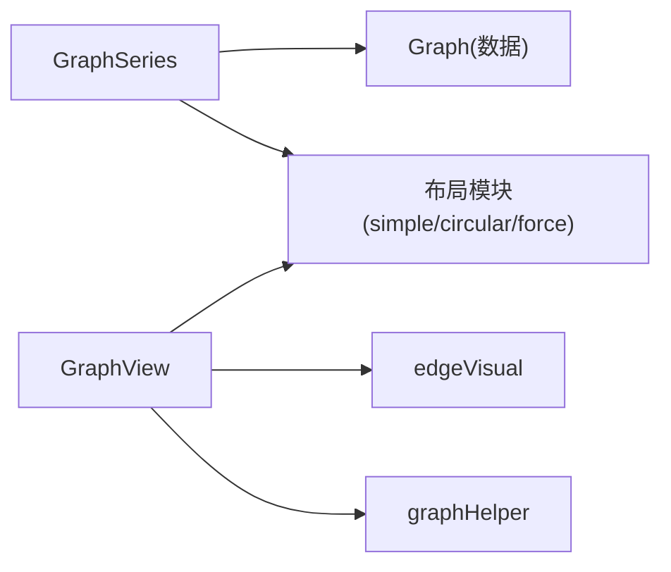

# 关系图（Graph）

<cite>
**本文引用的文件**
- [src/chart/graph.ts](file://src/chart/graph.ts)
- [src/chart/graph/GraphSeries.ts](file://src/chart/graph/GraphSeries.ts)
- [src/chart/graph/GraphView.ts](file://src/chart/graph/GraphView.ts)
- [src/data/Graph.ts](file://src/data/Graph.ts)
- [src/chart/graph/forceLayout.ts](file://src/chart/graph/forceLayout.ts)
- [src/chart/graph/forceHelper.ts](file://src/chart/graph/forceHelper.ts)
- [src/chart/graph/circularLayout.ts](file://src/chart/graph/circularLayout.ts)
- [src/chart/graph/circularLayoutHelper.ts](file://src/chart/graph/circularLayoutHelper.ts)
- [src/chart/graph/simpleLayout.ts](file://src/chart/graph/simpleLayout.ts)
- [src/chart/graph/simpleLayoutHelper.ts](file://src/chart/graph/simpleLayoutHelper.ts)
- [src/chart/graph/graphHelper.ts](file://src/chart/graph/graphHelper.ts)
- [src/chart/graph/edgeVisual.ts](file://src/chart/graph/edgeVisual.ts)
</cite>

## 目录
1. [简介](#简介)
2. [项目结构](#项目结构)
3. [核心组件](#核心组件)
4. [架构总览](#架构总览)
5. [详细组件分析](#详细组件分析)
6. [依赖关系分析](#依赖关系分析)
7. [性能考虑](#性能考虑)
8. [故障排查指南](#故障排查指南)
9. [结论](#结论)
10. [附录](#附录)

## 简介
本文件围绕 ECharts 的关系图（Graph）能力，系统性阐述其核心概念、数据结构、布局算法（力导向、环形、简单布局）、样式配置、交互能力（拖拽、缩放、高亮），以及大数据量下的性能优化策略与与数据缩放、工具栏等组件的集成方式。文档同时提供复杂网络可视化示例（如社交网络分析、知识图谱展示）的实践建议。

## 项目结构
关系图由“模型-视图-布局-数据”四层构成：
- 模型层：定义系列选项、默认值、类别与视觉映射入口
- 数据层：Graph/GraphNode/GraphEdge 抽象节点与边，维护邻接关系与遍历能力
- 布局层：simpleLayout、circularLayout、forceLayout 三种布局策略
- 视图层：GraphView 负责渲染符号与连线、处理拖拽与缩放、缩略图桥接

图表来源
- [src/chart/graph/GraphSeries.ts:237-516](file://src/chart/graph/GraphSeries.ts#L237-L516)
- [src/data/Graph.ts:32-607](file://src/data/Graph.ts#L32-L607)
- [src/chart/graph/GraphView.ts:56-432](file://src/chart/graph/GraphView.ts#L56-L432)
- [src/chart/graph/simpleLayout.ts:28-67](file://src/chart/graph/simpleLayout.ts#L28-L67)
- [src/chart/graph/circularLayout.ts:25-33](file://src/chart/graph/circularLayout.ts#L25-L33)
- [src/chart/graph/forceLayout.ts:40-169](file://src/chart/graph/forceLayout.ts#L40-L169)
- [src/chart/graph/forceHelper.ts:74-227](file://src/chart/graph/forceHelper.ts#L74-L227)
- [src/chart/graph/circularLayoutHelper.ts:53-235](file://src/chart/graph/circularLayoutHelper.ts#L53-L235)
- [src/chart/graph/simpleLayoutHelper.ts:27-61](file://src/chart/graph/simpleLayoutHelper.ts#L27-L61)
- [src/chart/graph/edgeVisual.ts:36-83](file://src/chart/graph/edgeVisual.ts#L36-L83)
- [src/chart/graph/graphHelper.ts:24-40](file://src/chart/graph/graphHelper.ts#L24-L40)

章节来源
- [src/chart/graph.ts:21-24](file://src/chart/graph.ts#L21-L24)
- [src/chart/graph/GraphSeries.ts:237-516](file://src/chart/graph/GraphSeries.ts#L237-L516)
- [src/chart/graph/GraphView.ts:56-432](file://src/chart/graph/GraphView.ts#L56-L432)

## 核心组件
- GraphSeries（模型）
  - 定义关系图的系列选项（节点/边样式、布局类型、力导向参数、拖拽、漫游等）
  - 构建 categories 数据、提供 tooltip 格式化、默认项与主题合并
- Graph（数据）
  - 管理 nodes/edges、邻接表、索引映射、遍历（BFS）、更新与克隆
  - 为 Node/Edge 注入通用代理方法（getValue/setLayout/getLayout/getGraphicEl 等）
- GraphView（视图）
  - 渲染节点符号与边线、处理拖拽事件、启动力导向迭代、更新标签旋转、缩略图桥接
- 布局模块
  - simpleLayout：基于 x/y 或坐标系映射的简单布局
  - circularLayout：环形布局，支持按 value 或 symbolSize 分配角度，支持拖动节点重算
  - forceLayout：力导向布局，含引力、斥力、阻尼、固定点、曲率边等
- 辅助模块
  - edgeVisual：边的视觉属性（端点符号、线样式、颜色继承等）
  - graphHelper：全局缩放补偿、符号尺寸读取

章节来源
- [src/chart/graph/GraphSeries.ts:237-516](file://src/chart/graph/GraphSeries.ts#L237-L516)
- [src/data/Graph.ts:32-607](file://src/data/Graph.ts#L32-L607)
- [src/chart/graph/GraphView.ts:56-432](file://src/chart/graph/GraphView.ts#L56-L432)
- [src/chart/graph/edgeVisual.ts:36-83](file://src/chart/graph/edgeVisual.ts#L36-L83)
- [src/chart/graph/graphHelper.ts:24-40](file://src/chart/graph/graphHelper.ts#L24-L40)

## 架构总览
关系图在渲染管线中通过阶段处理器注册布局与视觉计算，视图层统一协调布局迭代与绘制。

图表来源
- [src/chart/graph/forceLayout.ts:40-169](file://src/chart/graph/forceLayout.ts#L40-L169)
- [src/chart/graph/circularLayout.ts:25-33](file://src/chart/graph/circularLayout.ts#L25-L33)
- [src/chart/graph/simpleLayout.ts:28-67](file://src/chart/graph/simpleLayout.ts#L28-L67)
- [src/chart/graph/GraphView.ts:99-240](file://src/chart/graph/GraphView.ts#L99-L240)

## 详细组件分析

### 数据模型：Graph / GraphNode / GraphEdge
- Graph
  - 维护 nodes/edges 列表与 Map 索引，支持 addNode/addEdge/getNodeById/getEdgeByIndex
  - 提供 eachNode/eachEdge/breadthFirstTraverse 遍历接口
  - update 同步 dataIndex，过滤无效边
- GraphNode
  - 记录 inEdges/outEdges/edges，degree/inDegree/outDegree
  - getAdjacentDataIndices/getTrajectoryDataIndices 用于高亮/轨迹关联
- GraphEdge
  - 记录 node1/node2，getAdjacentDataIndices/getTrajectoryDataIndices
- 代理混入
  - getValue/setLayout/getLayout/getGraphicEl/getRawIndex 等通过 mixin 注入到 Node/Edge

复杂度与特性
- 邻接表 O(1) 查找；遍历 O(V+E)；BFS O(V+E)
- 适合大规模图的高亮与轨迹联动

章节来源
- [src/data/Graph.ts:32-607](file://src/data/Graph.ts#L32-L607)

### 布局算法

#### 简单布局（simpleLayout）
- 行为
  - 若存在坐标系且非 view，则使用坐标映射将数据点转为布局坐标
  - 否则读取节点 x/y 作为布局位置，并计算边路径（含曲率）
- 适用场景
  - 已有明确坐标的数据、或与网格/地理等坐标系绑定的图

图表来源
- [src/chart/graph/simpleLayout.ts:30-67](file://src/chart/graph/simpleLayout.ts#L30-L67)
- [src/chart/graph/simpleLayoutHelper.ts:27-61](file://src/chart/graph/simpleLayoutHelper.ts#L27-L61)

章节来源
- [src/chart/graph/simpleLayout.ts:28-67](file://src/chart/graph/simpleLayout.ts#L28-L67)
- [src/chart/graph/simpleLayoutHelper.ts:27-61](file://src/chart/graph/simpleLayoutHelper.ts#L27-L61)

#### 环形布局（circularLayout）
- 行为
  - 以画布中心为圆心，半径取宽高最小值的一半
  - 支持两种 basedOn：value（按数值占比分配角度）或 symbolSize（按符号尺寸分配角度避免重叠）
  - 支持拖动单个节点后重新计算布局，并自动调整标签方向（rotateLabel）
- 适用场景
  - 分类/层级关系的直观展示，强调对称性与可读性

图表来源
- [src/chart/graph/circularLayoutHelper.ts:53-235](file://src/chart/graph/circularLayoutHelper.ts#L53-L235)
- [src/chart/graph/circularLayout.ts:25-33](file://src/chart/graph/circularLayout.ts#L25-L33)

章节来源
- [src/chart/graph/circularLayout.ts:25-33](file://src/chart/graph/circularLayout.ts#L25-L33)
- [src/chart/graph/circularLayoutHelper.ts:53-235](file://src/chart/graph/circularLayoutHelper.ts#L53-L235)

#### 力导向布局（forceLayout）
- 行为
  - 初始化节点位置（随机或 initLayout 指定）
  - 每步迭代：弹簧力（边长约束）、重力（向中心）、斥力（节点间）、阻尼衰减
  - 支持 fixed 节点、ignoreForceLayout 边、边曲率（curveness）
  - 通过 beforeStep/afterStep 钩子读写布局，视图层驱动动画步进
- 适用场景
  - 无先验坐标的大规模网络，强调拓扑结构与聚类效果

图表来源
- [src/chart/graph/forceHelper.ts:152-225](file://src/chart/graph/forceHelper.ts#L152-L225)
- [src/chart/graph/forceLayout.ts:40-169](file://src/chart/graph/forceLayout.ts#L40-L169)

章节来源
- [src/chart/graph/forceLayout.ts:40-169](file://src/chart/graph/forceLayout.ts#L40-L169)
- [src/chart/graph/forceHelper.ts:74-227](file://src/chart/graph/forceHelper.ts#L74-L227)

### 样式与视觉

#### 节点样式
- 可通过 itemStyle、label、emphasis、select、blur 等配置节点外观与状态
- 支持 category 继承样式，symbol/symbolSize 控制形状与大小
- 拖拽时 draggable/cursor 控制交互体验

#### 边样式
- lineStyle 控制线条颜色、宽度、透明度、曲率（curveness）
- edgeSymbol/edgeSymbolSize 控制边两端箭头或标记
- 支持从节点样式继承边颜色（source/target）

章节来源
- [src/chart/graph/GraphSeries.ts:66-233](file://src/chart/graph/GraphSeries.ts#L66-L233)
- [src/chart/graph/edgeVisual.ts:36-83](file://src/chart/graph/edgeVisual.ts#L36-L83)

### 交互功能

#### 拖拽
- 节点可设置 draggable，拖拽过程中：
  - 力导向：warmUp 并重启迭代，固定当前节点，写回布局
  - 环形：写回布局并重新计算环形分布
  - 简单：写回布局并更新边
- 拖拽结束释放固定状态（力导向）

#### 缩放与漫游
- 支持 roam 与 zoom，视图层根据缩放比例调整节点符号大小（nodeScaleRatio）
- 缩放时更新边接触点（adjustEdge）与标签布局

#### 高亮
- emphasis.focus 支持 adjacency（高亮相邻节点/边）
- 通过 getAdjacentDataIndices/getTrajectoryDataIndices 快速定位关联数据

章节来源
- [src/chart/graph/GraphView.ts:157-225](file://src/chart/graph/GraphView.ts#L157-L225)
- [src/data/Graph.ts:375-445](file://src/data/Graph.ts#L375-L445)
- [src/data/Graph.ts:482-538](file://src/data/Graph.ts#L482-L538)

### 复杂网络可视化示例与实践

- 社交网络分析
  - 使用力导向布局展现社区聚类，结合 categories 区分群体
  - 利用 tooltip 显示关系名称与权重，配合 legend 筛选
  - 开启 roam 实现探索式浏览，必要时启用 dataZoom 聚焦局部

- 知识图谱展示
  - 环形布局适合层次化知识体系，按 symbolSize 避免重叠
  - 使用边曲率区分多重关系，标签 rotateLabel 提升可读性
  - 结合 toolbox 导出图片/保存配置，便于分享

- 多实例与联动
  - 多个关系图可共享数据源，通过 connect 联动选择与高亮
  - 缩略图（thumbnail）辅助导航大图区域

[本节为概念性说明，不直接分析具体文件]

## 依赖关系分析
- GraphSeries 依赖 Graph 数据与各类布局模块，提供默认选项与视觉映射入口
- GraphView 依赖布局结果与绘图辅助（SymbolDraw/LineDraw），并管理 RoamController
- 布局模块相互独立，通过 seriesModel 与 data.graph 协作
- edgeVisual 在整体阶段统一设置边的视觉属性

图表来源
- [src/chart/graph/GraphSeries.ts:237-516](file://src/chart/graph/GraphSeries.ts#L237-L516)
- [src/chart/graph/GraphView.ts:56-432](file://src/chart/graph/GraphView.ts#L56-L432)
- [src/chart/graph/edgeVisual.ts:36-83](file://src/chart/graph/edgeVisual.ts#L36-L83)
- [src/chart/graph/graphHelper.ts:24-40](file://src/chart/graph/graphHelper.ts#L24-L40)

章节来源
- [src/chart/graph/GraphSeries.ts:237-516](file://src/chart/graph/GraphSeries.ts#L237-L516)
- [src/chart/graph/GraphView.ts:56-432](file://src/chart/graph/GraphView.ts#L56-L432)

## 性能考虑
- 大数据量渲染优化
  - 使用力导向布局时，合理设置 repulsion/edgeLength/friction/gravity，减少迭代次数
  - 启用 layoutAnimation=false 关闭布局动画以提升初始渲染速度
  - 对边使用 ignoreForceLayout 排除不参与计算的边，降低计算开销
- 内存与元素复用
  - 视图层在缩略图渲染中复制图形元素，注意在大图中谨慎使用以避免额外内存占用
  - 逐步更新布局（step 回调）避免主线程阻塞
- 缩放与标签
  - 缩放时仅更新必要部分（updateLayout），并通过 adjustEdge 修正边接触点
  - 标签布局仅在缩放时刷新，减少频繁重排

[本节为通用性能指导，不直接分析具体文件]

## 故障排查指南
- 节点不显示或位置异常
  - 检查节点是否有有效坐标（简单布局需 x/y 或坐标系映射）
  - 力导向未收敛：增大 friction 或减小 repulsion，或延长迭代时间
- 边重叠或不可见
  - 设置合适的 curveness 或使用 autoCurveness 自动区分多重边
  - 确认 lineStyle 颜色与透明度可见
- 拖拽无效
  - 确保 draggable=true，且 cursor 正确设置
  - 力导向下确认 setFixed/setUnfixed 调用时机
- 缩放后节点大小变化异常
  - 检查 nodeScaleRatio 与 getNodeGlobalScale 补偿逻辑
  - 确认 roam 与 zoom 配置生效

章节来源
- [src/chart/graph/GraphView.ts:157-225](file://src/chart/graph/GraphView.ts#L157-L225)
- [src/chart/graph/forceHelper.ts:152-225](file://src/chart/graph/forceHelper.ts#L152-L225)
- [src/chart/graph/graphHelper.ts:24-40](file://src/chart/graph/graphHelper.ts#L24-L40)

## 结论
ECharts 关系图提供了灵活的三类布局（简单、环形、力导向），完善的节点/边样式与交互能力（拖拽、缩放、高亮），并通过数据层 Graph 的高效邻接结构与遍历能力支撑复杂网络分析。结合数据缩放、缩略图与工具栏等组件，可满足社交网络、知识图谱等多种场景的可视化需求。在生产环境中，应关注布局参数调优、动画开关与元素复用，以获得更好的性能表现。

## 附录

### 与数据缩放、工具栏等组件的集成要点
- 数据缩放（dataZoom）
  - 可在关系图上叠加 dataZoom，聚焦局部区域，配合 roam 进行探索
- 工具栏（toolbox）
  - 使用 saveImage 导出当前视图，便于报告与分享
- 缩略图（thumbnail）
  - 视图层在力导向完成后渲染缩略图内容，便于用户快速定位

[本节为概念性说明，不直接分析具体文件]