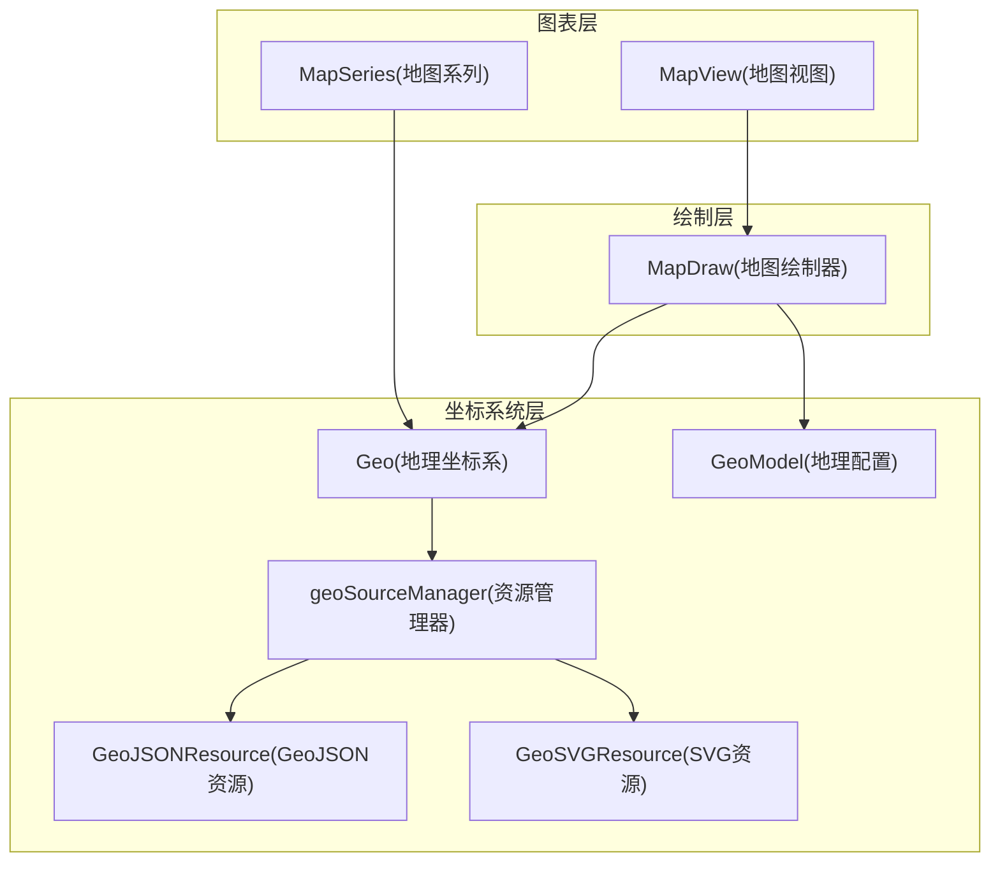
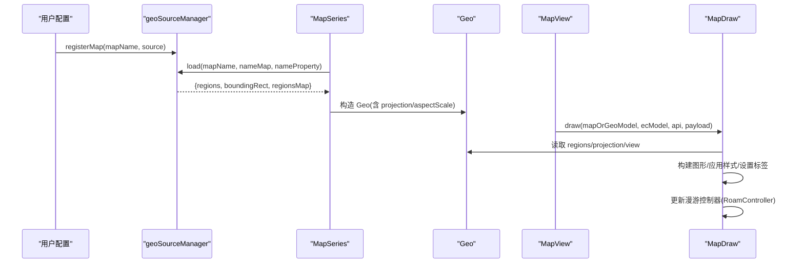
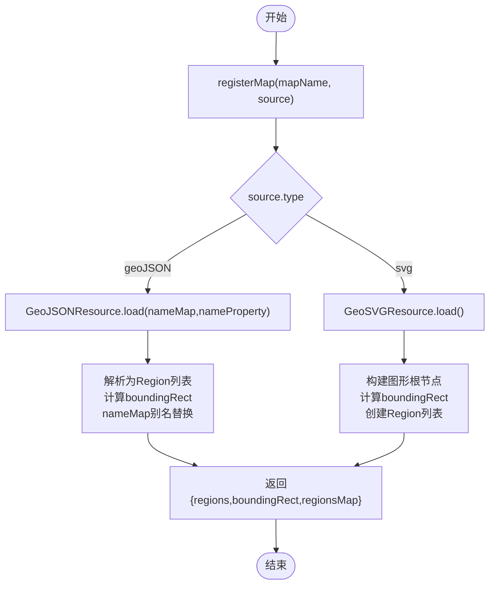
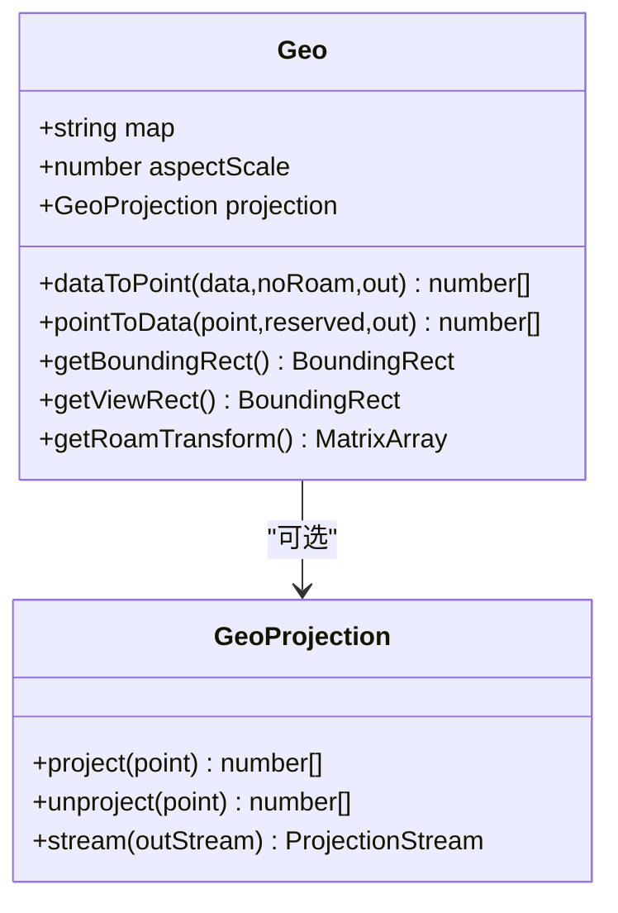
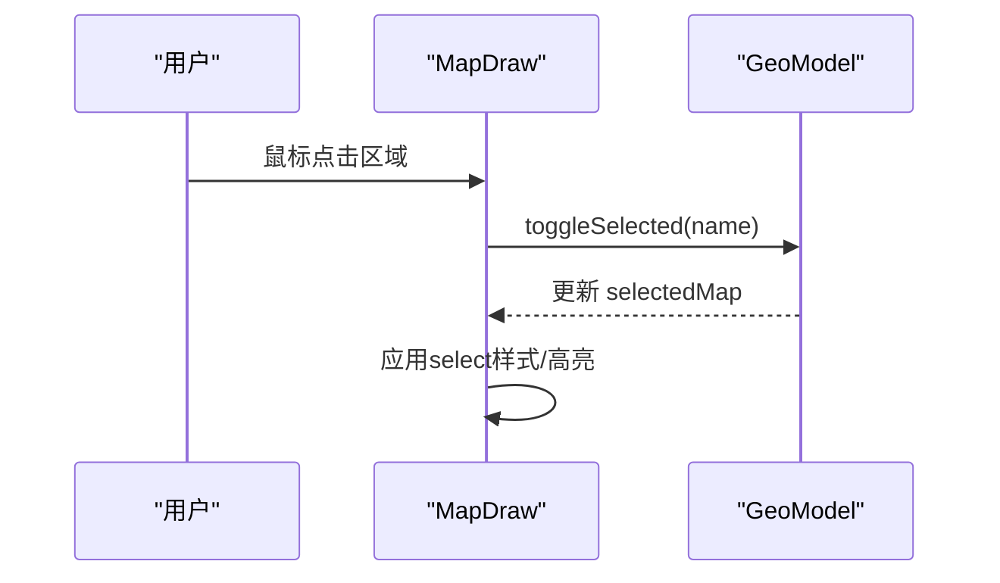
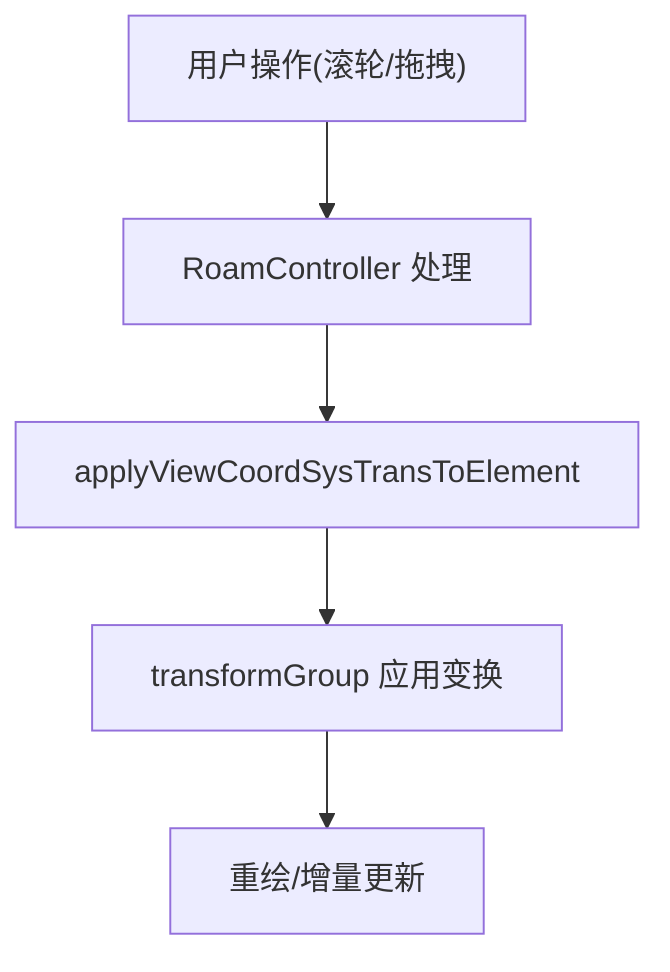
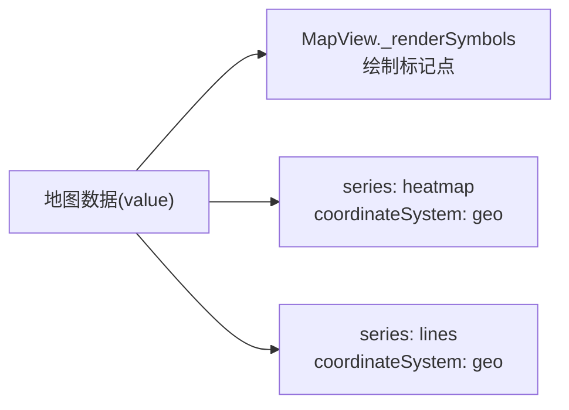
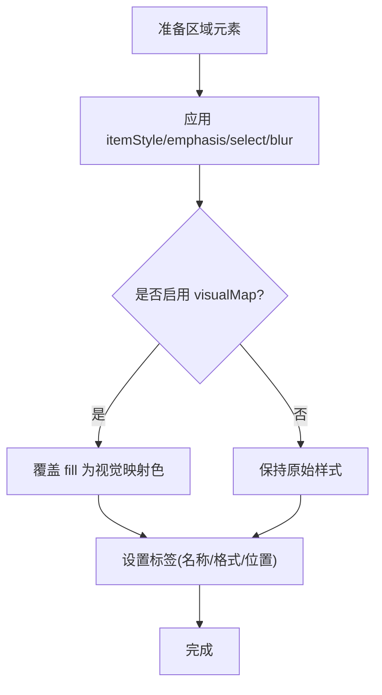
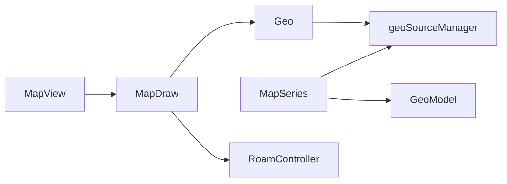

# 地图 (Map)

<cite>
**本文引用的文件**
- [src/chart/map.ts](file://src/chart/map.ts)
- [src/chart/map/install.ts](file://src/chart/map/install.ts)
- [src/chart/map/MapSeries.ts](file://src/chart/map/MapSeries.ts)
- [src/chart/map/MapView.ts](file://src/chart/map/MapView.ts)
- [src/coord/geo/Geo.ts](file://src/coord/geo/Geo.ts)
- [src/coord/geo/GeoModel.ts](file://src/coord/geo/GeoModel.ts)
- [src/coord/geo/geoSourceManager.ts](file://src/coord/geo/geoSourceManager.ts)
- [src/coord/geo/GeoJSONResource.ts](file://src/coord/geo/GeoJSONResource.ts)
- [src/coord/geo/GeoSVGResource.ts](file://src/coord/geo/GeoSVGResource.ts)
- [src/coord/geo/geoTypes.ts](file://src/coord/geo/geoTypes.ts)
- [src/component/helper/MapDraw.ts](file://src/component/helper/MapDraw.ts)
</cite>

## 目录
1. [简介](#简介)
2. [项目结构](#项目结构)
3. [核心组件](#核心组件)
4. [架构总览](#架构总览)
5. [详细组件分析](#详细组件分析)
6. [依赖关系分析](#依赖关系分析)
7. [性能与大数据优化](#性能与大数据优化)
8. [故障排查指南](#故障排查指南)
9. [结论](#结论)
10. [附录：常用配置与示例指引](#附录：常用配置与示例指引)

## 简介
本章节面向 ECharts 的地图能力，系统性说明地图数据的加载与注册机制（支持 GeoJSON 与 SVG）、投影变换、区域选择、缩放平移、标记点/热力图/迁徙线绘制方式、内置地图使用、样式定制与颜色映射、标签显示、地理坐标转换、事件处理以及大数据量下的性能优化与缓存策略。文档基于源码实现进行梳理，帮助读者从原理到实践全面掌握地图功能。

## 项目结构
地图相关代码主要分布在 chart/map、coord/geo、component/helper 三个层次：
- chart/map：地图系列模型与视图，负责数据装配、统计、布局与渲染调度。
- coord/geo：地理坐标系、资源管理、GeoJSON/SVG 资源解析与区域对象。
- component/helper：地图绘制器 MapDraw，负责实际图形构建、交互、样式与标签。

图示来源
- [src/chart/map/MapSeries.ts:117-191](file://src/chart/map/MapSeries.ts#L117-L191)
- [src/chart/map/MapView.ts:32-86](file://src/chart/map/MapView.ts#L32-L86)
- [src/coord/geo/Geo.ts:58-166](file://src/coord/geo/Geo.ts#L58-L166)
- [src/coord/geo/GeoModel.ts:154-245](file://src/coord/geo/GeoModel.ts#L154-L245)
- [src/coord/geo/geoSourceManager.ts:49-147](file://src/coord/geo/geoSourceManager.ts#L49-L147)
- [src/coord/geo/GeoJSONResource.ts:34-95](file://src/coord/geo/GeoJSONResource.ts#L34-L95)
- [src/coord/geo/GeoSVGResource.ts:68-132](file://src/coord/geo/GeoSVGResource.ts#L68-L132)
- [src/component/helper/MapDraw.ts:120-236](file://src/component/helper/MapDraw.ts#L120-L236)

章节来源
- [src/chart/map.ts:20-23](file://src/chart/map.ts#L20-L23)
- [src/chart/map/install.ts:28-37](file://src/chart/map/install.ts#L28-L37)

## 核心组件
- MapSeries：地图系列模型，负责数据初始化、名称映射、值计算、tooltip 格式化、图例图标等；决定是否需要绘制底图。
- MapView：地图视图，协调 MapDraw 的绘制与更新，处理 roam 动作与图例符号。
- Geo：地理坐标系，封装投影、坐标转换、区域查询、视口矩形、漫游变换等。
- GeoModel：地理组件模型，提供 geo 配置项（如 map、aspectScale、boundingCoords、projection、selectedMode 等）与区域选择状态。
- geoSourceManager：地图资源注册与加载中心，统一入口 registerMap/getGeoResource/load。
- GeoJSONResource / GeoSVGResource：分别实现 GeoJSON 与 SVG 资源的解析、区域构建、边界框计算与复用。
- MapDraw：具体绘制逻辑，包括 GeoJSON 多边形/折线构建、SVG 元素复用、样式应用、标签设置、事件绑定、漫游控制器集成。

章节来源
- [src/chart/map/MapSeries.ts:117-421](file://src/chart/map/MapSeries.ts#L117-L421)
- [src/chart/map/MapView.ts:32-210](file://src/chart/map/MapView.ts#L32-L210)
- [src/coord/geo/Geo.ts:58-295](file://src/coord/geo/Geo.ts#L58-L295)
- [src/coord/geo/GeoModel.ts:154-352](file://src/coord/geo/GeoModel.ts#L154-L352)
- [src/coord/geo/geoSourceManager.ts:49-147](file://src/coord/geo/geoSourceManager.ts#L49-L147)
- [src/coord/geo/GeoJSONResource.ts:34-170](file://src/coord/geo/GeoJSONResource.ts#L34-L170)
- [src/coord/geo/GeoSVGResource.ts:68-374](file://src/coord/geo/GeoSVGResource.ts#L68-L374)
- [src/component/helper/MapDraw.ts:120-800](file://src/component/helper/MapDraw.ts#L120-L800)

## 架构总览
下图展示地图从数据注册到渲染的关键流程：用户通过 geoSourceManager.registerMap 注册地图资源；MapSeries 在初始化时通过 geoSourceManager.load 获取区域信息；Geo 根据资源类型与投影参数构建坐标系；MapView 调用 MapDraw 完成绘制，并集成 RoamController 处理缩放平移。

图示来源
- [src/coord/geo/geoSourceManager.ts:81-147](file://src/coord/geo/geoSourceManager.ts#L81-L147)
- [src/chart/map/MapSeries.ts:134-171](file://src/chart/map/MapSeries.ts#L134-L171)
- [src/coord/geo/Geo.ts:86-166](file://src/coord/geo/Geo.ts#L86-L166)
- [src/component/helper/MapDraw.ts:164-236](file://src/component/helper/MapDraw.ts#L164-L236)

## 详细组件分析

### 地图数据加载与注册（GeoJSON 与 SVG）
- 注册接口：geoSourceManager.registerMap 支持两种输入：
  - GeoJSON：可直接传入 GeoJSON 或包含 geoJSON/specialAreas 的对象。
  - SVG：传入 svg 字符串/DOM/SVGElement。
- 加载流程：
  - GeoJSONResource.load 会按 nameProperty 解析为 Region 列表，计算 boundingRect，并通过 nameMap 做名称别名替换。
  - GeoSVGResource.load 首次构建图形以得到 boundingRect，并创建 region 列表与映射。
- 特殊区域与修复：GeoJSONResource._parseToRegions 对南海、钓鱼岛等进行修正，并支持 specialAreas 对特定区域进行位置/尺寸变换。

图示来源
- [src/coord/geo/geoSourceManager.ts:81-147](file://src/coord/geo/geoSourceManager.ts#L81-L147)
- [src/coord/geo/GeoJSONResource.ts:62-95](file://src/coord/geo/GeoJSONResource.ts#L62-L95)
- [src/coord/geo/GeoSVGResource.ts:100-132](file://src/coord/geo/GeoSVGResource.ts#L100-L132)

章节来源
- [src/coord/geo/geoSourceManager.ts:49-147](file://src/coord/geo/geoSourceManager.ts#L49-L147)
- [src/coord/geo/GeoJSONResource.ts:34-170](file://src/coord/geo/GeoJSONResource.ts#L34-L170)
- [src/coord/geo/GeoSVGResource.ts:68-374](file://src/coord/geo/GeoSVGResource.ts#L68-L374)

### 地图投影变换与坐标转换
- 投影支持：Geo 支持自定义投影（仅 GeoJSON 源可用），需提供 project/unproject，可选 stream 用于大面片裁剪。
- 默认行为：无投影时，GeoJSON 源 aspectScale 默认为 0.75，且经度反转；SVG 源 aspectScale 为 1，不反转经度。
- 坐标转换：
  - dataToPoint：将经纬度（或区域名）转换为画布坐标，若启用投影则先 project。
  - pointToData：反向转换，必要时 unproject。
- 视口与裁剪：Geo.view 提供 getBoundingRect/getViewRect/getRoamTransform，MapDraw 根据 shouldClip 决定是否裁剪。

图示来源
- [src/coord/geo/Geo.ts:58-295](file://src/coord/geo/Geo.ts#L58-L295)
- [src/coord/geo/geoTypes.ts:153-182](file://src/coord/geo/geoTypes.ts#L153-L182)

章节来源
- [src/coord/geo/Geo.ts:58-295](file://src/coord/geo/Geo.ts#L58-L295)
- [src/coord/geo/geoTypes.ts:153-182](file://src/coord/geo/geoTypes.ts#L153-L182)

### 区域选择与交互
- selectedMode：支持 single/multiple/boolean，控制区域选择模式；GeoModel 维护 selectedMap 并暴露 select/unSelect/toggleSelected/isSelected。
- 事件与高亮：MapDraw 为每个区域绑定事件触发器，支持 hover/select/emphasis/blur 状态切换，并在 SVG 模式下支持整图模糊（当 focusSelf 为真）。
- 点击防抖：通过 mousedown/click 标志位避免拖拽误触发的选择。

图示来源
- [src/coord/geo/GeoModel.ts:315-343](file://src/coord/geo/GeoModel.ts#L315-L343)
- [src/component/helper/MapDraw.ts:589-613](file://src/component/helper/MapDraw.ts#L589-L613)
- [src/component/helper/MapDraw.ts:481-510](file://src/component/helper/MapDraw.ts#L481-L510)

章节来源
- [src/coord/geo/GeoModel.ts:154-352](file://src/coord/geo/GeoModel.ts#L154-L352)
- [src/component/helper/MapDraw.ts:589-613](file://src/component/helper/MapDraw.ts#L589-L613)

### 地图缩放与平移（Roam）
- RoamController：MapDraw 内部集成漫游控制器，支持缩放、平移，限制在地图区域内。
- 视图变换：applyViewCoordSysTransToElement 将 view 的 roam 变换应用到 transformGroup，保证图形跟随缩放平移。
- 联动：MapView.__updateOnOwnRoam 在 roam 事件中更新 MapDraw 的变换。

图示来源
- [src/component/helper/MapDraw.ts:220-236](file://src/component/helper/MapDraw.ts#L220-L236)
- [src/component/helper/MapDraw.ts:238-247](file://src/component/helper/MapDraw.ts#L238-L247)
- [src/chart/map/MapView.ts:91-100](file://src/chart/map/MapView.ts#L91-L100)

章节来源
- [src/component/helper/MapDraw.ts:164-236](file://src/component/helper/MapDraw.ts#L164-L236)
- [src/chart/map/MapView.ts:91-100](file://src/chart/map/MapView.ts#L91-L100)

### 标记点、热力图、迁徙线的绘制方法
- 标记点：MapView._renderSymbols 会为有数值的数据项绘制圆形标记，并根据 label 配置显示名称；适用于地图上的点状数据。
- 热力图：可通过 series: heatmap 配合 coordinateSystem: 'geo' 实现，底层仍走 Geo 坐标系统与视觉映射。
- 迁徙线：通过 series: lines 在 Geo 坐标系上绘制连线，结合 visualMap 可映射颜色/粗细。

章节来源
- [src/chart/map/MapView.ts:116-206](file://src/chart/map/MapView.ts#L116-L206)

### 内置地图使用示例（中国地图、世界地图）
- 使用步骤：
  1) 通过 geoSourceManager.registerMap 注册地图资源（GeoJSON 或 SVG）。
  2) 在 series.map 中指定 map 名称或使用 geo 组件引用。
  3) 配置 label/itemStyle/visualMap 等选项。
- 示例参考：仓库 test 目录下提供了 map-china.html、mapWorld.html 等用例，可作为快速上手模板。

章节来源
- [src/coord/geo/geoSourceManager.ts:81-117](file://src/coord/geo/geoSourceManager.ts#L81-L117)
- [src/chart/map/MapSeries.ts:286-372](file://src/chart/map/MapSeries.ts#L286-L372)

### 样式定制、颜色映射与标签显示
- 样式：itemStyle/label/emphasis/select/blur 均可配置；GeoJSON 源默认 areaColor 来自 tokens；SVG 源可使用原生 fill。
- 颜色映射：通过 visualMap 对 value 维度编码，MapDraw 在 isVisualEncodedByVisualMap 为真时覆盖 normalStyle.fill。
- 标签：resetLabelForRegion 负责设置文本内容与位置；支持 inside/百分比定位；禁用标签动画以提升性能。

图示来源
- [src/component/helper/MapDraw.ts:617-677](file://src/component/helper/MapDraw.ts#L617-L677)
- [src/component/helper/MapDraw.ts:679-763](file://src/component/helper/MapDraw.ts#L679-L763)

章节来源
- [src/component/helper/MapDraw.ts:617-763](file://src/component/helper/MapDraw.ts#L617-L763)

### 地理坐标转换与事件处理
- 坐标转换：Geo.dataToPoint/pointToData 支持经纬度与像素坐标互转；支持名称到坐标的查找（getGeoCoord）。
- 事件：MapDraw 为区域元素绑定事件，包装 eventData 以便 tooltip/brush 等组件消费；支持 geoselectchange/selectchange 等事件流。

章节来源
- [src/coord/geo/Geo.ts:168-236](file://src/coord/geo/Geo.ts#L168-L236)
- [src/component/helper/MapDraw.ts:765-800](file://src/component/helper/MapDraw.ts#L765-L800)

## 依赖关系分析
- MapSeries 依赖 GeoModel（可选外部 geo）与 geoSourceManager 获取区域数据。
- MapView 依赖 MapDraw 执行绘制，并通过 ExtensionAPI 与全局模型协作。
- Geo 依赖 geoSourceManager 与 View，提供坐标系统与视口能力。
- MapDraw 依赖 RoamController、geoSourceManager、GeoModel/MapSeries 与 zrender 图形库。

图示来源
- [src/chart/map/MapSeries.ts:117-191](file://src/chart/map/MapSeries.ts#L117-L191)
- [src/chart/map/MapView.ts:32-86](file://src/chart/map/MapView.ts#L32-L86)
- [src/coord/geo/Geo.ts:58-166](file://src/coord/geo/Geo.ts#L58-L166)
- [src/component/helper/MapDraw.ts:120-236](file://src/component/helper/MapDraw.ts#L120-L236)

章节来源
- [src/chart/map/MapSeries.ts:117-421](file://src/chart/map/MapSeries.ts#L117-L421)
- [src/chart/map/MapView.ts:32-210](file://src/chart/map/MapView.ts#L32-L210)
- [src/coord/geo/Geo.ts:58-295](file://src/coord/geo/Geo.ts#L58-L295)
- [src/component/helper/MapDraw.ts:120-800](file://src/component/helper/MapDraw.ts#L120-L800)

## 性能与大数据优化
- 资源缓存：
  - GeoJSONResource 对同一 nameProperty 的解析结果进行缓存（_parsedMap），避免重复解析。
  - GeoSVGResource 维护 _freedGraphics 池与 _usedGraphicMap，复用已构建的图形根节点，减少重复开销。
- 投影优化：
  - 支持 ProjectionStream，针对旋转投影的大面片进行反子午线裁剪，避免伪影。
- 渲染优化：
  - MapDraw 使用 CompoundPath 合并子路径，减少图形数量；启用 culling 与 segmentIgnoreThreshold。
  - 仅在需要时应用 visualMap 的颜色覆盖，避免不必要的样式重建。
- 交互优化：
  - 通过 shouldClip 控制裁剪，减少无关区域的绘制。
  - 标签禁用动画（disableLabelAnimation）提升频繁更新时的性能。

章节来源
- [src/coord/geo/GeoJSONResource.ts:41-95](file://src/coord/geo/GeoJSONResource.ts#L41-L95)
- [src/coord/geo/GeoSVGResource.ts:260-303](file://src/coord/geo/GeoSVGResource.ts#L260-L303)
- [src/coord/geo/geoTypes.ts:153-182](file://src/coord/geo/geoTypes.ts#L153-L182)
- [src/component/helper/MapDraw.ts:354-379](file://src/component/helper/MapDraw.ts#L354-L379)
- [src/component/helper/MapDraw.ts:679-763](file://src/component/helper/MapDraw.ts#L679-L763)

## 故障排查指南
- 地图未显示：
  - 检查是否已通过 geoSourceManager.registerMap 正确注册地图资源。
  - 确认 series.map 或 geo.map 名称一致。
- 投影异常：
  - 仅 GeoJSON 源支持投影；SVG 源使用投影将被忽略并告警。
  - 确保 projection 同时提供 project 与 unproject，必要时提供 stream。
- 区域选择无效：
  - 检查 selectedMode 配置；确认区域名称与 GeoJSON/SVG 中的 name 一致。
- 标签不显示：
  - 确认 label.show 与 formatter 配置；检查是否在 MapDraw 中被移除（如 showLabel=false）。
- 性能问题：
  - 大量区域时启用 visualMap 的颜色映射可能带来额外开销，建议按需开启。
  - 使用 SVG 地图时注意图形复用与裁剪，避免过多子元素。

章节来源
- [src/coord/geo/Geo.ts:128-143](file://src/coord/geo/Geo.ts#L128-L143)
- [src/coord/geo/geoSourceManager.ts:134-147](file://src/coord/geo/geoSourceManager.ts#L134-L147)
- [src/component/helper/MapDraw.ts:679-763](file://src/component/helper/MapDraw.ts#L679-L763)

## 结论
ECharts 地图模块通过清晰的资源管理、灵活的投影支持与高效的绘制管线，实现了强大的地理可视化能力。借助 GeoJSON 与 SVG 双资源体系、完善的样式与交互配置、以及针对大数据量的缓存与优化策略，开发者可以高效构建中国地图、世界地图及自定义地图场景，并结合标记点、热力图、迁徙线等丰富表达形式，满足复杂业务需求。

## 附录：常用配置与示例指引
- 基础配置要点：
  - map：地图名称（需提前注册）。
  - coordinateSystem：'geo'。
  - aspectScale/boundingCoords/center/zoom：控制布局与初始视图。
  - label/itemStyle/emphasis/select/blur：样式与状态。
  - visualMap：颜色映射。
  - projection：自定义投影（仅 GeoJSON）。
- 示例参考：
  - 中国地图：test/map-china.html
  - 世界地图：test/mapWorld.html
  - 地图漫游：test/geo-map-roam.html
  - 地图 features：test/geo-map-features.html

章节来源
- [src/chart/map/MapSeries.ts:286-372](file://src/chart/map/MapSeries.ts#L286-L372)
- [src/coord/geo/GeoModel.ts:165-245](file://src/coord/geo/GeoModel.ts#L165-L245)