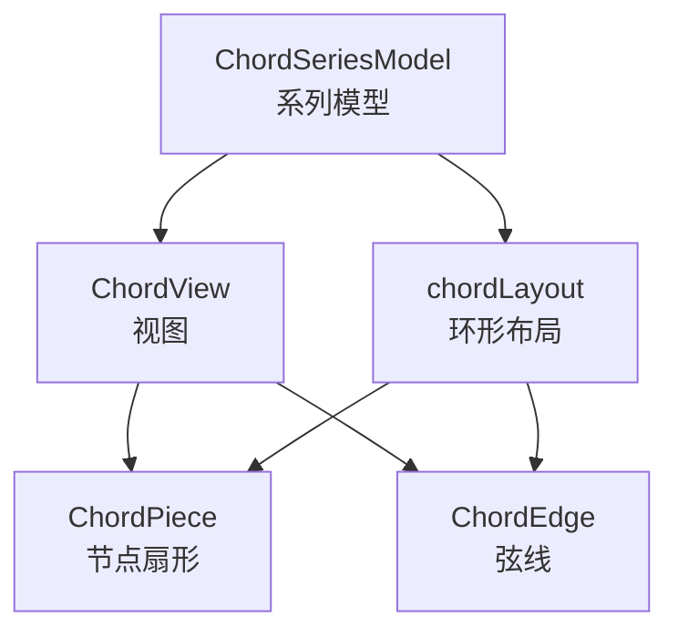
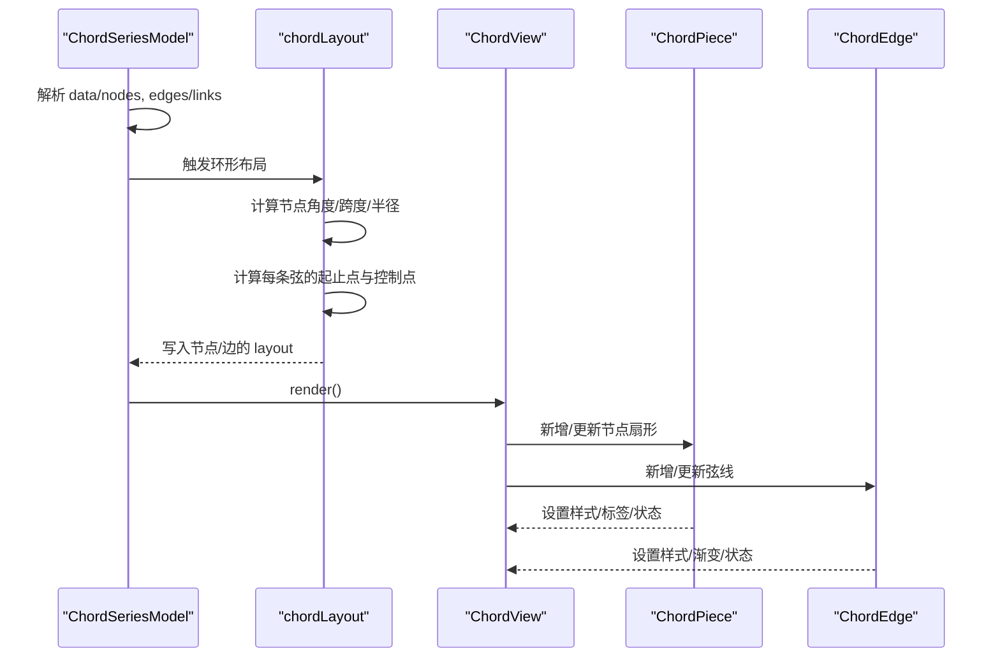
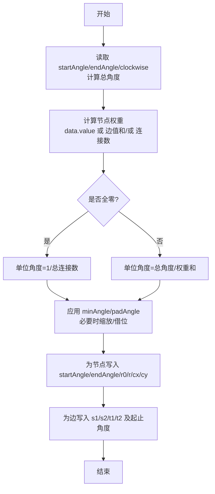
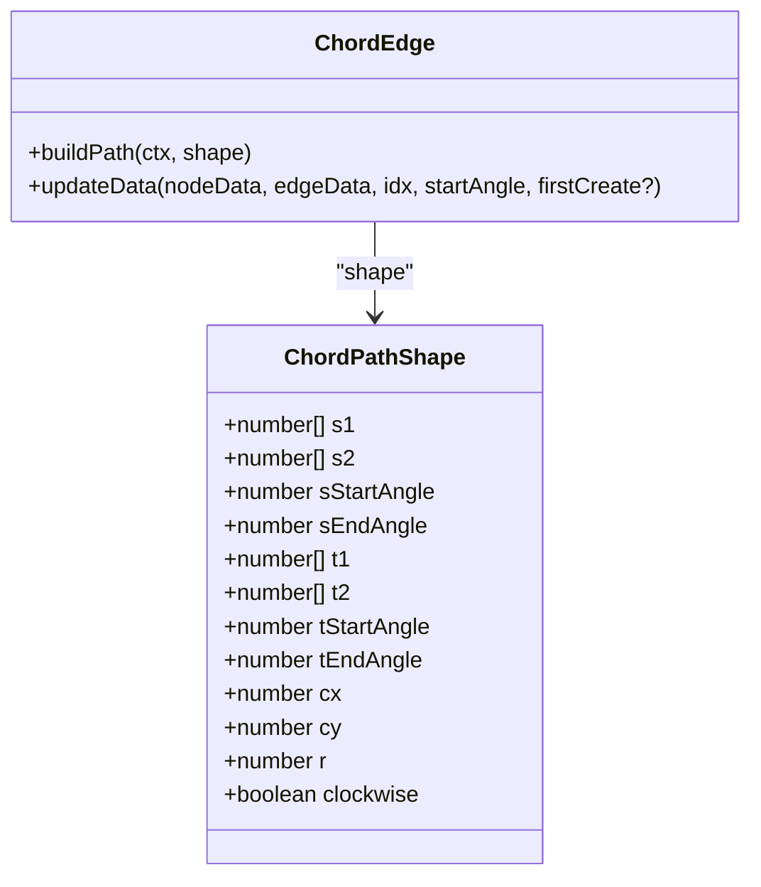
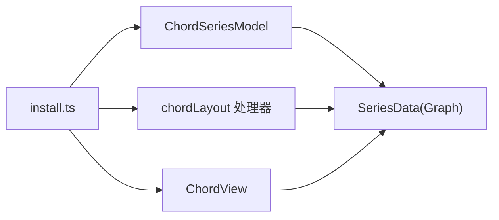

# 弦图 (Chord)

<cite>
**本文引用的文件**
- [src/chart/chord/ChordSeries.ts](file://src/chart/chord/ChordSeries.ts)
- [src/chart/chord/chordLayout.ts](file://src/chart/chord/chordLayout.ts)
- [src/chart/chord/ChordView.ts](file://src/chart/chord/ChordView.ts)
- [src/chart/chord/ChordEdge.ts](file://src/chart/chord/ChordEdge.ts)
- [src/chart/chord/ChordPiece.ts](file://src/chart/chord/ChordPiece.ts)
- [src/chart/helper/sectorHelper.ts](file://src/chart/helper/sectorHelper.ts)
- [src/chart/chord/install.ts](file://src/chart/chord/install.ts)
- [test/chord.html](file://test/chord.html)
</cite>

## 目录
1. [简介](#简介)
2. [项目结构](#项目结构)
3. [核心组件](#核心组件)
4. [架构总览](#架构总览)
5. [详细组件分析](#详细组件分析)
6. [依赖关系分析](#依赖关系分析)
7. [性能与渲染优化](#性能与渲染优化)
8. [交互能力与使用指南](#交互能力与使用指南)
9. [常见问题排查](#常见问题排查)
10. [结论](#结论)
11. [附录：配置项速查](#附录配置项速查)

## 简介
本文件系统性梳理 ECharts 中“弦图”的数据结构、布局算法、弧线计算、节点排列规则、样式与颜色映射，并给出典型科学可视化场景（贸易流向、基因表达、社交关系）的使用要点与示例路径。同时总结大规模关系数据的性能优化技巧与渲染策略，帮助读者高效构建高质量弦图。

## 项目结构
弦图由模型、视图、布局与图形元素组成，遵循 ECharts 的系列-视图-布局分层架构：
- 系列模型：定义数据、默认选项、工具提示格式化等
- 布局：计算扇区角度、弧线段起点终点、弦线形状参数
- 视图：负责新增/更新/移除图形元素，驱动动画与状态切换
- 图形元素：节点扇形（ChordPiece）、弦线（ChordEdge）

图表来源
- [src/chart/chord/ChordSeries.ts:177-345](file://src/chart/chord/ChordSeries.ts#L177-L345)
- [src/chart/chord/chordLayout.ts:33-272](file://src/chart/chord/chordLayout.ts#L33-L272)
- [src/chart/chord/ChordView.ts:44-145](file://src/chart/chord/ChordView.ts#L44-L145)
- [src/chart/chord/ChordPiece.ts:32-189](file://src/chart/chord/ChordPiece.ts#L32-L189)
- [src/chart/chord/ChordEdge.ts:58-212](file://src/chart/chord/ChordEdge.ts#L58-L212)

章节来源
- [src/chart/chord/install.ts:26-33](file://src/chart/chord/install.ts#L26-L33)

## 核心组件
- ChordSeriesModel：定义弦图的系列选项、默认值、数据解析与工具提示格式；支持节点与边的样式、标签、强调态、模糊态、选择态等。
- chordLayout：将节点与边映射到环形坐标，计算每个节点的起始角、跨度、内半径 r0、外半径 r，以及每条弦线的起止点与贝塞尔控制点。
- ChordView：基于 diff 机制增量更新节点与边，管理初始缩放动画与分组。
- ChordPiece：节点扇形，负责绘制圆环扇区、标签位置与对齐、状态样式。
- ChordEdge：弦线，根据布局计算的 s1/s2/t1/t2 及角度范围绘制闭合弧形带，支持渐变填充。

章节来源
- [src/chart/chord/ChordSeries.ts:117-173](file://src/chart/chord/ChordSeries.ts#L117-L173)
- [src/chart/chord/chordLayout.ts:39-272](file://src/chart/chord/chordLayout.ts#L39-L272)
- [src/chart/chord/ChordView.ts:44-145](file://src/chart/chord/ChordView.ts#L44-L145)
- [src/chart/chord/ChordPiece.ts:46-189](file://src/chart/chord/ChordPiece.ts#L46-L189)
- [src/chart/chord/ChordEdge.ts:72-212](file://src/chart/chord/ChordEdge.ts#L72-L212)

## 架构总览
下图展示从数据到渲染的关键流程：系列模型初始化数据与默认配置，布局阶段计算几何信息，视图阶段创建/更新图形元素，最终通过 ZRender 渲染。

图表来源
- [src/chart/chord/ChordSeries.ts:182-235](file://src/chart/chord/ChordSeries.ts#L182-L235)
- [src/chart/chord/chordLayout.ts:39-272](file://src/chart/chord/chordLayout.ts#L39-L272)
- [src/chart/chord/ChordView.ts:44-145](file://src/chart/chord/ChordView.ts#L44-L145)

## 详细组件分析

### 数据结构与矩阵表示
- 节点：name、value（可选）。当所有边值为 0 且未设 minAngle 时，节点角度按连接数比例分配。
- 边：source/target（名称或索引）、value（可选）。若 value 缺失，在全部为 0 的情况下统一视为 1 以参与布局。
- 内部图结构：通过 createGraphFromNodeEdge 将 nodes+edges 转为 Graph，便于遍历节点与边。
- 矩阵视角：虽然 API 接受节点数组和边数组，但布局阶段会统计每个节点的入/出边权重之和作为角度依据，等价于对邻接矩阵行/列求和得到节点权重。

章节来源
- [src/chart/chord/ChordSeries.ts:197-235](file://src/chart/chord/ChordSeries.ts#L197-L235)
- [src/chart/chord/chordLayout.ts:67-99](file://src/chart/chord/chordLayout.ts#L67-L99)

### 布局算法与节点排列规则
- 角度归一化：根据 startAngle/endAngle/clockwise 计算标准化起始角与总角度。
- 节点权重：优先使用 data.value；否则用该节点关联的所有边 value 之和；全零情况下按连接数计数。
- 最小角与间距：minAngle 保证可读性；padAngle 用于节点间留白；当 padAngle*count 或 (padAngle+minAngle)*count 超过可用角度时，自动降级调整。
- 借位平衡：当总不足大于盈余时，按比例缩放；当不足来自少数节点时，采用“尽可能少借”的策略避免越界。
- 最终布局：为每个节点记录 startAngle、endAngle、r0、r、cx、cy、clockwise；为每条边记录 s1/s2/t1/t2 及其起止角度，供绘制使用。

图表来源
- [src/chart/chord/chordLayout.ts:54-272](file://src/chart/chord/chordLayout.ts#L54-L272)

章节来源
- [src/chart/chord/chordLayout.ts:54-272](file://src/chart/chord/chordLayout.ts#L54-L272)

### 弧线计算与弦线绘制
- 弦线形状：由两段圆弧（源节点与目标节点各一段）与两条贝塞尔曲线拼接成闭合区域，形成“带状”效果。
- 控制点：使用固定比例（约 0.7）将端点向圆心方向收缩得到控制点，使弦线平滑弯曲。
- 颜色映射：lineStyle.color 支持 source/target/gradient。gradient 模式下，沿源/目标扇区中点连线生成线性渐变。

图表来源
- [src/chart/chord/ChordEdge.ts:33-106](file://src/chart/chord/ChordEdge.ts#L33-L106)
- [src/chart/chord/ChordEdge.ts:108-212](file://src/chart/chord/ChordEdge.ts#L108-L212)

章节来源
- [src/chart/chord/ChordEdge.ts:72-212](file://src/chart/chord/ChordEdge.ts#L72-L212)

### 节点样式与标签
- 节点扇形：支持 itemStyle.borderRadius（百分比或数值），结合 getSectorCornerRadius 转换为像素半径。
- 标签：label.show/position/distance/align/verticalAlign；outside 时位于扇区外侧，inside 时位于扇区内侧居中。
- 高亮与模糊：emphasis.focus 支持 none/self/adjacency；blurScope 控制模糊范围。

章节来源
- [src/chart/chord/ChordPiece.ts:46-189](file://src/chart/chord/ChordPiece.ts#L46-L189)
- [src/chart/helper/sectorHelper.ts:25-42](file://src/chart/helper/sectorHelper.ts#L25-L42)

### 颜色映射方案
- lineStyle.color:
  - source：使用源节点颜色
  - target：使用目标节点颜色
  - gradient：源→目标线性渐变，方向垂直于两扇区中点连线
- 节点颜色：可通过视觉映射或主题色板提供，边继承节点视觉样式。

章节来源
- [src/chart/chord/ChordEdge.ts:166-212](file://src/chart/chord/ChordEdge.ts#L166-L212)

## 依赖关系分析
- 安装与注册：install.ts 注册视图、系列模型、布局处理器和数据过滤器。
- 布局阶段：chordCircularLayoutStageHandler 在 POST_CHART_LAYOUT 阶段执行，确保其他图表布局完成后进行弦图布局。
- 数据流：SeriesData 持有 Graph，布局写入 layout，视图读取 layout 创建图形元素。

图表来源
- [src/chart/chord/install.ts:26-33](file://src/chart/chord/install.ts#L26-L33)
- [src/chart/chord/chordLayout.ts:31-37](file://src/chart/chord/chordLayout.ts#L31-L37)

章节来源
- [src/chart/chord/install.ts:26-33](file://src/chart/chord/install.ts#L26-L33)

## 性能与渲染优化
- 增量更新：ChordView 使用 SeriesData.diff 仅处理新增/更新/删除的项，减少重绘开销。
- 大数量边：
  - 合理设置 lineStyle.width 与 opacity，降低绘制成本
  - 使用 color: 'target' 或 'source' 减少渐变计算
  - 避免过多复杂 borderRadius
- 布局优化：
  - 设置合适的 minAngle 与 padAngle，避免过度细分导致大量小扇区
  - 对于全零数据，利用 minAngle 强制显示节点，提升可读性
- 动画与过渡：首次渲染使用 group.scaleX/Y 从 0.01 到 1 的缩放动画，提升观感；后续更新使用 updateProps 平滑过渡。
- 视觉映射：通过 visualMap 或主题色板批量设置节点颜色，减少逐条边样式计算。

章节来源
- [src/chart/chord/ChordView.ts:44-116](file://src/chart/chord/ChordView.ts#L44-L116)
- [src/chart/chord/chordLayout.ts:101-111](file://src/chart/chord/chordLayout.ts#L101-L111)

## 交互能力与使用指南
- 节点高亮：emphasis.focus='self' 仅高亮当前节点；'adjacency' 高亮相邻节点与边；'none' 关闭聚焦。
- 弦线筛选：通过 legendHoverLink 与 legend 联动，可隐藏/显示特定节点，从而间接筛选相关弦线。
- 工具提示：formatTooltip 针对节点与边分别输出 name/value，边自动拼接 source > target 名称。
- 动态更新：支持 setOption 动态修改 links、lineStyle.color、minAngle、padAngle 等，视图会自动 diff 更新。

示例参考
- 顺时针/逆时针切换、渐变颜色切换、最小角与间距边界情况、动态更新链接值等，均可在测试用例中查看完整配置与交互逻辑。

章节来源
- [src/chart/chord/ChordSeries.ts:245-292](file://src/chart/chord/ChordSeries.ts#L245-L292)
- [test/chord.html:63-112](file://test/chord.html#L63-L112)
- [test/chord.html:513-585](file://test/chord.html#L513-L585)

## 常见问题排查
- 节点不显示：检查是否有有效边；若无边或全部 value 为 0 且未设置 minAngle，可能不渲染。
- 角度异常：确认 startAngle/endAngle/clockwise 组合是否合法；注意 normalizeArcAngles 的影响。
- 弦线重叠：增大 minAngle 或减小 padAngle；或使用 color:'target'/'source' 提高对比度。
- 渐变方向不符合预期：gradient 方向基于源/目标扇区中点连线，调整节点顺序或角度范围可改善。

章节来源
- [src/chart/chord/chordLayout.ts:61-66](file://src/chart/chord/chordLayout.ts#L61-L66)
- [src/chart/chord/chordLayout.ts:101-111](file://src/chart/chord/chordLayout.ts#L101-L111)
- [src/chart/chord/ChordEdge.ts:189-212](file://src/chart/chord/ChordEdge.ts#L189-L212)

## 结论
ECharts 的弦图实现了完整的环形布局、弦线绘制与丰富的交互能力。通过合理的 minAngle/padAngle 配置、颜色映射与性能优化策略，可在贸易流向、基因表达、社交关系等场景中高效呈现复杂关系数据。建议结合测试用例中的多种边界情况与交互模式，快速搭建符合业务需求的弦图。

## 附录：配置项速查
- 系列级
  - type: 'chord'
  - coordinateSystem: 'none'
  - center/radius：中心与内外半径
  - clockwise/startAngle/endAngle/minAngle/padAngle：布局控制
  - data/nodes：节点列表（name/value）
  - edges/links：边列表（source/target/value）
  - label/edgeLabel：节点/边标签
  - itemStyle/lineStyle：节点/边样式
  - emphasis/blur/select：强调/模糊/选择态
- 边颜色
  - lineStyle.color: 'source' | 'target' | 'gradient'
- 交互
  - emphasis.focus: 'none' | 'self' | 'adjacency'
  - legendHoverLink：图例联动

章节来源
- [src/chart/chord/ChordSeries.ts:117-173](file://src/chart/chord/ChordSeries.ts#L117-L173)
- [src/chart/chord/ChordSeries.ts:294-341](file://src/chart/chord/ChordSeries.ts#L294-L341)