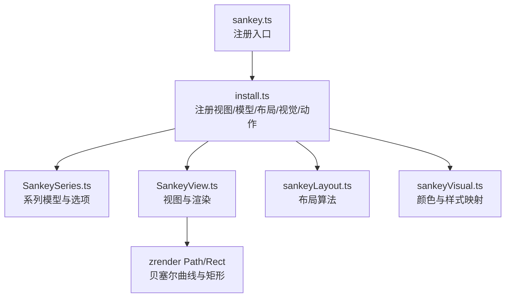
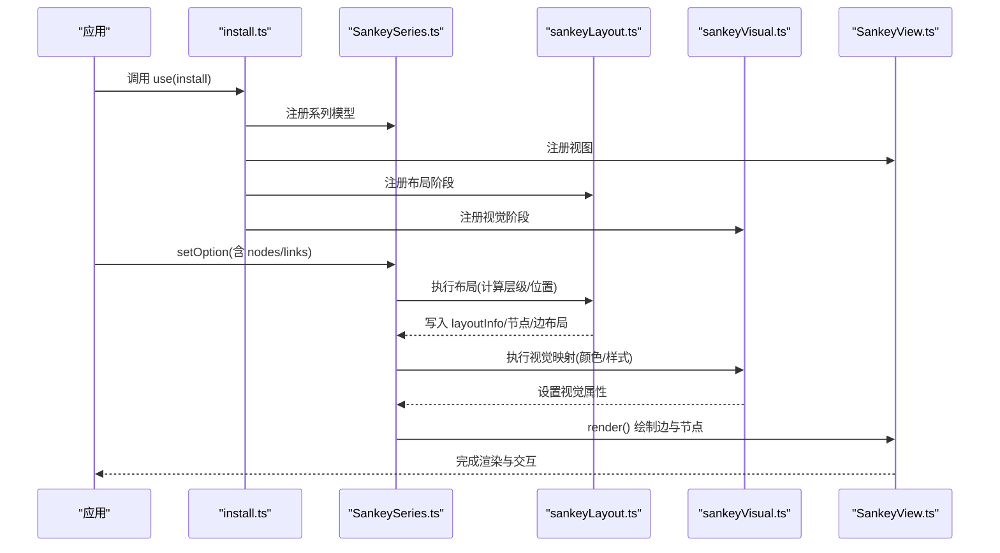
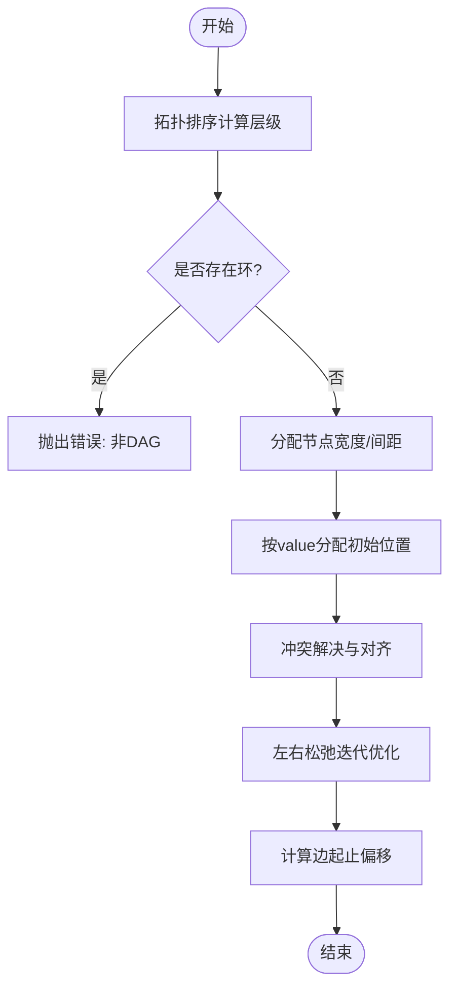
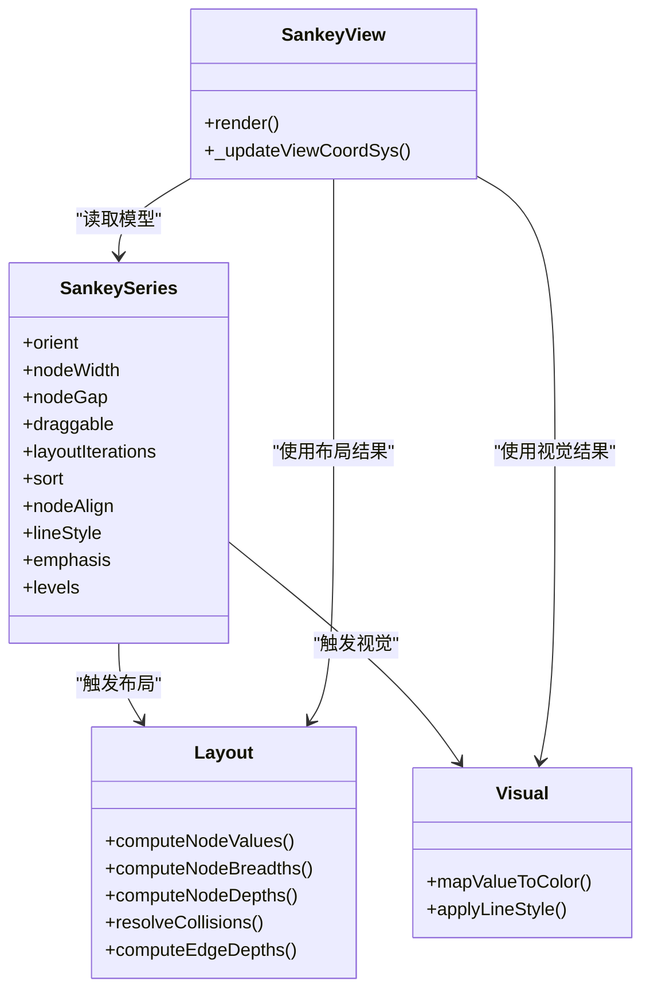
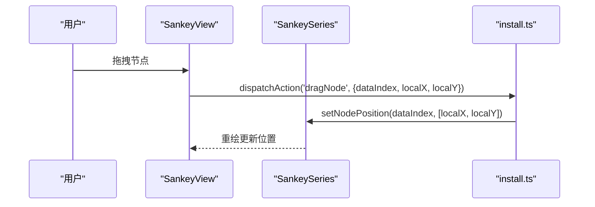
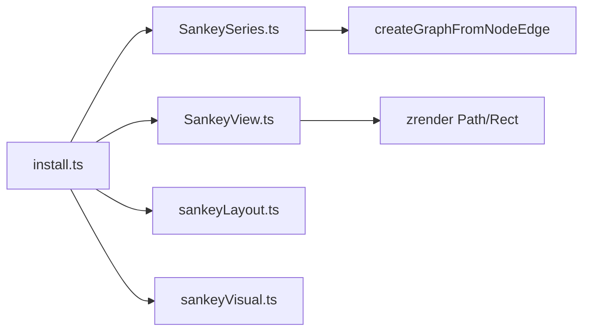

# 桑基图 (Sankey)

<cite>
**本文引用的文件**
- [src/chart/sankey.ts](file://src/chart/sankey.ts)
- [src/chart/sankey/install.ts](file://src/chart/sankey/install.ts)
- [src/chart/sankey/SankeySeries.ts](file://src/chart/sankey/SankeySeries.ts)
- [src/chart/sankey/SankeyView.ts](file://src/chart/sankey/SankeyView.ts)
- [src/chart/sankey/sankeyLayout.ts](file://src/chart/sankey/sankeyLayout.ts)
- [src/chart/sankey/sankeyVisual.ts](file://src/chart/sankey/sankeyVisual.ts)
- [test/sankey.html](file://test/sankey.html)
- [test/sankey-vertical-energy.html](file://test/sankey-vertical-energy.html)
- [test/sankey-node-sorting.html](file://test/sankey-node-sorting.html)
- [test/sankey-level.html](file://test/sankey-level.html)
- [test/data/energy.json](file://test/data/energy.json)
</cite>

## 目录
1. [简介](#简介)
2. [项目结构](#项目结构)
3. [核心组件](#核心组件)
4. [架构总览](#架构总览)
5. [详细组件分析](#详细组件分析)
6. [依赖关系分析](#依赖关系分析)
7. [性能与大数据优化](#性能与大数据优化)
8. [故障排查指南](#故障排查指南)
9. [结论](#结论)
10. [附录：示例与用法](#附录示例与用法)

## 简介
本文件系统性梳理 ECharts 中桑基图的实现原理、数据结构要求、布局算法、样式与颜色映射、交互能力，以及面向能源流向、资金流转、用户行为等场景的落地实践。文档同时提供针对大数据量的性能优化策略与渲染优化技巧，帮助读者在复杂业务场景中高效使用并扩展桑基图。

## 项目结构
ECharts 的桑基图以“系列模型 + 视图 + 布局阶段 + 视觉阶段”的分层方式组织：
- 系列模型：定义数据、默认配置、工具方法（如 tooltip 格式化）
- 视图：负责图形元素创建、事件处理、拖拽与漫游
- 布局阶段：计算节点深度、宽度、位置与边起点/终点
- 视觉阶段：根据数值范围进行颜色映射，应用样式

**图表来源**
- [src/chart/sankey.ts:20-23](file://src/chart/sankey.ts#L20-L23)
- [src/chart/sankey/install.ts:34-56](file://src/chart/sankey/install.ts#L34-L56)
- [src/chart/sankey/SankeySeries.ts:163-372](file://src/chart/sankey/SankeySeries.ts#L163-L372)
- [src/chart/sankey/SankeyView.ts:109-459](file://src/chart/sankey/SankeyView.ts#L109-L459)
- [src/chart/sankey/sankeyLayout.ts:33-85](file://src/chart/sankey/sankeyLayout.ts#L33-L85)
- [src/chart/sankey/sankeyVisual.ts:29-73](file://src/chart/sankey/sankeyVisual.ts#L29-L73)

**章节来源**
- [src/chart/sankey.ts:20-23](file://src/chart/sankey.ts#L20-L23)
- [src/chart/sankey/install.ts:34-56](file://src/chart/sankey/install.ts#L34-L56)

## 核心组件
- SankeySeriesModel：定义系列类型、默认选项、数据初始化、tooltip 格式化、拖拽更新节点位置、漫游宿主能力
- SankeyView：构建贝塞尔曲线边与矩形节点，设置标签、高亮、拖拽、动画裁剪、坐标系统变换
- sankeyLayout：拓扑排序确定层级，Gauss-Seidel 迭代优化垂直位置，冲突解决与对齐，边起止偏移计算
- sankeyVisual：基于节点值范围线性映射颜色，支持自定义覆盖；边样式从模型读取

**章节来源**
- [src/chart/sankey/SankeySeries.ts:163-372](file://src/chart/sankey/SankeySeries.ts#L163-L372)
- [src/chart/sankey/SankeyView.ts:109-459](file://src/chart/sankey/SankeyView.ts#L109-L459)
- [src/chart/sankey/sankeyLayout.ts:33-85](file://src/chart/sankey/sankeyLayout.ts#L33-L85)
- [src/chart/sankey/sankeyVisual.ts:29-73](file://src/chart/sankey/sankeyVisual.ts#L29-L73)

## 架构总览
下图展示了从安装到渲染的关键流程：安装器注册视图与模型，布局阶段计算几何，视觉阶段生成颜色，视图最终绘制路径与矩形。

**图表来源**
- [src/chart/sankey/install.ts:34-56](file://src/chart/sankey/install.ts#L34-L56)
- [src/chart/sankey/SankeySeries.ts:178-227](file://src/chart/sankey/SankeySeries.ts#L178-L227)
- [src/chart/sankey/sankeyLayout.ts:33-85](file://src/chart/sankey/sankeyLayout.ts#L33-L85)
- [src/chart/sankey/sankeyVisual.ts:29-73](file://src/chart/sankey/sankeyVisual.ts#L29-L73)
- [src/chart/sankey/SankeyView.ts:128-368](file://src/chart/sankey/SankeyView.ts#L128-L368)

## 详细组件分析

### 数据结构与数据格式
- 节点数据
  - 字段：name/id、depth（可选，指定层级）、itemStyle（可覆盖颜色）、localX/localY（拖拽后的相对坐标）
  - 节点值 value 由关联边的值自动计算（取入边和出边最大值与原始值三者中的最大者）
- 流向数据
  - 字段：source/target、value（必须为数值）
  - 支持 edges 或 links 两种键名
- 级别 levels
  - 通过 depth 指定层级，并为该层级统一设置 itemStyle/lineStyle
- 系列选项
  - orient：horizontal/vertical
  - nodeWidth/nodeGap：节点宽度与间距
  - draggable：是否允许拖拽节点
  - layoutIterations：布局迭代次数
  - sort：'desc' | null（null 保留输入顺序）
  - nodeAlign：'justify' | 'left' | 'right'
  - lineStyle.curveness：曲线弯曲度
  - emphasis.focus：'adjacency' | 'trajectory' | 其他
  - roam：是否启用缩放/平移

**章节来源**
- [src/chart/sankey/SankeySeries.ts:53-159](file://src/chart/sankey/SankeySeries.ts#L53-L159)
- [src/chart/sankey/SankeySeries.ts:304-372](file://src/chart/sankey/SankeySeries.ts#L304-L372)
- [src/chart/sankey/sankeyLayout.ts:90-98](file://src/chart/sankey/sankeyLayout.ts#L90-L98)

### 布局算法与流向计算
- 层级计算
  - 使用拓扑排序（Kahn 算法）按入度为零的节点逐层推进，得到每个节点的 depth
  - 若存在环则抛出错误（桑基图为有向无环图）
- 节点宽度与间距
  - 根据 orient 决定 dx/dy 为 nodeWidth，列内节点间间隔为 nodeGap
- 初始 y/x 分配
  - 按列分组后，依据节点 value 与最小比例因子 minKy 分配 dy/dx，边也按 value 分配厚度
- 冲突解决与对齐
  - resolveCollisions：在同一列内按 sort 规则排序并避免重叠，必要时整体回推保证不越界
  - adjustNodeWithNodeAlign：支持 right/justify 对齐策略，将汇点推到最右列或调整层级
- 迭代优化
  - Gauss-Seidel 迭代：relaxRightToLeft / relaxLeftToRight，结合 alpha 衰减逐步优化节点纵向位置，减少连线交叉
- 边起止偏移
  - computeEdgeDepths：对每个节点的 outEdges/inEdges 按目标/源节点位置排序，计算 sy/ty 作为边在节点上的起止偏移

**图表来源**
- [src/chart/sankey/sankeyLayout.ts:106-183](file://src/chart/sankey/sankeyLayout.ts#L106-L183)
- [src/chart/sankey/sankeyLayout.ts:268-292](file://src/chart/sankey/sankeyLayout.ts#L268-L292)
- [src/chart/sankey/sankeyLayout.ts:359-414](file://src/chart/sankey/sankeyLayout.ts#L359-L414)
- [src/chart/sankey/sankeyLayout.ts:421-513](file://src/chart/sankey/sankeyLayout.ts#L421-L513)
- [src/chart/sankey/sankeyLayout.ts:518-540](file://src/chart/sankey/sankeyLayout.ts#L518-L540)

**章节来源**
- [src/chart/sankey/sankeyLayout.ts:106-183](file://src/chart/sankey/sankeyLayout.ts#L106-L183)
- [src/chart/sankey/sankeyLayout.ts:268-292](file://src/chart/sankey/sankeyLayout.ts#L268-L292)
- [src/chart/sankey/sankeyLayout.ts:359-414](file://src/chart/sankey/sankeyLayout.ts#L359-L414)
- [src/chart/sankey/sankeyLayout.ts:421-513](file://src/chart/sankey/sankeyLayout.ts#L421-L513)
- [src/chart/sankey/sankeyLayout.ts:518-540](file://src/chart/sankey/sankeyLayout.ts#L518-L540)

### 节点与流向样式、颜色映射
- 节点样式
  - itemStyle.color：可自定义覆盖；否则按 value 线性映射 color 数组
  - borderRadius：圆角
  - label：显示名称或自定义 formatter
- 流向线条样式
  - lineStyle.curveness：控制贝塞尔曲线弯曲程度
  - lineStyle.color：支持 'source' | 'target' | 'gradient' | 具体颜色
    - 'source'：使用源节点颜色
    - 'target'：使用目标节点颜色
    - 'gradient'：根据方向生成线性渐变（水平/垂直）
- 颜色映射
  - sankeyVisual 阶段基于节点 value 的最小/最大值建立线性映射
  - 若节点自定义了 color，则优先使用自定义色

**图表来源**
- [src/chart/sankey/SankeySeries.ts:163-372](file://src/chart/sankey/SankeySeries.ts#L163-L372)
- [src/chart/sankey/SankeyView.ts:128-368](file://src/chart/sankey/SankeyView.ts#L128-L368)
- [src/chart/sankey/sankeyLayout.ts:33-85](file://src/chart/sankey/sankeyLayout.ts#L33-L85)
- [src/chart/sankey/sankeyVisual.ts:29-73](file://src/chart/sankey/sankeyVisual.ts#L29-L73)

**章节来源**
- [src/chart/sankey/SankeyView.ts:156-274](file://src/chart/sankey/SankeyView.ts#L156-L274)
- [src/chart/sankey/SankeyView.ts:412-437](file://src/chart/sankey/SankeyView.ts#L412-L437)
- [src/chart/sankey/sankeyVisual.ts:29-73](file://src/chart/sankey/sankeyVisual.ts#L29-L73)

### 交互功能
- 节点拖拽
  - 当 draggable 为 true 时，节点可拖动；拖拽过程中派发 dragNode 动作，更新 localX/localY 并重绘
- 高亮与聚焦
  - emphasis.focus 支持：
    - 'adjacency'：高亮相邻节点/边
    - 'trajectory'：高亮轨迹（上下游连通路径）
- 漫游
  - 支持缩放与平移（roam），通过 RoamController 管理视图坐标变换
- Tooltip
  - 节点：显示 name/value
  - 边：显示 source -- target 与 value

**图表来源**
- [src/chart/sankey/SankeyView.ts:336-358](file://src/chart/sankey/SankeyView.ts#L336-L358)
- [src/chart/sankey/install.ts:41-54](file://src/chart/sankey/install.ts#L41-L54)
- [src/chart/sankey/SankeySeries.ts:229-234](file://src/chart/sankey/SankeySeries.ts#L229-L234)

**章节来源**
- [src/chart/sankey/SankeyView.ts:265-333](file://src/chart/sankey/SankeyView.ts#L265-L333)
- [src/chart/sankey/SankeyView.ts:370-381](file://src/chart/sankey/SankeyView.ts#L370-L381)
- [src/chart/sankey/SankeySeries.ts:254-298](file://src/chart/sankey/SankeySeries.ts#L254-L298)

### 实际应用场景与示例代码路径
- 能源流向分析
  - 示例：水平/垂直能源流、渐变色流向、标签旋转
  - 参考路径：
    - [test/sankey.html](file://test/sankey.html)
    - [test/sankey-vertical-energy.html](file://test/sankey-vertical-energy.html)
    - [test/data/energy.json](file://test/data/energy.json)
- 资金流转
  - 思路：节点代表部门/账户，边代表转账金额；使用 levels 按流程阶段分层，sort:'desc' 便于阅读
  - 参考路径：
    - [test/sankey-level.html](file://test/sankey-level.html)
- 用户行为分析
  - 思路：节点代表页面/步骤，边代表转化量；使用 emphasis.focus:'trajectory' 追踪用户路径
  - 参考路径：
    - [test/sankey.html](file://test/sankey.html)

[本节为概念性说明，未直接分析具体代码文件]

## 依赖关系分析
- 模块耦合
  - install.ts 聚合注册所有阶段，松耦合地连接 Series/View/Layout/Visual
  - SankeySeries 依赖 createGraphFromNodeEdge 构建图结构，并在 beforeLink 中注入 level 模型
  - SankeyView 依赖 zrender 图形库绘制贝塞尔曲线与矩形，并通过 RoamController 管理交互
  - sankeyLayout 与 sankeyVisual 分别负责几何计算与视觉映射，被 install 注册为阶段处理器
- 外部依赖
  - zrender：Path/Rect、LinearGradient、动画与裁剪
  - 全局模型与扩展 API：用于获取布局容器、坐标系统与动作分发

**图表来源**
- [src/chart/sankey/install.ts:34-56](file://src/chart/sankey/install.ts#L34-L56)
- [src/chart/sankey/SankeySeries.ts:178-227](file://src/chart/sankey/SankeySeries.ts#L178-L227)
- [src/chart/sankey/SankeyView.ts:128-368](file://src/chart/sankey/SankeyView.ts#L128-L368)

**章节来源**
- [src/chart/sankey/install.ts:34-56](file://src/chart/sankey/install.ts#L34-L56)
- [src/chart/sankey/SankeySeries.ts:178-227](file://src/chart/sankey/SankeySeries.ts#L178-L227)
- [src/chart/sankey/SankeyView.ts:128-368](file://src/chart/sankey/SankeyView.ts#L128-L368)

## 性能与大数据优化
- 布局迭代控制
  - 若存在值为 0 的节点，布局迭代次数设为 0，避免无效计算
  - 可通过 layoutIterations 调小迭代次数以降低计算开销
- 节点排序
  - sort:'desc' 可减少连线交叉；sort:null 保留输入顺序，适合需要稳定顺序的场景
- 可视化简化
  - 关闭 animation 或使用较短 duration 提升首帧速度
  - 使用 lineStyle.color:'source'/'target' 替代复杂渐变，降低渲染成本
- 数据采样与过滤
  - 对超大规模边集，可在数据预处理阶段聚合或采样，减少边数量
- 渲染裁剪与动画
  - 首次渲染使用 clip 动画逐步展开，避免一次性大量绘制导致的卡顿
- 拖拽与交互
  - 仅在需要时启用 draggable；频繁拖拽会触发多次重绘

[本节提供通用指导，未直接分析具体代码文件]

## 故障排查指南
- 循环检测
  - 若数据包含环，布局阶段会抛出错误；需确保桑基图为 DAG
- 节点值为 0
  - 值为 0 的节点不参与迭代优化；检查数据是否正确
- 连线交叉严重
  - 调整 sort 或 nodeAlign；增大 layoutIterations；合理设置 nodeGap
- 颜色不生效
  - 确认是否在 sankeyVisual 阶段设置了自定义 color；注意优先级
- 拖拽无效
  - 检查 draggable 是否为 true；确认 dragNode 动作是否被正确分发与处理

**章节来源**
- [src/chart/sankey/sankeyLayout.ts:168-172](file://src/chart/sankey/sankeyLayout.ts#L168-L172)
- [src/chart/sankey/sankeyLayout.ts:55-60](file://src/chart/sankey/sankeyLayout.ts#L55-L60)
- [src/chart/sankey/SankeyView.ts:336-358](file://src/chart/sankey/SankeyView.ts#L336-L358)
- [src/chart/sankey/sankeyVisual.ts:47-65](file://src/chart/sankey/sankeyVisual.ts#L47-L65)

## 结论
ECharts 的桑基图通过清晰的模块化设计实现了强大的布局与可视化能力。其拓扑排序与 Gauss-Seidel 迭代确保了合理的层级与位置，丰富的样式与颜色映射满足多样化表达需求，拖拽与高亮交互提升了探索效率。在实际应用中，结合数据预处理与参数调优，可有效应对大规模数据的性能挑战。

## 附录：示例与用法
- 基础水平/垂直示例
  - 参考路径：
    - [test/sankey.html](file://test/sankey.html)
    - [test/sankey-vertical-energy.html](file://test/sankey-vertical-energy.html)
- 层级与样式
  - 参考路径：
    - [test/sankey-level.html](file://test/sankey-level.html)
- 节点排序与布局优化
  - 参考路径：
    - [test/sankey-node-sorting.html](file://test/sankey-node-sorting.html)
- 能源数据
  - 参考路径：
    - [test/data/energy.json](file://test/data/energy.json)

[本节为示例导航，未直接分析具体代码文件]