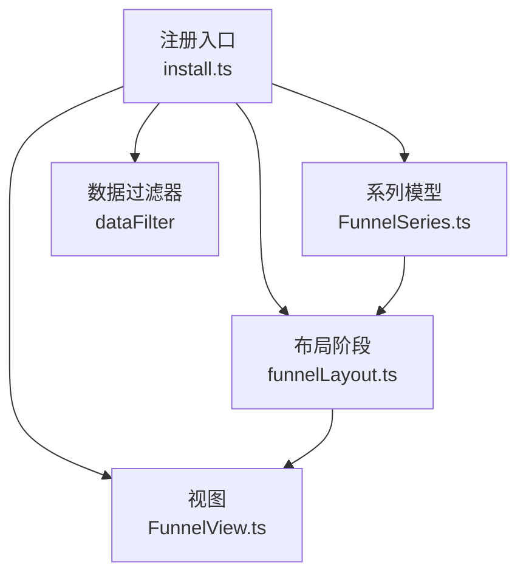
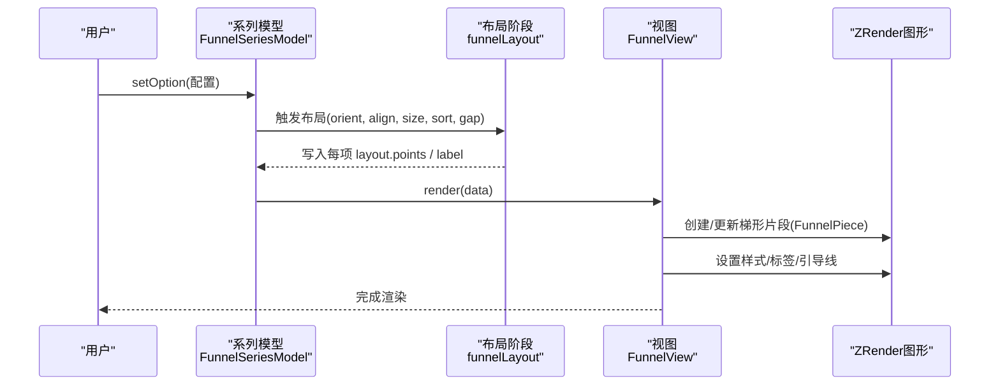
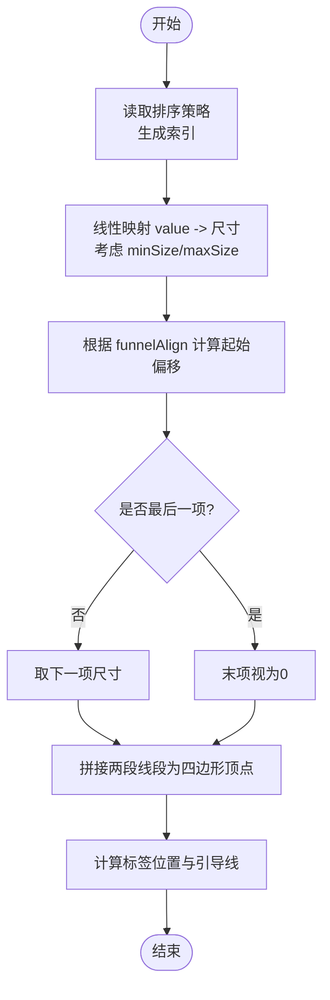
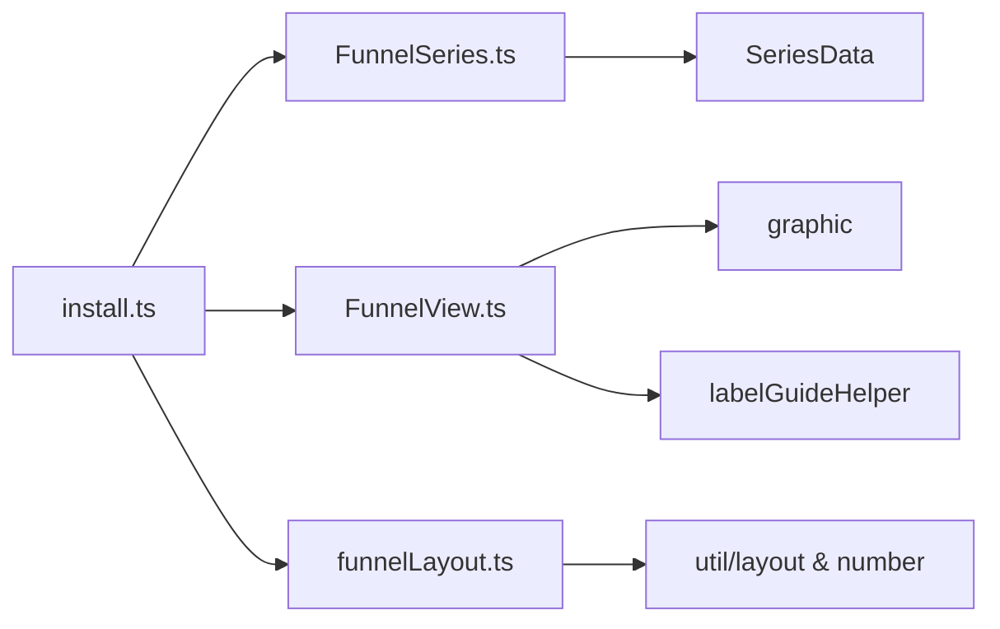

# 漏斗图 (Funnel)

<cite>
**本文引用的文件**
- [src/chart/funnel.ts](file://src/chart/funnel.ts)
- [src/chart/funnel/install.ts](file://src/chart/funnel/install.ts)
- [src/chart/funnel/FunnelSeries.ts](file://src/chart/funnel/FunnelSeries.ts)
- [src/chart/funnel/FunnelView.ts](file://src/chart/funnel/FunnelView.ts)
- [src/chart/funnel/funnelLayout.ts](file://src/chart/funnel/funnelLayout.ts)
- [test/funnel.html](file://test/funnel.html)
</cite>

## 目录
1. [简介](#简介)
2. [项目结构](#项目结构)
3. [核心组件](#核心组件)
4. [架构总览](#架构总览)
5. [详细组件分析](#详细组件分析)
6. [依赖关系分析](#依赖关系分析)
7. [性能考量](#性能考量)
8. [故障排查指南](#故障排查指南)
9. [结论](#结论)
10. [附录](#附录)

## 简介
本文件系统性梳理 ECharts 中“漏斗图”的实现与用法，覆盖数据结构、阶段定义、布局算法、图形生成、样式配置（节点颜色、标签位置、连接线）、交互能力（筛选、对比、动态更新），以及多系列、倒置等高级用法与性能优化建议。内容基于源码与测试用例进行提炼，便于开发者快速掌握并高效使用。

## 项目结构
漏斗图由“注册入口 + 模型 + 视图 + 布局 + 处理器”构成：
- 注册入口：将视图、系列模型、布局阶段、数据过滤器注册到 ECharts 扩展系统。
- 系列模型：定义漏斗图的选项、默认值、数据维度与百分比计算。
- 视图：负责创建/更新图形元素（梯形片段）、标签与引导线，处理状态切换与动画。
- 布局：根据方向、对齐、尺寸、排序、间距等计算每个阶段的几何形状与标签位置。
- 处理器：对数据进行过滤，保证渲染前数据一致性。

图表来源
- [src/chart/funnel/install.ts:20-31](file://src/chart/funnel/install.ts#L20-L31)
- [src/chart/funnel/FunnelSeries.ts:106-209](file://src/chart/funnel/FunnelSeries.ts#L106-L209)
- [src/chart/funnel/FunnelView.ts:177-225](file://src/chart/funnel/FunnelView.ts#L177-L225)
- [src/chart/funnel/funnelLayout.ts:252-397](file://src/chart/funnel/funnelLayout.ts#L252-L397)

章节来源
- [src/chart/funnel/install.ts:20-31](file://src/chart/funnel/install.ts#L20-L31)
- [src/chart/funnel/FunnelSeries.ts:106-209](file://src/chart/funnel/FunnelSeries.ts#L106-L209)
- [src/chart/funnel/FunnelView.ts:177-225](file://src/chart/funnel/FunnelView.ts#L177-L225)
- [src/chart/funnel/funnelLayout.ts:252-397](file://src/chart/funnel/funnelLayout.ts#L252-L397)

## 核心组件
- 系列模型（FunnelSeriesModel）
  - 定义类型、默认选项、数据维度（value）、编码映射策略。
  - 提供 getDataParams 时附加 percent 字段，用于提示与格式化。
  - 支持 legend 选择、labelLine 强调态联动。
- 视图（FunnelView）
  - 维护 FunnelPiece（梯形片段）集合，按 diff 增删改。
  - 为每个片段设置形状、样式、标签与引导线，处理 hover/blur/focus 等状态。
- 布局（funnelLayout）
  - 依据 orient（vertical/horizontal）、funnelAlign（left/center/right 或 top/center/bottom）、minSize/maxSize、gap、sort 等计算各阶段梯形顶点坐标。
  - 计算标签位置与引导线端点，支持内外多种位置。
- 安装器（install）
  - 注册视图、系列模型、布局阶段与数据过滤器。

章节来源
- [src/chart/funnel/FunnelSeries.ts:106-209](file://src/chart/funnel/FunnelSeries.ts#L106-L209)
- [src/chart/funnel/FunnelView.ts:37-225](file://src/chart/funnel/FunnelView.ts#L37-L225)
- [src/chart/funnel/funnelLayout.ts:30-397](file://src/chart/funnel/funnelLayout.ts#L30-L397)
- [src/chart/funnel/install.ts:20-31](file://src/chart/funnel/install.ts#L20-L31)

## 架构总览
漏斗图的数据流与渲染流程如下：

图表来源
- [src/chart/funnel/FunnelSeries.ts:122-153](file://src/chart/funnel/FunnelSeries.ts#L122-L153)
- [src/chart/funnel/funnelLayout.ts:252-397](file://src/chart/funnel/funnelLayout.ts#L252-L397)
- [src/chart/funnel/FunnelView.ts:185-214](file://src/chart/funnel/FunnelView.ts#L185-L214)

## 详细组件分析

### 数据结构与阶段定义
- 数据项
  - 支持数值、数组或对象形式；对象可包含 value、name、itemStyle、label、labelLine 及状态样式。
  - 支持 itemStyle.width/height 针对水平/垂直方向自定义单段尺寸。
- 维度与编码
  - 仅声明 value 维度作为数值轴；名称维度通过 name-based 编码自动推断。
- 百分比
  - getDataParams 会计算 percent = value / sum * 100，sum=0 时为 0，保留两位小数。
- 排序
  - sort 可为 ascending/descending/none 或自定义函数；影响绘制顺序与起始位置。
- 方向与对齐
  - orient 控制主轴方向；funnelAlign 控制每段在副轴上的对齐方式。
- 尺寸
  - minSize/maxSize 以绝对值或百分比表示，限制最小/最大宽度或高度。
- 间距
  - gap 控制相邻阶段之间的间隔。

章节来源
- [src/chart/funnel/FunnelSeries.ts:67-102](file://src/chart/funnel/FunnelSeries.ts#L67-L102)
- [src/chart/funnel/FunnelSeries.ts:122-153](file://src/chart/funnel/FunnelSeries.ts#L122-L153)
- [src/chart/funnel/funnelLayout.ts:252-397](file://src/chart/funnel/funnelLayout.ts#L252-L397)

### 布局算法与图形生成
- 排序与索引
  - 根据 sort 生成 indices；ascending 时反转顺序并从末端开始累加。
- 尺寸映射
  - 将 value 线性映射到 minSize~maxSize 区间，得到每段的宽度（垂直）或高度（水平）。
- 对齐与起点
  - 根据 funnelAlign 计算每段在副轴上的起始坐标。
- 梯形顶点
  - 取当前段与下一段的起止线段，拼接为四边形顶点序列 points。
- 标签与引导线
  - labelLayout 根据 position 计算文本坐标、对齐方式与引导线端点；支持 inside/left/right/top/bottom 及四角位置。
- 方向适配
  - isOrientHorizontal 决定主/副轴角色互换，统一计算逻辑。

图表来源
- [src/chart/funnel/funnelLayout.ts:30-53](file://src/chart/funnel/funnelLayout.ts#L30-L53)
- [src/chart/funnel/funnelLayout.ts:252-397](file://src/chart/funnel/funnelLayout.ts#L252-L397)
- [src/chart/funnel/funnelLayout.ts:55-248](file://src/chart/funnel/funnelLayout.ts#L55-L248)

章节来源
- [src/chart/funnel/funnelLayout.ts:30-248](file://src/chart/funnel/funnelLayout.ts#L30-L248)
- [src/chart/funnel/funnelLayout.ts:252-397](file://src/chart/funnel/funnelLayout.ts#L252-L397)

### 样式配置与渐变填充
- 节点样式
  - itemStyle 支持 fill、borderColor、borderWidth、opacity 等；emphasis/select 可分别配置高亮与选中态。
  - 支持 colorBy='data' 按数据项着色。
- 标签与引导线
  - label.position 支持 outer/inner/center/insideLeft/insideRight/left/right/top/bottom/leftTop/leftBottom/rightTop/rightBottom。
  - labelLine.length 控制引导线长度；lineStyle.width/color 可定制。
- 渐变与透明度
  - 视图层通过 useStyle 应用视觉样式；opacity 可通过 visual 映射或 itemStyle.opacity 控制。
  - 若使用渐变填充，透明度可通过 alpha 通道间接实现（框架内部为不支持 opacity 的场景准备 alpha 映射）。

章节来源
- [src/chart/funnel/FunnelSeries.ts:155-205](file://src/chart/funnel/FunnelSeries.ts#L155-L205)
- [src/chart/funnel/FunnelView.ts:51-174](file://src/chart/funnel/FunnelView.ts#L51-L174)
- [src/visual/visualSolution.ts:61-102](file://src/visual/visualSolution.ts#L61-L102)

### 交互功能
- 工具提示
  - tooltip.formatter 可使用 {percent} 展示占比；trigger=item 时显示阶段详情。
- 图例选择
  - 启用 legendHoverLink，支持按数据项选择/高亮。
- 动态更新
  - 通过 setOption 修改 series 配置（如 orient、sort、label 位置、labelLine 长度）即时重绘。
- 事件与状态
  - emphasis/focus/blurScope/disabled 控制悬停聚焦行为；select 态边框色可定制。

章节来源
- [src/chart/funnel/FunnelSeries.ts:113-153](file://src/chart/funnel/FunnelSeries.ts#L113-L153)
- [test/funnel.html:60-117](file://test/funnel.html#L60-L117)
- [test/funnel.html:119-155](file://test/funnel.html#L119-L155)

### 实际应用场景示例
- 销售转化
  - 典型阶段：展现→点击→访问→咨询→订单；通过 percent 与 tooltip 展示转化率。
  - 可结合 sort='descending' 突出关键阶段，配合 labelLine 标注外部说明。
- 用户流失分析
  - 阶段：注册→激活→留存→付费；可用 ascending 从底部向上展示逐步减少趋势。
  - 使用 itemStyle 的阴影与边框增强层次，提升可读性。
- 业务流程监控
  - 阶段：提交→审核→生产→发货→签收；通过 gap 与 funnelAlign 调整密度与对齐，便于大屏展示。
  - 结合 dataZoom/legend 实现筛选与对比。

章节来源
- [test/funnel.html:60-117](file://test/funnel.html#L60-L117)

### 多系列与倒置漏斗图
- 多系列
  - 可在同一图表中配置多个 series.type='funnel'，共享坐标与图例，便于对比不同渠道或时间段的转化路径。
- 倒置漏斗
  - 通过 sort='ascending' 与 orient 组合，可实现从底部向顶部递增的“倒置”视觉效果；也可通过自定义 sort 函数实现任意排序。

章节来源
- [src/chart/funnel/funnelLayout.ts:333-344](file://src/chart/funnel/funnelLayout.ts#L333-L344)
- [src/chart/funnel/FunnelSeries.ts:93-101](file://src/chart/funnel/FunnelSeries.ts#L93-L101)

## 依赖关系分析
- 模块耦合
  - install.ts 聚合注册视图、模型、布局与处理器，降低外部耦合。
  - FunnelSeries 依赖 SeriesData、LegendVisualProvider、默认强调态工具。
  - FunnelView 依赖 graphic 基础图形、标签与引导线辅助函数、动画过渡保存旧样式。
  - funnelLayout 依赖布局工具、数值解析与线性映射、全局模型与 API。
- 外部依赖
  - zrender 图形库用于绘制 Polygon/Polyline/Text。
  - 视觉映射系统用于颜色/透明度等视觉属性分配。

图表来源
- [src/chart/funnel/install.ts:20-31](file://src/chart/funnel/install.ts#L20-L31)
- [src/chart/funnel/FunnelSeries.ts:20-47](file://src/chart/funnel/FunnelSeries.ts#L20-L47)
- [src/chart/funnel/FunnelView.ts:20-31](file://src/chart/funnel/FunnelView.ts#L20-L31)
- [src/chart/funnel/funnelLayout.ts:20-27](file://src/chart/funnel/funnelLayout.ts#L20-L27)

章节来源
- [src/chart/funnel/install.ts:20-31](file://src/chart/funnel/install.ts#L20-L31)
- [src/chart/funnel/FunnelSeries.ts:20-47](file://src/chart/funnel/FunnelSeries.ts#L20-L47)
- [src/chart/funnel/FunnelView.ts:20-31](file://src/chart/funnel/FunnelView.ts#L20-L31)
- [src/chart/funnel/funnelLayout.ts:20-27](file://src/chart/funnel/funnelLayout.ts#L20-L27)

## 性能考量
- 大数据量
  - 避免过多阶段与复杂标签；必要时关闭 labelLine 或使用简化 formatter。
  - 合理设置 gap 与尺寸，减少重叠与重绘。
- 动画与更新
  - 视图在首次创建时设置初始透明度并执行淡入；更新时使用 updateProps 平滑过渡。
  - 大量数据更新时，优先使用 appendData/setOption 增量更新，减少全量重算。
- 视觉映射
  - 使用 colorBy='data' 与视觉映射批量赋值，减少逐条样式计算。
- 排序与布局
  - 自定义 sort 函数应轻量；避免在每次布局中进行昂贵操作。

[本节为通用指导，不直接分析具体文件]

## 故障排查指南
- 标签位置无效
  - 垂直方向不支持 top/bottom 作为外部标签位置；水平方向不支持 left/right。错误时会发出警告并自动修正。
- 百分比为 0
  - 当所有 value 之和为 0 时，percent 强制为 0，需检查数据源。
- 方向与对齐不一致
  - orient 与 funnelAlign 需匹配预期；否则可能出现图形被裁剪或标签溢出。
- 动态更新未生效
  - 确保 setOption 中 series 配置完整合并；必要时传入 replaceMerge 或重新初始化。

章节来源
- [src/chart/funnel/funnelLayout.ts:103-119](file://src/chart/funnel/funnelLayout.ts#L103-L119)
- [src/chart/funnel/FunnelSeries.ts:143-153](file://src/chart/funnel/FunnelSeries.ts#L143-L153)

## 结论
ECharts 漏斗图通过清晰的模型-视图-布局分层，提供了灵活的阶段定义、强大的布局算法与丰富的样式/交互能力。借助 sort、orient、funnelAlign、minSize/maxSize、gap 等配置，可轻松实现正/倒置、多系列对比与业务场景可视化。结合视觉映射与动画机制，既能满足大屏展示需求，也能兼顾性能与可维护性。

## 附录
- 常用配置速查
  - 方向：orient='vertical'|'horizontal'
  - 对齐：funnelAlign='left'|'center'|'right'（水平时为 'top'|'center'|'bottom'）
  - 尺寸：minSize/maxSize（数值或百分比）
  - 排序：sort='ascending'|'descending'|'none'|function
  - 间距：gap（数值）
  - 标签：label.position、labelLine.length、label.lineStyle
  - 样式：itemStyle.fill/borderColor/borderWidth/opacity；emphasis/select 态
- 参考示例
  - 交互式演示与参数调节见测试页面。

章节来源
- [test/funnel.html:60-155](file://test/funnel.html#L60-L155)