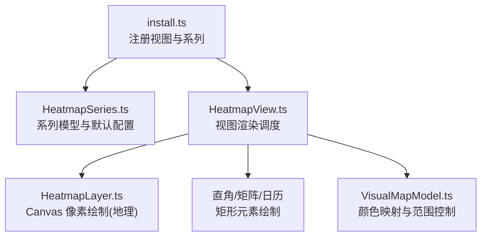
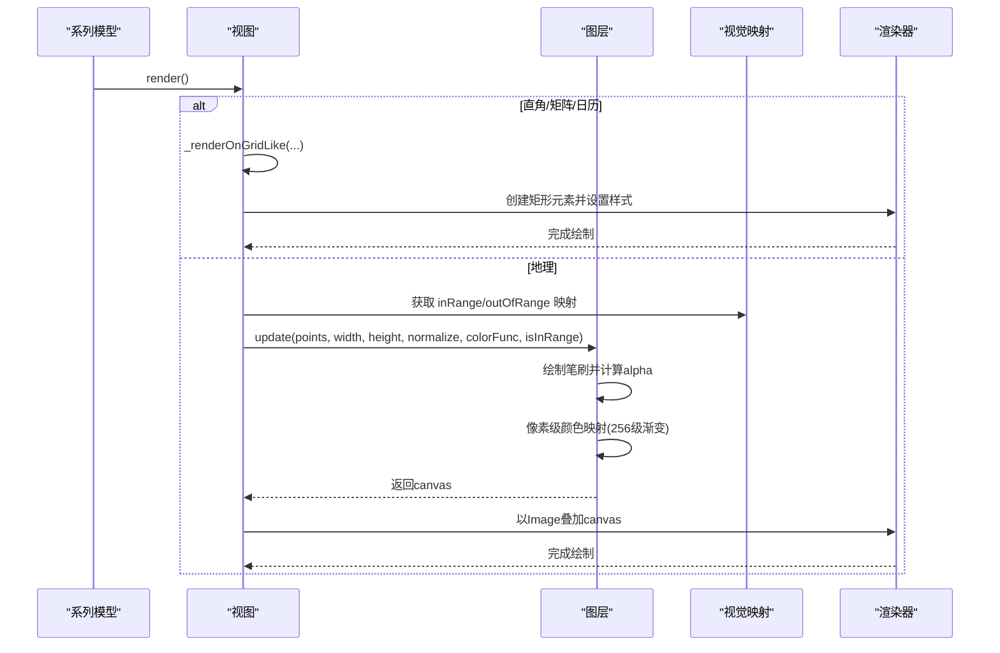
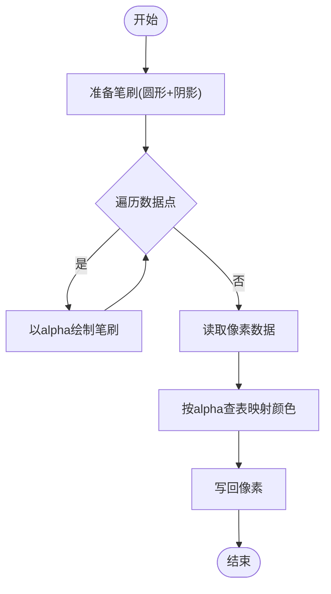
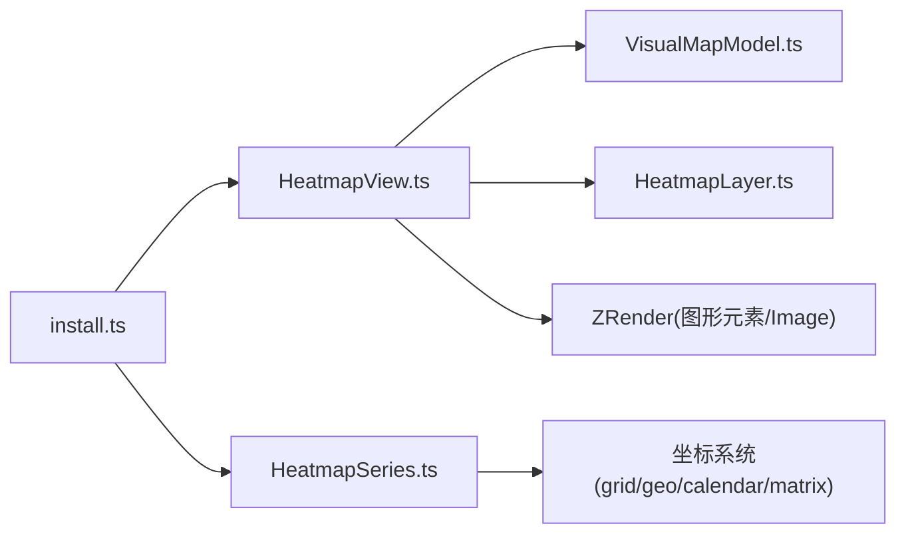

# 热力图（Heatmap）

<cite>
**本文引用的文件**
- [src/chart/heatmap.ts](file://src/chart/heatmap.ts)
- [src/chart/heatmap/install.ts](file://src/chart/heatmap/install.ts)
- [src/chart/heatmap/HeatmapSeries.ts](file://src/chart/heatmap/HeatmapSeries.ts)
- [src/chart/heatmap/HeatmapView.ts](file://src/chart/heatmap/HeatmapView.ts)
- [src/chart/heatmap/HeatmapLayer.ts](file://src/chart/heatmap/HeatmapLayer.ts)
- [src/component/visualMap/VisualMapModel.ts](file://src/component/visualMap/VisualMapModel.ts)
- [test/heatmap.html](file://test/heatmap.html)
- [test/heatmap-geo.html](file://test/heatmap-geo.html)
- [test/calendar-heatmap.html](file://test/calendar-heatmap.html)
</cite>

## 目录
1. [简介](#简介)
2. [项目结构](#项目结构)
3. [核心组件](#核心组件)
4. [架构总览](#架构总览)
5. [详细组件分析](#详细组件分析)
6. [依赖关系分析](#依赖关系分析)
7. [性能与大数据优化](#性能与大数据优化)
8. [交互能力与使用示例](#交互能力与使用示例)
9. [故障排查](#故障排查)
10. [结论](#结论)
11. [附录：数据格式与配置参考](#附录数据格式与配置参考)

## 简介
本文件系统性梳理 ECharts 中“热力图”的实现原理、数据格式、渲染管线、颜色映射、坐标系适配以及典型应用场景，并给出性能优化与交互能力的实践建议。内容基于源码与测试用例进行归纳，确保可追溯与可验证。

## 项目结构
热力图由“系列模型 + 视图 + 图层”三部分构成，并通过安装器注册到 ECharts 扩展系统：
- 入口注册：通过 install.ts 将 HeatmapView 与 HeatmapSeriesModel 注册为图表类型与系列模型。
- 系列模型：定义数据类型、默认选项、坐标系统依赖与增量渲染策略。
- 视图层：负责根据坐标系统选择渲染路径（直角/矩阵/日历 vs 地理），并驱动底层绘制。
- 图层层：地理热力图使用 Canvas 像素级绘制，实现点扩散与颜色映射。

图示来源
- [src/chart/heatmap/install.ts:20-27](file://src/chart/heatmap/install.ts#L20-L27)
- [src/chart/heatmap/HeatmapSeries.ts:87-136](file://src/chart/heatmap/HeatmapSeries.ts#L87-L136)
- [src/chart/heatmap/HeatmapView.ts:102-135](file://src/chart/heatmap/HeatmapView.ts#L102-L135)
- [src/chart/heatmap/HeatmapLayer.ts:57-125](file://src/chart/heatmap/HeatmapLayer.ts#L57-L125)
- [src/component/visualMap/VisualMapModel.ts:179-200](file://src/component/visualMap/VisualMapModel.ts#L179-L200)

章节来源
- [src/chart/heatmap/install.ts:20-27](file://src/chart/heatmap/install.ts#L20-L27)
- [src/chart/heatmap/HeatmapSeries.ts:87-136](file://src/chart/heatmap/HeatmapSeries.ts#L87-L136)
- [src/chart/heatmap/HeatmapView.ts:102-135](file://src/chart/heatmap/HeatmapView.ts#L102-L135)

## 核心组件
- 系列模型（HeatmapSeriesModel）
  - 声明系列类型为 heatmap，支持坐标系统 cartesian2d、geo、calendar、matrix。
  - 提供默认配置：geoIndex、blurSize、pointSize、minOpacity、maxOpacity、select 样式等。
  - 在地理坐标系下禁用增量渲染，避免复杂变换带来的不一致。
- 视图（HeatmapView）
  - 根据 coordinateSystem 分支：
    - 直角/矩阵/日历：按数据项生成矩形元素，支持标签、边框圆角、状态样式与渐进式渲染。
    - 地理：调用 HeatmapLayer 进行 Canvas 像素级绘制，输出 Image 叠加到画布。
  - 与 visualMap 联动：读取 inRange/outOfRange 的颜色映射与范围选择逻辑。
- 图层（HeatmapLayer）
  - 使用 Canvas 绘制圆形笔刷，结合阴影模糊实现“光晕”效果。
  - 将值归一化为 alpha，再映射到预计算的渐变色表（256 级），最终合成图像。
  - 支持 minOpacity/maxOpacity 控制透明度范围。

章节来源
- [src/chart/heatmap/HeatmapSeries.ts:87-136](file://src/chart/heatmap/HeatmapSeries.ts#L87-L136)
- [src/chart/heatmap/HeatmapView.ts:102-135](file://src/chart/heatmap/HeatmapView.ts#L102-L135)
- [src/chart/heatmap/HeatmapLayer.ts:31-125](file://src/chart/heatmap/HeatmapLayer.ts#L31-L125)

## 架构总览
热力图渲染流程分为两条主线：
- 直角/矩阵/日历：逐条数据生成矩形元素，应用视觉映射与样式，支持 hover/select/emphasis 状态与标签。
- 地理：将经纬度点转换为屏幕坐标，使用 Canvas 绘制带模糊的圆形笔刷，再以颜色映射填充像素，最后以 Image 形式叠加。

图示来源
- [src/chart/heatmap/HeatmapView.ts:102-135](file://src/chart/heatmap/HeatmapView.ts#L102-L135)
- [src/chart/heatmap/HeatmapView.ts:351-425](file://src/chart/heatmap/HeatmapView.ts#L351-L425)
- [src/chart/heatmap/HeatmapLayer.ts:57-125](file://src/chart/heatmap/HeatmapLayer.ts#L57-L125)
- [src/component/visualMap/VisualMapModel.ts:179-200](file://src/component/visualMap/VisualMapModel.ts#L179-L200)

## 详细组件分析

### 系列模型（HeatmapSeriesModel）
- 坐标系统依赖：grid、geo、calendar、matrix。
- 默认选项：
  - coordinateSystem: 'cartesian2d'
  - geoIndex: 0
  - blurSize: 30, pointSize: 20
  - maxOpacity: 1, minOpacity: 0
  - select.itemStyle.borderColor 使用主题色
- 增量渲染策略：当坐标系统维度为 lng/lat 时，禁止增量渲染，保证地理场景一致性。

章节来源
- [src/chart/heatmap/HeatmapSeries.ts:87-136](file://src/chart/heatmap/HeatmapSeries.ts#L87-L136)

### 视图（HeatmapView）
- 渲染分支：
  - 直角/矩阵/日历：_renderOnGridLike
    - 直角：要求两个轴均为 category 且 onBand=true；计算单元格宽高，生成 Rect 元素。
    - 矩阵：使用 dataToLayout 获取 rect，跳过无效布局。
    - 日历：使用 dataToLayout 获取 contentRect/rect，跳过无效布局。
    - 支持 itemStyle 的 borderRadius、label、emphasis/blur/select 状态样式。
  - 地理：_renderOnGeo
    - 从 visualMap 获取 inRange/outOfRange 的颜色映射函数与范围判断。
    - 将经纬度点转为屏幕坐标，构建 points[x,y,value] 数组。
    - 调用 HeatmapLayer.update 生成 canvas，并以 Image 叠加。
- 渐进式渲染：非地理坐标支持 incrementalRender，分批绘制以提升大数性能。

章节来源
- [src/chart/heatmap/HeatmapView.ts:102-135](file://src/chart/heatmap/HeatmapView.ts#L102-L135)
- [src/chart/heatmap/HeatmapView.ts:164-349](file://src/chart/heatmap/HeatmapView.ts#L164-L349)
- [src/chart/heatmap/HeatmapView.ts:351-425](file://src/chart/heatmap/HeatmapView.ts#L351-L425)

### 图层（HeatmapLayer）
- 笔刷缓存：预生成圆形笔刷 canvas，利用 shadowBlur 实现柔和边缘。
- 颜色映射：
  - 将 value 归一化后作为 alpha 写入像素。
  - 预计算 256 级渐变色表（inRange/outOfRange），按 alpha 索引取色。
  - 支持 minOpacity/maxOpacity 调整最终透明度范围。
- 更新流程：update(data, width, height, normalize, colorFunc, isInRange)
  - 遍历数据点，绘制笔刷。
  - 读取像素数据，按 alpha 映射颜色并写回。
  - 返回合成后的 canvas。

图示来源
- [src/chart/heatmap/HeatmapLayer.ts:57-125](file://src/chart/heatmap/HeatmapLayer.ts#L57-L125)
- [src/chart/heatmap/HeatmapLayer.ts:130-156](file://src/chart/heatmap/HeatmapLayer.ts#L130-L156)
- [src/chart/heatmap/HeatmapLayer.ts:162-175](file://src/chart/heatmap/HeatmapLayer.ts#L162-L175)

### 视觉映射（VisualMapModel）
- 提供 inRange/outOfRange 的颜色映射与范围选择逻辑。
- 连续型与分段型两种模式，分别对应不同的范围判断函数。
- 热力图视图中根据类型选择 isInRange 判定，用于过滤或高亮显示。

章节来源
- [src/component/visualMap/VisualMapModel.ts:179-200](file://src/component/visualMap/VisualMapModel.ts#L179-L200)
- [src/chart/heatmap/HeatmapView.ts:396-413](file://src/chart/heatmap/HeatmapView.ts#L396-L413)

## 依赖关系分析
- 系列模型依赖坐标系统：grid、geo、calendar、matrix。
- 视图依赖视觉映射组件以获取颜色映射与范围选择。
- 地理热力图依赖 Canvas 平台 API 进行像素操作。
- 安装器将视图与系列模型注册到 ECharts 扩展系统，供统一调度。

图示来源
- [src/chart/heatmap/HeatmapSeries.ts:87-92](file://src/chart/heatmap/HeatmapSeries.ts#L87-L92)
- [src/chart/heatmap/HeatmapView.ts:102-135](file://src/chart/heatmap/HeatmapView.ts#L102-L135)
- [src/chart/heatmap/HeatmapLayer.ts:22-49](file://src/chart/heatmap/HeatmapLayer.ts#L22-L49)
- [src/chart/heatmap/install.ts:20-27](file://src/chart/heatmap/install.ts#L20-L27)

章节来源
- [src/chart/heatmap/HeatmapSeries.ts:87-92](file://src/chart/heatmap/HeatmapSeries.ts#L87-L92)
- [src/chart/heatmap/HeatmapView.ts:102-135](file://src/chart/heatmap/HeatmapView.ts#L102-L135)
- [src/chart/heatmap/HeatmapLayer.ts:22-49](file://src/chart/heatmap/HeatmapLayer.ts#L22-L49)
- [src/chart/heatmap/install.ts:20-27](file://src/chart/heatmap/install.ts#L20-L27)

## 性能与大数据优化
- 渐进式渲染（直角/矩阵/日历）：
  - 视图支持 incrementalRender，分批绘制矩形元素，降低首帧压力。
  - 对每个元素标记 incremental ID，便于增量更新。
- 地理热力图像素级绘制：
  - 使用 Canvas 笔刷与阴影模糊，减少 DOM 节点数量。
  - 预计算 256 级渐变色表，避免重复计算。
  - 仅对可见区域（viewport）进行裁剪与绘制，提升性能。
- 数值归一化与透明度控制：
  - 通过 visualMap 的归一化函数将值映射到 alpha，配合 minOpacity/maxOpacity 控制整体透明度范围。
- WebGL 加速说明：
  - 当前地理热力图实现基于 Canvas 2D 像素操作，未直接使用 WebGL。
  - 若需更高性能，可在上层数据预处理阶段进行聚合/采样，或使用自定义渲染器扩展。

章节来源
- [src/chart/heatmap/HeatmapView.ts:141-158](file://src/chart/heatmap/HeatmapView.ts#L141-L158)
- [src/chart/heatmap/HeatmapView.ts:351-425](file://src/chart/heatmap/HeatmapView.ts#L351-L425)
- [src/chart/heatmap/HeatmapLayer.ts:57-125](file://src/chart/heatmap/HeatmapLayer.ts#L57-L125)

## 交互能力与使用示例
- 数据提示（tooltip）：
  - 直角/矩阵/日历：矩形元素支持 tooltip，展示 value 与标签文本。
  - 地理：可通过 tooltip 配置展示点位信息。
- 区域选择（brush/visualMap.selected）：
  - 直角/矩阵/日历：支持 brush 框选与 visualMap 分段选择。
  - 地理：通过 visualMap 的 selected 区间控制 inRange/outOfRange 显示。
- 动态更新：
  - 直角/矩阵/日历：支持 setOption 与 appendData 增量更新。
  - 地理：不支持增量渲染，需整图重绘。
- 示例参考：
  - 直角坐标系热力图：[test/heatmap.html](file://test/heatmap.html)
  - 地理坐标系热力图：[test/heatmap-geo.html](file://test/heatmap-geo.html)
  - 时间序列（日历）热力图：[test/calendar-heatmap.html](file://test/calendar-heatmap.html)

章节来源
- [test/heatmap.html:68-108](file://test/heatmap.html#L68-L108)
- [test/heatmap-geo.html:54-109](file://test/heatmap-geo.html#L54-L109)
- [test/calendar-heatmap.html:69-98](file://test/calendar-heatmap.html#L69-L98)

## 故障排查
- 直角坐标系要求：
  - 必须使用两个 category 轴，且 onBand=true（边界间隙开启）。
  - 否则会在开发模式下抛出错误。
- 视觉映射必需：
  - 开发模式下，若未配置 visualMap，会抛出错误提示。
- 地理坐标系限制：
  - 不支持增量渲染，需在数据变化时整图重绘。
- 空数据与越界：
  - 直角/矩阵/日历：忽略 NaN 或超出坐标范围的点。
  - 日历：忽略无有效布局的点。

章节来源
- [src/chart/heatmap/HeatmapView.ts:183-189](file://src/chart/heatmap/HeatmapView.ts#L183-L189)
- [src/chart/heatmap/HeatmapView.ts:112-116](file://src/chart/heatmap/HeatmapView.ts#L112-L116)
- [src/chart/heatmap/HeatmapView.ts:231-241](file://src/chart/heatmap/HeatmapView.ts#L231-L241)
- [src/chart/heatmap/HeatmapView.ts:263-265](file://src/chart/heatmap/HeatmapView.ts#L263-L265)
- [src/chart/heatmap/HeatmapView.ts:273-280](file://src/chart/heatmap/HeatmapView.ts#L273-L280)

## 结论
ECharts 的热力图实现了多坐标系统适配与高性能渲染：
- 直角/矩阵/日历：基于图形元素，支持丰富的交互与样式。
- 地理：基于 Canvas 像素级绘制，适合大规模点位可视化。
- 颜色映射由 visualMap 统一管理，支持连续与分段模式。
- 针对大数据量，提供了渐进式渲染与像素级优化方案。

## 附录：数据格式与配置参考
- 数据格式
  - 直角/矩阵：二维数据矩阵，每项包含 x、y、value（可选 label）。
  - 日历：每项包含 time、value。
  - 地理：每项包含 lng、lat、value。
- 关键配置
  - series.type: 'heatmap'
  - coordinateSystem: 'cartesian2d' | 'geo' | 'calendar' | 'matrix'
  - visualMap: 配置 inRange/outOfRange 的颜色映射与范围选择。
  - 地理相关：blurSize、pointSize、minOpacity、maxOpacity。
- 示例路径
  - 直角坐标系：[test/heatmap.html](file://test/heatmap.html)
  - 地理坐标系：[test/heatmap-geo.html](file://test/heatmap-geo.html)
  - 时间序列（日历）：[test/calendar-heatmap.html](file://test/calendar-heatmap.html)