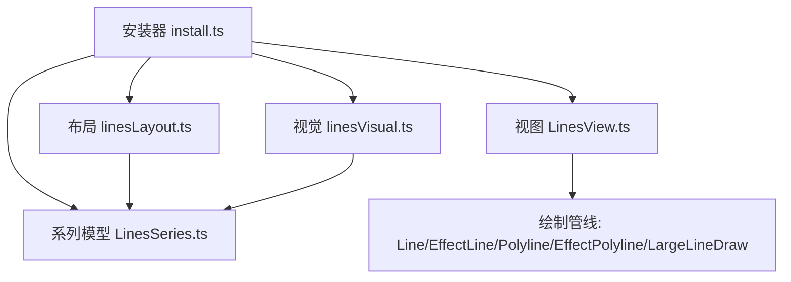
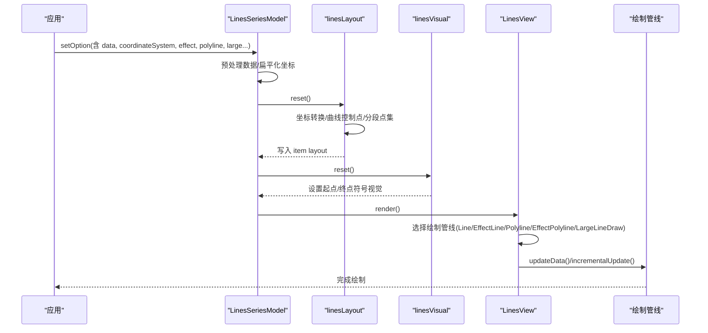
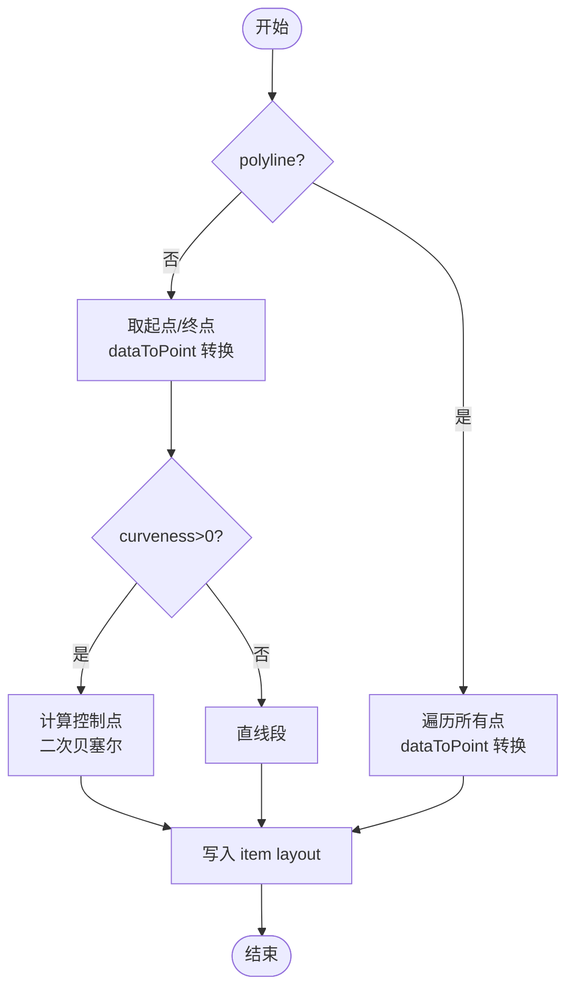
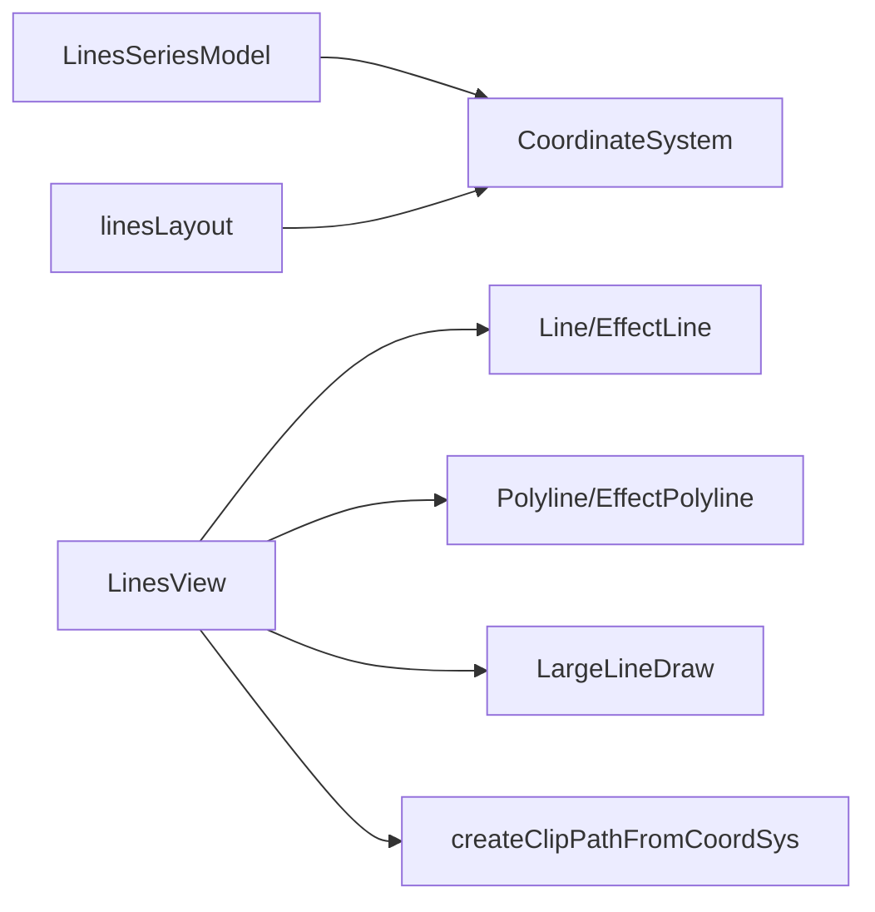

# 线路图（Lines）

<cite>
**本文引用的文件**
- [src/chart/lines.ts](file://src/chart/lines.ts)
- [src/chart/lines/install.ts](file://src/chart/lines/install.ts)
- [src/chart/lines/LinesSeries.ts](file://src/chart/lines/LinesSeries.ts)
- [src/chart/lines/LinesView.ts](file://src/chart/lines/LinesView.ts)
- [src/chart/lines/linesLayout.ts](file://src/chart/lines/linesLayout.ts)
- [src/chart/lines/linesVisual.ts](file://src/chart/lines/linesVisual.ts)
- [src/chart/helper/EffectLine.ts](file://src/chart/helper/EffectLine.ts)
- [src/chart/helper/LargeLineDraw.ts](file://src/chart/helper/LargeLineDraw.ts)
- [test/lines-flight.html](file://test/lines-flight.html)
- [test/lines-bus.html](file://test/lines-bus.html)
</cite>

## 目录
1. [简介](#简介)
2. [项目结构](#项目结构)
3. [核心组件](#核心组件)
4. [架构总览](#架构总览)
5. [详细组件分析](#详细组件分析)
6. [依赖关系分析](#依赖关系分析)
7. [性能考量](#性能考量)
8. [故障排查指南](#故障排查指南)
9. [结论](#结论)
10. [附录](#附录)

## 简介
本文件围绕 ECharts 的“线路图（Lines）”能力，系统阐述数据格式、绘制与路径计算、曲线平滑、样式配置、交互能力以及大规模数据的性能优化方案。内容基于源码实现与测试用例进行归纳，帮助读者在人口流动、物流追踪、交通路线等地理信息可视化场景中高效使用 Lines。

## 项目结构
Lines 系列由模型（Model）、视图（View）、布局（Layout）、视觉映射（Visual）四部分构成，并通过安装器注册到 ECharts 扩展体系：
- 安装入口：负责注册 View、SeriesModel、Layout、Visual
- SeriesModel：解析数据、坐标处理、默认项、渐进渲染阈值等
- Layout：将数据坐标转换为绘图坐标，计算折线/曲线点集
- Visual：为起点/终点符号提供视觉属性
- View：选择具体绘制管线（普通/大数/带特效），执行增量渲染与裁剪

**图表来源**
- [src/chart/lines/install.ts:20-31](file://src/chart/lines/install.ts#L20-L31)
- [src/chart/lines/LinesSeries.ts:147-175](file://src/chart/lines/LinesSeries.ts#L147-L175)
- [src/chart/lines/LinesView.ts:56-105](file://src/chart/lines/LinesView.ts#L56-L105)
- [src/chart/lines/linesLayout.ts:27-103](file://src/chart/lines/linesLayout.ts#L27-L103)
- [src/chart/lines/linesVisual.ts:35-64](file://src/chart/lines/linesVisual.ts#L35-L64)

**章节来源**
- [src/chart/lines/install.ts:20-31](file://src/chart/lines/install.ts#L20-L31)
- [src/chart/lines/LinesSeries.ts:147-175](file://src/chart/lines/LinesSeries.ts#L147-L175)
- [src/chart/lines/LinesView.ts:56-105](file://src/chart/lines/LinesView.ts#L56-L105)
- [src/chart/lines/linesLayout.ts:27-103](file://src/chart/lines/linesLayout.ts#L27-L103)
- [src/chart/lines/linesVisual.ts:35-64](file://src/chart/lines/linesVisual.ts#L35-L64)

## 核心组件
- 系列模型（LinesSeriesModel）
  - 负责数据预处理（兼容旧版数据格式）、扁平化坐标存储、获取每段坐标长度与坐标数组、初始化 SeriesData、格式化 Tooltip、渐进渲染阈值与 zlevel 策略等。
- 视图（LinesView）
  - 根据是否启用特效、是否 polyline、是否 large 模式，动态选择绘制管线；支持增量渲染、裁剪路径、运动模糊层配置。
- 布局（linesLayout）
  - 将数据坐标转为绘图坐标；对两点连线计算控制点以实现曲线；对多点折线生成连续点序列；支持大数据量下的分块进度处理。
- 视觉（linesVisual）
  - 为起点/终点符号类型与尺寸设置视觉属性，支持全局与逐项覆盖。

**章节来源**
- [src/chart/lines/LinesSeries.ts:147-175](file://src/chart/lines/LinesSeries.ts#L147-L175)
- [src/chart/lines/LinesSeries.ts:210-254](file://src/chart/lines/LinesSeries.ts#L210-L254)
- [src/chart/lines/LinesSeries.ts:256-304](file://src/chart/lines/LinesSeries.ts#L256-L304)
- [src/chart/lines/LinesSeries.ts:306-332](file://src/chart/lines/LinesSeries.ts#L306-L332)
- [src/chart/lines/LinesSeries.ts:368-394](file://src/chart/lines/LinesSeries.ts#L368-L394)
- [src/chart/lines/LinesView.ts:56-105](file://src/chart/lines/LinesView.ts#L56-L105)
- [src/chart/lines/LinesView.ts:160-195](file://src/chart/lines/LinesView.ts#L160-L195)
- [src/chart/lines/linesLayout.ts:27-103](file://src/chart/lines/linesLayout.ts#L27-L103)
- [src/chart/lines/linesVisual.ts:35-64](file://src/chart/lines/linesVisual.ts#L35-L64)

## 架构总览
Lines 的渲染流程遵循 ECharts 的标准阶段：数据准备 → 布局计算 → 视觉映射 → 视图绘制。视图根据运行期条件选择不同绘制管线，并支持增量渲染与裁剪。

**图表来源**
- [src/chart/lines/LinesSeries.ts:160-191](file://src/chart/lines/LinesSeries.ts#L160-L191)
- [src/chart/lines/linesLayout.ts:32-103](file://src/chart/lines/linesLayout.ts#L32-L103)
- [src/chart/lines/linesVisual.ts:35-64](file://src/chart/lines/linesVisual.ts#L35-L64)
- [src/chart/lines/LinesView.ts:56-105](file://src/chart/lines/LinesView.ts#L56-L105)
- [src/chart/helper/LargeLineDraw.ts:249-285](file://src/chart/helper/LargeLineDraw.ts#L249-L285)

## 详细组件分析

### 数据格式与坐标定义
- 基本数据项
  - coords：二维坐标数组，表示路径上的点列。对于两点连线，通常包含起点与终点两个坐标；对于多段折线，可包含多个坐标点。
  - value：可选数值或数组，用于 Tooltip 显示或视觉映射。
  - fromName / toName：起点/终点名称，Tooltip 中会组合显示。
  - symbol / symbolSize：起点/终点符号类型与大小，支持全局与逐项覆盖。
  - lineStyle.curveness：当 polyline=false 时，两点连线可通过该值计算贝塞尔控制点以产生曲线效果。
  - effect：轨迹动画特效配置（如周期、尾迹长度、循环等）。
- 扁平数组格式（高性能）
  - 当 data 为数字数组时，采用紧凑格式：每个线段以“点数”开头，随后是 x,y 交替的点坐标。布局阶段会将这些点批量转换为绘图坐标，减少中间对象创建。
- 坐标系
  - 通过 coordinateSystem 指定（如 geo、bmap、grid、polar 等），布局阶段调用坐标系统的 dataToPoint 方法将数据坐标转为屏幕坐标。

**章节来源**
- [src/chart/lines/LinesSeries.ts:97-145](file://src/chart/lines/LinesSeries.ts#L97-L145)
- [src/chart/lines/LinesSeries.ts:210-254](file://src/chart/lines/LinesSeries.ts#L210-L254)
- [src/chart/lines/LinesSeries.ts:256-304](file://src/chart/lines/LinesSeries.ts#L256-L304)
- [src/chart/lines/linesLayout.ts:61-99](file://src/chart/lines/linesLayout.ts#L61-L99)

### 绘制逻辑与路径计算
- 两点连线与曲线
  - 当 polyline=false 且 curveness>0 时，布局阶段会基于起点与终点计算一个控制点，形成二次贝塞尔曲线。
- 多点折线
  - 当 polyline=true 时，将所有点按顺序连接成折线；在大数模式下，布局阶段会预分配 Float32Array 并批量写入点坐标，提升性能。
- 坐标转换
  - 通过坐标系统的 dataToPoint 将经纬度或网格坐标转换为画布坐标；在 large 模式下，使用临时数组避免频繁分配。
- 裁剪
  - 视图可为组设置裁剪路径，限制线条仅在可视区域内绘制，减少溢出开销。

**图表来源**
- [src/chart/lines/linesLayout.ts:76-99](file://src/chart/lines/linesLayout.ts#L76-L99)

**章节来源**
- [src/chart/lines/linesLayout.ts:43-100](file://src/chart/lines/linesLayout.ts#L43-L100)
- [src/chart/lines/LinesView.ts:92-100](file://src/chart/lines/LinesView.ts#L92-L100)

### 样式配置
- 线条样式
  - color、width、opacity、dashArray 等通过 lineStyle 配置；默认透明度为 0.5。
- 曲线平滑
  - 通过 lineStyle.curveness 控制曲线弯曲程度；仅适用于两点连线模式。
- 起点/终点符号
  - symbol/symbolSize 支持全局与逐项覆盖；视觉映射阶段会为起点/终点分别设置类型与尺寸。
- 特效
  - effect.show 开启后，会在路径上播放移动符号动画；trailLength 控制尾迹长度；loop 控制是否循环；constantSpeed 控制速度模式。
- 混合模式
  - blendMode 可用于叠加渲染，适合大量密集线条场景。

**章节来源**
- [src/chart/lines/LinesSeries.ts:396-439](file://src/chart/lines/LinesSeries.ts#L396-L439)
- [src/chart/lines/linesVisual.ts:35-64](file://src/chart/lines/linesVisual.ts#L35-L64)
- [src/chart/helper/EffectLine.ts:72-110](file://src/chart/helper/EffectLine.ts#L72-L110)
- [test/lines-flight.html:119-135](file://test/lines-flight.html#L119-L135)

### 交互功能
- Tooltip
  - 自动组合 fromName > toName 作为名称；value 为空或非数值时隐藏值显示。
- 轨迹播放
  - 启用 effect.show 后，路径上会有沿曲线运动的符号；支持循环与往返模式；SVG 模式下不支持尾迹特效。
- 数据筛选与动态更新
  - 结合 dataZoom、legend 等组件可实现筛选；appendData 支持追加数据；setOption 可动态更新配置。
- 裁剪与缩放
  - clip 开启后，超出坐标系的线条将被裁剪；配合 geo/grid/polar 的 roam 可实现缩放平移。

**章节来源**
- [src/chart/lines/LinesSeries.ts:334-366](file://src/chart/lines/LinesSeries.ts#L334-L366)
- [src/chart/helper/EffectLine.ts:112-185](file://src/chart/helper/EffectLine.ts#L112-L185)
- [src/chart/lines/LinesView.ts:68-88](file://src/chart/lines/LinesView.ts#L68-L88)
- [src/chart/lines/LinesSeries.ts:193-208](file://src/chart/lines/LinesSeries.ts#L193-L208)

### 示例场景
- 世界航班航线（geo + large）
  - 使用 geo 坐标系，large 开启以提升性能；lineStyle 设置低透明度与细线宽；blendMode 设置为 lighter 增强叠加效果。
- 城市公交轨迹（bmap + polyline）
  - 使用 bmap 扩展，polyline=true 绘制多段折线；lineStyle 设置较低透明度与宽度；可结合 progressiveThreshold/progressive 控制渐进渲染。

**章节来源**
- [test/lines-flight.html:119-135](file://test/lines-flight.html#L119-L135)
- [test/lines-bus.html:219-241](file://test/lines-bus.html#L219-L241)

## 依赖关系分析
Lines 的核心依赖包括：
- 坐标系统：grid、polar、geo、calendar（由 SeriesModel 声明依赖）
- 绘制管线：Line、EffectLine、Polyline、EffectPolyline、LargeLineDraw
- 工具与平台：zrender（Path、Painter、Symbol）、ECharts 任务调度与渐进渲染

**图表来源**
- [src/chart/lines/LinesSeries.ts:152-155](file://src/chart/lines/LinesSeries.ts#L152-L155)
- [src/chart/lines/LinesView.ts:20-39](file://src/chart/lines/LinesView.ts#L20-L39)
- [src/chart/lines/linesLayout.ts:22-25](file://src/chart/lines/linesLayout.ts#L22-L25)

**章节来源**
- [src/chart/lines/LinesSeries.ts:152-155](file://src/chart/lines/LinesSeries.ts#L152-L155)
- [src/chart/lines/LinesView.ts:20-39](file://src/chart/lines/LinesView.ts#L20-L39)
- [src/chart/lines/linesLayout.ts:22-25](file://src/chart/lines/linesLayout.ts#L22-L25)

## 性能考量
- 大数模式（large）
  - 当数据量超过阈值时，布局阶段使用 TypedArray 批量写入点坐标，减少内存分配与 GC 压力；视图切换至 LargeLineDraw 进行增量合并绘制。
- 渐进渲染（progressive / progressiveThreshold）
  - 根据数据规模与 effect 配置动态决定渐进渲染策略，避免首屏卡顿。
- 增量渲染（incrementalPrepareRender/incrementalRender）
  - 在拖拽、缩放等交互过程中，仅更新变化部分，降低重绘成本。
- 裁剪（clip）
  - 启用 clip 后，仅绘制可视区域内的线条，减少无效绘制。
- WebGL 加速说明
  - Lines 当前实现主要基于 Canvas/SVG 与 zrender 图形管线；仓库未提供专门的 WebGL 渲染器集成。若需 WebGL 加速，可在业务层使用自定义 series/custom 或扩展 renderer 的方式接入第三方 WebGL 库，但需注意与 ECharts 坐标系统与事件体系的对接。

**章节来源**
- [src/chart/lines/LinesSeries.ts:372-394](file://src/chart/lines/LinesSeries.ts#L372-L394)
- [src/chart/lines/LinesView.ts:107-127](file://src/chart/lines/LinesView.ts#L107-L127)
- [src/chart/helper/LargeLineDraw.ts:249-285](file://src/chart/helper/LargeLineDraw.ts#L249-L285)

## 故障排查指南
- 未知坐标系
  - 若 coordinateSystem 未正确配置或不存在，布局阶段会报错；请确保已引入对应坐标系统（如 geo、bmap、grid、polar）。
- 坐标格式错误
  - coords 必须为二维数组；否则在开发模式下会抛出异常；请检查数据源结构与维度。
- SVG 不支持尾迹特效
  - 当使用 SVG 渲染且启用 trailLength>0 时，会输出警告；建议切换到 Canvas 渲染以获得完整特效。
- 大数模式与特效冲突
  - 大数模式下不推荐同时启用复杂特效；如需特效，可降低数据规模或关闭 large。

**章节来源**
- [src/chart/lines/LinesSeries.ts:306-312](file://src/chart/lines/LinesSeries.ts#L306-L312)
- [src/chart/lines/LinesSeries.ts:215-222](file://src/chart/lines/LinesSeries.ts#L215-L222)
- [src/chart/lines/LinesView.ts:78-87](file://src/chart/lines/LinesView.ts#L78-L87)
- [src/chart/lines/LinesView.ts:167-171](file://src/chart/lines/LinesView.ts#L167-L171)

## 结论
Lines 提供了灵活的数据格式与强大的绘制能力，支持两点曲线与多点折线，具备丰富的样式与交互选项。通过 large、progressive、incremental、clip 等机制，可有效应对大规模数据场景。在地理信息可视化中，结合 geo/bmap 坐标系与示例配置，能够快速构建人口流动、物流追踪、交通路线等可视化效果。若需 WebGL 加速，建议在业务层通过自定义渲染器或扩展方式集成。

## 附录
- 常用配置要点
  - coordinateSystem：geo/bmap/grid/polar
  - polyline：true/false（折线/曲线）
  - lineStyle.curveness：曲线弯曲度（仅两点连线）
  - effect.show/trailLength/loop：轨迹动画
  - large/progressive/progressiveThreshold：大数与渐进渲染
  - clip：裁剪溢出区域
  - blendMode：叠加混合（如 lighter）
- 参考示例
  - 世界航班：[test/lines-flight.html](file://test/lines-flight.html)
  - 城市公交：[test/lines-bus.html](file://test/lines-bus.html)