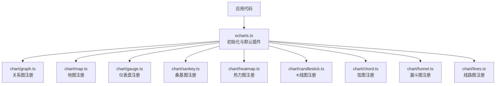
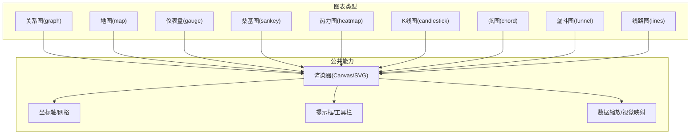
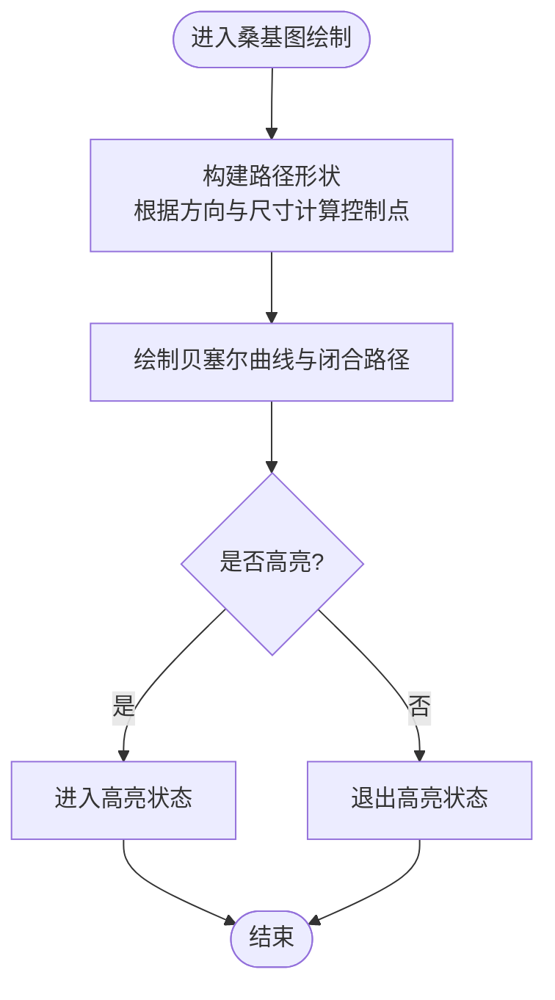
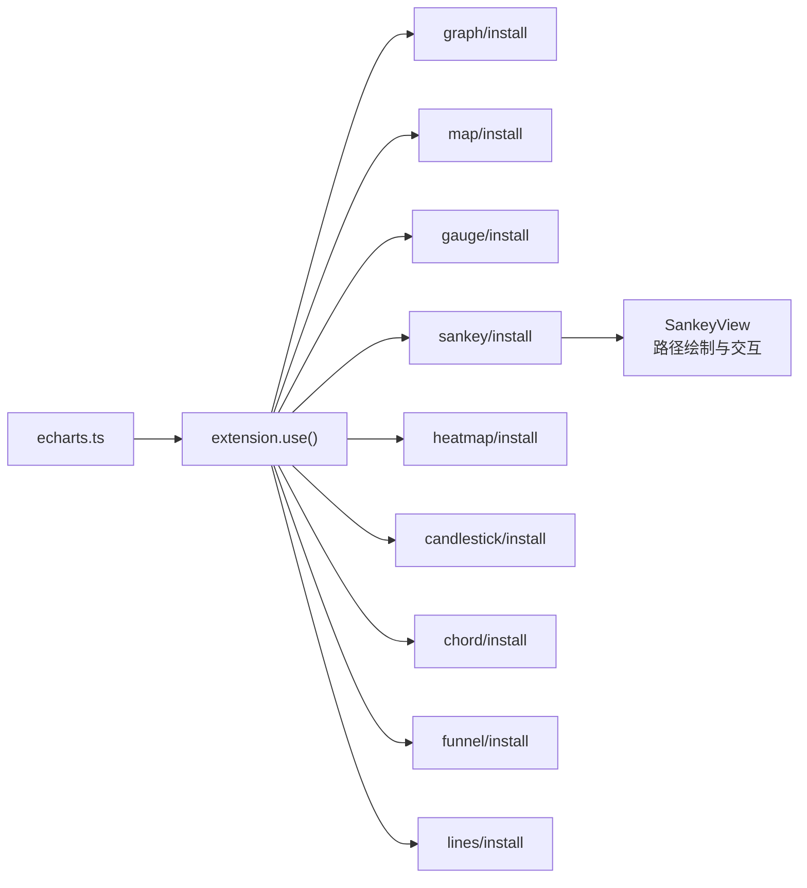

# 高级图表

<cite>
**本文引用的文件**
- [README.md](file://README.md)
- [echarts.ts](file://src/echarts.ts)
- [graph.ts](file://src/chart/graph.ts)
- [map.ts](file://src/chart/map.ts)
- [gauge.ts](file://src/chart/gauge.ts)
- [sankey.ts](file://src/chart/sankey.ts)
- [heatmap.ts](file://src/chart/heatmap.ts)
- [candlestick.ts](file://src/chart/candlestick.ts)
- [chord.ts](file://src/chart/chord.ts)
- [funnel.ts](file://src/chart/funnel.ts)
- [lines.ts](file://src/chart/lines.ts)
- [SankeyView.ts](file://src/chart/sankey/SankeyView.ts)
</cite>

## 目录
1. [简介](#简介)
2. [项目结构](#项目结构)
3. [核心组件](#核心组件)
4. [架构总览](#架构总览)
5. [详细组件分析](#详细组件分析)
6. [依赖关系分析](#依赖关系分析)
7. [性能考量](#性能考量)
8. [故障排查指南](#故障排查指南)
9. [结论](#结论)
10. [附录](#附录)

## 简介
本文件面向希望系统掌握 ECharts 高级图表类型的开发者与数据可视化工程师，覆盖关系图、地图、仪表盘、桑基图、热力图、K线图、弦图、漏斗图、线路图等复杂图表。内容涵盖：
- 适用场景与典型用例
- 数据结构要求与字段约定
- 核心配置项与交互能力
- 大数据量下的性能优化策略
- 与基础图表的组合使用与自定义扩展方案

ECharts 提供声明式配置驱动的高性能可视化能力，内置丰富的图表类型与组件生态，支持 Canvas/SVG 渲染、数据缩放、提示框、视觉映射等通用能力，便于快速构建交互式数据可视化应用。

**章节来源**
- [README.md:1-99](file://README.md#L1-L99)

## 项目结构
仓库采用“按功能域分层 + 按图表类型分模块”的组织方式：
- src/chart 下每个子目录对应一种图表类型（如 graph、map、gauge、sankey、heatmap、candlestick、chord、funnel、lines），并提供 install 入口以按需注册。
- 顶层 src/echarts.ts 默认启用 Canvas 渲染器与 dataset 组件，并暴露 init 方法作为统一入口。
- 测试用例位于 test 目录，包含大量示例页面，便于参考各图表的配置与交互。

**图示来源**
- [echarts.ts:20-46](file://src/echarts.ts#L20-L46)
- [graph.ts:20-24](file://src/chart/graph.ts#L20-L24)
- [map.ts:20-23](file://src/chart/map.ts#L20-L23)
- [gauge.ts:20-23](file://src/chart/gauge.ts#L20-L23)
- [sankey.ts:20-23](file://src/chart/sankey.ts#L20-L23)
- [heatmap.ts:20-24](file://src/chart/heatmap.ts#L20-L24)
- [candlestick.ts:20-23](file://src/chart/candlestick.ts#L20-L23)
- [chord.ts:20-25](file://src/chart/chord.ts#L20-L25)
- [funnel.ts:20-23](file://src/chart/funnel.ts#L20-L23)
- [lines.ts:20-24](file://src/chart/lines.ts#L20-L24)

**章节来源**
- [echarts.ts:20-46](file://src/echarts.ts#L20-L46)

## 核心组件
- 统一入口与默认能力
  - 通过 echarts.ts 暴露 init 方法，默认启用 Canvas 渲染器与 dataset 组件，简化初始配置。
- 图表注册机制
  - 每种高级图表通过各自 chart/<type>.ts 调用 use(install) 完成按需注册，避免全量引入带来的体积膨胀。
- 视图与布局
  - 以 SankeyView 为例，展示视图层如何绘制路径、处理高亮与交互事件，体现 ECharts 的 View 抽象与图形元素组合能力。

**章节来源**
- [echarts.ts:20-46](file://src/echarts.ts#L20-L46)
- [graph.ts:20-24](file://src/chart/graph.ts#L20-L24)
- [SankeyView.ts:70-118](file://src/chart/sankey/SankeyView.ts#L70-L118)

## 架构总览
ECharts 的高级图表由“模型-视图-组件”协同工作：
- 模型层负责解析 option、计算布局与数据流；
- 视图层负责将数据转换为图形元素并进行绘制；
- 组件层提供坐标轴、提示框、数据缩放、视觉映射等通用能力。

[本图为概念性架构图，不直接映射具体源码文件]

## 详细组件分析

### 关系图（Graph）
- 适用场景
  - 社交网络、知识图谱、组织关系、依赖关系等节点与边构成的复杂关系可视化。
- 数据结构要求
  - nodes：节点集合，通常包含 id/name/值/类别等属性；
  - edges：边集合，通常包含 source/target/value 等属性。
- 核心配置选项
  - layout：力导向、环形、极坐标等布局；
  - roam：是否支持平移缩放；
  - edgeLabel/label：标签显示与格式化；
  - emphasis：高亮样式与聚焦策略；
  - categories：分类定义与颜色映射。
- 交互功能
  - 拖拽节点、点击高亮关联、收起/展开、右键菜单等。
- 性能建议
  - 大数据量时开启采样或聚合；合理设置力导向参数减少迭代次数；按需加载边集。

**章节来源**
- [graph.ts:20-24](file://src/chart/graph.ts#L20-L24)

### 地图（Map）
- 适用场景
  - 区域统计、地理分布、迁徙流向、热力叠加等。
- 数据结构要求
  - geoJSON 或预注册地图数据；series.data 中为 {name, value} 形式。
- 核心配置选项
  - map：地图名称或 geoJSON；
  - visualMap：数值到颜色的映射；
  - roam：缩放平移；
  - label/emphasis：地名标签与高亮。
- 交互功能
  - 点击选中区域、联动其他图表、定位与缩放。
- 性能建议
  - 使用简化的 geoJSON；对海量点使用聚合或热力图替代散点。

**章节来源**
- [map.ts:20-23](file://src/chart/map.ts#L20-L23)

### 仪表盘（Gauge）
- 适用场景
  - 指标监控、进度展示、评分看板等单值度量。
- 数据结构要求
  - series.data 中的 value 表示当前值；可配置刻度范围与分段。
- 核心配置选项
  - min/max/splitNumber：刻度范围与密度；
  - axisLine/axisTick：轴线与刻度样式；
  - pointer/title/detail：指针与文案；
  - itemStyle：颜色与渐变。
- 交互功能
  - 动态更新、动画过渡、阈值告警。
- 性能建议
  - 频繁更新时使用增量 setOption；避免过度动画。

**章节来源**
- [gauge.ts:20-23](file://src/chart/gauge.ts#L20-L23)

### 桑基图（Sankey）
- 适用场景
  - 流量分配、能源流转、资金流向等“源-汇”型数据。
- 数据结构要求
  - nodes：节点列表；edges：边列表，含 source/target/value。
- 核心配置选项
  - orient：水平/垂直方向；
  - nodeAlign：节点对齐方式；
  - lineStyle/linkStyle：连线样式；
  - emphasis：高亮与聚焦相邻。
- 交互功能
  - 拖拽节点、漫游（sankeyRoam）、高亮关联路径。
- 性能建议
  - 大数据量时减少节点数或进行层级聚合；关闭不必要的动画。

**图示来源**
- [SankeyView.ts:70-118](file://src/chart/sankey/SankeyView.ts#L70-L118)

**章节来源**
- [sankey.ts:20-23](file://src/chart/sankey.ts#L20-L23)
- [SankeyView.ts:70-118](file://src/chart/sankey/SankeyView.ts#L70-L118)

### 热力图（Heatmap）
- 适用场景
  - 二维频度分布、时间×维度矩阵、地理栅格等。
- 数据结构要求
  - data：通常为 [x, y, value] 三元组；也可基于 calendar 或 geo 坐标。
- 核心配置选项
  - visualMap：颜色映射；
  - grid/polar：坐标系；
  - itemStyle：单元格样式与圆角。
- 交互功能
  - 提示框显示详情、刷选区域、联动筛选。
- 性能建议
  - 大数据量时启用采样或分块渲染；减少 tooltip 计算开销。

**章节来源**
- [heatmap.ts:20-24](file://src/chart/heatmap.ts#L20-L24)

### K线图（Candlestick）
- 适用场景
  - 金融时序数据，展示开盘、收盘、最高、最低。
- 数据结构要求
  - data：数组，每项包含 [日期, 开, 收, 低, 高] 或对象形式。
- 核心配置选项
  - xAxis/yAxis：时间轴与价格轴；
  - itemStyle：涨跌颜色；
  - dataZoom：时间范围缩放；
  - markLine/markPoint：标注关键位。
- 交互功能
  - 缩放、十字光标、提示框、标记线编辑。
- 性能建议
  - 大数据量时启用采样、减少重绘频率；按需加载历史数据。

**章节来源**
- [candlestick.ts:20-23](file://src/chart/candlestick.ts#L20-L23)

### 弦图（Chord）
- 适用场景
  - 双向关系强度、贸易往来、协作网络等。
- 数据结构要求
  - matrix：矩阵形式描述关系强度；或 nodes+links。
- 核心配置选项
  - chord：布局与连接样式；
  - visualMap：颜色映射；
  - emphasis：高亮与聚焦。
- 交互功能
  - 悬停高亮、点击聚焦相关关系。
- 性能建议
  - 大规模矩阵时考虑降维或抽样；减少标签数量。

**章节来源**
- [chord.ts:20-25](file://src/chart/chord.ts#L20-L25)

### 漏斗图（Funnel）
- 适用场景
  - 转化流程、销售漏斗、用户行为路径等。
- 数据结构要求
  - data：[{name, value}] 形式的阶段与数值。
- 核心配置选项
  - funnel：排序、对齐、宽度比例；
  - label：标签位置与格式；
  - itemStyle：颜色与透明度。
- 交互功能
  - 点击过滤、高亮阶段、提示框详情。
- 性能建议
  - 数据量大时合并相近阶段；减少动画帧数。

**章节来源**
- [funnel.ts:20-23](file://src/chart/funnel.ts#L20-L23)

### 线路图（Lines）
- 适用场景
  - 迁徙、物流、航线、网络链路等带方向的轨迹。
- 数据结构要求
  - data：起点与终点坐标或地名；可附带 value 表示强度。
- 核心配置选项
  - effect：动态效果（粒子/流光）；
  - lineStyle：线条粗细与颜色；
  - symbol：端点符号。
- 交互功能
  - 悬浮高亮、点击查看详情、轨迹动画。
- 性能建议
  - 大数据量时关闭特效或使用 GL 加速；批量更新而非逐条追加。

**章节来源**
- [lines.ts:20-24](file://src/chart/lines.ts#L20-L24)

## 依赖关系分析
- 图表注册依赖 extension.use 机制，各图表通过 install 函数注入自身能力。
- 默认入口 echarts.ts 启用 Canvas 渲染器与 dataset 组件，确保基础能力可用。
- 视图层（如 SankeyView）依赖图形元素与布局算法，实现路径绘制与交互。

**图示来源**
- [echarts.ts:20-46](file://src/echarts.ts#L20-L46)
- [graph.ts:20-24](file://src/chart/graph.ts#L20-L24)
- [map.ts:20-23](file://src/chart/map.ts#L20-L23)
- [gauge.ts:20-23](file://src/chart/gauge.ts#L20-L23)
- [sankey.ts:20-23](file://src/chart/sankey.ts#L20-L23)
- [heatmap.ts:20-24](file://src/chart/heatmap.ts#L20-L24)
- [candlestick.ts:20-23](file://src/chart/candlestick.ts#L20-L23)
- [chord.ts:20-25](file://src/chart/chord.ts#L20-L25)
- [funnel.ts:20-23](file://src/chart/funnel.ts#L20-L23)
- [lines.ts:20-24](file://src/chart/lines.ts#L20-L24)
- [SankeyView.ts:70-118](file://src/chart/sankey/SankeyView.ts#L70-L118)

**章节来源**
- [echarts.ts:20-46](file://src/echarts.ts#L20-L46)

## 性能考量
- 大数据量处理
  - 使用采样与聚合降低渲染压力；对时序数据启用 time axis 与 dataZoom 分页浏览。
  - 对关系图与热力图，优先选择更高效的布局与渲染策略（如关闭力导向迭代、使用栅格化）。
- 动画与交互
  - 在高频更新场景中禁用或缩短动画；按需触发 tooltip 与高亮。
- 内存与重绘
  - 避免重复创建大型数据集；使用增量更新与局部刷新。
- 扩展加速
  - 对超大规模轨迹或点云，可结合 ECharts GL 或其他 WebGL 扩展提升性能。

[本节为通用性能指导，不直接分析具体源码文件]

## 故障排查指南
- 图表未显示
  - 确认已正确引入对应图表的 install；检查容器尺寸与坐标轴配置。
- 数据不生效
  - 核对数据结构是否符合该图表要求（如 nodes/edges、data 三元组等）。
- 交互无响应
  - 检查是否启用了 roam、tooltip、brush 等组件；确认事件绑定是否正确。
- 性能卡顿
  - 关闭不必要的动画与特效；减少标签与标记数量；使用 dataZoom 限制可视范围。

[本节为通用排错指导，不直接分析具体源码文件]

## 结论
ECharts 的高级图表覆盖了从关系、地理到时序与流程的多类复杂可视化需求。通过统一的注册机制与强大的组件生态，开发者可以灵活组合基础与高级能力，满足从轻量看板到大规模数据分析的不同场景。建议在数据规模较大时，优先采用采样、聚合与分页策略，并结合 GL 扩展以获得更佳性能。

[本节为总结性内容，不直接分析具体源码文件]

## 附录
- 示例与学习资源
  - 官方文档与示例：参见 README 中的链接，便于查阅 API 与案例。
  - 测试用例：test 目录下包含大量 HTML 示例，可直接运行观察配置效果。

**章节来源**
- [README.md:15-34](file://README.md#L15-L34)