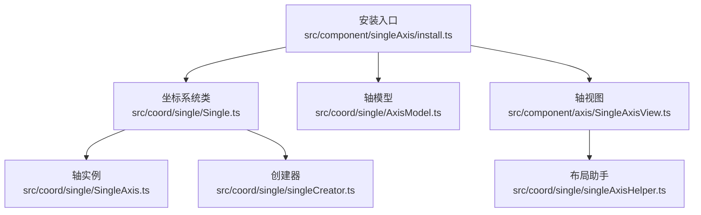
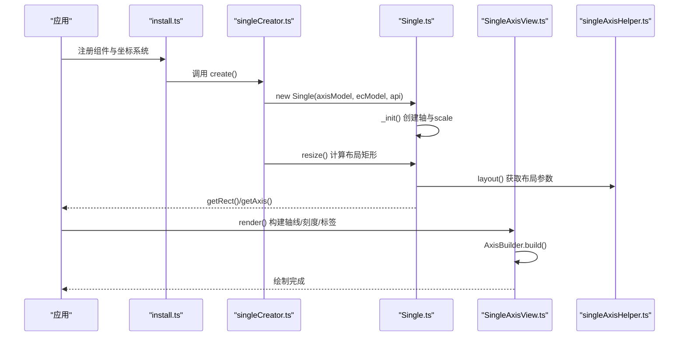
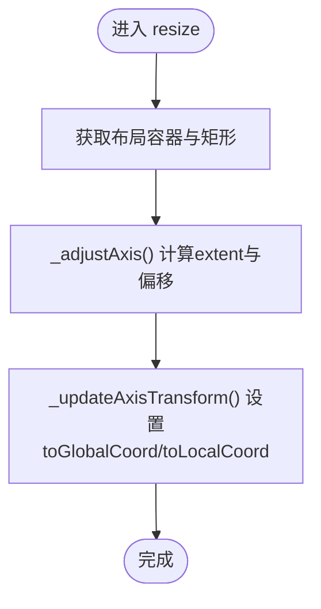
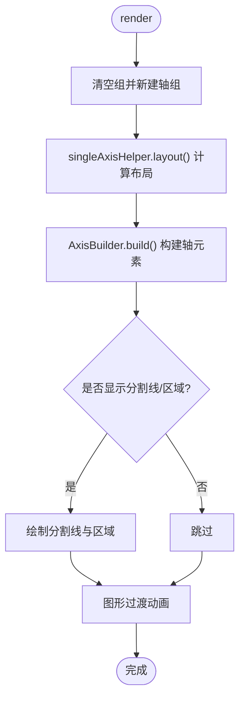
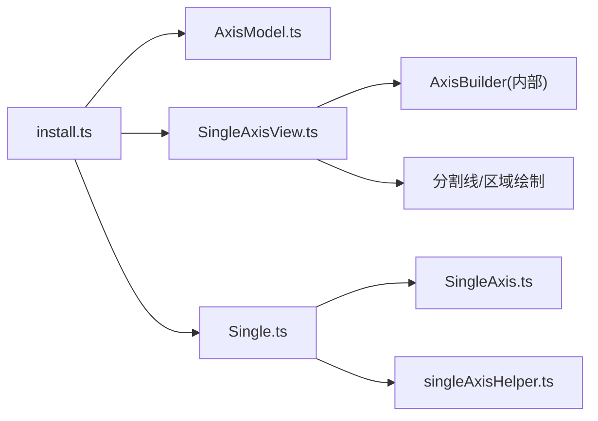

# 单轴坐标系 (SingleAxis)

<cite>
**本文引用的文件**
- [src/component/singleAxis.ts](file://src/component/singleAxis.ts)
- [src/component/singleAxis/install.ts](file://src/component/singleAxis/install.ts)
- [src/coord/single/SingleAxis.ts](file://src/coord/single/SingleAxis.ts)
- [src/coord/single/Single.ts](file://src/coord/single/Single.ts)
- [src/coord/single/AxisModel.ts](file://src/coord/single/AxisModel.ts)
- [src/coord/single/singleCreator.ts](file://src/coord/single/singleCreator.ts)
- [src/coord/single/singleAxisHelper.ts](file://src/coord/single/singleAxisHelper.ts)
- [src/component/axis/SingleAxisView.ts](file://src/component/axis/SingleAxisView.ts)
- [test/scatter-single-axis.html](file://test/scatter-single-axis.html)
- [test/singleAxisScales.html](file://test/singleAxisScales.html)
</cite>

## 目录
1. [简介](#简介)
2. [项目结构](#项目结构)
3. [核心组件](#核心组件)
4. [架构总览](#架构总览)
5. [详细组件分析](#详细组件分析)
6. [依赖关系分析](#依赖关系分析)
7. [性能考量](#性能考量)
8. [故障排查指南](#故障排查指南)
9. [结论](#结论)
10. [附录：配置与示例](#附录配置与示例)

## 简介
单轴坐标系（SingleAxis）用于展示一维连续数据，将数据映射到单一维度上，适用于时间序列、数值范围、分类刻度等场景。它通过一个轴承载数据尺度与视觉布局，配合散点、折线、柱状等图表类型，实现“单维主坐标 + 辅助视觉编码”的可视化方案。相比直角坐标系（Grid），单轴坐标系更聚焦于“单维表达”，在进度条、评分系统、时间轴、指标面板等场景中具备更高的信息密度和更简洁的交互体验。

## 项目结构
单轴坐标系由“模型-视图-坐标系统-创建器-工具函数”构成，围绕 ECharts 的扩展机制注册并参与渲染流程。

**图示来源**
- [src/component/singleAxis/install.ts:35-49](file://src/component/singleAxis/install.ts#L35-L49)
- [src/coord/single/Single.ts:63-113](file://src/coord/single/Single.ts#L63-L113)
- [src/coord/single/AxisModel.ts:53-120](file://src/coord/single/AxisModel.ts#L53-L120)
- [src/coord/single/SingleAxis.ts:40-74](file://src/coord/single/SingleAxis.ts#L40-L74)
- [src/coord/single/singleCreator.ts:38-66](file://src/coord/single/singleCreator.ts#L38-L66)
- [src/component/axis/SingleAxisView.ts:43-70](file://src/component/axis/SingleAxisView.ts#L43-L70)
- [src/coord/single/singleAxisHelper.ts:34-84](file://src/coord/single/singleAxisHelper.ts#L34-L84)

**章节来源**
- [src/component/singleAxis/install.ts:35-49](file://src/component/singleAxis/install.ts#L35-L49)
- [src/coord/single/Single.ts:63-113](file://src/coord/single/Single.ts#L63-L113)
- [src/coord/single/AxisModel.ts:53-120](file://src/coord/single/AxisModel.ts#L53-L120)
- [src/coord/single/SingleAxis.ts:40-74](file://src/coord/single/SingleAxis.ts#L40-L74)
- [src/coord/single/singleCreator.ts:38-66](file://src/coord/single/singleCreator.ts#L38-L66)
- [src/component/axis/SingleAxisView.ts:43-70](file://src/component/axis/SingleAxisView.ts#L43-L70)
- [src/coord/single/singleAxisHelper.ts:34-84](file://src/coord/single/singleAxisHelper.ts#L34-L84)

## 核心组件
- 坐标系统 Single：负责初始化轴、计算布局矩形、更新刻度、提供像素与数据之间的转换方法。
- 轴 SingleAxis：继承通用 Axis，维护方向、位置、是否水平等属性，并提供 toLocalCoord/toGlobalCoord 等坐标变换。
- 轴模型 SingleAxisModel：定义默认配置项（如 type、position、orient、splitLine、axisTick、axisLabel、tooltip 等）。
- 创建器 singleCreator：遍历所有 singleAxis 组件，创建 Single 实例，并将系列与坐标系统关联。
- 视图 SingleAxisView：基于 AxisBuilder 构建轴线、刻度、标签、分割线与区域，支持断点与抖动等特性。
- 布局助手 singleAxisHelper：根据 orient 与 position 计算轴的位置、旋转、标签方向等布局参数。

**章节来源**
- [src/coord/single/Single.ts:63-113](file://src/coord/single/Single.ts#L63-L113)
- [src/coord/single/SingleAxis.ts:40-74](file://src/coord/single/SingleAxis.ts#L40-L74)
- [src/coord/single/AxisModel.ts:53-120](file://src/coord/single/AxisModel.ts#L53-L120)
- [src/coord/single/singleCreator.ts:38-66](file://src/coord/single/singleCreator.ts#L38-L66)
- [src/component/axis/SingleAxisView.ts:43-70](file://src/component/axis/SingleAxisView.ts#L43-L70)
- [src/coord/single/singleAxisHelper.ts:34-84](file://src/coord/single/singleAxisHelper.ts#L34-L84)

## 架构总览
单轴坐标系的运行流程包括：安装注册、创建坐标系统、计算布局与刻度、渲染轴与分割元素、数据与像素转换。

**图示来源**
- [src/component/singleAxis/install.ts:35-49](file://src/component/singleAxis/install.ts#L35-L49)
- [src/coord/single/singleCreator.ts:38-66](file://src/coord/single/singleCreator.ts#L38-L66)
- [src/coord/single/Single.ts:63-113](file://src/coord/single/Single.ts#L63-L113)
- [src/component/axis/SingleAxisView.ts:43-70](file://src/component/axis/SingleAxisView.ts#L43-L70)
- [src/coord/single/singleAxisHelper.ts:34-84](file://src/coord/single/singleAxisHelper.ts#L34-L84)

## 详细组件分析

### 坐标系统 Single
- 职责：初始化轴、计算布局矩形、更新刻度、提供数据与像素转换。
- 关键点：
  - _init：根据模型确定轴类型、创建 scale、设置 inverse 与 orient。
  - update：在数据处理后执行 nice 刻度计算。
  - resize：基于 boxLayout 计算 rect，并调整轴 extent 与变换。
  - pointToData/dataToPoint：依据 orient 选择 x/y 进行转换，另一维取中心值。
  - containPoint：判断点是否在轴范围内。

**图示来源**
- [src/coord/single/Single.ts:108-156](file://src/coord/single/Single.ts#L108-L156)

**章节来源**
- [src/coord/single/Single.ts:63-113](file://src/coord/single/Single.ts#L63-L113)
- [src/coord/single/Single.ts:115-241](file://src/coord/single/Single.ts#L115-L241)

### 轴 SingleAxis
- 职责：维护 axis 的方向、位置、类型；提供坐标转换与包含判断。
- 关键点：
  - isHorizontal：根据 position 判断是否水平。
  - pointToData：委托 coordinateSystem 进行转换。
  - 继承自 Axis，复用通用刻度与样式能力。

**章节来源**
- [src/coord/single/SingleAxis.ts:40-74](file://src/coord/single/SingleAxis.ts#L40-L74)

### 轴模型 SingleAxisModel
- 职责：定义单轴的默认配置项与类型常量。
- 关键配置项（节选）：
  - type：'value' | 'category' | 'log' | 'time' 等。
  - position：'top' | 'bottom' | 'left' | 'right'。
  - orient：'horizontal' | 'vertical'。
  - axisLine/axisTick/axisLabel/splitLine：控制轴线、刻度、标签、分割线样式与显示。
  - tooltip：默认 show=true，作为父级 tooltip 模型。
  - jitter/jitterOverlap/jitterMargin：抖动相关参数，用于避免重叠。

**章节来源**
- [src/coord/single/AxisModel.ts:47-120](file://src/coord/single/AxisModel.ts#L47-L120)

### 创建器 singleCreator
- 职责：遍历 singleAxis 组件，创建 Single 实例，并将 series 与坐标系统关联。
- 关键点：
  - 为每个 singleAxis 创建 Single，并设置 name、resize、绑定 coordinateSystem。
  - 兼容旧版 coordinateSystem:'singleAxis' 的系列，将其关联到对应 single。

**章节来源**
- [src/coord/single/singleCreator.ts:38-66](file://src/coord/single/singleCreator.ts#L38-L66)

### 视图 SingleAxisView
- 职责：基于 AxisBuilder 构建轴线、刻度、标签、分割线与区域，支持断点与抖动。
- 关键点：
  - render：清空组、创建新组、layout、build、添加 splitArea/splitLine/breakArea。
  - splitLine：按刻度生成垂直或水平分割线，支持多色与合并路径优化。
  - breakArea：非 ordinal 时启用断点区域绘制。

**图示来源**
- [src/component/axis/SingleAxisView.ts:43-70](file://src/component/axis/SingleAxisView.ts#L43-L70)
- [src/component/axis/SingleAxisView.ts:87-171](file://src/component/axis/SingleAxisView.ts#L87-L171)

**章节来源**
- [src/component/axis/SingleAxisView.ts:43-70](file://src/component/axis/SingleAxisView.ts#L43-L70)
- [src/component/axis/SingleAxisView.ts:87-171](file://src/component/axis/SingleAxisView.ts#L87-L171)

### 布局助手 singleAxisHelper
- 职责：根据 orient 与 position 计算轴的位置、旋转、标签方向、刻度方向、名称方向与层级 z2。
- 关键点：
  - 根据 horizontal/vertical 映射到 rectBound 的边界。
  - 支持 inside tick/label 反转方向。
  - labelRotate 根据 position 决定正负。

**章节来源**
- [src/coord/single/singleAxisHelper.ts:34-84](file://src/coord/single/singleAxisHelper.ts#L34-L84)

## 依赖关系分析
- install.ts 注册组件视图、模型与坐标系统，并启用 axisPointer。
- singleCreator 依赖 GlobalModel 与 SeriesModel，完成坐标系统与系列的关联。
- Single 依赖 Axis、Scale、布局工具与 Nice 刻度计算。
- SingleAxisView 依赖 AxisBuilder、singleAxisHelper、分割线/区域绘制工具。

**图示来源**
- [src/component/singleAxis/install.ts:35-49](file://src/component/singleAxis/install.ts#L35-L49)
- [src/coord/single/Single.ts:63-113](file://src/coord/single/Single.ts#L63-L113)
- [src/component/axis/SingleAxisView.ts:43-70](file://src/component/axis/SingleAxisView.ts#L43-L70)

**章节来源**
- [src/component/singleAxis/install.ts:35-49](file://src/component/singleAxis/install.ts#L35-L49)
- [src/coord/single/Single.ts:63-113](file://src/coord/single/Single.ts#L63-L113)
- [src/component/axis/SingleAxisView.ts:43-70](file://src/component/axis/SingleAxisView.ts#L43-L70)

## 性能考量
- 合理设置 splitLine/splitArea：大量分割线会增加图形对象数量，建议按需开启或减少刻度数量。
- 使用 dataZoom：对大数据集启用缩放，降低单次渲染压力。
- 控制 jitter：当数据点密集时，适当启用抖动以避免重叠，但需权衡性能。
- 避免频繁 setOption：批量更新配置，减少重绘次数。
- 选择合适的 scale：对于跨度极大的数值，优先使用 log 或 time 类型以减少刻度计算复杂度。
- 利用 subPixelOptimize：视图中对线条进行亚像素优化，提升清晰度与性能。

[本节为通用指导，不直接分析具体文件]

## 故障排查指南
- 现象：单轴未显示或位置异常
  - 检查 orient 与 position 的组合是否合理，确保布局矩形有效。
  - 确认 resize 已正确计算 rect，且 axisExtent 设置无误。
- 现象：刻度/标签不显示
  - 检查 axisTick/axisLabel 的 show 与 interval 配置。
  - 确认 splitLine/splitArea 的 show 与 lineStyle.color 是否正确。
- 现象：数据点不在可视范围内
  - 检查 inverse 与 orient 对坐标转换的影响。
  - 确认 dataToPoint/pointToData 的索引选择是否符合预期。
- 现象：断点区域未生效
  - 仅在 scale.type !== 'ordinal' 时启用断点区域绘制。

**章节来源**
- [src/coord/single/Single.ts:115-241](file://src/coord/single/Single.ts#L115-L241)
- [src/component/axis/SingleAxisView.ts:87-171](file://src/component/axis/SingleAxisView.ts#L87-L171)

## 结论
单轴坐标系以“单维表达”为核心，通过灵活的 scale、布局与视图组合，满足时间序列、数值范围、分类刻度等多种场景。其优势在于信息密度高、交互简洁，适合进度条、评分系统、时间轴等可视化需求。结合 dataZoom、visualMap、axisPointer 等组件，可进一步提升用户体验与表现力。

[本节为总结性内容，不直接分析具体文件]

## 附录：配置与示例

### 配置选项要点
- 基本配置
  - type：'value' | 'category' | 'log' | 'time'
  - position：'top' | 'bottom' | 'left' | 'right'
  - orient：'horizontal' | 'vertical'
- 视觉与交互
  - axisLine/axisTick/axisLabel：控制轴线、刻度、标签的显示与样式
  - splitLine/splitArea：分割线与背景区域
  - tooltip：默认 show=true
  - jitter/jitterOverlap/jitterMargin：抖动相关
- 范围与刻度
  - min/max：范围边界
  - scale：刻度类型与行为
  - interval：刻度间隔策略
  - boundaryGap：分类轴边界处理

**章节来源**
- [src/coord/single/AxisModel.ts:68-120](file://src/coord/single/AxisModel.ts#L68-L120)

### 与直角坐标系的区别与优势
- 区别：直角坐标系包含两个正交轴，适合二维关系；单轴坐标系仅一个轴，强调单维数据的分布与趋势。
- 优势：在进度条、评分系统、时间轴等场景中，单轴能更高效地传达信息，减少冗余坐标空间，提升可读性与交互效率。

[本节为概念性说明，不直接分析具体文件]

### 实际使用示例
- 时间轴图表：使用 type:'time' 的单轴，结合 scatter/line 展示时间序列数据。
- 进度条：使用 value 类型的单轴，通过 symbolSize 或 visualMap 映射进度。
- 评分系统：使用 category/value 单轴，结合 tooltip 与 axisPointer 增强交互。

参考示例文件：
- [test/scatter-single-axis.html](file://test/scatter-single-axis.html)
- [test/singleAxisScales.html](file://test/singleAxisScales.html)

**章节来源**
- [test/scatter-single-axis.html:83-122](file://test/scatter-single-axis.html#L83-L122)
- [test/singleAxisScales.html:80-174](file://test/singleAxisScales.html#L80-L174)