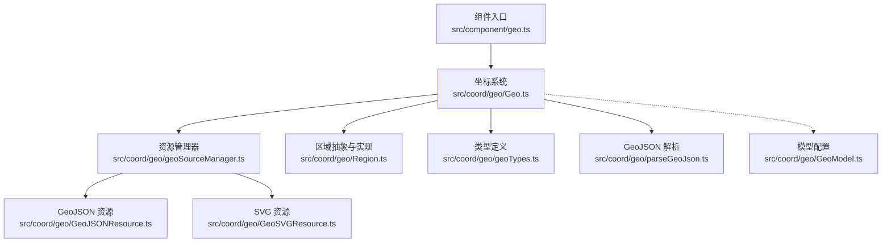
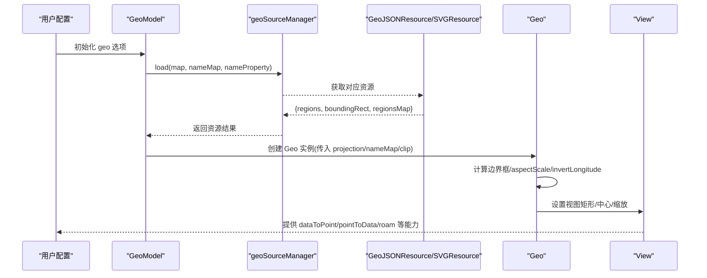
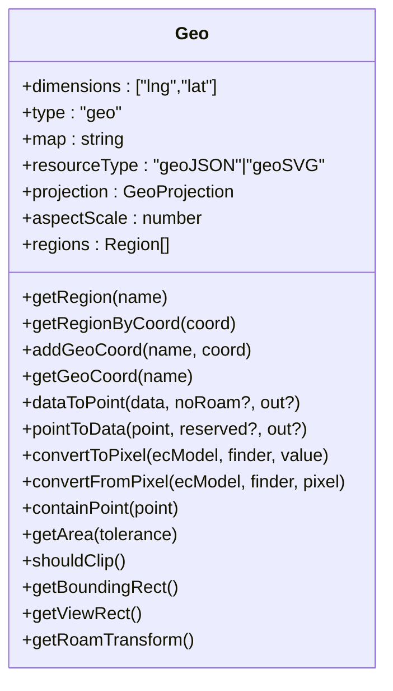
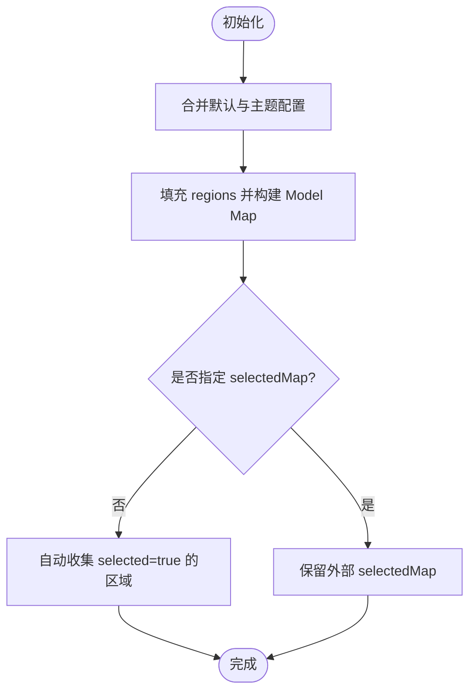
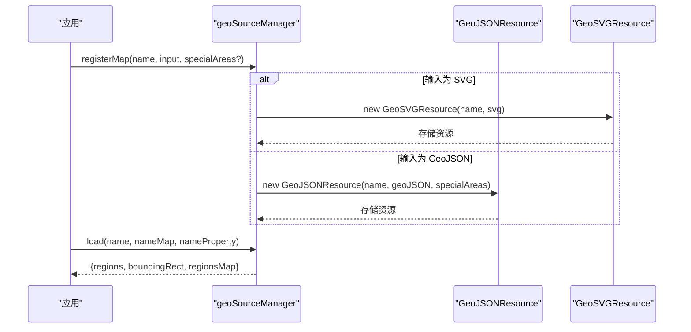
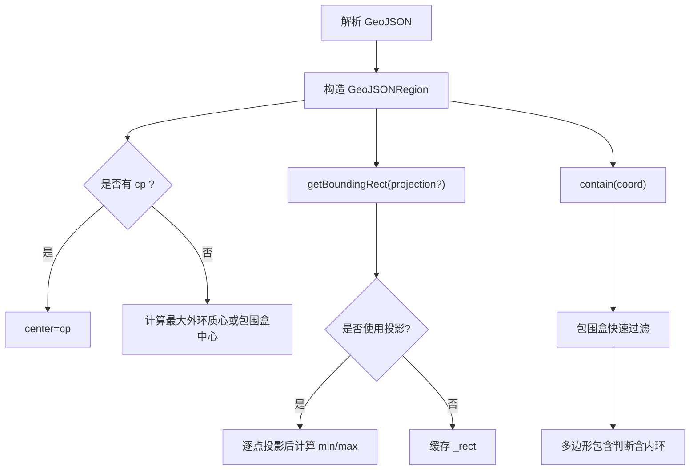
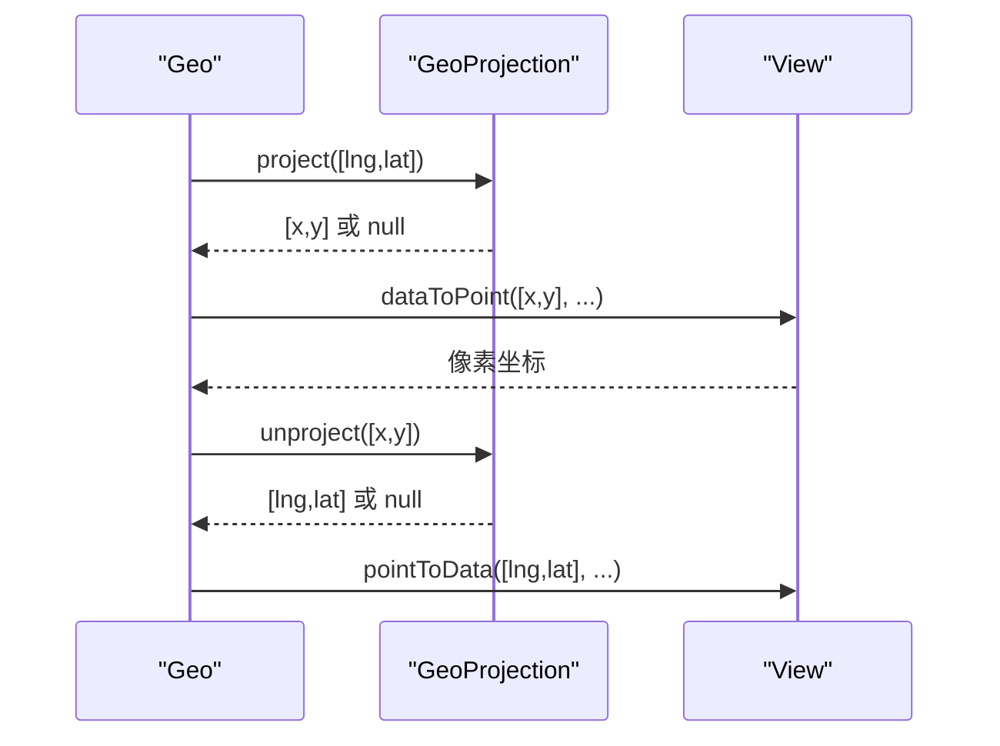
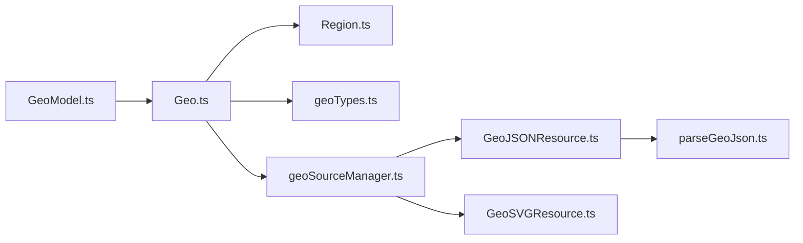

# 地理坐标系（Geo）

<cite>
**本文引用的文件**
- [src/component/geo.ts](file://src/component/geo.ts)
- [src/coord/geo/Geo.ts](file://src/coord/geo/Geo.ts)
- [src/coord/geo/GeoModel.ts](file://src/coord/geo/GeoModel.ts)
- [src/coord/geo/Region.ts](file://src/coord/geo/Region.ts)
- [src/coord/geo/parseGeoJson.ts](file://src/coord/geo/parseGeoJson.ts)
- [src/coord/geo/geoTypes.ts](file://src/coord/geo/geoTypes.ts)
- [src/coord/geo/geoSourceManager.ts](file://src/coord/geo/geoSourceManager.ts)
- [src/coord/geo/GeoJSONResource.ts](file://src/coord/geo/GeoJSONResource.ts)
- [src/coord/geo/GeoSVGResource.ts](file://src/coord/geo/GeoSVGResource.ts)
- [test/map.html](file://test/map.html)
- [test/geo-map.html](file://test/geo-map.html)
</cite>

## 目录
1. [简介](#简介)
2. [项目结构](#项目结构)
3. [核心组件](#核心组件)
4. [架构总览](#架构总览)
5. [详细组件分析](#详细组件分析)
6. [依赖关系分析](#依赖关系分析)
7. [性能考量](#性能考量)
8. [故障排查指南](#故障排查指南)
9. [结论](#结论)
10. [附录：使用示例与最佳实践](#附录使用示例与最佳实践)

## 简介
本文件系统性阐述 ECharts 中地理坐标系（Geo）的实现原理与使用方法，覆盖基于 GeoJSON/SVG 的地图数据加载、区域解析、坐标转换、投影配置、缩放平移交互、区域高亮与事件处理等。文档面向不同技术背景的读者，提供从高层架构到代码级细节的分层说明，并给出中国地图、世界地图及自定义地图数据的集成方法。

## 项目结构
Geo 相关能力由“组件入口 + 坐标系统 + 资源管理 + 区域模型”四部分构成：
- 组件入口：注册 Geo 组件安装器
- 坐标系统：Geo 类负责视图、投影、坐标转换、区域查找
- 资源管理：统一注册/加载 GeoJSON/SVG 地图资源，构建 Region 列表与边界框
- 区域模型：GeoModel 维护 geo 配置项、选中态、标签格式化等

图表来源
- [src/component/geo.ts:22-25](file://src/component/geo.ts#L22-L25)
- [src/coord/geo/Geo.ts:20-37](file://src/coord/geo/Geo.ts#L20-L37)
- [src/coord/geo/geoSourceManager.ts:20-31](file://src/coord/geo/geoSourceManager.ts#L20-L31)
- [src/coord/geo/GeoJSONResource.ts:21-29](file://src/coord/geo/GeoJSONResource.ts#L21-L29)
- [src/coord/geo/GeoSVGResource.ts:20-28](file://src/coord/geo/GeoSVGResource.ts#L20-L28)
- [src/coord/geo/Region.ts:21-28](file://src/coord/geo/Region.ts#L21-L28)
- [src/coord/geo/geoTypes.ts:20-24](file://src/coord/geo/geoTypes.ts#L20-L24)
- [src/coord/geo/parseGeoJson.ts:24-27](file://src/coord/geo/parseGeoJson.ts#L24-L27)
- [src/coord/geo/GeoModel.ts:21-48](file://src/coord/geo/GeoModel.ts#L21-L48)

章节来源
- [src/component/geo.ts:22-25](file://src/component/geo.ts#L22-L25)
- [src/coord/geo/Geo.ts:58-166](file://src/coord/geo/Geo.ts#L58-L166)
- [src/coord/geo/geoSourceManager.ts:49-147](file://src/coord/geo/geoSourceManager.ts#L49-L147)
- [src/coord/geo/GeoJSONResource.ts:34-129](file://src/coord/geo/GeoJSONResource.ts#L34-L129)
- [src/coord/geo/GeoSVGResource.ts:68-132](file://src/coord/geo/GeoSVGResource.ts#L68-L132)
- [src/coord/geo/Region.ts:79-338](file://src/coord/geo/Region.ts#L79-L338)
- [src/coord/geo/geoTypes.ts:136-182](file://src/coord/geo/geoTypes.ts#L136-L182)
- [src/coord/geo/parseGeoJson.ts:117-161](file://src/coord/geo/parseGeoJson.ts#L117-L161)
- [src/coord/geo/GeoModel.ts:154-352](file://src/coord/geo/GeoModel.ts#L154-L352)

## 核心组件
- Geo 坐标系统：封装地图视图、投影、坐标转换、区域查询、裁剪与变换矩阵等
- GeoModel：管理 geo 的配置项（布局、中心、缩放、选择模式、标签、样式等）
- 资源管理：统一注册/加载 GeoJSON/SVG 地图，构建 Region 列表与边界框
- 区域模型：GeoJSONRegion/GeoSVGRegion 提供几何计算、包含判断、中心点计算、变换等

章节来源
- [src/coord/geo/Geo.ts:58-277](file://src/coord/geo/Geo.ts#L58-L277)
- [src/coord/geo/GeoModel.ts:154-352](file://src/coord/geo/GeoModel.ts#L154-L352)
- [src/coord/geo/geoSourceManager.ts:49-147](file://src/coord/geo/geoSourceManager.ts#L49-L147)
- [src/coord/geo/Region.ts:79-338](file://src/coord/geo/Region.ts#L79-L338)

## 架构总览
下图展示从用户配置到渲染的关键流程：GeoModel 合并默认与主题配置；geoSourceManager 根据 map 名称加载资源；GeoJSONResource/SVGResource 解析并构建 Region；Geo 实例化时计算边界框、设置视图、支持投影；最终通过 View 完成坐标转换与绘制。

图表来源
- [src/coord/geo/GeoModel.ts:247-284](file://src/coord/geo/GeoModel.ts#L247-L284)
- [src/coord/geo/geoSourceManager.ts:134-147](file://src/coord/geo/geoSourceManager.ts#L134-L147)
- [src/coord/geo/GeoJSONResource.ts:62-95](file://src/coord/geo/GeoJSONResource.ts#L62-L95)
- [src/coord/geo/GeoSVGResource.ts:100-132](file://src/coord/geo/GeoSVGResource.ts#L100-L132)
- [src/coord/geo/Geo.ts:104-166](file://src/coord/geo/Geo.ts#L104-L166)

## 详细组件分析

### Geo 坐标系统
- 维度：固定为 ['lng','lat']
- 资源类型：geoJSON 或 geoSVG
- 投影：仅对 GeoJSON 源生效；若提供 projection，则忽略默认 aspectScale/invertLongitude
- 坐标转换：dataToPoint/pointToData 在必要时调用 projection.project/unproject
- 区域查询：getRegion/getRegionByCoord（含多边形包含判断）
- 视图与变换：getBoundingRect/getViewRect/getRoamTransform/shouldClip

图表来源
- [src/coord/geo/Geo.ts:58-277](file://src/coord/geo/Geo.ts#L58-L277)

章节来源
- [src/coord/geo/Geo.ts:58-277](file://src/coord/geo/Geo.ts#L58-L277)

### GeoModel（配置与状态）
- 默认配置：布局、中心、缩放、选择模式、标签与样式、tooltip
- 区域选项：regions 数组，支持 selectedMode/selectedMap
- 标签格式化：支持字符串模板或回调函数
- 选择状态：select/unSelect/toggleSelected/isSelected

图表来源
- [src/coord/geo/GeoModel.ts:165-245](file://src/coord/geo/GeoModel.ts#L165-L245)
- [src/coord/geo/GeoModel.ts:262-284](file://src/coord/geo/GeoModel.ts#L262-L284)
- [src/coord/geo/GeoModel.ts:297-343](file://src/coord/geo/GeoModel.ts#L297-L343)

章节来源
- [src/coord/geo/GeoModel.ts:154-352](file://src/coord/geo/GeoModel.ts#L154-L352)

### 资源管理与数据加载
- 注册地图：registerMap 支持直接传入 GeoJSON 或对象形式（含 specialAreas），也支持 SVG
- 加载地图：load 返回 regions/boundingRect/regionsMap
- GeoJSON 资源：解析压缩格式、应用特殊区域变换、内置修正（南海、钓鱼岛等）
- SVG 资源：解析 XML、构建图形根节点、计算边界框、按 name 属性识别区域

图表来源
- [src/coord/geo/geoSourceManager.ts:81-117](file://src/coord/geo/geoSourceManager.ts#L81-L117)
- [src/coord/geo/geoSourceManager.ts:134-147](file://src/coord/geo/geoSourceManager.ts#L134-L147)
- [src/coord/geo/GeoJSONResource.ts:46-95](file://src/coord/geo/GeoJSONResource.ts#L46-L95)
- [src/coord/geo/GeoSVGResource.ts:85-132](file://src/coord/geo/GeoSVGResource.ts#L85-L132)

章节来源
- [src/coord/geo/geoSourceManager.ts:49-147](file://src/coord/geo/geoSourceManager.ts#L49-L147)
- [src/coord/geo/GeoJSONResource.ts:34-129](file://src/coord/geo/GeoJSONResource.ts#L34-L129)
- [src/coord/geo/GeoSVGResource.ts:68-132](file://src/coord/geo/GeoSVGResource.ts#L68-L132)

### 区域解析与几何计算
- GeoJSON 解析：支持 Polygon/MultiPolygon/LineString/MultiLineString，支持 UTF8 压缩解码
- 区域中心：优先使用 properties.cp，否则按最大多边形外环计算质心或包围盒中心
- 包含判断：先快速包围盒检测，再精确多边形包含（考虑内环洞）
- 变换：transformTo 将原始几何缩放到目标矩形，用于特殊区域显示

图表来源
- [src/coord/geo/parseGeoJson.ts:117-161](file://src/coord/geo/parseGeoJson.ts#L117-L161)
- [src/coord/geo/Region.ts:132-243](file://src/coord/geo/Region.ts#L132-L243)
- [src/coord/geo/Region.ts:252-285](file://src/coord/geo/Region.ts#L252-L285)

章节来源
- [src/coord/geo/parseGeoJson.ts:29-115](file://src/coord/geo/parseGeoJson.ts#L29-L115)
- [src/coord/geo/Region.ts:79-338](file://src/coord/geo/Region.ts#L79-L338)

### 地图投影机制
- 接口：GeoProjection 需提供 project/unproject，可选 stream 以兼容 d3-geo 流式投影
- 约束：仅对 GeoJSON 源有效；若提供 projection，则忽略默认 aspectScale/invertLongitude
- 典型用法：墨卡托投影（适合导航与等角）、等积投影（适合面积统计）
- 注意：使用旋转投影时可能出现跨日期线伪影，可通过 stream 进行裁剪

图表来源
- [src/coord/geo/geoTypes.ts:169-182](file://src/coord/geo/geoTypes.ts#L169-L182)
- [src/coord/geo/Geo.ts:104-166](file://src/coord/geo/Geo.ts#L104-L166)
- [src/coord/geo/Geo.ts:198-222](file://src/coord/geo/Geo.ts#L198-L222)

章节来源
- [src/coord/geo/geoTypes.ts:169-182](file://src/coord/geo/geoTypes.ts#L169-L182)
- [src/coord/geo/Geo.ts:104-166](file://src/coord/geo/Geo.ts#L104-L166)
- [src/coord/geo/Geo.ts:198-222](file://src/coord/geo/Geo.ts#L198-L222)

### 地图数据加载与区域高亮
- 数据加载：通过 geoSourceManager 统一加载，内部区分 GeoJSON/SVG
- 区域高亮：GeoModel 的 emphasis/select 样式控制；label 支持 formatter
- 交互：支持 roam（缩放/平移）、selectedMode（单选/多选）、tooltip

章节来源
- [src/coord/geo/GeoModel.ts:165-245](file://src/coord/geo/GeoModel.ts#L165-L245)
- [src/coord/geo/GeoModel.ts:297-343](file://src/coord/geo/GeoModel.ts#L297-L343)

### 缩放和平移（Roam）
- Geo 暴露 getRoamTransform 供上层组件驱动视图变换
- View 层维护 viewRect、boundingRect、中心与缩放，支持 preserveAspect
- 结合 dataZoom 可实现更丰富的缩放体验

章节来源
- [src/coord/geo/Geo.ts:259-275](file://src/coord/geo/Geo.ts#L259-L275)

### 地图数据格式规范
- GeoJSON：FeatureCollection，geometry 支持 Polygon/MultiPolygon/LineString/MultiLineString；properties.name 作为区域名，可配置 nameProperty
- 压缩格式：UTF8Encoding/UTF8Scale 配合 encodeOffsets 解码坐标
- SVG：通过 name 属性标记区域元素；支持 rect/circle/line/ellipse/polygon/polyline/path/text/tspan/g

章节来源
- [src/coord/geo/geoTypes.ts:43-130](file://src/coord/geo/geoTypes.ts#L43-L130)
- [src/coord/geo/parseGeoJson.ts:29-115](file://src/coord/geo/parseGeoJson.ts#L29-L115)
- [src/coord/geo/GeoSVGResource.ts:56-66](file://src/coord/geo/GeoSVGResource.ts#L56-L66)

### 区域属性处理与事件
- 区域属性：properties 透传到 Region.properties，可用于视觉映射或业务逻辑
- 事件：SVG 区域元素默认非 silent，可触发 tooltip/点击等事件；GeoJSON 区域通过 contain 判定命中

章节来源
- [src/coord/geo/Region.ts:132-153](file://src/coord/geo/Region.ts#L132-L153)
- [src/coord/geo/GeoSVGResource.ts:308-318](file://src/coord/geo/GeoSVGResource.ts#L308-L318)
- [src/coord/geo/Region.ts:218-243](file://src/coord/geo/Region.ts#L218-L243)

## 依赖关系分析

图表来源
- [src/coord/geo/Geo.ts:20-37](file://src/coord/geo/Geo.ts#L20-L37)
- [src/coord/geo/geoSourceManager.ts:20-31](file://src/coord/geo/geoSourceManager.ts#L20-L31)
- [src/coord/geo/GeoJSONResource.ts:21-29](file://src/coord/geo/GeoJSONResource.ts#L21-L29)
- [src/coord/geo/GeoSVGResource.ts:20-28](file://src/coord/geo/GeoSVGResource.ts#L20-L28)
- [src/coord/geo/parseGeoJson.ts:24-27](file://src/coord/geo/parseGeoJson.ts#L24-L27)
- [src/coord/geo/GeoModel.ts:21-48](file://src/coord/geo/GeoModel.ts#L21-L48)

章节来源
- [src/coord/geo/Geo.ts:20-37](file://src/coord/geo/Geo.ts#L20-L37)
- [src/coord/geo/geoSourceManager.ts:20-31](file://src/coord/geo/geoSourceManager.ts#L20-L31)
- [src/coord/geo/GeoJSONResource.ts:21-29](file://src/coord/geo/GeoJSONResource.ts#L21-L29)
- [src/coord/geo/GeoSVGResource.ts:20-28](file://src/coord/geo/GeoSVGResource.ts#L20-L28)
- [src/coord/geo/parseGeoJson.ts:24-27](file://src/coord/geo/parseGeoJson.ts#L24-L27)
- [src/coord/geo/GeoModel.ts:21-48](file://src/coord/geo/GeoModel.ts#L21-L48)

## 性能考量
- 延迟解析：GeoJSONResource 首次使用时才构建完整图形与 Region，减少首屏开销
- 包围盒缓存：GeoJSONRegion 在无投影时缓存 _rect，避免重复计算
- 压缩解码：支持 UTF8 压缩坐标，显著降低网络体积与解析时间
- 资源复用：GeoSVGResource 维护图形池，避免重复创建 zrender 元素
- 投影影响：启用投影时需逐点计算边界框，可能带来额外开销，建议按需开启

[本节为通用指导，不直接分析具体文件]

## 故障排查指南
- 地图未注册：若 geoSourceManager.load 找不到 map 名称，会输出错误日志；请确认已正确调用 registerMap
- 非法 GeoJSON：解析失败会抛出异常；检查 features/geometry/coordinates 是否符合规范
- 非法 SVG：解析失败会抛出异常；检查 SVG 结构与命名空间
- 投影无效：仅对 GeoJSON 源生效；若传入 SVG 源或 projection 缺少 project/unproject，将被忽略并警告
- 区域无响应：SVG 区域需具备 name 属性且为允许的元素类型；GeoJSON 区域需确保 contain 判定路径正确

章节来源
- [src/coord/geo/geoSourceManager.ts:134-147](file://src/coord/geo/geoSourceManager.ts#L134-L147)
- [src/coord/geo/GeoJSONResource.ts:102-108](file://src/coord/geo/GeoJSONResource.ts#L102-L108)
- [src/coord/geo/GeoSVGResource.ts:140-150](file://src/coord/geo/GeoSVGResource.ts#L140-L150)
- [src/coord/geo/Geo.ts:128-143](file://src/coord/geo/Geo.ts#L128-L143)

## 结论
ECharts 的 Geo 坐标系统通过统一的资源管理与灵活的投影机制，实现了从 GeoJSON/SVG 到可视化的高效转换。其模块化设计使地图数据加载、区域解析、坐标转换、交互与高亮等功能解耦清晰，便于扩展与优化。合理选择投影与数据格式，并结合示例与最佳实践，可在各类业务场景中高效构建地图可视化。

[本节为总结性内容，不直接分析具体文件]

## 附录：使用示例与最佳实践

### 中国地图与世界地图示例
- 中国地图：参考测试用例中的 map.html，展示如何引入 china 地图数据、配置 series.map、设置中心与缩放、启用 roam 与标签
- 世界地图：参考 test/mapWorld.html（仓库中存在对应用例），演示世界范围地图的基本配置与交互

章节来源
- [test/map.html:44-200](file://test/map.html#L44-L200)
- [test/geo-map.html:37-200](file://test/geo-map.html#L37-L200)

### 自定义地图数据集成
- 注册地图：使用 echarts.registerMap 注册 GeoJSON 或 SVG 地图；支持 specialAreas 对特定区域进行位置/尺寸调整
- 配置 geo：在 option.geo 中设置 map、layoutCenter/layoutSize、center/zoom、projection、selectedMode 等
- 数据绑定：series.type='map'，通过 name/value 关联区域数据；可使用 visualMap 进行颜色映射

章节来源
- [src/coord/geo/geoSourceManager.ts:81-117](file://src/coord/geo/geoSourceManager.ts#L81-L117)
- [src/coord/geo/GeoModel.ts:165-245](file://src/coord/geo/GeoModel.ts#L165-L245)
- [test/map.html:44-200](file://test/map.html#L44-L200)

### 投影配置与使用场景
- 墨卡托投影：适合导航与等角需求，保持方向与角度不变形
- 等积投影：适合面积统计，保持面积比例准确
- 配置方式：在 geo.projection 中提供 project/unproject；注意 center 应为投影后的坐标

章节来源
- [src/coord/geo/geoTypes.ts:169-182](file://src/coord/geo/geoTypes.ts#L169-L182)
- [src/coord/geo/GeoModel.ts:116-123](file://src/coord/geo/GeoModel.ts#L116-L123)
- [src/coord/geo/Geo.ts:104-166](file://src/coord/geo/Geo.ts#L104-L166)