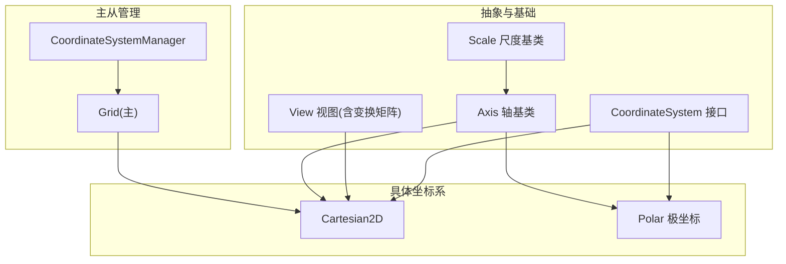
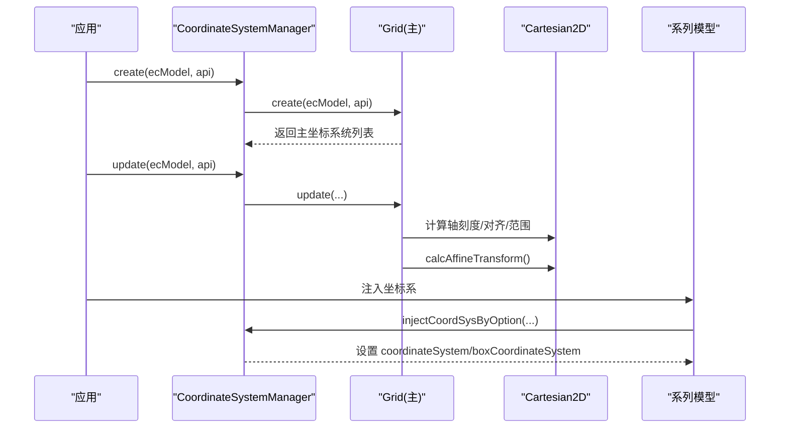
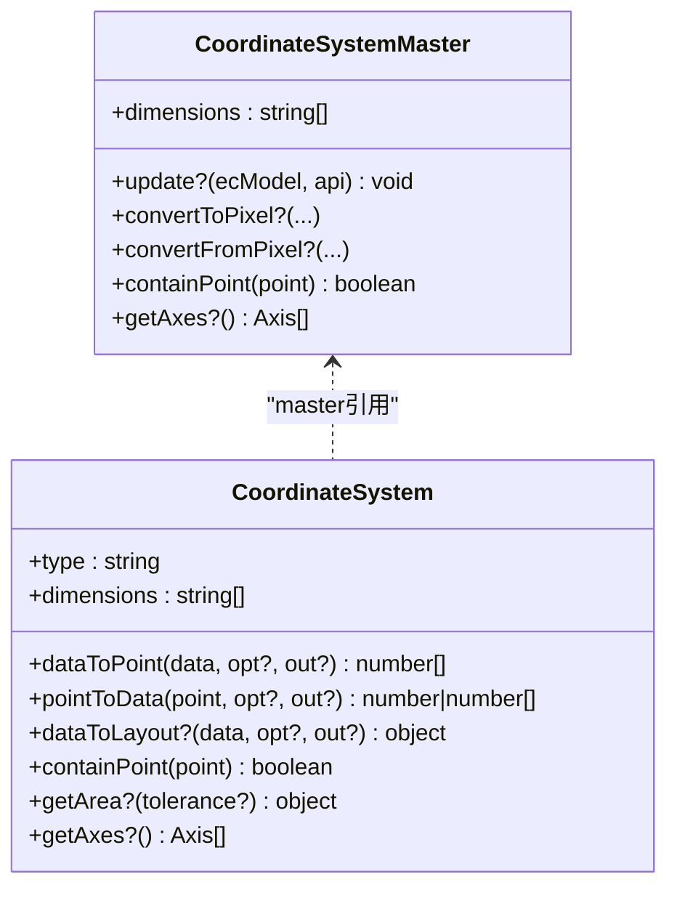
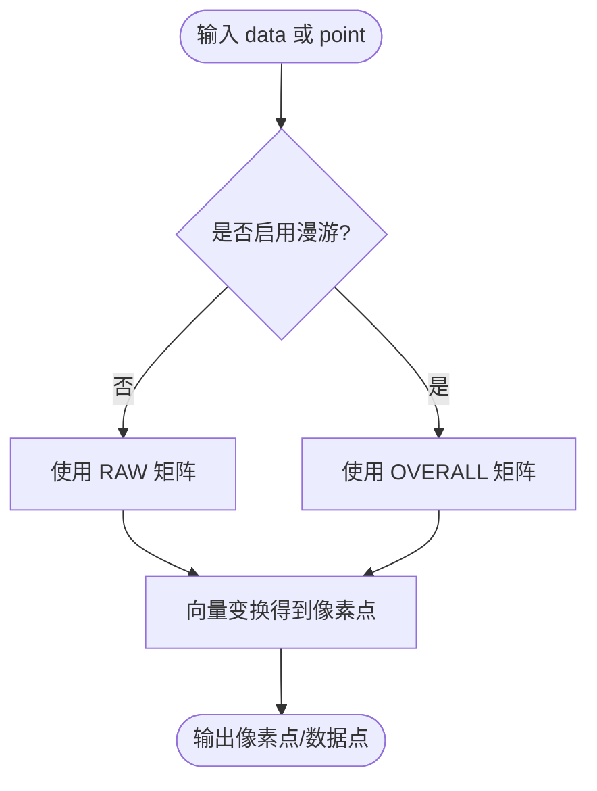
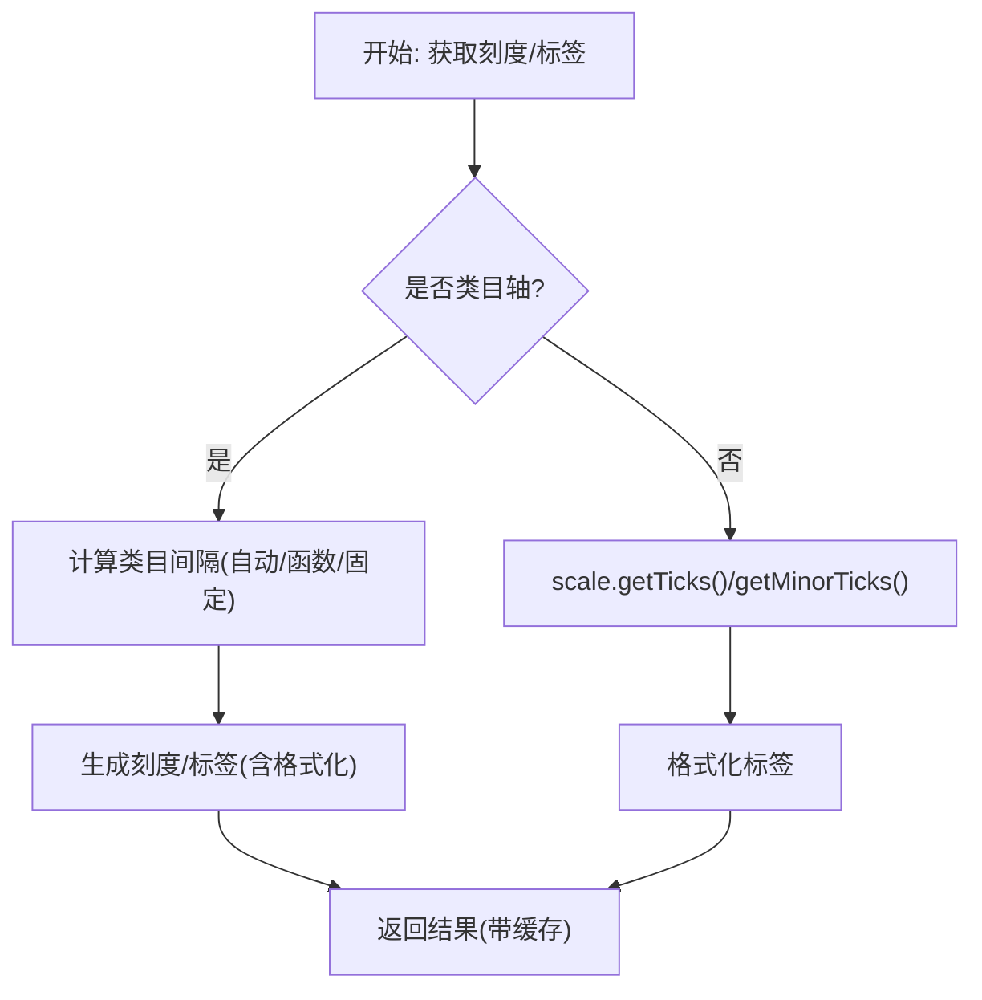
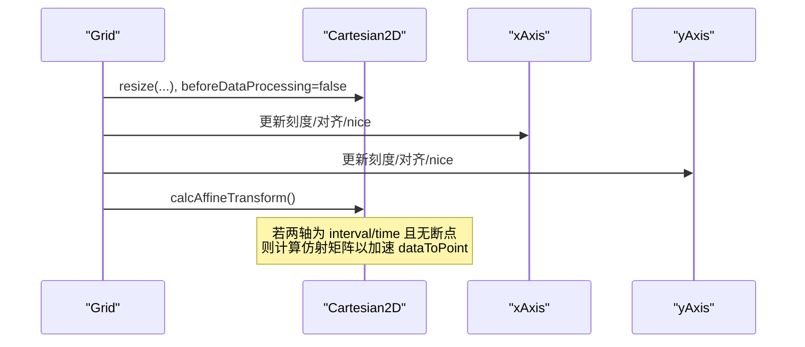
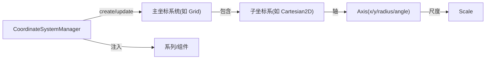

# 坐标系核心架构

<cite>
**本文引用的文件**
- [src/coord/CoordinateSystem.ts](file://src/coord/CoordinateSystem.ts)
- [src/core/CoordinateSystem.ts](file://src/core/CoordinateSystem.ts)
- [src/coord/Axis.ts](file://src/coord/Axis.ts)
- [src/coord/axisTickLabelBuilder.ts](file://src/coord/axisTickLabelBuilder.ts)
- [src/coord/cartesian/Cartesian2D.ts](file://src/coord/cartesian/Cartesian2D.ts)
- [src/coord/cartesian/Grid.ts](file://src/coord/cartesian/Grid.ts)
- [src/coord/polar/Polar.ts](file://src/coord/polar/Polar.ts)
- [src/scale/Scale.ts](file://src/scale/Scale.ts)
- [src/coord/View.ts](file://src/coord/View.ts)
</cite>

## 目录
1. [简介](#简介)
2. [项目结构](#项目结构)
3. [核心组件](#核心组件)
4. [架构总览](#架构总览)
5. [详细组件分析](#详细组件分析)
6. [依赖关系分析](#依赖关系分析)
7. [性能考量](#性能考量)
8. [故障排查指南](#故障排查指南)
9. [结论](#结论)
10. [附录：自定义坐标系开发指南](#附录自定义坐标系开发指南)

## 简介
本文件系统性阐述 ECharts 坐标系的核心架构与扩展机制，聚焦以下目标：
- 统一抽象：CoordinateSystem 基类与接口、视图适配器 View、以及主从坐标系统（Master）的管理。
- 轴系统：Axis 通用实现，包括刻度计算、标签生成、范围管理、对齐与带宽处理等。
- 通信与共享：坐标系间的数据转换、区域裁剪、以及通过 Master 聚合多个子坐标系。
- 扩展机制：注册与注入流程、如何基于现有接口创建自定义坐标系，并给出最佳实践与性能建议。

## 项目结构
ECharts 的坐标系体系位于 src/coord 与 src/core 中，围绕“坐标系统 + 轴 + 视图”三层展开：
- 抽象层：CoordinateSystem 接口定义数据/像素转换、包含判断、区域裁剪等；View 提供统一的变换矩阵与漫游动画支持。
- 实现层：Cartesian2D、Polar 等具体坐标系；Grid 作为 Cartesian2D 的主容器，负责布局与更新。
- 轴与刻度：Axis 提供通用的 dataToCoord/coordToData、刻度与标签构建；scale 提供数值/时间/对数/序数等尺度能力。
- 管理与注入：CoordinateSystemManager 负责创建与更新所有坐标系，并通过 injectCoordSysByOption 将坐标系注入到系列或组件。

图表来源
- [src/coord/CoordinateSystem.ts:121-233](file://src/coord/CoordinateSystem.ts#L121-L233)
- [src/coord/View.ts:228-330](file://src/coord/View.ts#L228-L330)
- [src/coord/Axis.ts:60-159](file://src/coord/Axis.ts#L60-L159)
- [src/scale/Scale.ts:51-125](file://src/scale/Scale.ts#L51-L125)
- [src/coord/cartesian/Cartesian2D.ts:41-152](file://src/coord/cartesian/Cartesian2D.ts#L41-L152)
- [src/coord/polar/Polar.ts:34-158](file://src/coord/polar/Polar.ts#L34-L158)
- [src/core/CoordinateSystem.ts:47-107](file://src/core/CoordinateSystem.ts#L47-L107)
- [src/coord/cartesian/Grid.ts:103-189](file://src/coord/cartesian/Grid.ts#L103-L189)

章节来源
- [src/coord/CoordinateSystem.ts:121-233](file://src/coord/CoordinateSystem.ts#L121-L233)
- [src/coord/View.ts:228-330](file://src/coord/View.ts#L228-L330)
- [src/coord/Axis.ts:60-159](file://src/coord/Axis.ts#L60-L159)
- [src/scale/Scale.ts:51-125](file://src/scale/Scale.ts#L51-L125)
- [src/coord/cartesian/Cartesian2D.ts:41-152](file://src/coord/cartesian/Cartesian2D.ts#L41-L152)
- [src/coord/polar/Polar.ts:34-158](file://src/coord/polar/Polar.ts#L34-L158)
- [src/core/CoordinateSystem.ts:47-107](file://src/core/CoordinateSystem.ts#L47-L107)
- [src/coord/cartesian/Grid.ts:103-189](file://src/coord/cartesian/Grid.ts#L103-L189)

## 核心组件
- CoordinateSystem 接口：定义数据与像素之间的双向转换、点包含判断、区域裁剪、可选的地理相关方法（如 getBoundingRect/getViewRect/getRoamTransform），以及获取轴集合的能力。
- View：同时实现 CoordinateSystem 与 CoordinateSystemMaster，维护三套变换矩阵（原始 raw、漫游 roam、整体 overall），并提供 dataToPoint/pointToData、convertToPixel/convertFromPixel、containPoint 等统一入口。
- Axis：封装维度、尺度、范围（extent）、onBand、inverse 等属性，提供 dataToCoord/coordToData、刻度坐标、次级刻度、标签生成、类目间隔自动计算等。
- Scale：抽象尺度类型，提供 parse、getTicks、getMinorTicks、getLabel 等，支撑值域、时间、对数、序数等。
- Grid：Cartesian2D 的主容器，负责创建/更新 x/y 轴、计算网格矩形、对齐与 onZero、resize 与 containLabel 等。
- Polar：极坐标实现，封装半径轴与角度轴，提供数据与坐标互转、环形区域裁剪等。

章节来源
- [src/coord/CoordinateSystem.ts:121-233](file://src/coord/CoordinateSystem.ts#L121-L233)
- [src/coord/View.ts:228-330](file://src/coord/View.ts#L228-L330)
- [src/coord/Axis.ts:60-159](file://src/coord/Axis.ts#L60-L159)
- [src/scale/Scale.ts:51-125](file://src/scale/Scale.ts#L51-L125)
- [src/coord/cartesian/Grid.ts:103-189](file://src/coord/cartesian/Grid.ts#L103-L189)
- [src/coord/polar/Polar.ts:34-158](file://src/coord/polar/Polar.ts#L34-L158)

## 架构总览
坐标系的生命周期由管理器驱动：
- create：遍历已注册的坐标系 Creator，调用其 create 方法生成主坐标系统（如 Grid）。
- update：依次调用各主坐标系统的 update，完成轴刻度 nice、对齐、范围修正、resize 等。
- 注入：通过 injectCoordSysByOption 将坐标系注入到系列或组件，区分“按数据使用”和“按框使用”。

图表来源
- [src/core/CoordinateSystem.ts:59-89](file://src/core/CoordinateSystem.ts#L59-L89)
- [src/coord/cartesian/Grid.ts:536-603](file://src/coord/cartesian/Grid.ts#L536-L603)
- [src/coord/cartesian/Cartesian2D.ts:58-88](file://src/coord/cartesian/Cartesian2D.ts#L58-L88)

章节来源
- [src/core/CoordinateSystem.ts:59-89](file://src/core/CoordinateSystem.ts#L59-L89)
- [src/coord/cartesian/Grid.ts:536-603](file://src/coord/cartesian/Grid.ts#L536-L603)
- [src/coord/cartesian/Cartesian2D.ts:58-88](file://src/coord/cartesian/Cartesian2D.ts#L58-L88)

## 详细组件分析

### CoordinateSystem 接口与主从模式
- 接口契约：
  - 数据与像素转换：dataToPoint、pointToData、dataToLayout（可选）。
  - 包含判断：containPoint、containData（部分实现）。
  - 区域裁剪：getArea、shouldClip。
  - 地理扩展：getBoundingRect、getViewRect、getRoamTransform（GeoLikeCoordSys）。
- 主从模式：
  - CoordinateSystemMaster 可包含多个 CoordinateSystem（例如 Grid 包含多个 Cartesian2D）。
  - Master 提供 convertToPixel/convertFromPixel/containPoint 等统一入口，内部路由到具体坐标系。

图表来源
- [src/coord/CoordinateSystem.ts:35-119](file://src/coord/CoordinateSystem.ts#L35-L119)
- [src/coord/CoordinateSystem.ts:121-233](file://src/coord/CoordinateSystem.ts#L121-L233)

章节来源
- [src/coord/CoordinateSystem.ts:35-119](file://src/coord/CoordinateSystem.ts#L35-L119)
- [src/coord/CoordinateSystem.ts:121-233](file://src/coord/CoordinateSystem.ts#L121-L233)

### View 视图适配器与变换矩阵
- 三套变换：
  - RAW：数据空间到视图空间的原始变换（受 dataRect/viewRect 影响）。
  - ROAM：基于 center/zoom 的漫游变换。
  - OVERALL：ROAM × RAW 的整体变换，用于直接应用到图形元素。
- 关键能力：
  - dataToPoint/pointToData：根据是否启用漫游选择不同矩阵。
  - convertToPixel/convertFromPixel：在 finder 匹配到的坐标系上执行转换。
  - containPoint：基于整体变换后的矩形进行包含判断。
  - applyViewCoordSysTransToElement：将变换同步到 zrender 元素，支持动画与中断恢复。

图表来源
- [src/coord/View.ts:287-330](file://src/coord/View.ts#L287-L330)
- [src/coord/View.ts:471-580](file://src/coord/View.ts#L471-L580)
- [src/coord/View.ts:608-631](file://src/coord/View.ts#L608-L631)

章节来源
- [src/coord/View.ts:287-330](file://src/coord/View.ts#L287-L330)
- [src/coord/View.ts:471-580](file://src/coord/View.ts#L471-L580)
- [src/coord/View.ts:608-631](file://src/coord/View.ts#L608-L631)

### Axis 轴系统与刻度/标签
- 核心功能：
  - 范围管理：extent、inverse、onBand（类目边界间隙）。
  - 数据与坐标互转：dataToCoord/coordToData，结合 scale.normalize/scale.scale 与线性映射。
  - 刻度与标签：createAxisTicks/createAxisLabels，支持类目间隔自动计算、次级刻度、自定义刻度值。
  - 类目间隔策略：calculateCategoryInterval，考虑旋转、字体、单位跨度，避免重叠。
- 缓存与优化：
  - 类目刻度/标签结果缓存，避免重复计算。
  - 对大数量类目数据采用步进优化，减少 O(n) 循环。

图表来源
- [src/coord/Axis.ts:139-270](file://src/coord/Axis.ts#L139-L270)
- [src/coord/axisTickLabelBuilder.ts:118-161](file://src/coord/axisTickLabelBuilder.ts#L118-L161)
- [src/coord/axisTickLabelBuilder.ts:327-420](file://src/coord/axisTickLabelBuilder.ts#L327-L420)

章节来源
- [src/coord/Axis.ts:139-270](file://src/coord/Axis.ts#L139-L270)
- [src/coord/axisTickLabelBuilder.ts:118-161](file://src/coord/axisTickLabelBuilder.ts#L118-L161)
- [src/coord/axisTickLabelBuilder.ts:327-420](file://src/coord/axisTickLabelBuilder.ts#L327-L420)

### Cartesian2D 二维直角坐标系
- 特性：
  - 快速路径：当 x/y 均为 interval/time 且无断点时，计算仿射变换矩阵加速大量数据点的转换。
  - 包含判断：分别检查 x/y 轴局部坐标是否在范围内。
  - 区域裁剪：返回 BoundingRect，支持 tolerance。
  - 其他轴：getOtherAxis、getBaseAxis（用于堆叠等场景）。
- 与 Grid 协作：
  - Grid 负责创建/更新轴、对齐、onZero、resize、containLabel，并触发 calcAffineTransform。

图表来源
- [src/coord/cartesian/Grid.ts:207-279](file://src/coord/cartesian/Grid.ts#L207-L279)
- [src/coord/cartesian/Cartesian2D.ts:58-88](file://src/coord/cartesian/Cartesian2D.ts#L58-L88)
- [src/coord/cartesian/Cartesian2D.ts:131-184](file://src/coord/cartesian/Cartesian2D.ts#L131-L184)

章节来源
- [src/coord/cartesian/Cartesian2D.ts:58-88](file://src/coord/cartesian/Cartesian2D.ts#L58-L88)
- [src/coord/cartesian/Cartesian2D.ts:131-184](file://src/coord/cartesian/Cartesian2D.ts#L131-L184)
- [src/coord/cartesian/Grid.ts:207-279](file://src/coord/cartesian/Grid.ts#L207-L279)

### Polar 极坐标系
- 特性：
  - 双轴：半径轴与角度轴，提供 dataToPoint/pointToData/pointToCoord/coordToPoint。
  - 环形区域：getArea 返回环形区域及 contain 判断。
  - 工具方法：getTooltipAxes、getBaseAxis、getAxesByScale。
- 与坐标系接口一致：实现 CoordinateSystem 与 CoordinateSystemMaster（作为主坐标系统）。

章节来源
- [src/coord/polar/Polar.ts:34-158](file://src/coord/polar/Polar.ts#L34-L158)
- [src/coord/polar/Polar.ts:163-248](file://src/coord/polar/Polar.ts#L163-L248)

### 尺度 Scale
- 职责：
  - 解析输入值（parse），保证无副作用且返回数值。
  - 生成主刻度与次级刻度（getTicks/getMinorTicks）。
  - 提供标签（getLabel）与空白状态（isBlank/setBlank）。
- 与轴协作：Axis 通过 scale 完成数据归一化与缩放，从而得到坐标。

章节来源
- [src/scale/Scale.ts:51-125](file://src/scale/Scale.ts#L51-L125)
- [src/coord/Axis.ts:139-151](file://src/coord/Axis.ts#L139-L151)

## 依赖关系分析
- 管理器依赖：
  - CoordinateSystemManager 维护两类 Creator 列表（非系列盒型与常规），并在 create/update 阶段调度。
- 注入机制：
  - injectCoordSysByOption 决定使用“数据”还是“框”的方式绑定坐标系，并将结果写入 series.coordinateSystem 或 model.boxCoordinateSystem。
- 坐标系间通信：
  - 通过 Master 的 convertToPixel/convertFromPixel 路由到具体坐标系。
  - 通过 getAxes/getBaseAxis/getOtherAxis 建立轴间关系，便于 tooltip、dataZoom、视觉映射等联动。

图表来源
- [src/core/CoordinateSystem.ts:47-107](file://src/core/CoordinateSystem.ts#L47-L107)
- [src/core/CoordinateSystem.ts:290-347](file://src/core/CoordinateSystem.ts#L290-L347)
- [src/coord/cartesian/Grid.ts:536-603](file://src/coord/cartesian/Grid.ts#L536-L603)

章节来源
- [src/core/CoordinateSystem.ts:47-107](file://src/core/CoordinateSystem.ts#L47-L107)
- [src/core/CoordinateSystem.ts:290-347](file://src/core/CoordinateSystem.ts#L290-L347)
- [src/coord/cartesian/Grid.ts:536-603](file://src/coord/cartesian/Grid.ts#L536-L603)

## 性能考量
- 仿射变换加速：Cartesian2D 在 x/y 均为 interval/time 且无断点时计算仿射矩阵，避免逐点复杂换算。
- 类目刻度/标签缓存：axisTickLabelBuilder 对类目刻度与标签结果进行缓存，避免重复计算。
- 类目间隔估算优化：对大数据量类目轴采用步进与近似宽度估计，降低 O(n) 开销。
- 视图变换复用：View 维护 mtRaw/mtOverall 及其逆矩阵，减少重复矩阵运算。
- 对齐与 onZero：Grid 在 update 阶段集中处理对齐与 onZero，减少多次重算。

[本节为通用性能建议，不直接分析具体文件]

## 故障排查指南
- 坐标系未找到：
  - 现象：injectCoordSysByOption 报错找不到指定坐标系。
  - 排查：确认系列或组件的 coordinateSystemUsage 与 coordinateSystem 配置是否正确；确保对应主坐标系已创建。
- 类目轴刻度/标签异常：
  - 现象：刻度重叠或显示不全。
  - 排查：检查 axisLabel.axisTick 的 interval 设置；查看 calculateCategoryInterval 的计算参数（旋转、字体、单位跨度）。
- 数据与像素转换错误：
  - 现象：dataToPoint/pointToData 结果异常。
  - 排查：确认是否启用了漫游（View 的 overall 矩阵）；检查 dataRect/viewRect 是否已设置；确认 scale 的 extent 与 inverse/onBand 配置。
- 包含判断失败：
  - 现象：containPoint 返回 false。
  - 排查：确认 transform 已正确应用；检查容差 tolerance；核对坐标轴方向与反转设置。

章节来源
- [src/core/CoordinateSystem.ts:290-347](file://src/core/CoordinateSystem.ts#L290-L347)
- [src/coord/axisTickLabelBuilder.ts:327-420](file://src/coord/axisTickLabelBuilder.ts#L327-L420)
- [src/coord/View.ts:287-330](file://src/coord/View.ts#L287-L330)
- [src/coord/cartesian/Cartesian2D.ts:107-129](file://src/coord/cartesian/Cartesian2D.ts#L107-L129)

## 结论
ECharts 坐标系体系通过统一的 CoordinateSystem 接口与 View 视图适配器，实现了数据与像素的双向转换、区域裁剪与漫游动画的统一抽象。Axis 与 Scale 提供了通用的刻度与尺度能力，配合 Grid/Polar 等具体坐标系满足多种可视化需求。CoordinateSystemManager 与 injectCoordSysByOption 构成了可扩展的注册与注入机制，使得自定义坐标系可以无缝融入现有生态。

[本节为总结性内容，不直接分析具体文件]

## 附录：自定义坐标系开发指南

### 接口规范
- 实现 CoordinateSystem 接口：
  - 必须实现：type、dimensions、dataToPoint、containPoint。
  - 推荐实现：pointToData、dataToLayout、getArea、getAxes、getBaseAxis、getOtherAxis、clampData。
  - 地理扩展：如需地图/地理数据，实现 getBoundingRect/getViewRect/getRoamTransform。
- 若作为主坐标系统（CoordinateSystemMaster）：
  - 实现 create/update（可选）、convertToPixel/convertFromPixel、containPoint、getAxes。
  - 提供 dimensions 与可能的 boxCoordinateSystem 引用。

章节来源
- [src/coord/CoordinateSystem.ts:35-119](file://src/coord/CoordinateSystem.ts#L35-L119)
- [src/coord/CoordinateSystem.ts:121-233](file://src/coord/CoordinateSystem.ts#L121-L233)

### 生命周期与注册
- 注册 Creator：
  - 通过 CoordinateSystemManager.register(type, creator) 注册自定义坐标系。
  - 在 creator.create 中返回主坐标系统实例列表。
- 注入使用：
  - 在系列或组件中使用 injectCoordSysByOption 将坐标系注入，区分“数据”与“框”的使用方式。

章节来源
- [src/core/CoordinateSystem.ts:95-107](file://src/core/CoordinateSystem.ts#L95-L107)
- [src/core/CoordinateSystem.ts:290-347](file://src/core/CoordinateSystem.ts#L290-L347)

### 最佳实践
- 数据与像素分离：
  - 尽量在 dataToPoint/pointToData 中只做必要计算，避免昂贵操作。
  - 对于大批量数据，优先计算仿射变换（如 Cartesian2D 的做法）。
- 轴与尺度：
  - 合理设置 scale.extent 与 inverse/onBand，确保刻度与标签正确。
  - 对类目轴，利用 calculateCategoryInterval 避免标签重叠。
- 视图适配：
  - 使用 View 提供的三套变换矩阵，确保漫游动画与交互的正确性。
  - 通过 applyViewCoordSysTransToElement 将变换应用到图形元素，支持动画与中断恢复。

章节来源
- [src/coord/cartesian/Cartesian2D.ts:58-88](file://src/coord/cartesian/Cartesian2D.ts#L58-L88)
- [src/coord/axisTickLabelBuilder.ts:327-420](file://src/coord/axisTickLabelBuilder.ts#L327-L420)
- [src/coord/View.ts:608-631](file://src/coord/View.ts#L608-L631)

### 性能考虑
- 缓存：对刻度/标签、区间计算结果进行缓存，避免重复计算。
- 步进与近似：对大类目数据采用步进与近似宽度估计，降低复杂度。
- 矩阵复用：复用 mtRaw/mtOverall 及其逆矩阵，减少矩阵运算开销。
- 对齐与 onZero：在主坐标系统中集中处理，减少多次重算。

[本节为通用性能建议，不直接分析具体文件]