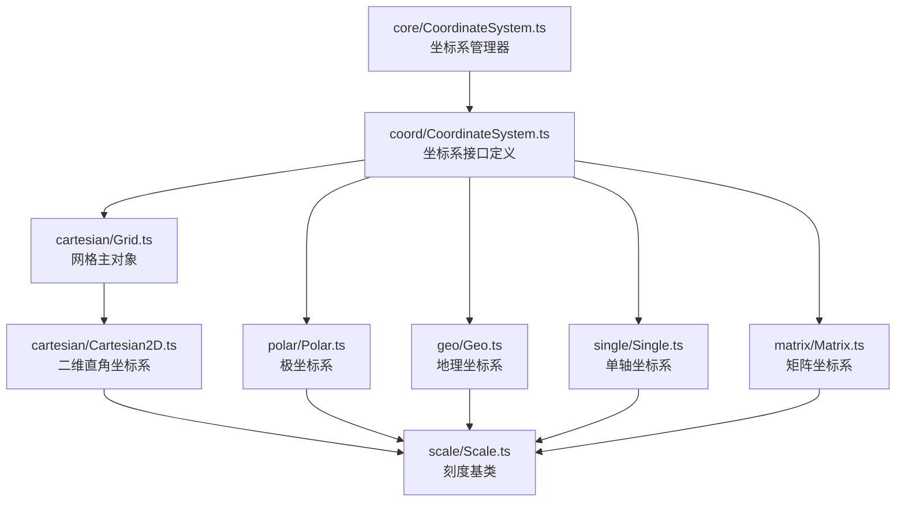
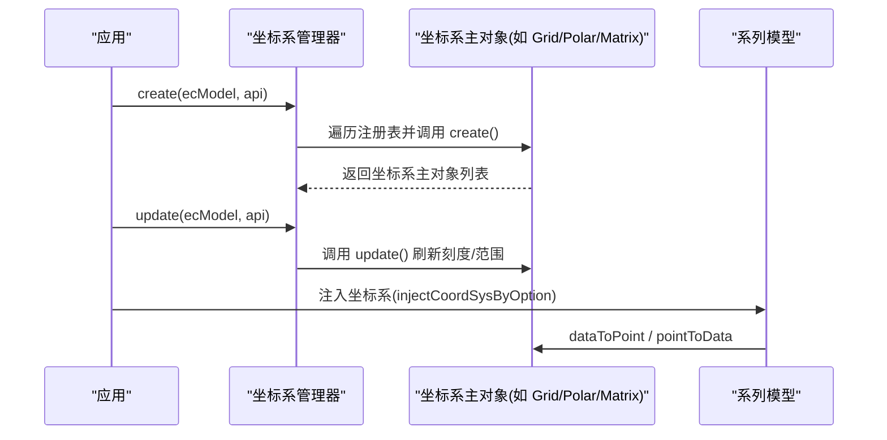
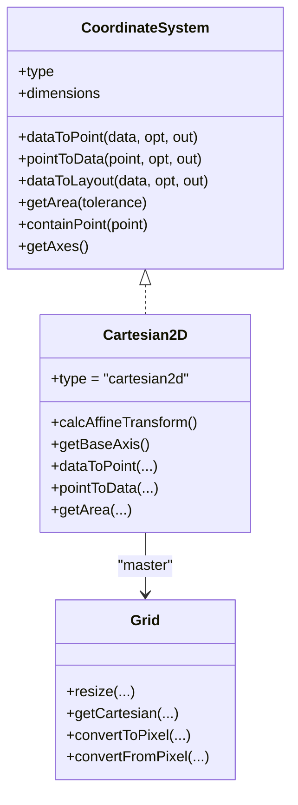
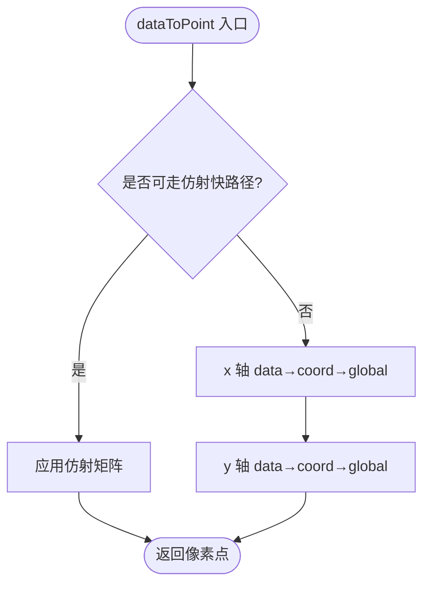
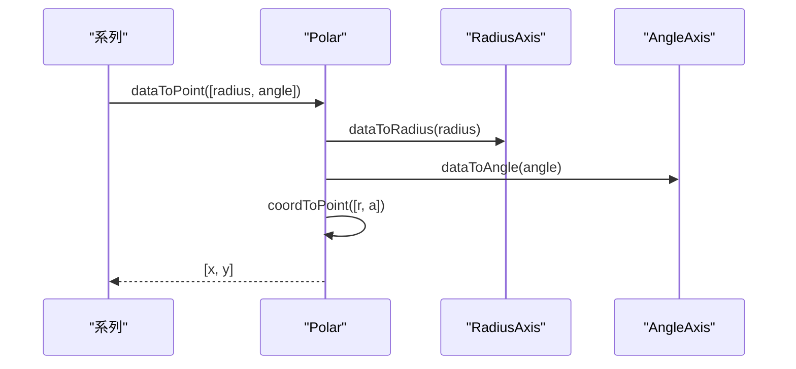
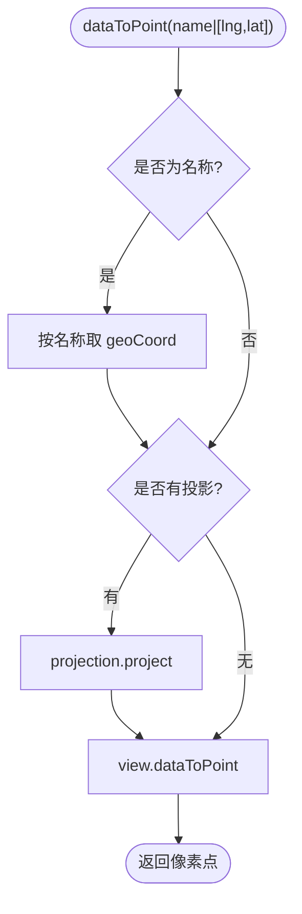
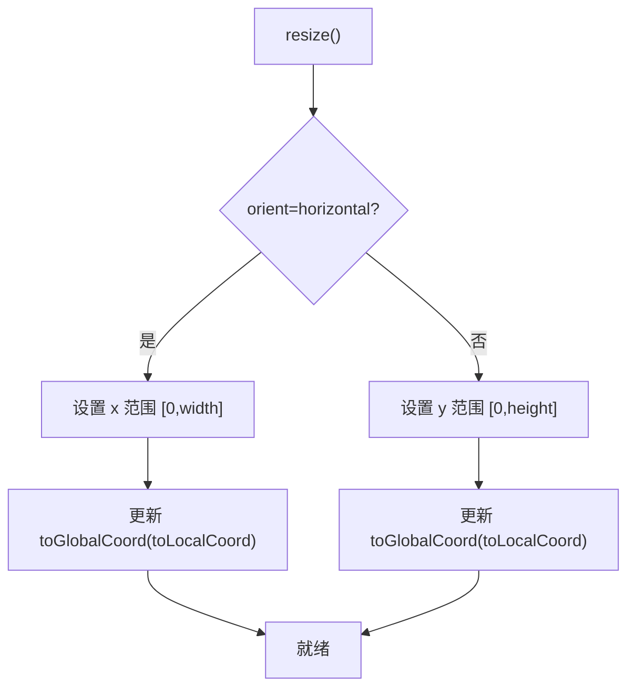
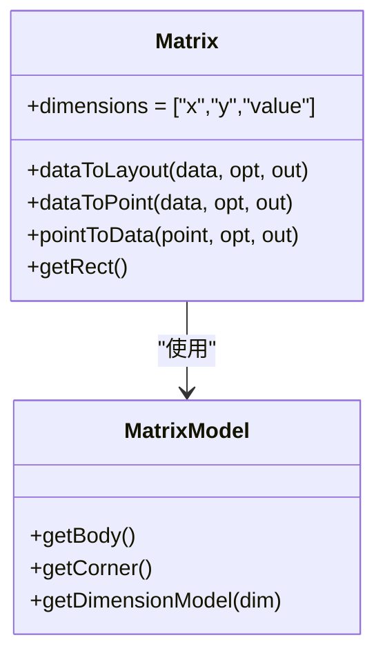
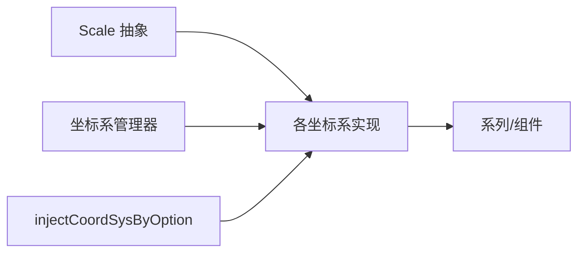

# 坐标系系统

<cite>
**本文引用的文件**
- [src/coord/CoordinateSystem.ts](file://src/coord/CoordinateSystem.ts)
- [src/core/CoordinateSystem.ts](file://src/core/CoordinateSystem.ts)
- [src/coord/cartesian/Cartesian2D.ts](file://src/coord/cartesian/Cartesian2D.ts)
- [src/coord/cartesian/Grid.ts](file://src/coord/cartesian/Grid.ts)
- [src/coord/cartesian/GridModel.ts](file://src/coord/cartesian/GridModel.ts)
- [src/coord/polar/Polar.ts](file://src/coord/polar/Polar.ts)
- [src/coord/polar/PolarModel.ts](file://src/coord/polar/PolarModel.ts)
- [src/coord/geo/Geo.ts](file://src/coord/geo/Geo.ts)
- [src/coord/single/Single.ts](file://src/coord/single/Single.ts)
- [src/coord/single/SingleAxis.ts](file://src/coord/single/SingleAxis.ts)
- [src/coord/matrix/Matrix.ts](file://src/coord/matrix/Matrix.ts)
- [src/scale/Scale.ts](file://src/scale/Scale.ts)
</cite>

## 目录
1. [简介](#简介)
2. [项目结构](#项目结构)
3. [核心组件](#核心组件)
4. [架构总览](#架构总览)
5. [详细组件分析](#详细组件分析)
6. [依赖关系分析](#依赖关系分析)
7. [性能考量](#性能考量)
8. [故障排查指南](#故障排查指南)
9. [结论](#结论)
10. [附录：自定义与扩展指南](#附录自定义与扩展指南)

## 简介
本文件系统性解析 ECharts 的坐标系系统架构与实现原理，覆盖直角坐标系（Cartesian2D）、极坐标系（Polar）、地理坐标系（Geo）、单轴坐标系（Single）和矩阵坐标系（Matrix）。重点说明坐标转换算法、刻度计算逻辑、自适应布局机制，并提供坐标系自定义开发与扩展的实践指南。

## 项目结构
ECharts 将“坐标系”抽象为统一的接口契约，并通过管理器统一创建与更新；每种坐标系提供独立的实现类与模型，配合 Scale（刻度）完成数据到像素的映射。

图表来源
- [src/core/CoordinateSystem.ts:47-105](file://src/core/CoordinateSystem.ts#L47-L105)
- [src/coord/CoordinateSystem.ts:125-233](file://src/coord/CoordinateSystem.ts#L125-L233)
- [src/coord/cartesian/Grid.ts:103-128](file://src/coord/cartesian/Grid.ts#L103-L128)
- [src/coord/cartesian/Cartesian2D.ts:41-52](file://src/coord/cartesian/Cartesian2D.ts#L41-L52)
- [src/coord/polar/Polar.ts:34-64](file://src/coord/polar/Polar.ts#L34-L64)
- [src/coord/geo/Geo.ts:58-84](file://src/coord/geo/Geo.ts#L58-L84)
- [src/coord/single/Single.ts:43-68](file://src/coord/single/Single.ts#L43-L68)
- [src/coord/matrix/Matrix.ts:55-73](file://src/coord/matrix/Matrix.ts#L55-L73)
- [src/scale/Scale.ts:51-125](file://src/scale/Scale.ts#L51-L125)

章节来源
- [src/core/CoordinateSystem.ts:47-105](file://src/core/CoordinateSystem.ts#L47-L105)
- [src/coord/CoordinateSystem.ts:125-233](file://src/coord/CoordinateSystem.ts#L125-L233)

## 核心组件
- 坐标系接口与宿主模型：定义 dataToPoint、pointToData、dataToLayout、getArea、containPoint、getAxes 等统一能力，并支持 GeoLikeCoordSys 扩展。
- 坐标系管理器：负责注册、创建、更新所有坐标系主对象（Master），并按需注入到系列或组件中。
- 各坐标系实现：
  - Cartesian2D：二维直角坐标系，支持仿射变换加速、多轴组合、区域裁剪。
  - Polar：极坐标系，角度与半径双轴，环形/扇形区域判定。
  - Geo：地理坐标系，基于 GeoJSON/SVG，支持投影与漫游变换。
  - Single：单轴坐标系，一维连续展示。
  - Matrix：矩阵坐标系，多维数据的行列单元格布局与定位。
- 刻度系统：Scale 抽象了刻度生成、标签格式化、断点处理等通用能力。

章节来源
- [src/coord/CoordinateSystem.ts:125-233](file://src/coord/CoordinateSystem.ts#L125-L233)
- [src/core/CoordinateSystem.ts:47-105](file://src/core/CoordinateSystem.ts#L47-L105)
- [src/scale/Scale.ts:51-125](file://src/scale/Scale.ts#L51-L125)

## 架构总览
坐标系的生命周期由管理器驱动：create 阶段完成布局与实例化，update 阶段根据数据处理后的结果刷新刻度与范围。系列通过 injectCoordSysByOption 获取对应坐标系实例，从而在渲染时调用 dataToPoint/pointToData 进行坐标转换。

图表来源
- [src/core/CoordinateSystem.ts:59-89](file://src/core/CoordinateSystem.ts#L59-L89)
- [src/core/CoordinateSystem.ts:290-358](file://src/core/CoordinateSystem.ts#L290-L358)

章节来源
- [src/core/CoordinateSystem.ts:59-89](file://src/core/CoordinateSystem.ts#L59-L89)
- [src/core/CoordinateSystem.ts:290-358](file://src/core/CoordinateSystem.ts#L290-L358)

## 详细组件分析

### 直角坐标系（Cartesian2D）
- 特点与应用场景
  - 适用于二维数据展示，支持多 x/y 轴组合与网格布局。
  - 支持 stacking、markLine/markArea、dataZoom 等常见功能。
- 关键实现要点
  - 仿射变换加速：当两轴均为线性或时间且无断点时，计算一次仿射矩阵以加速大量数据点的转换。
  - 基础轴选择：优先 ordinal/time，否则回退到 x 轴，用于堆叠与条形图基线。
  - 区域与包含判断：提供 getArea、containPoint、containData、containZone。
  - 数据与像素互转：dataToPoint/pointToData 支持 clamp 与快速路径。
- 与网格的关系
  - Grid 作为主对象管理多个 Cartesian2D，负责轴创建、对齐、刻度 nice、外边距与 containLabel 等布局策略。

图表来源
- [src/coord/CoordinateSystem.ts:125-233](file://src/coord/CoordinateSystem.ts#L125-L233)
- [src/coord/cartesian/Cartesian2D.ts:41-205](file://src/coord/cartesian/Cartesian2D.ts#L41-L205)
- [src/coord/cartesian/Grid.ts:103-128](file://src/coord/cartesian/Grid.ts#L103-L128)

图表来源
- [src/coord/cartesian/Cartesian2D.ts:58-88](file://src/coord/cartesian/Cartesian2D.ts#L58-L88)
- [src/coord/cartesian/Cartesian2D.ts:131-152](file://src/coord/cartesian/Cartesian2D.ts#L131-L152)

章节来源
- [src/coord/cartesian/Cartesian2D.ts:41-205](file://src/coord/cartesian/Cartesian2D.ts#L41-L205)
- [src/coord/cartesian/Grid.ts:134-279](file://src/coord/cartesian/Grid.ts#L134-L279)
- [src/coord/cartesian/GridModel.ts:98-151](file://src/coord/cartesian/GridModel.ts#L98-L151)

### 极坐标系（Polar）
- 特点与应用场景
  - 角度与半径双轴，适合雷达图、环形图、极坐标散点/折线等。
- 关键实现要点
  - 数据到像素：先分别经 radius/angle 轴转换为极坐标，再转为笛卡尔像素坐标。
  - 反向转换：像素→极坐标→数据值。
  - 区域判定：环形区域的 contain 逻辑考虑内外半径与起止角。
  - 基础轴选择：优先 ordinal/time，否则 angle 轴，用于堆叠等。

图表来源
- [src/coord/polar/Polar.ts:136-203](file://src/coord/polar/Polar.ts#L136-L203)

章节来源
- [src/coord/polar/Polar.ts:34-283](file://src/coord/polar/Polar.ts#L34-L283)
- [src/coord/polar/PolarModel.ts:38-72](file://src/coord/polar/PolarModel.ts#L38-L72)

### 地理坐标系（Geo）
- 特点与应用场景
  - 基于 GeoJSON/SVG 地图资源，支持投影与区域高亮、漫游缩放平移。
- 关键实现要点
  - 名称到坐标：按名称查找区域中心或自定义 geoCoord。
  - 投影：若配置 projection，则在 dataToPoint/pointToData 前后执行 project/unproject。
  - 视图矩形与裁剪：维护 view 的 boundingRect/viewRect，支持 shouldClip。
  - 漫游变换：getRoamTransform 提供当前缩放/平移矩阵。

图表来源
- [src/coord/geo/Geo.ts:198-222](file://src/coord/geo/Geo.ts#L198-L222)

章节来源
- [src/coord/geo/Geo.ts:58-295](file://src/coord/geo/Geo.ts#L58-L295)

### 单轴坐标系（Single）
- 特点与应用场景
  - 一维连续展示，常用于进度条、时间轴、单轴散点等。
- 关键实现要点
  - 水平/垂直方向：依据 orient 决定坐标轴方向与像素分配。
  - 刻度与范围：update 阶段执行 scaleCalcNice，resize 阶段设置 extent 与 toGlobalCoord/toLocalCoord。
  - 数据与像素互转：pointToData/dataToPoint 仅处理单一维度。

图表来源
- [src/coord/single/Single.ts:108-156](file://src/coord/single/Single.ts#L108-L156)

章节来源
- [src/coord/single/Single.ts:43-252](file://src/coord/single/Single.ts#L43-L252)
- [src/coord/single/SingleAxis.ts:40-75](file://src/coord/single/SingleAxis.ts#L40-L75)

### 矩阵坐标系（Matrix）
- 特点与应用场景
  - 多维数据的矩阵展示，支持行列层级、单元格合并、内容区与角落区布局。
- 关键实现要点
  - 布局：按维度分别布局单元与层级，支持指定 size 与自动均分。
  - 定位：dataToLayout 返回 rect 与 locatorRange，支持忽略合并单元格选项。
  - 反查：pointToData 将像素点映射到行列定位器，区分 body/corner/outside。
  - 注入：通过 injectCoordSysByOption 将 matrix 注入到相关组件/系列。

图表来源
- [src/coord/matrix/Matrix.ts:55-119](file://src/coord/matrix/Matrix.ts#L55-L119)

章节来源
- [src/coord/matrix/Matrix.ts:55-632](file://src/coord/matrix/Matrix.ts#L55-L632)

## 依赖关系分析
- 坐标系与刻度
  - 所有坐标系依赖 Scale 抽象进行数值/分类/时间/对数等刻度计算与断点处理。
- 坐标系管理器
  - 统一管理坐标系主对象的创建与更新，支持非 series box 类型（matrix/calendar）与普通类型的差异化处理。
- 注入机制
  - 通过 injectCoordSysByOption 将坐标系注入到系列或组件，支持“数据级”与“盒级”两种使用模式。

图表来源
- [src/scale/Scale.ts:51-125](file://src/scale/Scale.ts#L51-L125)
- [src/core/CoordinateSystem.ts:47-105](file://src/core/CoordinateSystem.ts#L47-L105)
- [src/core/CoordinateSystem.ts:290-358](file://src/core/CoordinateSystem.ts#L290-L358)

章节来源
- [src/scale/Scale.ts:51-125](file://src/scale/Scale.ts#L51-L125)
- [src/core/CoordinateSystem.ts:47-105](file://src/core/CoordinateSystem.ts#L47-L105)
- [src/core/CoordinateSystem.ts:290-358](file://src/core/CoordinateSystem.ts#L290-L358)

## 性能考量
- 仿射变换加速（Cartesian2D）
  - 当 x/y 轴均为线性或时间且无断点时，预计算仿射矩阵，避免逐点重复计算，显著提升大数据量下的转换性能。
- 刻度与区间
  - 使用 scaleCalcNice 与 scaleCalcAlign 优化刻度分布与对齐，减少重绘与布局抖动。
- 矩阵布局
  - 预先计算单元与层级尺寸，支持指定 size 与自动均分，避免重复计算；pointToData 采用区域分类快速分支。
- 地理投影
  - 仅在需要时执行投影/反投影，结合视图矩形与裁剪减少无效绘制。

[本节为通用性能建议，不直接分析具体文件]

## 故障排查指南
- 找不到坐标系
  - 检查系列/组件是否正确声明 coordinateSystemUsage 与 coordinateSystem，并确保已注册对应坐标系。
- 坐标转换异常
  - 确认数据是否在刻度范围内，必要时启用 clamp；检查是否存在断点导致无法走仿射快路径。
- 地图投影问题
  - 确保 projection 同时提供 project 与 unproject；SVG 资源不支持投影时会发出警告。
- 单轴方向错误
  - 检查 orient 与 position 配置，确认 isHorizontal 判断与 extent 设置一致。

章节来源
- [src/coord/geo/Geo.ts:128-143](file://src/coord/geo/Geo.ts#L128-L143)
- [src/coord/cartesian/Cartesian2D.ts:36-39](file://src/coord/cartesian/Cartesian2D.ts#L36-L39)
- [src/coord/single/Single.ts:119-156](file://src/coord/single/Single.ts#L119-L156)

## 结论
ECharts 的坐标系系统通过统一的接口与管理器实现了高度可扩展的坐标映射体系。Cartesian2D 提供高性能二维映射，Polar 支持角度/半径可视化，Geo 承载地图与投影，Single 专注一维连续展示，Matrix 面向多维矩阵布局。配合 Scale 的刻度系统与注入机制，既能满足通用图表需求，也便于二次扩展与定制。

[本节为总结性内容，不直接分析具体文件]

## 附录：自定义与扩展指南
- 新增坐标系步骤
  1. 实现坐标系接口：继承或实现 CoordinateSystem 约定的方法（dataToPoint、pointToData、dataToLayout、getArea、containPoint、getAxes 等）。
  2. 提供主对象（可选）：如需管理多个实例或复杂布局，实现 CoordinateSystemMaster。
  3. 注册坐标系：通过 CoordinateSystemManager.register(type, creator) 注册创建函数。
  4. 注入使用：在系列或组件中使用 injectCoordSysByOption 获取坐标系实例。
- 最佳实践
  - 保持 dataToPoint/pointToData 的幂等性与稳定性，避免副作用。
  - 合理使用 clamp 与容差 tolerance，保证边界情况的鲁棒性。
  - 对于大数据场景，优先考虑仿射变换或批量转换优化。
  - 地图类坐标系需提供 getViewRect/getBoundingRect/getRoamTransform 以支持交互与导出。

章节来源
- [src/core/CoordinateSystem.ts:47-105](file://src/core/CoordinateSystem.ts#L47-L105)
- [src/core/CoordinateSystem.ts:290-358](file://src/core/CoordinateSystem.ts#L290-L358)
- [src/coord/CoordinateSystem.ts:125-233](file://src/coord/CoordinateSystem.ts#L125-L233)