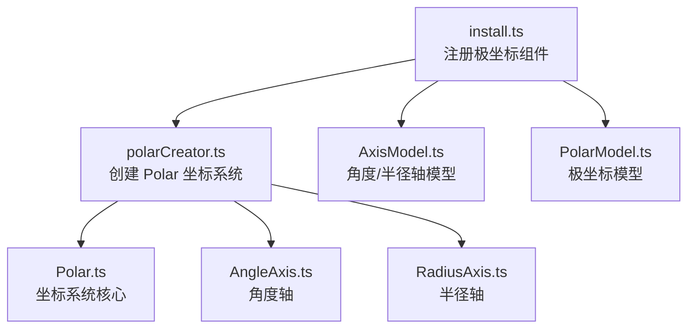
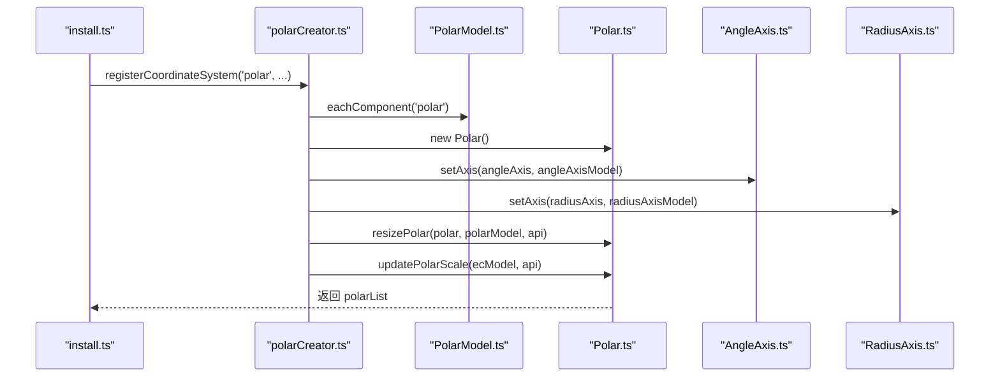
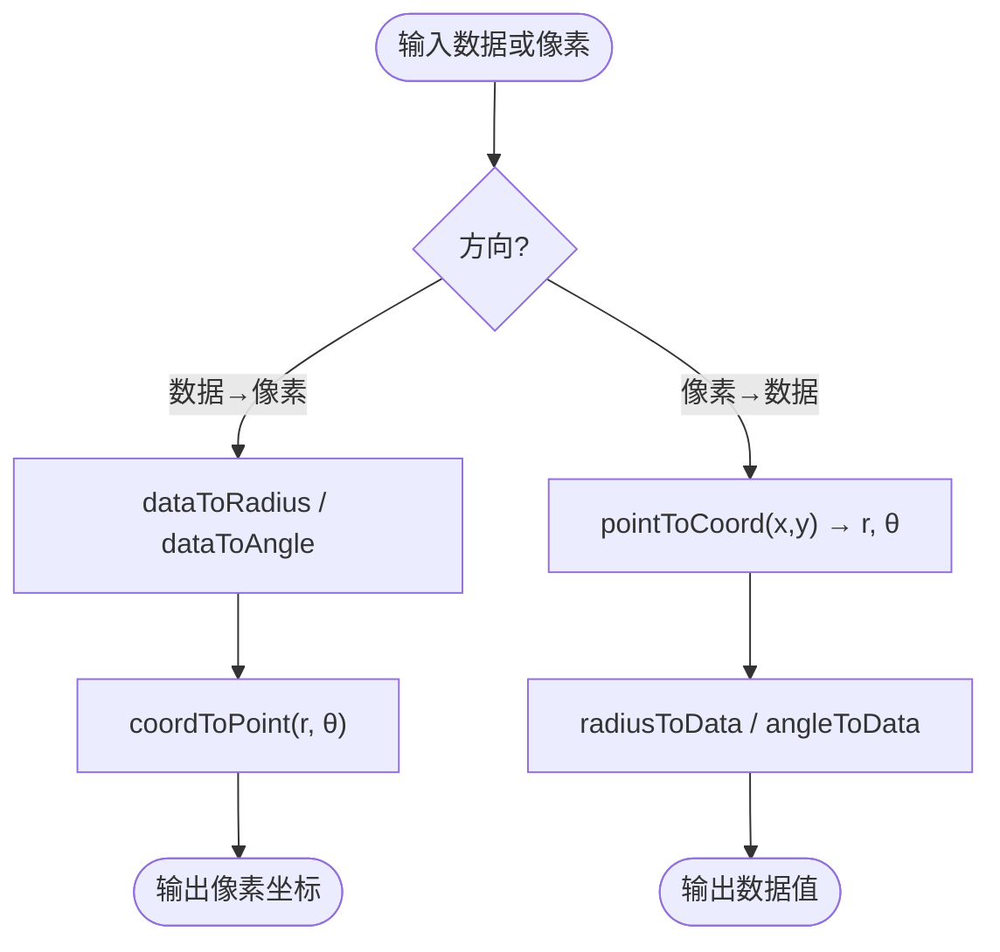
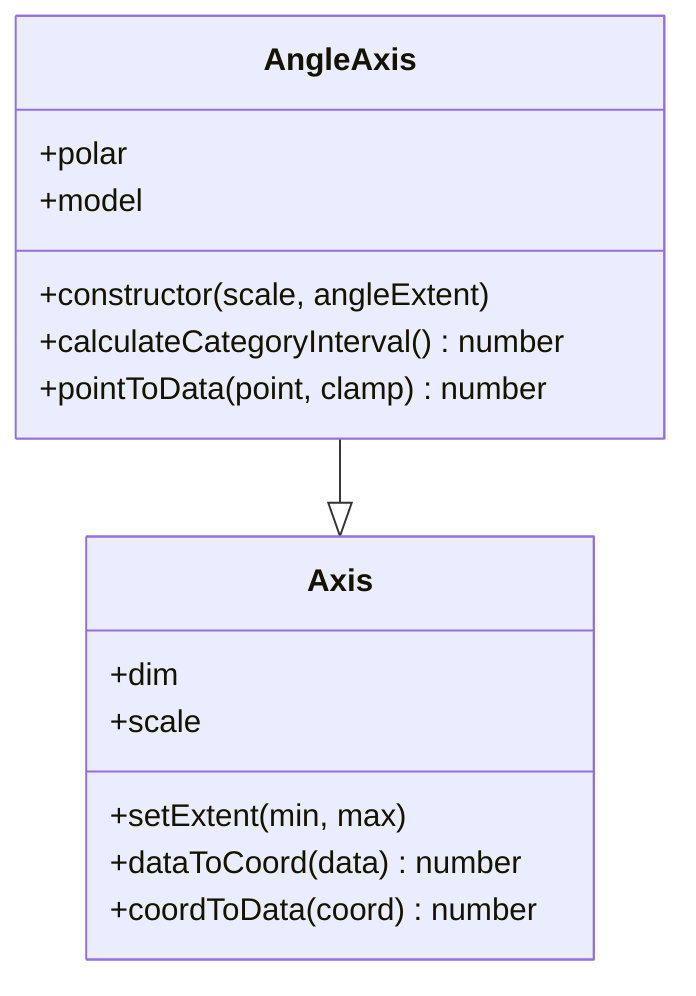
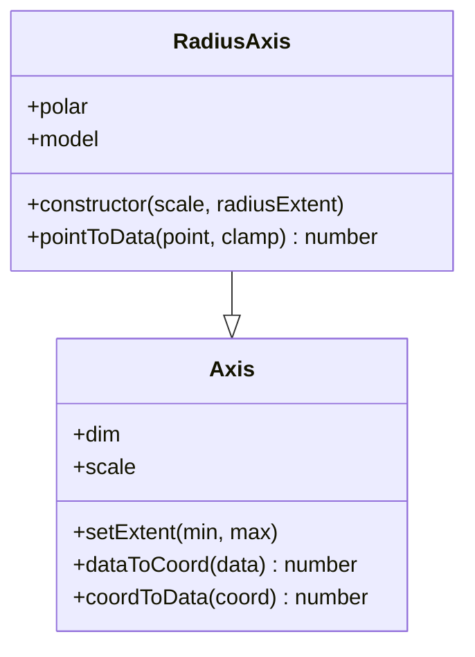
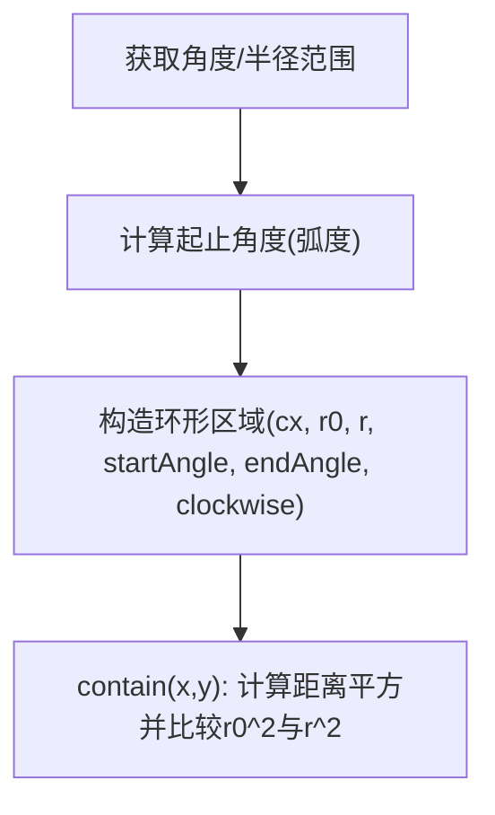
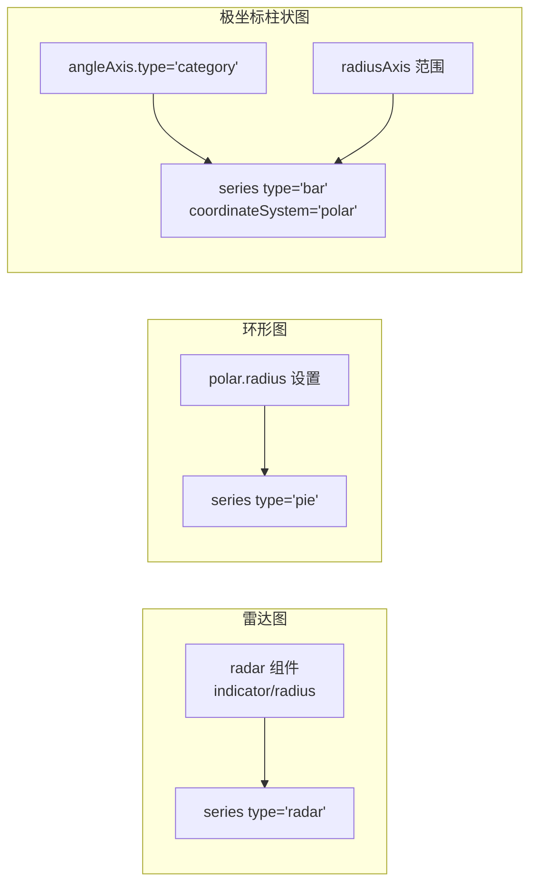
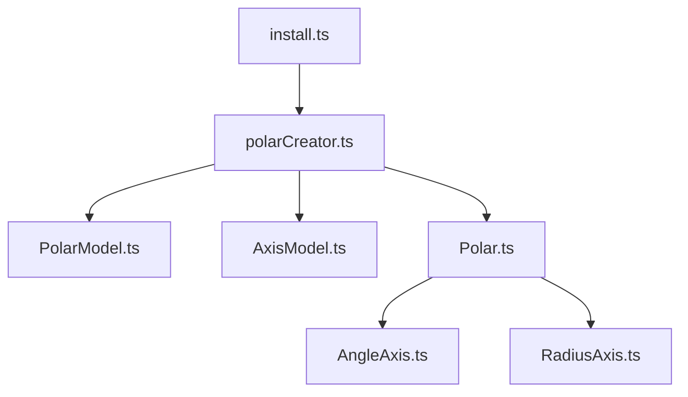

# 极坐标系 (Polar)

<cite>
**本文引用的文件**
- [src/coord/polar/Polar.ts](file://src/coord/polar/Polar.ts)
- [src/coord/polar/AngleAxis.ts](file://src/coord/polar/AngleAxis.ts)
- [src/coord/polar/RadiusAxis.ts](file://src/coord/polar/RadiusAxis.ts)
- [src/coord/polar/PolarModel.ts](file://src/coord/polar/PolarModel.ts)
- [src/coord/polar/AxisModel.ts](file://src/coord/polar/AxisModel.ts)
- [src/coord/polar/polarCreator.ts](file://src/coord/polar/polarCreator.ts)
- [src/component/polar/install.ts](file://src/component/polar/install.ts)
- [test/bar-polar-basic-radial.html](file://test/bar-polar-basic-radial.html)
- [test/radar.html](file://test/radar.html)
- [test/polarLine.html](file://test/polarLine.html)
</cite>

## 目录
1. [简介](#简介)
2. [项目结构](#项目结构)
3. [核心组件](#核心组件)
4. [架构总览](#架构总览)
5. [详细组件分析](#详细组件分析)
6. [依赖关系分析](#依赖关系分析)
7. [性能考量](#性能考量)
8. [故障排查指南](#故障排查指南)
9. [结论](#结论)
10. [附录：配置示例与最佳实践](#附录：配置示例与最佳实践)

## 简介
本文件系统性阐述 ECharts 中“极坐标系（Polar）”的数学原理、实现结构与使用方式，覆盖角度轴（AngleAxis）与半径轴（RadiusAxis）的概念与配置、极坐标与直角坐标的转换算法、在极坐标下的图形绘制原理，以及雷达图、环形图、极坐标柱状图等图表的坐标系配置要点。文档同时给出角度刻度计算、半径范围设置、起始角度配置与旋转方向控制的方法，并提供完整的配置示例与最佳实践建议。

## 项目结构
极坐标系由“模型-创建器-坐标系统-轴-视图”等模块协作完成：
- 模型层：PolarModel 定义极坐标组件及其默认布局；AngleAxisModel/RadiusAxisModel 定义角度/半径轴的选项与行为。
- 创建器：polarCreator 负责根据模型实例化 Polar 坐标系统，并装配两个轴、计算尺寸与范围。
- 坐标系统：Polar 提供数据与像素之间的双向转换、包含性判断、区域裁剪等能力。
- 轴：AngleAxis/RadiusAxis 继承通用 Axis，分别处理角度与半径维度的尺度映射与刻度计算。
- 安装与注册：component/polar/install.ts 将极坐标相关模型、视图、轴指针、布局处理器等注册到 ECharts。

**图示来源**
- [src/component/polar/install.ts:64-85](file://src/component/polar/install.ts#L64-L85)
- [src/coord/polar/polarCreator.ts:126-186](file://src/coord/polar/polarCreator.ts#L126-L186)
- [src/coord/polar/Polar.ts:34-125](file://src/coord/polar/Polar.ts#L34-L125)
- [src/coord/polar/AngleAxis.ts:37-45](file://src/coord/polar/AngleAxis.ts#L37-L45)
- [src/coord/polar/RadiusAxis.ts:30-38](file://src/coord/polar/RadiusAxis.ts#L30-L38)
- [src/coord/polar/AxisModel.ts:62-89](file://src/coord/polar/AxisModel.ts#L62-L89)
- [src/coord/polar/PolarModel.ts:38-69](file://src/coord/polar/PolarModel.ts#L38-L69)

**章节来源**
- [src/component/polar/install.ts:64-85](file://src/component/polar/install.ts#L64-L85)
- [src/coord/polar/polarCreator.ts:126-186](file://src/coord/polar/polarCreator.ts#L126-L186)
- [src/coord/polar/Polar.ts:34-125](file://src/coord/polar/Polar.ts#L34-L125)
- [src/coord/polar/AngleAxis.ts:37-45](file://src/coord/polar/AngleAxis.ts#L37-L45)
- [src/coord/polar/RadiusAxis.ts:30-38](file://src/coord/polar/RadiusAxis.ts#L30-L38)
- [src/coord/polar/AxisModel.ts:62-89](file://src/coord/polar/AxisModel.ts#L62-L89)
- [src/coord/polar/PolarModel.ts:38-69](file://src/coord/polar/PolarModel.ts#L38-L69)

## 核心组件
- Polar 坐标系统：维护中心点 cx/cy，聚合 AngleAxis 与 RadiusAxis，提供 dataToPoint/pointToData、pointToCoord/coordToPoint、getArea 等方法，用于数据与像素的双向转换及区域包含判断。
- AngleAxis：角度轴，默认范围 [0, 360]，支持类目型刻度自动间隔计算、起始/结束角度、顺时针/逆时针方向控制。
- RadiusAxis：半径轴，表示从中心到边缘的距离范围，支持区间设置与反向。
- PolarModel：极坐标组件模型，提供 center、radius 等布局参数，以及与系列关联的能力。
- AxisModel（AngleAxisModel/RadiusAxisModel）：定义极坐标下两轴的选项类型与默认行为，如 startAngle、endAngle、clockwise、inverse 等。

**章节来源**
- [src/coord/polar/Polar.ts:34-125](file://src/coord/polar/Polar.ts#L34-L125)
- [src/coord/polar/AngleAxis.ts:37-45](file://src/coord/polar/AngleAxis.ts#L37-L45)
- [src/coord/polar/RadiusAxis.ts:30-38](file://src/coord/polar/RadiusAxis.ts#L30-L38)
- [src/coord/polar/PolarModel.ts:38-69](file://src/coord/polar/PolarModel.ts#L38-L69)
- [src/coord/polar/AxisModel.ts:30-58](file://src/coord/polar/AxisModel.ts#L30-L58)

## 架构总览
极坐标系的构建与更新流程如下：
- install.ts 注册 polar 坐标系统与轴模型/视图，并注入布局处理器。
- polarCreator.create 遍历所有 PolarModel，创建 Polar 实例，装配 AngleAxis/RadiusAxis，调用 resizePolar 计算中心与半径范围，调用 updatePolarScale 进行刻度美化与类目角度范围修正。
- 系列通过 coordinateSystem='polar' 绑定到对应 Polar 实例，参与渲染与交互。

**图示来源**
- [src/component/polar/install.ts:64-85](file://src/component/polar/install.ts#L64-L85)
- [src/coord/polar/polarCreator.ts:126-186](file://src/coord/polar/polarCreator.ts#L126-L186)
- [src/coord/polar/PolarModel.ts:38-69](file://src/coord/polar/PolarModel.ts#L38-L69)
- [src/coord/polar/Polar.ts:34-125](file://src/coord/polar/Polar.ts#L34-L125)
- [src/coord/polar/AngleAxis.ts:37-45](file://src/coord/polar/AngleAxis.ts#L37-L45)
- [src/coord/polar/RadiusAxis.ts:30-38](file://src/coord/polar/RadiusAxis.ts#L30-L38)

## 详细组件分析

### 极坐标与直角坐标转换
- 数据到像素：dataToPoint 先将数据映射为 (radius, angle)，再通过 coordToPoint 转换为 (x, y)。
- 像素到数据：pointToData 先通过 pointToCoord 得到 (radius, angle)，再反映射回数据值。
- 几何转换：coordToPoint 使用 cos/sin 将极坐标转为笛卡尔坐标；pointToCoord 使用 atan2 计算角度，并结合角度范围归一化。

**图示来源**
- [src/coord/polar/Polar.ts:136-203](file://src/coord/polar/Polar.ts#L136-L203)

**章节来源**
- [src/coord/polar/Polar.ts:136-203](file://src/coord/polar/Polar.ts#L136-L203)

### 角度轴（AngleAxis）
- 默认范围：[0, 360]，可通过 startAngle/endAngle 调整起始与结束角度。
- 旋转方向：clockwise=true 表示顺时针；底层通过 inverse 控制实际角度增长方向。
- 类目刻度：calculateCategoryInterval 基于标签高度与单位跨度估算合适的刻度间隔，避免生成过多刻度导致拥挤。
- 类目角度范围修正：当角度轴类型为 category 且 onBand=false 时，会按类别数量对 extent 做微调以保证完整显示。

**图示来源**
- [src/coord/polar/AngleAxis.ts:37-125](file://src/coord/polar/AngleAxis.ts#L37-L125)

**章节来源**
- [src/coord/polar/AngleAxis.ts:37-125](file://src/coord/polar/AngleAxis.ts#L37-L125)
- [src/coord/polar/polarCreator.ts:82-100](file://src/coord/polar/polarCreator.ts#L82-L100)

### 半径轴（RadiusAxis）
- 范围：由 polar.radius 决定，支持数组形式 [r0, r1]，可百分比或绝对值；支持 inverse 反转。
- 映射：dataToRadius/radiusToData 复用基类 Axis 的 dataToCoord/coordToData。
- 包含性：containData/contain 委托给 Polar 的两轴判断。

**图示来源**
- [src/coord/polar/RadiusAxis.ts:30-49](file://src/coord/polar/RadiusAxis.ts#L30-L49)

**章节来源**
- [src/coord/polar/RadiusAxis.ts:30-49](file://src/coord/polar/RadiusAxis.ts#L30-L49)

### 极坐标区域与包含判断
- getArea 返回一个环形区域对象，包含中心、内外半径、起止角度与是否顺时针等信息，并提供 contain(x,y) 判断点是否在环内。
- 该区域用于裁剪与命中检测，保证极坐标下图形正确显示与交互。

**图示来源**
- [src/coord/polar/Polar.ts:209-248](file://src/coord/polar/Polar.ts#L209-L248)

**章节来源**
- [src/coord/polar/Polar.ts:209-248](file://src/coord/polar/Polar.ts#L209-L248)

### 雷达图、环形图、极坐标柱状图的坐标系配置
- 雷达图：使用 radar 组件配置指标与半径范围，series type='radar'，数据维度与指标一一对应。
- 环形图：pie 系列可结合 polar 布局，通过 polar.radius 控制内外半径形成环形效果。
- 极坐标柱状图：series type='bar'，coordinateSystem='polar'，angleAxis.type='category'，radiusAxis 控制径向范围。

**图示来源**
- [test/radar.html:43-70](file://test/radar.html#L43-L70)
- [test/bar-polar-basic-radial.html:46-66](file://test/bar-polar-basic-radial.html#L46-L66)
- [test/polarLine.html:59-80](file://test/polarLine.html#L59-L80)

**章节来源**
- [test/radar.html:43-70](file://test/radar.html#L43-L70)
- [test/bar-polar-basic-radial.html:46-66](file://test/bar-polar-basic-radial.html#L46-L66)
- [test/polarLine.html:59-80](file://test/polarLine.html#L59-L80)

## 依赖关系分析
- install.ts 注册 polar 坐标系统与轴模型/视图，并启用极坐标轴指针与布局处理器。
- polarCreator 依赖 PolarModel、AxisModel、Scale、Layout 工具，创建并更新 Polar 坐标系统。
- Polar 依赖 AngleAxis/RadiusAxis 提供维度映射与范围控制。
- 系列通过 coordinateSystem='polar' 与 Polar 实例关联，参与渲染与交互。

**图示来源**
- [src/component/polar/install.ts:64-85](file://src/component/polar/install.ts#L64-L85)
- [src/coord/polar/polarCreator.ts:126-186](file://src/coord/polar/polarCreator.ts#L126-L186)
- [src/coord/polar/PolarModel.ts:38-69](file://src/coord/polar/PolarModel.ts#L38-L69)
- [src/coord/polar/AxisModel.ts:62-89](file://src/coord/polar/AxisModel.ts#L62-L89)
- [src/coord/polar/Polar.ts:34-125](file://src/coord/polar/Polar.ts#L34-L125)
- [src/coord/polar/AngleAxis.ts:37-45](file://src/coord/polar/AngleAxis.ts#L37-L45)
- [src/coord/polar/RadiusAxis.ts:30-38](file://src/coord/polar/RadiusAxis.ts#L30-L38)

**章节来源**
- [src/component/polar/install.ts:64-85](file://src/component/polar/install.ts#L64-L85)
- [src/coord/polar/polarCreator.ts:126-186](file://src/coord/polar/polarCreator.ts#L126-L186)
- [src/coord/polar/Polar.ts:34-125](file://src/coord/polar/Polar.ts#L34-L125)

## 性能考量
- 类目角度刻度：AngleAxis.calculateCategoryInterval 基于文本高度与单位跨度估算间隔，避免生成过多刻度造成渲染压力。
- 类目角度范围修正：updatePolarScale 中对 category 角度轴进行 extent 微调，确保完整显示且不重叠。
- 环形区域包含判断：getArea 使用距离平方比较与微小容差，减少浮点误差导致的误判。
- 缩放与动画：配合 scaleCalcNice 与布局工具，保证在不同尺寸下刻度与标签稳定。

**章节来源**
- [src/coord/polar/AngleAxis.ts:58-117](file://src/coord/polar/AngleAxis.ts#L58-L117)
- [src/coord/polar/polarCreator.ts:82-100](file://src/coord/polar/polarCreator.ts#L82-L100)
- [src/coord/polar/Polar.ts:209-248](file://src/coord/polar/Polar.ts#L209-L248)

## 故障排查指南
- 找不到极坐标组件：当 series 指定 coordinateSystem='polar' 但未找到对应 polar 组件时，开发模式下会抛出错误提示。检查 polarIndex/polarId 是否正确。
- 角度轴类目显示异常：若角度轴为 category 且 onBand=false，需确认 extent 已按类别数量修正；必要时调整 splitNumber 或 label 样式。
- 半径范围无效：检查 polar.radius 是否为数组或字符串百分比，并确保解析后的范围合理（r0 <= r1）。
- 点击/包含检测失败：确认 getArea 的包含逻辑与图形边界一致，避免过小的 EPSILON 导致误判。

**章节来源**
- [src/coord/polar/polarCreator.ts:154-180](file://src/coord/polar/polarCreator.ts#L154-L180)
- [src/coord/polar/polarCreator.ts:82-100](file://src/coord/polar/polarCreator.ts#L82-L100)
- [src/coord/polar/Polar.ts:209-248](file://src/coord/polar/Polar.ts#L209-L248)

## 结论
ECharts 的极坐标系以 Polar 为核心，通过 AngleAxis 与 RadiusAxis 分别管理角度与半径维度，提供稳健的数据-像素转换、范围控制与包含判断。配合 polarCreator 的创建与更新流程，以及 install.ts 的注册机制，能够支撑雷达图、环形图、极坐标柱状图等多种可视化需求。合理配置起始角度、旋转方向、半径范围与刻度策略，可获得清晰、稳定的极坐标图表表现。

## 附录：配置示例与最佳实践
- 极坐标柱状图：设置 angleAxis.type='category' 与数据，radiusAxis 控制径向范围，series type='bar' 并指定 coordinateSystem='polar'。
- 雷达图：配置 radar.indicator 与 radius，series type='radar'，value 数组与指标顺序一致。
- 极坐标折线图：通过 angleAxis.startAngle 调整起始角度，radiusAxis 控制范围，series type='line' 并使用 coordinateSystem='polar'。

参考示例路径：
- [test/bar-polar-basic-radial.html](file://test/bar-polar-basic-radial.html)
- [test/radar.html](file://test/radar.html)
- [test/polarLine.html](file://test/polarLine.html)

最佳实践建议：
- 明确 polar.center 与 polar.radius，确保图表居中与合适大小。
- 对于类目角度轴，合理设置 splitNumber 与 label.rotate，避免标签重叠。
- 使用 clockwise 控制旋转方向，startAngle/endAngle 精确控制扇区范围。
- 在大数据量场景，关注刻度间隔与标签密度，必要时启用数据采样或简化标签。

**章节来源**
- [test/bar-polar-basic-radial.html:46-66](file://test/bar-polar-basic-radial.html#L46-L66)
- [test/radar.html:43-70](file://test/radar.html#L43-L70)
- [test/polarLine.html:59-80](file://test/polarLine.html#L59-L80)