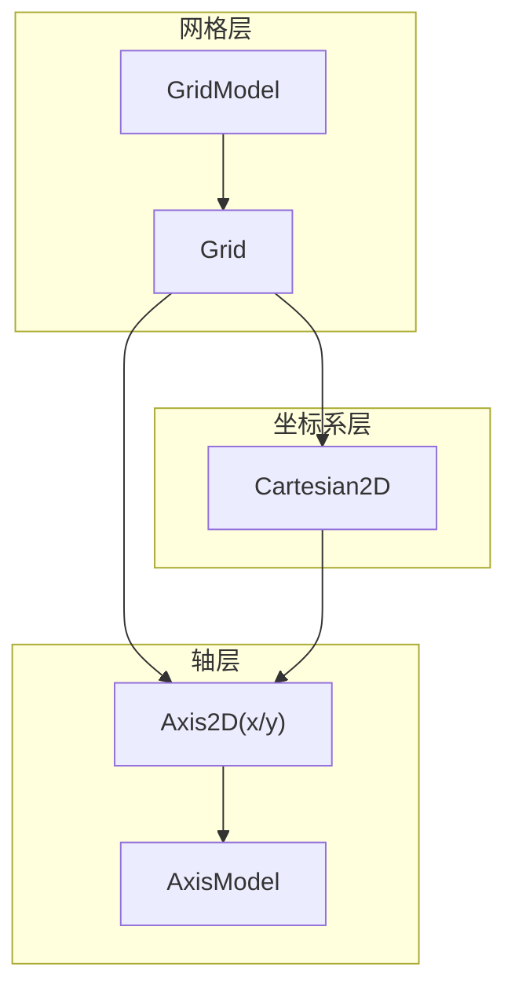
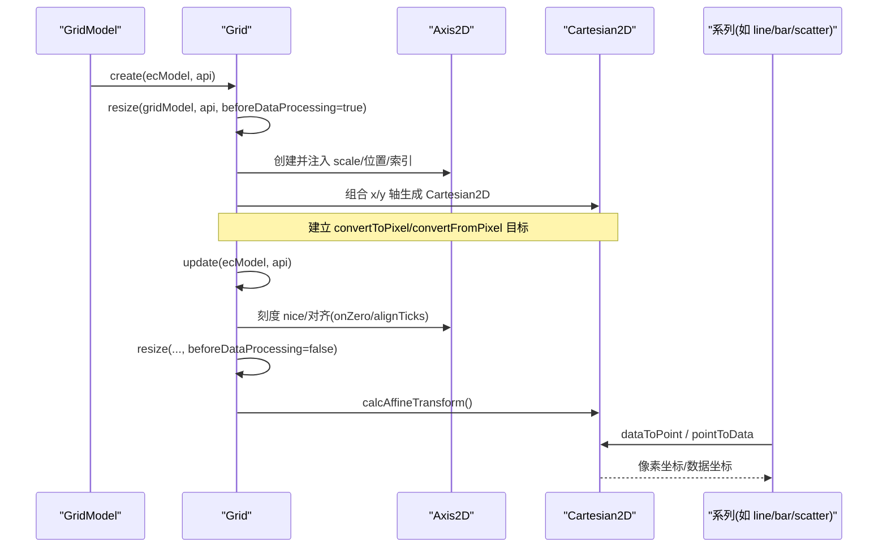
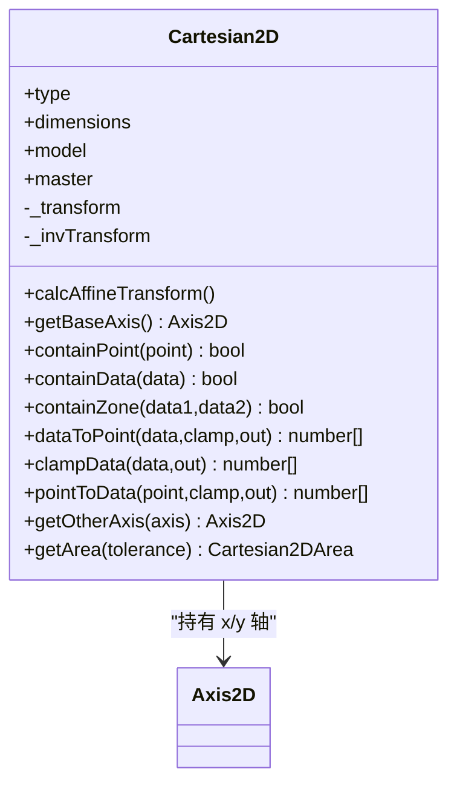
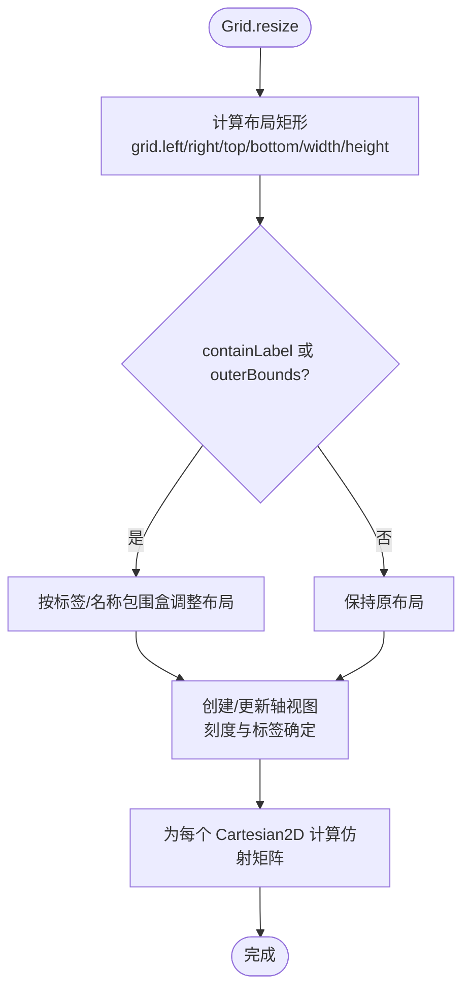
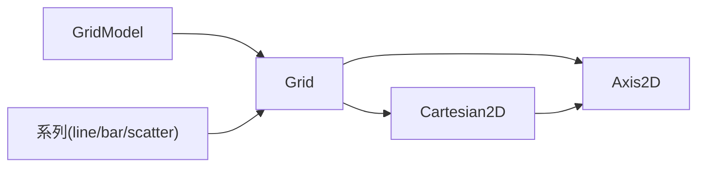

# 直角坐标系 (Cartesian2D)

<cite>
**本文引用的文件**
- [src/coord/cartesian/Cartesian2D.ts](file://src/coord/cartesian/Cartesian2D.ts)
- [src/coord/cartesian/Grid.ts](file://src/coord/cartesian/Grid.ts)
- [src/coord/cartesian/GridModel.ts](file://src/coord/cartesian/GridModel.ts)
- [src/coord/cartesian/Axis2D.ts](file://src/coord/cartesian/Axis2D.ts)
- [src/coord/cartesian/AxisModel.ts](file://src/coord/cartesian/AxisModel.ts)
- [src/chart/bar/BaseBarSeries.ts](file://src/chart/bar/BaseBarSeries.ts)
- [src/chart/line/LineSeries.ts](file://src/chart/line/LineSeries.ts)
- [src/chart/scatter/ScatterSeries.ts](file://src/chart/scatter/ScatterSeries.ts)
</cite>

## 目录
1. [简介](#简介)
2. [项目结构](#项目结构)
3. [核心组件](#核心组件)
4. [架构总览](#架构总览)
5. [详细组件分析](#详细组件分析)
6. [依赖关系分析](#依赖关系分析)
7. [性能考量](#性能考量)
8. [故障排查指南](#故障排查指南)
9. [结论](#结论)
10. [附录](#附录)

## 简介
本章节面向直角坐标系（Cartesian2D）的数学原理与实现机制，系统阐述二维笛卡尔坐标系统的构建、网格布局算法与轴管理系统。重点覆盖 X/Y 轴配置选项（刻度计算、标签对齐、范围设置）、多轴支持、网格线样式配置、自适应布局机制；并提供柱状图、折线图、散点图等常用图表的坐标系配置要点；同时说明坐标系转换函数、边界检测与性能优化技巧。

## 项目结构
直角坐标系由“网格（Grid）—轴（Axis2D）—坐标系（Cartesian2D）”三层构成：
- Grid：管理多个 Cartesian2D 实例，负责布局、轴创建与更新、像素到数据的双向转换等。
- Axis2D：表示 X/Y 轴，提供局部/全局坐标变换、范围获取、类目排序等能力。
- Cartesian2D：组合两个 Axis2D 形成二维坐标系，提供数据点与像素点的互转、包含性判断、仿射加速等。

图示来源
- [src/coord/cartesian/Grid.ts:103-128](file://src/coord/cartesian/Grid.ts#L103-L128)
- [src/coord/cartesian/GridModel.ts:98-147](file://src/coord/cartesian/GridModel.ts#L98-L147)
- [src/coord/cartesian/Axis2D.ts:43-86](file://src/coord/cartesian/Axis2D.ts#L43-L86)
- [src/coord/cartesian/AxisModel.ts:49-67](file://src/coord/cartesian/AxisModel.ts#L49-L67)
- [src/coord/cartesian/Cartesian2D.ts:41-52](file://src/coord/cartesian/Cartesian2D.ts#L41-L52)

章节来源
- [src/coord/cartesian/Grid.ts:103-128](file://src/coord/cartesian/Grid.ts#L103-L128)
- [src/coord/cartesian/GridModel.ts:98-147](file://src/coord/cartesian/GridModel.ts#L98-L147)
- [src/coord/cartesian/Axis2D.ts:43-86](file://src/coord/cartesian/Axis2D.ts#L43-L86)
- [src/coord/cartesian/AxisModel.ts:49-67](file://src/coord/cartesian/AxisModel.ts#L49-L67)
- [src/coord/cartesian/Cartesian2D.ts:41-52](file://src/coord/cartesian/Cartesian2D.ts#L41-L52)

## 核心组件
- Grid：负责创建/维护多个 Cartesian2D，统一处理轴刻度对齐、onZero、containLabel/outerBounds 自适应布局、resize 流程、convertToPixel/convertFromPixel 等。
- Axis2D：封装维度为 x/y 的轴，提供 toLocalCoord/toGlobalCoord、getGlobalExtent、类目排序等。
- Cartesian2D：组合 x/y 轴，提供 dataToPoint/pointToData、containPoint/containData/containZone、calcAffineTransform 等。
- GridModel/AxisModel：承载配置项与默认值，参与合并主题与布局参数。

章节来源
- [src/coord/cartesian/Grid.ts:134-279](file://src/coord/cartesian/Grid.ts#L134-L279)
- [src/coord/cartesian/Axis2D.ts:95-118](file://src/coord/cartesian/Axis2D.ts#L95-L118)
- [src/coord/cartesian/Cartesian2D.ts:58-184](file://src/coord/cartesian/Cartesian2D.ts#L58-L184)
- [src/coord/cartesian/GridModel.ts:126-147](file://src/coord/cartesian/GridModel.ts#L126-L147)
- [src/coord/cartesian/AxisModel.ts:49-67](file://src/coord/cartesian/AxisModel.ts#L49-L67)

## 架构总览
下图展示从模型到视图的关键调用链：Grid 在 create/update/resize 阶段初始化轴与坐标系，Cartesian2D 提供数据与像素互转，系列通过坐标系完成定位与绘制。

图示来源
- [src/coord/cartesian/Grid.ts:536-603](file://src/coord/cartesian/Grid.ts#L536-L603)
- [src/coord/cartesian/Grid.ts:134-279](file://src/coord/cartesian/Grid.ts#L134-L279)
- [src/coord/cartesian/Cartesian2D.ts:58-88](file://src/coord/cartesian/Cartesian2D.ts#L58-L88)

## 详细组件分析

### 坐标系类 Cartesian2D
- 维度与类型：固定维度 ['x','y']，类型为 'cartesian2d'。
- 仿射加速：当两轴均为线性或时间且无断点时，计算仿射矩阵以加速大量数据的 dataToPoint/pointToData。
- 基准轴：用于堆叠与 bar/pictorialBar 等系列的基线选择，优先 ordinal/time，否则回退到 x。
- 包含性检测：containPoint/containData/containZone 基于轴范围与区域矩形进行判断。
- 数据与像素互转：dataToPoint/pointToData 支持 clamp 与复用输出数组以减少分配。
- 区域矩形：getArea 返回可包含判定的 BoundingRect。

图示来源
- [src/coord/cartesian/Cartesian2D.ts:41-205](file://src/coord/cartesian/Cartesian2D.ts#L41-L205)
- [src/coord/cartesian/Axis2D.ts:43-118](file://src/coord/cartesian/Axis2D.ts#L43-L118)

章节来源
- [src/coord/cartesian/Cartesian2D.ts:36-205](file://src/coord/cartesian/Cartesian2D.ts#L36-L205)

### 网格 Grid 与布局
- 生命周期：create 阶段执行一次 resize(beforeDataProcessing=true)，update 阶段执行刻度 nice/对齐/onZero，再次 resize(beforeDataProcessing=false) 完成最终布局与仿射加速。
- 布局策略：
  - containLabel：旧版估算方式，新版推荐使用 outerBoundsMode/outerBoundsContain/outerBoundsClampWidth/Height。
  - outerBounds：定义约束矩形，避免轴标签/名称溢出；支持 same/auto/none 模式与最小宽高钳制。
- 轴对齐：prepareAlignToInCoordSysCreate 与 scaleCalcAlign 保证数值/对数轴刻度对齐；incapableOfAlignNeedFallback 作为安全回退。
- onZero：fixAxisOnZero/canOnZeroToAxis 控制轴线是否对齐到另一轴的零点，兼容历史行为并避免形状交叉。
- 转换接口：convertToPixel/convertFromPixel 根据 finder 解析目标 cartesian/axis，再委托对应对象完成转换。

图示来源
- [src/coord/cartesian/Grid.ts:207-279](file://src/coord/cartesian/Grid.ts#L207-L279)
- [src/coord/cartesian/GridModel.ts:39-96](file://src/coord/cartesian/GridModel.ts#L39-L96)
- [src/coord/cartesian/GridModel.ts:126-147](file://src/coord/cartesian/GridModel.ts#L126-L147)

章节来源
- [src/coord/cartesian/Grid.ts:134-279](file://src/coord/cartesian/Grid.ts#L134-L279)
- [src/coord/cartesian/GridModel.ts:39-96](file://src/coord/cartesian/GridModel.ts#L39-L96)

### 轴 Axis2D 与模型 AxisModel
- 位置与方向：position 可为 top/bottom/left/right；isHorizontal 判断水平轴。
- 范围与变换：getGlobalExtent 将局部范围映射到全局像素；toLocalCoord/toGlobalCoord 在 Grid 中注入高效实现。
- 类目排序：setCategorySortInfo 修改类目顺序并同步到 scale。
- 模型配置：AxisModel 继承通用轴混入，提供 gridIndex/gridId/position/offset/categorySortInfo 等选项，并通过 getCoordSysModel 关联所属网格。

章节来源
- [src/coord/cartesian/Axis2D.ts:43-131](file://src/coord/cartesian/Axis2D.ts#L43-L131)
- [src/coord/cartesian/AxisModel.ts:31-67](file://src/coord/cartesian/AxisModel.ts#L31-L67)

### 常用图表的坐标系配置要点
- 柱状图（bar）：
  - 使用 Cartesian2D 的 clampData/dataToPoint 确保标记/标注落在可见范围内。
  - 基准轴选择影响堆叠与条形起点，可通过 getBaseAxis 判定。
  - 参考路径：[src/chart/bar/BaseBarSeries.ts:97-191](file://src/chart/bar/BaseBarSeries.ts#L97-L191)
- 折线图（line）：
  - 默认 coordinateSystem 为 'cartesian2d'，支持 clip、smooth、step、areaStyle 等。
  - 参考路径：[src/chart/line/LineSeries.ts:137-200](file://src/chart/line/LineSeries.ts#L137-L200)
- 散点图（scatter）：
  - 默认 coordinateSystem 为 'cartesian2d'，支持 large/largeThreshold、clip、symbolSize 等。
  - 参考路径：[src/chart/scatter/ScatterSeries.ts:84-161](file://src/chart/scatter/ScatterSeries.ts#L84-L161)

章节来源
- [src/chart/bar/BaseBarSeries.ts:97-191](file://src/chart/bar/BaseBarSeries.ts#L97-L191)
- [src/chart/line/LineSeries.ts:137-200](file://src/chart/line/LineSeries.ts#L137-L200)
- [src/chart/scatter/ScatterSeries.ts:84-161](file://src/chart/scatter/ScatterSeries.ts#L84-L161)

## 依赖关系分析
- Grid 依赖 GridModel 提供的布局参数与默认值，依赖 Axis2D/AxisModel 完成轴创建与配置。
- Cartesian2D 依赖 Axis2D 提供坐标变换与范围，依赖 Scale 工具与 zrender 几何/向量运算。
- 系列通过 Grid.convertToPixel/convertFromPixel 间接依赖 Cartesian2D 与 Axis2D。

图示来源
- [src/coord/cartesian/Grid.ts:103-128](file://src/coord/cartesian/Grid.ts#L103-L128)
- [src/coord/cartesian/Cartesian2D.ts:41-52](file://src/coord/cartesian/Cartesian2D.ts#L41-L52)
- [src/chart/line/LineSeries.ts:137-163](file://src/chart/line/LineSeries.ts#L137-L163)
- [src/chart/bar/BaseBarSeries.ts:87-106](file://src/chart/bar/BaseBarSeries.ts#L87-L106)
- [src/chart/scatter/ScatterSeries.ts:84-96](file://src/chart/scatter/ScatterSeries.ts#L84-L96)

## 性能考量
- 仿射矩阵加速：当 x/y 轴均为 interval/time 且无断点时，Cartesian2D.calcAffineTransform 会缓存缩放与平移矩阵，使 dataToPoint/pointToData 走快速路径，显著降低大数据量下的转换开销。
- 批量与复用：dataToPoint/pointToData/clampData 支持传入 out 数组复用，减少内存分配。
- 刻度对齐与回退：prepareAlignToInCoordSysCreate 与 scaleCalcAlign 在多数情况下对齐刻度，若不可行则回退到独立 nice，避免异常抖动。
- 布局裁剪：outerBounds 精确控制标签/名称不溢出，避免重复重排；containLabel 为兼容旧方案，推荐迁移至 outerBounds。

章节来源
- [src/coord/cartesian/Cartesian2D.ts:36-88](file://src/coord/cartesian/Cartesian2D.ts#L36-L88)
- [src/coord/cartesian/Cartesian2D.ts:131-184](file://src/coord/cartesian/Cartesian2D.ts#L131-L184)
- [src/coord/cartesian/Grid.ts:723-776](file://src/coord/cartesian/Grid.ts#L723-L776)
- [src/coord/cartesian/GridModel.ts:47-89](file://src/coord/cartesian/GridModel.ts#L47-L89)

## 故障排查指南
- 刻度未对齐：检查是否启用了 alignTicks 且未显式设置 interval；确认 prepareAlignToInCoordSysCreate 已正确标记需对齐的轴；若存在断点或刻度过少，会触发回退逻辑。
- onZero 无效：确认目标轴非 category/time，且零点处于有效范围内；若启用 containShape 等场景，可能主动禁用 onZero 以避免线条穿越图形。
- 标签溢出：优先使用 outerBoundsMode/outerBoundsContain/outerBounds 替代 containLabel；必要时设置 outerBoundsClampWidth/Height 防止布局过度收缩。
- 转换异常：dataToPoint/pointToData 在非有限数值时会回退到逐轴转换；确保输入数据有效或使用 clampData 限制到轴范围。

章节来源
- [src/coord/cartesian/Grid.ts:146-189](file://src/coord/cartesian/Grid.ts#L146-L189)
- [src/coord/cartesian/Grid.ts:614-717](file://src/coord/cartesian/Grid.ts#L614-L717)
- [src/coord/cartesian/Grid.ts:207-279](file://src/coord/cartesian/Grid.ts#L207-L279)
- [src/coord/cartesian/Cartesian2D.ts:131-184](file://src/coord/cartesian/Cartesian2D.ts#L131-L184)

## 结论
Cartesian2D 通过 Grid 的统一布局与 Axis2D 的灵活配置，提供了稳定高效的二维笛卡尔坐标系。其仿射加速、刻度对齐、onZero、outerBounds 自适应布局等机制，兼顾了性能与易用性。配合 bar/line/scatter 等系列的默认配置，可快速构建常见图表；在复杂场景中，借助 API 与配置项可实现精细控制。

## 附录
- 坐标系转换函数速查：
  - 数据到像素：Cartesian2D.dataToPoint / Grid.convertToPixel
  - 像素到数据：Cartesian2D.pointToData / Grid.convertFromPixel
  - 范围与包含：Axis2D.getGlobalExtent / Cartesian2D.containPoint/containData/containZone
- 关键配置项（GridModel）：
  - outerBoundsMode：auto/same/none
  - outerBoundsContain：all/axisLabel
  - outerBounds：left/right/top/bottom/width/height
  - outerBoundsClampWidth/Height：百分比或数值，限制最小尺寸
- 轴配置（AxisModel）：
  - position：top/bottom/left/right
  - gridIndex/gridId：绑定到指定网格
  - offset：同位多轴偏移
  - categorySortInfo：类目排序信息