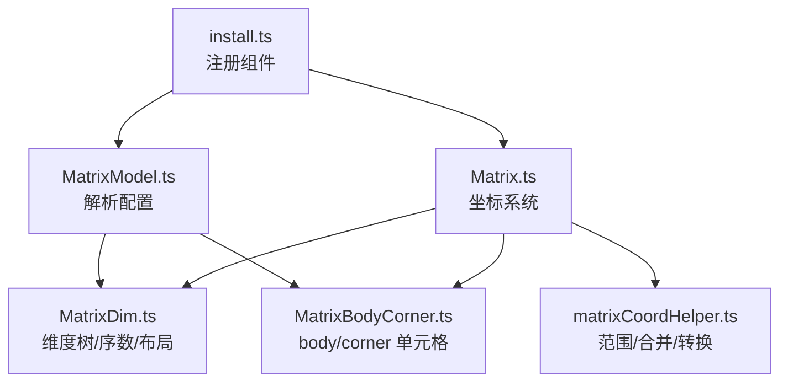
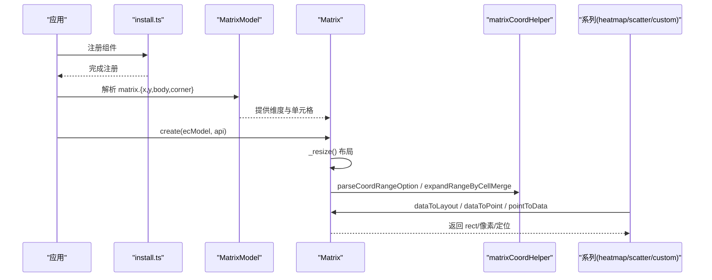
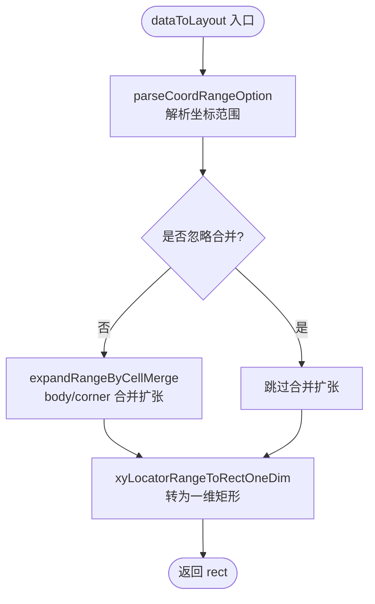
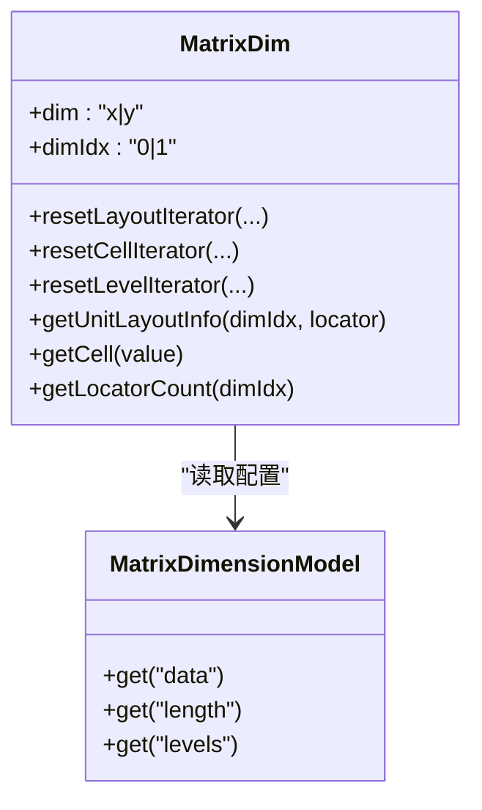
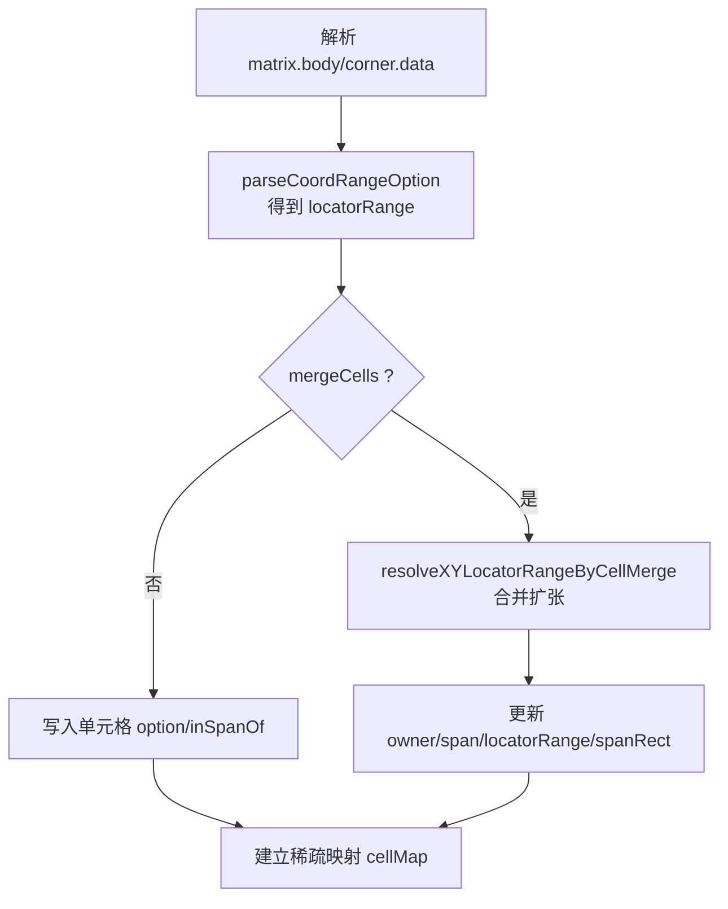
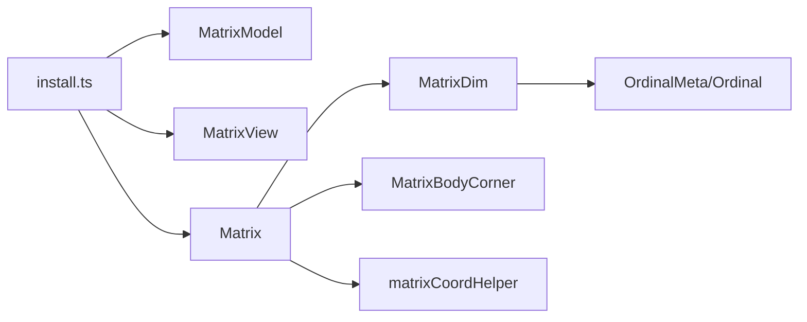

# 矩阵坐标系（Matrix）

<cite>
**本文引用的文件**
- [src/coord/matrix/Matrix.ts](file://src/coord/matrix/Matrix.ts)
- [src/coord/matrix/MatrixModel.ts](file://src/coord/matrix/MatrixModel.ts)
- [src/coord/matrix/MatrixDim.ts](file://src/coord/matrix/MatrixDim.ts)
- [src/coord/matrix/MatrixBodyCorner.ts](file://src/coord/matrix/MatrixBodyCorner.ts)
- [src/coord/matrix/matrixCoordHelper.ts](file://src/coord/matrix/matrixCoordHelper.ts)
- [src/component/matrix/install.ts](file://src/component/matrix/install.ts)
- [test/matrix.html](file://test/matrix.html)
- [test/matrix_application.html](file://test/matrix_application.html)
</cite>

## 目录
1. [简介](#简介)
2. [项目结构](#项目结构)
3. [核心组件](#核心组件)
4. [架构总览](#架构总览)
5. [详细组件分析](#详细组件分析)
6. [依赖关系分析](#依赖关系分析)
7. [性能考量](#性能考量)
8. [故障排查指南](#故障排查指南)
9. [结论](#结论)
10. [附录：使用示例与最佳实践](#附录使用示例与最佳实践)

## 简介
本章节系统性阐述 ECharts 的矩阵坐标系（Matrix），覆盖多维数据的矩阵展示原理、数据结构、维度管理、坐标映射机制，以及表格行列配置、单元格样式、数据绑定方式；并说明热力图、散点图等对矩阵坐标系的支持。同时给出导入导出、动态更新、交互操作的要点，并提供数据分析、相关性矩阵等实际应用场景的完整示例路径。

## 项目结构
矩阵坐标系由“模型-视图-坐标系统”三部分构成，并通过扩展安装机制注册到 ECharts 中：
- 坐标系统实现：Matrix（负责布局、坐标转换、包含判断等）
- 模型层：MatrixModel、MatrixDimensionModel（解析 matrix.x/y/body/corner 配置）
- 维度与单元：MatrixDim（构建层级维度树、序数元信息、布局迭代器）
- 主体与角区：MatrixBodyCorner（body/corner 单元格定义、合并、样式覆盖）
- 辅助工具：matrixCoordHelper（范围解析、合并扩张、坐标转换）
- 安装入口：component/matrix/install.ts（注册 model/view/coordinateSystem）

**图表来源**
- [src/component/matrix/install.ts:20-29](file://src/component/matrix/install.ts#L20-L29)
- [src/coord/matrix/MatrixModel.ts:300-350](file://src/coord/matrix/MatrixModel.ts#L300-L350)
- [src/coord/matrix/MatrixDim.ts:116-172](file://src/coord/matrix/MatrixDim.ts#L116-L172)
- [src/coord/matrix/MatrixBodyCorner.ts:76-97](file://src/coord/matrix/MatrixBodyCorner.ts#L76-L97)
- [src/coord/matrix/Matrix.ts:84-119](file://src/coord/matrix/Matrix.ts#L84-L119)
- [src/coord/matrix/matrixCoordHelper.ts:92-170](file://src/coord/matrix/matrixCoordHelper.ts#L92-L170)

**章节来源**
- [src/component/matrix/install.ts:20-29](file://src/component/matrix/install.ts#L20-L29)
- [src/coord/matrix/Matrix.ts:84-119](file://src/coord/matrix/Matrix.ts#L84-L119)

## 核心组件
- Matrix（坐标系统）
  - 提供 dataToPoint、dataToLayout、pointToData、containPoint、convertTo* 等接口，完成数据与像素/布局之间的双向映射。
  - 支持 body/corner 区域合并后的范围扩张，确保定位结果与视觉一致。
- MatrixModel（模型）
  - 维护 x/y 维度模型、body/corner 单元格集合，提供 getDimensionModel/getBody/getCorner 访问。
  - 默认样式、边框、背景、z-index 等全局设置。
- MatrixDim（维度）
  - 从 matrix.x/y.data 或 series/dataset 收集维度值，构建层级树，维护 ordinalMeta 与 scale。
  - 提供布局迭代器、单元布局查询、序数元信息等能力。
- MatrixBodyCorner（主体/角区）
  - 解析 body/corner.data 中的 coord、mergeCells、clamp 等，生成稀疏单元格映射，处理合并冲突与样式覆盖。
- matrixCoordHelper（辅助）
  - 解析坐标范围、计算合并扩张、将定位范围转换为矩形、创建 NaN 占位矩形等。

**章节来源**
- [src/coord/matrix/Matrix.ts:55-119](file://src/coord/matrix/Matrix.ts#L55-L119)
- [src/coord/matrix/MatrixModel.ts:36-50, 300-350:36-50](file://src/coord/matrix/MatrixModel.ts#L36-L50)
- [src/coord/matrix/MatrixDim.ts:116-172](file://src/coord/matrix/MatrixDim.ts#L116-L172)
- [src/coord/matrix/MatrixBodyCorner.ts:76-97](file://src/coord/matrix/MatrixBodyCorner.ts#L76-L97)
- [src/coord/matrix/matrixCoordHelper.ts:35-55](file://src/coord/matrix/matrixCoordHelper.ts#L35-L55)

## 架构总览
下图展示了矩阵坐标系的装配与调用流程：安装时注册模型、视图与坐标系统；渲染时通过 Matrix.create 构造实例，进行布局与坐标转换；系列（如 heatmap/scatter/custom）通过 coordinateSystem:'matrix' 接入。

**图表来源**
- [src/component/matrix/install.ts:20-29](file://src/component/matrix/install.ts#L20-L29)
- [src/coord/matrix/Matrix.ts:84-119](file://src/coord/matrix/Matrix.ts#L84-L119)
- [src/coord/matrix/matrixCoordHelper.ts:92-170](file://src/coord/matrix/matrixCoordHelper.ts#L92-L170)

## 详细组件分析

### 坐标系统与坐标映射（Matrix）
- 维度声明：支持 x、y、value 三个维度，其中 x/y 为序类型，value 用于数值映射（如 visualMap）。
- 布局流程：_resize 中先按 box 布局获取矩阵矩形，再分别对两个维度执行单元布局、非叶节点补全、body/corner 合并区域布局。
- 坐标转换：
  - dataToLayout：将矩阵坐标（可含范围、非叶节点、负定位符）转为像素矩形；支持 ignoreMergeCells 与 clamp 选项。
  - dataToPoint：返回单元格中心像素。
  - pointToData：将像素点反查为矩阵定位器（支持 body/corner/outside 三种区域判定与 clamp）。
- 包含判断：containPoint 基于矩阵矩形边界。

**图表来源**
- [src/coord/matrix/Matrix.ts:181-230](file://src/coord/matrix/Matrix.ts#L181-L230)
- [src/coord/matrix/matrixCoordHelper.ts:92-170](file://src/coord/matrix/matrixCoordHelper.ts#L92-L170)

**章节来源**
- [src/coord/matrix/Matrix.ts:55-119, 144-230, 250-316:55-119](file://src/coord/matrix/Matrix.ts#L55-L119)
- [src/coord/matrix/matrixCoordHelper.ts:92-170](file://src/coord/matrix/matrixCoordHelper.ts#L92-L170)

### 维度管理与层级树（MatrixDim）
- 维度数据来源：优先使用 matrix.x/y.data；若未指定，可从 dataset/series.data 自动收集。
- 层级结构：支持 children 嵌套形成多级维度；每个叶子对应一个单位单元格，非叶节点也可参与定位。
- 序数元信息：OrdinalMeta + Ordinal 用于 value→ordinal 的解析与去重；保证唯一性并兼容重复文本。
- 布局迭代：resetLayoutIterator/resetCellIterator/resetLevelIterator 提供不同粒度的遍历能力。
- 定位查询：getUnitLayoutInfo 根据 dimIdx 与 locator 返回单元布局；getCell 通过 value 查找维度单元格。

**图表来源**
- [src/coord/matrix/MatrixDim.ts:116-172, 363-439:116-172](file://src/coord/matrix/MatrixDim.ts#L116-L172)
- [src/coord/matrix/MatrixModel.ts:354-359](file://src/coord/matrix/MatrixModel.ts#L354-L359)

**章节来源**
- [src/coord/matrix/MatrixDim.ts:116-172, 301-335, 363-439:116-172](file://src/coord/matrix/MatrixDim.ts#L116-L172)

### 主体与角区单元格（MatrixBodyCorner）
- 稀疏存储：仅当在 matrix.body/corner.data 中显式定义时才存在单元格，节省内存。
- 坐标范围：coord 支持单点或矩形范围；支持 coordClamp 将 null/undefined/NaN 解释为整行/整列。
- 合并策略：mergeCells=true 时，若与其他合并区域相交则合并为更大矩形，并保留首个 owner 的样式优先级。
- 快速路径：当定位到单个单元格且该单元格属于某合并区域时，直接复用其 locatorRange，避免遍历。

**图表来源**
- [src/coord/matrix/MatrixBodyCorner.ts:103-241](file://src/coord/matrix/MatrixBodyCorner.ts#L103-L241)
- [src/coord/matrix/matrixCoordHelper.ts:212-268](file://src/coord/matrix/matrixCoordHelper.ts#L212-L268)

**章节来源**
- [src/coord/matrix/MatrixBodyCorner.ts:76-97, 103-241, 249-285:76-97](file://src/coord/matrix/MatrixBodyCorner.ts#L76-L97)

### 模型与配置（MatrixModel）
- 配置项：
  - matrix.x/y：维度显示开关、数据、层级 size、分隔线样式等。
  - matrix.body/corner：单元格数据、样式、事件触发、silent 控制等。
  - matrix.backgroundStyle、borderZ2、tooltip、triggerEvent 等整体样式与交互。
- 默认值：提供 label、itemStyle、dividerLineStyle、backgroundStyle 等默认样式，保证开箱即用。
- 生命周期：optionUpdated 重建维度模型与 body/corner 实例，确保配置变更即时生效。

**章节来源**
- [src/coord/matrix/MatrixModel.ts:36-50, 158-194, 242-297, 300-350:36-50](file://src/coord/matrix/MatrixModel.ts#L36-L50)

## 依赖关系分析
- install.ts 注册 MatrixModel、MatrixView、CoordinateSystem('matrix')。
- Matrix 依赖 MatrixModel 提供的维度与 body/corner；依赖 matrixCoordHelper 进行范围解析与合并。
- MatrixDim 依赖 OrdinalMeta/Ordinal 做值到序数的映射；提供布局迭代器供 Matrix 使用。
- MatrixBodyCorner 依赖 matrixCoordHelper 进行合并扩张与范围转换。

**图表来源**
- [src/component/matrix/install.ts:20-29](file://src/component/matrix/install.ts#L20-L29)
- [src/coord/matrix/Matrix.ts:84-119](file://src/coord/matrix/Matrix.ts#L84-L119)
- [src/coord/matrix/MatrixDim.ts:282-288](file://src/coord/matrix/MatrixDim.ts#L282-L288)

**章节来源**
- [src/component/matrix/install.ts:20-29](file://src/component/matrix/install.ts#L20-L29)
- [src/coord/matrix/Matrix.ts:84-119](file://src/coord/matrix/Matrix.ts#L84-L119)

## 性能考量
- 稀疏存储：body/corner 仅在定义时创建单元格，降低大数据量下的内存占用。
- 快速路径：pointToData 与 expandRangeByCellMerge 针对单点/已合并区域提供优化分支。
- 布局分配：未指定 size 的单元按剩余空间均分，减少复杂内容度量开销。
- 合并扩张：通过 intersect 检测与增量更新，避免全量扫描。

[本节为通用性能建议，不直接分析具体文件]

## 故障排查指南
- 坐标无效：dataToLayout/pointToData 返回 NaN 表示输入越界或未找到目标；检查 coord 是否合法、是否启用 clamp。
- 合并冲突：多个 mergeCells 重叠时，以首次 owner 为准；必要时调整定义顺序或拆分区域。
- 维度为空：当 matrix.x/y.show=false 或 data 为空时，仍会布局但宽高可能为 0；确认 show 与 length/data 配置。
- 事件穿透：若希望单元格文本不触发事件，设置 silent=true；否则可通过 triggerEvent 开启事件。

**章节来源**
- [src/coord/matrix/matrixCoordHelper.ts:92-170](file://src/coord/matrix/matrixCoordHelper.ts#L92-L170)
- [src/coord/matrix/MatrixBodyCorner.ts:103-241](file://src/coord/matrix/MatrixBodyCorner.ts#L103-L241)
- [src/coord/matrix/MatrixModel.ts:242-297](file://src/coord/matrix/MatrixModel.ts#L242-L297)

## 结论
矩阵坐标系提供了强大的二维分类网格能力，支持层级维度、单元格合并、灵活样式与丰富的坐标转换接口。配合热力图、散点图、自定义系列等，可实现混淆矩阵、相关性矩阵、周期表等多种可视化场景。通过合理的配置与性能优化，可在大规模数据下保持良好体验。

[本节为总结，不直接分析具体文件]

## 附录：使用示例与最佳实践

### 基本用法与热力图
- 示例：在 matrix 中定义 x/y 维度，使用 heatmap 系列并以 coordinateSystem:'matrix' 绑定数据。
- 关键点：visualMap 的 dimension=2 映射到 value；label 可显示数值；支持合并单元格。

参考路径
- [test/matrix.html:62-125](file://test/matrix.html#L62-L125)
- [test/matrix.html:199-236](file://test/matrix.html#L199-L236)

**章节来源**
- [test/matrix.html:62-125](file://test/matrix.html#L62-L125)
- [test/matrix.html:199-236](file://test/matrix.html#L199-L236)

### 无头矩阵与 dataset 驱动
- 示例：隐藏 x/y 头部，直接从 dataset 推断维度；适合简洁展示。
- 关键点：matrix.x/y.show=false；dataset.source 提供数据。

参考路径
- [test/matrix.html:135-180](file://test/matrix.html#L135-L180)
- [test/matrix.html:199-236](file://test/matrix.html#L199-L236)

**章节来源**
- [test/matrix.html:135-180](file://test/matrix.html#L135-L180)
- [test/matrix.html:199-236](file://test/matrix.html#L199-L236)

### 多系列与自定义渲染
- 示例：在同一矩阵上叠加多个 custom 系列，利用 api.layout([x,y]).rect 绘制条形/文本等。
- 关键点：encode 指定 x/y/value；renderItem 中计算 bar width/height。

参考路径
- [test/matrix.html:535-620](file://test/matrix.html#L535-L620)

**章节来源**
- [test/matrix.html:535-620](file://test/matrix.html#L535-L620)

### 长度模式与序数索引
- 示例：使用 matrix.x/y.length 指定行列数量；series.data 可使用序数索引而非字符串。
- 关键点：适用于模板化矩阵（如 N×M 网格）。

参考路径
- [test/matrix.html:675-706](file://test/matrix.html#L675-L706)
- [test/matrix.html:633-664](file://test/matrix.html#L633-L664)

**章节来源**
- [test/matrix.html:675-706](file://test/matrix.html#L675-L706)
- [test/matrix.html:633-664](file://test/matrix.html#L633-L664)

### 事件与交互
- 示例：开启 triggerEvent，监听 click 事件，输出 coord/name/targetType 等。
- 关键点：通过 matrix.body.silent 与 label.silent 控制事件穿透。

参考路径
- [test/matrix.html:717-800](file://test/matrix.html#L717-L800)

**章节来源**
- [test/matrix.html:717-800](file://test/matrix.html#L717-L800)

### 混淆矩阵（Confusion Matrix）
- 示例：自定义 renderItem 绘制矩形并按类别着色，标注 True/False 与预测类。
- 关键点：graphic 添加标题；custom 系列基于 matrix 坐标定位。

参考路径
- [test/matrix_application.html:54-153](file://test/matrix_application.html#L54-L153)

**章节来源**
- [test/matrix_application.html:54-153](file://test/matrix_application.html#L54-L153)

### 相关性矩阵（Correlation Matrix）
- 示例：使用 heatmap 或 scatter 展示变量间的相关系数；visualMap 映射颜色/大小。
- 关键点：生成对称数据；可选只显示下三角。

参考路径
- [test/matrix_application.html:162-245](file://test/matrix_application.html#L162-L245)
- [test/matrix_application.html:372-453](file://test/matrix_application.html#L372-L453)

**章节来源**
- [test/matrix_application.html:162-245](file://test/matrix_application.html#L162-L245)
- [test/matrix_application.html:372-453](file://test/matrix_application.html#L372-L453)

### 协方差矩阵与周期表
- 示例：协方差矩阵使用 heatmap；周期表使用 custom 系列按元素属性着色与排版。
- 关键点：合理设置 matrix 尺寸与边距；使用 rich text 与样式组合提升可读性。

参考路径
- [test/matrix_application.html:459-571](file://test/matrix_application.html#L459-L571)
- [test/matrix_application.html:578-799](file://test/matrix_application.html#L578-L799)

**章节来源**
- [test/matrix_application.html:459-571](file://test/matrix_application.html#L459-L571)
- [test/matrix_application.html:578-799](file://test/matrix_application.html#L578-L799)

### MBTI 相关性矩阵
- 示例：按 MBTI 分组构建层级维度，展示类型间相似度热力图。
- 关键点：层级维度 children 组织分组；visualMap 映射相似度。

参考路径
- [test/matrix-mbti.html:63-200](file://test/matrix-mbti.html#L63-L200)

**章节来源**
- [test/matrix-mbti.html:63-200](file://test/matrix-mbti.html#L63-L200)

### 导入导出与动态更新
- 导入：通过 setOption 替换 matrix.x/y.data 或 series.data，或使用 appendData 追加新数据。
- 导出：使用内置导出 API（保存图片/矢量图），矩阵作为坐标系统的一部分会被正确导出。
- 动态更新：频繁更新时建议批量 setOption，减少重绘次数；对大矩阵可使用采样或过滤预处理。

[本节为通用指导，不直接分析具体文件]

### 最佳实践
- 明确维度层级：尽量用 children 组织维度，便于定位与标签展示。
- 合理使用合并：mergeCells 用于强调区块，注意避免过度合并导致信息丢失。
- 控制样式复杂度：过多 itemStyle 会导致渲染压力，优先使用 visualMap。
- 事件与无障碍：按需开启 triggerEvent；结合 tooltip/aria 提升可访问性。

[本节为通用指导，不直接分析具体文件]