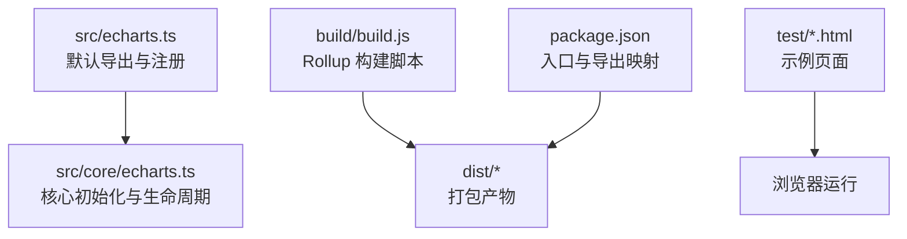
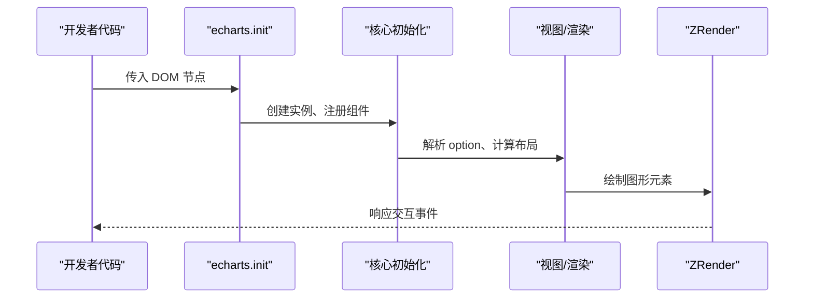
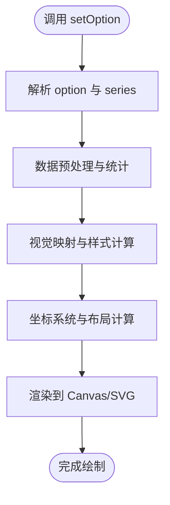
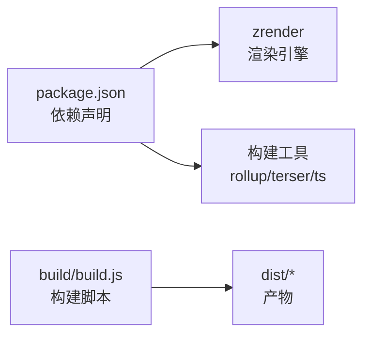

# 快速开始

<cite>
**本文引用的文件**
- [README.md](file://README.md)
- [package.json](file://package.json)
- [src/echarts.ts](file://src/echarts.ts)
- [src/core/echarts.ts](file://src/core/echarts.ts)
- [build/build.js](file://build/build.js)
- [test/bar.html](file://test/bar.html)
- [test/line.html](file://test/line.html)
- [test/pie.html](file://test/pie.html)
- [test/browser-esm.html](file://test/browser-esm.html)
</cite>

## 目录
1. [简介](#简介)
2. [项目结构](#项目结构)
3. [核心组件](#核心组件)
4. [架构总览](#架构总览)
5. [详细组件分析](#详细组件分析)
6. [依赖关系分析](#依赖关系分析)
7. [性能注意事项](#性能注意事项)
8. [故障排查指南](#故障排查指南)
9. [结论](#结论)
10. [附录](#附录)

## 简介
本指南面向希望快速上手 ECharts 的开发者，覆盖三种安装方式（CDN、npm/yarn、源码构建），并提供可直接运行的 HTML 示例，演示如何初始化图表实例、设置基本配置、绑定数据与渲染图表。同时解释 ECharts 的核心概念：图表实例生命周期、option 配置对象结构、series 系列与 data 的关系，并给出调试技巧与常见问题解决方案。

## 项目结构
仓库采用模块化组织，核心入口在 src 目录，构建脚本位于 build 目录，丰富的示例位于 test 目录。通过 package.json 暴露多种产物格式（UMD、ESM、CommonJS）以及按需引入的模块路径，便于在不同环境中集成。

图示来源
- [src/echarts.ts:20-46](file://src/echarts.ts#L20-L46)
- [src/core/echarts.ts:1-150](file://src/core/echarts.ts#L1-L150)
- [build/build.js:30-140](file://build/build.js#L30-L140)
- [package.json:17-21](file://package.json#L17-L21)

章节来源
- [README.md:15-58](file://README.md#L15-L58)
- [package.json:17-21](file://package.json#L17-L21)
- [build/build.js:30-140](file://build/build.js#L30-L140)

## 核心组件
- 入口与默认行为
  - 默认启用 Canvas 渲染器与 dataset 组件，简化使用成本。
  - 提供 init 方法用于创建图表实例。
- 核心初始化
  - 负责实例化、生命周期管理、调度器、主题、国际化等。
- 构建系统
  - 支持多类型构建（all/common/simple）、压缩、ESM/CJS/UMD 输出。

章节来源
- [src/echarts.ts:20-46](file://src/echarts.ts#L20-L46)
- [src/core/echarts.ts:1-150](file://src/core/echarts.ts#L1-L150)
- [build/build.js:30-140](file://build/build.js#L30-L140)

## 架构总览
ECharts 在浏览器中的典型调用流程如下：

图示来源
- [src/echarts.ts:20-46](file://src/echarts.ts#L20-L46)
- [src/core/echarts.ts:1-150](file://src/core/echarts.ts#L1-L150)

## 详细组件分析

### 安装方式与最小可用示例

- 通过 CDN 引入
  - 使用 UMD 或 ESM 形式的 dist 包，在浏览器中直接引入。
  - 参考示例：在浏览器中使用 ESM 导入并初始化图表。
  - 参考文件
    - [test/browser-esm.html:59-103](file://test/browser-esm.html#L59-L103)

- 使用 npm/yarn 安装
  - 通过包管理器安装后，可在项目中以 ESModule/CommonJS 形式引入。
  - 参考文件
    - [package.json:17-21](file://package.json#L17-L21)

- 从源码构建
  - 安装依赖后，执行构建命令生成 dist 产物；开发模式可监听变更并打开测试页。
  - 参考文件
    - [README.md:36-58](file://README.md#L36-L58)
    - [build/build.js:30-140](file://build/build.js#L30-L140)

- 完整 HTML 页面示例（可直接运行）
  - 柱状图：包含容器、初始化、setOption、resize 绑定。
    - 参考文件
      - [test/bar.html:47-263](file://test/bar.html#L47-L263)
  - 折线图：展示坐标轴、图例、提示框、缩放等基础能力。
    - 参考文件
      - [test/line.html:41-249](file://test/line.html#L41-L249)
  - 饼图：展示标签、选中、富文本等特性。
    - 参考文件
      - [test/pie.html:40-309](file://test/pie.html#L40-L309)

章节来源
- [test/browser-esm.html:59-103](file://test/browser-esm.html#L59-L103)
- [package.json:17-21](file://package.json#L17-L21)
- [README.md:36-58](file://README.md#L36-L58)
- [build/build.js:30-140](file://build/build.js#L30-L140)
- [test/bar.html:47-263](file://test/bar.html#L47-L263)
- [test/line.html:41-249](file://test/line.html#L41-L249)
- [test/pie.html:40-309](file://test/pie.html#L40-L309)

### 核心概念：实例生命周期、option 结构与 series/data 关系

- 图表实例生命周期
  - 初始化：通过 echarts.init 创建实例，内部完成组件注册、渲染器选择、默认主题与语言等。
  - 更新：通过 setOption 合并配置，触发数据预处理、视觉映射、布局与渲染。
  - 销毁：释放资源与事件监听（示例中未显式调用，但生命周期由核心管理）。
  - 参考文件
    - [src/core/echarts.ts:1-150](file://src/core/echarts.ts#L1-L150)

- option 配置对象结构
  - 顶层字段包括 title、legend、tooltip、grid、xAxis、yAxis、series 等。
  - 常用组件：
    - xAxis/yAxis：定义坐标轴、刻度、标签、网格线等。
    - legend：图例，控制系列显示与交互。
    - tooltip：提示框，展示数据详情。
    - toolbox：工具箱，提供导出、缩放等功能。
  - 参考文件
    - [test/bar.html:92-242](file://test/bar.html#L92-L242)
    - [test/line.html:95-246](file://test/line.html#L95-L246)
    - [test/pie.html:65-270](file://test/pie.html#L65-L270)

- series 系列与 data 的关系
  - series 数组描述多个数据系列，每个系列指定 type（如 bar/line/pie）与 data。
  - data 可为一维数值数组或对象数组，支持 name/value/selected 等属性。
  - 参考文件
    - [test/bar.html:211-241](file://test/bar.html#L211-L241)
    - [test/line.html:167-246](file://test/line.html#L167-L246)
    - [test/pie.html:104-268](file://test/pie.html#L104-L268)

图示来源
- [src/core/echarts.ts:1-150](file://src/core/echarts.ts#L1-L150)

章节来源
- [src/core/echarts.ts:1-150](file://src/core/echarts.ts#L1-L150)
- [test/bar.html:92-242](file://test/bar.html#L92-L242)
- [test/line.html:95-246](file://test/line.html#L95-L246)
- [test/pie.html:65-270](file://test/pie.html#L65-L270)

### 常见图表类型示例要点

- 柱状图
  - 关键点：xAxis.data、yAxis 反转、stack 堆叠、itemStyle 高亮样式、toolbox 功能。
  - 参考文件
    - [test/bar.html:165-241](file://test/bar.html#L165-L241)

- 折线图
  - 关键点：symbol 自定义、step 阶梯线、dataZoom 缩放、tooltip 轴触发。
  - 参考文件
    - [test/line.html:115-246](file://test/line.html#L115-L246)

- 饼图
  - 关键点：label 位置与富文本、selectedMode、radius 环形图、动画控制。
  - 参考文件
    - [test/pie.html:65-270](file://test/pie.html#L65-L270)

章节来源
- [test/bar.html:165-241](file://test/bar.html#L165-L241)
- [test/line.html:115-246](file://test/line.html#L115-L246)
- [test/pie.html:65-270](file://test/pie.html#L65-L270)

## 依赖关系分析
- 运行时依赖
  - zrender：底层渲染引擎，负责图形绘制与事件系统。
  - 参考文件
    - [package.json:75-78](file://package.json#L75-L78)
- 构建依赖
  - rollup、terser、typescript 等用于打包与压缩。
  - 参考文件
    - [package.json:79-118](file://package.json#L79-L118)

图示来源
- [package.json:75-118](file://package.json#L75-L118)
- [build/build.js:30-140](file://build/build.js#L30-L140)

章节来源
- [package.json:75-118](file://package.json#L75-L118)
- [build/build.js:30-140](file://build/build.js#L30-L140)

## 性能注意事项
- 大数据量场景
  - 使用采样、过滤、虚拟滚动等策略减少渲染压力。
  - 合理设置 animation 与 visualMap，避免不必要的重绘。
- 交互优化
  - 将 resize 绑定到窗口事件，确保自适应布局。
  - 合理使用 dataZoom 提升大数据浏览体验。
- 构建优化
  - 按需引入 chart/component/renderer，减小包体积。
  - 生产环境启用压缩与 tree-shaking。

[本节为通用指导，不直接分析具体文件]

## 故障排查指南
- 图表不显示
  - 检查容器是否有宽高；确保 DOM 已就绪再初始化。
  - 确认正确引入 ECharts 包（CDN/ESM/UMD）。
  - 参考文件
    - [test/browser-esm.html:59-103](file://test/browser-esm.html#L59-L103)
- 数据不更新
  - 使用 setOption 合并配置而非替换整个 option。
  - 检查 series.data 格式是否符合当前 series.type。
  - 参考文件
    - [test/bar.html:92-242](file://test/bar.html#L92-L242)
    - [test/line.html:95-246](file://test/line.html#L95-L246)
- 交互无响应
  - 确认事件绑定与 preventDefault 的使用。
  - 检查 tooltip/legend/toolbox 是否被遮挡或禁用。
  - 参考文件
    - [test/pie.html:65-270](file://test/pie.html#L65-L270)

章节来源
- [test/browser-esm.html:59-103](file://test/browser-esm.html#L59-L103)
- [test/bar.html:92-242](file://test/bar.html#L92-L242)
- [test/line.html:95-246](file://test/line.html#L95-L246)
- [test/pie.html:65-270](file://test/pie.html#L65-L270)

## 结论
通过本指南，你可以快速完成 ECharts 的安装与集成，理解实例生命周期与 option 结构，掌握 series 与 data 的关系，并使用提供的示例页面快速验证不同图表类型的效果。结合构建与调试建议，能够在实际项目中高效落地可视化需求。

## 附录
- 官方文档与示例入口
  - 获取与帮助、文档、API、选项手册、示例链接。
  - 参考文件
    - [README.md:15-35](file://README.md#L15-L35)

章节来源
- [README.md:15-35](file://README.md#L15-L35)