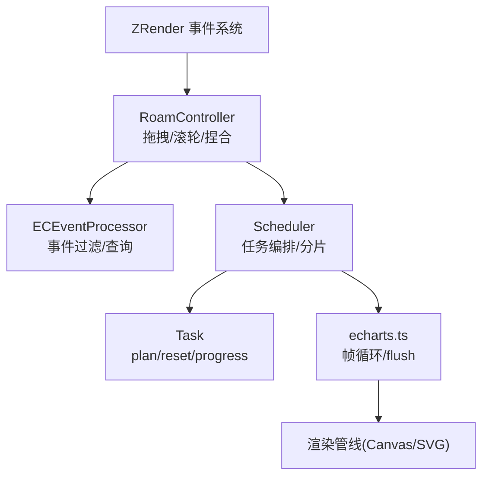
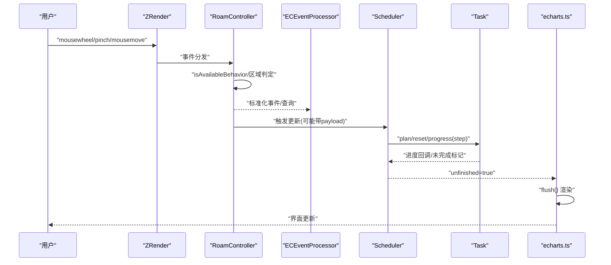
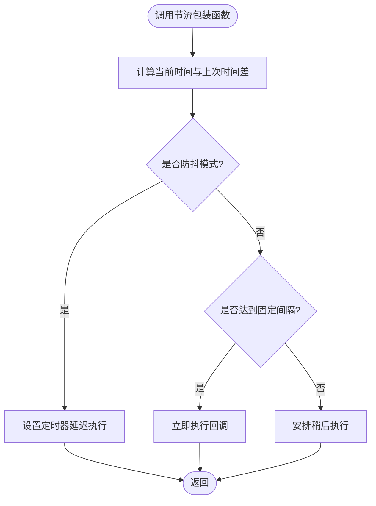
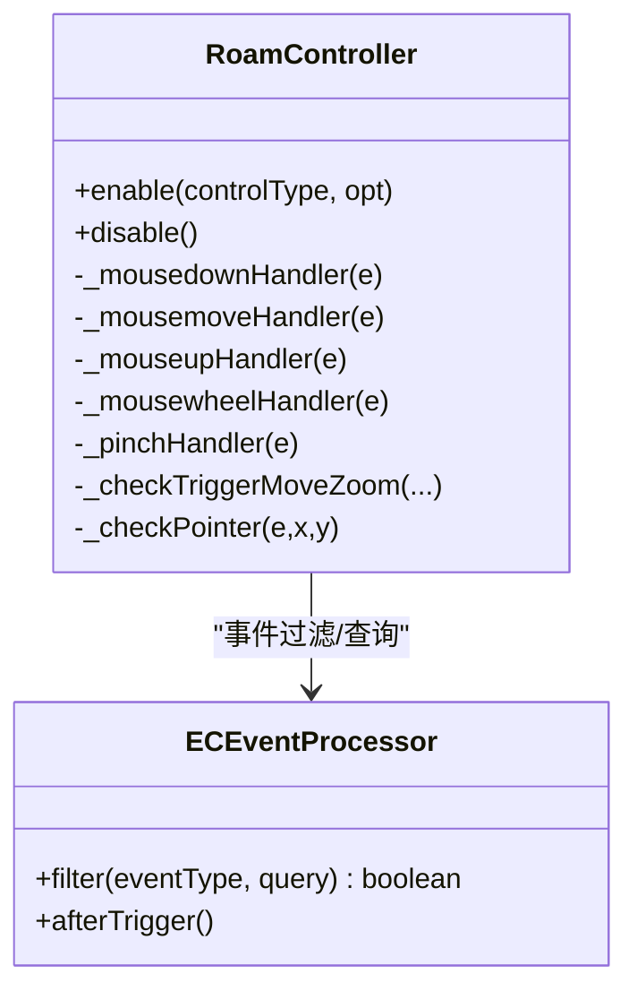
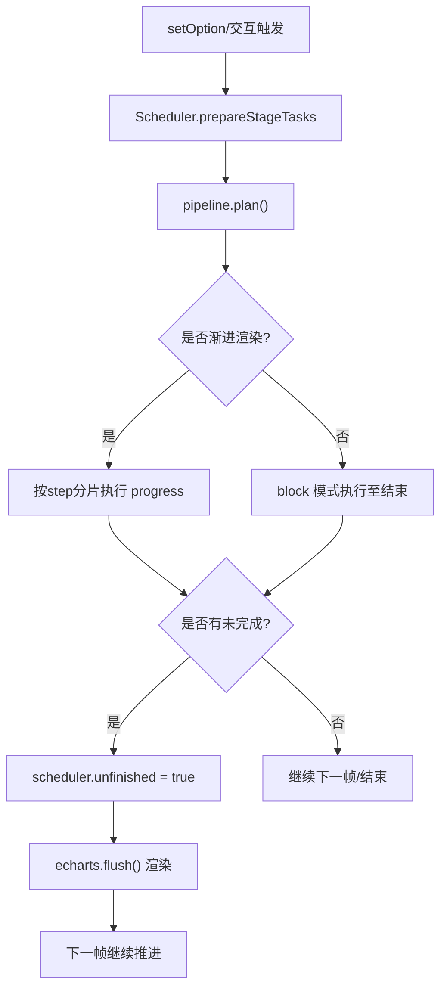
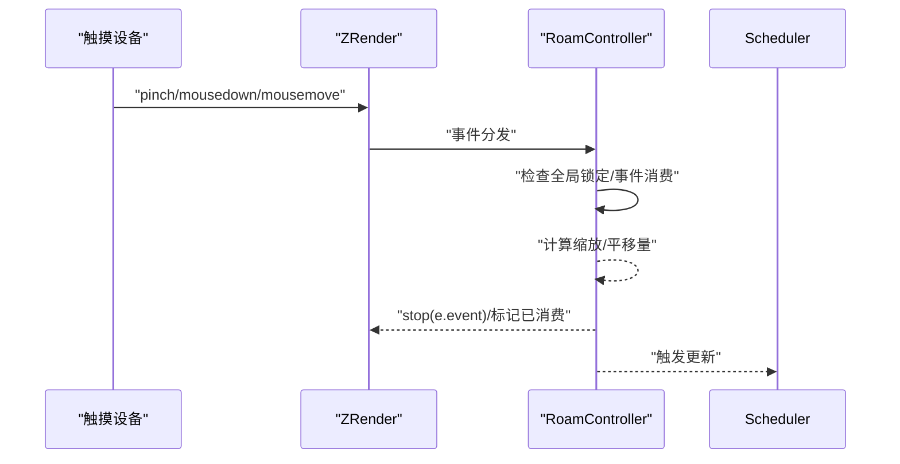
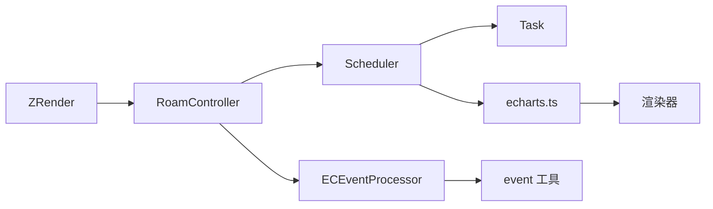

# 交互优化

<cite>
**本文引用的文件**
- [throttle.ts](file://src/util/throttle.ts)
- [RoamController.ts](file://src/component/helper/RoarController.ts)
- [Scheduler.ts](file://src/core/Scheduler.ts)
- [task.ts](file://src/core/task.ts)
- [echarts.ts](file://src/core/echarts.ts)
- [event.ts](file://src/util/event.ts)
- [ECEventProcessor.ts](file://src/util/ECEventProcessor.ts)
- [ActionPlayback.js](file://test/runTest/runtime/ActionPlayback.js)
- [timeline.js](file://test/runTest/runtime/timeline.js)
</cite>

## 目录
1. [简介](#简介)
2. [项目结构](#项目结构)
3. [核心组件](#核心组件)
4. [架构总览](#架构总览)
5. [详细组件分析](#详细组件分析)
6. [依赖关系分析](#依赖关系分析)
7. [性能考量](#性能考量)
8. [故障排查指南](#故障排查指南)
9. [结论](#结论)
10. [附录](#附录)

## 简介
本文件聚焦 ECharts 在交互场景下的性能优化与用户体验提升策略，围绕以下主题展开：
- 事件节流与防抖：对高频输入（鼠标移动、滚轮缩放）进行速率控制，避免频繁重绘与计算。
- 事件委托与冒泡优化：统一监听与优先级管理，减少处理器数量并降低冲突。
- 异步更新机制：将耗时计算拆分到帧内逐步执行，保持界面响应性。
- 触摸设备优化：多点触控手势识别与缩放平移处理。
- 交互性能监控与最佳实践：常见卡顿问题定位与解决方案。

## 项目结构
ECharts 的交互性能由“事件层—控制器—调度器—渲染管线”协同完成：
- 事件层：ZRender 事件分发与过滤（如 ECEventProcessor），以及工具函数（如 findEventDispatcher）。
- 控制器：统一的漫游控制器 RoamController，集中处理拖拽、滚轮缩放、捏合缩放等。
- 调度器：Scheduler 与 Task 体系，负责数据预处理、视觉计算、渐进式渲染与任务分片。
- 运行时：echarts.ts 驱动每帧流程，结合 Scheduler 推进任务与 flush 渲染。

**图示来源**
- [RoamController.ts:144-220](file://src/component/helper/RoarController.ts#L144-L220)
- [ECEventProcessor.ts:107-151](file://src/util/ECEventProcessor.ts#L107-L151)
- [Scheduler.ts:292-376](file://src/core/Scheduler.ts#L292-L376)
- [task.ts:149-189](file://src/core/task.ts#L149-L189)
- [echarts.ts:645-677](file://src/core/echarts.ts#L645-L677)

**章节来源**
- [RoamController.ts:144-220](file://src/component/helper/RoarController.ts#L144-L220)
- [Scheduler.ts:292-376](file://src/core/Scheduler.ts#L292-L376)
- [task.ts:149-189](file://src/core/task.ts#L149-L189)
- [echarts.ts:645-677](file://src/core/echarts.ts#L645-L677)

## 核心组件
- 事件节流/防抖工具 throttle：提供固定速率执行与防抖模式，支持动态切换下一次调用是否防抖，并提供 clear 清理定时器。
- 漫游控制器 RoamController：统一管理拖拽、滚轮缩放、捏合缩放；按 z/zlevel/z2 排序监听器，保证层级优先级；通过 isAvailableBehavior 判断行为开关（如 ctrl/shift/alt）。
- 调度器 Scheduler：构建 pipeline，支持 progressive/incremental 渲染，按 step 分片执行，避免单帧过载。
- 任务 Task：每个阶段包含 plan/reset/count/progress，支持阻塞与非阻塞执行，配合 modBy/modDataCount 实现均匀分布渲染。
- 事件处理器 ECEventProcessor：标准化事件查询与过滤，支持组件级与数据级条件匹配，减少无效回调。
- 工具 event.findEventDispatcher：沿宿主链查找目标元素，辅助事件委托。

**章节来源**
- [throttle.ts:42-118](file://src/util/throttle.ts#L42-L118)
- [RoamController.ts:230-443](file://src/component/helper/RoarController.ts#L230-L443)
- [Scheduler.ts:219-376](file://src/core/Scheduler.ts#L219-L376)
- [task.ts:149-189](file://src/core/task.ts#L149-L189)
- [ECEventProcessor.ts:107-151](file://src/util/ECEventProcessor.ts#L107-L151)
- [event.ts:22-39](file://src/util/event.ts#L22-L39)

## 架构总览
下图展示一次高频交互（如滚轮缩放）从事件到渲染的完整链路，体现节流、事件委托、调度分片与渐进渲染的配合。

**图示来源**
- [RoamController.ts:366-443](file://src/component/helper/RoarController.ts#L366-L443)
- [ECEventProcessor.ts:107-151](file://src/util/ECEventProcessor.ts#L107-L151)
- [Scheduler.ts:292-376](file://src/core/Scheduler.ts#L292-L376)
- [task.ts:149-189](file://src/core/task.ts#L149-L189)
- [echarts.ts:645-677](file://src/core/echarts.ts#L645-L677)

## 详细组件分析

### 事件节流与防抖（throttle）
- 固定速率执行：当调用间隔小于阈值时，按固定节奏执行，确保命令顺序不被打乱，适合滚动缩放时的“scale rate”计算。
- 防抖模式：短时间内多次调用仅最后一次生效，适合结束态更新。
- 动态切换：支持 debounceNextCall 临时开启下一次调用的防抖。
- 资源清理：clear 方法清除定时器，避免内存泄漏。

**图示来源**
- [throttle.ts:42-118](file://src/util/throttle.ts#L42-L118)

**章节来源**
- [throttle.ts:42-118](file://src/util/throttle.ts#L42-L118)

### 事件委托与冒泡优化（RoamController + ECEventProcessor）
- 统一监听：RoamController 通过 ensureUniformListener 为每种事件类型注册单一监听器，内部维护按 z/zlevel/z2 排序的监听列表，解决多个控制器重叠时的优先级问题。
- 区域判定：_checkPointer 结合 isInSelf/isInClip 与 onIrrelevantElement，避免无关元素触发漫游。
- 行为开关：isAvailableBehavior 支持 true/false 或修饰键（ctrl/shift/alt）组合，灵活启用/禁用行为。
- 事件过滤：ECEventProcessor.filter 基于组件与数据维度进行精确匹配，减少无效回调。

**图示来源**
- [RoamController.ts:144-220](file://src/component/helper/RoarController.ts#L144-L220)
- [RoamController.ts:230-443](file://src/component/helper/RoarController.ts#L230-L443)
- [ECEventProcessor.ts:107-151](file://src/util/ECEventProcessor.ts#L107-L151)

**章节来源**
- [RoamController.ts:230-443](file://src/component/helper/RoarController.ts#L230-L443)
- [ECEventProcessor.ts:107-151](file://src/util/ECEventProcessor.ts#L107-L151)

### 异步更新机制（Scheduler + Task）
- 流水线 Pipeline：每个 series 对应一个 pipeline，包含 head/tail、threshold、step、count 等参数，支持 progressiveEnabled 与 blockIndex。
- 分片执行：getPerformArgs 根据 progressiveEnabled 与上下文决定是否使用 step 分片；modBy/modDataCount 使渲染元素均匀分布，避免首帧卡顿。
- 阶段任务：prepareStageTasks 创建 series/overall 阶段任务，performSeriesTasks/performDataProcessorTasks/performVisualTasks 分别推进数据与视觉阶段。
- 帧循环：echarts.ts 在每帧中调用 scheduler.performSeriesTasks，并在必要时 flush 渲染，避免一次性阻塞。

**图示来源**
- [Scheduler.ts:219-376](file://src/core/Scheduler.ts#L219-L376)
- [task.ts:149-189](file://src/core/task.ts#L149-L189)
- [echarts.ts:645-677](file://src/core/echarts.ts#L645-L677)

**章节来源**
- [Scheduler.ts:219-376](file://src/core/Scheduler.ts#L219-L376)
- [task.ts:149-189](file://src/core/task.ts#L149-L189)
- [echarts.ts:645-677](file://src/core/echarts.ts#L645-L677)

### 触摸设备优化（pinch/pan）
- 捏合缩放：_pinchHandler 接收 pinchScale、pinchX/Y，转换为缩放因子并触发 zoom。
- 拖拽平移：_mousedown/_mousemove/_mouseup 组合实现 pan，支持 preventDefaultMouseMove 阻止默认滚动。
- 行为开关：zoomOnMouseWheel/moveOnMouseMove/moveOnMouseWheel 可配置为布尔或修饰键组合，适配不同交互习惯。
- 多点触控：通过 ZRender 的 gestureEvent 与 pinch 事件区分手势，避免与鼠标事件冲突。

**图示来源**
- [RoamController.ts:280-443](file://src/component/helper/RoarController.ts#L280-L443)

**章节来源**
- [RoamController.ts:280-443](file://src/component/helper/RoarController.ts#L280-L443)

### 事件委托工具（findEventDispatcher）
- 沿宿主链向上查找具备特定条件的元素，支持返回首个匹配或全部匹配，便于事件委托与命中测试。

**章节来源**
- [event.ts:22-39](file://src/util/event.ts#L22-L39)

## 依赖关系分析
- RoamController 依赖 ZRender 的事件系统与 interactionMutex，用于统一事件分发与互斥控制。
- Scheduler 依赖 Task 与系列模型，构建 pipeline 并协调各阶段任务。
- echarts.ts 作为运行时中枢，协调 Scheduler 与渲染器，确保每帧稳定推进。
- ECEventProcessor 与 event 工具为上层交互提供事件过滤与委托能力。

**图示来源**
- [RoamController.ts:144-220](file://src/component/helper/RoarController.ts#L144-L220)
- [Scheduler.ts:292-376](file://src/core/Scheduler.ts#L292-L376)
- [task.ts:149-189](file://src/core/task.ts#L149-L189)
- [echarts.ts:645-677](file://src/core/echarts.ts#L645-L677)
- [ECEventProcessor.ts:107-151](file://src/util/ECEventProcessor.ts#L107-L151)
- [event.ts:22-39](file://src/util/event.ts#L22-L39)

**章节来源**
- [RoamController.ts:144-220](file://src/component/helper/RoarController.ts#L144-L220)
- [Scheduler.ts:292-376](file://src/core/Scheduler.ts#L292-L376)
- [task.ts:149-189](file://src/core/task.ts#L149-L189)
- [echarts.ts:645-677](file://src/core/echarts.ts#L645-L677)
- [ECEventProcessor.ts:107-151](file://src/util/ECEventProcessor.ts#L107-L151)
- [event.ts:22-39](file://src/util/event.ts#L22-L39)

## 性能考量
- 高频输入控制：使用 throttle 固定速率执行，避免每帧重复计算；在滚轮缩放时优先采用 fixRate 模式保证顺序与稳定性。
- 事件优先级：RoamController 按 z/zlevel/z2 排序监听器，避免多层控制器冲突；通过 isAvailableBehavior 精细控制行为开关。
- 渐进渲染：Scheduler 的 progressiveEnabled 与 step 分片，使大数据集在交互过程中也能流畅更新；modBy/modDataCount 让渲染元素均匀分布。
- 帧级调度：echarts.ts 在每帧中推进任务并 flush，避免一次性阻塞主线程；unfinished 标志确保多帧持续更新。
- 触摸优化：pinch/pan 事件与鼠标事件分离，防止冲突；preventDefaultMouseMove 避免页面滚动干扰。

[本节为通用性能指导，不直接分析具体文件]

## 故障排查指南
- 交互无响应：检查 RoamController 的 enable/disable 是否正确；确认 isAvailableBehavior 配置与修饰键状态；查看事件是否被 eventConsumed 标记。
- 缩放异常：核对 mousewheel 的 wheelDelta 与平台差异；确认 _checkTriggerMoveZoom 中的 originX/Y 传递正确。
- 卡顿严重：评估 Scheduler 的 progressiveEnabled 与 step 设置；检查 task 的 plan/reset/progress 是否过于繁重；考虑增大 step 或拆分逻辑。
- 测试回放问题：ActionPlayback 与 timeline 模拟 setTimeout/setInterval/raf，若出现状态不一致，需检查 mousedown/mouseup 配对与 timeline 暂停/恢复时机。

**章节来源**
- [RoamController.ts:366-443](file://src/component/helper/RoarController.ts#L366-L443)
- [Scheduler.ts:292-376](file://src/core/Scheduler.ts#L292-L376)
- [ActionPlayback.js:122-194](file://test/runTest/runtime/ActionPlayback.js#L122-L194)
- [timeline.js:77-154](file://test/runTest/runtime/timeline.js#L77-L154)

## 结论
ECharts 通过“事件层—控制器—调度器—渲染管线”的协作，实现了高频率交互下的稳定与流畅。节流/防抖保障输入速率，事件委托与优先级管理减少冲突，调度器的分片与渐进渲染避免主线程阻塞，触摸手势与行为开关提升多端体验。结合测试回放与帧级调度，可有效定位与解决常见卡顿问题。

[本节为总结性内容，不直接分析具体文件]

## 附录
- 常用配置建议：
  - 滚轮缩放：zoomOnMouseWheel 设为 true 或修饰键组合；合理设置 wheelDelta 到 scale 的映射。
  - 拖拽平移：moveOnMouseMove 与 moveOnMouseWheel 按需启用；preventDefaultMouseMove 避免页面滚动。
  - 渐进渲染：根据数据规模调整 progressive 与 threshold；必要时增大 step。
- 调试技巧：
  - 使用 ActionPlayback 回放交互，检查 mousedown/mouseup 配对与 timeline 同步。
  - 观察 Scheduler.unfinished 与 task.progress 回调，定位阻塞点。

[本节为补充信息，不直接分析具体文件]