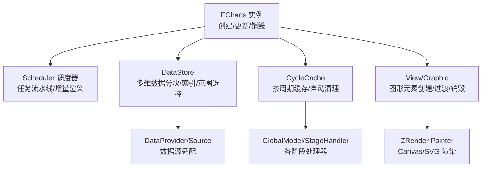
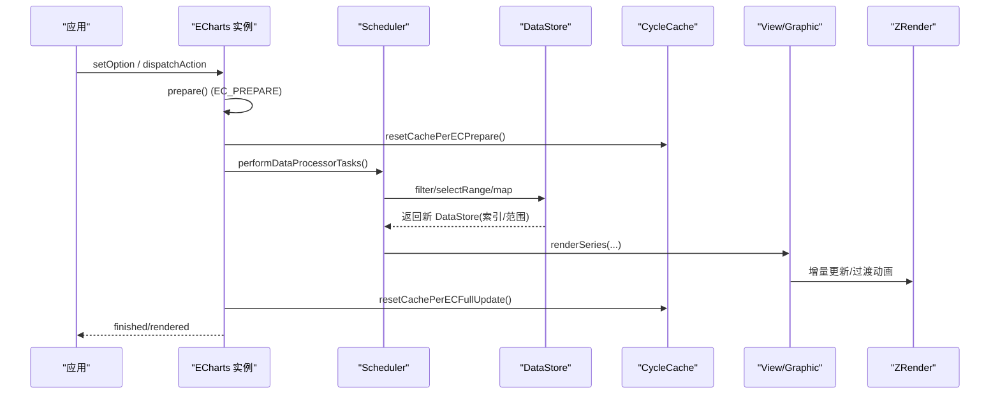
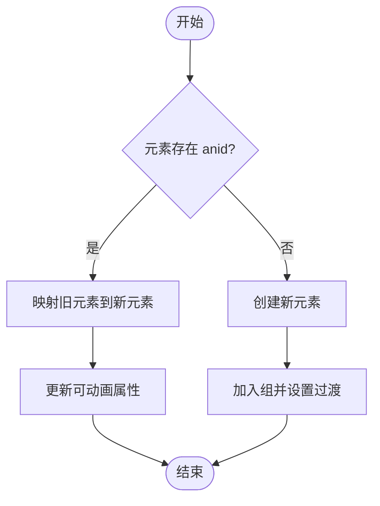
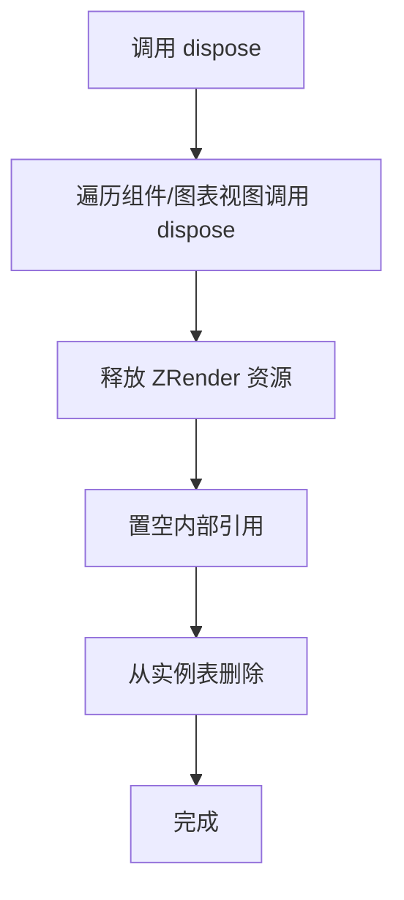
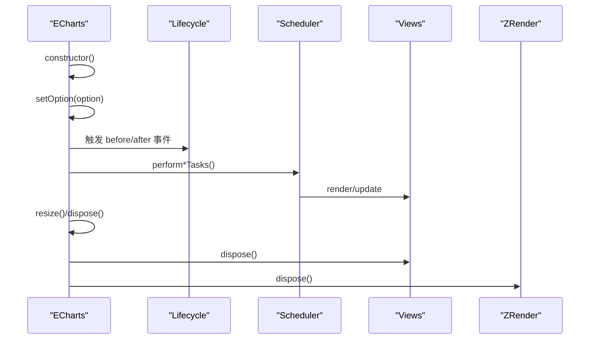
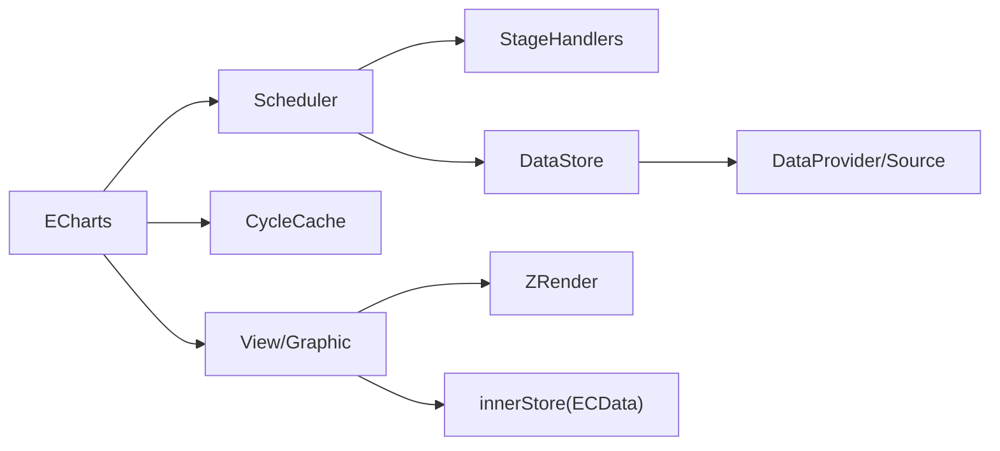

# 内存管理

<cite>
**本文引用的文件**
- [src/core/echarts.ts](file://src/core/echarts.ts)
- [src/core/lifecycle.ts](file://src/core/lifecycle.ts)
- [src/core/Scheduler.ts](file://src/core/Scheduler.ts)
- [src/data/DataStore.ts](file://src/data/DataStore.ts)
- [src/util/cycleCache.ts](file://src/util/cycleCache.ts)
- [src/util/innerStore.ts](file://src/util/innerStore.ts)
- [src/util/graphic.ts](file://src/util/graphic.ts)
- [src/view/Component.ts](file://src/view/Component.ts)
</cite>

## 目录
1. [简介](#简介)
2. [项目结构](#项目结构)
3. [核心组件](#核心组件)
4. [架构总览](#架构总览)
5. [详细组件分析](#详细组件分析)
6. [依赖关系分析](#依赖关系分析)
7. [性能考量](#性能考量)
8. [故障排查指南](#故障排查指南)
9. [结论](#结论)
10. [附录](#附录)

## 简介
本文聚焦 ECharts 的内存管理机制与优化策略，围绕以下主题展开：
- 对象池复用技术：图形元素、计算结果与中间对象的缓存与复用，降低 GC 压力。
- 循环引用检测与清理：避免复杂图表与自定义组件中的内存泄漏。
- 数据存储优化：DataStore 的数据结构设计及内存占用控制。
- 生命周期管理：图表实例创建、更新与销毁过程中的内存管理。
- 内存监控与问题排查：工具使用与调试技巧。

## 项目结构
ECharts 在内存管理方面涉及多个层次：
- 核心调度与生命周期：Scheduler、lifecycle、echarts 主入口负责任务编排、阶段清理与实例销毁。
- 数据层：DataStore 提供多维数据分块存储、索引映射与范围选择，减少不必要拷贝。
- 缓存机制：cycleCache 提供按更新周期的全局缓存，避免重复计算。
- 图形与视图：graphic 工具与 View 基类负责图形元素创建、过渡与销毁；innerStore 将轻量元数据附着于图形元素，便于事件与渲染上下文传递。



**图示来源**
- [src/core/echarts.ts:454-618](file://src/core/echarts.ts#L454-L618)
- [src/core/Scheduler.ts:114-149](file://src/core/Scheduler.ts#L114-L149)
- [src/data/DataStore.ts:162-234](file://src/data/DataStore.ts#L162-L234)
- [src/util/cycleCache.ts:24-85](file://src/util/cycleCache.ts#L24-L85)
- [src/util/graphic.ts:20-84](file://src/util/graphic.ts#L20-L84)

**章节来源**
- [src/core/echarts.ts:454-618](file://src/core/echarts.ts#L454-L618)
- [src/core/Scheduler.ts:114-149](file://src/core/Scheduler.ts#L114-L149)
- [src/data/DataStore.ts:162-234](file://src/data/DataStore.ts#L162-L234)
- [src/util/cycleCache.ts:24-85](file://src/util/cycleCache.ts#L24-L85)
- [src/util/graphic.ts:20-84](file://src/util/graphic.ts#L20-L84)

## 核心组件
- ECharts 实例：负责初始化渲染器、绑定事件、维护视图集合、调度更新与销毁。
- Scheduler：编排数据预处理、视觉编码、布局与渲染任务，支持渐进式渲染与增量更新。
- DataStore：以分块（chunk）方式存储维度数据，使用 TypedArray 或 Array 按需分配，维护过滤后的索引与范围统计。
- CycleCache：为每个 GlobalModel 提供“准备阶段”和“全量更新阶段”的缓存空间，并在合适时机清空，避免跨周期污染。
- innerStore：通过 makeInner 将 ECData 附着到 ZRender Element，避免额外对象持有，减少内存开销。
- graphic：提供图形元素创建、变换、裁剪、路径合并等工具，配合过渡动画减少重建成本。

**章节来源**
- [src/core/echarts.ts:454-618](file://src/core/echarts.ts#L454-L618)
- [src/core/Scheduler.ts:114-149](file://src/core/Scheduler.ts#L114-L149)
- [src/data/DataStore.ts:162-234](file://src/data/DataStore.ts#L162-L234)
- [src/util/cycleCache.ts:24-85](file://src/util/cycleCache.ts#L24-L85)
- [src/util/innerStore.ts:29-83](file://src/util/innerStore.ts#L29-L83)
- [src/util/graphic.ts:20-84](file://src/util/graphic.ts#L20-L84)

## 架构总览
ECharts 的内存管理贯穿“创建—更新—销毁”的全生命周期，并通过“阶段化调度 + 分块数据 + 周期缓存 + 视图回收”的组合策略降低 GC 压力。



**图示来源**
- [src/core/echarts.ts:737-800](file://src/core/echarts.ts#L737-L800)
- [src/core/Scheduler.ts:292-303](file://src/core/Scheduler.ts#L292-L303)
- [src/data/DataStore.ts:606-781](file://src/data/DataStore.ts#L606-L781)
- [src/util/cycleCache.ts:35-44](file://src/util/cycleCache.ts#L35-L44)

## 详细组件分析

### 对象池复用与缓存策略
- 图形元素复用：
  - 通过 groupTransition 对 Group 内元素进行属性迁移与过渡，避免频繁创建销毁。
  - 使用 anid 标识匹配新旧元素，仅更新变化属性，减少重建。
- 计算结果缓存：
  - CycleCache 提供 per-prepare 与 per-full-update 两类缓存，分别在 EC_PREPARE 与 EC_FULL_UPDATE 开始时重置，避免跨周期污染。
- 中间对象复用：
  - DataStore 的分块存储与索引映射，避免每次过滤都复制完整数据；selectRange/filter 返回新的 DataStore，但共享底层 chunks，仅在必要时新建索引数组。
  - innerStore 将 ECData 直接附着于 Element，避免额外容器对象。



**图示来源**
- [src/util/graphic.ts:406-447](file://src/util/graphic.ts#L406-L447)
- [src/util/innerStore.ts:59-83](file://src/util/innerStore.ts#L59-L83)
- [src/util/cycleCache.ts:35-85](file://src/util/cycleCache.ts#L35-L85)

**章节来源**
- [src/util/graphic.ts:406-447](file://src/util/graphic.ts#L406-L447)
- [src/util/innerStore.ts:59-83](file://src/util/innerStore.ts#L59-L83)
- [src/util/cycleCache.ts:35-85](file://src/util/cycleCache.ts#L35-L85)

### 循环引用检测与清理
- 视图与模型解耦：
  - View 基类提供 dispose 钩子，ECharts 在销毁时依次调用所有组件与图表视图的 dispose，再释放 ZRender 资源，最后将内部引用置空，打破可能的循环引用。
- 任务链清理：
  - Scheduler 中 Task 的 pipe/dispose 会断开上下游连接，防止任务链形成环。
- 建议实践：
  - 自定义组件在 dispose 中务必释放定时器、事件监听、外部引用；避免在回调中持有 ECharts 实例或 DOM 引用。



**图示来源**
- [src/core/echarts.ts:1409-1444](file://src/core/echarts.ts#L1409-L1444)
- [src/core/task.ts:321-331](file://src/core/task.ts#L321-L331)
- [src/view/Component.ts:92-96](file://src/view/Component.ts#L92-L96)

**章节来源**
- [src/core/echarts.ts:1409-1444](file://src/core/echarts.ts#L1409-L1444)
- [src/core/task.ts:321-331](file://src/core/task.ts#L321-L331)
- [src/view/Component.ts:92-96](file://src/view/Component.ts#L92-L96)

### 数据存储优化（DataStore）
- 数据结构设计：
  - 按维度分块存储（_chunks），类型由 dataCtors 决定（float/int/time 使用 TypedArray，ordinal/number 使用 Array）。
  - 使用 _indices 维护过滤后的索引映射，避免复制原始数据。
  - 动态选择索引数组类型（Uint16Array/Uint32Array）根据数据规模优化内存。
- 内存占用控制：
  - appendValues/appendData 按需扩展分块，避免预分配过大。
  - 非持久数据源在填充后调用 clean 释放临时数据。
  - selectRange/filter 返回新 DataStore，但尽量复用底层 chunks，仅重建索引。
- 复杂度分析：
  - get/getValues 时间复杂度 O(1)/O(d)，d 为维度数。
  - filter/selectRange 时间复杂度 O(n)，n 为数据项数，但通过快速路径（无 _indices 且单/双维度）提升性能。

```mermaid
classDiagram
class DataStore {
- _chunks : DataValueChunk[]
- _provider : DataProvider
- _rawExtent : [number, number][]
- _extent : Record~string, [number, number]~[]
- _indices : ArrayLike~any~
- _count : number
- _rawCount : number
- _dimensions : DataStoreDimensionDefine[]
+ initData(provider, inputDimensions, dimValueGetter)
+ appendData(data) : number[]
+ appendValues(values, minFillLen) : {start,end}
+ filter(dims, cb) : DataStore
+ selectRange(range) : DataStore
+ get(dim, idx) : ParsedValue
+ getValues(...) : ParsedValue[]
}
```

**图示来源**
- [src/data/DataStore.ts:162-234](file://src/data/DataStore.ts#L162-L234)
- [src/data/DataStore.ts:325-440](file://src/data/DataStore.ts#L325-L440)
- [src/data/DataStore.ts:606-781](file://src/data/DataStore.ts#L606-L781)

**章节来源**
- [src/data/DataStore.ts:162-234](file://src/data/DataStore.ts#L162-L234)
- [src/data/DataStore.ts:325-440](file://src/data/DataStore.ts#L325-L440)
- [src/data/DataStore.ts:606-781](file://src/data/DataStore.ts#L606-L781)

### 生命周期管理与内存控制
- 创建阶段：
  - ECharts 构造函数初始化 ZRender、主题、坐标系管理器、调度器、消息中心，并绑定帧事件与鼠标事件。
- 更新阶段：
  - setOption 触发 prepare 与 update，scheduler 执行数据预处理、视觉编码、布局与渲染；支持 lazyUpdate 延迟到下一帧。
  - lifecycle 事件用于扩展点（如 series:beforeupdate、afterupdate）。
- 销毁阶段：
  - 依次调用组件与图表视图的 dispose，释放 ZRender，置空内部引用，并从实例表中删除。



**图示来源**
- [src/core/echarts.ts:520-618](file://src/core/echarts.ts#L520-L618)
- [src/core/echarts.ts:737-800](file://src/core/echarts.ts#L737-L800)
- [src/core/lifecycle.ts:55-72](file://src/core/lifecycle.ts#L55-L72)
- [src/core/echarts.ts:1409-1444](file://src/core/echarts.ts#L1409-L1444)

**章节来源**
- [src/core/echarts.ts:520-618](file://src/core/echarts.ts#L520-L618)
- [src/core/echarts.ts:737-800](file://src/core/echarts.ts#L737-L800)
- [src/core/lifecycle.ts:55-72](file://src/core/lifecycle.ts#L55-L72)
- [src/core/echarts.ts:1409-1444](file://src/core/echarts.ts#L1409-L1444)

## 依赖关系分析
- ECharts 依赖 Scheduler 编排任务，Scheduler 依赖 StageHandler（数据处理器与视觉处理器）。
- DataStore 依赖 DataProvider/Source 获取数据，并提供 filter/selectRange 生成新视图。
- CycleCache 与 GlobalModel 关联，确保缓存作用域正确。
- View/Graphic 依赖 ZRender 进行渲染，并通过 innerStore 附加 ECData。



**图示来源**
- [src/core/echarts.ts:454-618](file://src/core/echarts.ts#L454-L618)
- [src/core/Scheduler.ts:114-149](file://src/core/Scheduler.ts#L114-L149)
- [src/data/DataStore.ts:162-234](file://src/data/DataStore.ts#L162-L234)
- [src/util/cycleCache.ts:24-85](file://src/util/cycleCache.ts#L24-L85)
- [src/util/innerStore.ts:29-83](file://src/util/innerStore.ts#L29-L83)

**章节来源**
- [src/core/echarts.ts:454-618](file://src/core/echarts.ts#L454-L618)
- [src/core/Scheduler.ts:114-149](file://src/core/Scheduler.ts#L114-L149)
- [src/data/DataStore.ts:162-234](file://src/data/DataStore.ts#L162-L234)
- [src/util/cycleCache.ts:24-85](file://src/util/cycleCache.ts#L24-L85)
- [src/util/innerStore.ts:29-83](file://src/util/innerStore.ts#L29-L83)

## 性能考量
- 使用 TypedArray 存储数值型维度数据，减少内存碎片与 GC 频率。
- 通过 selectRange/filter 的快速路径优化大数据集筛选性能。
- 利用 groupTransition 与 anid 复用图形元素，降低重建成本。
- 使用 CycleCache 缓存每周期计算结果，避免重复计算。
- 渐进式渲染与增量更新，将大任务拆分为多帧执行，保持交互流畅。

[本节为通用性能指导，不直接分析具体文件]

## 故障排查指南
- 内存泄漏常见原因：
  - 未在 dispose 中释放定时器、事件监听、外部引用。
  - 自定义组件回调中持有 ECharts 实例或 DOM 引用，形成循环。
  - 频繁 setOption 导致大量临时对象未释放。
- 排查步骤：
  - 使用浏览器开发者工具的 Memory 面板，拍摄堆快照对比，定位持续增长的对象。
  - 检查自定义组件的 dispose 实现，确保清理所有资源。
  - 观察 DataStore 的 _indices 与 _chunks 是否异常增长，确认 filter/selectRange 使用合理。
  - 验证 CycleCache 是否在 EC_PREPARE/EC_FULL_UPDATE 正确重置，避免跨周期污染。
- 调试技巧：
  - 在关键路径添加日志，记录对象创建与销毁时机。
  - 使用 Performance 面板分析长任务，识别阻塞点。
  - 对于大数据场景，启用 progressive/incremental 渲染，观察帧耗时与内存变化。

[本节为通用排查指导，不直接分析具体文件]

## 结论
ECharts 通过分块数据存储、周期缓存、视图复用与严格的生命周期管理，有效降低了内存占用与 GC 压力。在实际使用中，应遵循 dispose 规范、合理使用数据 API、并利用渐进式渲染与缓存机制，以获得更稳定的性能表现。

[本节为总结性内容，不直接分析具体文件]

## 附录
- 相关 API 参考：
  - setOption：配置更新入口，支持 lazyUpdate。
  - appendData：追加数据，DataStore 按需扩展。
  - filter/selectRange：数据过滤与范围选择，返回新 DataStore。
  - dispose：释放资源，打破引用链。

[本节为补充信息，不直接分析具体文件]