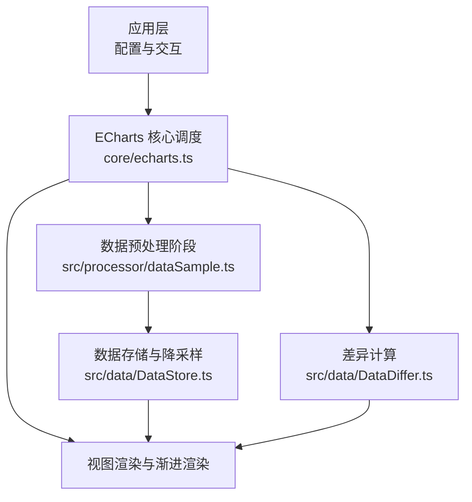
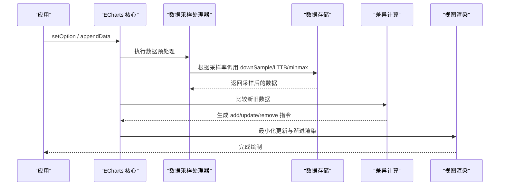
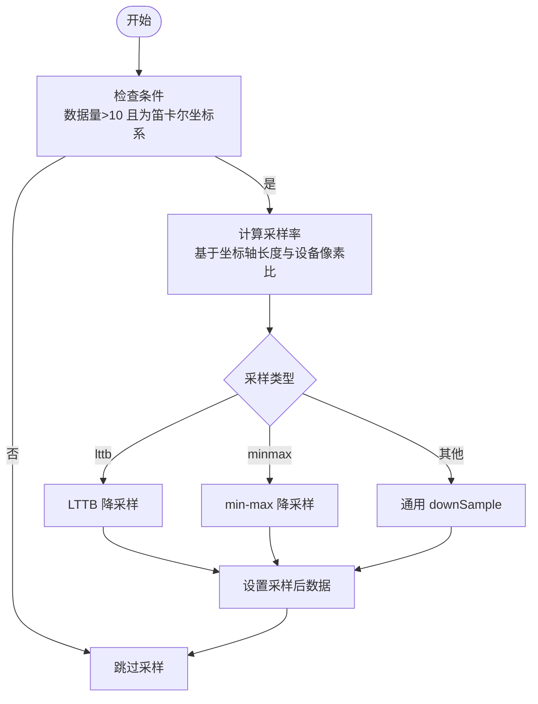
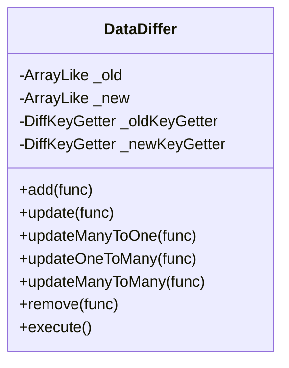
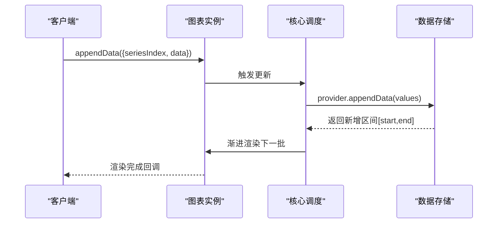
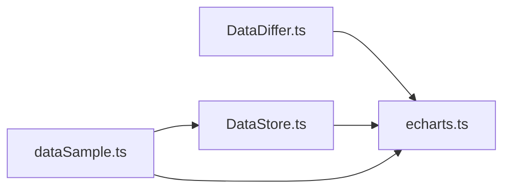

# 大数据量处理

<cite>
**本文引用的文件**
- [src/processor/dataSample.ts](file://src/processor/dataSample.ts)
- [src/data/DataStore.ts](file://src/data/DataStore.ts)
- [src/data/DataDiffer.ts](file://src/data/DataDiffer.ts)
- [src/core/echarts.ts](file://src/core/echarts.ts)
- [test/line-sampling.html](file://test/line-sampling.html)
- [test/sample-compare.html](file://test/sample-compare.html)
- [test/lines-ny-appendData.html](file://test/lines-ny-appendData.html)
- [test/scatter-random-stream.html](file://test/scatter-random-stream.html)
- [test/appendData2.html](file://test/appendData2.html)
- [test/appendData3.html](file://test/appendData3.html)
</cite>

## 目录
1. [简介](#简介)
2. [项目结构](#项目结构)
3. [核心组件](#核心组件)
4. [架构总览](#架构总览)
5. [详细组件分析](#详细组件分析)
6. [依赖关系分析](#依赖关系分析)
7. [性能考量](#性能考量)
8. [故障排查指南](#故障排查指南)
9. [结论](#结论)
10. [附录](#附录)

## 简介
本文件系统性阐述 ECharts 在大数据量场景下的处理策略与实现机制，覆盖以下关键主题：
- 数据采样算法：平均、求和、最大/最小、最近邻、LTTB（最大三角形三桶）与 min-max 降采样，如何在保持代表性的同时降低渲染压力。
- 增量更新机制：基于 DataDiffer 的差异计算，识别新增、更新、删除的数据项，最小化重绘范围。
- 渐进式渲染与流式数据：通过 progressive 分批渲染与 appendData 流式追加，提升大数据集展示流畅度。
- 分页加载方案：按块加载数据并逐步追加，支持大数据集的渐进式展示。
- 实际示例：散点图大数据、折线图采样对比、流式数据与实时更新的实践路径。

## 项目结构
围绕大数据处理的代码主要分布在以下模块：
- 数据处理阶段：dataSample 处理器负责根据坐标轴尺寸与设备像素比动态决定采样率，并调用 DataStore 的多种降采样方法。
- 数据存储与降采样：DataStore 提供 lttbDownSample、minmaxDownSample、downSample 等能力，以及 appendValues 用于增量追加。
- 差异计算：DataDiffer 对旧/新数据集进行 diff，输出 add/update/remove 指令，驱动视图最小化更新。
- 渲染调度：core/echarts.ts 中统一调度数据预处理、坐标系更新、流模式切换与渲染流程。
- 测试用例：大量 HTML 示例演示采样、流式追加、渐进渲染等用法。

图表来源
- [src/core/echarts.ts:1896-1921](file://src/core/echarts.ts#L1896-L1921)
- [src/processor/dataSample.ts:75-122](file://src/processor/dataSample.ts#L75-L122)
- [src/data/DataStore.ts:860-1059](file://src/data/DataStore.ts#L860-L1059)
- [src/data/DataDiffer.ts:142-317](file://src/data/DataDiffer.ts#L142-L317)

章节来源
- [src/core/echarts.ts:1896-1921](file://src/core/echarts.ts#L1896-L1921)
- [src/processor/dataSample.ts:75-122](file://src/processor/dataSample.ts#L75-L122)
- [src/data/DataStore.ts:860-1059](file://src/data/DataStore.ts#L860-L1059)
- [src/data/DataDiffer.ts:142-317](file://src/data/DataDiffer.ts#L142-L317)

## 核心组件
- 数据采样处理器（dataSample）：根据坐标轴范围和设备像素比计算采样率，选择 LTTB、min-max 或通用 downSample；仅对笛卡尔坐标系且数据量大于阈值时启用。
- 数据存储（DataStore）：提供多类降采样方法与增量追加能力，内部以分块存储与索引映射优化访问与裁剪。
- 差异计算器（DataDiffer）：基于键值映射将新旧数据对比为 add/update/remove 等操作，支持一对一与多对多模式。
- 核心调度（echarts.ts）：编排数据预处理、坐标系更新、流模式切换与渲染，确保大数据场景下稳定与高效。

章节来源
- [src/processor/dataSample.ts:75-122](file://src/processor/dataSample.ts#L75-L122)
- [src/data/DataStore.ts:860-1059](file://src/data/DataStore.ts#L860-L1059)
- [src/data/DataDiffer.ts:142-317](file://src/data/DataDiffer.ts#L142-L317)
- [src/core/echarts.ts:1896-1921](file://src/core/echarts.ts#L1896-L1921)

## 架构总览
下图展示了大数据处理的关键流程：从配置到采样、再到增量更新与渲染。

图表来源
- [src/core/echarts.ts:1896-1921](file://src/core/echarts.ts#L1896-L1921)
- [src/processor/dataSample.ts:75-122](file://src/processor/dataSample.ts#L75-L122)
- [src/data/DataStore.ts:860-1059](file://src/data/DataStore.ts#L860-L1059)
- [src/data/DataDiffer.ts:142-317](file://src/data/DataDiffer.ts#L142-L317)

## 详细组件分析

### 数据采样算法与实现
- 内置采样器：average、sum、max、min、nearest，适用于聚合维度值以减少点数。
- LTTB（最大三角形三桶）：按帧划分数据，选取使相邻三点构成三角形面积最大的点，保持曲线形状特征。
- min-max 降采样：每帧保留最小值与最大值，适合趋势与极值展示。
- 通用 downSample：按帧聚合值与索引，支持自定义采样函数。

图表来源
- [src/processor/dataSample.ts:75-122](file://src/processor/dataSample.ts#L75-L122)
- [src/data/DataStore.ts:860-1059](file://src/data/DataStore.ts#L860-L1059)

章节来源
- [src/processor/dataSample.ts:26-122](file://src/processor/dataSample.ts#L26-L122)
- [src/data/DataStore.ts:860-1059](file://src/data/DataStore.ts#L860-L1059)

### 增量更新机制（DataDiffer）
- 键值映射：为旧/新数组构建 key→index 的映射，支持重复键的多对多匹配。
- 操作分类：add（新增）、update（一对一/多对一/一对多/多对多）、remove（删除）。
- 最小化重绘：仅对变化部分触发视图更新，避免全量重绘。

图表来源
- [src/data/DataDiffer.ts:55-317](file://src/data/DataDiffer.ts#L55-L317)

章节来源
- [src/data/DataDiffer.ts:142-317](file://src/data/DataDiffer.ts#L142-L317)

### 渐进式渲染与流式数据
- 渐进式渲染：通过 progressive 参数分批渲染，避免一次性绘制导致卡顿。
- 流式追加：使用 appendData 持续追加数据块，结合 progressive 实现平滑滚动与实时更新。
- 流模式切换：核心调度在数据预处理后更新流模式，确保过滤后的数据参与渲染决策。

图表来源
- [src/core/echarts.ts:1896-1921](file://src/core/echarts.ts#L1896-L1921)
- [src/data/DataStore.ts:328-343](file://src/data/DataStore.ts#L328-L343)

章节来源
- [src/core/echarts.ts:1896-1921](file://src/core/echarts.ts#L1896-L1921)
- [src/data/DataStore.ts:328-343](file://src/data/DataStore.ts#L328-L343)

### 分页加载方案
- 按块加载：将大数据集拆分为多个数据块，逐块请求并追加至图表。
- 渐进展示：配合 progressive 与 appendData，用户可看到数据逐步呈现，提升交互体验。
- 示例参考：折线图的 appendData 与 scatter 随机流式数据示例。

章节来源
- [test/lines-ny-appendData.html:75-113](file://test/lines-ny-appendData.html#L75-L113)
- [test/scatter-random-stream.html:179-222](file://test/scatter-random-stream.html#L179-L222)

### 实际代码示例与最佳实践
- 折线图采样对比：通过配置 sampling 为 lttb 或 none，观察不同采样策略对曲线形状的影响。
- 散点图大数据：使用 progressive 分批渲染，减少首屏压力。
- 流式数据与实时更新：使用 appendData 周期性追加数据，结合 dataZoom 控制可视范围。
- 渐进渲染与追加时机：在渐进渲染进行中或完成后追加数据，注意数据缩放与保留行为。

章节来源
- [test/line-sampling.html:110-136](file://test/line-sampling.html#L110-L136)
- [test/sample-compare.html:1-87](file://test/sample-compare.html#L1-L87)
- [test/lines-ny-appendData.html:75-113](file://test/lines-ny-appendData.html#L75-L113)
- [test/scatter-random-stream.html:179-222](file://test/scatter-random-stream.html#L179-L222)
- [test/appendData2.html:186-218](file://test/appendData2.html#L186-L218)
- [test/appendData3.html:210-236](file://test/appendData3.html#L210-L236)

## 依赖关系分析
- dataSample 依赖 SeriesModel 获取数据与坐标系统，并调用 DataStore 的降采样方法。
- DataStore 提供底层数据结构与算法，被采样处理器与增量更新共同使用。
- DataDiffer 独立于具体图表类型，提供通用的数据差异计算能力。
- core/echarts.ts 作为中枢，协调各组件顺序执行，保证大数据场景下的稳定性。

图表来源
- [src/processor/dataSample.ts:75-122](file://src/processor/dataSample.ts#L75-L122)
- [src/data/DataStore.ts:860-1059](file://src/data/DataStore.ts#L860-L1059)
- [src/data/DataDiffer.ts:142-317](file://src/data/DataDiffer.ts#L142-L317)
- [src/core/echarts.ts:1896-1921](file://src/core/echarts.ts#L1896-L1921)

章节来源
- [src/processor/dataSample.ts:75-122](file://src/processor/dataSample.ts#L75-L122)
- [src/data/DataStore.ts:860-1059](file://src/data/DataStore.ts#L860-L1059)
- [src/data/DataDiffer.ts:142-317](file://src/data/DataDiffer.ts#L142-L317)
- [src/core/echarts.ts:1896-1921](file://src/core/echarts.ts#L1896-L1921)

## 性能考量
- 采样策略选择：LTTB 更适合曲线形状保持，min-max 适合趋势与极值，通用 downSample 可自定义聚合逻辑。
- 渐进渲染阈值：合理设置 progressive 与 progressiveThreshold，平衡首屏速度与完整度。
- 增量更新粒度：利用 DataDiffer 的最小化更新，避免全量重绘；在高频更新场景下合并数据批次。
- 内存与拷贝成本：DataStore 的分块存储与 append 时的拷贝开销需关注，尤其在频繁追加时。
- 设备像素比影响：采样率计算考虑 dpr，确保在不同分辨率下保持一致的视觉密度。

[本节为通用指导，不直接分析具体文件]

## 故障排查指南
- 采样未生效：确认数据量大于阈值且为笛卡尔坐标系；检查 sampling 配置是否有效。
- 流式追加卡顿：检查 progressive 设置与数据块大小；避免一次性追加过多数据。
- 视图更新异常：核对 DataDiffer 的键值映射是否正确；确认 update/add/remove 回调逻辑。
- 渐进渲染中断：在 appendData 过程中避免频繁 setOption；必要时等待 finished 事件后再追加。

章节来源
- [src/processor/dataSample.ts:75-122](file://src/processor/dataSample.ts#L75-L122)
- [src/data/DataDiffer.ts:142-317](file://src/data/DataDiffer.ts#L142-L317)
- [src/core/echarts.ts:1896-1921](file://src/core/echarts.ts#L1896-L1921)

## 结论
ECharts 在大数据量场景下通过多维度的优化策略保障流畅与准确：
- 智能采样：依据坐标轴尺寸与设备像素比动态调整采样率，提供 LTTB、min-max 与通用聚合方法。
- 增量更新：基于 DataDiffer 的差异计算，精准定位变更并最小化重绘范围。
- 渐进与流式：通过 progressive 与 appendData 实现分批渲染与实时追加，提升用户体验。
- 分页加载：按块加载与渐进展示，支持海量数据的交互式探索。
建议在实际项目中结合业务需求选择合适的采样策略与渲染模式，并通过测试用例验证效果。

[本节为总结性内容，不直接分析具体文件]

## 附录
- 示例页面路径：
  - 折线图采样对比：[test/line-sampling.html](file://test/line-sampling.html)
  - 采样策略对比工具：[test/sample-compare.html](file://test/sample-compare.html)
  - 折线流式追加：[test/lines-ny-appendData.html](file://test/lines-ny-appendData.html)
  - 散点流式数据：[test/scatter-random-stream.html](file://test/scatter-random-stream.html)
  - 渐进渲染与追加时机：[test/appendData2.html](file://test/appendData2.html), [test/appendData3.html](file://test/appendData3.html)

[本节为补充信息，不直接分析具体文件]