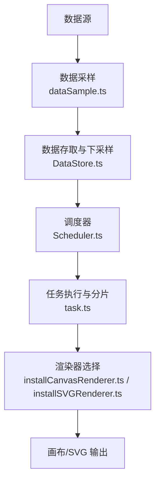
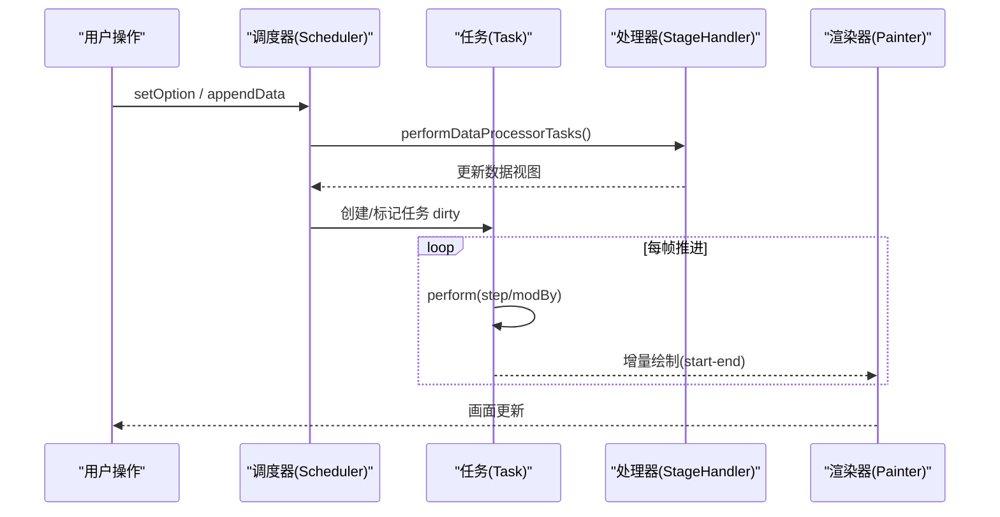
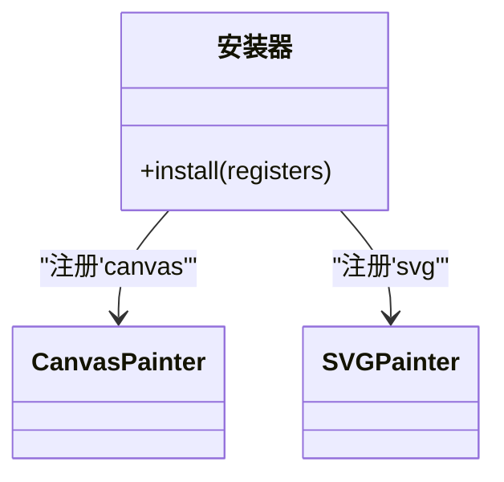
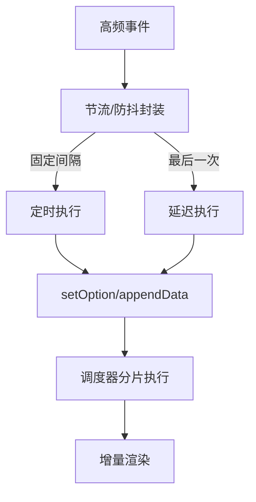
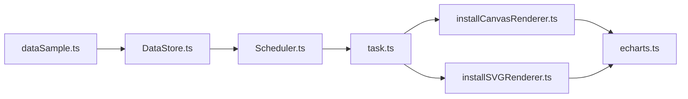

# 性能优化

<cite>
**本文引用的文件**
- [src/processor/dataSample.ts](file://src/processor/dataSample.ts)
- [src/data/DataStore.ts](file://src/data/DataStore.ts)
- [src/core/Scheduler.ts](file://src/core/Scheduler.ts)
- [src/core/task.ts](file://src/core/task.ts)
- [src/util/model.ts](file://src/util/model.ts)
- [src/renderer/installCanvasRenderer.ts](file://src/renderer/installCanvasRenderer.ts)
- [src/renderer/installSVGRenderer.ts](file://src/renderer/installSVGRenderer.ts)
- [src/core/echarts.ts](file://src/core/echarts.ts)
- [src/util/throttle.ts](file://src/util/throttle.ts)
- [test/bar-large.html](file://test/bar-large.html)
- [test/line-sampling.html](file://test/line-sampling.html)
</cite>

## 目录
1. [简介](#简介)
2. [项目结构](#项目结构)
3. [核心组件](#核心组件)
4. [架构总览](#架构总览)
5. [详细组件分析](#详细组件分析)
6. [依赖关系分析](#依赖关系分析)
7. [性能考量](#性能考量)
8. [故障排查指南](#故障排查指南)
9. [结论](#结论)
10. [附录](#附录)

## 简介
本文件围绕 ECharts 的性能优化策略与最佳实践，系统梳理大数据量处理、渲染优化、内存管理、交互性能优化以及性能监控与分析方法。内容基于源码实现与测试用例，提供可落地的调优路径与排障经验。

## 项目结构
ECharts 将“数据处理—调度—渲染”解耦为清晰的流水线：数据采样与预处理在处理器阶段完成；Scheduler 负责构建任务管道并分片执行；Task 驱动增量推进；最终由 Canvas/SVG 渲染器输出图形。

图表来源
- [src/processor/dataSample.ts:75-122](file://src/processor/dataSample.ts#L75-L122)
- [src/data/DataStore.ts:865-1001](file://src/data/DataStore.ts#L865-L1001)
- [src/core/Scheduler.ts:235-257](file://src/core/Scheduler.ts#L235-L257)
- [src/core/task.ts:139-243](file://src/core/task.ts#L139-L243)
- [src/renderer/installCanvasRenderer.ts:20-24](file://src/renderer/installCanvasRenderer.ts#L20-L24)
- [src/renderer/installSVGRenderer.ts:20-24](file://src/renderer/installSVGRenderer.ts#L20-L24)

章节来源
- [src/processor/dataSample.ts:75-122](file://src/processor/dataSample.ts#L75-L122)
- [src/data/DataStore.ts:865-1001](file://src/data/DataStore.ts#L865-L1001)
- [src/core/Scheduler.ts:235-257](file://src/core/Scheduler.ts#L235-L257)
- [src/core/task.ts:139-243](file://src/core/task.ts#L139-L243)
- [src/renderer/installCanvasRenderer.ts:20-24](file://src/renderer/installCanvasRenderer.ts#L20-L24)
- [src/renderer/installSVGRenderer.ts:20-24](file://src/renderer/installSVGRenderer.ts#L20-L24)

## 核心组件
- 数据采样与下采样：按坐标轴范围与设备像素比计算采样率，支持 lttb、minmax 等算法，减少绘制点数。
- 数据存取 DataStore：提供 lttbDownSample、minmaxDownSample、downSample 等能力，配合索引映射避免全量拷贝。
- 调度器 Scheduler：维护 pipeline、阈值与步长，决定渐进式渲染与大模式（large）切换。
- 任务 Task：以 start/end 区间推进，支持 mod 分片与 next 迭代，保证交互流畅。
- 渲染器：Canvas 渲染器用于高性能位图绘制；SVG 渲染器用于矢量导出与高保真展示。
- 工具函数：throttle 提供节流/防抖控制，降低高频事件对渲染的冲击。

章节来源
- [src/processor/dataSample.ts:75-122](file://src/processor/dataSample.ts#L75-L122)
- [src/data/DataStore.ts:865-1001](file://src/data/DataStore.ts#L865-L1001)
- [src/core/Scheduler.ts:219-257](file://src/core/Scheduler.ts#L219-L257)
- [src/core/task.ts:139-243](file://src/core/task.ts#L139-L243)
- [src/renderer/installCanvasRenderer.ts:20-24](file://src/renderer/installCanvasRenderer.ts#L20-L24)
- [src/renderer/installSVGRenderer.ts:20-24](file://src/renderer/installSVGRenderer.ts#L20-L24)
- [src/util/throttle.ts:42-118](file://src/util/throttle.ts#L42-L118)

## 架构总览
ECharts 的渲染管线采用“流水线 + 任务分片”的模式：
- 数据阶段：数据采样与过滤，生成可视化的最小必要数据集。
- 视觉阶段：布局与样式计算，按需启用 large 模式或渐进式渲染。
- 渲染阶段：根据 painter 类型（Canvas/SVG）输出图形。

图表来源
- [src/core/Scheduler.ts:292-303](file://src/core/Scheduler.ts#L292-L303)
- [src/core/task.ts:139-243](file://src/core/task.ts#L139-L243)
- [src/core/Scheduler.ts:305-376](file://src/core/Scheduler.ts#L305-L376)

## 详细组件分析

### 大数据量处理方案
- 数据采样
  - 自动采样：根据坐标轴范围和设备像素比计算 rate，当 rate>1 时触发 downSample。
  - 算法支持：lttb、minmax、average/sum/max/min/nearest 等。
  - 适用场景：折线、散点等笛卡尔坐标系下的海量时序/数值数据。
- 增量更新
  - appendData：通过 DataStore.appendValues 追加数据，仅初始化新增段，避免全量重建。
  - 任务分片：Task 以 step 推进，结合 modBy/modDataCount 实现均匀分布渲染。
- 虚拟滚动与分页加载
  - 可视化分页：legend 滚动视图通过几何相交计算页码与前后页索引，减少 DOM/图形节点数量。
  - 数据分页：结合 dataZoom 与采样，只渲染可见区段，达到“虚拟滚动”效果。

```mermaid
flowchart TD
Start(["进入数据阶段"]) --> CheckSize{"数据量 > 阈值?"}
CheckSize --> |否| Skip["跳过采样"]
CheckSize --> |是| CalcRate["计算采样率(rate)"]
CalcRate --> RateOk{"rate > 1 ?"}
RateOk --> |否| Skip
RateOk --> |是| ChooseAlgo{"选择算法"}
ChooseAlgo --> LTTB["lttbDownSample"]
ChooseAlgo --> MinMax["minmaxDownSample"]
ChooseAlgo --> Custom["自定义采样器"]
LTTB --> Apply["setData(采样后数据)"]
MinMax --> Apply
Custom --> Apply
Apply --> End(["进入下一阶段"])
Skip --> End
```

图表来源
- [src/processor/dataSample.ts:75-122](file://src/processor/dataSample.ts#L75-L122)
- [src/data/DataStore.ts:865-1001](file://src/data/DataStore.ts#L865-L1001)

章节来源
- [src/processor/dataSample.ts:75-122](file://src/processor/dataSample.ts#L75-L122)
- [src/data/DataStore.ts:328-367](file://src/data/DataStore.ts#L328-L367)
- [src/component/legend/ScrollableLegendView.ts:445-509](file://src/component/legend/ScrollableLegendView.ts#L445-L509)

### 渲染优化技术
- Canvas 渲染器的高性能特性
  - 通过 registerPainter('canvas', CanvasPainter) 注册，适合大量点线面绘制与动画。
  - 支持 renderToCanvas 导出高分辨率位图，便于截图与离线渲染。
- SVG 渲染器的矢量优势
  - 通过 registerPainter('svg', SVGPainter) 注册，适合矢量导出、可缩放与无障碍需求。
  - 支持 renderToSVGString 输出字符串，便于服务端渲染与静态资源生成。
- WebGL 扩展与 3D 加速
  - 当前仓库未包含 WebGL 渲染器实现；如需 3D 加速，建议结合第三方扩展或使用其他渲染后端。

图表来源
- [src/renderer/installCanvasRenderer.ts:20-24](file://src/renderer/installCanvasRenderer.ts#L20-L24)
- [src/renderer/installSVGRenderer.ts:20-24](file://src/renderer/installSVGRenderer.ts#L20-L24)
- [src/core/echarts.ts:923-953](file://src/core/echarts.ts#L923-L953)

章节来源
- [src/renderer/installCanvasRenderer.ts:20-24](file://src/renderer/installCanvasRenderer.ts#L20-L24)
- [src/renderer/installSVGRenderer.ts:20-24](file://src/renderer/installSVGRenderer.ts#L20-L24)
- [src/core/echarts.ts:923-953](file://src/core/echarts.ts#L923-L953)

### 内存管理策略
- 对象池复用
  - 任务与管道复用：Scheduler 在 prepareStageTasks 中复用 stage handler 的任务实例，避免频繁分配。
  - 数据块复用：DataStore 使用 _chunks 与 indices 映射，避免重复构造数组。
- 垃圾回收优化
  - 增量推进：Task 每次仅处理 [start, end] 区间，减少大对象生命周期。
  - 及时清理：dispose 断开上下游引用，防止循环引用导致泄漏。
- 内存泄漏检测
  - 开发期断言：validateUpstreamOutputRange 校验上游输出范围一致性，避免异常累积导致的内存膨胀。
  - 调试辅助：task.ts 内置 printTask/printPipeline 等调试工具（注释态），便于定位问题。

章节来源
- [src/core/Scheduler.ts:259-277](file://src/core/Scheduler.ts#L259-L277)
- [src/core/task.ts:321-331](file://src/core/task.ts#L321-L331)
- [src/util/model.ts:1407-1427](file://src/util/model.ts#L1407-L1427)
- [src/core/task.ts:395-479](file://src/core/task.ts#L395-L479)

### 交互性能优化
- 事件节流与防抖
  - throttle.createOrUpdate 支持 fixRate 与 debounce 两种模式，动态调整速率并在 dispose/clear 时释放定时器。
  - 适用于拖拽、缩放、resize 等高频率交互场景。
- 异步更新
  - 通过 Scheduler 的渐进式渲染与 Task 的分片推进，将重计算与绘制分散到多帧，避免主线程阻塞。

图表来源
- [src/util/throttle.ts:42-118](file://src/util/throttle.ts#L42-L118)
- [src/core/Scheduler.ts:292-303](file://src/core/Scheduler.ts#L292-L303)
- [src/core/task.ts:139-243](file://src/core/task.ts#L139-L243)

章节来源
- [src/util/throttle.ts:42-118](file://src/util/throttle.ts#L42-L118)
- [src/core/Scheduler.ts:292-303](file://src/core/Scheduler.ts#L292-L303)
- [src/core/task.ts:139-243](file://src/core/task.ts#L139-L243)

### 实际项目中的性能调优案例
- 大数据柱状图
  - 开启 large 与 largeThreshold，结合 dataZoom 限制可见范围，显著降低首屏与交互卡顿。
  - 参考用例：[test/bar-large.html](file://test/bar-large.html)
- 折线图采样
  - 使用 sampling: 'lttb' 或 'minmax'，在时间轴上保持趋势的同时大幅减少点数。
  - 参考用例：[test/line-sampling.html](file://test/line-sampling.html)

章节来源
- [test/bar-large.html:115-145](file://test/bar-large.html#L115-L145)
- [test/line-sampling.html:149-159](file://test/line-sampling.html#L149-L159)

## 依赖关系分析
- 数据层依赖：dataSample 依赖 DataStore 的下采样能力；DataStore 依赖维度存储与索引映射。
- 调度层依赖：Scheduler 依赖 task 的分片推进机制；依据 seriesModel 配置决定是否启用 progressive/large。
- 渲染层依赖：通过 installCanvasRenderer/installSVGRenderer 注册 Painter；echarts API 暴露导出接口。

图表来源
- [src/processor/dataSample.ts:75-122](file://src/processor/dataSample.ts#L75-L122)
- [src/data/DataStore.ts:865-1001](file://src/data/DataStore.ts#L865-L1001)
- [src/core/Scheduler.ts:235-257](file://src/core/Scheduler.ts#L235-L257)
- [src/core/task.ts:139-243](file://src/core/task.ts#L139-L243)
- [src/renderer/installCanvasRenderer.ts:20-24](file://src/renderer/installCanvasRenderer.ts#L20-L24)
- [src/renderer/installSVGRenderer.ts:20-24](file://src/renderer/installSVGRenderer.ts#L20-L24)
- [src/core/echarts.ts:923-953](file://src/core/echarts.ts#L923-L953)

章节来源
- [src/processor/dataSample.ts:75-122](file://src/processor/dataSample.ts#L75-L122)
- [src/data/DataStore.ts:865-1001](file://src/data/DataStore.ts#L865-L1001)
- [src/core/Scheduler.ts:235-257](file://src/core/Scheduler.ts#L235-L257)
- [src/core/task.ts:139-243](file://src/core/task.ts#L139-L243)
- [src/renderer/installCanvasRenderer.ts:20-24](file://src/renderer/installCanvasRenderer.ts#L20-L24)
- [src/renderer/installSVGRenderer.ts:20-24](file://src/renderer/installSVGRenderer.ts#L20-L24)
- [src/core/echarts.ts:923-953](file://src/core/echarts.ts#L923-L953)

## 性能考量
- 大数据量
  - 优先启用采样（lttb/minmax），并结合 dataZoom 限定可见范围。
  - 合理设置 largeThreshold，使超大数据集进入 large 模式，减少节点数。
- 渲染器选择
  - 大量点线面与动画首选 Canvas；需要矢量导出或无障碍时使用 SVG。
- 内存管理
  - 使用 appendData 增量更新，避免整图重建；及时 dispose 组件与实例。
  - 关注上游输出范围一致性，避免路径合并导致的内存膨胀。
- 交互优化
  - 对拖拽/缩放/resize 等高频事件使用节流/防抖；必要时合并多次 setOption。
- 渐进式渲染
  - 利用 progressive/progressiveThreshold 与 mod 模式，提升交互响应性。

## 故障排查指南
- 现象：拖拽卡顿或掉帧
  - 检查是否对高频事件使用了节流/防抖；确认 progressive 与 largeThreshold 配置是否合理。
  - 参考：[src/util/throttle.ts:42-118](file://src/util/throttle.ts#L42-L118)、[src/core/Scheduler.ts:219-257](file://src/core/Scheduler.ts#L219-L257)
- 现象：内存持续增长
  - 检查是否存在未 dispose 的实例；确认 appendData 后未重复 setData 造成冗余。
  - 参考：[src/core/task.ts:321-331](file://src/core/task.ts#L321-L331)、[src/data/DataStore.ts:328-367](file://src/data/DataStore.ts#L328-L367)
- 现象：采样失真或趋势错误
  - 核对采样算法与 connectNulls 配置；必要时切换为 minmax 或关闭采样。
  - 参考：[src/processor/dataSample.ts:75-122](file://src/processor/dataSample.ts#L75-L122)、[test/line-sampling.html:149-159](file://test/line-sampling.html#L149-L159)
- 现象：导出图片模糊或尺寸异常
  - 使用 renderToCanvas 指定 pixelRatio；确保 painter 类型为 canvas。
  - 参考：[src/core/echarts.ts:923-953](file://src/core/echarts.ts#L923-L953)

章节来源
- [src/util/throttle.ts:42-118](file://src/util/throttle.ts#L42-L118)
- [src/core/Scheduler.ts:219-257](file://src/core/Scheduler.ts#L219-L257)
- [src/core/task.ts:321-331](file://src/core/task.ts#L321-L331)
- [src/data/DataStore.ts:328-367](file://src/data/DataStore.ts#L328-L367)
- [src/processor/dataSample.ts:75-122](file://src/processor/dataSample.ts#L75-L122)
- [test/line-sampling.html:149-159](file://test/line-sampling.html#L149-L159)
- [src/core/echarts.ts:923-953](file://src/core/echarts.ts#L923-L953)

## 结论
ECharts 通过“数据采样 + 任务分片 + 渐进式渲染 + 渲染器选择”的组合拳，有效应对大数据量与高频交互场景。实践中应优先启用采样与 large 模式，合理使用 appendData 增量更新，并对交互事件进行节流/防抖。借助内置调试工具与测试用例，可快速定位性能瓶颈并完成调优。

## 附录
- 常用配置建议
  - 大数据折线：sampling: 'lttb' 或 'minmax'，connectNulls 视业务需求设置。
  - 大数据柱状：large: true，largeThreshold 设为较小值以尽早进入 large 模式。
  - 高频交互：对 resize/roam/drag 等事件使用 throttle.createOrUpdate。
- 参考用例
  - 大数据柱状图示例：[test/bar-large.html](file://test/bar-large.html)
  - 折线图采样示例：[test/line-sampling.html](file://test/line-sampling.html)