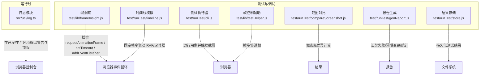
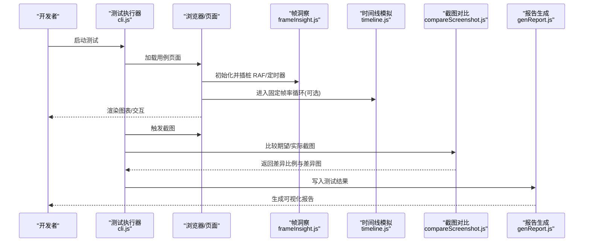
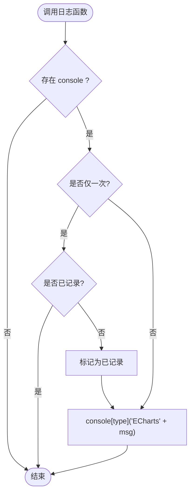
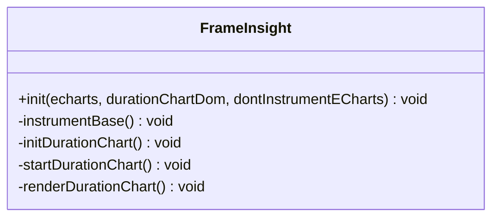
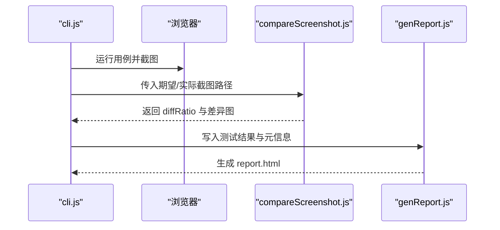
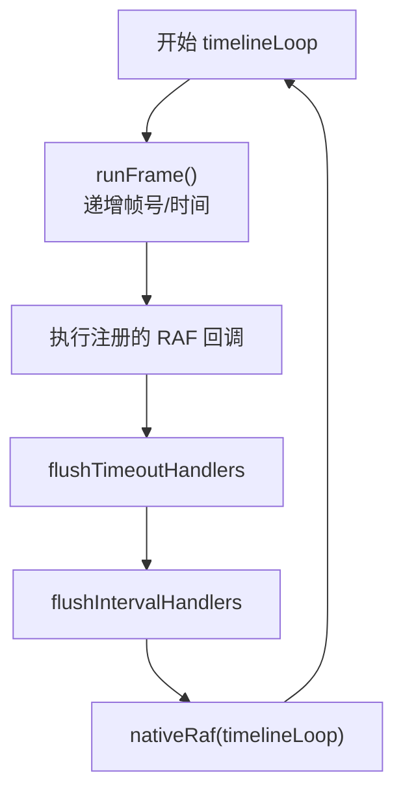
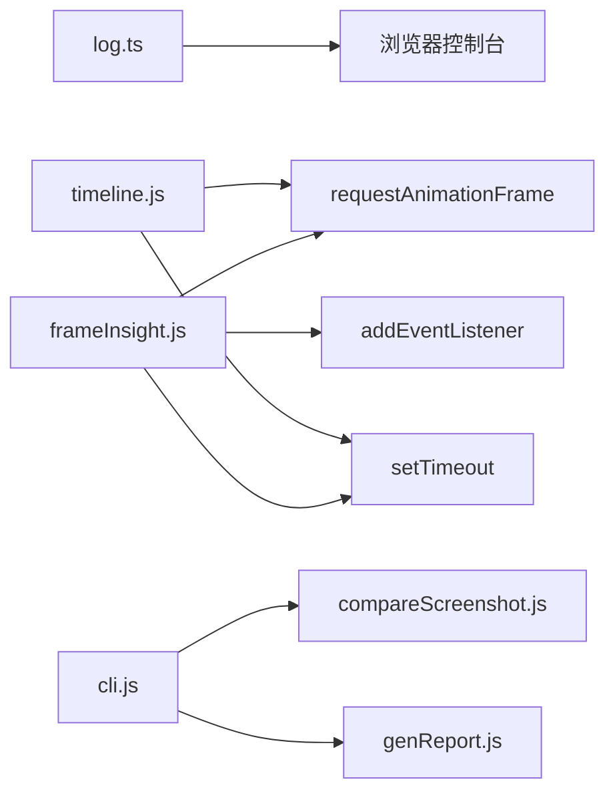

# 性能监控与分析

<cite>
**本文引用的文件**
- [src/util/log.ts](file://src/util/log.ts)
- [test/lib/frameInsight.js](file://test/lib/frameInsight.js)
- [test/runTest/timeline.js](file://test/runTest/timeline.js)
- [test/runTest/cli.js](file://test/runTest/cli.js)
- [test/runTest/compareScreenshot.js](file://test/runTest/compareScreenshot.js)
- [test/runTest/genReport.js](file://test/runTest/genReport.js)
- [test/runTest/store.js](file://test/runTest/store.js)
- [test/lib/testHelper.js](file://test/lib/testHelper.js)
</cite>

## 目录
1. [简介](#简介)
2. [项目结构](#项目结构)
3. [核心组件](#核心组件)
4. [架构总览](#架构总览)
5. [详细组件分析](#详细组件分析)
6. [依赖关系分析](#依赖关系分析)
7. [性能注意事项](#性能注意事项)
8. [故障排查指南](#故障排查指南)
9. [结论](#结论)
10. [附录](#附录)

## 简介
本文件面向希望在 ECharts 项目中系统化开展性能监控与优化的工程师，覆盖以下主题：
- 内置日志系统的使用与解读，帮助定位渲染与数据处理瓶颈
- 浏览器开发者工具（Performance、内存快照、帧率）的实操方法
- 视觉回归测试：通过截图对比检测渲染变化与潜在性能退化
- 性能基线建立与版本升级影响评估
- 第三方 APM 集成思路与数据上报策略
- 实战优化案例与调优经验总结

## 项目结构
ECharts 仓库中与“性能监控与分析”直接相关的代码主要分布在：
- 运行时日志输出：src/util/log.ts
- 帧级可视化与插桩：test/lib/frameInsight.js
- 可视化回归测试框架：test/runTest/*（cli、timeline、compareScreenshot、genReport、store）
- 测试辅助控制：test/lib/testHelper.js

**图表来源**
- [src/util/log.ts:20-66](file://src/util/log.ts#L20-L66)
- [test/lib/frameInsight.js:21-74](file://test/lib/frameInsight.js#L21-L74)
- [test/runTest/timeline.js:20-64](file://test/runTest/timeline.js#L20-L64)
- [test/runTest/cli.js:380-448](file://test/runTest/cli.js#L380-L448)
- [test/runTest/compareScreenshot.js:20-66](file://test/runTest/compareScreenshot.js#L20-L66)
- [test/runTest/genReport.js:228-371](file://test/runTest/genReport.js#L228-L371)
- [test/runTest/store.js:48-83](file://test/runTest/store.js#L48-L83)
- [test/lib/testHelper.js:2092-2175](file://test/lib/testHelper.js#L2092-L2175)

**章节来源**
- [src/util/log.ts:20-66](file://src/util/log.ts#L20-L66)
- [test/lib/frameInsight.js:21-74](file://test/lib/frameInsight.js#L21-L74)
- [test/runTest/timeline.js:20-64](file://test/runTest/timeline.js#L20-L64)
- [test/runTest/cli.js:380-448](file://test/runTest/cli.js#L380-L448)
- [test/runTest/compareScreenshot.js:20-66](file://test/runTest/compareScreenshot.js#L20-L66)
- [test/runTest/genReport.js:228-371](file://test/runTest/genReport.js#L228-L371)
- [test/runTest/store.js:48-83](file://test/runTest/store.js#L48-L83)
- [test/lib/testHelper.js:2092-2175](file://test/lib/testHelper.js#L2092-L2175)

## 核心组件
- 内置日志系统：提供 log/warn/error/deprecateLog 等能力，支持仅一次告警与可打印信息构造，便于在开发与生产环境中快速定位问题。
- 帧洞察工具：对 requestAnimationFrame、setTimeout、addEventListener 进行插桩，记录每帧耗时并在 Canvas 上绘制时长分布，红色区域表示慢帧。
- 可视化回归测试：基于 Puppeteer/浏览器自动化执行用例，采集期望与实际截图，使用像素对比计算差异比例，生成 HTML 报告。
- 时间线模拟：以固定帧率驱动 RAF 与定时器，确保回放稳定、可重复，便于截图一致性。
- 测试辅助：提供控制帧播放、暂停/步进的能力，配合性能观察。

**章节来源**
- [src/util/log.ts:20-66](file://src/util/log.ts#L20-L66)
- [test/lib/frameInsight.js:21-74](file://test/lib/frameInsight.js#L21-L74)
- [test/runTest/cli.js:380-448](file://test/runTest/cli.js#L380-L448)
- [test/runTest/compareScreenshot.js:20-66](file://test/runTest/compareScreenshot.js#L20-L66)
- [test/runTest/timeline.js:20-64](file://test/runTest/timeline.js#L20-L64)
- [test/lib/testHelper.js:2092-2175](file://test/lib/testHelper.js#L2092-L2175)

## 架构总览
下图展示了从“用例执行”到“截图对比”再到“报告生成”的端到端流程，以及帧洞察如何与浏览器事件循环交互。

**图表来源**
- [test/runTest/cli.js:380-448](file://test/runTest/cli.js#L380-L448)
- [test/lib/frameInsight.js:21-74](file://test/lib/frameInsight.js#L21-L74)
- [test/runTest/timeline.js:20-64](file://test/runTest/timeline.js#L20-L64)
- [test/runTest/compareScreenshot.js:20-66](file://test/runTest/compareScreenshot.js#L20-L66)
- [test/runTest/genReport.js:228-371](file://test/runTest/genReport.js#L228-L371)

## 详细组件分析

### 内置日志系统（src/util/log.ts）
- 功能要点
  - 统一输出前缀，便于过滤
  - warn/error/log 三类输出，支持 onlyOnce 去重
  - deprecateLog 仅在开发环境输出弃用提示
  - makePrintable 将复杂对象安全地转为可读字符串，避免序列化异常
- 使用建议
  - 在关键路径（如 setOption、数据预处理、布局、渲染）插入 warn/error，结合 onlyOnce 降低噪音
  - 使用 makePrintable 构造上下文信息，便于复现问题
  - 在生产构建中关闭或降级日志以减少开销

**图表来源**
- [src/util/log.ts:26-66](file://src/util/log.ts#L26-L66)

**章节来源**
- [src/util/log.ts:20-66](file://src/util/log.ts#L20-L66)

### 帧洞察工具（test/lib/frameInsight.js）
- 功能要点
  - 初始化时可选择是否插桩 ECharts
  - 记录 setTimeout/requestAnimationFrame/addEventListener 的调用时机
  - 使用 Canvas 绘制最近 N 毫秒的帧耗时分布，超过阈值显示为红色
- 使用建议
  - 在需要观察交互卡顿、动画掉帧时启用
  - 调整慢帧阈值以匹配设备刷新率
  - 结合 testHelper 的帧控制，逐步推进以定位具体操作导致的卡顿

**图表来源**
- [test/lib/frameInsight.js:21-74](file://test/lib/frameInsight.js#L21-L74)
- [test/lib/frameInsight.js:162-223](file://test/lib/frameInsight.js#L162-L223)

**章节来源**
- [test/lib/frameInsight.js:21-74](file://test/lib/frameInsight.js#L21-L74)
- [test/lib/frameInsight.js:162-223](file://test/lib/frameInsight.js#L162-L223)

### 可视化回归测试（test/runTest/*）
- 执行流程
  - cli.js 负责驱动浏览器、运行用例、收集截图与日志
  - compareScreenshot.js 读取 PNG 并进行像素级差异计算，输出 diffRatio 与差异图
  - genReport.js 汇总失败项、预期变更项，生成带导航的 HTML 报告
  - store.js 管理测试结果结构与哈希，区分期望/实际版本
- 使用建议
  - 建立稳定的基准截图集作为期望结果
  - 设置合理的像素阈值，避免微小抖动导致误报
  - 将报告纳入 CI，阻断引入视觉回归的提交

**图表来源**
- [test/runTest/cli.js:380-448](file://test/runTest/cli.js#L380-L448)
- [test/runTest/compareScreenshot.js:20-66](file://test/runTest/compareScreenshot.js#L20-L66)
- [test/runTest/genReport.js:228-371](file://test/runTest/genReport.js#L228-L371)

**章节来源**
- [test/runTest/cli.js:380-448](file://test/runTest/cli.js#L380-L448)
- [test/runTest/compareScreenshot.js:20-66](file://test/runTest/compareScreenshot.js#L20-L66)
- [test/runTest/genReport.js:228-371](file://test/runTest/genReport.js#L228-L371)
- [test/runTest/store.js:48-83](file://test/runTest/store.js#L48-L83)

### 时间线模拟（test/runTest/timeline.js）
- 功能要点
  - 以固定帧时间驱动 RAF 循环，屏蔽真实时间波动
  - 拦截 setTimeout/setInterval，按帧调度回调
  - 捕获异常并记录，避免中断后续任务
- 使用建议
  - 在视觉回归测试中保证回放稳定性
  - 结合帧洞察，观察不同操作下的帧占用

**图表来源**
- [test/runTest/timeline.js:20-64](file://test/runTest/timeline.js#L20-L64)
- [test/runTest/timeline.js:77-154](file://test/runTest/timeline.js#L77-L154)

**章节来源**
- [test/runTest/timeline.js:20-64](file://test/runTest/timeline.js#L20-L64)
- [test/runTest/timeline.js:77-154](file://test/runTest/timeline.js#L77-L154)

### 帧控制辅助（test/lib/testHelper.js）
- 功能要点
  - 提供“暂停/继续/下一帧”按钮，便于逐帧观察
  - 拦截 window.requestAnimationFrame，将回调加入队列，由测试侧控制执行
- 使用建议
  - 在定位复杂动画或交互引起的卡顿场景时非常有用
  - 配合帧洞察，精确锁定问题帧

**章节来源**
- [test/lib/testHelper.js:2092-2175](file://test/lib/testHelper.js#L2092-L2175)

## 依赖关系分析
- 低耦合：日志模块独立于渲染管线，仅通过 console 输出；帧洞察通过全局插桩获取时序信息；回归测试通过浏览器自动化与像素对比解耦业务逻辑。
- 外部依赖：像素对比使用 pixelmatch/pngjs；报告生成依赖 Node 文件系统；时间线模拟依赖原生 requestAnimationFrame/setTimeout/setInterval。
- 可能的风险点
  - 插桩可能影响被测应用行为，需按需开启
  - 像素对比对分辨率/DPR 敏感，需在一致环境下运行
  - 时间线模拟固定帧率，可能与真实设备表现存在偏差

**图表来源**
- [src/util/log.ts:20-66](file://src/util/log.ts#L20-L66)
- [test/lib/frameInsight.js:21-74](file://test/lib/frameInsight.js#L21-L74)
- [test/runTest/timeline.js:20-64](file://test/runTest/timeline.js#L20-L64)
- [test/runTest/cli.js:380-448](file://test/runTest/cli.js#L380-L448)
- [test/runTest/compareScreenshot.js:20-66](file://test/runTest/compareScreenshot.js#L20-L66)
- [test/runTest/genReport.js:228-371](file://test/runTest/genReport.js#L228-L371)

**章节来源**
- [src/util/log.ts:20-66](file://src/util/log.ts#L20-L66)
- [test/lib/frameInsight.js:21-74](file://test/lib/frameInsight.js#L21-L74)
- [test/runTest/timeline.js:20-64](file://test/runTest/timeline.js#L20-L64)
- [test/runTest/cli.js:380-448](file://test/runTest/cli.js#L380-L448)
- [test/runTest/compareScreenshot.js:20-66](file://test/runTest/compareScreenshot.js#L20-L66)
- [test/runTest/genReport.js:228-371](file://test/runTest/genReport.js#L228-L371)

## 性能注意事项
- 日志开关与级别
  - 开发阶段开启详细日志，生产环境降级或关闭，避免 I/O 开销
  - 使用 onlyOnce 抑制高频重复告警
- 帧洞察阈值
  - 根据设备刷新率设定慢帧阈值，避免误判
  - 关注连续慢帧而非单帧抖动
- 回归测试环境
  - 固定 DPR、缩放、字体渲染设置，减少噪声
  - 合理设置像素对比阈值，平衡灵敏度与稳定性
- 时间线模拟
  - 用于回放与截图一致性，不代表真实设备帧率
  - 在性能验证阶段应切换至真实环境复核

[本节为通用指导，不直接分析具体文件]

## 故障排查指南
- 常见问题
  - 截图尺寸不一致：像素对比会抛出尺寸不匹配错误，需统一渲染尺寸与 DPR
  - 差异过大：检查主题、字体、DPR、缩放、动画状态是否一致
  - 时间线回放异常：确认 __VRT_TIMELINE_PAUSED__ 与速度配置，避免被测试代码修改
- 定位步骤
  - 使用帧洞察观察慢帧区间，结合 testHelper 步进到问题帧
  - 查看日志中的警告/错误，结合 makePrintable 输出的上下文
  - 在回归报告中查看 diff 图与差异比例，缩小范围
  - 若涉及异步，使用时间线模拟固定节奏，排除时间抖动干扰

**章节来源**
- [test/runTest/compareScreenshot.js:20-66](file://test/runTest/compareScreenshot.js#L20-L66)
- [test/runTest/timeline.js:20-64](file://test/runTest/timeline.js#L20-L64)
- [test/lib/frameInsight.js:21-74](file://test/lib/frameInsight.js#L21-L74)
- [src/util/log.ts:20-66](file://src/util/log.ts#L20-L66)

## 结论
- ECharts 提供了轻量而实用的性能观测手段：内置日志、帧洞察、可视化回归测试与时间线模拟。
- 建议在开发期以日志和帧洞察为主，快速定位热点；在集成与发布期以回归测试保障稳定性。
- 结合浏览器开发者工具与第三方 APM，形成“本地诊断 + 线上监控”的闭环。

[本节为总结性内容，不直接分析具体文件]

## 附录

### 浏览器开发者工具实操要点
- Performance 面板
  - 录制关键交互（如 setOption、拖拽、缩放），分析长任务、合成层重建、布局抖动
  - 关注主线程阻塞与 GPU 加速情况
- 内存快照
  - 在关键操作前后分别抓取堆快照，对比增长对象，定位泄漏
- 帧率监控
  - 使用 FPS 指标与帧洞察交叉验证，识别掉帧原因

[本节为通用指导，不直接分析具体文件]

### 视觉回归测试工作流
- 建立基线：在稳定版本下生成期望截图
- 执行对比：CI 中自动运行，产出差异报告
- 决策与修复：根据差异比例与 diff 图判断是否为预期变更，必要时更新基线

**章节来源**
- [test/runTest/cli.js:380-448](file://test/runTest/cli.js#L380-L448)
- [test/runTest/compareScreenshot.js:20-66](file://test/runTest/compareScreenshot.js#L20-L66)
- [test/runTest/genReport.js:228-371](file://test/runTest/genReport.js#L228-L371)

### 性能基线与版本升级影响
- 基线指标
  - 首屏渲染时间、setOption 耗时、交互响应延迟、内存峰值
- 监控方式
  - 本地：帧洞察 + Performance 面板
  - 线上：APM 埋点（见下文）
- 版本对比
  - 在相同环境与数据集下对比新旧版本指标，结合回归报告确认无视觉退化

[本节为通用指导，不直接分析具体文件]

### 第三方 APM 集成与上报策略
- 集成思路
  - 在关键生命周期（实例创建、setOption、数据更新、交互事件）上报自定义指标
  - 结合日志模块，将 warn/error 与 APM 事件关联，便于回溯
- 上报策略
  - 采样：高频事件采用采样上报，降低带宽与处理压力
  - 聚合：前端聚合后再上报，减少请求次数
  - 脱敏：避免上报敏感数据
- 指标设计
  - 渲染耗时、布局耗时、数据预处理耗时、交互延迟、内存占用、错误率

[本节为通用指导，不直接分析具体文件]

### 实战优化案例与经验
- 大数据量渲染
  - 使用采样、分片渲染、增量更新，降低单帧负载
  - 借助帧洞察定位长任务，拆分或延后非关键计算
- 频繁交互
  - 节流/防抖用户输入，合并多次 setOption
  - 使用虚拟滚动或可视区域裁剪，减少无效绘制
- 动画与过渡
  - 控制动画复杂度与并发数量，避免合成层爆炸
  - 在低端设备上降级动画效果
- 回归与基线
  - 将回归测试纳入流水线，防止无意引入性能退化
  - 定期复盘慢帧与内存增长趋势，持续优化

[本节为通用指导，不直接分析具体文件]